# 用户界面（highgui）

相关源文件

-   [CMakeLists.txt](https://github.com/opencv/opencv/blob/91c78f50/CMakeLists.txt)
-   [cmake/OpenCVCRTLinkage.cmake](https://github.com/opencv/opencv/blob/91c78f50/cmake/OpenCVCRTLinkage.cmake)
-   [cmake/OpenCVCompilerOptions.cmake](https://github.com/opencv/opencv/blob/91c78f50/cmake/OpenCVCompilerOptions.cmake)
-   [cmake/OpenCVDetectCXXCompiler.cmake](https://github.com/opencv/opencv/blob/91c78f50/cmake/OpenCVDetectCXXCompiler.cmake)
-   [cmake/OpenCVFindLibsGUI.cmake](https://github.com/opencv/opencv/blob/91c78f50/cmake/OpenCVFindLibsGUI.cmake)
-   [cmake/OpenCVFindLibsVideo.cmake](https://github.com/opencv/opencv/blob/91c78f50/cmake/OpenCVFindLibsVideo.cmake)
-   [cmake/OpenCVModule.cmake](https://github.com/opencv/opencv/blob/91c78f50/cmake/OpenCVModule.cmake)
-   [cmake/OpenCVPCHSupport.cmake](https://github.com/opencv/opencv/blob/91c78f50/cmake/OpenCVPCHSupport.cmake)
-   [cmake/OpenCVUtils.cmake](https://github.com/opencv/opencv/blob/91c78f50/cmake/OpenCVUtils.cmake)
-   [cmake/templates/OpenCVConfig.root-WIN32.cmake.in](https://github.com/opencv/opencv/blob/91c78f50/cmake/templates/OpenCVConfig.root-WIN32.cmake.in)
-   [cmake/templates/cvconfig.h.in](https://github.com/opencv/opencv/blob/91c78f50/cmake/templates/cvconfig.h.in)
-   [doc/tutorials/app/highgui\_wayland\_ubuntu.markdown](https://github.com/opencv/opencv/blob/91c78f50/doc/tutorials/app/highgui_wayland_ubuntu.markdown?plain=1)
-   [modules/core/CMakeLists.txt](https://github.com/opencv/opencv/blob/91c78f50/modules/core/CMakeLists.txt)
-   [modules/highgui/CMakeLists.txt](https://github.com/opencv/opencv/blob/91c78f50/modules/highgui/CMakeLists.txt)
-   [modules/highgui/cmake/detect\_wayland.cmake](https://github.com/opencv/opencv/blob/91c78f50/modules/highgui/cmake/detect_wayland.cmake)
-   [modules/highgui/include/opencv2/highgui.hpp](https://github.com/opencv/opencv/blob/91c78f50/modules/highgui/include/opencv2/highgui.hpp)
-   [modules/highgui/include/opencv2/highgui/highgui.hpp](https://github.com/opencv/opencv/blob/91c78f50/modules/highgui/include/opencv2/highgui/highgui.hpp)
-   [modules/highgui/include/opencv2/highgui/highgui\_c.h](https://github.com/opencv/opencv/blob/91c78f50/modules/highgui/include/opencv2/highgui/highgui_c.h)
-   [modules/highgui/src/precomp.hpp](https://github.com/opencv/opencv/blob/91c78f50/modules/highgui/src/precomp.hpp)
-   [modules/highgui/src/window.cpp](https://github.com/opencv/opencv/blob/91c78f50/modules/highgui/src/window.cpp)
-   [modules/highgui/src/window\_QT.cpp](https://github.com/opencv/opencv/blob/91c78f50/modules/highgui/src/window_QT.cpp)
-   [modules/highgui/src/window\_QT.h](https://github.com/opencv/opencv/blob/91c78f50/modules/highgui/src/window_QT.h)
-   [modules/highgui/src/window\_cocoa.mm](https://github.com/opencv/opencv/blob/91c78f50/modules/highgui/src/window_cocoa.mm)
-   [modules/highgui/src/window\_gtk.cpp](https://github.com/opencv/opencv/blob/91c78f50/modules/highgui/src/window_gtk.cpp)
-   [modules/highgui/src/window\_w32.cpp](https://github.com/opencv/opencv/blob/91c78f50/modules/highgui/src/window_w32.cpp)
-   [modules/highgui/src/window\_wayland.cpp](https://github.com/opencv/opencv/blob/91c78f50/modules/highgui/src/window_wayland.cpp)
-   [modules/highgui/test/test\_gui.cpp](https://github.com/opencv/opencv/blob/91c78f50/modules/highgui/test/test_gui.cpp)
-   [modules/highgui/test/test\_precomp.hpp](https://github.com/opencv/opencv/blob/91c78f50/modules/highgui/test/test_precomp.hpp)
-   [modules/java/CMakeLists.txt](https://github.com/opencv/opencv/blob/91c78f50/modules/java/CMakeLists.txt)
-   [modules/videoio/CMakeLists.txt](https://github.com/opencv/opencv/blob/91c78f50/modules/videoio/CMakeLists.txt)

highgui 模块提供跨平台 GUI 功能，用于创建窗口、显示图像和处理用户交互。它支持简单可视化任务与基础用户输入，无需依赖外部 UI 框架。关于媒体文件 I/O，请参见 [Image File I/O and Codec System](/opencv/opencv/7.1-image-file-io-and-codec-system) 与 [Video Capture and Backend Architecture](/opencv/opencv/7.2-video-capture-and-backend-architecture)。

## 模块架构与后端抽象

highgui 模块采用**多后端架构**：公共 API 层将调用分发到在编译期或运行时选定的平台特定实现。该设计在利用原生 GUI 工具包的同时，保证跨平台行为一致。

### 后端选择与分发模式

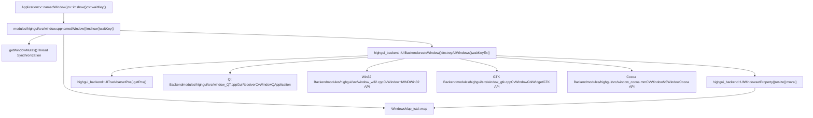
**来源：** [modules/highgui/src/window.cpp54-178](https://github.com/opencv/opencv/blob/91c78f50/modules/highgui/src/window.cpp#L54-L178) [modules/highgui/src/window\_QT.cpp117-166](https://github.com/opencv/opencv/blob/91c78f50/modules/highgui/src/window_QT.cpp#L117-L166) [modules/highgui/src/window\_w32.cpp148-234](https://github.com/opencv/opencv/blob/91c78f50/modules/highgui/src/window_w32.cpp#L148-L234) [modules/highgui/src/window\_gtk.cpp527-564](https://github.com/opencv/opencv/blob/91c78f50/modules/highgui/src/window_gtk.cpp#L527-L564)

该分发机制通过条件编译与运行时检查工作：

| 后端 | 编译标志 | 平台 | 主要类 |
| --- | --- | --- | --- |
| Qt | `HAVE_QT` | 跨平台 | `GuiReceiver`, `CvWindow`, `ViewPort` |
| Win32 | `HAVE_WIN32UI` | Windows | `CvWindow`, `CvTrackbar`（通过 HWND） |
| GTK | `HAVE_GTK` | Linux | `CvWindow`, `CvTrackbar`, `CvImageWidget` |
| Cocoa | `HAVE_COCOA` | macOS | `CVWindow`, `CVView`, `CVSlider` |
| Wayland | `HAVE_WAYLAND` | Linux | Wayland 专用实现 |

**来源：** [modules/highgui/src/precomp.hpp94-152](https://github.com/opencv/opencv/blob/91c78f50/modules/highgui/src/precomp.hpp#L94-L152) [modules/highgui/src/window.cpp182-215](https://github.com/opencv/opencv/blob/91c78f50/modules/highgui/src/window.cpp#L182-L215)

## 核心 API 函数与窗口生命周期

### 窗口管理 API

面向用户的核心函数构成了一个简洁但完整的窗口 API：

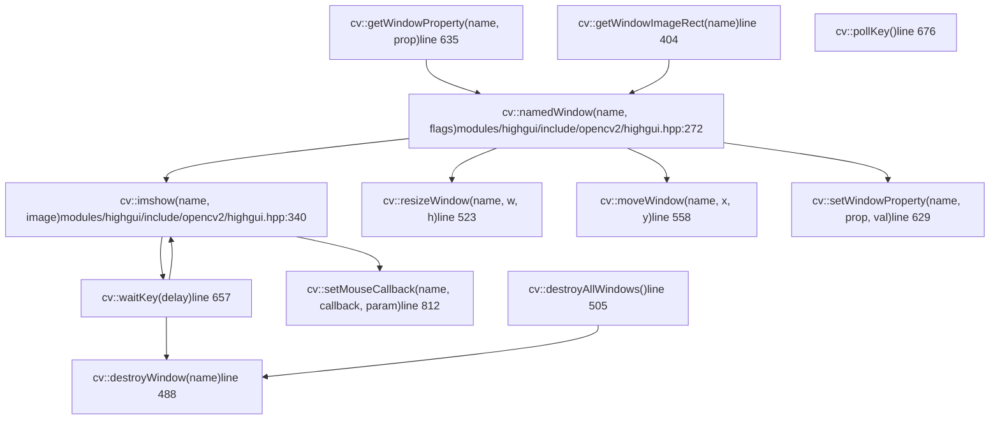
**来源：** [modules/highgui/include/opencv2/highgui.hpp248-527](https://github.com/opencv/opencv/blob/91c78f50/modules/highgui/include/opencv2/highgui.hpp#L248-L527) [modules/highgui/src/window.cpp448-695](https://github.com/opencv/opencv/blob/91c78f50/modules/highgui/src/window.cpp#L448-L695)

### 窗口生命周期状态机

**来源：** [modules/highgui/src/window.cpp448-521](https://github.com/opencv/opencv/blob/91c78f50/modules/highgui/src/window.cpp#L448-L521) [modules/highgui/src/window\_w32.cpp570-639](https://github.com/opencv/opencv/blob/91c78f50/modules/highgui/src/window_w32.cpp#L570-L639)

### 窗口标志与属性

窗口行为通过创建时标志与运行时属性控制：

| 标志/属性 | 值 | 说明 |
| --- | --- | --- |
| `WINDOW_NORMAL` | `0x00000000` | 可调整大小窗口 |
| `WINDOW_AUTOSIZE` | `0x00000001` | 固定为图像大小 |
| `WINDOW_OPENGL` | `0x00001000` | 启用 OpenGL 渲染 |
| `WINDOW_FULLSCREEN` | `1` | 全屏模式 |
| `WINDOW_FREERATIO` | `0x00000100` | 不限制宽高比 |
| `WINDOW_KEEPRATIO` | `0x00000000` | 保持宽高比 |
| `WND_PROP_FULLSCREEN` | `0` | 查询/设置全屏状态 |
| `WND_PROP_AUTOSIZE` | `1` | 查询/设置自动尺寸状态 |
| `WND_PROP_ASPECT_RATIO` | `2` | 查询/设置宽高比模式 |
| `WND_PROP_OPENGL` | `3` | 查询 OpenGL 支持 |
| `WND_PROP_VISIBLE` | `4` | 查询窗口可见性 |
| `WND_PROP_TOPMOST` | `5` | 设置窗口置顶 |
| `WND_PROP_VSYNC` | `6` | 启用/禁用 VSync（OpenGL） |

**来源：** [modules/highgui/include/opencv2/highgui.hpp142-163](https://github.com/opencv/opencv/blob/91c78f50/modules/highgui/include/opencv2/highgui.hpp#L142-L163) [modules/highgui/src/window.cpp190-273](https://github.com/opencv/opencv/blob/91c78f50/modules/highgui/src/window.cpp#L190-L273)

## 用户输入处理

### 键盘输入流程

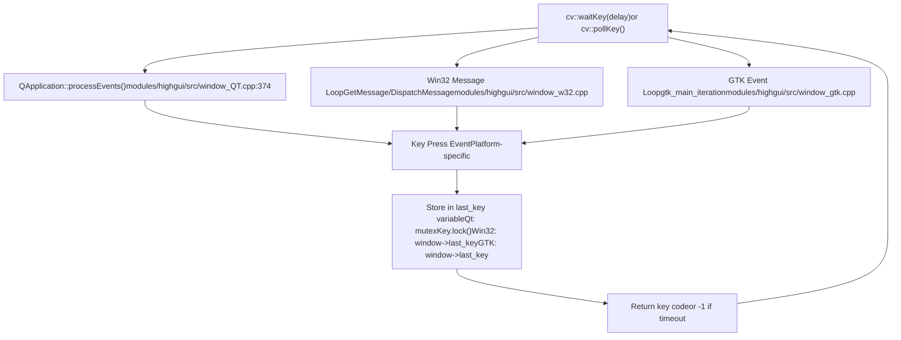
**来源：** [modules/highgui/src/window.cpp641-695](https://github.com/opencv/opencv/blob/91c78f50/modules/highgui/src/window.cpp#L641-L695) [modules/highgui/src/window\_QT.cpp343-415](https://github.com/opencv/opencv/blob/91c78f50/modules/highgui/src/window_QT.cpp#L343-L415) [modules/highgui/src/window\_w32.cpp1600-1750](https://github.com/opencv/opencv/blob/91c78f50/modules/highgui/src/window_w32.cpp#L1600-L1750) [modules/highgui/src/window\_gtk.cpp1200-1350](https://github.com/opencv/opencv/blob/91c78f50/modules/highgui/src/window_gtk.cpp#L1200-L1350)

`waitKey()` 函数承担双重职责：

1.  **事件处理**：处理窗口更新与重绘所需的 GUI 事件
2.  **输入获取**：带可选超时返回键盘输入

关键实现细节：

-   **Qt 后端**：使用带互斥锁的 `QWaitCondition` 进行线程安全键值存储 [modules/highgui/src/window\_QT.cpp106-415](https://github.com/opencv/opencv/blob/91c78f50/modules/highgui/src/window_QT.cpp#L106-L415)
-   **Win32 后端**：在紧凑循环中以 `Sleep(1)` 轮询消息队列 [modules/highgui/src/window\_w32.cpp1600-1750](https://github.com/opencv/opencv/blob/91c78f50/modules/highgui/src/window_w32.cpp#L1600-L1750)
-   **GTK 后端**：调用 `gtk_main_iteration()` 处理待处理事件 [modules/highgui/src/window\_gtk.cpp1200-1350](https://github.com/opencv/opencv/blob/91c78f50/modules/highgui/src/window_gtk.cpp#L1200-L1350)

### 鼠标事件处理

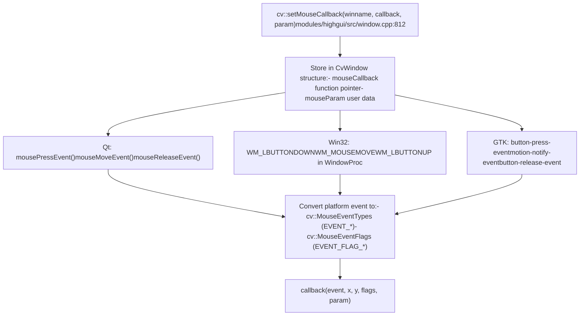
**来源：** [modules/highgui/src/window.cpp812-850](https://github.com/opencv/opencv/blob/91c78f50/modules/highgui/src/window.cpp#L812-L850) [modules/highgui/src/window\_QT.h386-393](https://github.com/opencv/opencv/blob/91c78f50/modules/highgui/src/window_QT.h#L386-L393) [modules/highgui/src/window\_w32.cpp1400-1600](https://github.com/opencv/opencv/blob/91c78f50/modules/highgui/src/window_w32.cpp#L1400-L1600) [modules/highgui/src/window\_gtk.cpp850-1050](https://github.com/opencv/opencv/blob/91c78f50/modules/highgui/src/window_gtk.cpp#L850-L1050)

鼠标事件类型与标志：

| 事件类型 | 值 | 说明 |
| --- | --- | --- |
| `EVENT_MOUSEMOVE` | 0 | 鼠标移动 |
| `EVENT_LBUTTONDOWN` | 1 | 左键按下 |
| `EVENT_RBUTTONDOWN` | 2 | 右键按下 |
| `EVENT_MBUTTONDOWN` | 3 | 中键按下 |
| `EVENT_LBUTTONUP` | 4 | 左键释放 |
| `EVENT_RBUTTONUP` | 5 | 右键释放 |
| `EVENT_MBUTTONUP` | 6 | 中键释放 |
| `EVENT_LBUTTONDBLCLK` | 7 | 左键双击 |
| `EVENT_MOUSEWHEEL` | 10 | 鼠标滚轮滚动 |

| 事件标志 | 值 | 说明 |
| --- | --- | --- |
| `EVENT_FLAG_LBUTTON` | 1 | 左键按住 |
| `EVENT_FLAG_RBUTTON` | 2 | 右键按住 |
| `EVENT_FLAG_MBUTTON` | 4 | 中键按住 |
| `EVENT_FLAG_CTRLKEY` | 8 | Ctrl 键按住 |
| `EVENT_FLAG_SHIFTKEY` | 16 | Shift 键按住 |
| `EVENT_FLAG_ALTKEY` | 32 | Alt 键按住 |

**来源：** [modules/highgui/include/opencv2/highgui.hpp166-189](https://github.com/opencv/opencv/blob/91c78f50/modules/highgui/include/opencv2/highgui.hpp#L166-L189) [modules/highgui/include/opencv2/highgui/highgui\_c.h170-194](https://github.com/opencv/opencv/blob/91c78f50/modules/highgui/include/opencv2/highgui/highgui_c.h#L170-L194)

## 交互控件：Trackbar

Trackbar（滑块）提供附着于窗口的简单数值输入控件。不同后端实现差异较大：

### Trackbar 架构

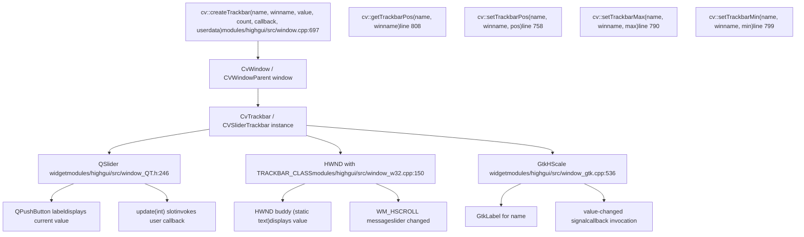
**来源：** [modules/highgui/src/window.cpp697-810](https://github.com/opencv/opencv/blob/91c78f50/modules/highgui/src/window.cpp#L697-L810) [modules/highgui/src/window\_QT.h246-268](https://github.com/opencv/opencv/blob/91c78f50/modules/highgui/src/window_QT.h#L246-L268) [modules/highgui/src/window\_w32.cpp150-178](https://github.com/opencv/opencv/blob/91c78f50/modules/highgui/src/window_w32.cpp#L150-L178) [modules/highgui/src/window\_gtk.cpp536-563](https://github.com/opencv/opencv/blob/91c78f50/modules/highgui/src/window_gtk.cpp#L536-L563)

### Trackbar 回调机制

现代 Trackbar API 使用带用户数据的 `TrackbarCallback`，同时旧 API 保留已弃用回调支持：

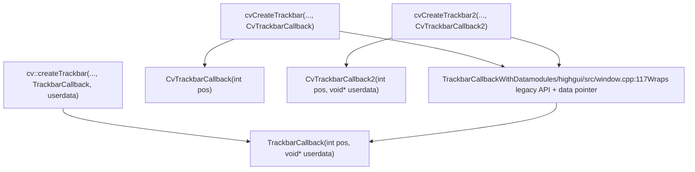
**来源：** [modules/highgui/include/opencv2/highgui.hpp235](https://github.com/opencv/opencv/blob/91c78f50/modules/highgui/include/opencv2/highgui.hpp#L235-L235) [modules/highgui/src/window.cpp117-176](https://github.com/opencv/opencv/blob/91c78f50/modules/highgui/src/window.cpp#L117-L176) [modules/highgui/include/opencv2/highgui/highgui\_c.h152-162](https://github.com/opencv/opencv/blob/91c78f50/modules/highgui/include/opencv2/highgui/highgui_c.h#L152-L162)

`TrackbarCallbackWithData` 包装器在支持已弃用 `int*` 值指针传参模式的同时保持向后兼容 [modules/highgui/src/window.cpp117-150](https://github.com/opencv/opencv/blob/91c78f50/modules/highgui/src/window.cpp#L117-L150)。现代代码应将值指针设为 `NULL`，并改用回调中的 `pos` 参数。

## 后端特定实现

每个后端都以平台特有原语实现相同概念模型：

### Qt 后端架构

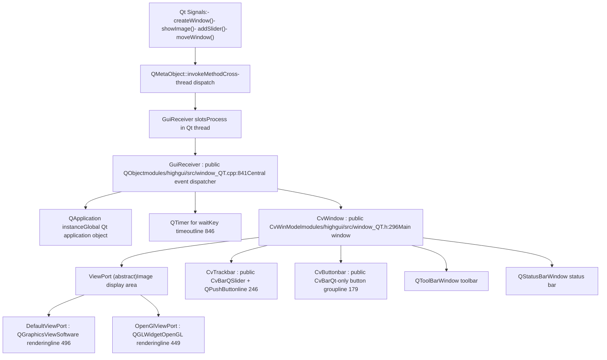
**来源：** [modules/highgui/src/window\_QT.cpp117-880](https://github.com/opencv/opencv/blob/91c78f50/modules/highgui/src/window_QT.cpp#L117-L880) [modules/highgui/src/window\_QT.h117-383](https://github.com/opencv/opencv/blob/91c78f50/modules/highgui/src/window_QT.h#L117-L383)

Qt 后端独有特性：

-   **线程安全**：跨线程调用使用 `QMetaObject::invokeMethod` 与 `autoBlockingConnection()` [modules/highgui/src/window\_QT.cpp116-125](https://github.com/opencv/opencv/blob/91c78f50/modules/highgui/src/window_QT.cpp#L116-L125)
-   **多线程**：通过 `cvStartLoop()` 可选启用多线程模式 [modules/highgui/src/window\_QT.cpp421-426](https://github.com/opencv/opencv/blob/91c78f50/modules/highgui/src/window_QT.cpp#L421-L426)
-   **扩展 GUI**：支持工具栏、状态栏与按钮控件 [modules/highgui/src/window\_QT.h342-348](https://github.com/opencv/opencv/blob/91c78f50/modules/highgui/src/window_QT.h#L342-L348)
-   **设置持久化**：可通过 `cvSaveWindowParameters()` 保存/加载窗口位置 [modules/highgui/src/window\_QT.cpp305-326](https://github.com/opencv/opencv/blob/91c78f50/modules/highgui/src/window_QT.cpp#L305-L326)

### Win32 后端架构

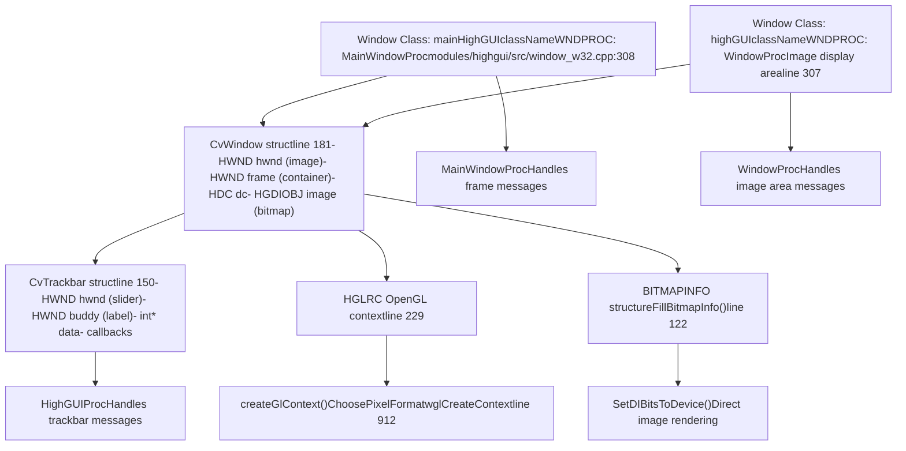
**来源：** [modules/highgui/src/window\_w32.cpp148-1000](https://github.com/opencv/opencv/blob/91c78f50/modules/highgui/src/window_w32.cpp#L148-L1000)

Win32 后端实现细节：

-   **双窗口设计**：外层框架窗口包含内层图像窗口 [modules/highgui/src/window\_w32.cpp1100-1200](https://github.com/opencv/opencv/blob/91c78f50/modules/highgui/src/window_w32.cpp#L1100-L1200)
-   **位图渲染**：使用 `BITMAPINFO` 与 `SetDIBitsToDevice()` 实现高效图像显示 [modules/highgui/src/window\_w32.cpp122-1500](https://github.com/opencv/opencv/blob/91c78f50/modules/highgui/src/window_w32.cpp#L122-L1500)
-   **注册表持久化**：在 Windows 注册表中保存窗口位置 [modules/highgui/src/window\_w32.cpp397-521](https://github.com/opencv/opencv/blob/91c78f50/modules/highgui/src/window_w32.cpp#L397-L521)
-   **通过 WGL 的 OpenGL**：通过 `wglCreateContext()` 可选启用 OpenGL 渲染 [modules/highgui/src/window\_w32.cpp912-1000](https://github.com/opencv/opencv/blob/91c78f50/modules/highgui/src/window_w32.cpp#L912-L1000)

### GTK 后端架构

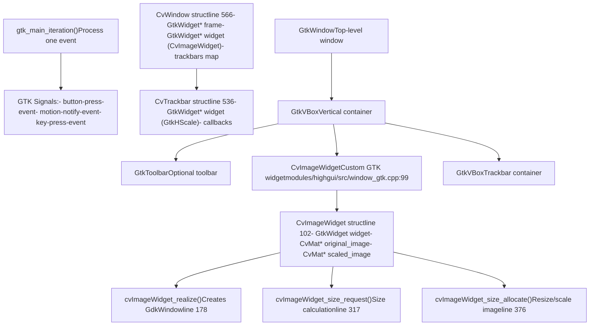
**来源：** [modules/highgui/src/window\_gtk.cpp99-680](https://github.com/opencv/opencv/blob/91c78f50/modules/highgui/src/window_gtk.cpp#L99-L680)

GTK 后端特征：

-   **自定义控件**：`CvImageWidget` 是处理图像显示的自定义 `GtkWidget` 子类 [modules/highgui/src/window\_gtk.cpp99-524](https://github.com/opencv/opencv/blob/91c78f50/modules/highgui/src/window_gtk.cpp#L99-L524)
-   **类型系统**：使用 GLib 类型系统与 `G_TYPE_CHECK_INSTANCE_CAST` 宏 [modules/highgui/src/window\_gtk.cpp119-121](https://github.com/opencv/opencv/blob/91c78f50/modules/highgui/src/window_gtk.cpp#L119-L121)
-   **自动缩放**：在 `size_allocate` 回调中按窗口大小缩放图像 [modules/highgui/src/window\_gtk.cpp376-436](https://github.com/opencv/opencv/blob/91c78f50/modules/highgui/src/window_gtk.cpp#L376-L436)
-   **GTK2/GTK3 支持**：对两种 GTK 版本进行条件编译 [modules/highgui/src/window\_gtk.cpp57-65](https://github.com/opencv/opencv/blob/91c78f50/modules/highgui/src/window_gtk.cpp#L57-L65)

### Cocoa 后端架构

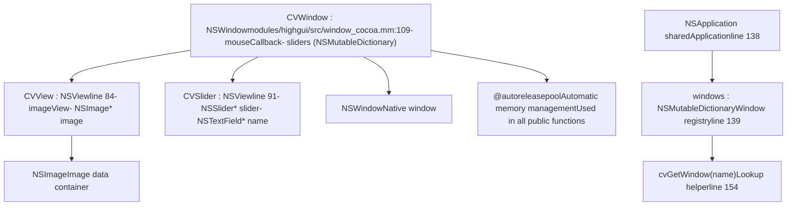
**来源：** [modules/highgui/src/window\_cocoa.mm84-164](https://github.com/opencv/opencv/blob/91c78f50/modules/highgui/src/window_cocoa.mm#L84-L164)

Cocoa 后端特性：

-   **Objective-C++**：使用 `.mm` 扩展进行 Objective-C++ 实现 [modules/highgui/src/window\_cocoa.mm1-48](https://github.com/opencv/opencv/blob/91c78f50/modules/highgui/src/window_cocoa.mm#L1-L48)
-   **自动释放池**：所有 API 函数都包裹在 `@autoreleasepool` 代码块中 [modules/highgui/src/window\_cocoa.mm156-183](https://github.com/opencv/opencv/blob/91c78f50/modules/highgui/src/window_cocoa.mm#L156-L183)
-   **基于字典的注册表**：窗口按名称存储在 `NSMutableDictionary` 中 [modules/highgui/src/window\_cocoa.mm139-164](https://github.com/opencv/opencv/blob/91c78f50/modules/highgui/src/window_cocoa.mm#L139-L164)
-   **Retina 显示支持**：通过 `convertSizeFromBacking:` 处理高 DPI 显示 [modules/highgui/src/window\_cocoa.mm221-236](https://github.com/opencv/opencv/blob/91c78f50/modules/highgui/src/window_cocoa.mm#L221-L236)

## 数据结构与内存管理

### 窗口管理结构

各后端维护窗口状态的方式不同，但遵循相似模式：

**Qt 后端：**

```
// modules/highgui/src/window_QT.h:296-383class CvWindow : public CvWinModel {    QString name;    ViewPort* myView;          // Image display (DefaultViewPort or OpenGlViewPort)    QBoxLayout* myGlobalLayout;    QBoxLayout* myBarLayout;   // Trackbar container    QToolBar* myToolBar;    QStatusBar* myStatusBar;    int param_flags;           // WINDOW_AUTOSIZE, etc.    int param_gui_mode;        // CV_GUI_NORMAL or CV_GUI_EXPANDED    // ...};
```
**Win32 后端：**

```
// modules/highgui/src/window_w32.cpp:181-234struct CvWindow {    int signature;             // CV_WINDOW_MAGIC_VAL    cv::Mutex mutex;    HWND hwnd;                 // Image window    HWND frame;                // Container window    HDC dc;                    // Device context    HGDIOBJ image;             // Bitmap handle    int flags;                 // WINDOW_AUTOSIZE, etc.    CvMouseCallback on_mouse;    void* on_mouse_param;    struct {        HWND toolbar;        std::vector<std::shared_ptr<CvTrackbar>> trackbars;    } toolbar;    bool useGl;                // OpenGL enabled    HGLRC hGLRC;               // OpenGL context    // ...};
```
**GTK 后端：**

```
// modules/highgui/src/window_gtk.cpp:566-680struct CvWindow {    int signature;             // CV_WINDOW_MAGIC_VAL    GtkWidget* frame;          // GtkWindow    GtkWidget* widget;         // CvImageWidget    GtkWidget* pane;           // Container    int flags;    int status;                // Fullscreen state    CvMouseCallback on_mouse;    void* on_mouse_param;    std::map<std::string, std::shared_ptr<CvTrackbar>> trackbars;    // ...};
```
**来源：** [modules/highgui/src/window\_QT.h296-383](https://github.com/opencv/opencv/blob/91c78f50/modules/highgui/src/window_QT.h#L296-L383) [modules/highgui/src/window\_w32.cpp181-234](https://github.com/opencv/opencv/blob/91c78f50/modules/highgui/src/window_w32.cpp#L181-L234) [modules/highgui/src/window\_gtk.cpp566-680](https://github.com/opencv/opencv/blob/91c78f50/modules/highgui/src/window_gtk.cpp#L566-L680)

### Trackbar 结构

**Win32 后端：**

```
// modules/highgui/src/window_w32.cpp:150-178struct CvTrackbar {    int signature;             // CV_TRACKBAR_MAGIC_VAL    HWND hwnd;                 // Slider control    std::string name;    CvWindow* parent;    HWND buddy;                // Value display label    int* data;                 // Deprecated: direct value pointer    int pos, maxval, minval;    void (*notify)(int);       // Deprecated callback    void (*notify2)(int, void*); // Deprecated callback with userdata    TrackbarCallback onChangeCallback; // Modern callback    void* userdata;    // ...};
```
**GTK 后端：**

```
// modules/highgui/src/window_gtk.cpp:536-563struct CvTrackbar {    int signature;             // CV_TRACKBAR_MAGIC_VAL    GtkWidget* widget;         // GtkHScale slider    std::string name;    CvWindow* parent;    int* data;    int pos, maxval, minval;    CvTrackbarCallback notify;    CvTrackbarCallback2 notify2;    TrackbarCallback onChangeCallback;    void* userdata;};
```
**来源：** [modules/highgui/src/window\_w32.cpp150-178](https://github.com/opencv/opencv/blob/91c78f50/modules/highgui/src/window_w32.cpp#L150-L178) [modules/highgui/src/window\_gtk.cpp536-563](https://github.com/opencv/opencv/blob/91c78f50/modules/highgui/src/window_gtk.cpp#L536-L563)

### 窗口注册表与清理

公共 API 层维护一个窗口注册表，以实现与后端无关的访问：

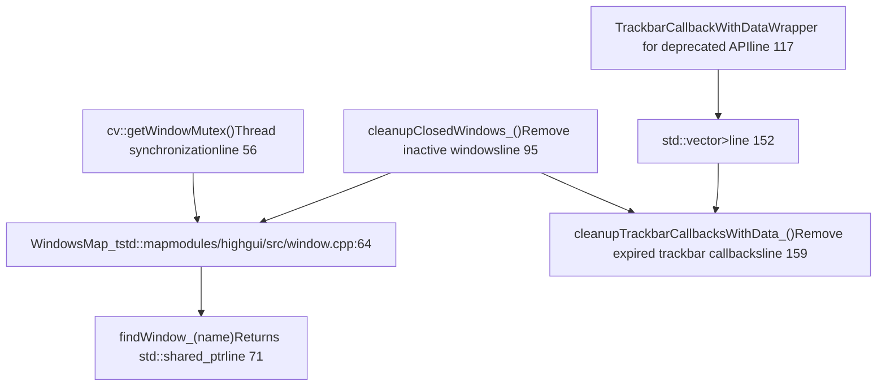
**来源：** [modules/highgui/src/window.cpp56-176](https://github.com/opencv/opencv/blob/91c78f50/modules/highgui/src/window.cpp#L56-L176)

该注册表使用：

-   **智能指针**：`std::shared_ptr` 自动管理内存
-   **弱指针**：在回调中用于检测已过期 trackbar [modules/highgui/src/window.cpp119-175](https://github.com/opencv/opencv/blob/91c78f50/modules/highgui/src/window.cpp#L119-L175)
-   **周期清理**：在窗口操作期间调用 `cleanupClosedWindows_()` 移除失效条目
-   **线程安全**：所有注册表操作均由 `getWindowMutex()` 保护

## OpenGL 支持（可选）

当使用 `HAVE_OPENGL` 编译时，highgui 提供 OpenGL 渲染作为原生图像显示的替代：

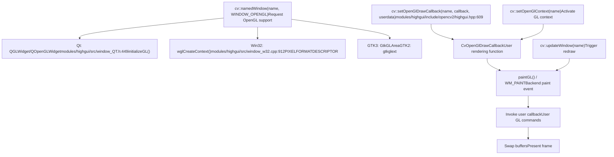
**来源：** [modules/highgui/include/opencv2/highgui.hpp609-663](https://github.com/opencv/opencv/blob/91c78f50/modules/highgui/include/opencv2/highgui.hpp#L609-L663) [modules/highgui/src/window\_QT.h449-492](https://github.com/opencv/opencv/blob/91c78f50/modules/highgui/src/window_QT.h#L449-L492) [modules/highgui/src/window\_w32.cpp908-1000](https://github.com/opencv/opencv/blob/91c78f50/modules/highgui/src/window_w32.cpp#L908-L1000)

OpenGL 功能：

-   **双缓冲**：所有后端均使用双缓冲 OpenGL 上下文
-   **VSync 控制**：Win32 后端支持 `WND_PROP_VSYNC` 控制垂直同步 [modules/highgui/src/window\_w32.cpp753-805](https://github.com/opencv/opencv/blob/91c78f50/modules/highgui/src/window_w32.cpp#L753-L805)
-   **上下文管理**：`setOpenGlContext()` 将 GL 上下文设为当前，便于直接调用 GL
-   **自定义绘制**：在绘制事件中调用用户回调，提供完整渲染控制

OpenGL 专用函数：

-   `cv::setOpenGlDrawCallback(winname, callback, userdata)` - 注册渲染回调
-   `cv::setOpenGlContext(winname)` - 激活 GL 上下文
-   `cv::updateWindow(winname)` - 强制窗口重绘

**来源：** [modules/highgui/include/opencv2/highgui.hpp609-663](https://github.com/opencv/opencv/blob/91c78f50/modules/highgui/include/opencv2/highgui.hpp#L609-L663) [modules/highgui/src/window\_w32.cpp780-815](https://github.com/opencv/opencv/blob/91c78f50/modules/highgui/src/window_w32.cpp#L780-L815)

## API 函数实现流程

### imshow() 执行路径

> **[Mermaid sequence]**
> *(图表结构无法解析)*

**来源：** [modules/highgui/src/window.cpp760-810](https://github.com/opencv/opencv/blob/91c78f50/modules/highgui/src/window.cpp#L760-L810) [modules/highgui/src/window\_QT.cpp1080-1109](https://github.com/opencv/opencv/blob/91c78f50/modules/highgui/src/window_QT.cpp#L1080-L1109) [modules/highgui/src/window\_w32.cpp1450-1550](https://github.com/opencv/opencv/blob/91c78f50/modules/highgui/src/window_w32.cpp#L1450-L1550)

### waitKey() 事件处理循环

> **[Mermaid sequence]**
> *(图表结构无法解析)*

**来源：** [modules/highgui/src/window.cpp641-671](https://github.com/opencv/opencv/blob/91c78f50/modules/highgui/src/window.cpp#L641-L671) [modules/highgui/src/window\_QT.cpp343-415](https://github.com/opencv/opencv/blob/91c78f50/modules/highgui/src/window_QT.cpp#L343-L415) [modules/highgui/src/window\_w32.cpp1600-1750](https://github.com/opencv/opencv/blob/91c78f50/modules/highgui/src/window_w32.cpp#L1600-L1750)

关键实现差异：

-   **Qt**：使用带超时的 `QWaitCondition` 高效等待
-   **Win32**：处理消息时通过 `Sleep(1)` 忙轮询
-   **GTK**：在跟踪超时的同时重复调用 `gtk_main_iteration()`

## 总结：关键组件及其职责

| 组件 | 位置 | 用途 |
| --- | --- | --- |
| `cv::namedWindow()` | [modules/highgui/src/window.cpp448](https://github.com/opencv/opencv/blob/91c78f50/modules/highgui/src/window.cpp#L448-L448) | 按指定标志创建窗口 |
| `cv::imshow()` | [modules/highgui/src/window.cpp760](https://github.com/opencv/opencv/blob/91c78f50/modules/highgui/src/window.cpp#L760-L760) | 在窗口中显示图像 |
| `cv::waitKey()` | [modules/highgui/src/window.cpp657](https://github.com/opencv/opencv/blob/91c78f50/modules/highgui/src/window.cpp#L657-L657) | 处理事件并等待键盘输入 |
| `cv::setMouseCallback()` | [modules/highgui/src/window.cpp812](https://github.com/opencv/opencv/blob/91c78f50/modules/highgui/src/window.cpp#L812-L812) | 注册鼠标事件处理器 |
| `cv::createTrackbar()` | [modules/highgui/src/window.cpp697](https://github.com/opencv/opencv/blob/91c78f50/modules/highgui/src/window.cpp#L697-L697) | 向窗口添加滑块控件 |
| `GuiReceiver` (Qt) | [modules/highgui/src/window\_QT.cpp117](https://github.com/opencv/opencv/blob/91c78f50/modules/highgui/src/window_QT.cpp#L117-L117) | Qt 后端中央分发器 |
| `CvWindow` (Win32) | [modules/highgui/src/window\_w32.cpp181](https://github.com/opencv/opencv/blob/91c78f50/modules/highgui/src/window_w32.cpp#L181-L181) | Win32 后端窗口结构 |
| `CvWindow` (GTK) | [modules/highgui/src/window\_gtk.cpp566](https://github.com/opencv/opencv/blob/91c78f50/modules/highgui/src/window_gtk.cpp#L566-L566) | GTK 后端窗口结构 |
| `CVWindow` (Cocoa) | [modules/highgui/src/window\_cocoa.mm109](https://github.com/opencv/opencv/blob/91c78f50/modules/highgui/src/window_cocoa.mm#L109-L109) | Cocoa 后端窗口类 |
| `CvImageWidget` (GTK) | [modules/highgui/src/window\_gtk.cpp99](https://github.com/opencv/opencv/blob/91c78f50/modules/highgui/src/window_gtk.cpp#L99-L99) | GTK 图像显示自定义控件 |
| `WindowsMap_t` | [modules/highgui/src/window.cpp64](https://github.com/opencv/opencv/blob/91c78f50/modules/highgui/src/window.cpp#L64-L64) | 全局窗口注册表 |
| `getWindowMutex()` | [modules/highgui/src/window.cpp56](https://github.com/opencv/opencv/blob/91c78f50/modules/highgui/src/window.cpp#L56-L56) | 线程同步原语 |

**来源：** [modules/highgui/src/window.cpp](https://github.com/opencv/opencv/blob/91c78f50/modules/highgui/src/window.cpp) [modules/highgui/src/window\_QT.cpp](https://github.com/opencv/opencv/blob/91c78f50/modules/highgui/src/window_QT.cpp) [modules/highgui/src/window\_w32.cpp](https://github.com/opencv/opencv/blob/91c78f50/modules/highgui/src/window_w32.cpp) [modules/highgui/src/window\_gtk.cpp](https://github.com/opencv/opencv/blob/91c78f50/modules/highgui/src/window_gtk.cpp) [modules/highgui/src/window\_cocoa.mm](https://github.com/opencv/opencv/blob/91c78f50/modules/highgui/src/window_cocoa.mm)
