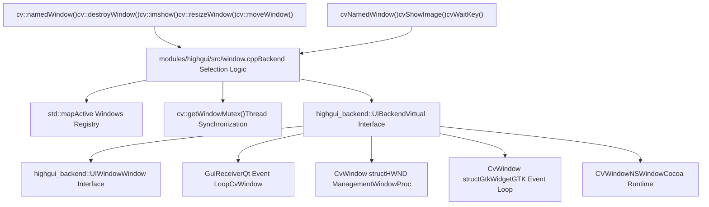
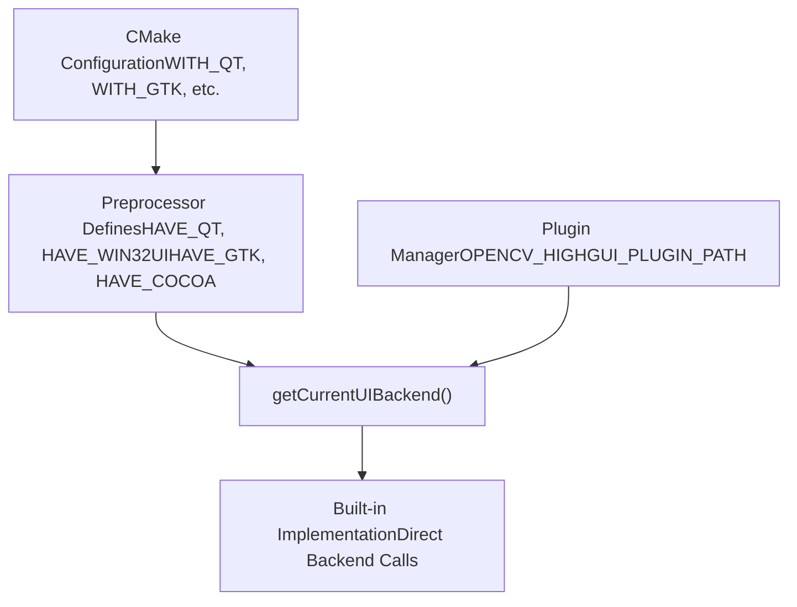
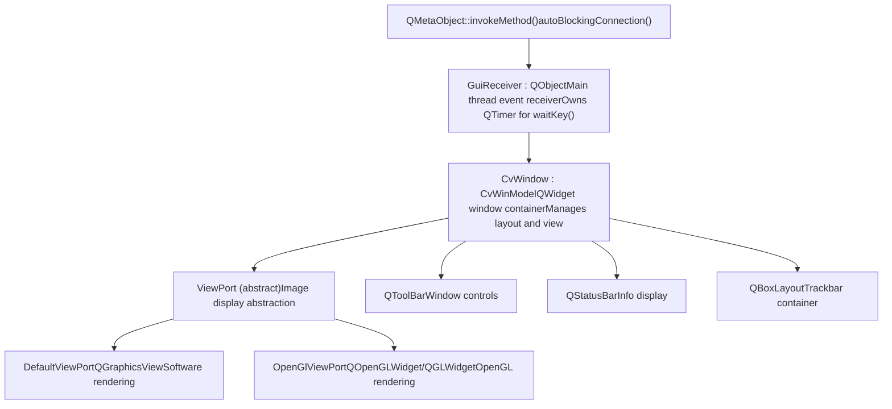
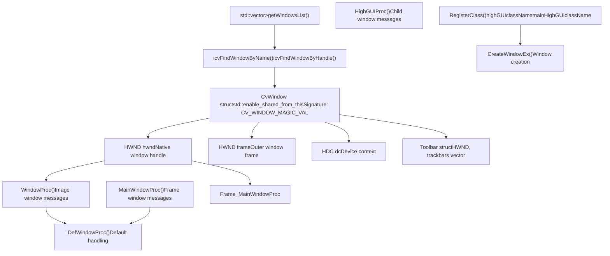
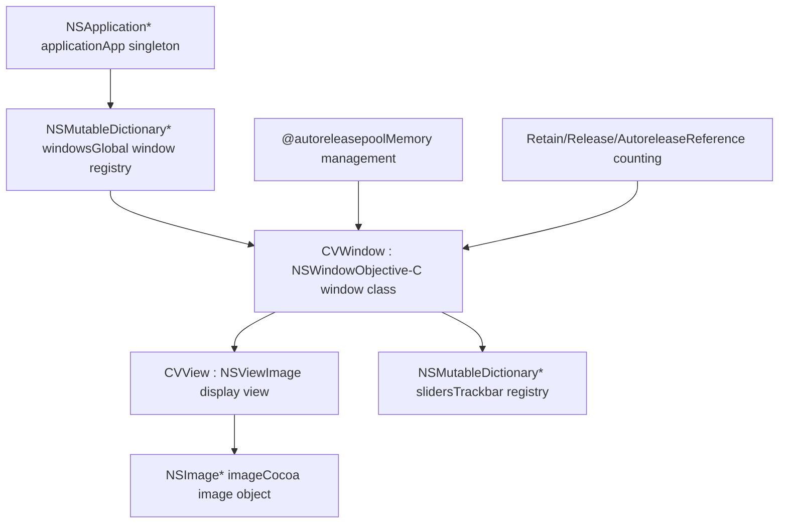
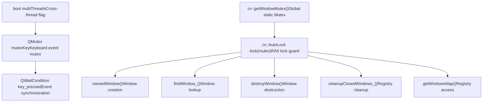
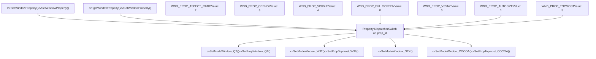
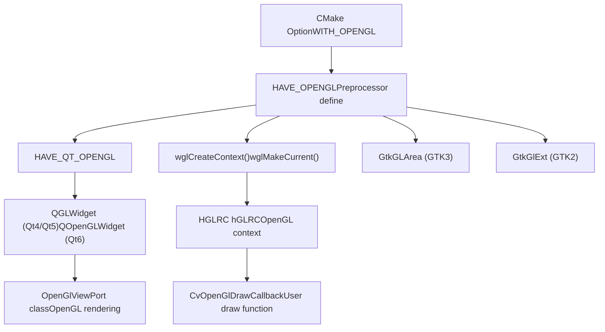
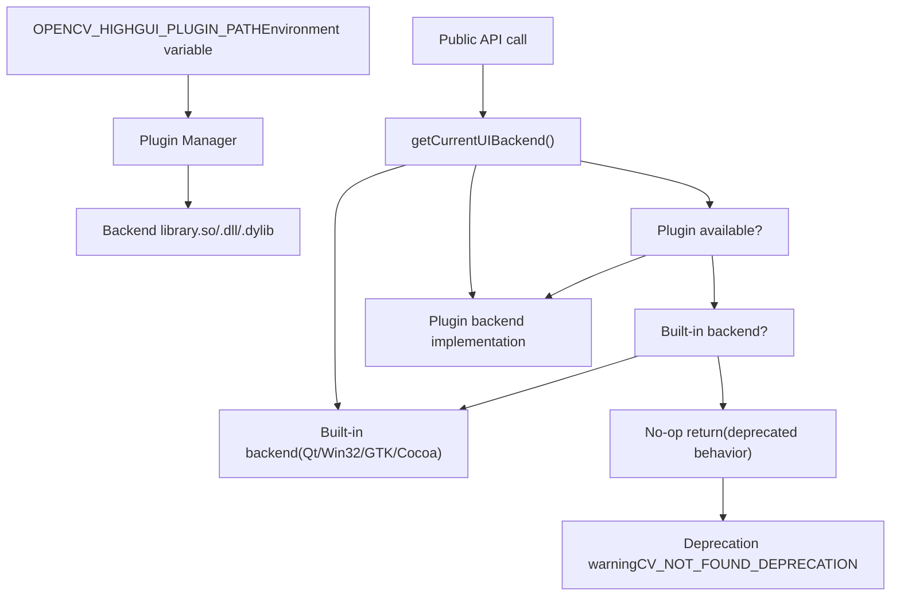

# 窗口管理与多后端 GUI

相关源文件

-   [CMakeLists.txt](https://github.com/opencv/opencv/blob/91c78f50/CMakeLists.txt)
-   [cmake/OpenCVCRTLinkage.cmake](https://github.com/opencv/opencv/blob/91c78f50/cmake/OpenCVCRTLinkage.cmake)
-   [cmake/OpenCVCompilerOptions.cmake](https://github.com/opencv/opencv/blob/91c78f50/cmake/OpenCVCompilerOptions.cmake)
-   [cmake/OpenCVDetectCXXCompiler.cmake](https://github.com/opencv/opencv/blob/91c78f50/cmake/OpenCVDetectCXXCompiler.cmake)
-   [cmake/OpenCVFindLibsGUI.cmake](https://github.com/opencv/opencv/blob/91c78f50/cmake/OpenCVFindLibsGUI.cmake)
-   [cmake/OpenCVFindLibsVideo.cmake](https://github.com/opencv/opencv/blob/91c78f50/cmake/OpenCVFindLibsVideo.cmake)
-   [cmake/OpenCVModule.cmake](https://github.com/opencv/opencv/blob/91c78f50/cmake/OpenCVModule.cmake)
-   [cmake/OpenCVPCHSupport.cmake](https://github.com/opencv/opencv/blob/91c78f50/cmake/OpenCVPCHSupport.cmake)
-   [cmake/OpenCVUtils.cmake](https://github.com/opencv/opencv/blob/91c78f50/cmake/OpenCVUtils.cmake)
-   [cmake/templates/OpenCVConfig.root-WIN32.cmake.in](https://github.com/opencv/opencv/blob/91c78f50/cmake/templates/OpenCVConfig.root-WIN32.cmake.in)
-   [cmake/templates/cvconfig.h.in](https://github.com/opencv/opencv/blob/91c78f50/cmake/templates/cvconfig.h.in)
-   [doc/tutorials/app/highgui\_wayland\_ubuntu.markdown](https://github.com/opencv/opencv/blob/91c78f50/doc/tutorials/app/highgui_wayland_ubuntu.markdown?plain=1)
-   [modules/core/CMakeLists.txt](https://github.com/opencv/opencv/blob/91c78f50/modules/core/CMakeLists.txt)
-   [modules/highgui/CMakeLists.txt](https://github.com/opencv/opencv/blob/91c78f50/modules/highgui/CMakeLists.txt)
-   [modules/highgui/cmake/detect\_wayland.cmake](https://github.com/opencv/opencv/blob/91c78f50/modules/highgui/cmake/detect_wayland.cmake)
-   [modules/highgui/include/opencv2/highgui.hpp](https://github.com/opencv/opencv/blob/91c78f50/modules/highgui/include/opencv2/highgui.hpp)
-   [modules/highgui/include/opencv2/highgui/highgui.hpp](https://github.com/opencv/opencv/blob/91c78f50/modules/highgui/include/opencv2/highgui/highgui.hpp)
-   [modules/highgui/include/opencv2/highgui/highgui\_c.h](https://github.com/opencv/opencv/blob/91c78f50/modules/highgui/include/opencv2/highgui/highgui_c.h)
-   [modules/highgui/src/precomp.hpp](https://github.com/opencv/opencv/blob/91c78f50/modules/highgui/src/precomp.hpp)
-   [modules/highgui/src/window.cpp](https://github.com/opencv/opencv/blob/91c78f50/modules/highgui/src/window.cpp)
-   [modules/highgui/src/window\_QT.cpp](https://github.com/opencv/opencv/blob/91c78f50/modules/highgui/src/window_QT.cpp)
-   [modules/highgui/src/window\_QT.h](https://github.com/opencv/opencv/blob/91c78f50/modules/highgui/src/window_QT.h)
-   [modules/highgui/src/window\_cocoa.mm](https://github.com/opencv/opencv/blob/91c78f50/modules/highgui/src/window_cocoa.mm)
-   [modules/highgui/src/window\_gtk.cpp](https://github.com/opencv/opencv/blob/91c78f50/modules/highgui/src/window_gtk.cpp)
-   [modules/highgui/src/window\_w32.cpp](https://github.com/opencv/opencv/blob/91c78f50/modules/highgui/src/window_w32.cpp)
-   [modules/highgui/src/window\_wayland.cpp](https://github.com/opencv/opencv/blob/91c78f50/modules/highgui/src/window_wayland.cpp)
-   [modules/highgui/test/test\_gui.cpp](https://github.com/opencv/opencv/blob/91c78f50/modules/highgui/test/test_gui.cpp)
-   [modules/highgui/test/test\_precomp.hpp](https://github.com/opencv/opencv/blob/91c78f50/modules/highgui/test/test_precomp.hpp)
-   [modules/java/CMakeLists.txt](https://github.com/opencv/opencv/blob/91c78f50/modules/java/CMakeLists.txt)
-   [modules/videoio/CMakeLists.txt](https://github.com/opencv/opencv/blob/91c78f50/modules/videoio/CMakeLists.txt)

## 目的与范围

本文档描述 OpenCV `highgui` 模块中的窗口管理系统。该系统通过统一 API 在多个平台后端上创建和管理 GUI 窗口。它将平台差异（Qt、GTK、Win32、Cocoa、WinRT、Wayland）抽象在通用接口之后，从而支持跨平台可视化代码。

关于事件处理（鼠标回调、trackbar、按钮），请参见 [Event Handling and Interactive Elements](/opencv/opencv/10.2-event-handling-and-interactive-elements)。关于图像/视频 I/O 功能，请参见 [Image File I/O and Codec System](/opencv/opencv/7.1-image-file-io-and-codec-system) 与 [Video Capture and Backend Architecture](/opencv/opencv/7.2-video-capture-and-backend-architecture)。

## 架构概览

highgui 模块实现了**分发器模式**，将窗口操作路由到平台特定后端实现。该设计使同一客户端代码无需修改即可在任意受支持平台运行。

**来源**: [modules/highgui/src/window.cpp54-91](https://github.com/opencv/opencv/blob/91c78f50/modules/highgui/src/window.cpp#L54-L91) [modules/highgui/src/precomp.hpp90-152](https://github.com/opencv/opencv/blob/91c78f50/modules/highgui/src/precomp.hpp#L90-L152) [modules/highgui/include/opencv2/highgui.hpp132-272](https://github.com/opencv/opencv/blob/91c78f50/modules/highgui/include/opencv2/highgui.hpp#L132-L272)

### 后端选择机制

后端选择既发生在**编译期**（通过预处理器指令），也可在**运行期**（启用插件加载时）发生。

**来源**: [modules/highgui/src/window.cpp182-273](https://github.com/opencv/opencv/blob/91c78f50/modules/highgui/src/window.cpp#L182-L273) [modules/highgui/src/precomp.hpp45-51](https://github.com/opencv/opencv/blob/91c78f50/modules/highgui/src/precomp.hpp#L45-L51)

## 窗口存储与生命周期

### 窗口注册表

窗口在一个受全局互斥锁保护的集中注册表中跟踪。每个窗口通过名称字符串标识。

| 组件 | 类型 | 用途 |
| --- | --- | --- |
| `getWindowsMap()` | `std::map<std::string, UIWindowBase::Ptr>` | 将窗口名映射到窗口对象 |
| `getWindowMutex()` | `cv::Mutex` | 保护对注册表的并发访问 |
| `findWindow_()` | 辅助函数 | 线程安全窗口查找 |
| `cleanupClosedWindows_()` | 清理函数 | 从注册表移除不活跃窗口 |

**来源**: [modules/highgui/src/window.cpp64-114](https://github.com/opencv/opencv/blob/91c78f50/modules/highgui/src/window.cpp#L64-L114)

### 窗口生命周期状态机

> **[Mermaid stateDiagram]**
> *(图表结构无法解析)*

**来源**: [modules/highgui/src/window.cpp448-503](https://github.com/opencv/opencv/blob/91c78f50/modules/highgui/src/window.cpp#L448-L503) [modules/highgui/src/window\_QT.cpp1039-1053](https://github.com/opencv/opencv/blob/91c78f50/modules/highgui/src/window_QT.cpp#L1039-L1053)

## 后端实现

每个后端都提供窗口操作的平台特定实现。由于平台 GUI 工具包要求不同，这些实现差异显著。

### Qt 后端架构

Qt 后端使用**接收器-槽模式**，并通过 Qt 信号槽机制进行线程安全方法调用。

**关键特性**：

-   **线程安全**：`autoBlockingConnection()` [modules/highgui/src/window\_QT.cpp121-125](https://github.com/opencv/opencv/blob/91c78f50/modules/highgui/src/window_QT.cpp#L121-L125) 会自动在跨线程调用时选择 `Qt::BlockingQueuedConnection`，同线程调用时选择 `Qt::DirectConnection`
-   **多线程支持**：当调用来自非主线程时会检测 `multiThreads` 标志 [modules/highgui/src/window\_QT.cpp560-569](https://github.com/opencv/opencv/blob/91c78f50/modules/highgui/src/window_QT.cpp#L560-L569)
-   **事件循环**：`GuiReceiver::start()` 会启动 `qApp->exec()` 以执行独立 Qt 事件处理 [modules/highgui/src/window\_QT.cpp1301-1304](https://github.com/opencv/opencv/blob/91c78f50/modules/highgui/src/window_QT.cpp#L1301-L1304)

**来源**: [modules/highgui/src/window\_QT.cpp117-853](https://github.com/opencv/opencv/blob/91c78f50/modules/highgui/src/window_QT.cpp#L117-L853) [modules/highgui/src/window\_QT.h117-383](https://github.com/opencv/opencv/blob/91c78f50/modules/highgui/src/window_QT.h#L117-L383)

### Win32 后端架构

Win32 后端使用原生 Windows API、窗口过程回调与共享指针管理。

**关键特性**：

-   **签名校验**：每个 `CvWindow` 都有 `signature = CV_WINDOW_MAGIC_VAL`，用于安全指针校验 [modules/highgui/src/window\_w32.cpp181-194](https://github.com/opencv/opencv/blob/91c78f50/modules/highgui/src/window_w32.cpp#L181-L194)
-   **共享指针生命周期**：使用 `std::enable_shared_from_this` 进行安全引用管理 [modules/highgui/src/window\_w32.cpp181-234](https://github.com/opencv/opencv/blob/91c78f50/modules/highgui/src/window_w32.cpp#L181-L234)
-   **注册表持久化**：通过 Windows 注册表保存/加载窗口位置 [modules/highgui/src/window\_w32.cpp397-521](https://github.com/opencv/opencv/blob/91c78f50/modules/highgui/src/window_w32.cpp#L397-L521)

**来源**: [modules/highgui/src/window\_w32.cpp148-356](https://github.com/opencv/opencv/blob/91c78f50/modules/highgui/src/window_w32.cpp#L148-L356) [modules/highgui/src/window\_w32.cpp251-295](https://github.com/opencv/opencv/blob/91c78f50/modules/highgui/src/window_w32.cpp#L251-L295)

### GTK 后端架构

GTK 后端实现了自定义 `CvImageWidget` GTK 控件用于图像显示。

```mermaid
flowchart TD
    GType["cvImageWidget_get_type()G_TYPE_REGISTER"]
    ClassInit["cvImageWidget_class_init()Virtual method setup"]
    InstanceInit["cvImageWidget_init()Instance initialization"]
    CvWindow["CvWindow : CvUIBaseSignature: CV_WINDOW_MAGIC_VAL"]
    GtkWindow["GtkWindow* frameTop-level GTK window"]
    CvImageWidget["CvImageWidget : GtkWidgetCustom widget for images"]
    VBox["GtkVBox* paneVertical layout"]
    OriginalImage["CvMat* original_imageSource image"]
    ScaledImage["CvMat* scaled_imageDisplay image"]
    Flags["int flagsWINDOW_AUTOSIZE, etc."]

    CvWindow --> GtkWindow
    GtkWindow --> VBox
    VBox --> CvImageWidget
    CvImageWidget --> OriginalImage
    CvImageWidget --> ScaledImage
    CvImageWidget --> Flags
    GType --> ClassInit
    GType --> InstanceInit
```

**关键特性**：

-   **自定义控件类型**：将 `CvImageWidget` 注册为 GType，以实现完整 GTK 集成 [modules/highgui/src/window\_gtk.cpp504-521](https://github.com/opencv/opencv/blob/91c78f50/modules/highgui/src/window_gtk.cpp#L504-L521)
-   **GTK2/GTK3 支持**：针对两种 GTK 版本进行条件编译 [modules/highgui/src/window\_gtk.cpp57-66](https://github.com/opencv/opencv/blob/91c78f50/modules/highgui/src/window_gtk.cpp#L57-L66)
-   **自动缩放**：对非自动尺寸窗口维护缩放副本 [modules/highgui/src/window\_gtk.cpp349-373](https://github.com/opencv/opencv/blob/91c78f50/modules/highgui/src/window_gtk.cpp#L349-L373)

**来源**: [modules/highgui/src/window\_gtk.cpp99-522](https://github.com/opencv/opencv/blob/91c78f50/modules/highgui/src/window_gtk.cpp#L99-L522) [modules/highgui/src/window\_gtk.cpp566-672](https://github.com/opencv/opencv/blob/91c78f50/modules/highgui/src/window_gtk.cpp#L566-L672)

### Cocoa 后端架构

Cocoa 后端使用 Objective-C 实现 macOS 原生集成。

**关键特性**：

-   **自动引用计数**：使用 `@autoreleasepool` 代码块进行内存管理 [modules/highgui/src/window\_cocoa.mm156-163](https://github.com/opencv/opencv/blob/91c78f50/modules/highgui/src/window_cocoa.mm#L156-L163)
-   **Retina 显示支持**：通过 `convertSizeFromBacking:` 处理高 DPI 缩放 [modules/highgui/src/window\_cocoa.mm221-236](https://github.com/opencv/opencv/blob/91c78f50/modules/highgui/src/window_cocoa.mm#L221-L236)
-   **全屏支持**：原生 macOS 全屏切换 [modules/highgui/src/window\_cocoa.mm176-178](https://github.com/opencv/opencv/blob/91c78f50/modules/highgui/src/window_cocoa.mm#L176-L178)

**来源**: [modules/highgui/src/window\_cocoa.mm84-132](https://github.com/opencv/opencv/blob/91c78f50/modules/highgui/src/window_cocoa.mm#L84-L132) [modules/highgui/src/window\_cocoa.mm154-164](https://github.com/opencv/opencv/blob/91c78f50/modules/highgui/src/window_cocoa.mm#L154-L164)

## 线程安全与同步

### 全局互斥锁保护

所有窗口操作都由全局互斥锁保护，以确保线程安全。

**关键区段**：

| 操作 | 锁范围 | 文件引用 |
| --- | --- | --- |
| 窗口创建 | 全流程 | [modules/highgui/src/window.cpp454-483](https://github.com/opencv/opencv/blob/91c78f50/modules/highgui/src/window.cpp#L454-L483) |
| 窗口查找 | 仅查找 | [modules/highgui/src/window.cpp72-91](https://github.com/opencv/opencv/blob/91c78f50/modules/highgui/src/window.cpp#L72-L91) |
| 窗口清理 | 全清理 | [modules/highgui/src/window.cpp95-114](https://github.com/opencv/opencv/blob/91c78f50/modules/highgui/src/window.cpp#L95-L114) |
| Qt 方法调用 | 自动选择 | [modules/highgui/src/window\_QT.cpp121-125](https://github.com/opencv/opencv/blob/91c78f50/modules/highgui/src/window_QT.cpp#L121-L125) |

**来源**: [modules/highgui/src/window.cpp56-60](https://github.com/opencv/opencv/blob/91c78f50/modules/highgui/src/window.cpp#L56-L60) [modules/highgui/src/window\_QT.cpp100-107](https://github.com/opencv/opencv/blob/91c78f50/modules/highgui/src/window_QT.cpp#L100-L107)

### Qt 后端线程模型

Qt 后端支持两种线程模式：

**实现细节**：

-   **线程检测**：检查调用者是否位于 Qt 主线程 [modules/highgui/src/window\_QT.cpp560-561](https://github.com/opencv/opencv/blob/91c78f50/modules/highgui/src/window_QT.cpp#L560-L561)
-   **阻塞调用**：跨线程调用使用 `Qt::BlockingQueuedConnection` [modules/highgui/src/window\_QT.cpp564](https://github.com/opencv/opencv/blob/91c78f50/modules/highgui/src/window_QT.cpp#L564-L564)
-   **直接执行**：同线程时直接调用方法 [modules/highgui/src/window\_QT.cpp568](https://github.com/opencv/opencv/blob/91c78f50/modules/highgui/src/window_QT.cpp#L568-L568)

**来源**: [modules/highgui/src/window\_QT.cpp556-575](https://github.com/opencv/opencv/blob/91c78f50/modules/highgui/src/window_QT.cpp#L556-L575) [modules/highgui/src/window\_QT.cpp121-125](https://github.com/opencv/opencv/blob/91c78f50/modules/highgui/src/window_QT.cpp#L121-L125)

## 窗口属性与配置

### 属性系统

窗口支持通过属性系统在运行时进行配置，该系统将属性 ID 映射到后端特定实现。

**来源**: [modules/highgui/src/window.cpp190-273](https://github.com/opencv/opencv/blob/91c78f50/modules/highgui/src/window.cpp#L190-L273) [modules/highgui/include/opencv2/highgui.hpp154-163](https://github.com/opencv/opencv/blob/91c78f50/modules/highgui/include/opencv2/highgui.hpp#L154-L163)

### 后端属性支持差异

| 属性 | Qt | Win32 | GTK | Cocoa | 说明 |
| --- | --- | --- | --- | --- | --- |
| `WND_PROP_FULLSCREEN` | ✓ | ✓ | ✓ | ✓ | 切换全屏模式 |
| `WND_PROP_AUTOSIZE` | ✓ | ✓ | ✓ | ✗ | 将窗口约束为图像大小 |
| `WND_PROP_ASPECT_RATIO` | ✓ | ✓ | ✓ | ✗ | 保持图像宽高比 |
| `WND_PROP_OPENGL` | ✓ | ✓ | ✓ | ✗ | OpenGL 渲染支持 |
| `WND_PROP_VISIBLE` | ✓ | ✓ | ✗ | ✓ | 窗口可见状态 |
| `WND_PROP_TOPMOST` | ✗ | ✓ | ✗ | ✓ | 置顶行为 |
| `WND_PROP_VSYNC` | ✗ | ✓ | ✗ | ✗ | OpenGL VSync 控制 |

**来源**: [modules/highgui/src/window.cpp217-272](https://github.com/opencv/opencv/blob/91c78f50/modules/highgui/src/window.cpp#L217-L272) [modules/highgui/src/window.cpp306-401](https://github.com/opencv/opencv/blob/91c78f50/modules/highgui/src/window.cpp#L306-L401)

### 全屏模式实现

各后端按平台惯例实现全屏：

**Win32**：移除窗口边框并最大化至显示器边界 [modules/highgui/src/window\_w32.cpp588-639](https://github.com/opencv/opencv/blob/91c78f50/modules/highgui/src/window_w32.cpp#L588-L639)

**GTK**：使用 GTK 原生全屏 API [modules/highgui/src/window\_gtk.cpp1178-1214](https://github.com/opencv/opencv/blob/91c78f50/modules/highgui/src/window_gtk.cpp#L1178-L1214)

**Qt**：切换 Qt 的全屏窗口标志 [modules/highgui/src/window\_QT.cpp1026-1036](https://github.com/opencv/opencv/blob/91c78f50/modules/highgui/src/window_QT.cpp#L1026-L1036)

**Cocoa**：使用 macOS 原生全屏切换 [modules/highgui/src/window\_cocoa.mm176-178](https://github.com/opencv/opencv/blob/91c78f50/modules/highgui/src/window_cocoa.mm#L176-L178)

## API 调用流程

### 窗口创建流程

> **[Mermaid sequence]**
> *(图表结构无法解析)*

**来源**: [modules/highgui/src/window.cpp448-486](https://github.com/opencv/opencv/blob/91c78f50/modules/highgui/src/window.cpp#L448-L486)

### 图像显示流程

> **[Mermaid sequence]**
> *(图表结构无法解析)*

**来源**: [modules/highgui/src/window.cpp760-775](https://github.com/opencv/opencv/blob/91c78f50/modules/highgui/src/window.cpp#L760-L775) [modules/highgui/src/window\_QT.cpp1080-1109](https://github.com/opencv/opencv/blob/91c78f50/modules/highgui/src/window_QT.cpp#L1080-L1109)

### 事件处理流程（Qt 后端）

> **[Mermaid sequence]**
> *(图表结构无法解析)*

**来源**: [modules/highgui/src/window\_QT.cpp343-415](https://github.com/opencv/opencv/blob/91c78f50/modules/highgui/src/window_QT.cpp#L343-L415)

## OpenGL 支持

### OpenGL 后端选择

当指定 `WINDOW_OPENGL` 标志时，后端会创建具备 OpenGL 能力的窗口：

**实现细节**：

**Qt 后端**：使用 `QGLWidget`（Qt4/5）或 `QOpenGLWidget`（Qt6） [modules/highgui/src/window\_QT.h440-493](https://github.com/opencv/opencv/blob/91c78f50/modules/highgui/src/window_QT.h#L440-L493)

**Win32 后端**：通过 WGL 函数创建 OpenGL 上下文 [modules/highgui/src/window\_w32.cpp909-960](https://github.com/opencv/opencv/blob/91c78f50/modules/highgui/src/window_w32.cpp#L909-L960)

**GTK 后端**：使用 `GtkGLArea`（GTK3）或 `GtkGlExt`（GTK2） [modules/highgui/src/window\_gtk.cpp49-75](https://github.com/opencv/opencv/blob/91c78f50/modules/highgui/src/window_gtk.cpp#L49-L75)

**来源**: [modules/highgui/src/window\_QT.h49-76](https://github.com/opencv/opencv/blob/91c78f50/modules/highgui/src/window_QT.h#L49-L76) [modules/highgui/src/window\_w32.cpp69-76](https://github.com/opencv/opencv/blob/91c78f50/modules/highgui/src/window_w32.cpp#L69-L76)

## 与后端插件的集成

当定义 `OPENCV_HIGHGUI_WITHOUT_BUILTIN_BACKEND` 与 `ENABLE_PLUGINS` 时，highgui 模块支持通过插件系统**动态加载后端**。

**插件系统行为**：

当启用插件且无可用后端时，系统会**记录警告**并执行 no-op（已弃用行为） [modules/highgui/src/window.cpp182-188](https://github.com/opencv/opencv/blob/91c78f50/modules/highgui/src/window.cpp#L182-L188) [modules/highgui/src/window.cpp204-214](https://github.com/opencv/opencv/blob/91c78f50/modules/highgui/src/window.cpp#L204-L214)

**来源**: [modules/highgui/src/window.cpp182-273](https://github.com/opencv/opencv/blob/91c78f50/modules/highgui/src/window.cpp#L182-L273) [modules/highgui/src/precomp.hpp45-51](https://github.com/opencv/opencv/blob/91c78f50/modules/highgui/src/precomp.hpp#L45-L51)
