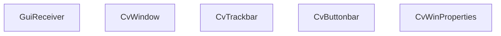

# 事件处理与交互元素

相关源文件

-   [CMakeLists.txt](https://github.com/opencv/opencv/blob/91c78f50/CMakeLists.txt)
-   [cmake/OpenCVCRTLinkage.cmake](https://github.com/opencv/opencv/blob/91c78f50/cmake/OpenCVCRTLinkage.cmake)
-   [cmake/OpenCVCompilerOptions.cmake](https://github.com/opencv/opencv/blob/91c78f50/cmake/OpenCVCompilerOptions.cmake)
-   [cmake/OpenCVDetectCXXCompiler.cmake](https://github.com/opencv/opencv/blob/91c78f50/cmake/OpenCVDetectCXXCompiler.cmake)
-   [cmake/OpenCVFindLibsGUI.cmake](https://github.com/opencv/opencv/blob/91c78f50/cmake/OpenCVFindLibsGUI.cmake)
-   [cmake/OpenCVFindLibsVideo.cmake](https://github.com/opencv/opencv/blob/91c78f50/cmake/OpenCVFindLibsVideo.cmake)
-   [cmake/OpenCVModule.cmake](https://github.com/opencv/opencv/blob/91c78f50/cmake/OpenCVModule.cmake)
-   [cmake/OpenCVPCHSupport.cmake](https://github.com/opencv/opencv/blob/91c78f50/cmake/OpenCVPCHSupport.cmake)
-   [cmake/OpenCVUtils.cmake](https://github.com/opencv/opencv/blob/91c78f50/cmake/OpenCVUtils.cmake)
-   [cmake/templates/OpenCVConfig.root-WIN32.cmake.in](https://github.com/opencv/opencv/blob/91c78f50/cmake/templates/OpenCVConfig.root-WIN32.cmake.in)
-   [cmake/templates/cvconfig.h.in](https://github.com/opencv/opencv/blob/91c78f50/cmake/templates/cvconfig.h.in)
-   [modules/core/CMakeLists.txt](https://github.com/opencv/opencv/blob/91c78f50/modules/core/CMakeLists.txt)
-   [modules/highgui/CMakeLists.txt](https://github.com/opencv/opencv/blob/91c78f50/modules/highgui/CMakeLists.txt)
-   [modules/highgui/include/opencv2/highgui.hpp](https://github.com/opencv/opencv/blob/91c78f50/modules/highgui/include/opencv2/highgui.hpp)
-   [modules/highgui/include/opencv2/highgui/highgui.hpp](https://github.com/opencv/opencv/blob/91c78f50/modules/highgui/include/opencv2/highgui/highgui.hpp)
-   [modules/highgui/include/opencv2/highgui/highgui\_c.h](https://github.com/opencv/opencv/blob/91c78f50/modules/highgui/include/opencv2/highgui/highgui_c.h)
-   [modules/highgui/src/precomp.hpp](https://github.com/opencv/opencv/blob/91c78f50/modules/highgui/src/precomp.hpp)
-   [modules/highgui/src/window.cpp](https://github.com/opencv/opencv/blob/91c78f50/modules/highgui/src/window.cpp)
-   [modules/highgui/src/window\_QT.cpp](https://github.com/opencv/opencv/blob/91c78f50/modules/highgui/src/window_QT.cpp)
-   [modules/highgui/src/window\_QT.h](https://github.com/opencv/opencv/blob/91c78f50/modules/highgui/src/window_QT.h)
-   [modules/highgui/src/window\_cocoa.mm](https://github.com/opencv/opencv/blob/91c78f50/modules/highgui/src/window_cocoa.mm)
-   [modules/highgui/src/window\_gtk.cpp](https://github.com/opencv/opencv/blob/91c78f50/modules/highgui/src/window_gtk.cpp)
-   [modules/highgui/src/window\_w32.cpp](https://github.com/opencv/opencv/blob/91c78f50/modules/highgui/src/window_w32.cpp)
-   [modules/java/CMakeLists.txt](https://github.com/opencv/opencv/blob/91c78f50/modules/java/CMakeLists.txt)
-   [modules/videoio/CMakeLists.txt](https://github.com/opencv/opencv/blob/91c78f50/modules/videoio/CMakeLists.txt)

## 概览

本页介绍 `opencv_highgui` 模块的交互输入层：通过 `waitKey` 和 `pollKey` 进行键盘输入，通过 `setMouseCallback` 进行鼠标事件分发，通过 `createTrackbar` 提供滑动条控件，以及 Qt 后端独有的扩展（按钮、覆盖文本、状态栏和图像文本渲染）。

有关窗口如何创建以及该模块在构建时如何选择 GUI 后端的信息，请参见 [10.1](/opencv/opencv/10.1-window-management-and-multi-backend-gui)。

---

## waitKey 与 pollKey

`cv::waitKey` 是 highgui 应用中驱动事件循环的主要机制。所有窗口重绘和事件分发都在该调用期间发生。

| 函数 | 签名 | 行为 |
| --- | --- | --- |
| `waitKey` | `int waitKey(int delay=0)` | 最多阻塞 `delay` 毫秒；0 表示无限等待。返回按键码，超时返回 -1。 |
| `waitKeyEx` | `int waitKeyEx(int delay=0)` | 与 `waitKey` 相同，但返回包含特殊按键在内的完整按键码。 |
| `pollKey` | `int pollKey()` | 非阻塞；处理待处理事件并返回任意排队按键码，若无则为 -1。 |

返回值是所按键的 ASCII 码，或针对特殊按键（方向键、功能键等）的平台特定扩展码。

### 后端实现

每个 GUI 后端都有自己的事件循环驱动逻辑。

**Qt 后端** (`modules/highgui/src/window_QT.cpp`):

在单线程模式下，`cvWaitKey` 在忙等待循环中调用 `qApp->processEvents(QEventLoop::AllEvents)`，并在每次迭代间休眠 1 ms 以降低 CPU 占用。键值存储在静态变量 `last_key` 中，并由 `mutexKey` 保护。超时通过启动 `QTimer` 实现。在多线程模式（`multiThreads == true`）下，改用名为 `key_pressed` 的 `QWaitCondition`。

[modules/highgui/src/window\_QT.cpp343-415](https://github.com/opencv/opencv/blob/91c78f50/modules/highgui/src/window_QT.cpp#L343-L415)

**Win32 后端** (`modules/highgui/src/window_w32.cpp`):

键盘事件通过 `HighGUIProc` 中的 `WM_KEYDOWN` 和 `WM_CHAR` 消息到达。按键存储于 `CvWindow::last_key`。`waitKey` 调用 `MsgWaitForMultipleObjects` 或 `PeekMessage`/`TranslateMessage`/`DispatchMessage` 来处理 Windows 消息。

[modules/highgui/src/window\_w32.cpp298-304](https://github.com/opencv/opencv/blob/91c78f50/modules/highgui/src/window_w32.cpp#L298-L304)

**GTK 后端** (`modules/highgui/src/window_gtk.cpp`):

在 `waitKey` 期间使用 `gtk_main_iteration_do` 处理 GTK 事件。键盘事件通过窗口创建时连接的 `key_press_cb` 信号处理器接收。

**Cocoa 后端** (`modules/highgui/src/window_cocoa.mm`):

在自定义 `NSView` 子类中重写 `keyDown:`，并将字符转发到共享按键队列。

---

**waitKey 分发示意图：**

*`waitKey` 通过后端抽象层的调用流*

Sources: [modules/highgui/src/window.cpp](https://github.com/opencv/opencv/blob/91c78f50/modules/highgui/src/window.cpp) [modules/highgui/src/window\_QT.cpp343-415](https://github.com/opencv/opencv/blob/91c78f50/modules/highgui/src/window_QT.cpp#L343-L415) [modules/highgui/src/window\_w32.cpp](https://github.com/opencv/opencv/blob/91c78f50/modules/highgui/src/window_w32.cpp) [modules/highgui/src/window\_gtk.cpp](https://github.com/opencv/opencv/blob/91c78f50/modules/highgui/src/window_gtk.cpp)

---

## 鼠标回调

`cv::setMouseCallback` 为指定窗口注册 `MouseCallback` 函数，以接收鼠标事件。

```
typedef void (*MouseCallback)(int event, int x, int y, int flags, void* userdata);
```
[modules/highgui/include/opencv2/highgui.hpp](https://github.com/opencv/opencv/blob/91c78f50/modules/highgui/include/opencv2/highgui.hpp)

参数含义如下：

| 参数 | 含义 |
| --- | --- |
| `event` | 下方 `MouseEventTypes` 常量之一 |
| `x`, `y` | 图像像素坐标中的光标位置 |
| `flags` | `MouseEventFlags` 位掩码 |
| `userdata` | 传递给 `setMouseCallback` 的指针 |

### 鼠标事件类型

定义于 `modules/highgui/include/opencv2/highgui.hpp`：

| 常量 | 值 | 含义 |
| --- | --- | --- |
| `EVENT_MOUSEMOVE` | 0 | 鼠标移动 |
| `EVENT_LBUTTONDOWN` | 1 | 左键按下 |
| `EVENT_RBUTTONDOWN` | 2 | 右键按下 |
| `EVENT_MBUTTONDOWN` | 3 | 中键按下 |
| `EVENT_LBUTTONUP` | 4 | 左键释放 |
| `EVENT_RBUTTONUP` | 5 | 右键释放 |
| `EVENT_MBUTTONUP` | 6 | 中键释放 |
| `EVENT_LBUTTONDBLCLK` | 7 | 左键双击 |
| `EVENT_RBUTTONDBLCLK` | 8 | 右键双击 |
| `EVENT_MBUTTONDBLCLK` | 9 | 中键双击 |
| `EVENT_MOUSEWHEEL` | 10 | 垂直滚轮 |
| `EVENT_MOUSEHWHEEL` | 11 | 水平滚轮 |

### 鼠标事件标志

| 常量 | 含义 |
| --- | --- |
| `EVENT_FLAG_LBUTTON` | 左键保持按下 |
| `EVENT_FLAG_RBUTTON` | 右键保持按下 |
| `EVENT_FLAG_MBUTTON` | 中键保持按下 |
| `EVENT_FLAG_CTRLKEY` | Ctrl 键保持按下 |
| `EVENT_FLAG_SHIFTKEY` | Shift 键保持按下 |
| `EVENT_FLAG_ALTKEY` | Alt 键保持按下 |

### 注册与分发

`window.cpp` 中的 `setMouseCallback` 会从 `WindowsMap_t`（`std::map<std::string, UIWindowBase::Ptr>`）中查找指定名称窗口，并在找到实例后调用 `UIWindow::setMouseCallback`。

[modules/highgui/src/window.cpp56-91](https://github.com/opencv/opencv/blob/91c78f50/modules/highgui/src/window.cpp#L56-L91)

在 **Win32 后端** 中，回调存储为 `CvWindow::on_mouse`。`HighGUIProc` 消息处理器会拦截 `WM_MOUSEMOVE`、`WM_LBUTTONDOWN`、`WM_LBUTTONUP`、`WM_RBUTTONDOWN`、`WM_RBUTTONUP`、`WM_MBUTTONDOWN`、`WM_MBUTTONUP`、`WM_LBUTTONDBLCLK` 和 `WM_MOUSEWHEEL`，将其转换为 `EVENT_*` 常量并调用 `on_mouse`。

[modules/highgui/src/window\_w32.cpp181-234](https://github.com/opencv/opencv/blob/91c78f50/modules/highgui/src/window_w32.cpp#L181-L234)

在 **Qt 后端** 中，`CvWindow` 存储回调，图像视图的 `mousePressEvent`、`mouseReleaseEvent`、`mouseMoveEvent` 和 `wheelEvent` 重写方法会将 Qt 事件转换为 `EVENT_*` 调用。

[modules/highgui/src/window\_QT.cpp](https://github.com/opencv/opencv/blob/91c78f50/modules/highgui/src/window_QT.cpp) [modules/highgui/src/window\_QT.h](https://github.com/opencv/opencv/blob/91c78f50/modules/highgui/src/window_QT.h)

*鼠标回调注册与事件分发*

Sources: [modules/highgui/src/window.cpp](https://github.com/opencv/opencv/blob/91c78f50/modules/highgui/src/window.cpp) [modules/highgui/src/window\_w32.cpp](https://github.com/opencv/opencv/blob/91c78f50/modules/highgui/src/window_w32.cpp) [modules/highgui/src/window\_QT.cpp](https://github.com/opencv/opencv/blob/91c78f50/modules/highgui/src/window_QT.cpp) [modules/highgui/src/window\_gtk.cpp](https://github.com/opencv/opencv/blob/91c78f50/modules/highgui/src/window_gtk.cpp)

---

## 滑动条（Trackbar）

`cv::createTrackbar` 将滑动条控件附加到指定窗口。

```
int createTrackbar(const String& trackbarname, const String& winname,
                   int* value, int count,
                   TrackbarCallback onChange = 0,
                   void* userdata = 0);
```
| 参数 | 含义 |
| --- | --- |
| `trackbarname` | 控件显示名称标签 |
| `winname` | 目标窗口（空字符串 = 全局控制面板，仅 Qt） |
| `value` | 指向 `int` 的指针，用于接收位置更新（已弃用用法） |
| `count` | 最大值；最小值默认是 0 |
| `onChange` | `void callback(int pos, void* userdata)` |
| `userdata` | 传递给 `onChange` |

`getTrackbarPos`、`setTrackbarPos`、`setTrackbarMax` 和 `setTrackbarMin` 是配套的查询/更新函数。

### 回调分发与兼容包装器

C++ `createTrackbar` API 支持两种使用模式：

1.  **新式**：传入 `onChange` + `userdata`；`int* value` 指针可为 null。
2.  **弃用式**：传入非空 `int* value` 自动更新；内部也处理 `void (*)(int)`（单参数）类型的旧式回调。

`window.cpp` 使用 `TrackbarCallbackWithData` 包装弃用模式：

[modules/highgui/src/window.cpp117-150](https://github.com/opencv/opencv/blob/91c78f50/modules/highgui/src/window.cpp#L117-L150)

该结构体持有 `UITrackbar` 的弱指针、`int* data` 指针和 `TrackbarCallback`。其 `onChange(int pos)` 方法会先写入 `*data_ = pos`，再调用用户回调。该包装器保存在 `TrackbarCallbacksWithData_t` 向量中，并在窗口关闭时清理。

*滑动条创建与回调链*

Sources: [modules/highgui/src/window.cpp117-200](https://github.com/opencv/opencv/blob/91c78f50/modules/highgui/src/window.cpp#L117-L200) [modules/highgui/src/window\_w32.cpp150-178](https://github.com/opencv/opencv/blob/91c78f50/modules/highgui/src/window_w32.cpp#L150-L178) [modules/highgui/src/window\_QT.h](https://github.com/opencv/opencv/blob/91c78f50/modules/highgui/src/window_QT.h)

### Win32 滑动条内部实现

在 Win32 后端中，每个滑动条由 `CvTrackbar` 结构体表示，存储于 `CvWindow::toolbar.trackbars`（`std::vector<std::shared_ptr<CvTrackbar>>`）。底层 Win32 控件为 `TRACKBAR_CLASS` 公共控件。`WM_HSCROLL` 消息会触发通过 `SendMessage(TB, TBM_GETPOS, ...)` 读取位置并调用已存储回调。

[modules/highgui/src/window\_w32.cpp150-178](https://github.com/opencv/opencv/blob/91c78f50/modules/highgui/src/window_w32.cpp#L150-L178)

### Qt 滑动条内部实现

Qt 滑动条（`window_QT.h` 中的 `CvTrackbar`）是由 `QSlider` 支撑的控件，布局在窗口的 `myBarLayout` 中。`CvTrackbar` 将 `valueChanged` 信号连接到回调。

[modules/highgui/src/window\_QT.h](https://github.com/opencv/opencv/blob/91c78f50/modules/highgui/src/window_QT.h)

---

## Qt 专有扩展

当 OpenCV 以 Qt 构建（定义了 `HAVE_QT`）时，可使用若干附加交互元素。它们在 `highgui.hpp` 的 `#ifdef HAVE_QT` 保护块中声明，并通过 `highgui_c.h` 的 C API 暴露。

来自任意线程的所有 Qt 后端调用，都会通过 `QMetaObject::invokeMethod` 与 `autoBlockingConnection()` 分发到 Qt 主线程——若从非 GUI 线程调用则阻塞，若已在 GUI 线程则直接调用。

[modules/highgui/src/window\_QT.cpp121-125](https://github.com/opencv/opencv/blob/91c78f50/modules/highgui/src/window_QT.cpp#L121-L125)

### 按钮（createButton）

```
int createButton(const String& bar_name,
                 ButtonCallback on_change,
                 void* userdata = 0,
                 int type = QT_PUSH_BUTTON,
                 bool initial_button_state = false);
```
按钮显示在**全局控制面板**（`CvWinProperties`）中，而不是单个窗口内。支持三种 `type` 值：

| 常量 | 值 | 控件 |
| --- | --- | --- |
| `QT_PUSH_BUTTON` | 0 | `QPushButton` |
| `QT_CHECKBOX` | 1 | `QCheckBox` |
| `QT_RADIOBOX` | 2 | `QRadioButton` |

标志 `QT_NEW_BUTTONBAR = 1024` 可与 `type` 做 OR，以开启新的一行按钮。

`ButtonCallback` 签名：`void callback(int state, void* userdata)`，其中 `state` 为 1（选中/按下）或 0。

[modules/highgui/include/opencv2/highgui.hpp](https://github.com/opencv/opencv/blob/91c78f50/modules/highgui/include/opencv2/highgui.hpp) [modules/highgui/include/opencv2/highgui/highgui\_c.h89-91](https://github.com/opencv/opencv/blob/91c78f50/modules/highgui/include/opencv2/highgui/highgui_c.h#L89-L91)

### 覆盖文本（displayOverlay）

```
void displayOverlay(const String& winname, const String& text, int delayms = 0);
```
C API：`cvDisplayOverlay(const char* name, const char* text, int delayms)`

在图像区域上方以半透明覆盖方式显示 `text`，持续 `delayms` 毫秒（0 = 永久）。由 `GuiReceiver::displayInfo` 实现，它创建带有 `QTimer` 的 `QLabel` 以自动清除。

[modules/highgui/src/window\_QT.cpp291-302](https://github.com/opencv/opencv/blob/91c78f50/modules/highgui/src/window_QT.cpp#L291-L302)

### 状态栏（displayStatusBar）

```
void displayStatusBar(const String& winname, const String& text, int delayms = 0);
```
C API：`cvDisplayStatusBar(const char* name, const char* text, int delayms)`

将 `text` 写入窗口的 `QStatusBar`，持续 `delayms` 毫秒。要求窗口以 `WINDOW_GUI_EXPANDED` 打开（Qt 默认模式；`WINDOW_GUI_NORMAL` 会隐藏工具栏和状态栏）。

[modules/highgui/src/window\_QT.cpp329-340](https://github.com/opencv/opencv/blob/91c78f50/modules/highgui/src/window_QT.cpp#L329-L340)

### 图像文本渲染（fontQt / addText）

```
QtFont fontQt(const String& nameFont,
              int pointSize = -1,
              Scalar color = Scalar::all(0),
              int weight = QT_FONT_NORMAL,
              int style = QT_STYLE_NORMAL,
              int spacing = 0);

void addText(const Mat& img,
             const String& text,
             Point org,
             const QtFont& font);
```
C API：`cvFontQt(...)` / `cvAddText(const CvArr* img, ...)`

`addText` 使用 Qt 的 `QPainter` 将 `text` 直接渲染到 `img` 的像素数据中。`fontQt` 创建 `QtFont`（内部是带 Qt 特定字段的 `CvFont`），可指定字体、字号、RGBA 颜色、字重（`QT_FONT_LIGHT`、`QT_FONT_NORMAL`、`QT_FONT_BOLD` 等）和样式（`QT_STYLE_NORMAL`、`QT_STYLE_ITALIC`、`QT_STYLE_OBLIQUE`）。

[modules/highgui/src/window\_QT.cpp127-159](https://github.com/opencv/opencv/blob/91c78f50/modules/highgui/src/window_QT.cpp#L127-L159) [modules/highgui/include/opencv2/highgui/highgui\_c.h62-79](https://github.com/opencv/opencv/blob/91c78f50/modules/highgui/include/opencv2/highgui/highgui_c.h#L62-L79)

### 窗口参数持久化

```
void saveWindowParameters(const String& windowName);
void loadWindowParameters(const String& windowName);
```
使用 `QSettings` 持久化并恢复窗口几何参数（位置、尺寸、全屏状态、工具栏状态）。数据存储在应用级设置存储中，并以窗口名作为键。

[modules/highgui/src/window\_QT.cpp305-326](https://github.com/opencv/opencv/blob/91c78f50/modules/highgui/src/window_QT.cpp#L305-L326)

---

## Qt 窗口与控件层级

*Qt 后端内部对象关系*


Sources: [modules/highgui/src/window\_QT.h](https://github.com/opencv/opencv/blob/91c78f50/modules/highgui/src/window_QT.h) [modules/highgui/src/window\_QT.cpp](https://github.com/opencv/opencv/blob/91c78f50/modules/highgui/src/window_QT.cpp)

---

## C API

`modules/highgui/include/opencv2/highgui/highgui_c.h` 中的 C API 通过 `cv` 前缀暴露了相同功能。`window.cpp` 中的 C++ API 也会调用到这些相同的后端入口。

| C++ function | C function |
| --- | --- |
| `cv::waitKey` | `cvWaitKey` |
| `cv::setMouseCallback` | `cvSetMouseCallback` |
| `cv::createTrackbar` | `cvCreateTrackbar` / `cvCreateTrackbar2` |
| `cv::getTrackbarPos` | `cvGetTrackbarPos` |
| `cv::setTrackbarPos` | `cvSetTrackbarPos` |
| `cv::displayOverlay` | `cvDisplayOverlay` (Qt only) |
| `cv::displayStatusBar` | `cvDisplayStatusBar` (Qt only) |
| `cv::createButton` | `cvCreateButton` (Qt only) |
| `cv::addText` | `cvAddText` (Qt only) |
| `cv::fontQt` | `cvFontQt` (Qt only) |
| `cv::saveWindowParameters` | `cvSaveWindowParameters` (Qt only) |
| `cv::loadWindowParameters` | `cvLoadWindowParameters` (Qt only) |

Sources: [modules/highgui/include/opencv2/highgui/highgui\_c.h](https://github.com/opencv/opencv/blob/91c78f50/modules/highgui/include/opencv2/highgui/highgui_c.h) [modules/highgui/include/opencv2/highgui.hpp](https://github.com/opencv/opencv/blob/91c78f50/modules/highgui/include/opencv2/highgui.hpp)

---

## 总结：各后端可用性

| Feature | Win32 | GTK | Qt | Cocoa | Wayland | Framebuffer |
| --- | --- | --- | --- | --- | --- | --- |
| `waitKey` | ✓ | ✓ | ✓ | ✓ | ✓ | ✓ |
| `setMouseCallback` | ✓ | ✓ | ✓ | ✓ | partial | — |
| `createTrackbar` | ✓ | ✓ | ✓ | — | — | — |
| `createButton` | — | — | ✓ | — | — | — |
| `displayOverlay` | — | — | ✓ | — | — | — |
| `displayStatusBar` | — | — | ✓ | — | — | — |
| `addText` / `fontQt` | — | — | ✓ | — | — | — |
| `saveWindowParameters` | — | — | ✓ | — | — | — |

Sources: [modules/highgui/src/window\_QT.cpp](https://github.com/opencv/opencv/blob/91c78f50/modules/highgui/src/window_QT.cpp) [modules/highgui/src/window\_w32.cpp](https://github.com/opencv/opencv/blob/91c78f50/modules/highgui/src/window_w32.cpp) [modules/highgui/src/window\_gtk.cpp](https://github.com/opencv/opencv/blob/91c78f50/modules/highgui/src/window_gtk.cpp) [modules/highgui/src/window\_cocoa.mm](https://github.com/opencv/opencv/blob/91c78f50/modules/highgui/src/window_cocoa.mm) [modules/highgui/include/opencv2/highgui.hpp](https://github.com/opencv/opencv/blob/91c78f50/modules/highgui/include/opencv2/highgui.hpp)
