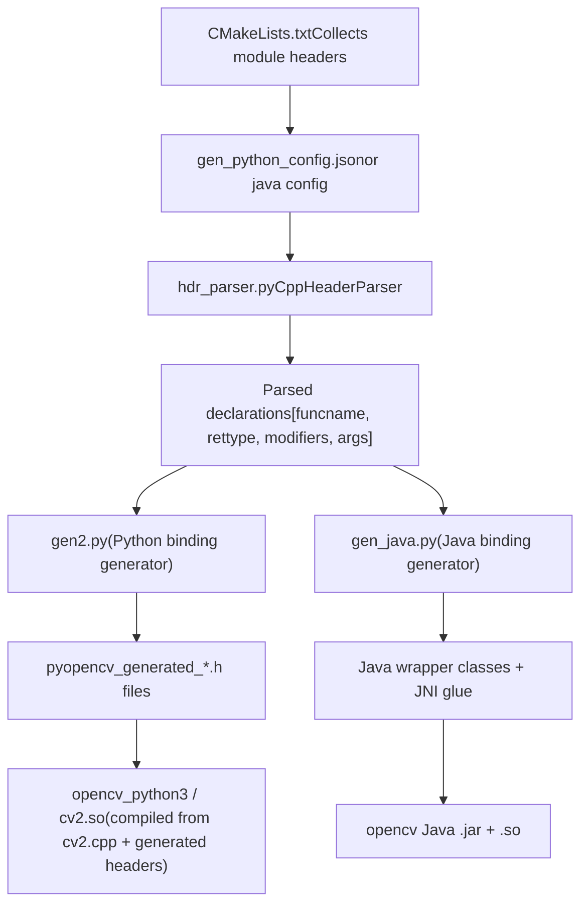
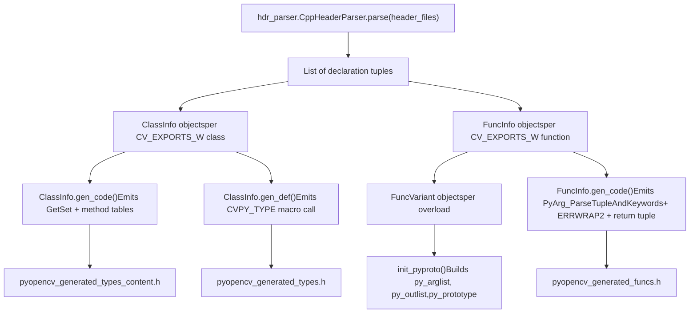
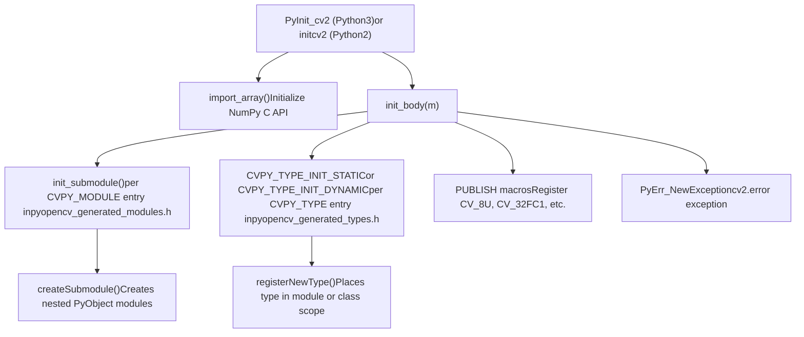
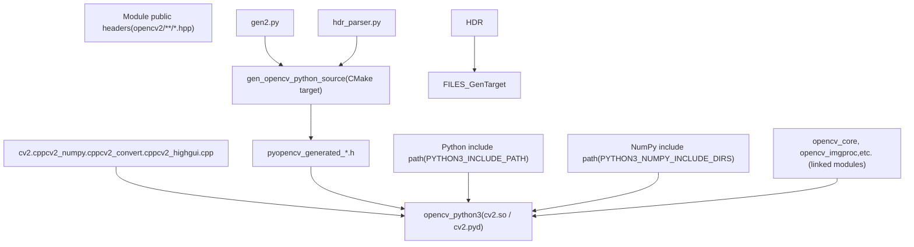

# 语言绑定

相关源文件

-   [cmake/OpenCVDetectPython.cmake](https://github.com/opencv/opencv/blob/91c78f50/cmake/OpenCVDetectPython.cmake)
-   [cmake/OpenCVGenSetupVars.cmake](https://github.com/opencv/opencv/blob/91c78f50/cmake/OpenCVGenSetupVars.cmake)
-   [modules/core/include/opencv2/core/bindings\_utils.hpp](https://github.com/opencv/opencv/blob/91c78f50/modules/core/include/opencv2/core/bindings_utils.hpp)
-   [modules/core/misc/python/package/utils/\_\_init\_\_.py](https://github.com/opencv/opencv/blob/91c78f50/modules/core/misc/python/package/utils/__init__.py)
-   [modules/core/src/bindings\_utils.cpp](https://github.com/opencv/opencv/blob/91c78f50/modules/core/src/bindings_utils.cpp)
-   [modules/java/check-tests.py](https://github.com/opencv/opencv/blob/91c78f50/modules/java/check-tests.py)
-   [modules/python/CMakeLists.txt](https://github.com/opencv/opencv/blob/91c78f50/modules/python/CMakeLists.txt)
-   [modules/python/bindings/CMakeLists.txt](https://github.com/opencv/opencv/blob/91c78f50/modules/python/bindings/CMakeLists.txt)
-   [modules/python/common.cmake](https://github.com/opencv/opencv/blob/91c78f50/modules/python/common.cmake)
-   [modules/python/package/.gitignore](https://github.com/opencv/opencv/blob/91c78f50/modules/python/package/.gitignore)
-   [modules/python/package/cv2/\_\_init\_\_.py](https://github.com/opencv/opencv/blob/91c78f50/modules/python/package/cv2/__init__.py)
-   [modules/python/package/cv2/load\_config\_py2.py](https://github.com/opencv/opencv/blob/91c78f50/modules/python/package/cv2/load_config_py2.py)
-   [modules/python/package/cv2/load\_config\_py3.py](https://github.com/opencv/opencv/blob/91c78f50/modules/python/package/cv2/load_config_py3.py)
-   [modules/python/package/extra\_modules/misc/\_\_init\_\_.py](https://github.com/opencv/opencv/blob/91c78f50/modules/python/package/extra_modules/misc/__init__.py)
-   [modules/python/package/extra\_modules/misc/version.py](https://github.com/opencv/opencv/blob/91c78f50/modules/python/package/extra_modules/misc/version.py)
-   [modules/python/package/template/config-x.y.py.in](https://github.com/opencv/opencv/blob/91c78f50/modules/python/package/template/config-x.y.py.in)
-   [modules/python/package/template/config.py.in](https://github.com/opencv/opencv/blob/91c78f50/modules/python/package/template/config.py.in)
-   [modules/python/python2/CMakeLists.txt](https://github.com/opencv/opencv/blob/91c78f50/modules/python/python2/CMakeLists.txt)
-   [modules/python/python3/CMakeLists.txt](https://github.com/opencv/opencv/blob/91c78f50/modules/python/python3/CMakeLists.txt)
-   [modules/python/python\_loader.cmake](https://github.com/opencv/opencv/blob/91c78f50/modules/python/python_loader.cmake)
-   [modules/python/src2/cv2.cpp](https://github.com/opencv/opencv/blob/91c78f50/modules/python/src2/cv2.cpp)
-   [modules/python/src2/gen2.py](https://github.com/opencv/opencv/blob/91c78f50/modules/python/src2/gen2.py)
-   [modules/python/src2/hdr\_parser.py](https://github.com/opencv/opencv/blob/91c78f50/modules/python/src2/hdr_parser.py)
-   [modules/python/src2/pycompat.hpp](https://github.com/opencv/opencv/blob/91c78f50/modules/python/src2/pycompat.hpp)
-   [modules/python/standalone.cmake](https://github.com/opencv/opencv/blob/91c78f50/modules/python/standalone.cmake)
-   [modules/python/test/test\_fs\_cache\_dir.py](https://github.com/opencv/opencv/blob/91c78f50/modules/python/test/test_fs_cache_dir.py)
-   [modules/python/test/test\_misc.py](https://github.com/opencv/opencv/blob/91c78f50/modules/python/test/test_misc.py)

## 目的与范围

本页介绍 OpenCV 的 C++ API 如何暴露给 Python 和 Java，内容涵盖 C++ 头文件中的注解约定、将这些注解转换为绑定代码的代码生成工具链，以及在运行时加载和初始化生成扩展的机制。

关于更深入的实现细节，参见：

-   [Python Bindings and Code Generation](/opencv/opencv/11.1-python-bindings-and-code-generation) — `hdr_parser.py`、`gen2.py`、类型映射、`cv2` 包结构
-   [Java and Android Bindings](/opencv/opencv/11.2-java-and-android-bindings) — `gen_java.py`、JNI 胶水代码、Android 特定组件

关于模块在构建过程中如何声明和配置，参见 [Module Configuration and ocv\_add\_module](/opencv/opencv/2.2-module-configuration-and-ocv_add_module)。

---

## 通用设计原则

Python 和 Java 绑定系统共享同一套总体策略：

1.  **对 C++ 头文件添加注解**，使用特殊宏标记哪些类、方法和参数需要暴露。
2.  **在构建时运行基于 Python 的代码生成器**，解析这些头文件并生成特定语言的胶水代码。
3.  **编译胶水代码**，生成在运行时加载的原生扩展。

这意味着绑定代码无需手写——新增导出函数只需在头文件中进行标记。

### C++ 注解宏

下列宏会被 `hdr_parser.py` 和 `gen_java.py` 同时识别：

| Macro | Applies To | Effect |
| --- | --- | --- |
| `CV_EXPORTS_W` | Functions, classes | Include in binding code generation |
| `CV_EXPORTS_W_SIMPLE` | Structs | Wrap by value (not via `Ptr<>`) |
| `CV_EXPORTS_W_MAP` | Structs | Allow construction from a Python dict / Java map |
| `CV_EXPORTS_W_PARAMS` | Structs | Treat as a named-parameter bundle; flatten into function signature |
| `CV_EXPORTS_AS(name)` | Functions, classes | Export under a different name |
| `CV_WRAP` | Class methods | Include individual method when class is not fully exported |
| `CV_WRAP_AS(name)` | Methods | Export method under a different name |
| `CV_OUT` | Function arguments | Mark as output-only; return from binding function |
| `CV_IN_OUT` | Function arguments | Mark as input and output |
| `CV_PROP` | Class members | Expose as read-only property |
| `CV_PROP_RW` | Class members | Expose as read-write property |

这些宏在常规编译中会展开为空——它们只对绑定生成脚本有意义。可在 [modules/core/include/opencv2/core/bindings\_utils.hpp](https://github.com/opencv/opencv/blob/91c78f50/modules/core/include/opencv2/core/bindings_utils.hpp) 查看 `CV_EXPORTS_W_SIMPLE`、`CV_EXPORTS_W_PARAMS`、`CV_PROP_RW` 等的真实用法示例。

---

## 架构概览

**高层绑定流水线（两种语言通用）**

来源： [modules/python/bindings/CMakeLists.txt](https://github.com/opencv/opencv/blob/91c78f50/modules/python/bindings/CMakeLists.txt) [modules/python/src2/gen2.py1-10](https://github.com/opencv/opencv/blob/91c78f50/modules/python/src2/gen2.py#L1-L10) [modules/python/src2/hdr\_parser.py1-33](https://github.com/opencv/opencv/blob/91c78f50/modules/python/src2/hdr_parser.py#L1-L33)

---

## Python 绑定

### 代码生成流水线

CMake 驱动代码生成步骤。在 [modules/python/bindings/CMakeLists.txt](https://github.com/opencv/opencv/blob/91c78f50/modules/python/bindings/CMakeLists.txt) 中的关键步骤为：

1.  枚举所有在其 `WRAPPERS` 列表中声明 `python` 的构建模块。
2.  收集这些模块的公共头文件（位于 `include/` 下），以及所有 `misc/python/shadow*.hpp` 和 `misc/python/pyopencv*.hpp` 文件。
3.  过滤仅实现用途的头文件（CUDA、HAL、inline、legacy 路径）。
4.  写出 JSON 配置文件（`gen_python_config.json`），列出所有头文件和预处理器定义。
5.  运行 `add_custom_command`，调用 `gen2.py --config gen_python_config.json --output_dir ...` 生成全部文件。

**生成文件**（全部写入构建目录）：

| File | Contents |
| --- | --- |
| `pyopencv_generated_enums.h` | `cv::` enum constants published to Python |
| `pyopencv_generated_funcs.h` | C wrapper functions for every `CV_EXPORTS_W` free function |
| `pyopencv_generated_types.h` | `CVPY_TYPE(...)` macro calls declaring each wrapped class |
| `pyopencv_generated_types_content.h` | GetSet, method tables, and converter specializations for each class |
| `pyopencv_generated_modules.h` | `CVPY_MODULE(...)` calls for each submodule |
| `pyopencv_generated_modules_content.h` | Method and constant tables for each submodule |
| `pyopencv_generated_include.h` | `#include` directives for all processed headers |
| `pyopencv_signatures.json` | JSON file recording function signatures (used for documentation) |

来源： [modules/python/bindings/CMakeLists.txt67-131](https://github.com/opencv/opencv/blob/91c78f50/modules/python/bindings/CMakeLists.txt#L67-L131)

### 头文件解析

`hdr_parser.py` 包含 `CppHeaderParser` 类。它实现了逐行扫描 C++ 的解析器（并非完整语法解析器），其能力包括：

-   通过 `parse_class_decl` 识别使用 `CV_EXPORTS_W*` 宏注解的 class/struct 声明。
-   通过 `parse_func_decl` 识别使用 `CV_EXPORTS_W` 或 `CV_WRAP` 注解的函数/方法声明。
-   通过 `parse_arg` 解析参数列表，提取类型、名称、默认值和修饰符标记（`CV_OUT`、`CV_IN_OUT`、`CV_CARRAY` 等）。
-   将每个声明以列表形式返回：`[funcname, rettype, modifiers, args, original_rettype, docstring]`。

`args` 的每个元素都是一个四元组：`[argtype, argname, default_value, modifiers]`。

来源： [modules/python/src2/hdr\_parser.py24-32](https://github.com/opencv/opencv/blob/91c78f50/modules/python/src2/hdr_parser.py#L24-L32) [modules/python/src2/hdr\_parser.py226-387](https://github.com/opencv/opencv/blob/91c78f50/modules/python/src2/hdr_parser.py#L226-L387)

### 绑定代码生成

`gen2.py` 消费已解析声明并生成 C++ 绑定代码。其主要类包括：

| Class | Role |
| --- | --- |
| `ClassInfo` | Represents one wrapped C++ class; holds `ClassProp` list and method dict |
| `FuncInfo` | Represents one wrapped function or method; holds a list of `FuncVariant` for overloads |
| `FuncVariant` | Represents one overload; computes Python argument list order, optional args, return values |
| `ArgInfo` | Represents one function argument; tracks `inputarg`, `outputarg`, `isarray`, `defval` |

生成器处理若干特殊情况：

-   **输出参数**（`CV_OUT`）：从 Python 输入中移除，作为返回值收集。
-   **重量级输出参数**（`Mat`、`UMat`、向量）：提升为可选 Python 输入，便于调用方预分配。
-   **命名参数结构体**（`CV_EXPORTS_W_PARAMS`）：其字段会被内联进函数签名。
-   **重载解析**：按顺序尝试多个 `FuncVariant` 对象；UMat 变体最后尝试，以优先选择成本更低的 Mat 转换。
-   **Python 保留关键字**：与 Python 关键字（`lambda`、`from`、`except` 等）冲突的参数/属性名称会追加尾部 `_`。

**gen2.py 中的代码生成流程**

来源： [modules/python/src2/gen2.py281-448](https://github.com/opencv/opencv/blob/91c78f50/modules/python/src2/gen2.py#L281-L448) [modules/python/src2/gen2.py597-747](https://github.com/opencv/opencv/blob/91c78f50/modules/python/src2/gen2.py#L597-L747) [modules/python/src2/gen2.py749-835](https://github.com/opencv/opencv/blob/91c78f50/modules/python/src2/gen2.py#L749-L835)

### `cv2` 扩展模块

[modules/python/src2/cv2.cpp](https://github.com/opencv/opencv/blob/91c78f50/modules/python/src2/cv2.cpp) 是手写的 C++ 文件，用于把所有生成代码串联起来。它会：

1.  包含所有生成头文件（`pyopencv_generated_include.h`、`pyopencv_generated_enums.h`、`pyopencv_generated_types.h` 等）。
2.  定义 `PyInit_cv2()`（Python 3）或 `initcv2()`（Python 2）作为模块入口。
3.  调用 `init_body()`，其内部会：
    -   对每个 `CVPY_MODULE`（如 `cv2.dnn`、`cv2.ml`）调用 `init_submodule()`。
    -   通过 `CVPY_TYPE_INIT_STATIC` / `CVPY_TYPE_INIT_DYNAMIC` 初始化所有封装类型。
    -   通过 `registerNewType()` 注册类型，使其进入正确的模块或类作用域。
    -   发布每个 `CV_*` 深度/类型宏的整数常量（`CV_8U`、`CV_32FC3` 等）。
    -   创建 `cv2.error` 异常类。

**cv2.cpp 初始化流程**

来源： [modules/python/src2/cv2.cpp471-611](https://github.com/opencv/opencv/blob/91c78f50/modules/python/src2/cv2.cpp#L471-L611) [modules/python/src2/cv2.cpp159-246](https://github.com/opencv/opencv/blob/91c78f50/modules/python/src2/cv2.cpp#L159-L246) [modules/python/src2/cv2.cpp424-469](https://github.com/opencv/opencv/blob/91c78f50/modules/python/src2/cv2.cpp#L424-L469)

`cv2.cpp` 中的 `special_methods` 表列出了手工注册而非自动生成的函数：`_registerMatType`、`redirectError`、`createTrackbar`、`setMouseCallback`、`dnn_registerLayer`、`dnn_unregisterLayer`。

来源： [modules/python/src2/cv2.cpp112-125](https://github.com/opencv/opencv/blob/91c78f50/modules/python/src2/cv2.cpp#L112-L125)

### 类型映射

Python 与 C++ 之间的类型转换由 `pyopencv_to` 与 `pyopencv_from` 模板函数处理。其特化覆盖：

-   基础类型（`bool`、`int`、`float`、`double`、`size_t`）：直接映射自 Python 数值类型。
-   `std::string` / `cv::String`：由 `str` 或 `bytes` 映射。
-   `Mat` / `UMat`：通过 NumPy 数组接口转换（`cv2_numpy.cpp`）。
-   OpenCV 几何类型（`Point`、`Rect`、`Size`、`Scalar`、`Vec*`）：由 Python 元组转换。
-   `Ptr<T>` 封装类：映射到/自由 `gen2.py` 生成的 Python 类型对象。
-   `std::vector<T>`：由 Python 列表转换。

`pycompat.hpp` 头文件提供宏和内联辅助函数，用于统一 Python 2 与 Python 3 C API 的差异。

来源： [modules/python/src2/pycompat.hpp49-205](https://github.com/opencv/opencv/blob/91c78f50/modules/python/src2/pycompat.hpp#L49-L205)

### `cv2` 包加载

当用户写下 `import cv2` 时，Python 会执行 [modules/python/package/cv2/\_\_init\_\_.py](https://github.com/opencv/opencv/blob/91c78f50/modules/python/package/cv2/__init__.py)。`bootstrap()` 函数会：

1.  读取 `cv2/config.py` —— 设置 `BINARIES_PATHS`（原生 OpenCV 共享库所在目录）。
2.  读取 `cv2/config-3.x.py` —— 设置 `PYTHON_EXTENSIONS_PATHS`（编译后的 `cv2.so`/`cv2.pyd` 所在目录）。
3.  在 Windows 上，调用 `os.add_dll_directory()`（Python ≥ 3.8）或为二进制路径补充 `PATH`。
4.  暂时将扩展路径插入 `sys.path`，随后调用 `importlib.import_module("cv2")` 加载原生扩展。
5.  将原生模块中的所有符号重新导出到包命名空间。
6.  加载与 `__init__.py` 同目录下的额外 Python 子模块（如 `cv2.misc`、`cv2.utils`）。

这种双配置设计使单个已安装的 `cv2` 包可以并行支持多个 Python 版本（通过独立的 `config-3.9.py`、`config-3.10.py` 等）。

来源： [modules/python/package/cv2/\_\_init\_\_.py68-181](https://github.com/opencv/opencv/blob/91c78f50/modules/python/package/cv2/__init__.py#L68-L181) [modules/python/common.cmake217-236](https://github.com/opencv/opencv/blob/91c78f50/modules/python/common.cmake#L217-L236)

---

## Java 绑定

Java 绑定系统遵循与 Python 相同的总体模式：

1.  `gen_java.py` 使用与 `hdr_parser.py` 共享的核心解析 C++ 头文件。
2.  生成 Java 包装类（如 `Mat.java`、`Core.java`）以及 JNI C++ 胶水代码。
3.  将 JNI 胶水代码编译为原生共享库（`libopencv_java.so` / `opencv_java.dll`）。
4.  Java 代码通过生成的 JNI 层调用原生库。

工具 `modules/java/check-tests.py` 提供覆盖率审计：它会比较生成的 Java 源文件中的方法签名与 Java 测试文件中的方法签名，并报告缺少测试覆盖的方法。

完整细节参见 [Java and Android Bindings](/opencv/opencv/11.2-java-and-android-bindings)。

来源： [modules/java/check-tests.py1-166](https://github.com/opencv/opencv/blob/91c78f50/modules/java/check-tests.py#L1-L166)

---

## 构建系统集成

CMake 构建系统通过多个文件处理 Python 检测与模块编译：

| File | Role |
| --- | --- |
| `cmake/OpenCVDetectPython.cmake` | Locates Python interpreter, libraries, NumPy; sets `PYTHON3_INCLUDE_PATH`, `PYTHON3_NUMPY_INCLUDE_DIRS`, etc. |
| `modules/python/CMakeLists.txt` | Top-level entry; adds `bindings/`, `python2/`, `python3/` subdirectories; disables Python on Android, WinRT, Apple Framework |
| `modules/python/bindings/CMakeLists.txt` | Runs `gen2.py` via `add_custom_command`; produces `gen_opencv_python_source` CMake target |
| `modules/python/common.cmake` | Defines the compiled module target (`cv2.so`); handles linking, suffix detection, install paths |
| `modules/python/python3/CMakeLists.txt` | Activates `common.cmake` with `PYTHON=PYTHON3` |
| `modules/python/python_loader.cmake` | Copies `__init__.py`, `config.py`, `config-x.y.py` to the build tree and install tree |

`OpenCVDetectPython.cmake` 中的 `find_python` 函数同时支持交叉编译（需手动指定 NumPy 头文件）和原生构建（通过 Python 解释器查询）。

来源： [modules/python/CMakeLists.txt1-42](https://github.com/opencv/opencv/blob/91c78f50/modules/python/CMakeLists.txt#L1-L42) [modules/python/common.cmake1-50](https://github.com/opencv/opencv/blob/91c78f50/modules/python/common.cmake#L1-L50) [cmake/OpenCVDetectPython.cmake24-265](https://github.com/opencv/opencv/blob/91c78f50/cmake/OpenCVDetectPython.cmake#L24-L265)

**Python 绑定构建依赖图**

来源： [modules/python/bindings/CMakeLists.txt117-131](https://github.com/opencv/opencv/blob/91c78f50/modules/python/bindings/CMakeLists.txt#L117-L131) [modules/python/common.cmake22-74](https://github.com/opencv/opencv/blob/91c78f50/modules/python/common.cmake#L22-L74)
