# Python 绑定与代码生成

相关源文件

-   [cmake/OpenCVDetectPython.cmake](https://github.com/opencv/opencv/blob/91c78f50/cmake/OpenCVDetectPython.cmake)
-   [cmake/OpenCVGenSetupVars.cmake](https://github.com/opencv/opencv/blob/91c78f50/cmake/OpenCVGenSetupVars.cmake)
-   [modules/core/include/opencv2/core/bindings\_utils.hpp](https://github.com/opencv/opencv/blob/91c78f50/modules/core/include/opencv2/core/bindings_utils.hpp)
-   [modules/core/misc/python/package/utils/\_\_init\_\_.py](https://github.com/opencv/opencv/blob/91c78f50/modules/core/misc/python/package/utils/__init__.py)
-   [modules/core/src/bindings\_utils.cpp](https://github.com/opencv/opencv/blob/91c78f50/modules/core/src/bindings_utils.cpp)
-   [modules/python/CMakeLists.txt](https://github.com/opencv/opencv/blob/91c78f50/modules/python/CMakeLists.txt)
-   [modules/python/bindings/CMakeLists.txt](https://github.com/opencv/opencv/blob/91c78f50/modules/python/bindings/CMakeLists.txt)
-   [modules/python/common.cmake](https://github.com/opencv/opencv/blob/91c78f50/modules/python/common.cmake)
-   [modules/python/package/.gitignore](https://github.com/opencv/opencv/blob/91c78f50/modules/python/package/.gitignore)
-   [modules/python/package/cv2/\_\_init\_\_.py](https://github.com/opencv/opencv/blob/91c78f50/modules/python/package/cv2/__init__.py)
-   [modules/python/package/cv2/load\_config\_py2.py](https://github.com/opencv/opencv/blob/91c78f50/modules/python/package/cv2/load_config_py2.py)
-   [modules/python/package/cv2/load\_config\_py3.py](https://github.com/opencv/opencv/blob/91c78f50/modules/python/package/cv2/load_config_py3.py)
-   [modules/python/package/extra\_modules/misc/\_\_init\_\_.py](https://github.com/opencv/opencv/blob/91c78f50/modules/python/package/extra_modules/misc/__init__.py)
-   [modules/python/package/extra\_modules/misc/version.py](https://github.com/opencv/opencv/blob/91c78f50/modules/python/package/extra_modules/misc/version.py)
-   [modules/python/package/template/config-x.y.py.in](https://github.com/opencv/opencv/blob/91c78f50/modules/python/package/template/config-x.y.py.in)
-   [modules/python/package/template/config.py.in](https://github.com/opencv/opencv/blob/91c78f50/modules/python/package/template/config.py.in)
-   [modules/python/python2/CMakeLists.txt](https://github.com/opencv/opencv/blob/91c78f50/modules/python/python2/CMakeLists.txt)
-   [modules/python/python3/CMakeLists.txt](https://github.com/opencv/opencv/blob/91c78f50/modules/python/python3/CMakeLists.txt)
-   [modules/python/python\_loader.cmake](https://github.com/opencv/opencv/blob/91c78f50/modules/python/python_loader.cmake)
-   [modules/python/src2/cv2.cpp](https://github.com/opencv/opencv/blob/91c78f50/modules/python/src2/cv2.cpp)
-   [modules/python/src2/gen2.py](https://github.com/opencv/opencv/blob/91c78f50/modules/python/src2/gen2.py)
-   [modules/python/src2/hdr\_parser.py](https://github.com/opencv/opencv/blob/91c78f50/modules/python/src2/hdr_parser.py)
-   [modules/python/src2/pycompat.hpp](https://github.com/opencv/opencv/blob/91c78f50/modules/python/src2/pycompat.hpp)
-   [modules/python/standalone.cmake](https://github.com/opencv/opencv/blob/91c78f50/modules/python/standalone.cmake)
-   [modules/python/test/test\_fs\_cache\_dir.py](https://github.com/opencv/opencv/blob/91c78f50/modules/python/test/test_fs_cache_dir.py)
-   [modules/python/test/test\_misc.py](https://github.com/opencv/opencv/blob/91c78f50/modules/python/test/test_misc.py)

本页文档介绍 Python 绑定生成系统，它将 C++ OpenCV API 转换为 Python 可访问的绑定。该系统由三个主要组件组成：`gen2.py`（代码生成器）、类型转换层以及 `cv2` 模块结构。生成器会解析 C++ 头文件、创建带自动类型转换的包装函数，并生成一个与 NumPy 集成的完整 Python 扩展模块。

## 代码生成流水线

绑定生成过程会解析 C++ 头文件、生成包装代码并产出已编译的 Python 扩展模块。该流水线使用 `hdr_parser.py` 提取 API 声明，使用 `gen2.py` 生成绑定代码，并由 CMake 完成编译。

**代码生成与编译流程**

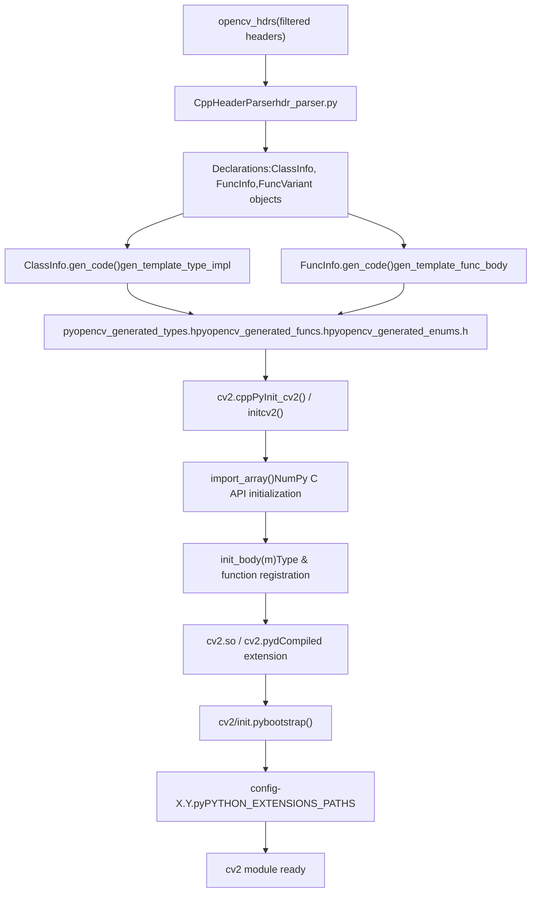
Sources: [modules/python/src2/hdr\_parser.py172-199](https://github.com/opencv/opencv/blob/91c78f50/modules/python/src2/hdr_parser.py#L172-L199) [modules/python/src2/gen2.py379-427](https://github.com/opencv/opencv/blob/91c78f50/modules/python/src2/gen2.py#L379-L427) [modules/python/src2/gen2.py836-875](https://github.com/opencv/opencv/blob/91c78f50/modules/python/src2/gen2.py#L836-L875) [modules/python/src2/cv2.cpp591-599](https://github.com/opencv/opencv/blob/91c78f50/modules/python/src2/cv2.cpp#L591-L599) [modules/python/src2/cv2.cpp473-572](https://github.com/opencv/opencv/blob/91c78f50/modules/python/src2/cv2.cpp#L473-L572) [modules/python/package/cv2/\_\_init\_\_.py68-179](https://github.com/opencv/opencv/blob/91c78f50/modules/python/package/cv2/__init__.py#L68-L179)

## 关键组件

## 头文件解析器 (hdr\_parser.py)

`CppHeaderParser` 类通过解析带有 OpenCV 包装注解的函数、类和枚举，从 C++ 头文件中提取 API 声明。解析器会产出结构化的声明列表，供 `gen2.py` 消费。

**CppHeaderParser 声明提取**

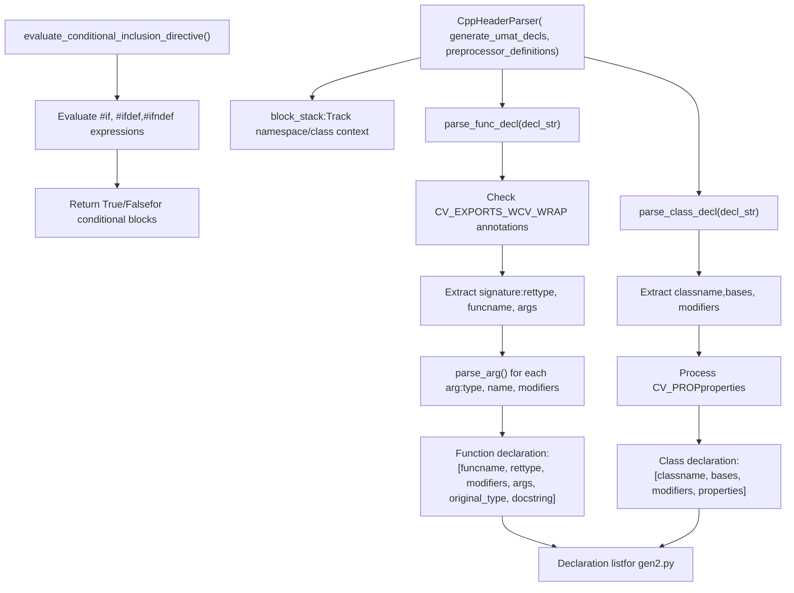
**`parse_func_decl()` 中的注解检测**

| Annotation | Detection | Purpose |
| --- | --- | --- |
| `CV_EXPORTS_W` | `"CV_EXPORTS_W" in decl_str` | 将函数标记为需要包装 |
| `CV_WRAP` | `"CV_WRAP" in decl_str` | 将方法标记为需要包装 |
| `CV_OUT` | `"CV_OUT" in arg_str` | 标记输出参数 |
| `CV_IN_OUT` | `"CV_IN_OUT" in arg_str` | 标记输入/输出参数 |
| `CV_WRAP_AS` | `"CV_WRAP_AS" in decl_str` | 重命名导出函数 |

关键解析方法：

-   **`parse_func_decl(decl_str, mat, docstring)`**: 解析带有 `CV_EXPORTS_W`/`CV_WRAP` 注解的函数签名 [modules/python/src2/hdr\_parser.py556-710](https://github.com/opencv/opencv/blob/91c78f50/modules/python/src2/hdr_parser.py#L556-L710)
-   **`parse_class_decl(decl_str)`**: 提取带有 `CV_EXPORTS_W_MAP` 或 `CV_EXPORTS_W_SIMPLE` 标记的类声明 [modules/python/src2/hdr\_parser.py411-442](https://github.com/opencv/opencv/blob/91c78f50/modules/python/src2/hdr_parser.py#L411-L442)
-   **`parse_arg(arg_str, argno)`**: 解析参数类型与修饰符，例如 `/O`（输出）、`/A`（数组）[modules/python/src2/hdr\_parser.py226-387](https://github.com/opencv/opencv/blob/91c78f50/modules/python/src2/hdr_parser.py#L226-L387)
-   **`get_macro_arg(arg_str, npos)`**: 提取宏参数，例如 `CV_WRAP_AS(name)` [modules/python/src2/hdr\_parser.py206-224](https://github.com/opencv/opencv/blob/91c78f50/modules/python/src2/hdr_parser.py#L206-L224)
-   **`evaluate_conditional_inclusion_directive(directive, preprocessor_definitions)`**: 求值 `#if`、`#ifdef` 条件 [modules/python/src2/hdr\_parser.py34-169](https://github.com/opencv/opencv/blob/91c78f50/modules/python/src2/hdr_parser.py#L34-L169)

Sources: [modules/python/src2/hdr\_parser.py172-199](https://github.com/opencv/opencv/blob/91c78f50/modules/python/src2/hdr_parser.py#L172-L199) [modules/python/src2/hdr\_parser.py556-710](https://github.com/opencv/opencv/blob/91c78f50/modules/python/src2/hdr_parser.py#L556-L710) [modules/python/src2/hdr\_parser.py411-442](https://github.com/opencv/opencv/blob/91c78f50/modules/python/src2/hdr_parser.py#L411-L442) [modules/python/src2/hdr\_parser.py226-387](https://github.com/opencv/opencv/blob/91c78f50/modules/python/src2/hdr_parser.py#L226-L387)

## 绑定生成器 (gen2.py)

`gen2.py` 脚本将解析后的 C++ 声明转换为 Python 包装代码。它使用 `ClassInfo` 和 `FuncInfo` 对象，通过模板替换生成类型转换代码、参数解析逻辑以及 C++ 函数调用。

**gen2.py 核心类与生成流程**

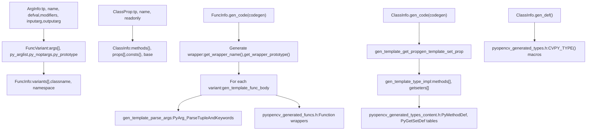
**关键类及其职责**

| Class | Purpose | Key Methods | File Location |
| --- | --- | --- | --- |
| `ArgInfo` | 表示函数参数 | `inputarg`, `outputarg`, `isbig()` | [modules/python/src2/gen2.py457-541](https://github.com/opencv/opencv/blob/91c78f50/modules/python/src2/gen2.py#L457-L541) |
| `FuncVariant` | 单个函数重载 | `init_pyproto()`, 生成 Python 原型 | [modules/python/src2/gen2.py597-747](https://github.com/opencv/opencv/blob/91c78f50/modules/python/src2/gen2.py#L597-L747) |
| `FuncInfo` | 含全部重载的函数 | `add_variant()`, `gen_code()`, `get_wrapper_name()` | [modules/python/src2/gen2.py749-875](https://github.com/opencv/opencv/blob/91c78f50/modules/python/src2/gen2.py#L749-L875) |
| `ClassProp` | 类属性 | `export_name` property | [modules/python/src2/gen2.py265-279](https://github.com/opencv/opencv/blob/91c78f50/modules/python/src2/gen2.py#L265-L279) |
| `ClassInfo` | C++ 类表示 | `gen_code()`, `gen_def()`, `gen_map_code()` | [modules/python/src2/gen2.py281-448](https://github.com/opencv/opencv/blob/91c78f50/modules/python/src2/gen2.py#L281-L448) |

**`simple_argtype_mapping` 中的类型映射**

```
simple_argtype_mapping = {    "bool": ArgTypeInfo("bool", FormatStrings.unsigned_char, "0", True),    "int": ArgTypeInfo("int", FormatStrings.int, "0", True),    "float": ArgTypeInfo("float", FormatStrings.float, "0.f", True),    "double": ArgTypeInfo("double", FormatStrings.double, "0", True),    "string": ArgTypeInfo("std::string", FormatStrings.object, None, True),    "Mat": ArgTypeInfo("Mat", FormatStrings.object, 'Mat()', True),    "UMat": ArgTypeInfo("UMat", FormatStrings.object, 'UMat()', True),}
```
Sources: [modules/python/src2/gen2.py229-241](https://github.com/opencv/opencv/blob/91c78f50/modules/python/src2/gen2.py#L229-L241) [modules/python/src2/gen2.py281-448](https://github.com/opencv/opencv/blob/91c78f50/modules/python/src2/gen2.py#L281-L448) [modules/python/src2/gen2.py749-875](https://github.com/opencv/opencv/blob/91c78f50/modules/python/src2/gen2.py#L749-L875) [modules/python/src2/gen2.py597-747](https://github.com/opencv/opencv/blob/91c78f50/modules/python/src2/gen2.py#L597-L747)

## 类型转换系统

类型转换系统通过专门的 `pyopencv_to()` 和 `pyopencv_from()` 模板函数在 Python 与 C++ 类型之间搭桥。这些转换器可处理 NumPy 数组、标准类型、OpenCV 类和容器，并在可能时实现零拷贝语义。

**类型转换器模板结构**

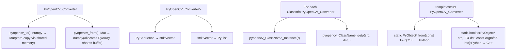
**Mat ↔ NumPy 转换流程**

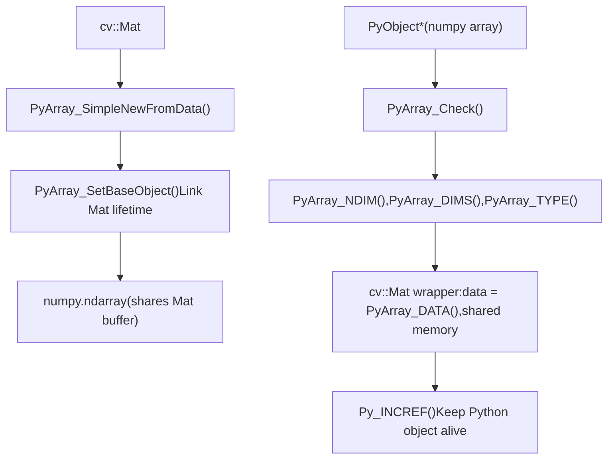
**类型转换表**

| C++ Type | Python Type | Converter Location | Zero-Copy |
| --- | --- | --- | --- |
| `cv::Mat` | `numpy.ndarray` | cv2\_numpy.hpp | Yes (shared buffer) |
| `cv::UMat` | `numpy.ndarray` | cv2\_convert.hpp | No (UMat.getMat() copies) |
| `std::vector<cv::Mat>` | `List[numpy.ndarray]` | Generated | Per-Mat basis |
| `cv::Scalar` | `tuple` or array | cv2\_convert.hpp | N/A |
| `Ptr<T>` | Python class instance | Generated converters | Reference counted |
| `int`, `float`, `bool` | `int`, `float`, `bool` | cv2\_convert.hpp | N/A |
| `std::string` | `str` | cv2\_convert.hpp | No (copy) |

**生成包装器中的参数转换**

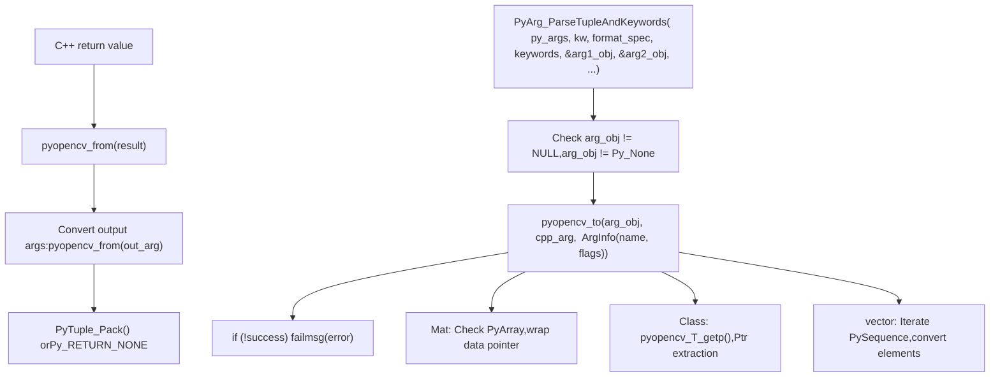
Sources: [modules/python/src2/cv2\_convert.hpp](https://github.com/opencv/opencv/blob/91c78f50/modules/python/src2/cv2_convert.hpp) [modules/python/src2/cv2\_numpy.hpp](https://github.com/opencv/opencv/blob/91c78f50/modules/python/src2/cv2_numpy.hpp) [modules/python/src2/gen2.py76-102](https://github.com/opencv/opencv/blob/91c78f50/modules/python/src2/gen2.py#L76-L102) [modules/python/src2/gen2.py876-1043](https://github.com/opencv/opencv/blob/91c78f50/modules/python/src2/gen2.py#L876-L1043)

## cv2 模块结构与初始化

`cv2` 模块由 Python 包加载器（[modules/python/package/cv2/\_\_init\_\_.py](https://github.com/opencv/opencv/blob/91c78f50/modules/python/package/cv2/__init__.py)）和原生扩展模块（[modules/python/src2/cv2.cpp](https://github.com/opencv/opencv/blob/91c78f50/modules/python/src2/cv2.cpp)）组成。加载器负责跨平台二进制发现，原生模块提供 C++ API 绑定。

**cv2 模块组件**

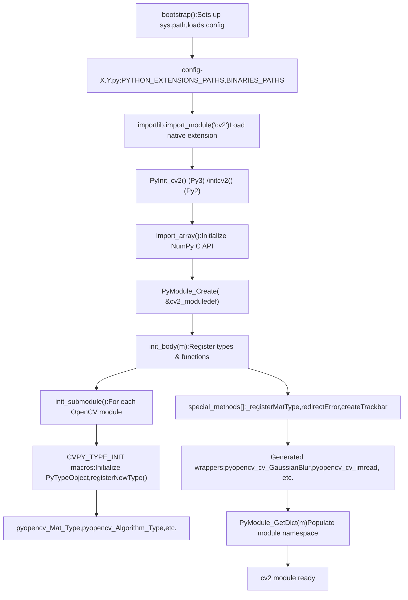
**模块初始化细节**

`cv2.cpp` 中的原生模块初始化遵循以下顺序：

1.  **NumPy API 初始化** [modules/python/src2/cv2.cpp594-607](https://github.com/opencv/opencv/blob/91c78f50/modules/python/src2/cv2.cpp#L594-L607):

    ```
    import_array(); // Initialize NumPy C APIPyObject* m = PyModule_Create(&cv2_moduledef);
    ```

2.  **类型注册** [modules/python/src2/cv2.cpp484-491](https://github.com/opencv/opencv/blob/91c78f50/modules/python/src2/cv2.cpp#L484-L491):

    ```
    // For each CVPY_TYPE macro in pyopencv_generated_types.hCVPY_TYPE_INIT_STATIC(EXPORT_NAME, CLASS_ID, return false, BASE, CONSTRUCTOR, SCOPE)// Calls registerNewType() to add type to module or parent class scope
    ```

3.  **子模块填充** [modules/python/src2/cv2.cpp475-481](https://github.com/opencv/opencv/blob/91c78f50/modules/python/src2/cv2.cpp#L475-L481):

    ```
    // For each CVPY_MODULE in pyopencv_generated_modules.hinit_submodule(m, MODULESTR NAMESTR, methods_##NAME, consts_##NAME)
    ```

4.  **常量发布** [modules/python/src2/cv2.cpp528-568](https://github.com/opencv/opencv/blob/91c78f50/modules/python/src2/cv2.cpp#L528-L568):

    ```
    PUBLISH(CV_8U);   // Adds CV_8U constant to module dictPUBLISH(CV_32F);  // etc.
    ```


**special\_methods\[\] 注册**

| Function | Purpose | Implementation |
| --- | --- | --- |
| `_registerMatType` | 注册自定义 Mat 类型 | [modules/python/src2/cv2.cpp96-110](https://github.com/opencv/opencv/blob/91c78f50/modules/python/src2/cv2.cpp#L96-L110) |
| `redirectError` | 自定义错误处理器 | [modules/python/src2/cv2.cpp114](https://github.com/opencv/opencv/blob/91c78f50/modules/python/src2/cv2.cpp#L114-L114) |
| `createTrackbar` | GUI 滑动条创建 | [modules/python/src2/cv2.cpp116](https://github.com/opencv/opencv/blob/91c78f50/modules/python/src2/cv2.cpp#L116-L116) |
| `setMouseCallback` | 鼠标事件处理 | [modules/python/src2/cv2.cpp118](https://github.com/opencv/opencv/blob/91c78f50/modules/python/src2/cv2.cpp#L118-L118) |
| `dnn_registerLayer` | 注册 DNN 层 | [modules/python/src2/cv2.cpp121-122](https://github.com/opencv/opencv/blob/91c78f50/modules/python/src2/cv2.cpp#L121-L122) |

**Bootstrap 加载器 (cv2/**init**.py)**

Python 包使用 bootstrap 系统来定位并加载原生扩展：

1.  **配置加载** [modules/python/package/cv2/\_\_init\_\_.py99-115](https://github.com/opencv/opencv/blob/91c78f50/modules/python/package/cv2/__init__.py#L99-L115):

    -   使用 `exec_file_wrapper()` 加载 `config.py` 和 `config-X.Y.py`
    -   设置 `PYTHON_EXTENSIONS_PATHS` 与 `BINARIES_PATHS`
2.  **路径处理** [modules/python/package/cv2/\_\_init\_\_.py132-133](https://github.com/opencv/opencv/blob/91c78f50/modules/python/package/cv2/__init__.py#L132-L133):

    -   将扩展路径插入 `sys.path`
    -   将二进制路径添加到 `PATH`（Windows）或 `LD_LIBRARY_PATH`（Linux）
3.  **原生导入** [modules/python/package/cv2/\_\_init\_\_.py151-163](https://github.com/opencv/opencv/blob/91c78f50/modules/python/package/cv2/__init__.py#L151-L163):

    -   导入原生 `cv2` 模块
    -   将符号重新链接到包命名空间

Sources: [modules/python/src2/cv2.cpp473-612](https://github.com/opencv/opencv/blob/91c78f50/modules/python/src2/cv2.cpp#L473-L612) [modules/python/src2/cv2.cpp112-125](https://github.com/opencv/opencv/blob/91c78f50/modules/python/src2/cv2.cpp#L112-L125) [modules/python/src2/cv2.cpp96-110](https://github.com/opencv/opencv/blob/91c78f50/modules/python/src2/cv2.cpp#L96-L110) [modules/python/package/cv2/\_\_init\_\_.py68-179](https://github.com/opencv/opencv/blob/91c78f50/modules/python/package/cv2/__init__.py#L68-L179)

## 基于模板的代码生成

代码生成器使用 Python `string.Template` 对象通过变量替换生成 C++ 包装代码。每个模板定义了一种函数、类或类型转换的代码模式。

**模板类别与使用方式**

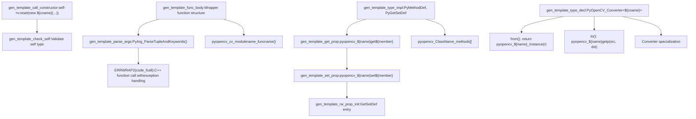
**核心模板定义**

定义于 [modules/python/src2/gen2.py40-207](https://github.com/opencv/opencv/blob/91c78f50/modules/python/src2/gen2.py#L40-L207) 的模板对象：

```
gen_template_func_body = Template("""$code_decl    $code_parse    {        ${code_prelude}ERRWRAP2($code_fcall);        $code_ret;    }""") gen_template_parse_args = Template("""const char* keywords[] = { $kw_list, NULL };    if( PyArg_ParseTupleAndKeywords(py_args, kw, "$fmtspec", (char**)keywords, $parse_arglist)$code_cvt )""") gen_template_type_decl = Template("""// Converter (${name})template<>struct PyOpenCV_Converter< ${cname} >{    static PyObject* from(const ${cname}& r) { return pyopencv_${name}_Instance(r); }    static bool to(PyObject* src, ${cname}& dst, const ArgInfo& info) { ... }};""")
```
**模板变量替换示例**

以 `cv::GaussianBlur()` 为例：

| Variable | Value |
| --- | --- |
| `${code_decl}` | `PyObject* pyopencv_cv_GaussianBlur(...) {` |
| `${code_parse}` | `const char* keywords[] = {"src", "dst", "ksize", ...}; if(PyArg_ParseTuple...)` |
| `${code_prelude}` | `Mat _src; Mat _dst; ...` (variable declarations) |
| `${code_fcall}` | `cv::GaussianBlur(_src, _dst, _ksize, _sigmaX, _sigmaY, _borderType)` |
| `${code_ret}` | `Py_RETURN_NONE` or tuple packing for output args |
| `${kw_list}` | `"src", "dst", "ksize", "sigmaX", "sigmaY", "borderType"` |
| `${fmtspec}` | \`"OO(dd) |

**`FuncInfo.gen_code()` 中的模板使用**

包装器生成过程 [modules/python/src2/gen2.py836-875](https://github.com/opencv/opencv/blob/91c78f50/modules/python/src2/gen2.py#L836-L875)：

1.  **构建参数列表**: 提取输入参数、输出参数、可选参数
2.  **生成声明**: 为局部变量生成 `code_decl`
3.  **生成解析代码**: 为 `PyArg_ParseTupleAndKeywords()` 生成 `code_parse`
4.  **生成转换代码**: 为 `pyopencv_to()` 调用生成 `code_cvt`
5.  **生成 C++ 调用**: 为实际 OpenCV 函数生成 `code_fcall`
6.  **生成返回代码**: 为返回值或输出元组生成 `code_ret`
7.  **替换模板**: 调用 `gen_template_func_body.substitute()`

Sources: [modules/python/src2/gen2.py40-102](https://github.com/opencv/opencv/blob/91c78f50/modules/python/src2/gen2.py#L40-L102) [modules/python/src2/gen2.py118-207](https://github.com/opencv/opencv/blob/91c78f50/modules/python/src2/gen2.py#L118-L207) [modules/python/src2/gen2.py836-875](https://github.com/opencv/opencv/blob/91c78f50/modules/python/src2/gen2.py#L836-L875)

## 构建系统集成

CMake 构建系统负责协同 Python 检测、头文件收集、代码生成与模块编译。构建会分别产出 Python 2 和 Python 3 的扩展模块。

**CMake 构建工作流**

**头文件收集与过滤**

从所有模块收集头文件 [modules/python/bindings/CMakeLists.txt24-46](https://github.com/opencv/opencv/blob/91c78f50/modules/python/bindings/CMakeLists.txt#L24-L46)：

```
foreach(m ${OPENCV_PYTHON_MODULES})  foreach(hdr ${OPENCV_MODULE_${m}_HEADERS})    ocv_is_subdir(is_sub "${OPENCV_MODULE_${m}_LOCATION}/include" "${hdr}")    if(is_sub)      list(APPEND opencv_hdrs "${hdr}")    endif()  endforeach()endforeach()
```
过滤以排除内部头文件 [modules/python/bindings/CMakeLists.txt48-65](https://github.com/opencv/opencv/blob/91c78f50/modules/python/bindings/CMakeLists.txt#L48-L65)：

```
ocv_list_filterout(opencv_hdrs "modules/.*\\.h$")        # C headersocv_list_filterout(opencv_hdrs "modules/.*\\.inl\\.h*")  # Inline implementationsocv_list_filterout(opencv_hdrs "modules/.*/cuda/")       # CUDA internalsocv_list_filterout(opencv_hdrs "modules/.*/hal/")        # HAL internals
```
**代码生成命令**

自定义命令执行 `gen2.py` [modules/python/bindings/CMakeLists.txt117-129](https://github.com/opencv/opencv/blob/91c78f50/modules/python/bindings/CMakeLists.txt#L117-L129)：

```
add_custom_command(    OUTPUT ${cv2_generated_files}  # pyopencv_generated_*.h    COMMAND "${PYTHON_DEFAULT_EXECUTABLE}" "${PYTHON_SOURCE_DIR}/src2/gen2.py"        "--config" "${JSON_CONFIG_FILE_PATH}"  # gen_python_config.json        "--output_dir" "${CMAKE_CURRENT_BINARY_DIR}"    DEPENDS "${PYTHON_SOURCE_DIR}/src2/gen2.py"            "${PYTHON_SOURCE_DIR}/src2/hdr_parser.py"            ${opencv_hdrs})
```
**生成文件**

代码生成输出文件 [modules/python/bindings/CMakeLists.txt67-76](https://github.com/opencv/opencv/blob/91c78f50/modules/python/bindings/CMakeLists.txt#L67-L76)：

| File | Content | Generated By |
| --- | --- | --- |
| `pyopencv_generated_enums.h` | 枚举常量 | `gen2.py` 枚举处理 |
| `pyopencv_generated_funcs.h` | 函数包装器 | `FuncInfo.gen_code()` |
| `pyopencv_generated_types.h` | `CVPY_TYPE()` 宏 | `ClassInfo.gen_def()` |
| `pyopencv_generated_types_content.h` | 方法/属性表 | `ClassInfo.gen_code()` |
| `pyopencv_generated_modules.h` | 模块结构 | 模块组织 |
| `pyopencv_generated_modules_content.h` | 子模块初始化 | `init_submodule()` 数据 |

**模块编译**

`common.cmake` 脚本编译扩展模块 [modules/python/common.cmake22-31](https://github.com/opencv/opencv/blob/91c78f50/modules/python/common.cmake#L22-L31)：

```
ocv_add_library(${the_module} MODULE  ${PYTHON_SOURCE_DIR}/src2/cv2.cpp  ${PYTHON_SOURCE_DIR}/src2/cv2_util.cpp  ${PYTHON_SOURCE_DIR}/src2/cv2_numpy.cpp  ${PYTHON_SOURCE_DIR}/src2/cv2_convert.cpp  ${PYTHON_SOURCE_DIR}/src2/cv2_highgui.cpp  ${cv2_generated_hdrs})
```
目标属性 [modules/python/common.cmake101-106](https://github.com/opencv/opencv/blob/91c78f50/modules/python/common.cmake#L101-L106)：

```
set_target_properties(${the_module} PROPERTIES  PREFIX ""  OUTPUT_NAME cv2  SUFFIX "${CVPY_SUFFIX}"  # .cpython-38-x86_64-linux-gnu.so)
```
Sources: [cmake/OpenCVDetectPython.cmake24-265](https://github.com/opencv/opencv/blob/91c78f50/cmake/OpenCVDetectPython.cmake#L24-L265) [modules/python/CMakeLists.txt4-34](https://github.com/opencv/opencv/blob/91c78f50/modules/python/CMakeLists.txt#L4-L34) [modules/python/bindings/CMakeLists.txt15-129](https://github.com/opencv/opencv/blob/91c78f50/modules/python/bindings/CMakeLists.txt#L15-L129) [modules/python/common.cmake4-106](https://github.com/opencv/opencv/blob/91c78f50/modules/python/common.cmake#L4-L106)

## 支持的 Python 版本与兼容性

该系统支持同时为 Python 2 与 Python 3 生成绑定，并对两者差异进行专门处理。

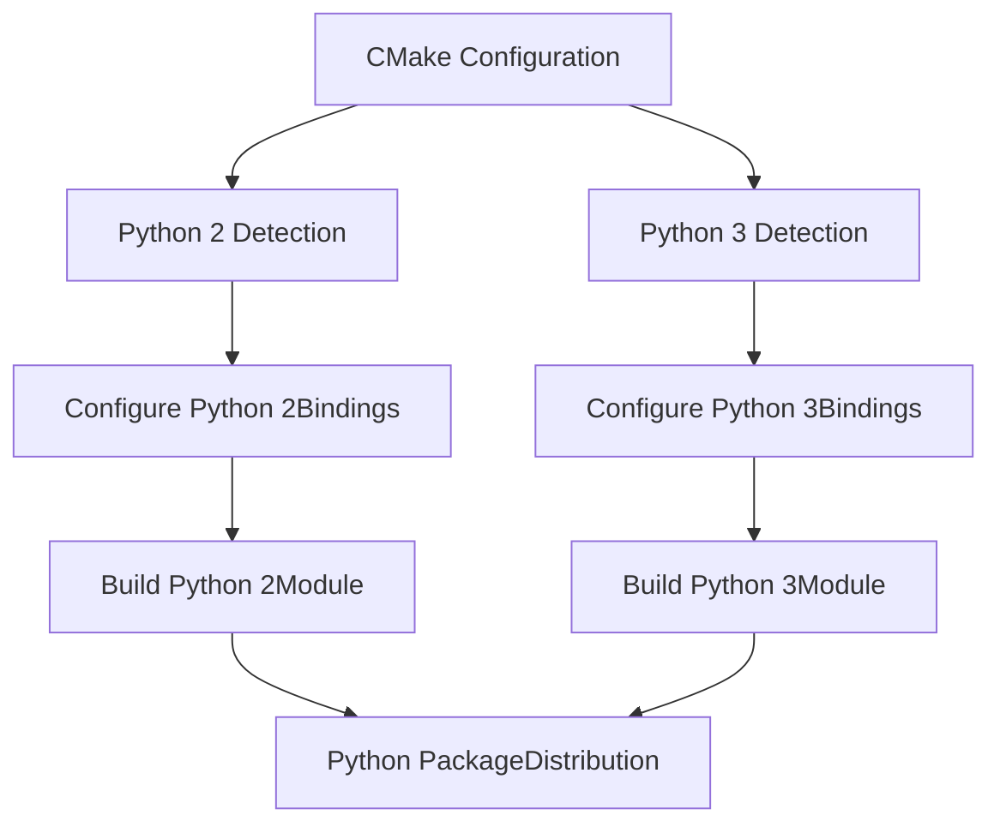
特别注意包括：

-   不同 Python 版本使用不同模块名
-   版本特定的类型处理
-   为更好兼容性提供的 Limited API 支持

Sources: [modules/python/python2/CMakeLists.txt](https://github.com/opencv/opencv/blob/91c78f50/modules/python/python2/CMakeLists.txt) [modules/python/python3/CMakeLists.txt](https://github.com/opencv/opencv/blob/91c78f50/modules/python/python3/CMakeLists.txt) [modules/python/src2/pycompat.hpp](https://github.com/opencv/opencv/blob/91c78f50/modules/python/src2/pycompat.hpp)

## 运行时架构

当生成的 Python 模块被加载后，它在 Python 代码与 OpenCV C++ 实现之间提供桥接层。

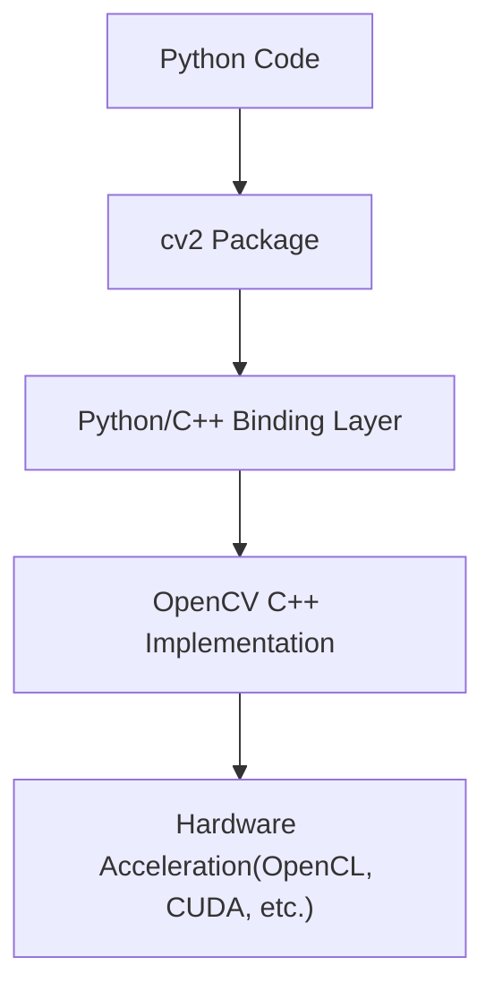
该运行时架构包括：

-   提供接口的 `cv2` Python 包
-   在 Python 与 C++ 之间进行转换的绑定层
-   底层 OpenCV C++ 实现
-   通过 C++ 实现提供的硬件加速支持

Sources: [modules/python/src2/cv2.cpp60-608](https://github.com/opencv/opencv/blob/91c78f50/modules/python/src2/cv2.cpp#L60-L608) [modules/python/package/cv2/\_\_init\_\_.py](https://github.com/opencv/opencv/blob/91c78f50/modules/python/package/cv2/__init__.py)

## 在 C++ 代码中处理注解

OpenCV 在 C++ 代码中使用特殊注解来控制绑定生成。

| Annotation | Purpose | Example |
| --- | --- | --- |
| `CV_EXPORTS_W` | 将类或函数标记为可包装 | `CV_EXPORTS_W void filter2D(...)` |
| `CV_WRAP` | 将方法标记为可包装 | `CV_WRAP void setParams(...)` |
| `CV_PROP` | 标记只读类属性 | `CV_PROP int rows;` |
| `CV_PROP_RW` | 标记可读写类属性 | `CV_PROP_RW double threshold;` |
| `CV_OUT` | 标记输出参数 | `CV_OUT std::vector<Rect>& faces` |

头文件解析器会识别这些注解并将信息传递给生成器，生成器据此决定如何生成绑定代码。

Sources: [modules/python/src2/hdr\_parser.py75-129](https://github.com/opencv/opencv/blob/91c78f50/modules/python/src2/hdr_parser.py#L75-L129)

## 面向 IDE 支持的 Python 类型桩生成

该系统还会生成 Python 类型桩（`.pyi` 文件），以为 Python 绑定提供更好的 IDE 支持与类型检查能力。

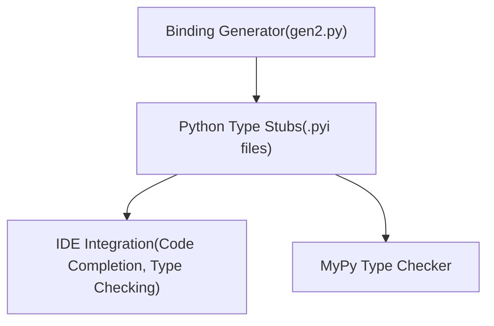
类型桩提供：

-   函数与方法签名
-   类定义
-   参数与返回值的类型提示
-   文档字符串

Sources: [modules/python/bindings/CMakeLists.txt9](https://github.com/opencv/opencv/blob/91c78f50/modules/python/bindings/CMakeLists.txt#L9-L9) [modules/python/src2/gen2.py9](https://github.com/opencv/opencv/blob/91c78f50/modules/python/src2/gen2.py#L9-L9)

## 生成文件及其结构

代码生成器会产出多个头文件，编译期间由 `cv2.cpp` 包含。每个文件在绑定系统中承担特定角色。

**生成文件组织**

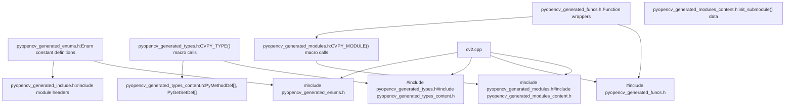
**文件内容与结构**

**1\. pyopencv\_generated\_types.h**

包含每个被包装类的 `CVPY_TYPE()` 宏调用 [modules/python/src2/gen2.py429-448](https://github.com/opencv/opencv/blob/91c78f50/modules/python/src2/gen2.py#L429-L448)：

```
// Generated by ClassInfo.gen_def()CVPY_TYPE(Mat, Mat, cv::Mat, Ptr, NoBase, 0, "")CVPY_TYPE(Algorithm, Algorithm, Ptr<cv::Algorithm>, Ptr, NoBase, pyopencv_Algorithm_Algorithm, "")CVPY_TYPE(StereoBM, StereoBM, Ptr<cv::StereoBM>, Ptr, StereoMatcher, pyopencv_StereoBM_StereoBM, "")
```
**2\. pyopencv\_generated\_types\_content.h**

包含由 `ClassInfo.gen_code()` 生成的方法和属性表 [modules/python/src2/gen2.py379-427](https://github.com/opencv/opencv/blob/91c78f50/modules/python/src2/gen2.py#L379-L427)：

```
// GetSet (Mat)static PyObject* pyopencv_Mat_get_rows(pyopencv_Mat_t* p, void *closure) {    return pyopencv_from(p->v->rows);}// ... // Methods (Mat)static PyObject* pyopencv_cv_Mat_ptr(PyObject* self, PyObject* py_args, PyObject* kw) {    // wrapper implementation}// ... // Tables (Mat)static PyGetSetDef pyopencv_Mat_getseters[] = {    {(char*)"rows", (getter)pyopencv_Mat_get_rows, NULL, (char*)"rows", NULL},    // ...    {NULL}}; static PyMethodDef pyopencv_Mat_methods[] = {    {"ptr", CV_PY_FN_WITH_KW(pyopencv_cv_Mat_ptr), "ptr(...) -> ..."},    // ...    {NULL, NULL}};
```
**3\. pyopencv\_generated\_funcs.h**

包含模块级函数的包装器 [modules/python/src2/gen2.py836-875](https://github.com/opencv/opencv/blob/91c78f50/modules/python/src2/gen2.py#L836-L875)：

```
static PyObject* pyopencv_cv_imread(PyObject* , PyObject* py_args, PyObject* kw){    using namespace cv;    // Parse arguments    const char* keywords[] = { "filename", "flags", NULL };    PyObject* filename_obj = NULL;    int flags = IMREAD_COLOR;    if( PyArg_ParseTupleAndKeywords(py_args, kw, "O|i", (char**)keywords, &filename_obj, &flags) )    {        // Convert arguments        String filename;        if (!pyopencv_to_safe(filename_obj, filename, ArgInfo("filename", 0))) return NULL;        // Call C++ function        Mat retval;        ERRWRAP2(retval = cv::imread(filename, flags));        // Return result        return pyopencv_from(retval);    }    // ...}
```
**4\. pyopencv\_generated\_modules.h**

包含用于子模块组织的 `CVPY_MODULE()` 宏调用：

```
CVPY_MODULE("", )          // Root cv2 moduleCVPY_MODULE(".dnn", dnn)   // cv2.dnn submoduleCVPY_MODULE(".ml", ml)     // cv2.ml submodule// ...
```
**5\. pyopencv\_generated\_enums.h**

包含枚举常量定义：

```
{"IMREAD_COLOR", static_cast<long>(cv::IMREAD_COLOR)},{"IMREAD_GRAYSCALE", static_cast<long>(cv::IMREAD_GRAYSCALE)},// ...
```
**CVPY\_TYPE 宏展开**

`CVPY_TYPE()` 宏会根据构建配置以不同方式展开 [modules/python/src2/pycompat.hpp217-245](https://github.com/opencv/opencv/blob/91c78f50/modules/python/src2/pycompat.hpp#L217-L245)：

对于静态类型：

```
struct pyopencv_Mat_t {    PyObject_HEAD    cv::Mat v;};static PyTypeObject pyopencv_Mat_TypeXXX = { /* ... */ };static PyTypeObject * pyopencv_Mat_TypePtr = &pyopencv_Mat_TypeXXX;
```
对于动态类型（Limited API）：

```
// Similar but uses PyType_FromSpec()
```
Sources: [modules/python/src2/gen2.py429-448](https://github.com/opencv/opencv/blob/91c78f50/modules/python/src2/gen2.py#L429-L448) [modules/python/src2/gen2.py379-427](https://github.com/opencv/opencv/blob/91c78f50/modules/python/src2/gen2.py#L379-L427) [modules/python/src2/gen2.py836-875](https://github.com/opencv/opencv/blob/91c78f50/modules/python/src2/gen2.py#L836-L875) [modules/python/src2/pycompat.hpp217-289](https://github.com/opencv/opencv/blob/91c78f50/modules/python/src2/pycompat.hpp#L217-L289) [modules/python/bindings/CMakeLists.txt67-76](https://github.com/opencv/opencv/blob/91c78f50/modules/python/bindings/CMakeLists.txt#L67-L76)

## 特殊情况与高级特性

绑定系统通过自定义代码和生成器逻辑处理若干特殊场景。

**重载解析**

多个 C++ 重载会被包装为一个 Python 函数，并按顺序尝试各个变体 [modules/python/src2/gen2.py859-875](https://github.com/opencv/opencv/blob/91c78f50/modules/python/src2/gen2.py#L859-L875)：

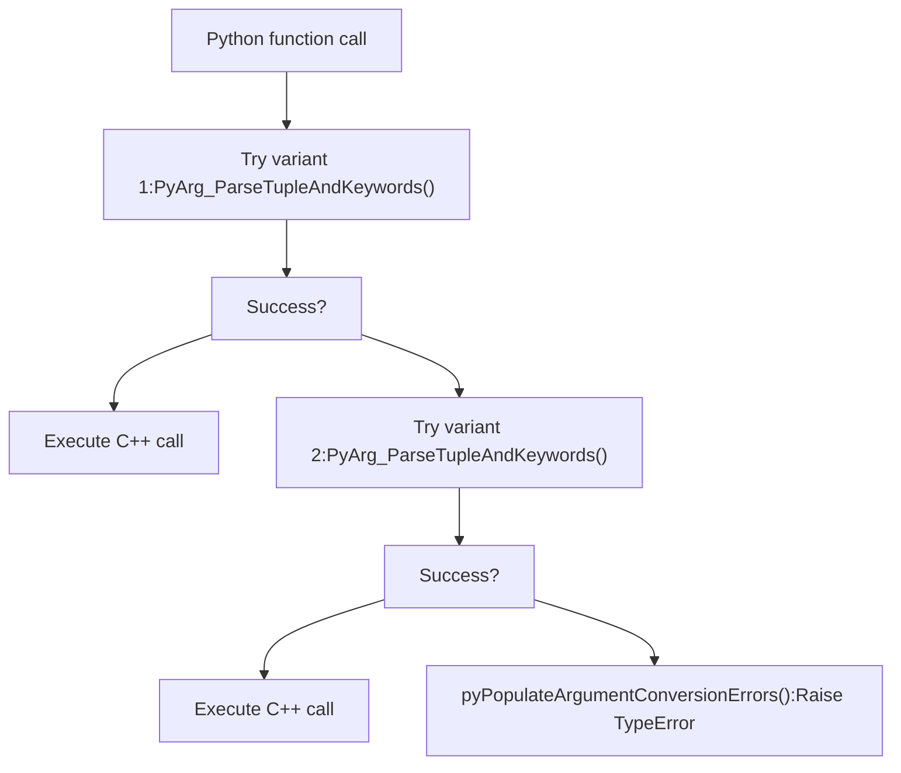
生成的重载包装结构：

```
static PyObject* pyopencv_cv_function(PyObject* , PyObject* py_args, PyObject* kw){    // Try variant 1    {        const char* keywords[] = { "arg1", "arg2", NULL };        if( PyArg_ParseTupleAndKeywords(...) ) {            // variant 1 implementation        }        pyPopulateArgumentConversionErrors();    }    // Try variant 2    {        const char* keywords[] = { "arg1", NULL };        if( PyArg_ParseTupleAndKeywords(...) ) {            // variant 2 implementation        }        pyPopulateArgumentConversionErrors();    }    return NULL;  // All variants failed}
```
**输出参数**

带 `/O` 修饰符的参数会成为输出参数 [modules/python/src2/hdr\_parser.py242-248](https://github.com/opencv/opencv/blob/91c78f50/modules/python/src2/hdr_parser.py#L242-L248)：

1.  **从输入中移除**: 若无默认值，不出现在 `py_arglist` 中
2.  **加入输出**: 加入 `py_outlist` 元组
3.  **可选输入**: 若有默认值，则作为可选输入参数出现

示例：`cv::imencode(ext, img, CV_OUT std::vector<uchar>& buf)`

-   Python 签名：`imencode(ext, img) -> (retval, buf)`
-   `buf` 仅输出，不是输入参数

**命名参数（参数结构体）**

函数可使用带 `CV_EXPORTS_W_PARAMS` 标记的参数结构体 [modules/python/src2/gen2.py656-682](https://github.com/opencv/opencv/blob/91c78f50/modules/python/src2/gen2.py#L656-L682)：

```
struct CV_EXPORTS_W_PARAMS FunctionParams {    CV_PROP_RW int lambda = -1;    CV_PROP_RW float sigma = 0.0f;}; CV_WRAP void myFunction(InputArray src, OutputArray dst, const FunctionParams& params = FunctionParams());
```
生成器会将属性展开为独立参数：

```
# Python callcv2.myFunction(src, dst, lambda=5, sigma=0.5)
```
**自定义类型转换**

`misc/python/` 目录中的模块特定转换器 [modules/dnn/misc/python/pyopencv\_dnn.hpp](https://github.com/opencv/opencv/blob/91c78f50/modules/dnn/misc/python/pyopencv_dnn.hpp)：

```
// Custom DNN Net conversionstemplate<>bool pyopencv_to(PyObject* src, cv::dnn::Net& dst, const ArgInfo& info) {    // Custom conversion logic}
```
**UMat 处理**

UMat 参数会生成特殊变体 [modules/python/src2/gen2.py861-874](https://github.com/opencv/opencv/blob/91c78f50/modules/python/src2/gen2.py#L861-L874)：

-   优先尝试 Mat 变体（效率更高）
-   Mat 变体失败后再尝试 UMat 变体
-   当 Mat 可行时，避免昂贵的 UMat 构造

Sources: [modules/python/src2/gen2.py656-682](https://github.com/opencv/opencv/blob/91c78f50/modules/python/src2/gen2.py#L656-L682) [modules/python/src2/gen2.py859-875](https://github.com/opencv/opencv/blob/91c78f50/modules/python/src2/gen2.py#L859-L875) [modules/python/src2/hdr\_parser.py242-248](https://github.com/opencv/opencv/blob/91c78f50/modules/python/src2/hdr_parser.py#L242-L248) [modules/dnn/misc/python/pyopencv\_dnn.hpp](https://github.com/opencv/opencv/blob/91c78f50/modules/dnn/misc/python/pyopencv_dnn.hpp)

## 结论

OpenCV Python API 生成系统能够从 C++ 代码自动创建 Python 绑定，使 Python 开发者可以使用 OpenCV 的完整能力。该系统结合头文件解析、代码生成与构建系统集成，产出对 Python 开发者自然友好且通过调用 C++ 实现维持高性能的无缝绑定。
