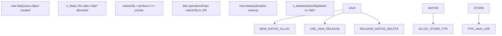
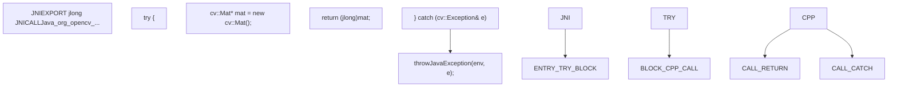
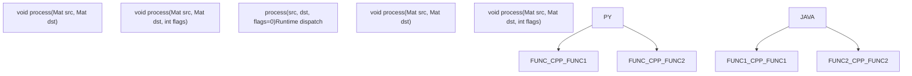
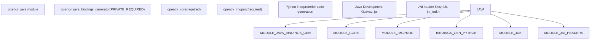

# Java/JNI 绑定与跨语言设计

相关源文件

-   [cmake/android/OpenCVDetectAndroidSDK.cmake](https://github.com/opencv/opencv/blob/91c78f50/cmake/android/OpenCVDetectAndroidSDK.cmake)
-   [cmake/android/android\_ant\_projects.cmake](https://github.com/opencv/opencv/blob/91c78f50/cmake/android/android_ant_projects.cmake)
-   [modules/core/misc/java/src/java/core+Mat.java](https://github.com/opencv/opencv/blob/91c78f50/modules/core/misc/java/src/java/core+Mat.java)
-   [modules/core/misc/java/test/MatTest.java](https://github.com/opencv/opencv/blob/91c78f50/modules/core/misc/java/test/MatTest.java)
-   [modules/dnn/misc/java/gen\_dict.json](https://github.com/opencv/opencv/blob/91c78f50/modules/dnn/misc/java/gen_dict.json)
-   [modules/dnn/misc/java/src/cpp/dnn\_converters.cpp](https://github.com/opencv/opencv/blob/91c78f50/modules/dnn/misc/java/src/cpp/dnn_converters.cpp)
-   [modules/dnn/misc/java/src/cpp/dnn\_converters.hpp](https://github.com/opencv/opencv/blob/91c78f50/modules/dnn/misc/java/src/cpp/dnn_converters.hpp)
-   [modules/dnn/misc/java/test/DnnListRegressionTest.java](https://github.com/opencv/opencv/blob/91c78f50/modules/dnn/misc/java/test/DnnListRegressionTest.java)
-   [modules/dnn/misc/java/test/DnnTensorFlowTest.java](https://github.com/opencv/opencv/blob/91c78f50/modules/dnn/misc/java/test/DnnTensorFlowTest.java)
-   [modules/java/check-tests.py](https://github.com/opencv/opencv/blob/91c78f50/modules/java/check-tests.py)
-   [modules/java/generator/CMakeLists.txt](https://github.com/opencv/opencv/blob/91c78f50/modules/java/generator/CMakeLists.txt)
-   [modules/java/generator/gen\_java.py](https://github.com/opencv/opencv/blob/91c78f50/modules/java/generator/gen_java.py)
-   [modules/java/generator/src/cpp/CleanableMat.cpp](https://github.com/opencv/opencv/blob/91c78f50/modules/java/generator/src/cpp/CleanableMat.cpp)
-   [modules/java/generator/src/cpp/Mat.cpp](https://github.com/opencv/opencv/blob/91c78f50/modules/java/generator/src/cpp/Mat.cpp)
-   [modules/java/generator/src/java/org/opencv/utils/Converters.java](https://github.com/opencv/opencv/blob/91c78f50/modules/java/generator/src/java/org/opencv/utils/Converters.java)
-   [modules/java/generator/src/java9/CleanableMat.java](https://github.com/opencv/opencv/blob/91c78f50/modules/java/generator/src/java9/CleanableMat.java)
-   [modules/java/generator/src/java\_classic/CleanableMat.java](https://github.com/opencv/opencv/blob/91c78f50/modules/java/generator/src/java_classic/CleanableMat.java)
-   [modules/java/generator/templates/java\_class.prolog](https://github.com/opencv/opencv/blob/91c78f50/modules/java/generator/templates/java_class.prolog)
-   [modules/java/generator/templates/java\_class\_inherited.prolog](https://github.com/opencv/opencv/blob/91c78f50/modules/java/generator/templates/java_class_inherited.prolog)
-   [modules/java/generator/templates/java\_module.prolog](https://github.com/opencv/opencv/blob/91c78f50/modules/java/generator/templates/java_module.prolog)
-   [modules/java/jni/CMakeLists.txt](https://github.com/opencv/opencv/blob/91c78f50/modules/java/jni/CMakeLists.txt)
-   [modules/java/test/android\_test/CMakeLists.txt](https://github.com/opencv/opencv/blob/91c78f50/modules/java/test/android_test/CMakeLists.txt)
-   [modules/java/test/android\_test/build.gradle.in](https://github.com/opencv/opencv/blob/91c78f50/modules/java/test/android_test/build.gradle.in)
-   [modules/java/test/android\_test/gradle.properties](https://github.com/opencv/opencv/blob/91c78f50/modules/java/test/android_test/gradle.properties)
-   [modules/java/test/android\_test/settings.gradle](https://github.com/opencv/opencv/blob/91c78f50/modules/java/test/android_test/settings.gradle)
-   [modules/java/test/android\_test/src/org/opencv/test/OpenCVTestCase.java](https://github.com/opencv/opencv/blob/91c78f50/modules/java/test/android_test/src/org/opencv/test/OpenCVTestCase.java)
-   [modules/java/test/android\_test/src/org/opencv/test/OpenCVTestRunner.java](https://github.com/opencv/opencv/blob/91c78f50/modules/java/test/android_test/src/org/opencv/test/OpenCVTestRunner.java)
-   [modules/java/test/android\_test/src/org/opencv/test/android/KotlinTest.kt](https://github.com/opencv/opencv/blob/91c78f50/modules/java/test/android_test/src/org/opencv/test/android/KotlinTest.kt)
-   [modules/java/test/android\_test/src/org/opencv/test/android/UtilsTest.java](https://github.com/opencv/opencv/blob/91c78f50/modules/java/test/android_test/src/org/opencv/test/android/UtilsTest.java)
-   [modules/java/test/android\_test/tests\_module/build.gradle.in](https://github.com/opencv/opencv/blob/91c78f50/modules/java/test/android_test/tests_module/build.gradle.in)
-   [modules/java/test/common\_test/src/org/opencv/test/utils/ConvertersTest.java](https://github.com/opencv/opencv/blob/91c78f50/modules/java/test/common_test/src/org/opencv/test/utils/ConvertersTest.java)
-   [modules/java/test/pure\_test/src/org/opencv/test/OpenCVTestCase.java](https://github.com/opencv/opencv/blob/91c78f50/modules/java/test/pure_test/src/org/opencv/test/OpenCVTestCase.java)
-   [platforms/android/ndk-25.config.py](https://github.com/opencv/opencv/blob/91c78f50/platforms/android/ndk-25.config.py)
-   [samples/android/15-puzzle/AndroidManifest.xml](https://github.com/opencv/opencv/blob/91c78f50/samples/android/15-puzzle/AndroidManifest.xml)
-   [samples/android/15-puzzle/CMakeLists.txt](https://github.com/opencv/opencv/blob/91c78f50/samples/android/15-puzzle/CMakeLists.txt)
-   [samples/android/image-manipulations/CMakeLists.txt](https://github.com/opencv/opencv/blob/91c78f50/samples/android/image-manipulations/CMakeLists.txt)
-   [samples/android/tutorial-1-camerapreview/res/values/strings.xml](https://github.com/opencv/opencv/blob/91c78f50/samples/android/tutorial-1-camerapreview/res/values/strings.xml)
-   [samples/android/tutorial-2-mixedprocessing/CMakeLists.txt](https://github.com/opencv/opencv/blob/91c78f50/samples/android/tutorial-2-mixedprocessing/CMakeLists.txt)
-   [samples/android/tutorial-3-cameracontrol/res/layout/tutorial3\_surface\_view.xml](https://github.com/opencv/opencv/blob/91c78f50/samples/android/tutorial-3-cameracontrol/res/layout/tutorial3_surface_view.xml)
-   [samples/android/tutorial-3-cameracontrol/src/org/opencv/samples/tutorial3/Tutorial3View.java](https://github.com/opencv/opencv/blob/91c78f50/samples/android/tutorial-3-cameracontrol/src/org/opencv/samples/tutorial3/Tutorial3View.java)

## 目标与范围

本文解释 OpenCV 的 Java 绑定系统，以及在所有 OpenCV 绑定中使用的通用跨语言设计模式。重点包括 Java Native Interface（JNI）包装架构、Java 代码生成流水线，以及与 Python 等其他语言绑定共享的常见绑定设计原则。

有关 Python 绑定具体实现细节，请参见 [Python API Generation and Binding](/opencv/opencv/11.1-python-bindings-and-code-generation)。

## Java/JNI 架构概览

OpenCV 的 Java 绑定使用 Java Native Interface（JNI）在 Java 代码与原生 C++ OpenCV 库之间搭桥。该系统采用声明式方法：处理带有 `CV_WRAP` 宏注解的 C++ 头文件，同时生成 Java 类与对应的 JNI 包装函数。

### Java 绑定流水线

Sources: [modules/java/CMakeLists.txt1-72](https://github.com/opencv/opencv/blob/91c78f50/modules/java/CMakeLists.txt#L1-L72) [modules/java/common.cmake](https://github.com/opencv/opencv/blob/91c78f50/modules/java/common.cmake) (referenced), [modules/python/src2/hdr\_parser.py172-200](https://github.com/opencv/opencv/blob/91c78f50/modules/python/src2/hdr_parser.py#L172-L200)

### JNI 包装架构

Java 绑定由两层构成：

**Java 层**：纯 Java 类，提供类型安全 API 与内存管理。每个 OpenCV C++ 类映射为一个 Java 类，并通过 `nativeObj` 字段存储原生指针。

**JNI 层**：具有 JNI 签名（`JNIEXPORT`/`JNICALL`）的 C++ 函数，负责在 Java 与 C++ 间编组数据、进行类型转换，并调用底层 OpenCV 函数。

Sources: [modules/java/CMakeLists.txt58-63](https://github.com/opencv/opencv/blob/91c78f50/modules/java/CMakeLists.txt#L58-L63) [modules/python/src2/hdr\_parser.py556-620](https://github.com/opencv/opencv/blob/91c78f50/modules/python/src2/hdr_parser.py#L556-L620) (shared parser logic)

## JNI 代码生成系统

Java 绑定生成器会处理解析后的 C++ 声明，生成 Java 包装类与 JNI 桥接函数。生成器需要处理 Java 特有要求，例如显式内存管理、包组织以及 JNI 类型编组。

### Java 生成流水线

```mermaid
flowchart TD
    PARSED_CLASSES["Class DeclarationsClassInfo objects"]
    PARSED_FUNCS["Function DeclarationsFuncInfo with args"]
    PARSED_CONSTS["Constants and Enumsname-value pairs"]
    JAVA_CLASS_GEN["Java Class Generatorgenerate Java source"]
    PACKAGE_RESOLVER["Package Resolutionorg.opencv.core, etc."]
    METHOD_GEN["Method Generatornative declarations"]
    FIELD_GEN["Field Generatorpublic long nativeObj"]
    JNI_FUNC_GEN["JNI Function GeneratorJNIEXPORT signatures"]
    TYPE_MARSHALLER["Type Marshallerjlong <-> cv::Mat*"]
    EXCEPTION_HANDLER["Exception HandlerC++ -> Java exceptions"]
    JAVA_SRC["Java Source FilesMat.java, Core.java"]
    JNI_CPP_SRC["JNI C++ Sourcesorg_opencv_core_Mat.cpp"]
    JNI_HDR["JNI Headersorg_opencv_core_Mat.h"]

    PARSED --> CLASSES_JAVA_CLASS_GEN
    PARSED --> FUNCS_JAVA_CLASS_GEN
    PARSED --> CONSTS_JAVA_CLASS_GEN
    JAVA --> CLASS_GEN_PACKAGE_RESOLVER
    PACKAGE --> RESOLVER_METHOD_GEN
    PACKAGE --> RESOLVER_FIELD_GEN
    PARSED --> CLASSES_JNI_FUNC_GEN
    PARSED --> FUNCS_JNI_FUNC_GEN
    JNI --> FUNC_GEN_TYPE_MARSHALLER
    JNI --> FUNC_GEN_EXCEPTION_HANDLER
    METHOD --> GEN_JAVA_SRC
    FIELD --> GEN_JAVA_SRC
    TYPE --> MARSHALLER_JNI_CPP_SRC
    EXCEPTION --> HANDLER_JNI_CPP_SRC
    JNI --> FUNC_GEN_JNI_HDR
```

Sources: [modules/java/CMakeLists.txt1-18](https://github.com/opencv/opencv/blob/91c78f50/modules/java/CMakeLists.txt#L1-L18) [modules/python/src2/gen2.py597-747](https://github.com/opencv/opencv/blob/91c78f50/modules/python/src2/gen2.py#L597-L747) (similar architecture)

### JNI 命名约定

生成器遵循严格的 JNI 命名约定，以将 Java native 方法映射到 C++ 函数名：

| Java Declaration | JNI Function Name | Notes |
| --- | --- | --- |
| `Mat.nativeObj` | 保存 C++ 指针的字段 | 以 `jlong`（64 位）存储 |
| `native long n_Mat()` | `Java_org_opencv_core_Mat_n_1Mat` | 构造函数包装器 |
| `native void n_delete(long)` | `Java_org_opencv_core_Mat_n_1delete` | 析构函数包装器 |
| `Core.add(...)` | `Java_org_opencv_core_Core_add` | 静态方法包装器 |

`n_` 前缀用于在 Java 源码中区分 native 方法，`_1` 用于在 JNI 函数名中编码下划线。

Sources: [modules/java/CMakeLists.txt20-36](https://github.com/opencv/opencv/blob/91c78f50/modules/java/CMakeLists.txt#L20-L36)

### Java 注解处理

头文件解析器会识别控制 Java 代码生成的绑定注解：

| Annotation | Purpose | Java Impact |
| --- | --- | --- |
| `CV_WRAP` | 将函数/方法标记为可包装 | 生成公开 Java 方法 + JNI 包装器 |
| `CV_EXPORTS_W` | 将类标记为可包装 | 生成带 `nativeObj` 字段的 Java 类 |
| `CV_OUT` | 输出参数修饰符 | 成为附加返回值或数组参数 |
| `CV_IN_OUT` | 输入/输出参数修饰符 | 为保证可变性必须使用数组包装 |
| `CV_WRAP_AS()` | 提供备用名称 | Java 方法使用备用名 |

Sources: [modules/python/src2/hdr\_parser.py172-200](https://github.com/opencv/opencv/blob/91c78f50/modules/python/src2/hdr_parser.py#L172-L200) [modules/python/src2/hdr\_parser.py556-620](https://github.com/opencv/opencv/blob/91c78f50/modules/python/src2/hdr_parser.py#L556-L620)

## Java 类型转换与内存管理

由于 Java 缺乏确定性终结机制，Java 绑定实现了显式内存管理。每个被包装的 C++ 对象在 Java 中由 `long nativeObj` 字段表示，该字段保存指向原生 C++ 对象的指针。

### 内存管理模式

Sources: [modules/java/CMakeLists.txt58-63](https://github.com/opencv/opencv/blob/91c78f50/modules/java/CMakeLists.txt#L58-L63)

### 类型转换系统

JNI 层使用显式编组函数在 Java 与 C++ 类型间转换：

| C++ Type | Java Type | JNI Type | Conversion Method |
| --- | --- | --- | --- |
| `cv::Mat` | `Mat` | `jlong` | 将 `cv::Mat*` 作为指针存储 |
| `std::vector<int>` | `MatOfInt` | `jlong` | 包装到 `Mat` 中，访问时转换 |
| `cv::Point` | `Point` | `jobject` | 逐字段传输 |
| `std::string` | `String` | `jstring` | `JNIEnv->GetStringUTFChars()` |
| `int`, `float`, etc. | Primitives | `jint`, `jfloat` | 直接类型转换 |
| `std::vector<cv::Mat>` | `List<Mat>` | `jlong` | 转换为指针数组 |

### JNI 异常处理

C++ 异常会在 JNI 包装器中被捕获并转换为 Java 异常：

Sources: [modules/python/src2/gen2.py597-747](https://github.com/opencv/opencv/blob/91c78f50/modules/python/src2/gen2.py#L597-L747) (similar pattern for Python), [modules/java/common.cmake](https://github.com/opencv/opencv/blob/91c78f50/modules/java/common.cmake) (referenced)

### 向量与矩阵专用类

Java 绑定为常见 `std::vector<T>` 实例化提供了专用包装类：

-   `MatOfByte` - 包装 `std::vector<uchar>`
-   `MatOfInt` - 包装 `std::vector<int>`
-   `MatOfFloat` - 包装 `std::vector<float>`
-   `MatOfPoint` - 包装 `std::vector<cv::Point>`
-   `MatOfPoint2f` - 包装 `std::vector<cv::Point2f>`
-   `MatOfRect` - 包装 `std::vector<cv::Rect>`

这些类继承自 `Mat`，并提供类型化的 `toArray()` 与 `fromArray()` 方法，方便在 Java 数组与 OpenCV 数据结构之间转换。

Sources: [modules/java/CMakeLists.txt20-36](https://github.com/opencv/opencv/blob/91c78f50/modules/java/CMakeLists.txt#L20-L36)

## 跨语言设计模式

尽管 Java 与 Python 绑定在实现上不同，但它们共享通用设计模式，以在不同语言之间提供一致行为。

### 共享头文件解析

Java 与 Python 绑定都使用同一个 `hdr_parser.py` 模块来解析 C++ 头文件：

```mermaid
flowchart TD
    CPP_HEADERS["C++ Headersopencv2/*.hpp"]
    HDR_PARSER["hdr_parser.pyCppHeaderParser class"]
    PARSE_FUNC["parse_func_decl()parse_class_decl()"]
    PYTHON_GEN["gen2.pyPython generator"]
    JAVA_GEN["gen_java.pyJava generator"]
    FUNC_INFO["FuncInfo[name, rettype, args]"]
    CLASS_INFO["ClassInfo[name, methods, props]"]
    CONST_INFO["Constants[name, value]"]

    CPP --> HEADERS_HDR_PARSER
    HDR --> PARSER_PARSE_FUNC
    PARSE --> FUNC_FUNC_INFO
    PARSE --> FUNC_CLASS_INFO
    PARSE --> FUNC_CONST_INFO
    FUNC --> INFO_PYTHON_GEN
    FUNC --> INFO_JAVA_GEN
    CLASS --> INFO_PYTHON_GEN
    CLASS --> INFO_JAVA_GEN
    CONST --> INFO_PYTHON_GEN
    CONST --> INFO_JAVA_GEN
```

Sources: [modules/python/src2/hdr\_parser.py172-555](https://github.com/opencv/opencv/blob/91c78f50/modules/python/src2/hdr_parser.py#L172-L555) [modules/python/src2/gen2.py1-50](https://github.com/opencv/opencv/blob/91c78f50/modules/python/src2/gen2.py#L1-L50)

### 通用绑定策略

| Design Aspect | Python Approach | Java Approach | Shared Pattern |
| --- | --- | --- | --- |
| Object Lifecycle | 自动（引用计数） | 显式 `release()` | 在语言对象中包装 C++ 指针 |
| Memory Storage | `PyObject*` with embedded data | `long nativeObj` field | 将原生指针作为不透明句柄 |
| Method Calls | Direct C API call | JNI native method call | 编组参数、调用 C++、编组结果 |
| Exception Handling | Convert to `cv2.error` | Convert to `CvException` | 在包装层捕获 C++ 异常 |
| Vector Types | Convert to Python list | Specialized `MatOf*` classes | 对 `std::vector<T>` 使用包装器 |
| Default Arguments | Optional parameters | Method overloading | 同一函数的多个变体 |

### 函数重载解析

两个生成器都会处理 C++ 函数重载，并创建语言特定机制：

**Python**：单一函数 + 可选参数。绑定层在运行时检查参数类型，并分发到合适的 C++ 重载。

**Java**：多个 Java 方法（重载）映射到不同 JNI 函数，每个 JNI 函数调用一个特定 C++ 重载。

Sources: [modules/python/src2/gen2.py597-747](https://github.com/opencv/opencv/blob/91c78f50/modules/python/src2/gen2.py#L597-L747) [modules/java/CMakeLists.txt20-36](https://github.com/opencv/opencv/blob/91c78f50/modules/java/CMakeLists.txt#L20-L36)

### 输出参数处理

C++ 输出参数（以 `CV_OUT` 标记）在不同语言中的处理方式不同：

**Python**：输出参数会成为附加返回值；多个返回值打包为元组。

**Java**：输出参数使用数组包装（如 `int[] output`），或返回包含多个字段的对象。

Sources: [modules/python/src2/hdr\_parser.py226-387](https://github.com/opencv/opencv/blob/91c78f50/modules/python/src2/hdr_parser.py#L226-L387) [modules/python/src2/gen2.py749-835](https://github.com/opencv/opencv/blob/91c78f50/modules/python/src2/gen2.py#L749-L835)

## Java 构建系统集成

Java 绑定通过模块化配置与 OpenCV 的 CMake 构建系统集成，支持桌面 Java 与 Android 在内的多平台。

### 构建配置流程

Sources: [modules/java/CMakeLists.txt1-72](https://github.com/opencv/opencv/blob/91c78f50/modules/java/CMakeLists.txt#L1-L72) [cmake/OpenCVModule.cmake1-66](https://github.com/opencv/opencv/blob/91c78f50/cmake/OpenCVModule.cmake#L1-L66)

### 平台特定配置

构建系统会处理平台差异：

| Platform | Library Name | Packaging | Notes |
| --- | --- | --- | --- |
| Linux | `libopencv_java<ver>.so` | JAR + `.so` | 通过 `System.loadLibrary()` 加载 |
| Windows | `opencv_java<ver>.dll` | JAR + `.dll` | 必须位于 PATH 或 JAR 中 |
| macOS | `libopencv_java<ver>.dylib` | JAR + `.dylib` | 嵌入应用 bundle |
| Android | `libopencv_java<ver>.so` | AAR package | Android 专用 SDK 生成 |

### Java/JNI 模块依赖

Java 模块有特定依赖要求：

`BUILD_FAT_JAVA_LIB` 选项用于控制 Java 绑定是导出全部 OpenCV 函数（需要静态库构建）还是仅导出显式包装的函数。

Sources: [modules/java/CMakeLists.txt1-18](https://github.com/opencv/opencv/blob/91c78f50/modules/java/CMakeLists.txt#L1-L18) [CMakeLists.txt499-504](https://github.com/opencv/opencv/blob/91c78f50/CMakeLists.txt#L499-L504)

### Android SDK 生成

针对 Android，构建系统提供额外目标：

-   `android_sdk` - 生成 Android AAR 包，包含 Java 类与多 ABI 原生库
-   通过 Gradle 或旧版 Ant 构建系统进行 Android 项目配置
-   自动将原生库打包到 `jniLibs` 目录结构

Sources: [modules/java/CMakeLists.txt58-63](https://github.com/opencv/opencv/blob/91c78f50/modules/java/CMakeLists.txt#L58-L63)

## 构建系统集成

跨语言接口设计与 OpenCV 的 CMake 构建系统集成，以提供语言绑定的自动化配置与编译能力。

构建系统处理以下事项：

1.  **语言检测**：自动检测 Python/Java 解释器与开发库
2.  **依赖解析**：解析用于绑定生成的 OpenCV 模块间依赖
3.  **交叉编译**：支持交叉编译场景，并应用合适的工具链配置
4.  **安装**：按平台安装绑定模块与加载器基础设施

Sources: [cmake/OpenCVDetectPython.cmake24-265](https://github.com/opencv/opencv/blob/91c78f50/cmake/OpenCVDetectPython.cmake#L24-L265) [modules/python/bindings/CMakeLists.txt15-135](https://github.com/opencv/opencv/blob/91c78f50/modules/python/bindings/CMakeLists.txt#L15-L135) [modules/python/common.cmake1-60](https://github.com/opencv/opencv/blob/91c78f50/modules/python/common.cmake#L1-L60) [modules/python/python\_loader.cmake1-158](https://github.com/opencv/opencv/blob/91c78f50/modules/python/python_loader.cmake#L1-L158)
