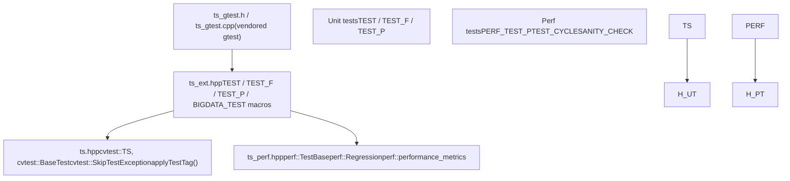
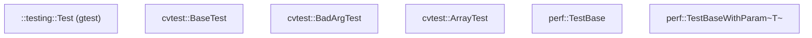
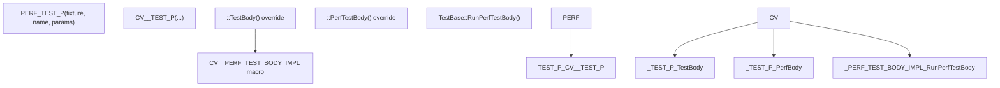
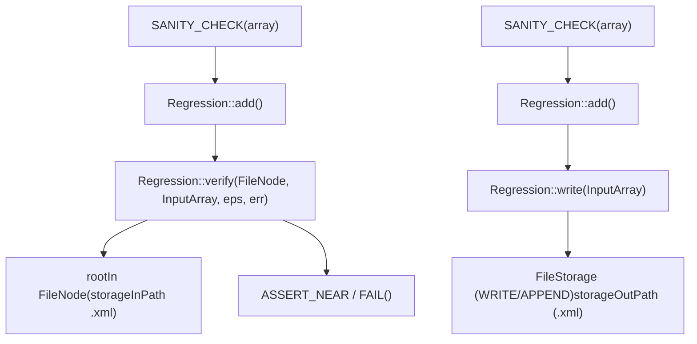

# 测试框架（ts）

相关源文件

-   [modules/core/src/parallel.cpp](https://github.com/opencv/opencv/blob/91c78f50/modules/core/src/parallel.cpp)
-   [modules/ts/CMakeLists.txt](https://github.com/opencv/opencv/blob/91c78f50/modules/ts/CMakeLists.txt)
-   [modules/ts/include/opencv2/ts.hpp](https://github.com/opencv/opencv/blob/91c78f50/modules/ts/include/opencv2/ts.hpp)
-   [modules/ts/include/opencv2/ts/ts\_ext.hpp](https://github.com/opencv/opencv/blob/91c78f50/modules/ts/include/opencv2/ts/ts_ext.hpp)
-   [modules/ts/include/opencv2/ts/ts\_gtest.h](https://github.com/opencv/opencv/blob/91c78f50/modules/ts/include/opencv2/ts/ts_gtest.h)
-   [modules/ts/include/opencv2/ts/ts\_perf.hpp](https://github.com/opencv/opencv/blob/91c78f50/modules/ts/include/opencv2/ts/ts_perf.hpp)
-   [modules/ts/src/precomp.hpp](https://github.com/opencv/opencv/blob/91c78f50/modules/ts/src/precomp.hpp)
-   [modules/ts/src/ts.cpp](https://github.com/opencv/opencv/blob/91c78f50/modules/ts/src/ts.cpp)
-   [modules/ts/src/ts\_arrtest.cpp](https://github.com/opencv/opencv/blob/91c78f50/modules/ts/src/ts_arrtest.cpp)
-   [modules/ts/src/ts\_func.cpp](https://github.com/opencv/opencv/blob/91c78f50/modules/ts/src/ts_func.cpp)
-   [modules/ts/src/ts\_gtest.cpp](https://github.com/opencv/opencv/blob/91c78f50/modules/ts/src/ts_gtest.cpp)
-   [modules/ts/src/ts\_perf.cpp](https://github.com/opencv/opencv/blob/91c78f50/modules/ts/src/ts_perf.cpp)

## 目标与范围

`ts` 模块是 OpenCV 的内部测试库。它提供统一的测试基础设施，供其他所有 OpenCV 模块测试二进制链接使用。该模块内置了一份 vendored Google Test，并在其基础上扩展了 OpenCV 专用的 fixture、宏与工具函数，同时加入了专用的性能基准子系统。

本页介绍 `ts` 模块的整体结构、单元测试与性能测试共享的核心类、测试标签过滤系统以及常用工具函数。性能基准循环与回归基线管理的详细内容见 [Performance Testing with perf::TestBase](/opencv/opencv/12.1-performance-testing-with-perf::testbase)。单元测试层、OpenCL 校验辅助以及 `run.py` 运行器见 [Unit Testing and OpenCL Test Utilities](/opencv/opencv/12.2-unit-testing-and-opencl-test-utilities)。

---

## 模块布局

`ts` 模块以**静态库**（`OPENCV_MODULE_TYPE STATIC`）形式构建，并被排除在 `opencv_world` 之外。它不会面向最终用户发布，仅用于链接各模块生成的 `*_tests` 与 `*_perf_tests` 二进制。

在 [modules/ts/CMakeLists.txt](https://github.com/opencv/opencv/blob/91c78f50/modules/ts/CMakeLists.txt) 中声明的**构建依赖**：

| Dependency | Role in ts |
| --- | --- |
| `opencv_core` | `Mat`、RNG、`FileStorage`、错误处理 |
| `opencv_imgproc` | 测试工具中的参考实现 |
| `opencv_imgcodecs` | 加载测试图像 |
| `opencv_videoio` | 测试中的视频采集 |
| `opencv_highgui` | 显示辅助 |

在 WinRT 上，由于操作系统不提供对环境变量的运行时访问，`OPENCV_TEST_DATA_PATH` 与 `OPENCV_PERF_VALIDATION_DIR` 会在 CMake 阶段作为宏固化进去 [modules/ts/CMakeLists.txt10-15](https://github.com/opencv/opencv/blob/91c78f50/modules/ts/CMakeLists.txt#L10-L15)

### 源文件

| File | Contents |
| --- | --- |
| `modules/ts/include/opencv2/ts.hpp` | 公共 API：`TS`、`BaseTest`、工具函数、测试标签 |
| `modules/ts/include/opencv2/ts/ts_perf.hpp` | `TestBase`、`Regression`、`performance_metrics`、性能宏 |
| `modules/ts/include/opencv2/ts/ts_ext.hpp` | `TEST`、`TEST_F`、`TEST_P`、`BIGDATA_TEST` 的宏重写 |
| `modules/ts/include/opencv2/ts/ts_gtest.h` | vendored Google Test 单头文件 |
| `modules/ts/src/ts.cpp` | `TS` 单例、`BaseTest`、`BadArgTest` |
| `modules/ts/src/ts_perf.cpp` | `TestBase`、`Regression`、`performance_metrics` |
| `modules/ts/src/ts_func.cpp` | 参考数学操作、`randomMat`、`norm`、`PSNR`、`cmpUlps` |
| `modules/ts/src/ts_arrtest.cpp` | `ArrayTest` 基类 |
| `modules/ts/src/ts_gtest.cpp` | vendored Google Test 实现 |

---

## 架构概览

**图：ts 模块分层与主要代码实体**


Sources: [modules/ts/include/opencv2/ts.hpp](https://github.com/opencv/opencv/blob/91c78f50/modules/ts/include/opencv2/ts.hpp) [modules/ts/include/opencv2/ts/ts\_perf.hpp](https://github.com/opencv/opencv/blob/91c78f50/modules/ts/include/opencv2/ts/ts_perf.hpp) [modules/ts/include/opencv2/ts/ts\_ext.hpp](https://github.com/opencv/opencv/blob/91c78f50/modules/ts/include/opencv2/ts/ts_ext.hpp)

---

## 核心基础设施：`cvtest::TS`

`TS` 是进程级单例，通过 `TS::ptr()` 访问。它负责：

-   全局 `param_seed`，用于可复现实验地为每个测试的 RNG 设种子。
-   `output_buf` 字符串缓冲区数组（LOG、SUMMARY、CONSOLE），用于累积每个测试输出，并在失败时转储。
-   `current_test_info`（`TestInfo`）结构体，用于跟踪当前激活测试、用例索引和错误码。
-   错误路由：`TS::set_failed_test_info(int)` 映射到 `TS::FailureCode` 枚举；`TS::set_gtest_status()` 将其转换为 GTest 的 `FAIL()` 调用。

`TS` 中定义的**失败码**：

| Code | Meaning |
| --- | --- |
| `FAIL_GENERIC` | 未知 |
| `FAIL_MISSING_TEST_DATA` | 未找到测试数据文件 |
| `FAIL_ERROR_IN_CALLED_FUNC` | 函数内部触发了 `cv::Error` |
| `FAIL_MEMORY_EXCEPTION` | 段错误 / 访问违规 |
| `FAIL_ARITHM_EXCEPTION` | 浮点或整数算术异常 |
| `FAIL_BAD_ACCURACY` | 输出在范围内但超出允许 epsilon |
| `FAIL_MISMATCH` | 输出与预期不匹配 |

[modules/ts/src/ts.cpp517-541](https://github.com/opencv/opencv/blob/91c78f50/modules/ts/src/ts.cpp#L517-L541)

---

## 基础测试类

**图：单元测试与性能测试的类层级**


Sources: [modules/ts/include/opencv2/ts.hpp148-400](https://github.com/opencv/opencv/blob/91c78f50/modules/ts/include/opencv2/ts.hpp#L148-L400) [modules/ts/include/opencv2/ts/ts\_perf.hpp374-498](https://github.com/opencv/opencv/blob/91c78f50/modules/ts/include/opencv2/ts/ts_perf.hpp#L374-L498) [modules/ts/src/ts.cpp252-430](https://github.com/opencv/opencv/blob/91c78f50/modules/ts/src/ts.cpp#L252-L430)

### `cvtest::BaseTest`

用于功能测试的旧式基类。子类需要重写：

-   `run_func()` — 调用被测 OpenCV 函数。
-   `prepare_test_case(idx)` — 分配并填充输入数据。
-   `validate_test_results(idx)` — 将输出与参考结果比较。

`BaseTest::safe_run()` 会用信号处理器（POSIX 上的 SIGSEGV、SIGFPE 等；Windows 上的 `_set_se_translator`）包装 `run()`，并捕获 `cv::Exception` [modules/ts/src/ts.cpp287-338](https://github.com/opencv/opencv/blob/91c78f50/modules/ts/src/ts.cpp#L287-L338)

### `cvtest::ArrayTest`

`BaseTest` 的扩展，面向数组处理函数。它会分配随机化 `CvMat` / `IplImage` 数组，用 `randUni()` 填充，调用 `run_func()`，并通过 `cmpEps2()` 将输出与参考数组比较。行为由 `min_log_array_size` / `max_log_array_size` 控制 [modules/ts/src/ts\_arrtest.cpp51-333](https://github.com/opencv/opencv/blob/91c78f50/modules/ts/src/ts_arrtest.cpp#L51-L333)

### `cvtest::BadArgTest`

用于验证函数能否正确拒绝非法输入：断言调用 `run_func()` 时会抛出带有期望错误码的 `cv::Exception` [modules/ts/src/ts.cpp432-481](https://github.com/opencv/opencv/blob/91c78f50/modules/ts/src/ts.cpp#L432-L481)

---

## 性能测试：`perf::TestBase`

`perf::TestBase` 是所有基准测试的 fixture。它直接继承 `::testing::Test`，并负责预热、计时测量循环、离群值剔除与指标报告。

关键成员：

| Member | Role |
| --- | --- |
| `declare` (`_declareHelper`) | 用于注册输入/输出数组并设置时间限制的链式 API |
| `times` (`TimeVector`) | 以 ticks 记录的每轮原始耗时 |
| `metrics` (`performance_metrics`) | 循环后计算得到的统计指标 |
| `timeLimit` | 单测试墙钟时间预算 |
| `minIters` / `nIters` / `currentIter` | 迭代控制 |

计时循环由三个方法驱动：

-   `startTimer()` — 记录起始 tick 并返回 `true`（作为循环条件）。
-   `stopTimer()` — 记录耗时 tick 到 `times`。
-   `next()` — 检查终止条件（时间限制、迭代次数、稳定性）；结束时返回 `false`。

使用 `TEST_CYCLE()` 宏的标准模式：

```
// Expands to: for(; perf::TestBase::startTimer(); perf::TestBase::stopTimer())
TEST_CYCLE() { cv::someFunction(src, dst); }
```
`TestBase::Init()` 会解析控制策略、种子、线程数、sanity check 与 CUDA 设备选择的命令行参数 [modules/ts/src/ts\_perf.cpp947-1002](https://github.com/opencv/opencv/blob/91c78f50/modules/ts/src/ts_perf.cpp#L947-L1002)

有关预热、回归基线和指标计算的完整细节，请参见 [Performance Testing with perf::TestBase](/opencv/opencv/12.1-performance-testing-with-perf::testbase)。

---

## 测试宏

**图：性能测试的宏展开链**


Sources: [modules/ts/include/opencv2/ts/ts\_perf.hpp523-630](https://github.com/opencv/opencv/blob/91c78f50/modules/ts/include/opencv2/ts/ts_perf.hpp#L523-L630) [modules/ts/include/opencv2/ts/ts\_ext.hpp176-208](https://github.com/opencv/opencv/blob/91c78f50/modules/ts/include/opencv2/ts/ts_ext.hpp#L176-L208)

### 性能测试宏

| Macro | Use case |
| --- | --- |
| `PERF_TEST(case, name)` | 简单的非参数化性能测试 |
| `PERF_TEST_F(fixture, name)` | 使用自定义 fixture 类的性能测试 |
| `PERF_TEST_P(fixture, name, params)` | 参数化性能测试；内部也会调用 `INSTANTIATE_TEST_CASE_P` |
| `PERF_TEST_P_(fixture, name)` | 类似 `PERF_TEST_P`，但不自动实例化 |
| `TEST_CYCLE()` | 用 `startTimer()`/`stopTimer()` 包裹的 `for` 循环 |
| `SANITY_CHECK(array, ...)` | 调用 `Regression::add()` 进行比对或记录输出 |
| `SANITY_CHECK_NOTHING()` | 标记测试已验证但不做输出比较 |
| `SANITY_CHECK_KEYPOINTS(array, ...)` | `vector<cv::KeyPoint>` 的 sanity check |
| `SANITY_CHECK_MATCHES(array, ...)` | `vector<cv::DMatch>` 的 sanity check |

[modules/ts/include/opencv2/ts/ts\_perf.hpp215-660](https://github.com/opencv/opencv/blob/91c78f50/modules/ts/include/opencv2/ts/ts_perf.hpp#L215-L660)

### 单元测试宏重写

`ts_ext.hpp` 替换了标准 gtest 的 `TEST`、`TEST_F` 与 `TEST_P` 宏。重写版本会：

1.  添加 `setUpSkipped` 标志，使 `SetUp()` 中抛出的异常可以抑制 `TestBody()`。
2.  使用单独工厂类，在构造阶段捕获 `SkipTestExceptionBase`，并替换为 `SkipThisTest` 占位实现。
3.  用 `cvtest::testSetUp()` / `cvtest::testTearDown()` 包裹 `Body()`（实际用户代码）。

[modules/ts/include/opencv2/ts/ts\_ext.hpp72-211](https://github.com/opencv/opencv/blob/91c78f50/modules/ts/include/opencv2/ts/ts_ext.hpp#L72-L211)

---

## 预定义尺寸常量

`ts_perf.hpp` 导出了常用基准分辨率的尺寸常量：

| Constant | Value |
| --- | --- |
| `szQVGA` | 320×240 |
| `szVGA` | 640×480 |
| `sznHD` | 640×360 |
| `szqHD` | 960×540 |
| `sz720p` | 1280×720 |
| `sz1080p` | 1920×1080 |
| `sz2160p` | 3840×2160 |
| `szODD` | 127×61（非 2 的幂边界案例） |

诸如 `SZ_TYPICAL`、`SZ_ALL_HD`、`TYPICAL_MATS` 的分组选择宏，会将这些常量与 `::testing::Values()` 组合，以便在 `INSTANTIATE_TEST_CASE_P` 中使用。

[modules/ts/include/opencv2/ts/ts\_perf.hpp46-85](https://github.com/opencv/opencv/blob/91c78f50/modules/ts/include/opencv2/ts/ts_perf.hpp#L46-L85)

---

## 测试标签系统

标签允许在不修改测试代码的前提下，基于资源约束或平台能力选择性启用或跳过测试。

### 内置标签常量（定义于 `ts.hpp`）

| Tag | Meaning |
| --- | --- |
| `CV_TEST_TAG_MEMORY_512MB` | 测试占用 200–512 MB；默认启用 |
| `CV_TEST_TAG_MEMORY_2GB` | 在 32 位平台禁用 |
| `CV_TEST_TAG_MEMORY_6GB` | 默认禁用 |
| `CV_TEST_TAG_LONG` | 单线程运行 5 秒以上 |
| `CV_TEST_TAG_VERYLONG` | 20 秒以上 |
| `CV_TEST_TAG_DEBUG_LONG` | 用于 Debug 构建 |
| `CV_TEST_TAG_SIZE_HD` | 720p 及以上 |
| `CV_TEST_TAG_SIZE_FULLHD` | 1080p 及以上 |
| `CV_TEST_TAG_TYPE_64F` | 使用 `CV_64F` 深度 |
| `CV_TEST_TAG_OPENCL` | OpenCL 路径 |

[modules/ts/include/opencv2/ts.hpp59-89](https://github.com/opencv/opencv/blob/91c78f50/modules/ts/include/opencv2/ts.hpp#L59-L89)

### API

-   `cvtest::applyTestTag(tag)` — 将标签应用到当前测试；若标签在跳过列表中，则抛出 `SkipTestException`。
-   `cvtest::registerGlobalSkipTag(tag)` — 全局注册要跳过的标签（在 `main()` 或测试初始化时调用）。
-   `cvtest::checkTestTags()` — 显式执行延迟的标签检查。

应用复合标签（例如 `CV_TEST_TAG_SIZE_4K`）时，会自动应用其蕴含标签（`SIZE_FULLHD`、`SIZE_HD`），从而使“禁用 HD”这类宽泛跳过策略覆盖更高分辨率，而无需每个测试都列出全部蕴含标签。

[modules/ts/include/opencv2/ts.hpp207-258](https://github.com/opencv/opencv/blob/91c78f50/modules/ts/include/opencv2/ts.hpp#L207-L258)

---

## 工具函数（`cvtest` 命名空间）

`ts.hpp` 与 `ts_func.cpp` 暴露了一组参考实现与辅助函数，供测试体中使用。

### 随机数据生成

| Function | Signature |
| --- | --- |
| `randomMat` | `(RNG&, Size, int type, double minVal, double maxVal, bool useRoi) → Mat` |
| `randomSize` | `(RNG&, double maxSizeLog) → Size` |
| `randomType` | `(RNG&, DepthMask, int minCh, int maxCh) → int` |
| `randUni` | `(RNG&, Mat&, Scalar lo, Scalar hi)` |

[modules/ts/src/ts\_func.cpp41-70](https://github.com/opencv/opencv/blob/91c78f50/modules/ts/src/ts_func.cpp#L41-L70) [modules/ts/include/opencv2/ts.hpp296-302](https://github.com/opencv/opencv/blob/91c78f50/modules/ts/include/opencv2/ts.hpp#L296-L302)

### 比较与误差测量

| Function | Purpose |
| --- | --- |
| `norm(src, normType)` | 单数组标量范数 |
| `norm(src1, src2, normType)` | 两数组差异范数 |
| `PSNR(src1, src2)` | dB 单位峰值信噪比 |
| `cmpUlps(data, refdata, expMaxDiff, ...)` | 浮点 ULP 比较 |
| `cmpEps2(ts, actual, expected, eps, ...)` | Epsilon 比较，并在 `TS` 中记录失败 |

[modules/ts/include/opencv2/ts.hpp339-350](https://github.com/opencv/opencv/blob/91c78f50/modules/ts/include/opencv2/ts.hpp#L339-L350)

### 参考算术实现

`ts_func.cpp` 提供了朴素 C++ 参考实现，用于校验加速库函数：

-   `add`、`multiply`、`divide` — 带 alpha/beta 缩放的逐元素算术。
-   `convert` — 带缩放与偏移的类型转换。
-   `copy`、`set`、`extract`、`insert` — 支持 mask 的数组操作。
-   `filter2D`、`erode`、`dilate`、`copyMakeBorder` — 参考卷积与形态学实现。
-   `transpose`、`minMaxLoc`、`mean` — 规约操作。

[modules/ts/src/ts\_func.cpp152-600](https://github.com/opencv/opencv/blob/91c78f50/modules/ts/src/ts_func.cpp#L152-L600)

---

## `perf::Regression`：Sanity Check 存储

`Regression` 是一个单例：在“写入 sanity”运行中将期望输出写入 XML 文件，并在后续运行中进行校验。其持久化基于 `cv::FileStorage`。

**图：Regression 数据流**


Sources: [modules/ts/src/ts\_perf.cpp130-635](https://github.com/opencv/opencv/blob/91c78f50/modules/ts/src/ts_perf.cpp#L130-L635) [modules/ts/include/opencv2/ts/ts\_perf.hpp174-219](https://github.com/opencv/opencv/blob/91c78f50/modules/ts/include/opencv2/ts/ts_perf.hpp#L174-L219)

每个测试的每个数组会存储如下数据：最小值、最大值、最后一个元素，以及两个随机采样元素（通过 `regRNG` 保证可复现）。对向量还会存储一个随机元素索引。对 keypoints 与 descriptor matches，则将各字段分别存为独立矩阵。

支持的 `ERROR_TYPE` 值：

-   `ERROR_ABSOLUTE` — `|expected - actual| ≤ eps`
-   `ERROR_RELATIVE` — `|expected - actual| ≤ eps * max(|expected|, |actual|)`

---

## `perf::performance_metrics`

`performance_metrics` 结构体保存单次测试运行计算得到的全部计时统计：

| Field | Type | Description |
| --- | --- | --- |
| `samples` | `unsigned int` | 保留的计时样本数量 |
| `outliers` | `unsigned int` | 被判定为离群值并丢弃的样本数 |
| `min` | `double` | 最小样本值（秒） |
| `median` | `double` | 中位样本值 |
| `mean` | `double` | 算术平均值 |
| `gmean` | `double` | 几何平均值 |
| `stddev` | `double` | 标准差 |
| `gstddev` | `double` | log(time) 的标准差 |
| `frequency` | `double` | 用于换算的 tick 频率 |
| `bytesIn` / `bytesOut` | `size_t` | 声明的输入/输出大小 |
| `terminationReason` | `int` | `TERM_TIME`、`TERM_ITERATIONS`、`TERM_INTERRUPT` 等 |

[modules/ts/include/opencv2/ts/ts\_perf.hpp232-259](https://github.com/opencv/opencv/blob/91c78f50/modules/ts/include/opencv2/ts/ts_perf.hpp#L232-L259)

---

## 关键命令行参数

`TestBase::Init()` 通过 `cv::CommandLineParser` 注册这些参数：

| Flag | Default | Effect |
| --- | --- | --- |
| `--perf_time_limit` | 3.0 s（Android 为 6.0） | 每个测试的最大墙钟时间 |
| `--perf_min_samples` | 10 | 停止前最小迭代次数 |
| `--perf_force_samples` | 100 | 覆盖：始终精确运行该次数 |
| `--perf_max_outliers` | 8 | 可丢弃样本占比（%） |
| `--perf_seed` | 809564 | RNG 种子 |
| `--perf_threads` | \-1 | 工作线程数（-1 = 默认） |
| `--perf_write_sanity` | false | 将回归基线写入 XML |
| `--perf_verify_sanity` | false | 若无基线则失败 |
| `--perf_impl` | `plain` | 要选择的实现变体 |
| `--perf_strategy` | `default` | `base` 或 `simple` 离群策略 |
| `--perf_cuda_device` | 0 | GPU 测试的 CUDA 设备索引 |

[modules/ts/src/ts\_perf.cpp961-1001](https://github.com/opencv/opencv/blob/91c78f50/modules/ts/src/ts_perf.cpp#L961-L1001)
