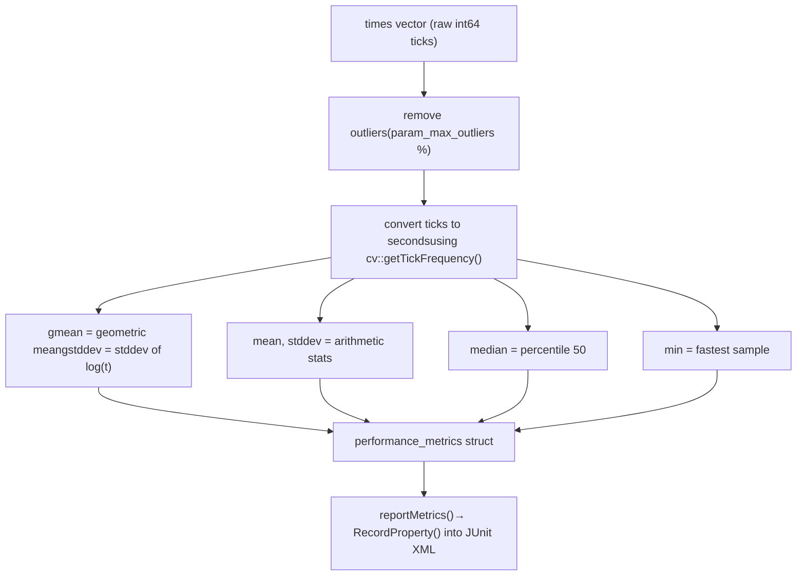
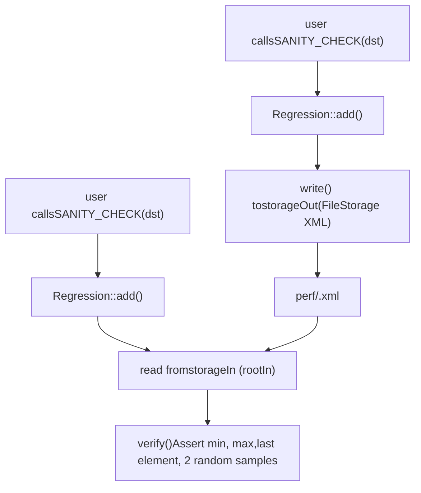

# 使用 perf::TestBase 进行性能测试

相关源文件

-   [modules/core/src/parallel.cpp](https://github.com/opencv/opencv/blob/91c78f50/modules/core/src/parallel.cpp)
-   [modules/ts/CMakeLists.txt](https://github.com/opencv/opencv/blob/91c78f50/modules/ts/CMakeLists.txt)
-   [modules/ts/include/opencv2/ts.hpp](https://github.com/opencv/opencv/blob/91c78f50/modules/ts/include/opencv2/ts.hpp)
-   [modules/ts/include/opencv2/ts/ts\_ext.hpp](https://github.com/opencv/opencv/blob/91c78f50/modules/ts/include/opencv2/ts/ts_ext.hpp)
-   [modules/ts/include/opencv2/ts/ts\_gtest.h](https://github.com/opencv/opencv/blob/91c78f50/modules/ts/include/opencv2/ts/ts_gtest.h)
-   [modules/ts/include/opencv2/ts/ts\_perf.hpp](https://github.com/opencv/opencv/blob/91c78f50/modules/ts/include/opencv2/ts/ts_perf.hpp)
-   [modules/ts/src/precomp.hpp](https://github.com/opencv/opencv/blob/91c78f50/modules/ts/src/precomp.hpp)
-   [modules/ts/src/ts.cpp](https://github.com/opencv/opencv/blob/91c78f50/modules/ts/src/ts.cpp)
-   [modules/ts/src/ts\_arrtest.cpp](https://github.com/opencv/opencv/blob/91c78f50/modules/ts/src/ts_arrtest.cpp)
-   [modules/ts/src/ts\_func.cpp](https://github.com/opencv/opencv/blob/91c78f50/modules/ts/src/ts_func.cpp)
-   [modules/ts/src/ts\_gtest.cpp](https://github.com/opencv/opencv/blob/91c78f50/modules/ts/src/ts_gtest.cpp)
-   [modules/ts/src/ts\_perf.cpp](https://github.com/opencv/opencv/blob/91c78f50/modules/ts/src/ts_perf.cpp)

## 目标与范围

本页文档介绍 `modules/ts` 模块中的性能测试框架，重点是 `perf::TestBase` 类及其周边基础设施，用于编写、运行和比较微基准测试。内容涵盖测试声明宏、计时循环、输入/输出声明、回归基线管理、统计指标与命令行控制。

关于单元测试能力与 OpenCL 测试校验，请参见 [Unit Testing and OpenCL Test Utilities](/opencv/opencv/12.2-unit-testing-and-opencl-test-utilities)。关于测试模块的更广泛总览，请参见 [Testing Framework (ts)](/opencv/opencv/12-testing-framework-(ts))。

---

## 架构概览

性能测试基础设施位于 `perf` 命名空间，声明见 [modules/ts/include/opencv2/ts/ts\_perf.hpp](https://github.com/opencv/opencv/blob/91c78f50/modules/ts/include/opencv2/ts/ts_perf.hpp)，实现见 [modules/ts/src/ts\_perf.cpp](https://github.com/opencv/opencv/blob/91c78f50/modules/ts/src/ts_perf.cpp)

**主要类型之间的关键关系：**

Sources: [modules/ts/include/opencv2/ts/ts\_perf.hpp374-498](https://github.com/opencv/opencv/blob/91c78f50/modules/ts/include/opencv2/ts/ts_perf.hpp#L374-L498) [modules/ts/src/ts\_perf.cpp130-660](https://github.com/opencv/opencv/blob/91c78f50/modules/ts/src/ts_perf.cpp#L130-L660)

---

## 测试声明宏

三个宏覆盖了常见测试模式。它们都会定义一个类，其 `PerfTestBody()` 方法中包含用户代码。

| Macro | Intended Use |
| --- | --- |
| `PERF_TEST(suite, name)` | 简单的一次性性能测试，无 fixture、无参数 |
| `PERF_TEST_F(fixture, name)` | 在用户自定义 fixture（继承 `TestBase`）上的性能测试 |
| `PERF_TEST_P(fixture, name, values)` | 参数化测试；同时内联实例化参数集 |
| `PERF_TEST_P_(fixture, name)` | 参数化测试但不内联实例化；需配合 `INSTANTIATE_TEST_CASE_P` |

`PERF_TEST_P` 是最常见模式。fixture 通常定义为 `TestBaseWithParam<T>` 的 `typedef`，其中 `T` 为某个参数元组。

Sources: [modules/ts/include/opencv2/ts/ts\_perf.hpp553-640](https://github.com/opencv/opencv/blob/91c78f50/modules/ts/include/opencv2/ts/ts_perf.hpp#L553-L640)

---

## 编写参数化性能测试

典型测试结构如下：

```
typedef perf::TestBaseWithParam<cv::Size> MyTest; PERF_TEST_P(MyTest, ResizeLinear,    ::testing::Values(perf::szVGA, perf::sz720p, perf::sz1080p)){    cv::Size sz = GetParam();    cv::Mat src(sz, CV_8UC3);    cv::Mat dst;     declare.in(src).out(dst);     TEST_CYCLE() cv::resize(src, dst, cv::Size(), 0.5, 0.5);     SANITY_CHECK(dst);}
```
关键要素：

-   **`GetParam()`** — 通过 `testing::WithParamInterface` 取得当前参数值。
-   **`declare.in(src).out(dst)`** — 注册数组，使框架可计算数据大小（`bytesIn`、`bytesOut`）并执行预热。
-   **`TEST_CYCLE()`** — 通过每轮调用 `startTimer()`、`next()`、`stopTimer()` 驱动计时循环。
-   **`SANITY_CHECK(dst)`** — 注册输出用于回归比对。

Sources: [modules/ts/include/opencv2/ts/ts\_perf.hpp462-496](https://github.com/opencv/opencv/blob/91c78f50/modules/ts/include/opencv2/ts/ts_perf.hpp#L462-L496) [modules/ts/include/opencv2/ts/ts\_perf.hpp215-219](https://github.com/opencv/opencv/blob/91c78f50/modules/ts/include/opencv2/ts/ts_perf.hpp#L215-L219)

---

## 预定义尺寸常量

`ts_perf.hpp` 声明了一组标准 `cv::Size` 常量，供测试参数使用：

| Constant | Resolution |
| --- | --- |
| `szQVGA` | 320 × 240 |
| `szVGA` | 640 × 480 |
| `szSVGA` | 800 × 600 |
| `szXGA` | 1024 × 768 |
| `sz720p` | 1280 × 720 |
| `sz1080p` | 1920 × 1080 |
| `sz2160p` | 3840 × 2160 (4K) |

`SZ_ALL_HD`、`SZ_TYPICAL` 等便捷宏会展开为 `::testing::Values(...)` 表达式。

Sources: [modules/ts/include/opencv2/ts/ts\_perf.hpp46-83](https://github.com/opencv/opencv/blob/91c78f50/modules/ts/include/opencv2/ts/ts_perf.hpp#L46-L83)

---

## 测试生命周期

**测试执行流程：**

Sources: [modules/ts/src/ts\_perf.cpp942-1200](https://github.com/opencv/opencv/blob/91c78f50/modules/ts/src/ts_perf.cpp#L942-L1200) [modules/ts/include/opencv2/ts/ts\_perf.hpp396-421](https://github.com/opencv/opencv/blob/91c78f50/modules/ts/include/opencv2/ts/ts_perf.hpp#L396-L421)

---

## 计时循环控制

`startTimer()`、`stopTimer()` 与 `next()` 是控制测量循环的三个方法。

-   **`startTimer()`** — 将当前 tick 计数记录到 `lastTime`。返回 `true`，因此可用于循环条件。
-   **`stopTimer()`** — 计算自 `startTimer()` 以来的耗时 tick，并追加到内部 `times` 向量。
-   **`next()`** — 决定是否继续迭代。以下任一条件满足时返回 `false`：
    -   累积墙钟时间超过 `timeLimit`，**且**已收集至少 `minIters` 个样本，或
    -   迭代次数超过 `nIters`。

`TEST_CYCLE()` 宏将它们组合为一个 `for` 循环：

```
for (; startTimer(), next(); stopTimer())
    { /* user operation */ }
```
`runsPerIteration` 的数量（可通过 `declare.runs(n)` 配置）决定每次 `startTimer/stopTimer` 之间操作执行的次数，这对非常快的操作很有用。

Sources: [modules/ts/include/opencv2/ts/ts\_perf.hpp402-404](https://github.com/opencv/opencv/blob/91c78f50/modules/ts/include/opencv2/ts/ts_perf.hpp#L402-L404) [modules/ts/src/ts\_perf.cpp942-1300](https://github.com/opencv/opencv/blob/91c78f50/modules/ts/src/ts_perf.cpp#L942-L1300)

---

## 输入/输出声明

`TestBase::_declareHelper` 通过公共成员 `declare` 访问。它支持链式调用来注册数组并配置测试：

| Method | Effect |
| --- | --- |
| `declare.in(a, wtype)` | 将数组 `a` 注册为输入；应用 `wtype` 指定的预热 |
| `declare.out(a, wtype)` | 将数组 `a` 注册为输出；应用 `wtype` 指定的预热 |
| `declare.time(secs)` | 覆盖该测试的默认时间上限 |
| `declare.iterations(n)` | 限制计时样本数量 |
| `declare.runs(n)` | 设置每个计时槽的重复次数 |
| `declare.tbb_threads(n)` | 覆盖该测试的工作线程数 |
| `declare.strategy(s)` | 设置该测试的收敛策略 |

`WarmUpType` 枚举控制计时开始前如何访问数组：

| Value | Behavior |
| --- | --- |
| `WARMUP_READ` | 读访问数据（输入默认） |
| `WARMUP_WRITE` | 写入零值（输出默认） |
| `WARMUP_RNG` | 填充随机数据 |
| `WARMUP_NONE` | 不预热 |

预热可确保缓存和页表在计时开始前处于具有代表性的状态。

Sources: [modules/ts/include/opencv2/ts/ts\_perf.hpp408-488](https://github.com/opencv/opencv/blob/91c78f50/modules/ts/include/opencv2/ts/ts_perf.hpp#L408-L488) [modules/ts/src/ts\_perf.cpp1300-1450](https://github.com/opencv/opencv/blob/91c78f50/modules/ts/src/ts_perf.cpp#L1300-L1450)

---

## 测量策略

`PERF_STRATEGY` 控制收敛与终止条件：

| Value | Description |
| --- | --- |
| `PERF_STRATEGY_DEFAULT (-1)` | 使用模块级默认值 |
| `PERF_STRATEGY_BASE (0)` | 更严格——要求稳定性达到 `perf_max_deviation` |
| `PERF_STRATEGY_SIMPLE (1)` | 更宽松——无视方差，到时限即停止 |

模块默认在启动时设为 `PERF_STRATEGY_SIMPLE`。每个模块可通过 `TestBase::setModulePerformanceStrategy()` 覆盖，每个测试可通过 `declare.strategy()` 覆盖。

稳定性判据为 3%（`perf_stability_criteria = 0.03`），即用于判断已收集样本的几何标准差是否收敛。

Sources: [modules/ts/include/opencv2/ts/ts\_perf.hpp265-270](https://github.com/opencv/opencv/blob/91c78f50/modules/ts/include/opencv2/ts/ts_perf.hpp#L265-L270) [modules/ts/src/ts\_perf.cpp35-36](https://github.com/opencv/opencv/blob/91c78f50/modules/ts/src/ts_perf.cpp#L35-L36) [modules/ts/src/ts\_perf.cpp80](https://github.com/opencv/opencv/blob/91c78f50/modules/ts/src/ts_perf.cpp#L80-L80)

---

## 性能指标

计时循环结束后，`calcMetrics()` 会基于采集到的 `times` 向量计算 `performance_metrics` 结构体。首先会根据 `param_max_outliers` 阈值移除离群值。


`terminationReason` 字段记录循环停止原因：

| Value | Meaning |
| --- | --- |
| `TERM_ITERATIONS (0)` | 达到迭代上限 |
| `TERM_TIME (1)` | 达到时间上限 |
| `TERM_INTERRUPT (2)` | 用户中断 |
| `TERM_EXCEPTION (3)` | 抛出异常 |
| `TERM_SKIP_TEST (4)` | 测试被跳过 |
| `TERM_UNKNOWN (-1)` | 未初始化 |

Sources: [modules/ts/include/opencv2/ts/ts\_perf.hpp232-259](https://github.com/opencv/opencv/blob/91c78f50/modules/ts/include/opencv2/ts/ts_perf.hpp#L232-L259) [modules/ts/src/ts\_perf.cpp638-660](https://github.com/opencv/opencv/blob/91c78f50/modules/ts/src/ts_perf.cpp#L638-L660)

---

## 回归基线管理

`Regression` 类负责 sanity check：记录参考运行的输出值，并在后续运行中校验。`SANITY_CHECK`、`SANITY_CHECK_KEYPOINTS`、`SANITY_CHECK_MATCHES`、`SANITY_CHECK_MOMENTS` 宏都委托给 `Regression::add()`。

**Regression 数据流：**


对每个 `cv::Mat`，该类会记录并校验：

-   通过 `cv::minMaxIdx` 取得的 `min` 与 `max`
-   `[rows-1, cols-1, channels-1]` 处元素（最后一个元素）
-   两个随机位置元素（`rng1`、`rng2`）

默认存储文件位于 `$OPENCV_TEST_DATA_PATH/perf/<suiteName>.xml`。误差类型为 `ERROR_ABSOLUTE`（固定 epsilon）或 `ERROR_RELATIVE`（按参考值幅度缩放 epsilon）。

Sources: [modules/ts/include/opencv2/ts/ts\_perf.hpp174-219](https://github.com/opencv/opencv/blob/91c78f50/modules/ts/include/opencv2/ts/ts_perf.hpp#L174-L219) [modules/ts/src/ts\_perf.cpp130-635](https://github.com/opencv/opencv/blob/91c78f50/modules/ts/src/ts_perf.cpp#L130-L635)

---

## 性能校验

有一套独立机制用于将当前运行耗时与历史运行结果比较，这与输出正确性的回归检查不同。

-   `--perf_read_validation_results <file>` — 从纯文本文件加载先前耗时（每行一个 `value;name` 对）。
-   `--perf_write_validation_results <file>` — 运行后将当前 median 耗时写入该文件。

比较容差为 3%（`perf_validation_criteria = 0.03`）。快于 `perf_validation_time_threshold_ms = 0.1` ms 的测试不参与校验。测试之间可插入 3 秒空闲延迟（`perf_validation_idle_delay_ms = 3000`）。

`PerfValidationEnvironment` 类（通过 `testing::AddGlobalTestEnvironment` 注册到 Google Test）会在 `TearDown()` 中调用 `savePerfValidationResults()`。

Sources: [modules/ts/src/ts\_perf.cpp666-735](https://github.com/opencv/opencv/blob/91c78f50/modules/ts/src/ts_perf.cpp#L666-L735)

---

## 初始化与命令行参数

`TestBase::Init()` 必须在 `main()` 中、测试运行前调用。它通过 `cv::CommandLineParser` 解析命令行参数，并注册 `PerfEnvironment` 全局环境。

| Flag | Default | Description |
| --- | --- | --- |
| `--perf_time_limit` | 3.0 s（Android 6.0 s） | 每个测试的墙钟时间 |
| `--perf_min_samples` | 10 | 最小计时样本数 |
| `--perf_force_samples` | 100 | 样本硬上限 |
| `--perf_max_outliers` | 8 | 作为离群值丢弃的样本百分比 |
| `--perf_max_deviation` | 1.0 | 允许的标准差比例 |
| `--perf_seed` | 809564 | 数据生成 RNG 种子 |
| `--perf_threads` | \-1 | 工作线程数（-1 = 系统默认） |
| `--perf_impl` | `plain` | 待测实现变体 |
| `--perf_strategy` | `default` | `default`、`base` 或 `simple` |
| `--perf_write_sanity` | false | 记录基线回归数据 |
| `--perf_verify_sanity` | false | 若缺失基线数据则失败 |
| `--perf_cuda_device` | 0 | CUDA 设备索引（在启用 CUDA 构建时） |

Sources: [modules/ts/src/ts\_perf.cpp947-1070](https://github.com/opencv/opencv/blob/91c78f50/modules/ts/src/ts_perf.cpp#L947-L1070)

---

## 辅助类型与宏

### CV\_ENUM 与 CV\_FLAGS

这些宏会生成既可转换为 `int`、又可被 Google Test 打印的包装结构体。它们用于为 `PERF_TEST_P` 定义可打印参数类型：

```
CV_ENUM(InterpolationType, INTER_NEAREST, INTER_LINEAR, INTER_CUBIC)
```
生成的结构体实现了 `PrintTo(std::ostream*)` 与静态 `all()` 生成器，可用于 `::testing::ValuesIn(...)`。

`CV_FLAGS` 采用同样模式，但用于处理位字段组合。

Sources: [modules/ts/include/opencv2/ts/ts\_perf.hpp104-163](https://github.com/opencv/opencv/blob/91c78f50/modules/ts/include/opencv2/ts/ts_perf.hpp#L104-L163)

### MatType 与 MatDepth

`MatType` 是针对 `cv::Mat` 类型码的可打印 `int` 包装。`MatDepth` 是包含全部 depth 常量（`CV_8U`、`CV_8S`、...、`CV_16F`）的 `CV_ENUM`。

`typedef` `Size_MatType_t = tuple<cv::Size, MatType>` 与 `Size_MatType = TestBaseWithParam<Size_MatType_t>` 提供了最常见双参数组合的现成基类。

Sources: [modules/ts/include/opencv2/ts/ts\_perf.hpp91-99](https://github.com/opencv/opencv/blob/91c78f50/modules/ts/include/opencv2/ts/ts_perf.hpp#L91-L99) [modules/ts/include/opencv2/ts/ts\_perf.hpp500-501](https://github.com/opencv/opencv/blob/91c78f50/modules/ts/include/opencv2/ts/ts_perf.hpp#L500-L501)

---

## 插桩与实现路径跟踪

两个可选的编译期特性可扩展 `TestBase`：

**`CV_COLLECT_IMPL_DATA`** — 启用 `ImplData` 结构体（成员 `implConf`），用于收集每轮迭代走的是哪条实现路径（plain C、IPP、OpenCL）。通过 `--perf_collect_impl` 控制。

**`ENABLE_INSTRUMENTATION`** — 启用通过 `InstumentData`（成员 `instrConf`）进行调用树追踪。`InstumentData::printTree()` 静态方法可输出带时间权重的分层函数调用轨迹，并包含 IPP 与 OpenCL 百分比拆分。通过 `--perf_instrument` 控制。

Sources: [modules/ts/include/opencv2/ts/ts\_perf.hpp276-372](https://github.com/opencv/opencv/blob/91c78f50/modules/ts/include/opencv2/ts/ts_perf.hpp#L276-L372) [modules/ts/src/ts\_perf.cpp737-940](https://github.com/opencv/opencv/blob/91c78f50/modules/ts/src/ts_perf.cpp#L737-L940)

---

## 构建集成

`ts` 模块以静态库（`OPENCV_MODULE_TYPE STATIC`）构建，且不属于 `opencv_world`。它依赖 `opencv_core`、`opencv_imgproc`、`opencv_imgcodecs`、`opencv_videoio` 与 `opencv_highgui`。仅当启用 `BUILD_TESTS` 或 `BUILD_PERF_TESTS` 时才会编译。

生成头文件 `opencv_tests_config.hpp` 会放在 CMake 二进制目录中，用于向测试可执行文件提供 `OPENCV_INSTALL_PREFIX` 与 `OPENCV_TEST_DATA_INSTALL_PATH`。

Sources: [modules/ts/CMakeLists.txt1-58](https://github.com/opencv/opencv/blob/91c78f50/modules/ts/CMakeLists.txt#L1-L58)
