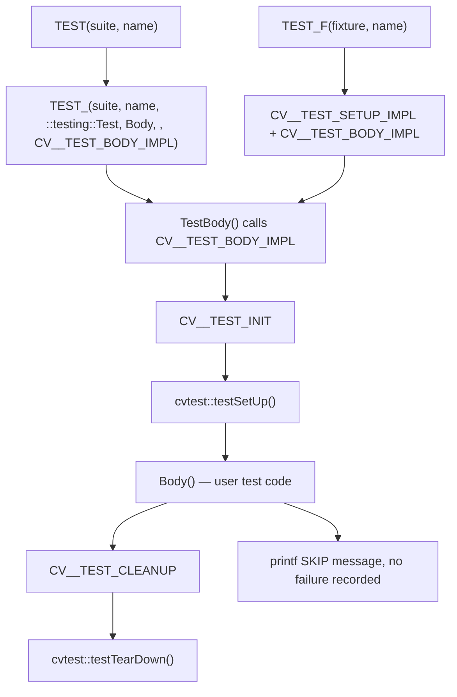
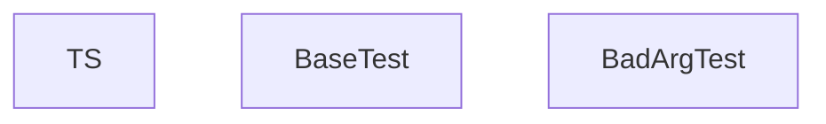
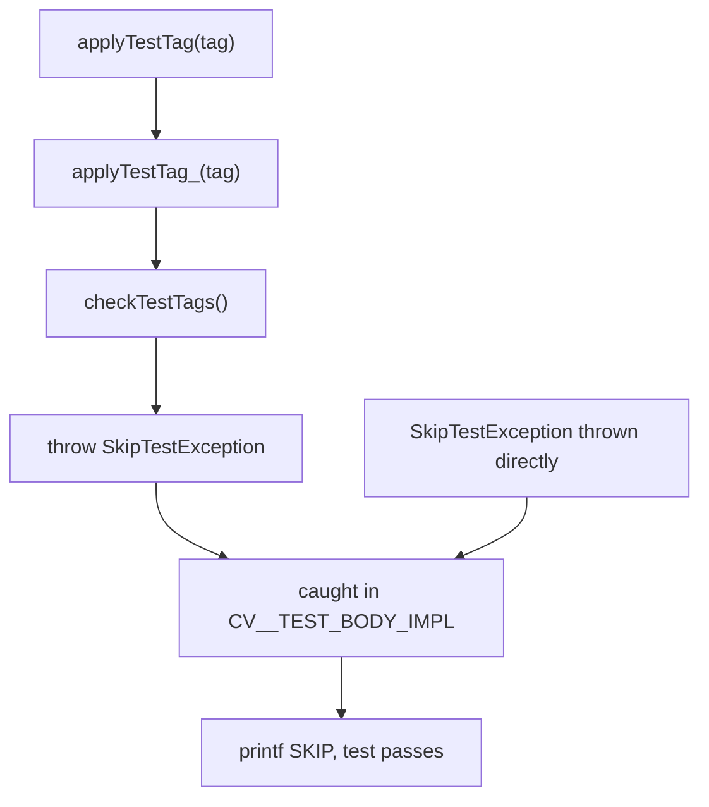
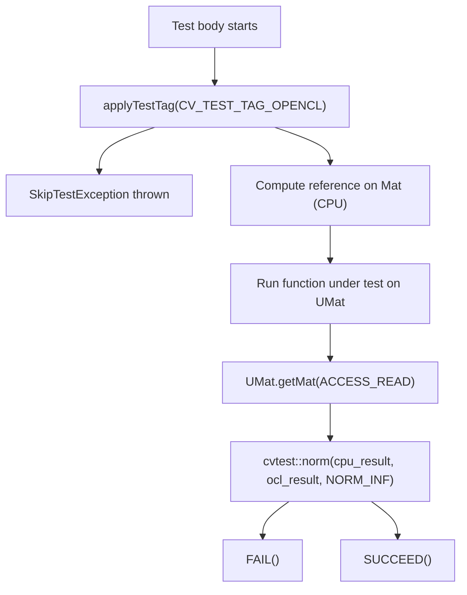
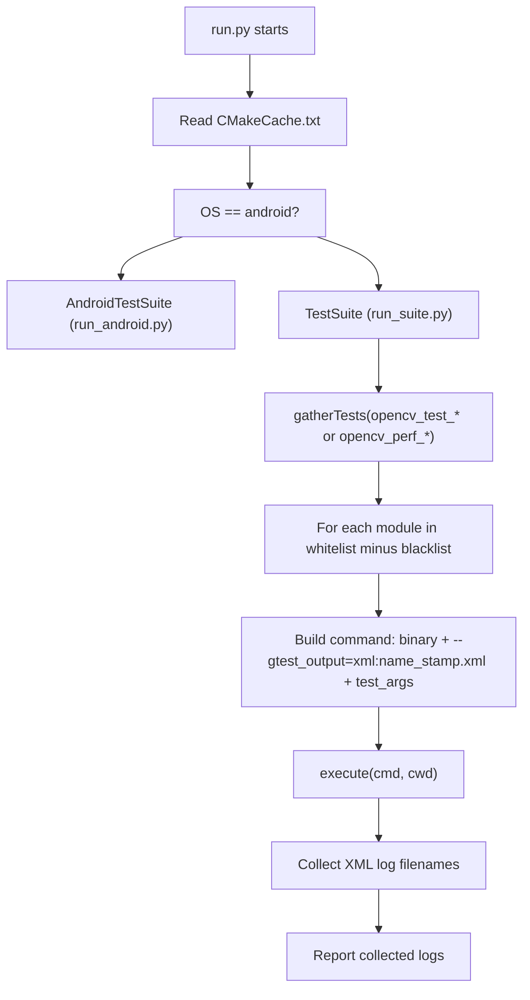
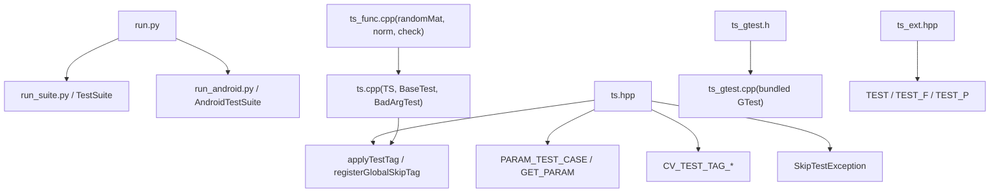

# 单元测试与 OpenCL 测试工具

相关源文件

-   [modules/calib3d/perf/perf\_precomp.hpp](https://github.com/opencv/opencv/blob/91c78f50/modules/calib3d/perf/perf_precomp.hpp)
-   [modules/core/perf/perf\_precomp.hpp](https://github.com/opencv/opencv/blob/91c78f50/modules/core/perf/perf_precomp.hpp)
-   [modules/core/src/parallel.cpp](https://github.com/opencv/opencv/blob/91c78f50/modules/core/src/parallel.cpp)
-   [modules/features2d/perf/perf\_precomp.hpp](https://github.com/opencv/opencv/blob/91c78f50/modules/features2d/perf/perf_precomp.hpp)
-   [modules/imgproc/perf/perf\_canny.cpp](https://github.com/opencv/opencv/blob/91c78f50/modules/imgproc/perf/perf_canny.cpp)
-   [modules/imgproc/perf/perf\_precomp.hpp](https://github.com/opencv/opencv/blob/91c78f50/modules/imgproc/perf/perf_precomp.hpp)
-   [modules/java/generator/src/cpp/opencv\_java.hpp](https://github.com/opencv/opencv/blob/91c78f50/modules/java/generator/src/cpp/opencv_java.hpp)
-   [modules/java/generator/src/java/org/opencv/osgi/OpenCVNativeLoader.java.in](https://github.com/opencv/opencv/blob/91c78f50/modules/java/generator/src/java/org/opencv/osgi/OpenCVNativeLoader.java.in)
-   [modules/java/test/pure\_test/CMakeLists.txt](https://github.com/opencv/opencv/blob/91c78f50/modules/java/test/pure_test/CMakeLists.txt)
-   [modules/java/test/pure\_test/build.xml](https://github.com/opencv/opencv/blob/91c78f50/modules/java/test/pure_test/build.xml)
-   [modules/photo/perf/perf\_precomp.hpp](https://github.com/opencv/opencv/blob/91c78f50/modules/photo/perf/perf_precomp.hpp)
-   [modules/ts/CMakeLists.txt](https://github.com/opencv/opencv/blob/91c78f50/modules/ts/CMakeLists.txt)
-   [modules/ts/include/opencv2/ts.hpp](https://github.com/opencv/opencv/blob/91c78f50/modules/ts/include/opencv2/ts.hpp)
-   [modules/ts/include/opencv2/ts/ts\_ext.hpp](https://github.com/opencv/opencv/blob/91c78f50/modules/ts/include/opencv2/ts/ts_ext.hpp)
-   [modules/ts/include/opencv2/ts/ts\_gtest.h](https://github.com/opencv/opencv/blob/91c78f50/modules/ts/include/opencv2/ts/ts_gtest.h)
-   [modules/ts/include/opencv2/ts/ts\_perf.hpp](https://github.com/opencv/opencv/blob/91c78f50/modules/ts/include/opencv2/ts/ts_perf.hpp)
-   [modules/ts/misc/chart.py](https://github.com/opencv/opencv/blob/91c78f50/modules/ts/misc/chart.py)
-   [modules/ts/misc/color.py](https://github.com/opencv/opencv/blob/91c78f50/modules/ts/misc/color.py)
-   [modules/ts/misc/concatlogs.py](https://github.com/opencv/opencv/blob/91c78f50/modules/ts/misc/concatlogs.py)
-   [modules/ts/misc/perf\_tests\_timing.py](https://github.com/opencv/opencv/blob/91c78f50/modules/ts/misc/perf_tests_timing.py)
-   [modules/ts/misc/report.py](https://github.com/opencv/opencv/blob/91c78f50/modules/ts/misc/report.py)
-   [modules/ts/misc/run.py](https://github.com/opencv/opencv/blob/91c78f50/modules/ts/misc/run.py)
-   [modules/ts/misc/run\_android.py](https://github.com/opencv/opencv/blob/91c78f50/modules/ts/misc/run_android.py)
-   [modules/ts/misc/run\_long.py](https://github.com/opencv/opencv/blob/91c78f50/modules/ts/misc/run_long.py)
-   [modules/ts/misc/run\_suite.py](https://github.com/opencv/opencv/blob/91c78f50/modules/ts/misc/run_suite.py)
-   [modules/ts/misc/run\_utils.py](https://github.com/opencv/opencv/blob/91c78f50/modules/ts/misc/run_utils.py)
-   [modules/ts/misc/summary.py](https://github.com/opencv/opencv/blob/91c78f50/modules/ts/misc/summary.py)
-   [modules/ts/misc/table\_formatter.py](https://github.com/opencv/opencv/blob/91c78f50/modules/ts/misc/table_formatter.py)
-   [modules/ts/misc/testlog\_parser.py](https://github.com/opencv/opencv/blob/91c78f50/modules/ts/misc/testlog_parser.py)
-   [modules/ts/misc/trace\_profiler.py](https://github.com/opencv/opencv/blob/91c78f50/modules/ts/misc/trace_profiler.py)
-   [modules/ts/misc/xls-report.py](https://github.com/opencv/opencv/blob/91c78f50/modules/ts/misc/xls-report.py)
-   [modules/ts/src/precomp.hpp](https://github.com/opencv/opencv/blob/91c78f50/modules/ts/src/precomp.hpp)
-   [modules/ts/src/ts.cpp](https://github.com/opencv/opencv/blob/91c78f50/modules/ts/src/ts.cpp)
-   [modules/ts/src/ts\_arrtest.cpp](https://github.com/opencv/opencv/blob/91c78f50/modules/ts/src/ts_arrtest.cpp)
-   [modules/ts/src/ts\_func.cpp](https://github.com/opencv/opencv/blob/91c78f50/modules/ts/src/ts_func.cpp)
-   [modules/ts/src/ts\_gtest.cpp](https://github.com/opencv/opencv/blob/91c78f50/modules/ts/src/ts_gtest.cpp)
-   [modules/ts/src/ts\_perf.cpp](https://github.com/opencv/opencv/blob/91c78f50/modules/ts/src/ts_perf.cpp)

## 目标与范围

本页文档介绍 OpenCV `ts` 模块（`modules/ts/`）中的单元测试基础设施，涵盖 Google Test 集成层、自定义测试 fixture 宏、数组比较工具、OpenCL 专用测试模式，以及 `run.py` 测试运行脚本。

有关带计时循环与回归基线的性能测试，请参见 [Performance Testing with perf::TestBase](/opencv/opencv/12.1-performance-testing-with-perf::testbase)。有关测试所验证的 OpenCL 设备管理与透明执行模型，请参见 [OpenCL Acceleration and Transparent GPU Execution](/opencv/opencv/3.2-opencl-acceleration-and-transparent-gpu-execution)。

---

## 模块结构

`ts` 模块编译为静态库，且**不**包含在 `opencv_world` 中。它通过 `OPENCV_MODULE_TYPE STATIC` 声明自身，并依赖 `opencv_core`、`opencv_imgproc`、`opencv_imgcodecs`、`opencv_videoio` 与 `opencv_highgui`。

[modules/ts/CMakeLists.txt1-57](https://github.com/opencv/opencv/blob/91c78f50/modules/ts/CMakeLists.txt#L1-L57)

**模块布局：**

| File | Role |
| --- | --- |
| `modules/ts/include/opencv2/ts.hpp` | 主头文件：包含 gtest，声明 `TS`、`BaseTest`、工具函数、测试标签 |
| `modules/ts/include/opencv2/ts/ts_ext.hpp` | 对 `TEST`、`TEST_F`、`TEST_P` 的宏重写；支持构造期跳过 |
| `modules/ts/include/opencv2/ts/ts_gtest.h` | 内置 Google Test 头文件（单头形式） |
| `modules/ts/src/ts_gtest.cpp` | 内置 Google Test 实现 |
| `modules/ts/src/ts.cpp` | `TS`、`BaseTest`、`BadArgTest`；OpenCL 信息记录；信号处理器 |
| `modules/ts/src/ts_func.cpp` | `randomMat`、`norm`、`check`、矩阵数学参考实现 |
| `modules/ts/src/ts_arrtest.cpp` | `ArrayTest` 旧式基类 |
| `modules/ts/src/ts_perf.cpp` | `perf::TestBase`、`Regression`（性能层） |
| `modules/ts/misc/run.py` | 跨平台测试运行与收集器 |

Sources: [modules/ts/CMakeLists.txt1-57](https://github.com/opencv/opencv/blob/91c78f50/modules/ts/CMakeLists.txt#L1-L57) [modules/ts/include/opencv2/ts.hpp1-50](https://github.com/opencv/opencv/blob/91c78f50/modules/ts/include/opencv2/ts.hpp#L1-L50) [modules/ts/src/ts.cpp1-130](https://github.com/opencv/opencv/blob/91c78f50/modules/ts/src/ts.cpp#L1-L130)

---

## Google Test 集成

OpenCV 内置固定版本的 Google Test，而不是将其作为外部依赖。内置副本以如下形式暴露：

-   `modules/ts/include/opencv2/ts/ts_gtest.h` — 公共 API
-   `modules/ts/src/ts_gtest.cpp` — 将所有实现翻译单元拼接在一起

[modules/ts/include/opencv2/ts.hpp101-134](https://github.com/opencv/opencv/blob/91c78f50/modules/ts/include/opencv2/ts.hpp#L101-L134) 在包含 `ts_gtest.h` 前配置了 GTest 预处理器标志，特别包括：

-   禁用 GTest 宏别名（`GTEST_DONT_DEFINE_FAIL 0` 等），因为 OpenCV 会重定义它们
-   设置 C++11 tuple 检测（`GTEST_LANG_CXX11`、`GTEST_HAS_TR1_TUPLE`、`GTEST_HAS_COMBINE`）

**测试宏链路图：**


Sources: [modules/ts/include/opencv2/ts/ts\_ext.hpp32-110](https://github.com/opencv/opencv/blob/91c78f50/modules/ts/include/opencv2/ts/ts_ext.hpp#L32-L110)

---

## 自定义测试宏（`ts_ext.hpp`）

`ts_ext.hpp` 用增强版替换了标准 GTest 的 `TEST`、`TEST_F`、`TEST_P` 宏，新增能力包括：

1.  **构造期跳过**：若 `SetUp()` 抛出 `SkipTestExceptionBase`，则设置 `setUpSkipped = true`，`TestBody()` 会立即返回，不调用 `Body()`。
2.  **命名空间约束**：`CV__TEST_NAMESPACE_CHECK` 在 OpenCV 内部构建中强制测试代码位于 `opencv_test` 命名空间。
3.  **生命周期钩子**：每个测试体前后会调用 `cvtest::testSetUp()` 与 `cvtest::testTearDown()`。

**关键宏：**

| Macro | Defined in | Purpose |
| --- | --- | --- |
| `TEST(suite, name)` | `ts_ext.hpp:110` | 替换 gtest `TEST`；增加跳过与生命周期支持 |
| `TEST_F(fixture, name)` | `ts_ext.hpp:138` | 替换 gtest `TEST_F` |
| `TEST_(...)` | `ts_ext.hpp:73` | `TEST` 与性能宏使用的内部通用形式 |
| `PARAM_TEST_CASE(name, ...)` | `ts.hpp:144` | `struct name : testing::TestWithParam<tuple<...>>` 简写 |
| `GET_PARAM(k)` | `ts.hpp:145` | `testing::get<k>(GetParam())` |
| `BIGDATA_TEST(suite, name)` | `ts_ext.hpp:131` | 在 32 位构建上自动跳过 |

Sources: [modules/ts/include/opencv2/ts/ts\_ext.hpp32-135](https://github.com/opencv/opencv/blob/91c78f50/modules/ts/include/opencv2/ts/ts_ext.hpp#L32-L135) [modules/ts/include/opencv2/ts.hpp144-145](https://github.com/opencv/opencv/blob/91c78f50/modules/ts/include/opencv2/ts.hpp#L144-L145)

---

## `TS` 与 `BaseTest` 类

`TS` 类是一个单例，负责管理测试系统状态：错误码、输出缓冲、RNG 种子与回调注册。

**类职责图：**


`BaseTest::safe_run()` 会安装信号处理器（POSIX 的 SIGSEGV、SIGFPE 等；MSVC 下的 SEH translator），并用异常处理包装 `run()`，把异常转换为 `TS::FailureCode` 值。

[modules/ts/src/ts.cpp287-338](https://github.com/opencv/opencv/blob/91c78f50/modules/ts/src/ts.cpp#L287-L338)

---

## 测试跳过机制

可通过抛出 `cvtest::SkipTestException` 或调用 `cvtest::applyTestTag` 以优雅方式跳过测试。


`registerGlobalSkipTag(tag)` 会在启动时把标签加入全局跳过列表，例如当无可用设备时全局禁用 OpenCL 测试。

**预定义测试标签**（来自 `ts.hpp`）：

| Tag constant | String | Meaning |
| --- | --- | --- |
| `CV_TEST_TAG_MEMORY_512MB` | `"mem_512mb"` | 需要 200–512 MB 内存 |
| `CV_TEST_TAG_MEMORY_2GB` | `"mem_2gb"` | 需要 1–2 GB；默认在 32 位禁用 |
| `CV_TEST_TAG_LONG` | `"long"` | 桌面环境 5 秒以上 |
| `CV_TEST_TAG_DEBUG_VERYLONG` | `"debug_verylong"` | Debug 模式 40 秒以上 |
| `CV_TEST_TAG_SIZE_HD` | `"size_hd"` | 720p 或更大图像 |
| `CV_TEST_TAG_SIZE_FULLHD` | `"size_fullhd"` | 1080p 或更大 |
| `CV_TEST_TAG_OPENCL` | `"opencl"` | 需要 OpenCL 设备 |
| `CV_TEST_TAG_TYPE_64F` | `"type_64f"` | 使用 `CV_64F` 深度 |

[modules/ts/include/opencv2/ts.hpp59-90](https://github.com/opencv/opencv/blob/91c78f50/modules/ts/include/opencv2/ts.hpp#L59-L90) [modules/ts/include/opencv2/ts.hpp190-258](https://github.com/opencv/opencv/blob/91c78f50/modules/ts/include/opencv2/ts.hpp#L190-L258)

---

## 数组比较工具（`ts_func.cpp`）

`modules/ts/src/ts_func.cpp` 及 `modules/ts/include/opencv2/ts.hpp` 中的声明，提供了用于测试校验的参考级数组操作。

**数据生成：**

| Function | Signature | Purpose |
| --- | --- | --- |
| `randomSize` | `(RNG&, double maxSizeLog) → Size` | 随机 2D 尺寸 |
| `randomSize` | `(RNG&, int minDims, int maxDims, double maxSizeLog, vector<int>&)` | 随机 N 维尺寸 |
| `randomType` | `(RNG&, DepthMask, int minCh, int maxCh) → int` | 随机 `CV_XUY` 类型 |
| `randomMat` | `(RNG&, Size, int type, double, double, bool useRoi) → Mat` | 填充随机矩阵，可选 ROI 子窗口 |

[modules/ts/src/ts\_func.cpp41-150](https://github.com/opencv/opencv/blob/91c78f50/modules/ts/src/ts_func.cpp#L41-L150)

**参考操作**（标量精度、逐通道）：

| Function | Notes |
| --- | --- |
| `cvtest::add(a, alpha, b, beta, gamma, c, ctype, calcAbs)` | `c = alpha*a + beta*b + gamma` |
| `cvtest::convert(src, dst, dtype, alpha, beta)` | 经由 `double` 中间层进行类型转换 |
| `cvtest::copy(src, dst, mask, invertMask)` | 掩码拷贝 |
| `cvtest::norm(src, normType, mask)` | `NORM_L1`、`NORM_L2`、`NORM_INF` |
| `cvtest::norm(src1, src2, normType, mask)` | 差异范数 |
| `cvtest::check(data, min_val, max_val, idx)` | 范围检查；返回违规数量 |
| `cvtest::transpose(src, dst)` | 参考 2D 转置 |
| `cvtest::filter2D(src, dst, ddepth, kernel, anchor, delta, borderType, borderValue)` | 参考 2D 卷积 |

Sources: [modules/ts/include/opencv2/ts.hpp295-360](https://github.com/opencv/opencv/blob/91c78f50/modules/ts/include/opencv2/ts.hpp#L295-L360) [modules/ts/src/ts\_func.cpp152-600](https://github.com/opencv/opencv/blob/91c78f50/modules/ts/src/ts_func.cpp#L152-L600)

---

## OpenCL 测试工具

### 设备信息记录

当构建启用 `HAVE_OPENCL` 时，`modules/ts/src/ts.cpp` 会通过 `::testing::Test::RecordProperty` 将 OpenCL 平台与设备属性写入 GTest XML 输出。该过程使用宏 `DUMP_CONFIG_PROPERTY` 与 `DUMP_MESSAGE_STDOUT`，底层依赖 `opencv2/core/opencl/opencl_info.hpp`。

[modules/ts/src/ts.cpp82-102](https://github.com/opencv/opencv/blob/91c78f50/modules/ts/src/ts.cpp#L82-L102)

OpenCL 分配器内存统计也会通过 `cv::ocl::getOpenCLAllocatorStatistics()` 采样，以检测测试间泄漏。

[modules/ts/src/ts.cpp98-102](https://github.com/opencv/opencv/blob/91c78f50/modules/ts/src/ts.cpp#L98-L102)

### 标准 OpenCL 测试模式

OpenCV 中的 OpenCL 测试惯用模式为：

1.  应用 `CV_TEST_TAG_OPENCL` 标签，使无 OpenCL 时可全局跳过测试。
2.  用 `Mat` 输入先计算 CPU 参考结果。
3.  用 `UMat` 输入运行被测函数（通过 `UMat` 自动选择 OpenCL 路径；见 [UMat and Transparent GPU Execution](/opencv/opencv/3.2-opencl-acceleration-and-transparent-gpu-execution)）。
4.  使用 `cvtest::norm` 或 `EXPECT_MAT_NEAR` 风格断言比较 CPU 与 OpenCL 输出。


### OCL Fixture 中的 `PARAM_TEST_CASE` / `CV_ENUM`

许多 OCL 测试文件使用 `PARAM_TEST_CASE` 宏结合 `testing::Combine`，对图像尺寸与类型做参数扫描：

```
PARAM_TEST_CASE(Blur, MatType, Size) { ... };TEST_P(Blur, Accuracy) {    applyTestTag(CV_TEST_TAG_OPENCL);    // test body}INSTANTIATE_TEST_CASE_P(OCL_ImgProc, Blur,    testing::Combine(        testing::Values(CV_8UC1, CV_8UC4),        testing::Values(Size(640, 480), Size(1920, 1080))    ));
```
`PARAM_TEST_CASE` 会展开为 `struct Name : testing::TestWithParam<tuple<...>>`。`GET_PARAM(k)` 用于提取第 k 个元素。

Sources: [modules/ts/include/opencv2/ts.hpp144-145](https://github.com/opencv/opencv/blob/91c78f50/modules/ts/include/opencv2/ts.hpp#L144-L145) [modules/ts/include/opencv2/ts.hpp87-90](https://github.com/opencv/opencv/blob/91c78f50/modules/ts/include/opencv2/ts.hpp#L87-L90) [modules/ts/src/ts.cpp82-102](https://github.com/opencv/opencv/blob/91c78f50/modules/ts/src/ts.cpp#L82-L102)

---

## `TS` 测试基础设施：信号处理与错误回调

`TS::init()` 会安装：

-   OpenCV 错误回调（`tsErrorCallback`），将 `cv::Error` 详情写入日志缓冲，而非打印到 stderr。
-   在 POSIX 上：`SIGSEGV`、`SIGBUS`、`SIGFPE`、`SIGILL`、`SIGABRT` 的信号处理器，通过 `longjmp` 回到 `safe_run`，并生成 `FAIL_MEMORY_EXCEPTION` 或 `FAIL_ARITHM_EXCEPTION` 失败码。
-   在 MSVC Windows 上：结构化异常处理器（`_set_se_translator`），抛出 `TS::FailureCode`。

[modules/ts/src/ts.cpp163-226](https://github.com/opencv/opencv/blob/91c78f50/modules/ts/src/ts.cpp#L163-L226) [modules/ts/src/ts.cpp553-590](https://github.com/opencv/opencv/blob/91c78f50/modules/ts/src/ts.cpp#L553-L590)

---

## `run.py` 测试运行器

`modules/ts/misc/run.py` 是一个 Python 脚本，用于发现并运行构建产出的测试可执行文件，同时收集 GTest XML 输出。

### 调用模式

```
run.py [build_path] [options] [--gtest_* or --perf_* args]
```
| Flag | Effect |
| --- | --- |
| `-a` / `--accuracy` | 运行 `opencv_test_<module>` 二进制（精度/单元测试） |
| *(default)* | 运行 `opencv_perf_<module>` 二进制（性能测试） |
| `-t core,imgproc` | 仅运行列出的模块 |
| `-b java` | 排除列出的模块 |
| `--check` | `--perf_min_samples=1 --perf_force_samples=1 --perf_verify_sanity` 的简写 |
| `--valgrind` | 用 Valgrind 包装可执行文件 |
| `--android` | 通过 ADB 推送并在连接的 Android 设备上运行 |
| `--dry_run` | 仅打印命令，不执行 |
| `--trace` | 启用 OpenCV tracing |

[modules/ts/misc/run.py1-180](https://github.com/opencv/opencv/blob/91c78f50/modules/ts/misc/run.py#L1-L180)

### 测试发现与执行流程


[modules/ts/misc/run.py139-180](https://github.com/opencv/opencv/blob/91c78f50/modules/ts/misc/run.py#L139-L180) [modules/ts/misc/run\_suite.py12-180](https://github.com/opencv/opencv/blob/91c78f50/modules/ts/misc/run_suite.py#L12-L180)

`run_suite.py` 会为每个二进制构建别名（例如 `opencv_test_core` → `core`、`opencv_test_core` 等别名），并将所有 `--gtest_*` 与 `--perf_*` 参数透明传递给测试进程。

[modules/ts/misc/run\_suite.py35-61](https://github.com/opencv/opencv/blob/91c78f50/modules/ts/misc/run_suite.py#L35-L61)

### 支撑脚本

| Script | Purpose |
| --- | --- |
| `run_utils.py` | `CMakeCache` 读取器、`execute()`、平台辅助函数 |
| `run_android.py` | ADB push/pull、`am instrument` 调用 |
| `run_long.py` | Valgrind 运行用 `LONG_TESTS_DEBUG_VALGRIND` 过滤列表 |
| `testlog_parser.py` | 将 GTest XML 解析为 `TestInfo` 对象 |
| `summary.py` | 跨多份 XML 运行结果比较性能指标 |
| `report.py` | 可配置的性能报表表格 |

Sources: [modules/ts/misc/run\_utils.py1-60](https://github.com/opencv/opencv/blob/91c78f50/modules/ts/misc/run_utils.py#L1-L60) [modules/ts/misc/run\_long.py1-45](https://github.com/opencv/opencv/blob/91c78f50/modules/ts/misc/run_long.py#L1-L45) [modules/ts/misc/testlog\_parser.py1-65](https://github.com/opencv/opencv/blob/91c78f50/modules/ts/misc/testlog_parser.py#L1-L65)

---

## 关键代码实体映射


Sources: [modules/ts/include/opencv2/ts.hpp1-180](https://github.com/opencv/opencv/blob/91c78f50/modules/ts/include/opencv2/ts.hpp#L1-L180) [modules/ts/include/opencv2/ts/ts\_ext.hpp1-135](https://github.com/opencv/opencv/blob/91c78f50/modules/ts/include/opencv2/ts/ts_ext.hpp#L1-L135) [modules/ts/src/ts.cpp123-640](https://github.com/opencv/opencv/blob/91c78f50/modules/ts/src/ts.cpp#L123-L640) [modules/ts/misc/run.py1-180](https://github.com/opencv/opencv/blob/91c78f50/modules/ts/misc/run.py#L1-L180)
