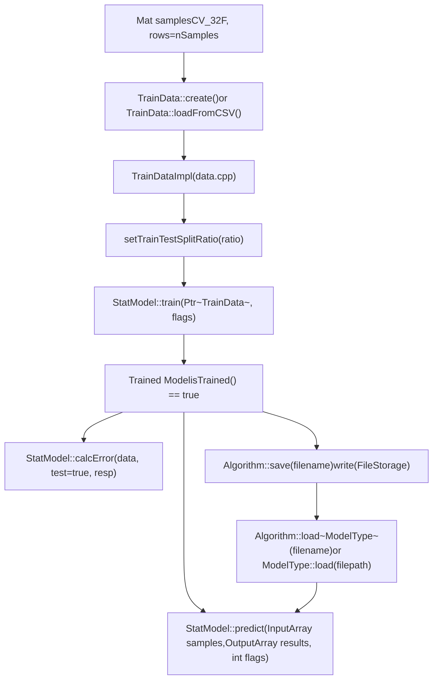

# 机器学习（ml）

相关源文件

-   [modules/ml/include/opencv2/ml.hpp](https://github.com/opencv/opencv/blob/91c78f50/modules/ml/include/opencv2/ml.hpp)
-   [modules/ml/include/opencv2/ml/ml.hpp](https://github.com/opencv/opencv/blob/91c78f50/modules/ml/include/opencv2/ml/ml.hpp)
-   [modules/ml/include/opencv2/ml/ml.inl.hpp](https://github.com/opencv/opencv/blob/91c78f50/modules/ml/include/opencv2/ml/ml.inl.hpp)
-   [modules/ml/src/ann\_mlp.cpp](https://github.com/opencv/opencv/blob/91c78f50/modules/ml/src/ann_mlp.cpp)
-   [modules/ml/src/boost.cpp](https://github.com/opencv/opencv/blob/91c78f50/modules/ml/src/boost.cpp)
-   [modules/ml/src/data.cpp](https://github.com/opencv/opencv/blob/91c78f50/modules/ml/src/data.cpp)
-   [modules/ml/src/em.cpp](https://github.com/opencv/opencv/blob/91c78f50/modules/ml/src/em.cpp)
-   [modules/ml/src/gbt.cpp](https://github.com/opencv/opencv/blob/91c78f50/modules/ml/src/gbt.cpp)
-   [modules/ml/src/inner\_functions.cpp](https://github.com/opencv/opencv/blob/91c78f50/modules/ml/src/inner_functions.cpp)
-   [modules/ml/src/knearest.cpp](https://github.com/opencv/opencv/blob/91c78f50/modules/ml/src/knearest.cpp)
-   [modules/ml/src/lr.cpp](https://github.com/opencv/opencv/blob/91c78f50/modules/ml/src/lr.cpp)
-   [modules/ml/src/nbayes.cpp](https://github.com/opencv/opencv/blob/91c78f50/modules/ml/src/nbayes.cpp)
-   [modules/ml/src/precomp.hpp](https://github.com/opencv/opencv/blob/91c78f50/modules/ml/src/precomp.hpp)
-   [modules/ml/src/rtrees.cpp](https://github.com/opencv/opencv/blob/91c78f50/modules/ml/src/rtrees.cpp)
-   [modules/ml/src/svm.cpp](https://github.com/opencv/opencv/blob/91c78f50/modules/ml/src/svm.cpp)
-   [modules/ml/src/svmsgd.cpp](https://github.com/opencv/opencv/blob/91c78f50/modules/ml/src/svmsgd.cpp)
-   [modules/ml/src/tree.cpp](https://github.com/opencv/opencv/blob/91c78f50/modules/ml/src/tree.cpp)
-   [modules/ml/test/test\_lr.cpp](https://github.com/opencv/opencv/blob/91c78f50/modules/ml/test/test_lr.cpp)
-   [modules/ml/test/test\_precomp.hpp](https://github.com/opencv/opencv/blob/91c78f50/modules/ml/test/test_precomp.hpp)
-   [modules/ml/test/test\_rtrees.cpp](https://github.com/opencv/opencv/blob/91c78f50/modules/ml/test/test_rtrees.cpp)
-   [modules/ml/test/test\_save\_load.cpp](https://github.com/opencv/opencv/blob/91c78f50/modules/ml/test/test_save_load.cpp)
-   [modules/ml/test/test\_svmsgd.cpp](https://github.com/opencv/opencv/blob/91c78f50/modules/ml/test/test_svmsgd.cpp)
-   [samples/cpp/logistic\_regression.cpp](https://github.com/opencv/opencv/blob/91c78f50/samples/cpp/logistic_regression.cpp)
-   [samples/cpp/train\_svmsgd.cpp](https://github.com/opencv/opencv/blob/91c78f50/samples/cpp/train_svmsgd.cpp)
-   [samples/cpp/travelsalesman.cpp](https://github.com/opencv/opencv/blob/91c78f50/samples/cpp/travelsalesman.cpp)

## 目的与范围

`opencv_ml` 模块提供用于分类、回归与无监督聚类的经典统计机器学习算法。所有算法通过 `StatModel` 共享统一接口，并通过 `TrainData` 共享统一数据容器。

本页概述该模块的结构、共享抽象以及可用算法。关于 `StatModel`、`TrainData` 和交叉验证的详细文档，请参见 [Statistical Models and Training Interface](/opencv/opencv/13.1-statistical-models-and-training-interface)。关于各算法参数，请参见 [Classifier and Regression Algorithms](/opencv/opencv/13.2-classifier-and-regression-algorithms)。

---

## 模块布局

所有公共类型均在 `cv::ml` 命名空间下声明于 [modules/ml/include/opencv2/ml.hpp](https://github.com/opencv/opencv/blob/91c78f50/modules/ml/include/opencv2/ml.hpp)。每种算法都有独立的源文件实现。

| 源文件 | 公共接口 | 具体类 |
| --- | --- | --- |
| `src/data.cpp` | `TrainData` | `TrainDataImpl` |
| `src/inner_functions.cpp` | `StatModel`, `ParamGrid` | 仅基础桩实现 |
| `src/nbayes.cpp` | `NormalBayesClassifier` | `NormalBayesClassifierImpl` |
| `src/knearest.cpp` | `KNearest` | `BruteForceImpl`, `KDTreeImpl` |
| `src/svm.cpp` | `SVM` | `SVMImpl`, `SVMKernelImpl`, `Solver` |
| `src/em.cpp` | `EM` | `EMImpl` |
| `src/tree.cpp` | `DTrees` | `DTreesImpl` |
| `src/rtrees.cpp` | `RTrees` | `DTreesImplForRTrees` |
| `src/boost.cpp` | `Boost` | `DTreesImplForBoost` |
| `src/ann_mlp.cpp` | `ANN_MLP` | `ANN_MLPImpl` |
| `src/lr.cpp` | `LogisticRegression` | `LogisticRegressionImpl` |
| `src/svmsgd.cpp` | `SVMSGD` | `SVMSGDImpl` |

来源： [modules/ml/include/opencv2/ml.hpp1-100](https://github.com/opencv/opencv/blob/91c78f50/modules/ml/include/opencv2/ml.hpp#L1-L100) [modules/ml/src/precomp.hpp](https://github.com/opencv/opencv/blob/91c78f50/modules/ml/src/precomp.hpp)

---

## 类层次结构

所有 ML 类都继承自 `cv::Algorithm`（定义于 `opencv_core`），该基类通过 `save()`/`load()` 提供 XML/YAML 序列化能力。`StatModel` 在其基础上增加了 `train()`/`predict()` 接口。

**将接口映射到具体实现的类层次结构：**


来源： [modules/ml/include/opencv2/ml.hpp316-388](https://github.com/opencv/opencv/blob/91c78f50/modules/ml/include/opencv2/ml.hpp#L316-L388) [modules/ml/src/inner\_functions.cpp58-75](https://github.com/opencv/opencv/blob/91c78f50/modules/ml/src/inner_functions.cpp#L58-L75)

---

## 核心抽象

### StatModel

声明见 [modules/ml/include/opencv2/ml.hpp318-388](https://github.com/opencv/opencv/blob/91c78f50/modules/ml/include/opencv2/ml.hpp#L318-L388)。已实现的基类方法位于 [modules/ml/src/inner\_functions.cpp](https://github.com/opencv/opencv/blob/91c78f50/modules/ml/src/inner_functions.cpp)。

两个主要的 `train` 重载为：

-   `train(Ptr<TrainData> trainData, int flags=0)` — 接收 `TrainData` 对象，以完整控制划分、变量类型和样本权重。
-   `train(InputArray samples, int layout, InputArray responses)` — 便捷封装，内部调用 `TrainData::create()`。

`calcError()` 会对每个样本调用 `predict()`，并在回归时返回 RMS 误差，在分类时返回误分类率（0–100%）。

传给 `predict()` 的 `flags` 参数可使用 `StatModel::RAW_OUTPUT` 返回原始得分而非类别标签；当仅提供激活变量时可使用 `StatModel::COMPRESSED_INPUT`。

`NormalBayesClassifier` 与 `ANN_MLP` 在 `train()` 的 flags 中支持 `StatModel::UPDATE_MODEL`，可在不重置模型的情况下增量更新已训练模型。

### TrainData

声明见 [modules/ml/include/opencv2/ml.hpp145-314](https://github.com/opencv/opencv/blob/91c78f50/modules/ml/include/opencv2/ml.hpp#L145-L314)。其具体实现类是 [modules/ml/src/data.cpp114](https://github.com/opencv/opencv/blob/91c78f50/modules/ml/src/data.cpp#L114-L114) 中的 `TrainDataImpl`。

**构造方式：**

| 工厂方法 | 来源 |
| --- | --- |
| `TrainData::create(samples, layout, responses, varIdx, sampleIdx, sampleWeights, varType)` | 内存中的 `Mat` 数组 |
| `TrainData::loadFromCSV(filename, headerLineCount, responseStartIdx, ...)` | 分隔文本文件 |

`layout` 参数可以是 `ROW_SAMPLE`（每一行是一个样本）或 `COL_SAMPLE`（每一列是一个样本）。

每列变量类型使用 `VAR_ORDERED`（0，连续）或 `VAR_CATEGORICAL`（1，离散）编码。缺失值必须表示为 `TrainData::missingValue()`，其返回 `FLT_MAX`。

训练/测试划分方法：

-   `setTrainTestSplit(int count, bool shuffle)` — 按绝对数量划分
-   `setTrainTestSplitRatio(double ratio, bool shuffle)` — 按比例划分

### ParamGrid

声明见 [modules/ml/include/opencv2/ml.hpp107-134](https://github.com/opencv/opencv/blob/91c78f50/modules/ml/include/opencv2/ml.hpp#L107-L134)。用于定义超参数搜索的对数间隔序列：

```
{ minVal, minVal·logStep, minVal·logStep², ... } where each value < maxVal
```

用于 `SVM::trainAuto()` 在 `C`、`GAMMA`、`P`、`NU`、`COEF` 与 `DEGREE` 上进行搜索。`SVM::getDefaultGrid(param_id)` 会从 `SVM::ParamTypes` 返回每个参数 ID 的预定义 `ParamGrid`。

---

## 训练与预测工作流

**从原始数据到预测的流程（标注具体类名）：**


来源： [modules/ml/src/inner\_functions.cpp58-145](https://github.com/opencv/opencv/blob/91c78f50/modules/ml/src/inner_functions.cpp#L58-L145) [modules/ml/src/data.cpp237-410](https://github.com/opencv/opencv/blob/91c78f50/modules/ml/src/data.cpp#L237-L410)

---

## 算法摘要

| 类 | 任务 | 源文件 | 序列化名称 |
| --- | --- | --- | --- |
| `NormalBayesClassifier` | 分类 | `src/nbayes.cpp` | `opencv_ml_nbayes` |
| `KNearest` | 分类 / 回归 | `src/knearest.cpp` | `opencv_ml_knn` 或 `opencv_ml_knn_kd` |
| `SVM` | 分类 / 回归 | `src/svm.cpp` | `opencv_ml_svm` |
| `EM` | 聚类 | `src/em.cpp` | `opencv_ml_em` |
| `DTrees` | 分类 / 回归 | `src/tree.cpp` | `opencv_ml_dtree` |
| `RTrees` | 分类 / 回归 | `src/rtrees.cpp` | `opencv_ml_rtrees` |
| `Boost` | 分类 | `src/boost.cpp` | `opencv_ml_boost` |
| `ANN_MLP` | 分类 / 回归 | `src/ann_mlp.cpp` | `opencv_ml_ann_mlp` |
| `LogisticRegression` | 分类 | `src/lr.cpp` | `opencv_ml_lr` |
| `SVMSGD` | 分类 | `src/svmsgd.cpp` | `opencv_ml_svmsgd` |

序列化名称出现在各具体类的 `getDefaultName()` 中，并被用作保存 XML/YAML 文件时的根节点名称。

来源： [modules/ml/test/test\_precomp.hpp](https://github.com/opencv/opencv/blob/91c78f50/modules/ml/test/test_precomp.hpp) [modules/ml/src/nbayes.cpp](https://github.com/opencv/opencv/blob/91c78f50/modules/ml/src/nbayes.cpp) [modules/ml/src/knearest.cpp53-54](https://github.com/opencv/opencv/blob/91c78f50/modules/ml/src/knearest.cpp#L53-L54) [modules/ml/src/em.cpp233-236](https://github.com/opencv/opencv/blob/91c78f50/modules/ml/src/em.cpp#L233-L236) [modules/ml/src/lr.cpp68](https://github.com/opencv/opencv/blob/91c78f50/modules/ml/src/lr.cpp#L68-L68) [modules/ml/src/svmsgd.cpp88](https://github.com/opencv/opencv/blob/91c78f50/modules/ml/src/svmsgd.cpp#L88-L88)

---

## SVM

`SVMImpl`（[modules/ml/src/svm.cpp420](https://github.com/opencv/opencv/blob/91c78f50/modules/ml/src/svm.cpp#L420-L420)）实现了 `SVM`。该实现源自 libsvm 2.6。

**内部组件：**


**SVM 类型**（`SVM::Types`）：

| 常量 | 值 | 用途 |
| --- | --- | --- |
| `C_SVC` | 100 | n 类分类，软间隔 |
| `NU_SVC` | 101 | n 类分类，`nu` 控制平滑性 |
| `ONE_CLASS` | 102 | 新奇点 / 离群点检测 |
| `EPS_SVR` | 103 | ε-不敏感回归 |
| `NU_SVR` | 104 | ν-回归 |

**核类型**（`SVM::KernelTypes`）：

| 常量 | 公式 |
| --- | --- |
| `LINEAR` | K(xi,xj) = xi^T·xj |
| `POLY` | K(xi,xj) = (γ·xi^T·xj + coef0)^degree |
| `RBF` | K(xi,xj) = exp(−γ·‖xi−xj‖²) |
| `SIGMOID` | K(xi,xj) = tanh(γ·xi^T·xj + coef0) |
| `CHI2` | K(xi,xj) = exp(−γ·χ²(xi,xj)) |
| `INTER` | K(xi,xj) = Σ min(xi\_k, xj\_k) |
| `CUSTOM` | 用户提供 `SVM::Kernel` 子类 |

`SVM::trainAuto()` 会针对提供的每个 `ParamGrid` 进行 k 折交叉验证来选择参数。默认网格由 `SVM::getDefaultGrid(param_id)` 返回（[modules/ml/src/svm.cpp375-417](https://github.com/opencv/opencv/blob/91c78f50/modules/ml/src/svm.cpp#L375-L417)）。

来源： [modules/ml/src/svm.cpp](https://github.com/opencv/opencv/blob/91c78f50/modules/ml/src/svm.cpp) [modules/ml/include/opencv2/ml.hpp526-825](https://github.com/opencv/opencv/blob/91c78f50/modules/ml/include/opencv2/ml.hpp#L526-L825)

---

## 决策树家族

`DTrees`、`RTrees` 和 `Boost` 共享 `DTreesImpl` 这一基础实现。

**树类与其实现之间的关系：**


`DTreesImplForRTrees::getActiveVars()`（[modules/ml/src/rtrees.cpp95-109](https://github.com/opencv/opencv/blob/91c78f50/modules/ml/src/rtrees.cpp#L95-L109)）会随机打乱 `allVars` 并返回前 `nactiveVars` 个条目，为每棵树提供随机特征子集。OOB 误差通过预测每棵树训练时未包含的样本进行估计。若设置 `calcVarImportance`，则会记录变量置换后 OOB 准确率下降量作为其重要性。

`DTreesImplForBoost::train()`（[modules/ml/src/boost.cpp186-202](https://github.com/opencv/opencv/blob/91c78f50/modules/ml/src/boost.cpp#L186-L202)）按顺序训练 `weakCount` 棵树。每轮后，`updateWeightsAndTrim()` 会重加权误分类样本，并修剪低权重样本（`weightTrimRate`）。支持的 `boostType`：`DISCRETE`（AdaBoost.M1）、`REAL`、`LOGIT`、`GENTLE`。

来源： [modules/ml/src/tree.cpp](https://github.com/opencv/opencv/blob/91c78f50/modules/ml/src/tree.cpp) [modules/ml/src/rtrees.cpp](https://github.com/opencv/opencv/blob/91c78f50/modules/ml/src/rtrees.cpp) [modules/ml/src/boost.cpp](https://github.com/opencv/opencv/blob/91c78f50/modules/ml/src/boost.cpp)

---

## ANN\_MLP

`ANN_MLPImpl`（[modules/ml/src/ann\_mlp.cpp144](https://github.com/opencv/opencv/blob/91c78f50/modules/ml/src/ann_mlp.cpp#L144-L144)）实现了全连接多层感知机。

网络拓扑通过 `setLayerSizes(Mat)` 指定——这是一个一维整数数组，每个元素表示该层神经元数量。权重使用 Nguyen-Widrow 算法初始化（[modules/ml/src/ann\_mlp.cpp271-302](https://github.com/opencv/opencv/blob/91c78f50/modules/ml/src/ann_mlp.cpp#L271-L302)）。

**训练方法**（`ANN_MLP::TrainMethods`）：

| 常量 | 算法 | 关键参数 |
| --- | --- | --- |
| `BACKPROP` | 反向传播 | `bpDWScale`, `bpMomentumScale` |
| `RPROP` | 弹性传播（默认） | `rpDW0`, `rpDWPlus`, `rpDWMinus`, `rpDWMin`, `rpDWMax` |
| `ANNEAL` | 模拟退火 | `initialT`, `finalT`, `coolingRatio`, `itePerStep` |

模拟退火由 `SimulatedAnnealingANN_MLP` 实现（[modules/ml/src/ann\_mlp.cpp83-142](https://github.com/opencv/opencv/blob/91c78f50/modules/ml/src/ann_mlp.cpp#L83-L142)），其通过包装网络并提出随机权重扰动来优化。

**激活函数**（`ANN_MLP::ActivationFunctions`）：

| 常量 | 应用函数 |
| --- | --- |
| `IDENTITY` | f(x) = x |
| `SIGMOID_SYM` | f(x) = β·(1−e^(−αx)) / (1+e^(−αx)) |
| `GAUSSIAN` | f(x) = β·exp(−α²x²) |
| `RELU` | f(x) = max(0, x) |
| `LEAKYRELU` | f(x) = x ≥ 0 ? x : α·x |

来源： [modules/ml/src/ann\_mlp.cpp](https://github.com/opencv/opencv/blob/91c78f50/modules/ml/src/ann_mlp.cpp) [modules/ml/include/opencv2/ml.hpp](https://github.com/opencv/opencv/blob/91c78f50/modules/ml/include/opencv2/ml.hpp)

---

## EM（高斯混合模型）

`EMImpl`（[modules/ml/src/em.cpp51](https://github.com/opencv/opencv/blob/91c78f50/modules/ml/src/em.cpp#L51-L51)）通过迭代 E（期望）步与 M（最大化）步来拟合高斯混合模型。

**协方差矩阵类型**（`EM::Types`）：

| 常量 | 描述 |
| --- | --- |
| `COV_MAT_SPHERICAL` | 每个簇一个方差，各向同性 |
| `COV_MAT_DIAGONAL` | 每特征方差，对角矩阵 |
| `COV_MAT_GENERIC` | 完整协方差矩阵，最灵活 |

三个入口允许从任意步骤热启动 EM：

-   `trainEM(samples)` — 完整 EM，使用 k-means（`clusterTrainSamples()`）初始化
-   `trainE(samples, means0, covs0, weights0)` — 跳过 M 步，从给定参数开始
-   `trainM(samples, probs0)` — 从给定后验概率开始

`predict2(sample, probs)` 返回 `Vec2d{log_likelihood, cluster_label}`。

来源： [modules/ml/src/em.cpp](https://github.com/opencv/opencv/blob/91c78f50/modules/ml/src/em.cpp) [modules/ml/include/opencv2/ml.hpp](https://github.com/opencv/opencv/blob/91c78f50/modules/ml/include/opencv2/ml.hpp)

---

## 逻辑回归

`LogisticRegressionImpl`（[modules/ml/src/lr.cpp39](https://github.com/opencv/opencv/blob/91c78f50/modules/ml/src/lr.cpp#L39-L39)）支持二分类和多分类。多分类场景采用 one-vs-rest（OvR）方案，为每个类别训练一个模型（[modules/ml/src/lr.cpp153-170](https://github.com/opencv/opencv/blob/91c78f50/modules/ml/src/lr.cpp#L153-L170)）。

关键参数：

| 属性 | 默认值 | 描述 |
| --- | --- | --- |
| `learningRate` | 0.001 | 梯度下降步长 α |
| `iterations` | 1000 | 最大迭代次数 |
| `regularization` | `REG_L2` | `REG_DISABLE`、`REG_L1` 或 `REG_L2` |
| `trainMethod` | `BATCH` | `BATCH` 或 `MINI_BATCH` |
| `miniBatchSize` | 1 | 每次小批量更新样本数 |

训练完成后，`get_learnt_thetas()` 返回系数矩阵（行 = 类别，列 = 特征 + 1 个偏置项）。

来源： [modules/ml/src/lr.cpp](https://github.com/opencv/opencv/blob/91c78f50/modules/ml/src/lr.cpp)

---

## SVMSGD

`SVMSGDImpl`（[modules/ml/src/svmsgd.cpp60](https://github.com/opencv/opencv/blob/91c78f50/modules/ml/src/svmsgd.cpp#L60-L60)）使用随机梯度下降训练线性二分类器，适用于核 SVM 代价过高的大规模数据集。

其决策函数为 `weights^T · x + shift`。训练后可通过 `getWeights()` 与 `getShift()` 访问。

**算法变体**（`SVMSGD::SvmsgdType`）：

| 常量 | 描述 |
| --- | --- |
| `SGD` | 标准随机梯度下降 |
| `ASGD` | 平均随机梯度下降——数值稳定性更好 |

**间隔类型**（`SVMSGD::MarginType`）：

| 常量 | 描述 |
| --- | --- |
| `SOFT_MARGIN` | 允许误分类 |
| `HARD_MARGIN` | 不允许误分类 |

`setOptimalParameters(svmsgdType, marginType)` 会根据所选变体调整推荐参数：`marginRegularization`、`initialStepSize`、`stepDecreasingPower`。

来源： [modules/ml/src/svmsgd.cpp](https://github.com/opencv/opencv/blob/91c78f50/modules/ml/src/svmsgd.cpp) [modules/ml/include/opencv2/ml.hpp](https://github.com/opencv/opencv/blob/91c78f50/modules/ml/include/opencv2/ml.hpp)

---

## 持久化

所有 `StatModel` 子类都从 `cv::Algorithm` 继承 `save(filename)` 与 `load(filename)`，底层由 `FileStorage`（XML/YAML）支持。每个具体类都实现了 `write(FileStorage&)` 和 `read(const FileNode&)`。

存在两种等价的加载方式：

```
// Generic pattern via Algorithm:Ptr<SVM> m = Algorithm::load<SVM>("model.xml"); // Type-specific factory:Ptr<SVM> m = SVM::load("model.xml");
```

旧版本 OpenCV 格式序列化的遗留模型在 [modules/ml/test/test\_save\_load.cpp](https://github.com/opencv/opencv/blob/91c78f50/modules/ml/test/test_save_load.cpp) 中有测试。

关于 `FileStorage` 详情，请参见 [Persistence and Serialization (FileStorage)](/opencv/opencv/3.4-persistence-and-serialization-(filestorage)).

来源： [modules/ml/test/test\_save\_load.cpp](https://github.com/opencv/opencv/blob/91c78f50/modules/ml/test/test_save_load.cpp) [modules/ml/include/opencv2/ml.hpp414-426](https://github.com/opencv/opencv/blob/91c78f50/modules/ml/include/opencv2/ml.hpp#L414-L426)

---

## 与其他模块的集成

-   **`opencv_core`**：`StatModel` 继承 `cv::Algorithm`；所有输入输出矩阵均为 `cv::Mat`，类型为 `CV_32F`（特征）或 `CV_32S`/`CV_32F`（响应）。
-   **`opencv_objdetect`**：`HOGDescriptor` 在行人检测器中内部使用预训练 `SVM`——参见 [HOG Descriptor and SVM Detection](/opencv/opencv/9.2-hog-descriptor-and-svm-detection).
-   **`opencv_features2d`**：`BOWTrainer` 对描述子进行聚类（通常使用 core 中的 k-means），`BOWImgDescriptorExtractor` 构建直方图，作为 `SVM` 或其他 `StatModel` 实例的输入——参见 [Descriptor Matching and Bag-of-Words](/opencv/opencv/6.2-descriptor-matching-and-bag-of-words).
