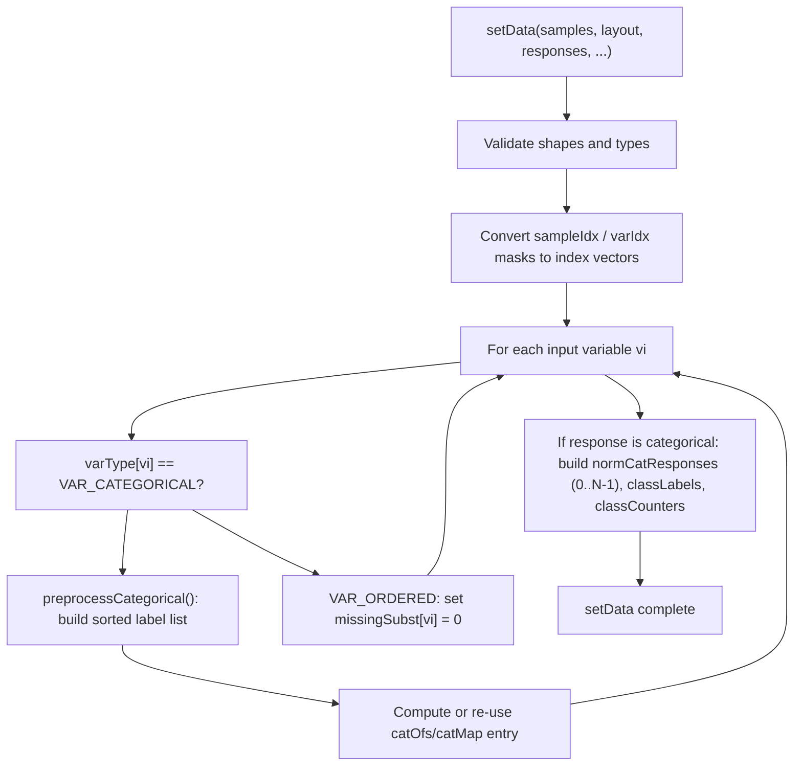
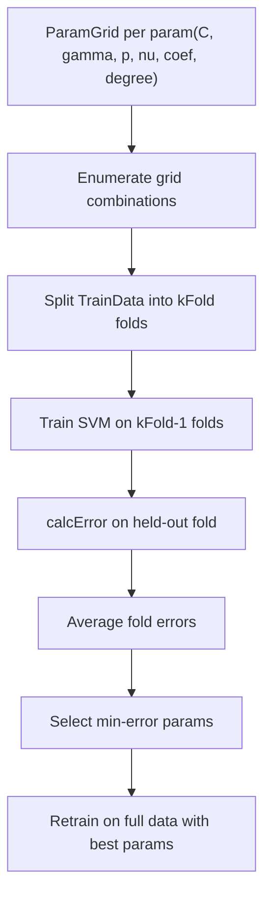

# 统计模型与训练接口

相关源文件

-   [modules/ml/include/opencv2/ml.hpp](https://github.com/opencv/opencv/blob/91c78f50/modules/ml/include/opencv2/ml.hpp)
-   [modules/ml/include/opencv2/ml/ml.hpp](https://github.com/opencv/opencv/blob/91c78f50/modules/ml/include/opencv2/ml/ml.hpp)
-   [modules/ml/include/opencv2/ml/ml.inl.hpp](https://github.com/opencv/opencv/blob/91c78f50/modules/ml/include/opencv2/ml/ml.inl.hpp)
-   [modules/ml/src/ann\_mlp.cpp](https://github.com/opencv/opencv/blob/91c78f50/modules/ml/src/ann_mlp.cpp)
-   [modules/ml/src/boost.cpp](https://github.com/opencv/opencv/blob/91c78f50/modules/ml/src/boost.cpp)
-   [modules/ml/src/data.cpp](https://github.com/opencv/opencv/blob/91c78f50/modules/ml/src/data.cpp)
-   [modules/ml/src/em.cpp](https://github.com/opencv/opencv/blob/91c78f50/modules/ml/src/em.cpp)
-   [modules/ml/src/gbt.cpp](https://github.com/opencv/opencv/blob/91c78f50/modules/ml/src/gbt.cpp)
-   [modules/ml/src/inner\_functions.cpp](https://github.com/opencv/opencv/blob/91c78f50/modules/ml/src/inner_functions.cpp)
-   [modules/ml/src/knearest.cpp](https://github.com/opencv/opencv/blob/91c78f50/modules/ml/src/knearest.cpp)
-   [modules/ml/src/lr.cpp](https://github.com/opencv/opencv/blob/91c78f50/modules/ml/src/lr.cpp)
-   [modules/ml/src/nbayes.cpp](https://github.com/opencv/opencv/blob/91c78f50/modules/ml/src/nbayes.cpp)
-   [modules/ml/src/precomp.hpp](https://github.com/opencv/opencv/blob/91c78f50/modules/ml/src/precomp.hpp)
-   [modules/ml/src/rtrees.cpp](https://github.com/opencv/opencv/blob/91c78f50/modules/ml/src/rtrees.cpp)
-   [modules/ml/src/svm.cpp](https://github.com/opencv/opencv/blob/91c78f50/modules/ml/src/svm.cpp)
-   [modules/ml/src/svmsgd.cpp](https://github.com/opencv/opencv/blob/91c78f50/modules/ml/src/svmsgd.cpp)
-   [modules/ml/src/tree.cpp](https://github.com/opencv/opencv/blob/91c78f50/modules/ml/src/tree.cpp)
-   [modules/ml/test/test\_lr.cpp](https://github.com/opencv/opencv/blob/91c78f50/modules/ml/test/test_lr.cpp)
-   [modules/ml/test/test\_precomp.hpp](https://github.com/opencv/opencv/blob/91c78f50/modules/ml/test/test_precomp.hpp)
-   [modules/ml/test/test\_rtrees.cpp](https://github.com/opencv/opencv/blob/91c78f50/modules/ml/test/test_rtrees.cpp)
-   [modules/ml/test/test\_save\_load.cpp](https://github.com/opencv/opencv/blob/91c78f50/modules/ml/test/test_save_load.cpp)
-   [modules/ml/test/test\_svmsgd.cpp](https://github.com/opencv/opencv/blob/91c78f50/modules/ml/test/test_svmsgd.cpp)
-   [samples/cpp/logistic\_regression.cpp](https://github.com/opencv/opencv/blob/91c78f50/samples/cpp/logistic_regression.cpp)
-   [samples/cpp/train\_svmsgd.cpp](https://github.com/opencv/opencv/blob/91c78f50/samples/cpp/train_svmsgd.cpp)
-   [samples/cpp/travelsalesman.cpp](https://github.com/opencv/opencv/blob/91c78f50/samples/cpp/travelsalesman.cpp)

## 目标与范围

本页文档介绍 `opencv_ml` 模块的基础抽象：`StatModel` 基类、`TrainData` 容器，以及用于超参数搜索的 `ParamGrid` 结构。这三部分定义了模块内所有机器学习算法共同实现的接口。

关于各个算法类（`SVM`、`RTrees`、`ANN_MLP`、`EM` 等）的说明，请参见 [Classifier and Regression Algorithms](/opencv/opencv/13.2-classifier-and-regression-algorithms)。关于保存与加载训练模型所用的 `FileStorage` 系统，请参见 [Persistence and Serialization](/opencv/opencv/3.4-persistence-and-serialization-(filestorage))。

---

## 模块结构概览

所有 ML 类均位于 `cv::ml` 命名空间，并存放在 `modules/ml/` 下。公共 API 全部定义在 [\`modules/ml/include/opencv2/ml.hpp\`](https://github.com/opencv/opencv/blob/91c78f50/`modules/ml/include/opencv2/ml.hpp`)

**cv::ml 中的类层级**

```mermaid
flowchart TD
    classId_Algorithm_100["Algorithm"]
    classId_StatModel_101["StatModel"]
    classId_NormalBayesClassifier_102["NormalBayesClassifier"]
    classId_KNearest_103["KNearest"]
    classId_SVM_104["SVM"]
    classId_DTrees_105["DTrees"]
    classId_Boost_106["Boost"]
    classId_RTrees_107["RTrees"]
    classId_EM_108["EM"]
    classId_ANN_MLP_109["ANN_MLP"]
    classId_LogisticRegression_110["LogisticRegression"]
    classId_SVMSGD_111["SVMSGD"]
```


Sources: [\`modules/ml/include/opencv2/ml.hpp318-388](https://github.com/opencv/opencv/blob/91c78f50/`modules/ml/include/opencv2/ml.hpp#L318-L388)

---

## 枚举

有三个枚举定义了训练接口通用的术语体系。

### VariableTypes

[\`modules/ml/include/opencv2/ml.hpp81-86](https://github.com/opencv/opencv/blob/91c78f50/`modules/ml/include/opencv2/ml.hpp#L81-L86)

| Constant | Value | Meaning |
| --- | --- | --- |
| `VAR_NUMERICAL` | 0 | `VAR_ORDERED` 的别名 |
| `VAR_ORDERED` | 0 | 连续/数值变量 |
| `VAR_CATEGORICAL` | 1 | 离散类别标签 |

`TrainData` 按列使用这些类型来区分输入特征与类别标签，并触发分类变量预处理（构建类别映射、归一化响应值）。

### SampleTypes

[\`modules/ml/include/opencv2/ml.hpp96-100](https://github.com/opencv/opencv/blob/91c78f50/`modules/ml/include/opencv2/ml.hpp#L96-L100)

| Constant | Value | Meaning |
| --- | --- | --- |
| `ROW_SAMPLE` | 0 | 矩阵每一行是一个样本 |
| `COL_SAMPLE` | 1 | 矩阵每一列是一个样本 |

该布局标志传给 `TrainData::create` 与 `StatModel::train`。多数算法内部期望 `ROW_SAMPLE`；必要时由 `TrainData` 进行转置。

### ErrorTypes

[\`modules/ml/include/opencv2/ml.hpp89-93](https://github.com/opencv/opencv/blob/91c78f50/`modules/ml/include/opencv2/ml.hpp#L89-L93)

| Constant | Value | Meaning |
| --- | --- | --- |
| `TEST_ERROR` | 0 | 测试子集上的误差 |
| `TRAIN_ERROR` | 1 | 训练子集上的误差 |

在 `StatModel::calcError` 中作为 `test` 布尔参数使用。

---

## `TrainData` 类

`TrainData` 是一个抽象接口（纯虚类），用于封装数据集并向 `StatModel::train` 暴露。其具体实现为 [\`modules/ml/src/data.cpp114](https://github.com/opencv/opencv/blob/91c78f50/`modules/ml/src/data.cpp#L114-L114) 中的 `TrainDataImpl`。

### 构造

提供两个工厂方法：

**来自内存数组：**

```
TrainData::create(samples, layout, responses,
                  varIdx, sampleIdx, sampleWeights, varType)
```
-   `samples`：特征向量的 `CV_32F` 矩阵。
-   `responses`：`CV_32F`（按有序变量处理）或 `CV_32S`（按分类变量处理）。
-   `varIdx`：可选掩码或索引向量，用于选择启用特征。
-   `sampleIdx`：可选掩码或索引向量，用于选择启用样本。
-   `sampleWeights`：逐样本 `CV_32F` 权重；若为空，默认所有权重为 1.0。
-   `varType`：长度为 `nInputVars + nOutputVars` 的 `CV_8U` 向量；每项为 `VAR_ORDERED` 或 `VAR_CATEGORICAL`。

**来自 CSV 文件：**

```
TrainData::loadFromCSV(filename, headerLineCount,
                       responseStartIdx, responseEndIdx,
                       varTypeSpec, delimiter, missch)
```
非数值列会自动视为分类变量。缺失值由 `TrainData::missingValue()` 表示，该函数返回 `FLT_MAX`。

Sources: [\`modules/ml/include/opencv2/ml.hpp136-314](https://github.com/opencv/opencv/blob/91c78f50/`modules/ml/include/opencv2/ml.hpp#L136-L314) [\`modules/ml/src/data.cpp237-410](https://github.com/opencv/opencv/blob/91c78f50/`modules/ml/src/data.cpp#L237-L410)

### 训练/测试拆分

`TrainData` 可将自身拆分为训练与测试子集：

| Method | Description |
| --- | --- |
| `setTrainTestSplit(count, shuffle)` | 前 `count` 个样本保留为训练集 |
| `setTrainTestSplitRatio(ratio, shuffle)` | 按比例保留训练集 |
| `shuffleTrainTest()` | 对既有拆分重新打乱 |

设置拆分后，`getTrain*` 访问器仅返回训练部分，`getTest*` 返回测试部分。

### 访问器方法

**数据集维度：**

| Method | Returns |
| --- | --- |
| `getNSamples()` | 总样本数（受 `sampleIdx` 影响） |
| `getNTrainSamples()` | 训练子集样本数 |
| `getNTestSamples()` | 测试子集样本数 |
| `getNVars()` | 激活变量数（受 `varIdx` 影响） |
| `getNAllVars()` | 原始矩阵变量总数 |
| `getLayout()` | `ROW_SAMPLE` 或 `COL_SAMPLE` |

**数据获取：**

| Method | Returns |
| --- | --- |
| `getTrainSamples(layout, compressSamples, compressVars)` | 训练用特征矩阵 |
| `getTrainResponses()` | 训练样本的原始响应值 |
| `getTrainNormCatResponses()` | 重映射到 0..N-1 的分类响应值 |
| `getTestSamples()` | 测试样本特征矩阵 |
| `getTestResponses()` | 测试样本原始响应值 |
| `getClassLabels()` | 原始响应范围中的唯一类别标签值 |
| `getSampleWeights()` / `getTrainSampleWeights()` | 逐样本权重向量 |
| `getMissing()` | `CV_8U` 掩码：非零表示缺失 |
| `getDefaultSubstValues()` | 缺失项替代值 |
| `getCatCount(vi)` | 变量 `vi` 的类别数 |
| `getCatOfs()` / `getCatMap()` | 编码所用类别偏移/映射数组 |

**工具方法：**

| Method | Description |
| --- | --- |
| `getSubVector(vec, idx)` | 按索引从 1D 向量提取元素 |
| `getSubMatrix(matrix, idx, layout)` | 按索引提取行或列 |

Sources: [\`modules/ml/include/opencv2/ml.hpp145-313](https://github.com/opencv/opencv/blob/91c78f50/`modules/ml/include/opencv2/ml.hpp#L145-L313) [\`modules/ml/src/data.cpp114-410](https://github.com/opencv/opencv/blob/91c78f50/`modules/ml/src/data.cpp#L114-L410)

### `TrainDataImpl::setData` 的内部数据流

**`TrainData` 处理分类变量的方式**


Sources: [\`modules/ml/src/data.cpp237-410](https://github.com/opencv/opencv/blob/91c78f50/`modules/ml/src/data.cpp#L237-L410)

---

## `StatModel` 基类

`StatModel` 继承自 `Algorithm`，并扩展了训练/预测契约。定义见 [\`modules/ml/include/opencv2/ml.hpp318-388](https://github.com/opencv/opencv/blob/91c78f50/`modules/ml/include/opencv2/ml.hpp#L318-L388)

### 关键虚方法

| Method | Pure? | Description |
| --- | --- | --- |
| `getVarCount()` | yes | 训练后模型期望的特征数 |
| `isTrained()` | yes | `train` 是否已成功调用 |
| `isClassifier()` | yes | 分类器为 true，回归器为 false |
| `predict(samples, results, flags)` | yes | 执行推理；返回首个样本预测值 |
| `train(trainData, flags)` | no | 默认委托给子类 |
| `train(samples, layout, responses)` | no | 便捷接口：先 `TrainData::create`，再调用上者 |
| `calcError(data, test, resp)` | no | 使用 `predict` 计算 RMS（回归）或误分类率（分类） |
| `empty()` | no | 返回 `!isTrained()` |

### Predict 标志位

在 [\`modules/ml/include/opencv2/ml.hpp322-327](https://github.com/opencv/opencv/blob/91c78f50/`modules/ml/include/opencv2/ml.hpp#L322-L327) 中定义为 `StatModel::Flags`：

| Flag | Value | Effect |
| --- | --- | --- |
| `UPDATE_MODEL` | 1 | 增量更新模型（若算法支持） |
| `RAW_OUTPUT` | 1 | 返回原始分数而非类别标签 |
| `COMPRESSED_INPUT` | 2 | 输入仅包含启用变量（经 `varIdx` 压缩） |
| `PREPROCESSED_INPUT` | 4 | 跳过分类编码；输入已标准化 |

### 默认 `train` 与 `calcError` 实现

[\`modules/ml/src/inner\_functions.cpp70-75](https://github.com/opencv/opencv/blob/91c78f50/`modules/ml/src/inner_functions.cpp#L70-L75) 中的非纯虚 `train(samples, layout, responses)` 重写仅调用：

```
train(TrainData::create(samples, layout, responses));
```
[\`modules/ml/src/inner\_functions.cpp77-134](https://github.com/opencv/opencv/blob/91c78f50/`modules/ml/src/inner_functions.cpp#L77-L134) 中的 `calcError` 以并行方式（`ParallelCalcError` 循环体）调用 `StatModel::predict` 并计算：

-   **分类器**：误分类样本百分比。
-   **回归器**：均方根误差。

### 静态 `train<T>` 模板

[\`modules/ml/include/opencv2/ml.hpp383-387](https://github.com/opencv/opencv/blob/91c78f50/`modules/ml/include/opencv2/ml.hpp#L383-L387)

```
template<typename _Tp>static Ptr<_Tp> train(const Ptr<TrainData>& data, int flags=0)
```
通过 `_Tp::create()` 创建模型，调用 `train`，训练失败时返回空，否则返回 `Ptr<_Tp>`。适用于诸如 `SVM::train<SVM>(data)` 的一行写法。

---

## `ParamGrid` 类

`ParamGrid` 指定单一超参数的对数搜索网格。定义见 [\`modules/ml/include/opencv2/ml.hpp107-134](https://github.com/opencv/opencv/blob/91c78f50/`modules/ml/include/opencv2/ml.hpp#L107-L134)，实现见 [\`modules/ml/src/inner\_functions.cpp45-56](https://github.com/opencv/opencv/blob/91c78f50/`modules/ml/src/inner_functions.cpp#L45-L56)

### 字段

| Field | Default | Description |
| --- | --- | --- |
| `minVal` | 0.0 | 参数范围下界 |
| `maxVal` | 0.0 | 参数范围上界 |
| `logStep` | 1.0 | 候选值之间乘法步长；>1 才启用搜索 |

### 迭代序列

网格生成如下序列：

```
minVal, minVal * logStep, minVal * logStep^2, ...,
```
当值小于 `maxVal` 时继续。若 `logStep <= 1`，则不执行扫描，模型使用当前参数值。

### 构造

```
// Direct constructionParamGrid(double minVal, double maxVal, double logStep); // Factory (returns Ptr<ParamGrid>)ParamGrid::create(double minVal, double maxVal, double logstep);
```
[\`modules/ml/src/svm.cpp97-105](https://github.com/opencv/opencv/blob/91c78f50/`modules/ml/src/svm.cpp#L97-L105) 中的校验要求 `minVal > 0`、`minVal <= maxVal`、`logStep > 1`。

### SVM 参数默认网格

`SVM::getDefaultGrid(param_id)` 返回预配置网格，定义于 [\`modules/ml/src/svm.cpp375-417](https://github.com/opencv/opencv/blob/91c78f50/`modules/ml/src/svm.cpp#L375-L417)：

| Parameter | `minVal` | `maxVal` | `logStep` |
| --- | --- | --- | --- |
| `SVM::C` | 0.1 | 500 | 5 |
| `SVM::GAMMA` | 1e-5 | 0.6 | 15 |
| `SVM::P` | 0.01 | 100 | 7 |
| `SVM::NU` | 0.01 | 0.2 | 3 |
| `SVM::COEF` | 0.1 | 300 | 14 |
| `SVM::DEGREE` | 0.01 | 4 | 7 |

---

## 交叉验证与 `trainAuto`

交叉验证直接实现在 `SVM::trainAuto` 中（声明见 [\`modules/ml/include/opencv2/ml.hpp712-759](https://github.com/opencv/opencv/blob/91c78f50/`modules/ml/include/opencv2/ml.hpp#L712-L759)），它是该模块中唯一内置超参数搜索的算法。流程如下：

1.  对于由给定 `ParamGrid` 实例提供的 `(C, gamma, p, nu, coef0, degree)` 每组参数组合：
    -   将训练数据划分为 `kFold` 个等分。
    -   在 `kFold - 1` 个分区上训练；在留出分区上测误差。
    -   对各折误差求平均。
2.  选择交叉验证误差最小的参数组合。
3.  用最优参数在完整数据集上重新训练。

当问题是二分类时，`balanced` 标志会触发类别均衡的折分。

**SVM::trainAuto 的交叉验证流程**


Sources: [\`modules/ml/include/opencv2/ml.hpp678-759](https://github.com/opencv/opencv/blob/91c78f50/`modules/ml/include/opencv2/ml.hpp#L678-L759) [\`modules/ml/src/svm.cpp375-417](https://github.com/opencv/opencv/blob/91c78f50/`modules/ml/src/svm.cpp#L375-L417)

对其他算法而言，通用交叉验证并未内置在 `StatModel` 本身中。用户代码需结合 `TrainData::setTrainTestSplit` 或 `setTrainTestSplitRatio`，重复调用 `train` 与 `calcError` 来实现。

---

## 训练与预测工作流

**典型训练与推理流程**

> **[Mermaid sequence]**
> *(图表结构无法解析)*

Sources: [\`modules/ml/include/opencv2/ml.hpp318-388](https://github.com/opencv/opencv/blob/91c78f50/`modules/ml/include/opencv2/ml.hpp#L318-L388) [\`modules/ml/src/inner\_functions.cpp58-134](https://github.com/opencv/opencv/blob/91c78f50/`modules/ml/src/inner_functions.cpp#L58-L134)

---

## 序列化

所有 `StatModel` 子类都继承 `Algorithm::save` 与 `Algorithm::load`。每个算法会将参数和已学习状态写入 `FileStorage`（XML/YAML/JSON），键名由 `getDefaultName()` 返回的固定字符串决定。

| Algorithm | `getDefaultName()` key |
| --- | --- |
| `SVM` | `opencv_ml_svm` |
| `RTrees` | `opencv_ml_rtrees` |
| `ANN_MLP` | `opencv_ml_ann_mlp` |
| `EM` | `opencv_ml_em` |
| `LogisticRegression` | `opencv_ml_lr` |
| `SVMSGD` | `opencv_ml_svmsgd` |
| `KNearest` (brute force) | `opencv_ml_knn` |
| `KNearest` (KD-tree) | `opencv_ml_knn_kd` |

每个类还提供静态 `load(filepath, nodeName)` 工厂，内部调用 `Algorithm::load<T>`。[\`modules/ml/test/test\_save\_load.cpp\`](https://github.com/opencv/opencv/blob/91c78f50/`modules/ml/test/test_save_load.cpp`) 中的测试会加载历史 XML 并比较预测结果，以验证所有算法的往返一致性。

Sources: [\`modules/ml/src/em.cpp233-236](https://github.com/opencv/opencv/blob/91c78f50/`modules/ml/src/em.cpp#L233-L236) [\`modules/ml/src/lr.cpp68](https://github.com/opencv/opencv/blob/91c78f50/`modules/ml/src/lr.cpp#L68-L68) [\`modules/ml/src/svmsgd.cpp88](https://github.com/opencv/opencv/blob/91c78f50/`modules/ml/src/svmsgd.cpp#L88-L88) [\`modules/ml/test/test\_save\_load.cpp47-100](https://github.com/opencv/opencv/blob/91c78f50/`modules/ml/test/test_save_load.cpp#L47-L100)

---

## 缺失值处理

当单元值等于 `TrainData::missingValue()`（`FLT_MAX`）时，`TrainData` 会将该单元标记为缺失。`getMissing()` 返回与样本矩阵同形状的 `CV_8U` 掩码矩阵。`getDefaultSubstValues()` 返回逐变量替代向量（有序变量为 0.0，分类变量为 -1.0），用于算法在预测或分裂选择阶段遇到缺失项时的替代处理。

Sources: [\`modules/ml/include/opencv2/ml.hpp148](https://github.com/opencv/opencv/blob/91c78f50/`modules/ml/include/opencv2/ml.hpp#L148-L148) [\`modules/ml/src/data.cpp50](https://github.com/opencv/opencv/blob/91c78f50/`modules/ml/src/data.cpp#L50-L50) [\`modules/ml/src/data.cpp350-395](https://github.com/opencv/opencv/blob/91c78f50/`modules/ml/src/data.cpp#L350-L395)

---

## 关键代码实体汇总

| Entity | File | Role |
| --- | --- | --- |
| `cv::ml::StatModel` | `ml.hpp:318` | 所有 ML 模型的抽象基类 |
| `cv::ml::TrainData` | `ml.hpp:145` | 抽象数据集接口 |
| `TrainDataImpl` | `data.cpp:114` | 具体 `TrainData` 实现 |
| `cv::ml::ParamGrid` | `ml.hpp:107` | 对数尺度超参数扫描范围 |
| `StatModel::train` | `inner_functions.cpp:62` | 默认训练分发 |
| `StatModel::calcError` | `inner_functions.cpp:77` | 通过 `predict` 计算误差 |
| `ParallelCalcError` | `inner_functions.cpp:77` | `calcError` 的并行循环体 |
| `SVM::getDefaultGrid` | `svm.cpp:375` | SVM 预定义 `ParamGrid` 值 |
| `TrainDataImpl::setData` | `data.cpp:237` | 核心数据摄取与分类设置 |
| `VariableTypes` | `ml.hpp:81` | `VAR_ORDERED` / `VAR_CATEGORICAL` 枚举 |
| `SampleTypes` | `ml.hpp:96` | `ROW_SAMPLE` / `COL_SAMPLE` 枚举 |
| `StatModel::Flags` | `ml.hpp:322` | `RAW_OUTPUT`、`COMPRESSED_INPUT` 等 |
