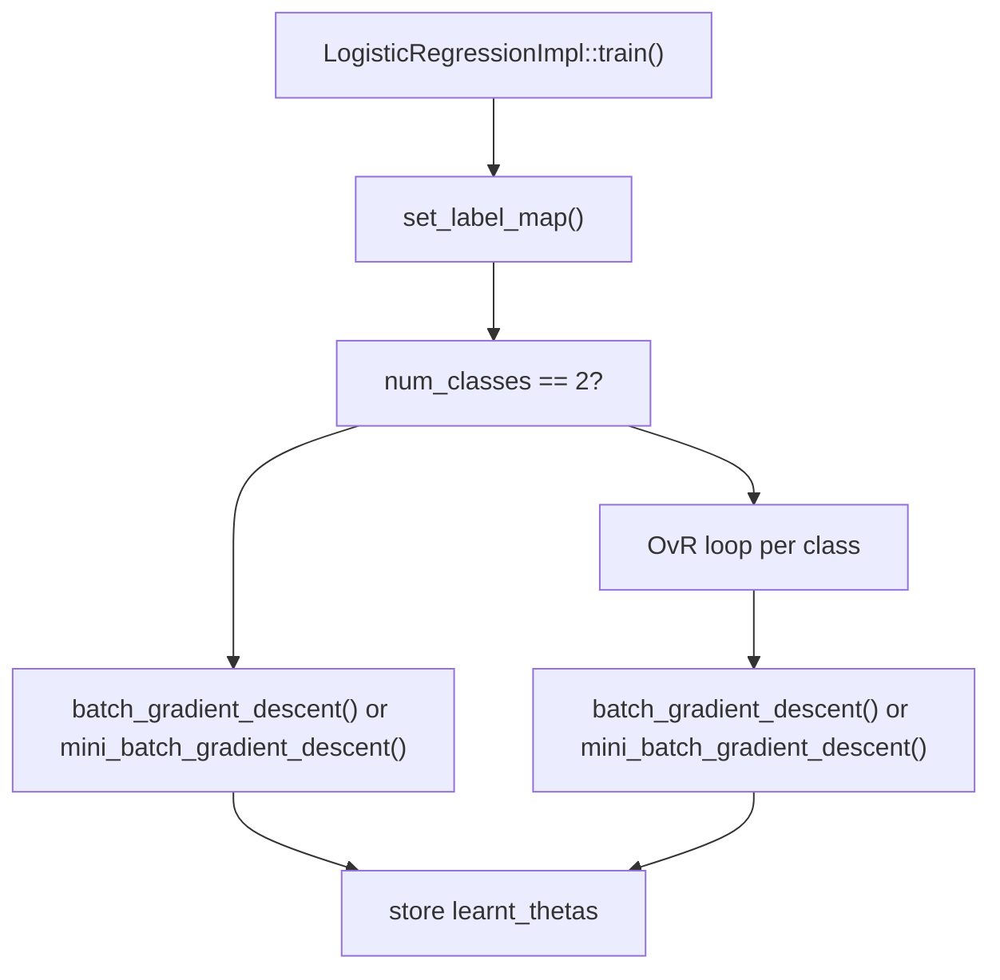
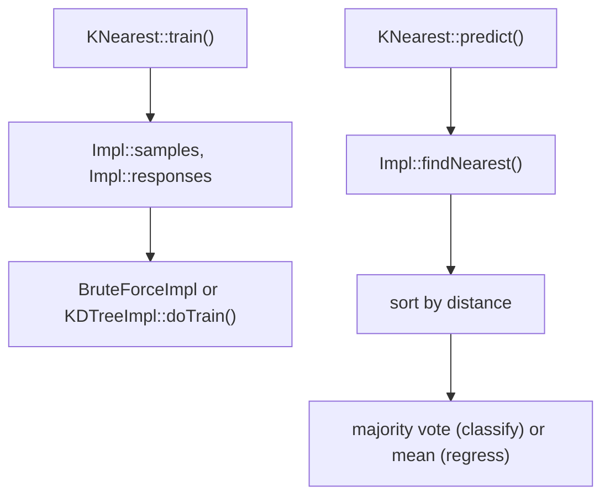
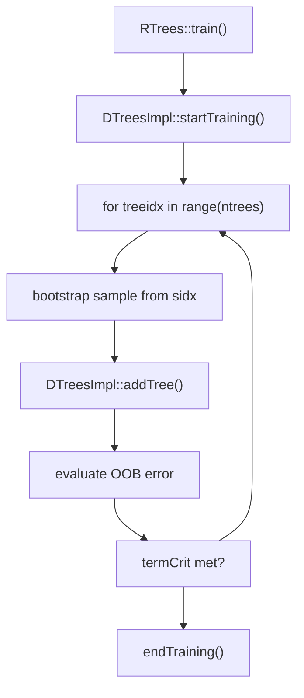
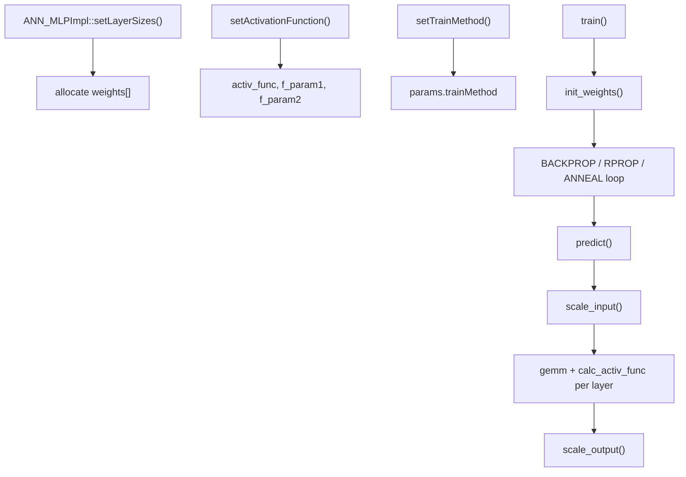

# 分类与回归算法

相关源文件

-   [modules/ml/include/opencv2/ml.hpp](https://github.com/opencv/opencv/blob/91c78f50/modules/ml/include/opencv2/ml.hpp)
-   [modules/ml/include/opencv2/ml/ml.hpp](https://github.com/opencv/opencv/blob/91c78f50/modules/ml/include/opencv2/ml/ml.hpp)
-   [modules/ml/include/opencv2/ml/ml.inl.hpp](https://github.com/opencv/opencv/blob/91c78f50/modules/ml/include/opencv2/ml/ml.inl.hpp)
-   [modules/ml/src/ann\_mlp.cpp](https://github.com/opencv/opencv/blob/91c78f50/modules/ml/src/ann_mlp.cpp)
-   [modules/ml/src/boost.cpp](https://github.com/opencv/opencv/blob/91c78f50/modules/ml/src/boost.cpp)
-   [modules/ml/src/data.cpp](https://github.com/opencv/opencv/blob/91c78f50/modules/ml/src/data.cpp)
-   [modules/ml/src/em.cpp](https://github.com/opencv/opencv/blob/91c78f50/modules/ml/src/em.cpp)
-   [modules/ml/src/gbt.cpp](https://github.com/opencv/opencv/blob/91c78f50/modules/ml/src/gbt.cpp)
-   [modules/ml/src/inner\_functions.cpp](https://github.com/opencv/opencv/blob/91c78f50/modules/ml/src/inner_functions.cpp)
-   [modules/ml/src/knearest.cpp](https://github.com/opencv/opencv/blob/91c78f50/modules/ml/src/knearest.cpp)
-   [modules/ml/src/lr.cpp](https://github.com/opencv/opencv/blob/91c78f50/modules/ml/src/lr.cpp)
-   [modules/ml/src/nbayes.cpp](https://github.com/opencv/opencv/blob/91c78f50/modules/ml/src/nbayes.cpp)
-   [modules/ml/src/precomp.hpp](https://github.com/opencv/opencv/blob/91c78f50/modules/ml/src/precomp.hpp)
-   [modules/ml/src/rtrees.cpp](https://github.com/opencv/opencv/blob/91c78f50/modules/ml/src/rtrees.cpp)
-   [modules/ml/src/svm.cpp](https://github.com/opencv/opencv/blob/91c78f50/modules/ml/src/svm.cpp)
-   [modules/ml/src/svmsgd.cpp](https://github.com/opencv/opencv/blob/91c78f50/modules/ml/src/svmsgd.cpp)
-   [modules/ml/src/tree.cpp](https://github.com/opencv/opencv/blob/91c78f50/modules/ml/src/tree.cpp)
-   [modules/ml/test/test\_lr.cpp](https://github.com/opencv/opencv/blob/91c78f50/modules/ml/test/test_lr.cpp)
-   [modules/ml/test/test\_precomp.hpp](https://github.com/opencv/opencv/blob/91c78f50/modules/ml/test/test_precomp.hpp)
-   [modules/ml/test/test\_rtrees.cpp](https://github.com/opencv/opencv/blob/91c78f50/modules/ml/test/test_rtrees.cpp)
-   [modules/ml/test/test\_save\_load.cpp](https://github.com/opencv/opencv/blob/91c78f50/modules/ml/test/test_save_load.cpp)
-   [modules/ml/test/test\_svmsgd.cpp](https://github.com/opencv/opencv/blob/91c78f50/modules/ml/test/test_svmsgd.cpp)
-   [samples/cpp/logistic\_regression.cpp](https://github.com/opencv/opencv/blob/91c78f50/samples/cpp/logistic_regression.cpp)
-   [samples/cpp/train\_svmsgd.cpp](https://github.com/opencv/opencv/blob/91c78f50/samples/cpp/train_svmsgd.cpp)
-   [samples/cpp/travelsalesman.cpp](https://github.com/opencv/opencv/blob/91c78f50/samples/cpp/travelsalesman.cpp)

本页文档介绍 `cv::ml` 模块中的各个具体算法类：其用途、关键参数、训练机制，以及相关代码实体。这里描述的所有类都派生自 `StatModel`，并遵循统一的 `train`/`predict` 接口。

关于基类接口（`StatModel`、`TrainData`、`ParamGrid` 与交叉验证）的背景，请参见页面 [13.1](/opencv/opencv/13.1-statistical-models-and-training-interface)。

---

## 算法总览

下表汇总了 `modules/ml/include/opencv2/ml.hpp` 暴露的全部算法类。

| Class | Type | Source File | Task |
| --- | --- | --- | --- |
| `SVM` | Classifier / Regressor | `modules/ml/src/svm.cpp` | 最大间隔超平面 |
| `SVMSGD` | Classifier | `modules/ml/src/svmsgd.cpp` | 基于 SGD 的线性 SVM |
| `LogisticRegression` | Classifier | `modules/ml/src/lr.cpp` | 逻辑回归 |
| `NormalBayesClassifier` | Classifier | `modules/ml/src/nbayes.cpp` | 高斯朴素贝叶斯 |
| `KNearest` | Classifier / Regressor | `modules/ml/src/knearest.cpp` | k 近邻 |
| `DTrees` | Classifier / Regressor | `modules/ml/src/tree.cpp` | 决策树（CART） |
| `RTrees` | Classifier / Regressor | `modules/ml/src/rtrees.cpp` | 随机森林 |
| `Boost` | Classifier | `modules/ml/src/boost.cpp` | 提升式决策树桩 |
| `EM` | Classifier / Clustering | `modules/ml/src/em.cpp` | 高斯混合模型 |
| `ANN_MLP` | Classifier / Regressor | `modules/ml/src/ann_mlp.cpp` | 多层感知机 |

**类层级：**


Sources: [modules/ml/include/opencv2/ml.hpp316-388](https://github.com/opencv/opencv/blob/91c78f50/modules/ml/include/opencv2/ml.hpp#L316-L388) [modules/ml/src/inner\_functions.cpp1-100](https://github.com/opencv/opencv/blob/91c78f50/modules/ml/src/inner_functions.cpp#L1-L100)

---

## 支持向量机 — `SVM`

### 功能

`SVM` 寻找可最大化类别间间隔的超平面（或通过核函数得到非线性决策面）。用于回归时，它最小化样本偏离拟合管道的程度。实现源自 libsvm 2.6。

### 问题类型

SVM 类型由 `SVM::setType(int)` 选择。`ml.hpp` 中 `Types` 枚举定义为：

| Constant | Value | Use |
| --- | --- | --- |
| `C_SVC` | 100 | 多分类；对误分类点施加惩罚 `C` |
| `NU_SVC` | 101 | 使用 `ν` 约束支持向量比例的分类 |
| `ONE_CLASS` | 102 | 新奇点检测；学习训练数据的边界 |
| `EPS_SVR` | 103 | ε-不敏感回归；对管道外点施加惩罚 `C` |
| `NU_SVR` | 104 | 使用 `ν` 代替 ε 的回归 |

### 核类型

通过 `SVM::setKernel(int kernelType)` 设置。`KernelTypes` 枚举：

| Constant | Formula |
| --- | --- |
| `LINEAR` | `K(xi, xj) = xi·xj` |
| `POLY` | `K(xi, xj) = (γ xi·xj + coef0)^degree` |
| `RBF` | `K(xi, xj) = exp(-γ ‖xi - xj‖²)` |
| `SIGMOID` | `K(xi, xj) = tanh(γ xi·xj + coef0)` |
| `CHI2` | `K(xi, xj) = exp(-γ Σ (xi-xj)²/(xi+xj))` |
| `INTER` | `K(xi, xj) = Σ min(xi, xj)` |
| `CUSTOM` | 用户提供的 `SVM::Kernel` 子类 |

自定义核必须实现 `SVM::Kernel` 抽象内部类（`calc` 方法）。

### 参数

| Getter/Setter | Role | Relevant types |
| --- | --- | --- |
| `getC` / `setC` | 误分类惩罚 | `C_SVC`、`EPS_SVR`、`NU_SVR` |
| `getGamma` / `setGamma` | 核带宽 γ | `POLY`、`RBF`、`SIGMOID`、`CHI2` |
| `getDegree` / `setDegree` | 多项式次数 | `POLY` |
| `getCoef0` / `setCoef0` | 核偏移 coef0 | `POLY`、`SIGMOID` |
| `getNu` / `setNu` | ν 约束 | `NU_SVC`、`ONE_CLASS`、`NU_SVR` |
| `getP` / `setP` | SVR 管道 ε | `EPS_SVR` |
| `getClassWeights` / `setClassWeights` | 每类 C 缩放系数 | `C_SVC` |
| `getTermCriteria` / `setTermCriteria` | 求解器停止条件 | all |

### 训练

标准训练调用 `StatModel::train`。自动超参数搜索使用：

```
SVM::trainAuto(data, kFold, Cgrid, gammaGrid, pGrid, nuGrid, coeffGrid, degreeGrid, balanced)
```
`trainAuto` 在对数网格上执行 k 折交叉验证（见 [modules/ml/src/svm.cpp369-417](https://github.com/opencv/opencv/blob/91c78f50/modules/ml/src/svm.cpp#L369-L417) 中 `SVM::getDefaultGrid` / `SVM::getDefaultGridPtr`）。默认网格为：

| Parameter | `minVal` | `maxVal` | `logStep` |
| --- | --- | --- | --- |
| C | 0.1 | 500 | 5 |
| GAMMA | 1e-5 | 0.6 | 15 |
| P | 0.01 | 100 | 7 |
| NU | 0.01 | 0.2 | 3 |
| COEF | 0.1 | 300 | 14 |
| DEGREE | 0.01 | 4 | 7 |

### 求解器内部机制

内部求解器（`SVMImpl::Solver`）实现 SMO 算法。它以 LRU 双向链表维护核缓存行（最小 40 MB，最大 500 MB），发生淘汰时通过核对象计算新行。

[modules/ml/src/svm.cpp420-800](https://github.com/opencv/opencv/blob/91c78f50/modules/ml/src/svm.cpp#L420-L800)

### 训练后访问

| Method | Returns |
| --- | --- |
| `getSupportVectors()` | 支持向量矩阵（每行一个） |
| `getUncompressedSupportVectors()` | 完整未压缩支持向量（仅线性 SVM） |
| `getDecisionFunction(i, alpha, svidx)` | 第 i 个决策函数的 rho、alpha 权重、SV 索引 |

对于 N 类分类，决策函数数量为 N(N-1)/2。

Sources: [modules/ml/include/opencv2/ml.hpp518-826](https://github.com/opencv/opencv/blob/91c78f50/modules/ml/include/opencv2/ml.hpp#L518-L826) [modules/ml/src/svm.cpp91-420](https://github.com/opencv/opencv/blob/91c78f50/modules/ml/src/svm.cpp#L91-L420)

---

## 随机梯度下降 SVM — `SVMSGD`

### 功能

`SVMSGD` 使用随机梯度下降训练线性二分类 SVM。对大数据集通常比 `SVM` 更快，但仅支持线性决策边界。

### 参数

| Getter/Setter | Role |
| --- | --- |
| `getSvmsgdType` / `setSvmsgdType` | `SGD` 或 `ASGD`（平均 SGD） |
| `getMarginType` / `setMarginType` | `SOFT_MARGIN` 或 `HARD_MARGIN` |
| `getMarginRegularization` / `setMarginRegularization` | λ 正则强度 |
| `getInitialStepSize` / `setInitialStepSize` | 初始学习率 |
| `getStepDecreasingPower` / `setStepDecreasingPower` | 学习率衰减速度 |
| `getTermCriteria` / `setTermCriteria` | 停止条件 |

`setOptimalParameters(svmsgdType, marginType)` 会应用预调优默认参数。

### 输出

训练后，`getWeights()` 返回权重向量 `w`，`getShift()` 返回偏置 `b`。决策形式为 `sign(w·x + b)`。

Sources: [modules/ml/include/opencv2/ml.hpp](https://github.com/opencv/opencv/blob/91c78f50/modules/ml/include/opencv2/ml.hpp) [modules/ml/src/svmsgd.cpp60-120](https://github.com/opencv/opencv/blob/91c78f50/modules/ml/src/svmsgd.cpp#L60-L120)

---

## 逻辑回归 — `LogisticRegression`

### 功能

`LogisticRegression` 通过梯度下降最小化交叉熵损失，学习线性决策边界。二分类使用单 sigmoid 输出。多分类使用 one-vs-rest（OvR）：每个类别一组权重。

### 参数

| Getter/Setter | Role | Default |
| --- | --- | --- |
| `getLearningRate` / `setLearningRate` | 步长 α | 0.001 |
| `getIterations` / `setIterations` | 最大梯度步数 | 1000 |
| `getRegularization` / `setRegularization` | `REG_DISABLE`、`REG_L1`、`REG_L2` | `REG_L2` |
| `getTrainMethod` / `setTrainMethod` | `BATCH` 或 `MINI_BATCH` | `BATCH` |
| `getMiniBatchSize` / `setMiniBatchSize` | 每个 mini-batch 样本数 | 1 |
| `getTermCriteria` / `setTermCriteria` | 停止条件 | COUNT+EPS |

### 训练流程


### 预测流程

二分类输出时应用 `calc_sigmoid(data_t * thetas.t())`，并以 0.5 阈值判别。多分类时对每个类独立应用 sigmoid 并取 argmax。`StatModel::RAW_OUTPUT` 标志返回原始 sigmoid 分数而非类别标签。

Sources: [modules/ml/src/lr.cpp1-280](https://github.com/opencv/opencv/blob/91c78f50/modules/ml/src/lr.cpp#L1-L280)

---

## 朴素贝叶斯分类器 — `NormalBayesClassifier`

### 功能

`NormalBayesClassifier` 实现高斯朴素贝叶斯。每个类别在每个特征上都有一个由训练数据估计的高斯分布。可在 `train` 中使用 `UPDATE_MODEL` 标志进行增量更新。

### 关键方法

`predictProb(inputs, outputs, outputProbs, flags)` 在基类 `predict` 基础上扩展为：对每个输入向量额外返回其预测类别概率。

### 训练

对每个类别和每个特征，分类器估计均值与方差。预测时计算样本在每个类别分布下的对数似然，返回得分最高类别。

增量更新（设置 `UPDATE_MODEL`）会将新类别条件统计与已有统计合并。

Sources: [modules/ml/include/opencv2/ml.hpp394-426](https://github.com/opencv/opencv/blob/91c78f50/modules/ml/include/opencv2/ml.hpp#L394-L426) [modules/ml/src/nbayes.cpp47-220](https://github.com/opencv/opencv/blob/91c78f50/modules/ml/src/nbayes.cpp#L47-L220)

---

## K 近邻 — `KNearest`

### 功能

`KNearest` 保存训练样本，预测时按欧氏距离查找 `k` 个最近邻。分类模式返回多数标签；回归模式返回响应均值。

### 算法类型

通过 `setAlgorithmType(int)` 设置。两种后端：

| Constant | Backend |
| --- | --- |
| `BRUTE_FORCE` (1) | `BruteForceImpl` — 扫描全部存储样本 |
| `KDTREE` (2) | `KDTreeImpl` — 构建 kd-tree 加速搜索；`Emax` 控制最大近似误差 |

### 参数

| Getter/Setter | Role | Default |
| --- | --- | --- |
| `getDefaultK` / `setDefaultK` | `predict` 使用的邻居数量 | 10 |
| `getIsClassifier` / `setIsClassifier` | 分类或回归模式 | true |
| `getAlgorithmType` / `setAlgorithmType` | `BRUTE_FORCE` 或 `KDTREE` | `BRUTE_FORCE` |
| `getEmax` / `setEmax` | kd-tree 近似的最大误差 | INT\_MAX |

### 扩展预测

`findNearest(samples, k, results, neighborResponses, dist)` 在最终预测之外还返回邻居标签和距离。

训练阶段仅存储样本与响应。算法使用 TBB 并行化。

**内部数据流：**


Sources: [modules/ml/include/opencv2/ml.hpp436-516](https://github.com/opencv/opencv/blob/91c78f50/modules/ml/include/opencv2/ml.hpp#L436-L516) [modules/ml/src/knearest.cpp50-300](https://github.com/opencv/opencv/blob/91c78f50/modules/ml/src/knearest.cpp#L50-L300)

---

## 决策树 — `DTrees`

### 功能

`DTrees` 构建二叉 CART（Classification and Regression Tree）。在每个节点上，它寻找能最大幅度降低不纯度的变量与分裂阈值（分类用 Gini，回归用方差）。支持带交叉验证的可选代价复杂度剪枝。

### 关键数据结构

-   `DTrees::Node` — 树节点，包含 `value`、`classIdx`、`parent`、`left`、`right`、`split`。
-   `DTrees::Split` — 分裂测试：`varIdx`、阈值 `c`（数值变量）、`subsetOfs`（分类变量）、`quality`。
-   `DTreesImpl` — 内部实现，维护 `nodes`、`splits`、`subsets`、`roots` 向量。

### `TreeParams`（参数）

| Parameter | Role | Default |
| --- | --- | --- |
| `maxDepth` | 树最大深度 | `INT_MAX` |
| `minSampleCount` | 节点可继续分裂的最小样本数 | 10 |
| `regressionAccuracy` | 方差低于该值时停止分裂 | 0.01 |
| `useSurrogates` | 缺失数据是否使用替代分裂 | false |
| `maxCategories` | 类别折叠前允许的最大类别数 | 10 |
| `CVFolds` | 剪枝交叉验证折数 | 10 |
| `use1SERule` | 剪枝中使用 1-SE 规则 | true |
| `truncatePrunedTree` | 截断被剪枝子树 | true |
| `priors` | 每类先验权重 | (empty) |

### 训练机制

核心递归函数是 `DTreesImpl::addNodeAndTrySplit`，由 `DTreesImpl::addTree` 调用。树会序列化到扁平的 `nodes` / `splits` / `subsets` 向量中，并在 `roots` 中保存根索引。

Sources: [modules/ml/src/tree.cpp53-350](https://github.com/opencv/opencv/blob/91c78f50/modules/ml/src/tree.cpp#L53-L350) [modules/ml/include/opencv2/ml.hpp](https://github.com/opencv/opencv/blob/91c78f50/modules/ml/include/opencv2/ml.hpp)

---

## 随机森林 — `RTrees`

### 功能

`RTrees`（由 `DTreesImplForRTrees` 实现）通过 bagging 构建 `DTrees` 集成。每棵树看到的是训练数据的自助采样子集，并且每次分裂只考虑随机抽取的 `m` 个特征子集。预测时跨全部树聚合投票（分类）或求平均（回归）。

### 额外参数（`RTreeParams`）

| Parameter | Role | Default |
| --- | --- | --- |
| `nactiveVars` | 每次分裂的特征数；0 表示 `sqrt(nvars)` | 0 |
| `calcVarImportance` | 是否计算特征重要性 | false |
| `termCrit` | 按树数或 OOB 误差阈值停止 | 50 棵树，ε=0.1 |

### OOB 误差与变量重要性

每棵树的 out-of-bag 样本用于估计误差。当 `calcVarImportance` 为 true 时，使用置换重要性：在 OOB 集中打乱每个变量取值，并记录 OOB 误差增量，作为该变量的重要性分数。可通过 `RTrees::getVarImportance()` 与 `RTrees::getVotes()` 访问。

### 训练流程


Sources: [modules/ml/src/rtrees.cpp50-300](https://github.com/opencv/opencv/blob/91c78f50/modules/ml/src/rtrees.cpp#L50-L300) [modules/ml/include/opencv2/ml.hpp](https://github.com/opencv/opencv/blob/91c78f50/modules/ml/include/opencv2/ml.hpp)

---

## 提升算法 — `Boost`

### 功能

`Boost`（由 `DTreesImplForBoost` 实现）按序训练弱分类器（浅层 `DTrees`）集成。每棵后续树都会更关注当前集成错误分类的样本，其权重更新遵循对应提升类型规则。仅支持二分类。

### Boost 类型

| Constant | Algorithm | Update rule |
| --- | --- | --- |
| `DISCRETE` | Discrete AdaBoost | 误分类误差；`C = log((1−err)/err)` |
| `REAL` | Real AdaBoost | 每个叶节点处类别概率的对数比 |
| `LOGIT` | LogitBoost | 对 logistic 残差做回归 |
| `GENTLE` | Gentle AdaBoost | 使用有界弱学习器响应的回归 |

### 参数（`BoostTreeParams`）

| Parameter | Role | Default |
| --- | --- | --- |
| `boostType` | 算法变体 | `REAL` |
| `weakCount` | 弱学习器数量 | 100 |
| `weightTrimRate` | 保留总权重比例；用于加速剪枝 | 0.95 |

`Boost` 继承全部 `DTrees` 参数。默认树深为 1（决策树桩），`CVFolds` 为 0（不剪枝）。

### 权重更新

每棵树后，`updateWeightsAndTrim` 会按 boosting 规则重加权样本，并裁剪最低权重样本以加速后续迭代。

Sources: [modules/ml/src/boost.cpp46-320](https://github.com/opencv/opencv/blob/91c78f50/modules/ml/src/boost.cpp#L46-L320) [modules/ml/include/opencv2/ml.hpp](https://github.com/opencv/opencv/blob/91c78f50/modules/ml/include/opencv2/ml.hpp)

---

## 期望最大化（高斯混合模型）— `EM`

### 功能

`EM` 使用 EM 算法拟合高斯混合模型（GMM）。它为每个样本分配对 `nclusters` 个高斯分量的软隶属度，并迭代执行 E 步（计算后验概率）/ M 步（更新均值、协方差、权重）。

### 协方差类型

由 `setCovarianceMatrixType(int)` 控制：

| Constant | Structure | Storage |
| --- | --- | --- |
| `COV_MAT_SPHERICAL` | σ²I（每个分量一个标量） | 最小 |
| `COV_MAT_DIAGONAL` | 对角 Σ | 中等 |
| `COV_MAT_GENERIC` | 完整 Σ | 最大 |

### 参数

| Getter/Setter | Role | Default |
| --- | --- | --- |
| `getClustersNumber` / `setClustersNumber` | 高斯分量数量 | 5 |
| `getCovarianceMatrixType` / `setCovarianceMatrixType` | 协方差结构 | `COV_MAT_DIAGONAL` |
| `getTermCriteria` / `setTermCriteria` | EM 收敛条件 | COUNT+EPS，100 次迭代，ε=1e-6 |

### 训练入口

`EM` 提供三种算法启动方式：

| Method | Starting condition |
| --- | --- |
| `trainEM(samples, ...)` | 从随机初始化（k-means）开始完整 EM |
| `trainE(samples, means0, covs0, weights0, ...)` | 从给定参数开始 E 步 |
| `trainM(samples, probs0, ...)` | 从给定后验开始 M 步 |

从零开始（`START_AUTO_STEP`）时，初始聚类分配由 `cv::kmeans` 计算。

### 预测

`predict2(sample, probs)` 返回 `Vec2d`：`[0]` 为对数似然，`[1]` 为最可能簇索引。`predict` 遍历全部样本，并将首个样本簇索引以 `float` 返回。

概率计算采用 log-sum-exp 技巧以避免数值溢出：

```
L_ik = log(weight_k) - 0.5*log|det(cov_k)| - 0.5*(x - mean_k)^T cov_k^{-1} (x - mean_k)
```
Sources: [modules/ml/src/em.cpp51-780](https://github.com/opencv/opencv/blob/91c78f50/modules/ml/src/em.cpp#L51-L780) [modules/ml/include/opencv2/ml.hpp](https://github.com/opencv/opencv/blob/91c78f50/modules/ml/include/opencv2/ml.hpp)

---

## 人工神经网络（MLP）— `ANN_MLP`

### 功能

`ANN_MLP`（由 `ANN_MLPImpl` 实现）实现全连接前馈神经网络。网络结构由层大小列表定义。训练可用反向传播、RPROP 或模拟退火。

### 网络结构

`setLayerSizes(InputArray)` 接收一个整数向量，每个元素表示对应层神经元数。第一个元素是输入维度，最后一个是输出维度。

### 激活函数

通过 `setActivationFunction(int activ_func, double f_param1, double f_param2)` 设置：

| Constant | Function |
| --- | --- |
| `IDENTITY` | f(x) = x |
| `SIGMOID_SYM` | f(x) = β tanh(α x)（默认：α=2/3，β=1.7159） |
| `GAUSSIAN` | f(x) = β exp(-α x²) |
| `RELU` | f(x) = max(0, x) |
| `LEAKYRELU` | f(x) = x if x≥0, else α·x |

### 训练方法

通过 `setTrainMethod(int method, double param1, double param2)` 设置：

| Constant | Algorithm | Key params |
| --- | --- | --- |
| `BACKPROP` | 带动量的梯度下降 | `bpDWScale`（学习率）、`bpMomentScale`（动量） |
| `RPROP` | 弹性反向传播 | `rpDW0`、`rpDWPlus`、`rpDWMinus`、`rpDWMin`、`rpDWMax` |
| `ANNEAL` | 模拟退火（通过 `SimulatedAnnealingANN_MLP`） | `initialT`、`finalT`、`coolingRatio`、`itePerStep` |

默认方法是 `RPROP`。

### RPROP 参数

| Setter | Role | Default |
| --- | --- | --- |
| `setRpropDW0` | 初始权重步长 | 0.1 |
| `setRpropDWPlus` | 步长增大因子 | 1.2 |
| `setRpropDWMinus` | 步长减小因子 | 0.5 |
| `setRpropDWMin` | 最小步长 | FLT\_EPSILON |
| `setRpropDWMax` | 最大步长 | 50.0 |

### 权重初始化

权重在 `init_weights()` 中使用 Nguyen-Widrow 算法初始化。权重存于 `ANN_MLPImpl::weights`：一个 `Mat` 向量，按层间连接存放，另含两个用于输入/输出归一化缩放的矩阵。

### 预测

`predict` 逐层应用已存权重。每层执行矩阵乘法后调用 `calc_activ_func`。输入与输出通过两块额外权重矩阵执行 `scale_input` / `scale_output` 重缩放。

### 增量训练

向 `train` 传入 `UPDATE_MODEL` 可使网络在当前权重上继续训练，而非重新初始化。


Sources: [modules/ml/src/ann\_mlp.cpp44-700](https://github.com/opencv/opencv/blob/91c78f50/modules/ml/src/ann_mlp.cpp#L44-L700) [modules/ml/include/opencv2/ml.hpp](https://github.com/opencv/opencv/blob/91c78f50/modules/ml/include/opencv2/ml.hpp)

---

## 序列化

所有算法类都实现了继承自 `Algorithm` 的 `write(FileStorage&)` 与 `read(const FileNode&)`。每个模型都有默认存储键：

| Class | `getDefaultName()` string |
| --- | --- |
| `SVM` | `opencv_ml_svm` |
| `SVMSGD` | `opencv_ml_svmsgd` |
| `LogisticRegression` | `opencv_ml_lr` |
| `NormalBayesClassifier` | `opencv_ml_nbayes` |
| `KNearest` (BF) | `opencv_ml_knn` |
| `KNearest` (KD) | `opencv_ml_knn_kd` |
| `DTrees` | `opencv_ml_dtrees` |
| `RTrees` | `opencv_ml_rtrees` |
| `Boost` | `opencv_ml_boost` |
| `EM` | `opencv_ml_em` |
| `ANN_MLP` | `opencv_ml_ann_mlp` |

可通过各类的静态 `load` 方法加载序列化模型：

```
Ptr<SVM> svm = SVM::load("model.xml");
Ptr<RTrees> rf = RTrees::load("forest.xml");
```
Sources: [modules/ml/test/test\_save\_load.cpp47-95](https://github.com/opencv/opencv/blob/91c78f50/modules/ml/test/test_save_load.cpp#L47-L95) [modules/ml/src/svmsgd.cpp88](https://github.com/opencv/opencv/blob/91c78f50/modules/ml/src/svmsgd.cpp#L88-L88) [modules/ml/src/lr.cpp68](https://github.com/opencv/opencv/blob/91c78f50/modules/ml/src/lr.cpp#L68-L68)

---

## 算法到实现映射

```mermaid
flowchart TD
    SVM_h["SVM (ml.hpp)"]
    SVMImpl["SVMImpl (svm.cpp)"]
    Solver["SVMImpl::Solver (svm.cpp)"]
    SVMKernelImpl["SVMKernelImpl (svm.cpp)"]
    SVMSGD_h["SVMSGD (ml.hpp)"]
    SVMSGDImpl["SVMSGDImpl (svmsgd.cpp)"]
    LR_h["LogisticRegression (ml.hpp)"]
    LogisticRegressionImpl["LogisticRegressionImpl (lr.cpp)"]
    NB_h["NormalBayesClassifier (ml.hpp)"]
    NormalBayesClassifierImpl["NormalBayesClassifierImpl (nbayes.cpp)"]
    KNN_h["KNearest (ml.hpp)"]
    BruteForceImpl["BruteForceImpl (knearest.cpp)"]
    KDTreeImpl["KDTreeImpl (knearest.cpp)"]
    DTrees_h["DTrees (ml.hpp)"]
    DTreesImpl["DTreesImpl (tree.cpp)"]
    DTreesImplForRTrees["DTreesImplForRTrees (rtrees.cpp)"]
    DTreesImplForBoost["DTreesImplForBoost (boost.cpp)"]
    EM_h["EM (ml.hpp)"]
    EMImpl["EMImpl (em.cpp)"]
    ANN_h["ANN_MLP (ml.hpp)"]
    ANN_MLPImpl["ANN_MLPImpl (ann_mlp.cpp)"]
    SimulatedAnnealingANN_MLP["SimulatedAnnealingANN_MLP (ann_mlp.cpp)"]

    SVM --> h_SVMImpl
    SVMImpl --> Solver
    SVMImpl --> SVMKernelImpl
    SVMSGD --> h_SVMSGDImpl
    LR --> h_LogisticRegressionImpl
    NB --> h_NormalBayesClassifierImpl
    KNN --> h_BruteForceImpl
    KNN --> h_KDTreeImpl
    DTrees --> h_DTreesImpl
    DTreesImpl --> DTreesImplForRTrees
    DTreesImpl --> DTreesImplForBoost
    EM --> h_EMImpl
    ANN --> h_ANN_MLPImpl
    ANN --> h_SimulatedAnnealingANN_MLP
```


Sources: [modules/ml/src/svm.cpp420](https://github.com/opencv/opencv/blob/91c78f50/modules/ml/src/svm.cpp#L420-L420) [modules/ml/src/svmsgd.cpp60](https://github.com/opencv/opencv/blob/91c78f50/modules/ml/src/svmsgd.cpp#L60-L60) [modules/ml/src/lr.cpp39](https://github.com/opencv/opencv/blob/91c78f50/modules/ml/src/lr.cpp#L39-L39) [modules/ml/src/nbayes.cpp47](https://github.com/opencv/opencv/blob/91c78f50/modules/ml/src/nbayes.cpp#L47-L47) [modules/ml/src/knearest.cpp56-140](https://github.com/opencv/opencv/blob/91c78f50/modules/ml/src/knearest.cpp#L56-L140) [modules/ml/src/tree.cpp121](https://github.com/opencv/opencv/blob/91c78f50/modules/ml/src/tree.cpp#L121-L121) [modules/ml/src/rtrees.cpp69](https://github.com/opencv/opencv/blob/91c78f50/modules/ml/src/rtrees.cpp#L69-L69) [modules/ml/src/boost.cpp72](https://github.com/opencv/opencv/blob/91c78f50/modules/ml/src/boost.cpp#L72-L72) [modules/ml/src/em.cpp51](https://github.com/opencv/opencv/blob/91c78f50/modules/ml/src/em.cpp#L51-L51) [modules/ml/src/ann\_mlp.cpp83-144](https://github.com/opencv/opencv/blob/91c78f50/modules/ml/src/ann_mlp.cpp#L83-L144)
