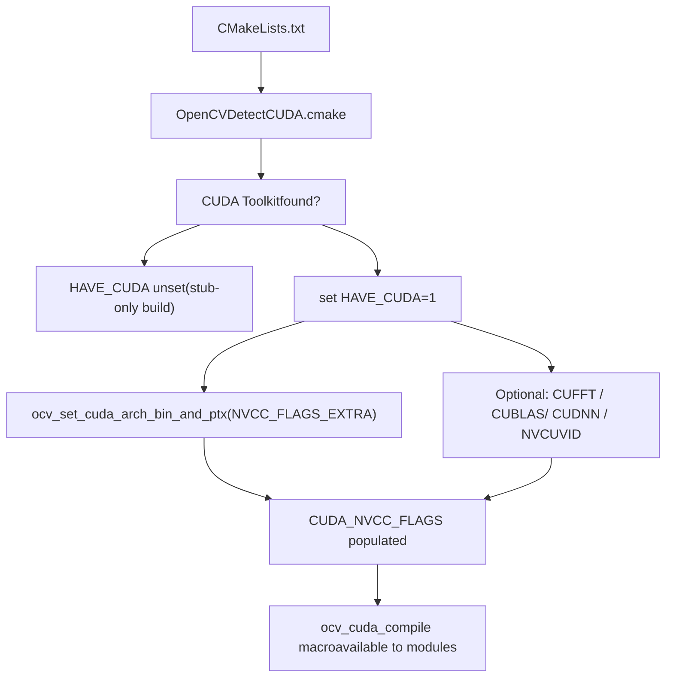
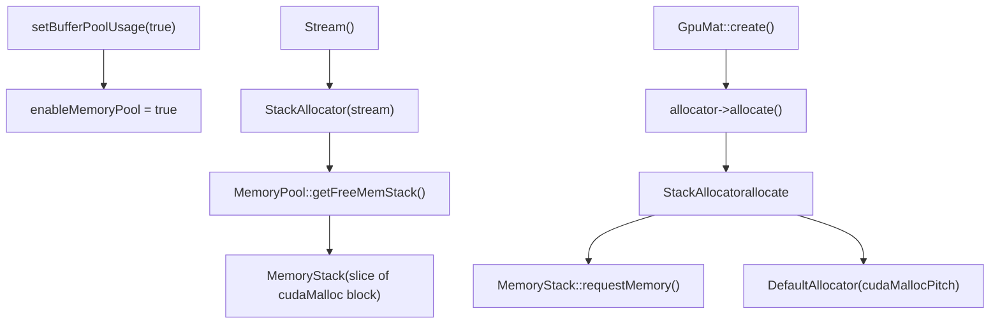
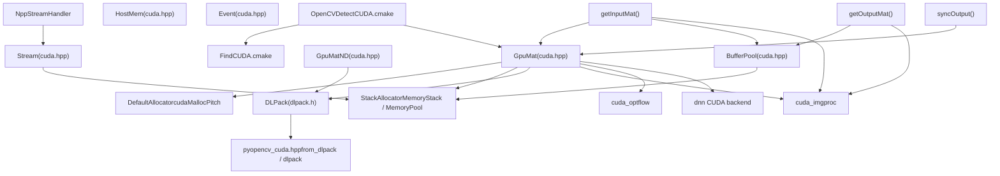

# CUDA 与 GPU 加速

相关源文件

-   [3rdparty/dlpack/LICENSE](https://github.com/opencv/opencv/blob/91c78f50/3rdparty/dlpack/LICENSE)
-   [3rdparty/dlpack/include/dlpack/dlpack.h](https://github.com/opencv/opencv/blob/91c78f50/3rdparty/dlpack/include/dlpack/dlpack.h)
-   [cmake/FindCUDA.cmake](https://github.com/opencv/opencv/blob/91c78f50/cmake/FindCUDA.cmake)
-   [cmake/FindCUDA/make2cmake.cmake](https://github.com/opencv/opencv/blob/91c78f50/cmake/FindCUDA/make2cmake.cmake)
-   [cmake/FindCUDA/parse\_cubin.cmake](https://github.com/opencv/opencv/blob/91c78f50/cmake/FindCUDA/parse_cubin.cmake)
-   [cmake/FindCUDA/run\_nvcc.cmake](https://github.com/opencv/opencv/blob/91c78f50/cmake/FindCUDA/run_nvcc.cmake)
-   [cmake/OpenCVDetectCUDA.cmake](https://github.com/opencv/opencv/blob/91c78f50/cmake/OpenCVDetectCUDA.cmake)
-   [cmake/OpenCVDetectDLPack.cmake](https://github.com/opencv/opencv/blob/91c78f50/cmake/OpenCVDetectDLPack.cmake)
-   [modules/core/include/opencv2/core/cuda.hpp](https://github.com/opencv/opencv/blob/91c78f50/modules/core/include/opencv2/core/cuda.hpp)
-   [modules/core/include/opencv2/core/cuda.inl.hpp](https://github.com/opencv/opencv/blob/91c78f50/modules/core/include/opencv2/core/cuda.inl.hpp)
-   [modules/core/include/opencv2/core/cuda/utility.hpp](https://github.com/opencv/opencv/blob/91c78f50/modules/core/include/opencv2/core/cuda/utility.hpp)
-   [modules/core/include/opencv2/core/private.cuda.hpp](https://github.com/opencv/opencv/blob/91c78f50/modules/core/include/opencv2/core/private.cuda.hpp)
-   [modules/core/misc/python/pyopencv\_core.hpp](https://github.com/opencv/opencv/blob/91c78f50/modules/core/misc/python/pyopencv_core.hpp)
-   [modules/core/misc/python/pyopencv\_cuda.hpp](https://github.com/opencv/opencv/blob/91c78f50/modules/core/misc/python/pyopencv_cuda.hpp)
-   [modules/core/perf/cuda/perf\_gpumat.cpp](https://github.com/opencv/opencv/blob/91c78f50/modules/core/perf/cuda/perf_gpumat.cpp)
-   [modules/core/src/cuda/gpu\_mat.cu](https://github.com/opencv/opencv/blob/91c78f50/modules/core/src/cuda/gpu_mat.cu)
-   [modules/core/src/cuda/gpu\_mat\_nd.cu](https://github.com/opencv/opencv/blob/91c78f50/modules/core/src/cuda/gpu_mat_nd.cu)
-   [modules/core/src/cuda\_gpu\_mat.cpp](https://github.com/opencv/opencv/blob/91c78f50/modules/core/src/cuda_gpu_mat.cpp)
-   [modules/core/src/cuda\_gpu\_mat\_nd.cpp](https://github.com/opencv/opencv/blob/91c78f50/modules/core/src/cuda_gpu_mat_nd.cpp)
-   [modules/core/src/cuda\_host\_mem.cpp](https://github.com/opencv/opencv/blob/91c78f50/modules/core/src/cuda_host_mem.cpp)
-   [modules/core/src/cuda\_stream.cpp](https://github.com/opencv/opencv/blob/91c78f50/modules/core/src/cuda_stream.cpp)
-   [modules/core/test/test\_cuda.cpp](https://github.com/opencv/opencv/blob/91c78f50/modules/core/test/test_cuda.cpp)
-   [modules/python/test/test\_cuda.py](https://github.com/opencv/opencv/blob/91c78f50/modules/python/test/test_cuda.py)

本页介绍 OpenCV 的 CUDA 支持基础设施：构建系统如何检测 CUDA、核心 GPU 数据结构（`GpuMat`、`GpuMatND`、`HostMem`）、流与事件管理、内存分配策略，以及 DLPack 互操作性。它描述了所有 GPU 加速模块所依赖的基础原语。

关于 GPU 加速图像处理函数与光流的细节，参见 [GPU-Accelerated Image Processing and Optical Flow](/opencv/opencv/14.2-gpu-accelerated-image-processing-and-optical-flow)。关于基于 OpenCL 的透明 GPU 路径（使用 `UMat` 而非 `GpuMat`），参见 [OpenCL Acceleration and Transparent GPU Execution](/opencv/opencv/3.2-opencl-acceleration-and-transparent-gpu-execution)。关于 DNN 模块的 CUDA 后端，参见 [Network Execution and Backend Selection](/opencv/opencv/5.2-network-execution-and-backend-selection)。

---

## 构建时检测

CUDA 支持由 [cmake/OpenCVDetectCUDA.cmake](https://github.com/opencv/opencv/blob/91c78f50/cmake/OpenCVDetectCUDA.cmake) 在 CMake 配置期间检测并配置。该脚本会：

1.  调用 `find_host_package(CUDA)`（使用 CMake 内置模块或 OpenCV 打补丁后的 [cmake/FindCUDA.cmake](https://github.com/opencv/opencv/blob/91c78f50/cmake/FindCUDA.cmake)）来定位 CUDA Toolkit。
2.  若找到则设置 `HAVE_CUDA 1`。
3.  探测可选库并设置对应标志：

| CMake 选项 | 功能标志 | 库 |
| --- | --- | --- |
| `WITH_CUFFT` | `HAVE_CUFFT` | `CUDA_cufft_LIBRARY` |
| `WITH_CUBLAS` | `HAVE_CUBLAS` | `CUDA_cublas_LIBRARY` |
| `WITH_CUDNN` | `HAVE_CUDNN` | `CUDNN_LIBRARIES` |
| `WITH_NVCUVID` / `WITH_NVCUVENC` | — | NVIDIA Video Codec SDK |

4.  通过 `ocv_set_cuda_arch_bin_and_ptx` 为每个目标 GPU 架构计算 `-gencode` 标志，并将结果存入 `CUDA_NVCC_FLAGS` 与 `OPENCV_CUDA_ARCH_BIN` / `OPENCV_CUDA_ARCH_PTX`。
5.  暴露 `CUDA_FAST_MATH` 选项（`--use_fast_math`）和 `CUDA_ENABLE_DELAYLOAD` 选项（仅 Windows）。

最小所需 CUDA 运行时版本在 [modules/core/include/opencv2/core/private.cuda.hpp80-84](https://github.com/opencv/opencv/blob/91c78f50/modules/core/include/opencv2/core/private.cuda.hpp#L80-L84) 中定义为 `CUDART_MINIMUM_REQUIRED_VERSION 6050`。

所有受 `#ifdef HAVE_CUDA` 保护的源文件仅在找到 Toolkit 时编译。当 CUDA 不可用时，公共 API 仍然存在，但所有方法都会调用 `throw_no_cuda()`。

**CUDA 检测流程**


Sources: [cmake/OpenCVDetectCUDA.cmake](https://github.com/opencv/opencv/blob/91c78f50/cmake/OpenCVDetectCUDA.cmake) [modules/core/include/opencv2/core/private.cuda.hpp](https://github.com/opencv/opencv/blob/91c78f50/modules/core/include/opencv2/core/private.cuda.hpp)

---

## 核心数据结构

所有 CUDA 类型都位于 `cv::cuda` 命名空间中。公开头文件是 [modules/core/include/opencv2/core/cuda.hpp](https://github.com/opencv/opencv/blob/91c78f50/modules/core/include/opencv2/core/cuda.hpp)

### GpuMat

`GpuMat` 是 `Mat` 在设备内存中的二维对应体。其布局与 `Mat` 镜像一致：

| 字段 | 类型 | 含义 |
| --- | --- | --- |
| `flags` | `int` | 魔数签名 + 类型编码 |
| `rows`, `cols` | `int` | 矩阵维度 |
| `step` | `size_t` | 以字节计的行步长（按硬件对齐） |
| `data` | `uchar*` | 指向设备内存的指针 |
| `refcount` | `int*` | 引用计数（主机侧指针） |
| `datastart`, `dataend` | `uchar*` | 用于 ROI 跟踪的范围指针 |
| `allocator` | `Allocator*` | 可插拔分配策略 |

与 `Mat` 相比的关键约束：

-   仅支持二维（不支持任意维数）。
-   由于行通过 `cudaMallocPitch` 按硬件对齐，`isContinuous()` 经常为 `false`。
-   不支持表达式模板。

**GpuMat 类关系**

Sources: [modules/core/include/opencv2/core/cuda.hpp105-377](https://github.com/opencv/opencv/blob/91c78f50/modules/core/include/opencv2/core/cuda.hpp#L105-L377) [modules/core/src/cuda/gpu\_mat.cu106-141](https://github.com/opencv/opencv/blob/91c78f50/modules/core/src/cuda/gpu_mat.cu#L106-L141) [modules/core/src/cuda\_gpu\_mat.cpp](https://github.com/opencv/opencv/blob/91c78f50/modules/core/src/cuda_gpu_mat.cpp)

#### 内存分配

默认分配器（[modules/core/src/cuda/gpu\_mat.cu107-141](https://github.com/opencv/opencv/blob/91c78f50/modules/core/src/cuda/gpu_mat.cu#L107-L141) 中的 `DefaultAllocator`）会调用：

-   对于行列都大于 1 的矩阵使用 `cudaMallocPitch`（硬件对齐行）。
-   对于单行或单列矩阵使用 `cudaMalloc`（始终连续）。

可通过 `GpuMat::setDefaultAllocator(Allocator*)` 在进程范围设置自定义分配器，或在构造函数中传入 `Allocator*` 进行实例级设置。

#### 上传与下载

既有阻塞式，也有非阻塞（基于流）版本：

| 方法 | 方向 | 同步性 |
| --- | --- | --- |
| `upload(InputArray)` | CPU → GPU | 阻塞（`cudaMemcpy2D`） |
| `upload(InputArray, Stream&)` | CPU → GPU | 非阻塞（`cudaMemcpy2DAsync`） |
| `download(OutputArray)` | GPU → CPU | 阻塞 |
| `download(OutputArray, Stream&)` | GPU → CPU | 非阻塞 |

实现位于 [modules/core/src/cuda/gpu\_mat.cu222-267](https://github.com/opencv/opencv/blob/91c78f50/modules/core/src/cuda/gpu_mat.cu#L222-L267)

### GpuMatND

`GpuMatND` 将 GPU 存储扩展到 N 维。定义见 [modules/core/include/opencv2/core/cuda.hpp394-581](https://github.com/opencv/opencv/blob/91c78f50/modules/core/include/opencv2/core/cuda.hpp#L394-L581)。内存通过 `std::shared_ptr<GpuData>` 管理（带引用计数的设备分配）。子矩阵通过 `offset` 字段跟踪。`createGpuMatHeader()` 方法返回二维切片的非拥有型 `GpuMat` 视图，不进行拷贝。

### HostMem

`HostMem` 通过 `cudaHostAlloc` 封装 CUDA 特殊主机内存类型。支持三种分配类型：

| 枚举 | CUDA 标志 | 使用场景 |
| --- | --- | --- |
| `PAGE_LOCKED` | `cudaHostAllocDefault` | 快速异步传输 |
| `SHARED` | `cudaHostAllocMapped` | 集成 GPU 的零拷贝 |
| `WRITE_COMBINED` | `cudaHostAllocWriteCombined` | GPU 只读上传缓冲区 |

`SHARED` 内存可通过 `HostMem::createGpuMatHeader()` 映射到 GPU 地址空间，该方法会调用 `cudaHostGetDevicePointer`（[modules/core/src/cuda\_host\_mem.cpp303-315](https://github.com/opencv/opencv/blob/91c78f50/modules/core/src/cuda_host_mem.cpp#L303-L315)）。

对于已有的 `Mat` 分配，`registerPageLocked(Mat&)` / `unregisterPageLocked(Mat&)` 会调用 `cudaHostRegister` / `cudaHostUnregister`。

Sources: [modules/core/include/opencv2/core/cuda.hpp798-857](https://github.com/opencv/opencv/blob/91c78f50/modules/core/include/opencv2/core/cuda.hpp#L798-L857) [modules/core/src/cuda\_host\_mem.cpp](https://github.com/opencv/opencv/blob/91c78f50/modules/core/src/cuda_host_mem.cpp)

---

## 流与事件管理

### Stream

`cv::cuda::Stream` 封装 `cudaStream_t`。其内部实现是 [modules/core/src/cuda\_stream.cpp287-337](https://github.com/opencv/opencv/blob/91c78f50/modules/core/src/cuda_stream.cpp#L287-L337) 中的 `Stream::Impl`。

关键方法：

| 方法 | 行为 |
| --- | --- |
| `Stream()` | 创建新的 `cudaStream_t`，并关联一个 `StackAllocator` |
| `Stream(size_t cudaFlags)` | 使用 `cudaStreamCreateWithFlags` 创建（如 `cudaStreamNonBlocking`） |
| `queryIfComplete()` | 通过 `cudaStreamQuery` 进行非阻塞轮询 |
| `waitForCompletion()` | 通过 `cudaStreamSynchronize` 进行阻塞同步 |
| `waitEvent(Event&)` | 调用 `cudaStreamWaitEvent` |
| `enqueueHostCallback(callback, data)` | 通过 `cudaStreamAddCallback` 安排主机回调 |
| `Stream::Null()` | 返回按设备划分的空（默认）流 |
| `cudaPtr()` | 以 `void*` 形式返回原始 `cudaStream_t` |

[modules/core/src/cuda\_stream.cpp577-586](https://github.com/opencv/opencv/blob/91c78f50/modules/core/src/cuda_stream.cpp#L577-L586) 中的 `StreamAccessor::getStream(Stream&)` 和 `StreamAccessor::wrapStream(cudaStream_t)` 允许 OpenCV 模块内部的 C++ 代码跨越抽象边界。

### Event

`cv::cuda::Event` 封装 `cudaEvent_t`。定义在 [modules/core/include/opencv2/core/cuda.hpp](https://github.com/opencv/opencv/blob/91c78f50/modules/core/include/opencv2/core/cuda.hpp)，实现于 [modules/core/src/cuda\_stream.cpp769-878](https://github.com/opencv/opencv/blob/91c78f50/modules/core/src/cuda_stream.cpp#L769-L878)

| 方法 | CUDA 调用 |
| --- | --- |
| `record(Stream&)` | `cudaEventRecord` |
| `queryIfComplete()` | `cudaEventQuery` |
| `waitForCompletion()` | `cudaEventSynchronize` |
| `Event::elapsedTime(start, end)` | `cudaEventElapsedTime` |

`EventAccessor` 提供与 `StreamAccessor` 相同的跨边界访问模式。

Sources: [modules/core/src/cuda\_stream.cpp](https://github.com/opencv/opencv/blob/91c78f50/modules/core/src/cuda_stream.cpp) [modules/core/include/opencv2/core/cuda.hpp](https://github.com/opencv/opencv/blob/91c78f50/modules/core/include/opencv2/core/cuda.hpp)

---

## 内存池与 BufferPool

### StackAllocator 与 MemoryPool

当调用 `setBufferPoolUsage(true)` 时，每个 `Stream` 都会获得一个 `StackAllocator`，其后端是从按设备划分的 `MemoryPool` 中获取的 `MemoryStack`。该池预先分配为单个连续的 `cudaMalloc` 块，并划分为多个栈。


默认配置（每设备）：每个栈 10 MB，共 5 个栈。可通过 `setBufferPoolConfig(deviceId, stackSize, stackCount)` 覆盖。

**释放规则：**`StackAllocator` 强制 LIFO 顺序。在调试构建中，乱序释放会触发 `CV_Assert` 失败（[modules/core/src/cuda\_stream.cpp98-109](https://github.com/opencv/opencv/blob/91c78f50/modules/core/src/cuda_stream.cpp#L98-L109)）。

### BufferPool

`BufferPool` 是该池面向用户的 API。它绑定到某个 `Stream`，并返回由该流 `StackAllocator` 支持的 `GpuMat` 实例：

```
// Conceptual usage (from cuda.hpp documentation)setBufferPoolUsage(true);setBufferPoolConfig(getDevice(), 1024 * 1024 * 64, 2); // 64 MB, 2 stacksStream stream1;BufferPool pool1(stream1);GpuMat d_src = pool1.getBuffer(4096, 4096, CV_8UC1);
```
`BufferPool::getBuffer` 在内部会对使用该流分配器构造的 `GpuMat` 调用 `GpuMat::create`（[modules/core/src/cuda\_stream.cpp751-763](https://github.com/opencv/opencv/blob/91c78f50/modules/core/src/cuda_stream.cpp#L751-L763)）。

Sources: [modules/core/src/cuda\_stream.cpp](https://github.com/opencv/opencv/blob/91c78f50/modules/core/src/cuda_stream.cpp) [modules/core/include/opencv2/core/cuda.hpp630-776](https://github.com/opencv/opencv/blob/91c78f50/modules/core/include/opencv2/core/cuda.hpp#L630-L776)

---

## 内部辅助函数

[modules/core/include/opencv2/core/private.cuda.hpp](https://github.com/opencv/opencv/blob/91c78f50/modules/core/include/opencv2/core/private.cuda.hpp) 为 CUDA 模块实现提供内部工具：

| 符号 | 用途 |
| --- | --- |
| `getInputMat(InputArray, Stream&)` | 返回 `GpuMat`；若输入尚不在 GPU 上，则通过 `BufferPool` 上传 |
| `getOutputMat(OutputArray, rows, cols, type, Stream&)` | 返回 `GpuMat` 输出；若输出不是 `GpuMat`，则使用 `BufferPool` |
| `syncOutput(const GpuMat&, OutputArray, Stream&)` | 若 `OutputArray` 不是 `GpuMat`，则将结果下载回 CPU |
| `NppStreamHandler` | 设置/恢复 NPP 流上下文的 RAII 封装 |
| `NPPTypeTraits<N>` | 将 OpenCV 深度常量映射到 NPP 像素类型 |
| `nppSafeCall(expr)` | 检查 NPP 返回码并在错误时抛出异常 |
| `cuSafeCall(expr)` | 检查 CUDA Driver API 返回码并在错误时抛出异常 |

`NppStreamHandler` 的行为取决于 NPP 版本：对于 NPP ≥ 12205（CUDA 12.4+）使用 `NppStreamContext` API；对于旧版本使用全局 `nppSetStream` / `nppGetStream` 机制（[modules/core/include/opencv2/core/private.cuda.hpp133-201](https://github.com/opencv/opencv/blob/91c78f50/modules/core/include/opencv2/core/private.cuda.hpp#L133-L201)）。

Sources: [modules/core/include/opencv2/core/private.cuda.hpp](https://github.com/opencv/opencv/blob/91c78f50/modules/core/include/opencv2/core/private.cuda.hpp) [modules/core/src/cuda\_gpu\_mat.cpp345-408](https://github.com/opencv/opencv/blob/91c78f50/modules/core/src/cuda_gpu_mat.cpp#L345-L408)

---

## DLPack 互操作性

OpenCV 支持 DLPack 张量交换协议，允许 `GpuMat` 与 `GpuMatND` 与其他同样支持 DLPack 的框架（如 PyTorch、TensorFlow）进行零拷贝共享。

DLPack 头文件可使用打包版本 [3rdparty/dlpack/include/dlpack/dlpack.h](https://github.com/opencv/opencv/blob/91c78f50/3rdparty/dlpack/include/dlpack/dlpack.h)（Apache 2.0 许可证），或通过 `find_package(dlpack)` 查找（[cmake/OpenCVDetectDLPack.cmake](https://github.com/opencv/opencv/blob/91c78f50/cmake/OpenCVDetectDLPack.cmake)）。

**Python 绑定接线** 位于 [modules/core/misc/python/pyopencv\_cuda.hpp](https://github.com/opencv/opencv/blob/91c78f50/modules/core/misc/python/pyopencv_cuda.hpp)。关键函数：

| 函数 | 方向 | 说明 |
| --- | --- | --- |
| `fillDLPackTensor<GpuMat>` | `GpuMat` → `DLManagedTensor` | 设置 `kDLCUDA` 设备类型，并将 `step1()` 映射为 strides |
| `fillDLPackTensor<GpuMatND>` | `GpuMatND` → `DLManagedTensor` | 处理 N 维 shape 与 strides |
| `parseDLPackTensor<GpuMat>` | `DLManagedTensor` → `GpuMat` | 校验 3D、CUDA 设备、连续通道步长 |
| `parseDLPackTensor<GpuMatND>` | `DLManagedTensor` → `GpuMatND` | 封装 N 维外部内存 |

在 Python 中，该协议通过 `cuda_GpuMat.__dlpack__` 和 `cuda_GpuMat.from_dlpack` 暴露。测试位于 [modules/python/test/test\_cuda.py146-157](https://github.com/opencv/opencv/blob/91c78f50/modules/python/test/test_cuda.py#L146-L157)

DLPack `DLDataType` 与 OpenCV 深度代码之间的类型映射：

| DLPack code | bits | OpenCV depth |
| --- | --- | --- |
| `kDLUInt` | 8 | `CV_8U` |
| `kDLUInt` | 16 | `CV_16U` |
| `kDLInt` | 8 | `CV_8S` |
| `kDLInt` | 16 | `CV_16S` |
| `kDLInt` | 32 | `CV_32S` |
| `kDLFloat` | 16 | `CV_16F` |
| `kDLFloat` | 32 | `CV_32F` |
| `kDLFloat` | 64 | `CV_64F` |

Sources: [modules/core/misc/python/pyopencv\_cuda.hpp](https://github.com/opencv/opencv/blob/91c78f50/modules/core/misc/python/pyopencv_cuda.hpp) [modules/core/misc/python/pyopencv\_core.hpp](https://github.com/opencv/opencv/blob/91c78f50/modules/core/misc/python/pyopencv_core.hpp) [cmake/OpenCVDetectDLPack.cmake](https://github.com/opencv/opencv/blob/91c78f50/cmake/OpenCVDetectDLPack.cmake)

---

## 模块架构总览

**CUDA 基础设施组件如何连接**


Sources: [modules/core/include/opencv2/core/cuda.hpp](https://github.com/opencv/opencv/blob/91c78f50/modules/core/include/opencv2/core/cuda.hpp) [modules/core/include/opencv2/core/private.cuda.hpp](https://github.com/opencv/opencv/blob/91c78f50/modules/core/include/opencv2/core/private.cuda.hpp) [cmake/OpenCVDetectCUDA.cmake](https://github.com/opencv/opencv/blob/91c78f50/cmake/OpenCVDetectCUDA.cmake) [modules/core/src/cuda\_stream.cpp](https://github.com/opencv/opencv/blob/91c78f50/modules/core/src/cuda_stream.cpp) [modules/core/src/cuda/gpu\_mat.cu](https://github.com/opencv/opencv/blob/91c78f50/modules/core/src/cuda/gpu_mat.cu)

---

## Python API 摘要

Python 绑定从 `cv.cuda` 暴露以下类型与工具：

| Python 名称 | C++ 类型 |
| --- | --- |
| `cv.cuda_GpuMat` | `cv::cuda::GpuMat` |
| `cv.cuda_GpuMatND` | `cv::cuda::GpuMatND` |
| `cv.cuda_Stream` | `cv::cuda::Stream` |
| `cv.cuda_Event` | `cv::cuda::Event` |
| `cv.cuda.HostMem` | `cv::cuda::HostMem` |
| `cv.cuda.BufferPool` | `cv::cuda::BufferPool` |
| `cv.cuda.setBufferPoolUsage(bool)` | `cv::cuda::setBufferPoolUsage` |
| `cv.cuda.setBufferPoolConfig(id, size, count)` | `cv::cuda::setBufferPoolConfig` |
| `cv.cuda.createGpuMatFromCudaMemory(...)` | `cv::cuda::createGpuMatFromCudaMemory` |
| `cv.cuda.wrapStream(ptr)` | `cv::cuda::wrapStream` |
| `cv.cuda.getCudaEnabledDeviceCount()` | `cv::cuda::getCudaEnabledDeviceCount` |

覆盖上传/下载、基于流的异步传输、缓冲池、DLPack，以及 `convertTo`/`copyTo` 的测试位于 [modules/python/test/test\_cuda.py](https://github.com/opencv/opencv/blob/91c78f50/modules/python/test/test_cuda.py)

Sources: [modules/python/test/test\_cuda.py](https://github.com/opencv/opencv/blob/91c78f50/modules/python/test/test_cuda.py) [modules/core/misc/python/pyopencv\_cuda.hpp](https://github.com/opencv/opencv/blob/91c78f50/modules/core/misc/python/pyopencv_cuda.hpp)
