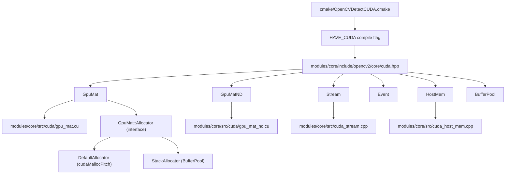
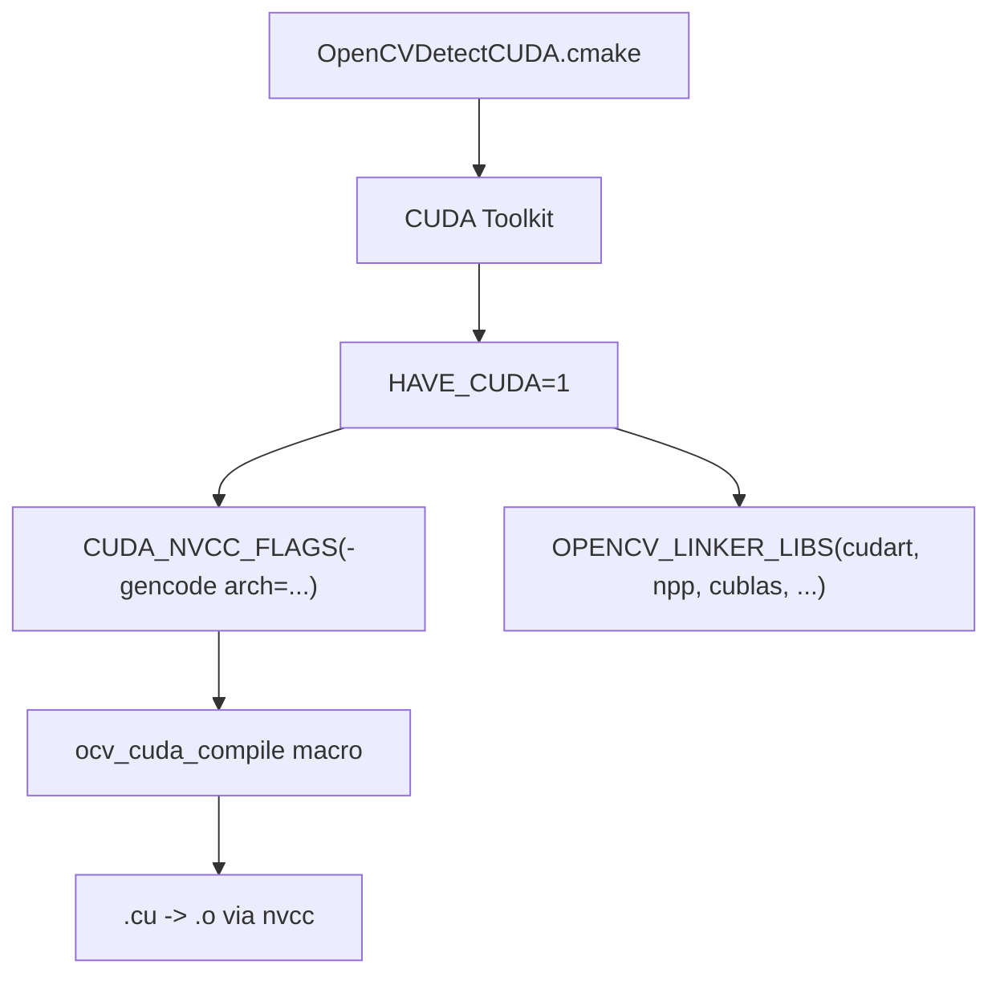
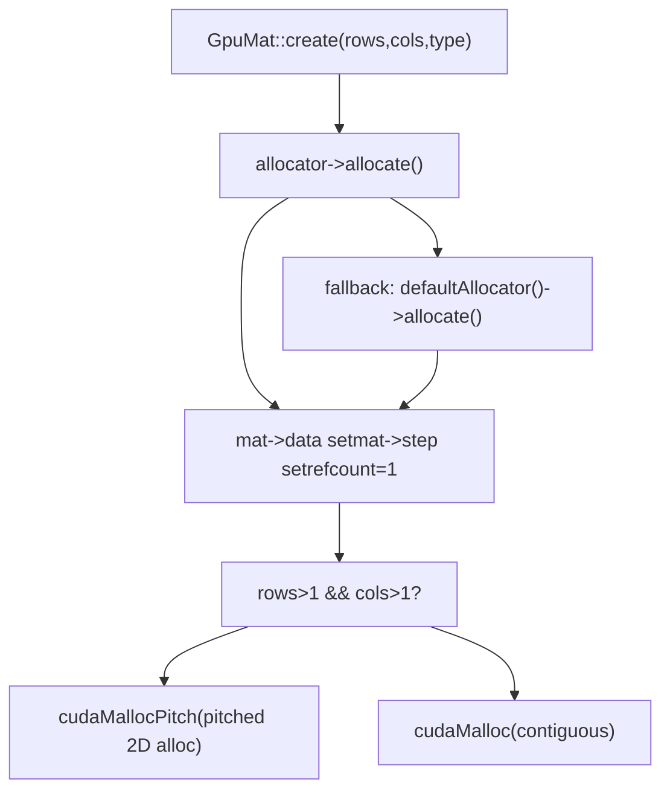
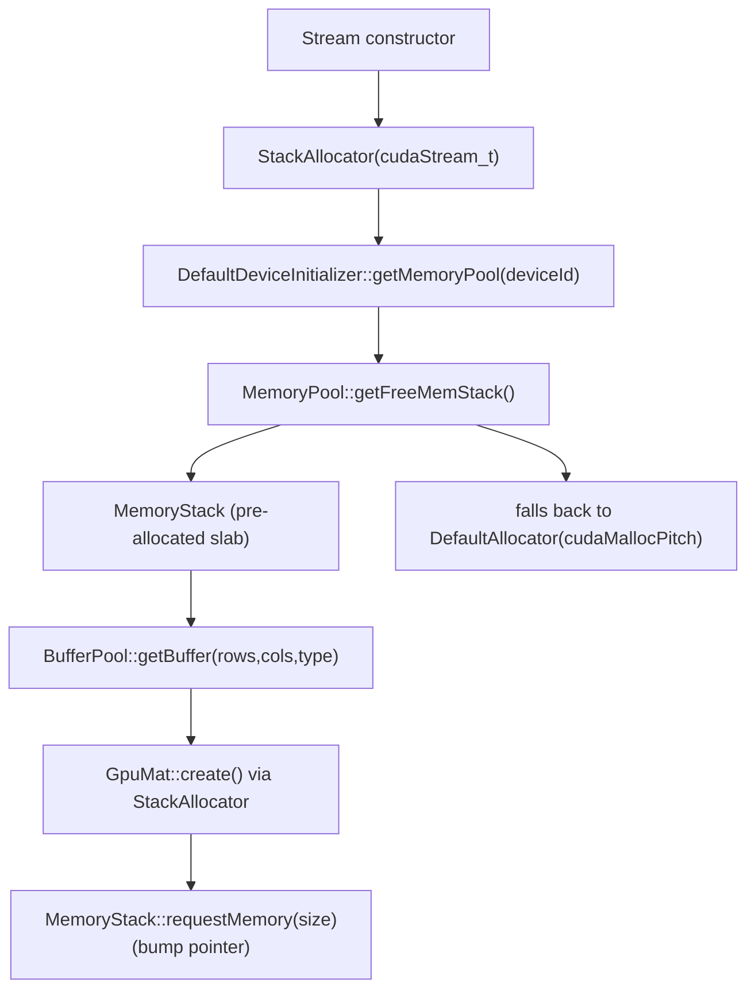

# GpuMat 与 CUDA 运行时集成

相关源文件

-   [3rdparty/dlpack/LICENSE](https://github.com/opencv/opencv/blob/91c78f50/3rdparty/dlpack/LICENSE)
-   [3rdparty/dlpack/include/dlpack/dlpack.h](https://github.com/opencv/opencv/blob/91c78f50/3rdparty/dlpack/include/dlpack/dlpack.h)
-   [cmake/FindCUDA.cmake](https://github.com/opencv/opencv/blob/91c78f50/cmake/FindCUDA.cmake)
-   [cmake/FindCUDA/make2cmake.cmake](https://github.com/opencv/opencv/blob/91c78f50/cmake/FindCUDA/make2cmake.cmake)
-   [cmake/FindCUDA/parse\_cubin.cmake](https://github.com/opencv/opencv/blob/91c78f50/cmake/FindCUDA/parse_cubin.cmake)
-   [cmake/FindCUDA/run\_nvcc.cmake](https://github.com/opencv/opencv/blob/91c78f50/cmake/FindCUDA/run_nvcc.cmake)
-   [cmake/OpenCVDetectCUDA.cmake](https://github.com/opencv/opencv/blob/91c78f50/cmake/OpenCVDetectCUDA.cmake)
-   [cmake/OpenCVDetectDLPack.cmake](https://github.com/opencv/opencv/blob/91c78f50/cmake/OpenCVDetectDLPack.cmake)
-   [modules/core/include/opencv2/core/cuda.hpp](https://github.com/opencv/opencv/blob/91c78f50/modules/core/include/opencv2/core/cuda.hpp)
-   [modules/core/include/opencv2/core/cuda.inl.hpp](https://github.com/opencv/opencv/blob/91c78f50/modules/core/include/opencv2/core/cuda.inl.hpp)
-   [modules/core/include/opencv2/core/cuda/utility.hpp](https://github.com/opencv/opencv/blob/91c78f50/modules/core/include/opencv2/core/cuda/utility.hpp)
-   [modules/core/include/opencv2/core/private.cuda.hpp](https://github.com/opencv/opencv/blob/91c78f50/modules/core/include/opencv2/core/private.cuda.hpp)
-   [modules/core/misc/python/pyopencv\_core.hpp](https://github.com/opencv/opencv/blob/91c78f50/modules/core/misc/python/pyopencv_core.hpp)
-   [modules/core/misc/python/pyopencv\_cuda.hpp](https://github.com/opencv/opencv/blob/91c78f50/modules/core/misc/python/pyopencv_cuda.hpp)
-   [modules/core/perf/cuda/perf\_gpumat.cpp](https://github.com/opencv/opencv/blob/91c78f50/modules/core/perf/cuda/perf_gpumat.cpp)
-   [modules/core/src/cuda/gpu\_mat.cu](https://github.com/opencv/opencv/blob/91c78f50/modules/core/src/cuda/gpu_mat.cu)
-   [modules/core/src/cuda/gpu\_mat\_nd.cu](https://github.com/opencv/opencv/blob/91c78f50/modules/core/src/cuda/gpu_mat_nd.cu)
-   [modules/core/src/cuda\_gpu\_mat.cpp](https://github.com/opencv/opencv/blob/91c78f50/modules/core/src/cuda_gpu_mat.cpp)
-   [modules/core/src/cuda\_gpu\_mat\_nd.cpp](https://github.com/opencv/opencv/blob/91c78f50/modules/core/src/cuda_gpu_mat_nd.cpp)
-   [modules/core/src/cuda\_host\_mem.cpp](https://github.com/opencv/opencv/blob/91c78f50/modules/core/src/cuda_host_mem.cpp)
-   [modules/core/src/cuda\_stream.cpp](https://github.com/opencv/opencv/blob/91c78f50/modules/core/src/cuda_stream.cpp)
-   [modules/core/test/test\_cuda.cpp](https://github.com/opencv/opencv/blob/91c78f50/modules/core/test/test_cuda.cpp)
-   [modules/python/test/test\_cuda.py](https://github.com/opencv/opencv/blob/91c78f50/modules/python/test/test_cuda.py)

本页记录 OpenCV 中的 GPU 内存管理层：`GpuMat` 和 `GpuMatND` 类、CUDA 流与事件抽象、主机侧页锁定内存管理、缓冲池系统、DLPack 张量互操作，以及 CMake 层面的 CUDA 检测机制。关于构建在这些原语之上的 GPU 加速图像处理算法，参见 [GPU-Accelerated Image Processing and Optical Flow](/opencv/opencv/14.2-gpu-accelerated-image-processing-and-optical-flow)。关于对应的 OpenCL/CPU 透明加速路径，参见 [OpenCL Acceleration and Transparent GPU Execution](/opencv/opencv/3.2-opencl-acceleration-and-transparent-gpu-execution)。

---

## 架构概览

OpenCV 的 CUDA 集成分为三层：CMake 构建检测、`opencv_core` 中的 C++ 运行时 API，以及 `opencv_cudev`/`opencv_cuda*` 模块中的 GPU 内核实现。

**图：CUDA 集成层次**


Sources: [cmake/OpenCVDetectCUDA.cmake1-255](https://github.com/opencv/opencv/blob/91c78f50/cmake/OpenCVDetectCUDA.cmake#L1-L255) [modules/core/include/opencv2/core/cuda.hpp65-880](https://github.com/opencv/opencv/blob/91c78f50/modules/core/include/opencv2/core/cuda.hpp#L65-L880) [modules/core/src/cuda/gpu\_mat.cu1-100](https://github.com/opencv/opencv/blob/91c78f50/modules/core/src/cuda/gpu_mat.cu#L1-L100) [modules/core/src/cuda\_stream.cpp1-100](https://github.com/opencv/opencv/blob/91c78f50/modules/core/src/cuda_stream.cpp#L1-L100)

---

## 构建时 CUDA 检测（`OpenCVDetectCUDA.cmake`）

文件 [cmake/OpenCVDetectCUDA.cmake](https://github.com/opencv/opencv/blob/91c78f50/cmake/OpenCVDetectCUDA.cmake) 是启用 CUDA 支持的入口。它会：

1.  调用 `find_host_package(CUDA ...)` 以定位 CUDA Toolkit（通过 CMake 内置模块，或在旧版 CMake 上使用 OpenCV 打补丁的 `FindCUDA.cmake`）。
2.  找到兼容 Toolkit 时设置 `HAVE_CUDA 1`。
3.  检测可选组件并设置对应标志：

| CMake 选项 | 结果标志 | 库 |
| --- | --- | --- |
| `WITH_CUFFT` | `HAVE_CUFFT` | `CUDA_cufft_LIBRARY` |
| `WITH_CUBLAS` | `HAVE_CUBLAS` | `CUDA_cublas_LIBRARY` |
| `WITH_CUDNN` | `HAVE_CUDNN` | `CUDNN_LIBRARIES` |
| `WITH_NVCUVID` / `WITH_NVCUVENC` | — | NVIDIA Video Codec SDK |

4.  通过 `ocv_set_cuda_arch_bin_and_ptx` 决定目标 GPU 架构，并将 `-gencode arch=compute_XX,code=sm_XX` 标志写入 `CUDA_NVCC_FLAGS`。
5.  定义 `ocv_cuda_compile` 宏，供各模块 `CMakeLists.txt` 在编译 `.cu` 源码时使用。

最小所需 CUDA 运行时版本在 [modules/core/include/opencv2/core/private.cuda.hpp80-84](https://github.com/opencv/opencv/blob/91c78f50/modules/core/include/opencv2/core/private.cuda.hpp#L80-L84) 中以 `CUDART_MINIMUM_REQUIRED_VERSION 6050` 强制执行。

**图：CUDA 检测与标志传播**


Sources: [cmake/OpenCVDetectCUDA.cmake1-255](https://github.com/opencv/opencv/blob/91c78f50/cmake/OpenCVDetectCUDA.cmake#L1-L255) [modules/core/include/opencv2/core/private.cuda.hpp59-86](https://github.com/opencv/opencv/blob/91c78f50/modules/core/include/opencv2/core/private.cuda.hpp#L59-L86)

---

## `GpuMat`：主要 GPU 矩阵类

`GpuMat` 是在 [modules/core/include/opencv2/core/cuda.hpp105-377](https://github.com/opencv/opencv/blob/91c78f50/modules/core/include/opencv2/core/cuda.hpp#L105-L377) 中声明的二维 GPU 内存容器。它与 `Mat` API 对应，但有以下关键差异：

-   **仅二维** —— 不支持任意维。
-   **行填充** —— `isContinuous()` 通常为 `false`；行通过 `cudaMallocPitch` 按硬件边界对齐。
-   **无表达式模板** —— 对 `GpuMat` 的算术操作会触发实际分配和内核启动。
-   **阻塞与非阻塞** —— 大多数操作既有同步重载，也有用于异步执行的 `Stream&` 重载。

### 内存布局字段

| 字段 | 类型 | 描述 |
| --- | --- | --- |
| `data` | `uchar*` | 指向设备内存的指针 |
| `step` | `size_t` | 每行字节数（含填充） |
| `rows`, `cols` | `int` | 矩阵维度 |
| `flags` | `int` | 编码类型、深度、通道数、连续性 |
| `refcount` | `int*` | 引用计数器（主机侧） |
| `datastart`, `dataend` | `uchar*` / `const uchar*` | 父分配的边界 |
| `allocator` | `Allocator*` | 内存管理策略对象 |

### 关键操作

| 方法 | 传输 | 说明 |
| --- | --- | --- |
| `upload(InputArray)` | 主机 → 设备 | 阻塞；调用 `cudaMemcpy2D` |
| `upload(InputArray, Stream&)` | 主机 → 设备 | 非阻塞；调用 `cudaMemcpy2DAsync` |
| `download(OutputArray)` | 设备 → 主机 | 阻塞 |
| `download(OutputArray, Stream&)` | 设备 → 主机 | 非阻塞 |
| `copyTo(OutputArray)` | 设备 → 设备 | 阻塞；`cudaMemcpy2D` |
| `copyTo(OutputArray, Stream&)` | 设备 → 设备 | 非阻塞 |
| `setTo(Scalar, Stream&)` | — | 对零值/均匀填充使用 `cudaMemset2DAsync` |
| `convertTo(OutputArray, int, Stream&)` | — | 类型转换；通过 cudev 网格变换派发 |
| `clone()` | — | 返回深拷贝 |
| `cudaPtr()` | — | 以 `void*` 返回原始设备指针 |

Sources: [modules/core/include/opencv2/core/cuda.hpp105-377](https://github.com/opencv/opencv/blob/91c78f50/modules/core/include/opencv2/core/cuda.hpp#L105-L377) [modules/core/src/cuda/gpu\_mat.cu160-603](https://github.com/opencv/opencv/blob/91c78f50/modules/core/src/cuda/gpu_mat.cu#L160-L603) [modules/core/src/cuda\_gpu\_mat.cpp49-343](https://github.com/opencv/opencv/blob/91c78f50/modules/core/src/cuda_gpu_mat.cpp#L49-L343)

### 分配器接口

`GpuMat::Allocator` 是一个纯虚接口，包含两个方法：

```
virtual bool allocate(GpuMat* mat, int rows, int cols, size_t elemSize) = 0;
virtual void free(GpuMat* mat) = 0;
```
默认实现（`DefaultAllocator`）定义于 [modules/core/src/cuda/gpu\_mat.cu107-141](https://github.com/opencv/opencv/blob/91c78f50/modules/core/src/cuda/gpu_mat.cu#L107-L141)。它对二维矩阵调用 `cudaMallocPitch`，对单行/单列矩阵调用 `cudaMalloc`。当前活动默认值存储在 `g_defaultAllocator` 中，并可通过 `GpuMat::setDefaultAllocator` 全局替换。

**图：`GpuMat` 内存分配路径**


Sources: [modules/core/src/cuda/gpu\_mat.cu107-201](https://github.com/opencv/opencv/blob/91c78f50/modules/core/src/cuda/gpu_mat.cu#L107-L201)

### 子矩阵与 ROI 视图

`GpuMat` 通过接收 `Range` 或 `Rect` 参数的构造函数，以及 `row()`、`col()`、`rowRange()`、`colRange()` 和 `operator()`，支持零拷贝子矩阵视图。这些视图共享同一设备指针并递增 `refcount`。`locateROI` 和 `adjustROI` 方法用于在父分配内导航。实现位于 [modules/core/src/cuda\_gpu\_mat.cpp104-254](https://github.com/opencv/opencv/blob/91c78f50/modules/core/src/cuda_gpu_mat.cpp#L104-L254)

### 封装外部 GPU 内存

两个自由函数可在外部分配的设备内存上创建 `GpuMat` 头（不拥有内存，因此无 `refcount`）：

-   `GpuMat(int rows, int cols, int type, void* data, size_t step)` —— 构造函数
-   `createGpuMatFromCudaMemory(...)` —— 对 Python 绑定友好的封装，定义于 [modules/core/include/opencv2/core/cuda.hpp615-628](https://github.com/opencv/opencv/blob/91c78f50/modules/core/include/opencv2/core/cuda.hpp#L615-L628)

---

## `GpuMatND`：N 维 GPU 数组

`GpuMatND` 定义于 [modules/core/include/opencv2/core/cuda.hpp394-581](https://github.com/opencv/opencv/blob/91c78f50/modules/core/include/opencv2/core/cuda.hpp#L394-L581)，支持 GPU 上的任意维度。它使用 `std::shared_ptr<GpuData>` 进行引用计数内存管理，而不是原始 `int* refcount`。

`GpuData`（[modules/core/include/opencv2/core/cuda.hpp379-392](https://github.com/opencv/opencv/blob/91c78f50/modules/core/include/opencv2/core/cuda.hpp#L379-L392)）是一个轻量 RAII 封装：其构造函数调用 `cudaMalloc`，析构函数调用 `cudaFree`（[modules/core/src/cuda/gpu\_mat\_nd.cu19-28](https://github.com/opencv/opencv/blob/91c78f50/modules/core/src/cuda/gpu_mat_nd.cu#L19-L28)）。

### 与 `GpuMat` 的关键差异

| 方面 | `GpuMat` | `GpuMatND` |
| --- | --- | --- |
| 维度 | 仅二维 | N 维 |
| 内存管理 | `int* refcount` + `Allocator` | `shared_ptr<GpuData>` |
| 外部内存 | `refcount == nullptr` | `data_` 为空，`external()` 返回 true |
| 子矩阵 | `datastart`/`dataend` + `adjustROI` | `offset` 字段，`SUBMATRIX_FLAG` |
| 2D 互操作 | — | `createGpuMatHeader()`，`operator GpuMat()` |

### 获取二维视图

`GpuMatND::createGpuMatHeader()` 在数组有效为 2D 时返回指向 N 维数据的 `GpuMat` 头（无引用计数）。`GpuMatND::operator GpuMat()` 会克隆数据。实现位于 [modules/core/src/cuda\_gpu\_mat\_nd.cpp49-84](https://github.com/opencv/opencv/blob/91c78f50/modules/core/src/cuda_gpu_mat_nd.cpp#L49-L84)

Sources: [modules/core/include/opencv2/core/cuda.hpp379-581](https://github.com/opencv/opencv/blob/91c78f50/modules/core/include/opencv2/core/cuda.hpp#L379-L581) [modules/core/src/cuda/gpu\_mat\_nd.cu19-170](https://github.com/opencv/opencv/blob/91c78f50/modules/core/src/cuda/gpu_mat_nd.cu#L19-L170) [modules/core/src/cuda\_gpu\_mat\_nd.cpp1-119](https://github.com/opencv/opencv/blob/91c78f50/modules/core/src/cuda_gpu_mat_nd.cpp#L1-L119)

---

## CUDA 流与事件管理

### `Stream`

`Stream` 通过定义于 [modules/core/src/cuda\_stream.cpp287-338](https://github.com/opencv/opencv/blob/91c78f50/modules/core/src/cuda_stream.cpp#L287-L338) 的内部 `Stream::Impl` 类封装 `cudaStream_t`。每个 `Stream` 拥有一个 `cudaStream_t`（由 `cudaStreamCreate` 创建）和一个 `Ptr<GpuMat::Allocator>`（默认是 `StackAllocator`）。

构造函数：

| 构造函数 | 行为 |
| --- | --- |
| `Stream()` | 调用 `cudaStreamCreate`，附加 `StackAllocator` |
| `Stream(Ptr<GpuMat::Allocator>)` | 使用自定义分配器，仍会创建 stream |
| `Stream(size_t cudaFlags)` | 将标志传给 `cudaStreamCreateWithFlags`（如 `cudaStreamNonBlocking`） |

关键方法：

-   `waitForCompletion()` —— 调用 `cudaStreamSynchronize`
-   `queryIfComplete()` —— 调用 `cudaStreamQuery`
-   `waitEvent(Event&)` —— 调用 `cudaStreamWaitEvent`
-   `enqueueHostCallback(callback, userData)` —— 调用 `cudaStreamAddCallback`
-   `cudaPtr()` —— 以 `void*` 暴露底层 `cudaStream_t`
-   `Stream::Null()` —— 返回按设备划分的空流（设备全局默认流）

`StreamAccessor::getStream(Stream&)` 和 `StreamAccessor::wrapStream(cudaStream_t)` 提供 OpenCV `Stream` 类型与原始 CUDA stream 句柄之间的桥接，供所有 CUDA 加速函数内部使用。

`wrapStream(size_t cudaStreamMemoryAddress)` 提供 Python 友好的绑定层封装（[modules/core/src/cuda\_stream.cpp589-596](https://github.com/opencv/opencv/blob/91c78f50/modules/core/src/cuda_stream.cpp#L589-L596)）。

### `Event`

`Event` 通过 `Event::Impl` 封装 `cudaEvent_t`。由 `cudaEventCreateWithFlags` 创建。支持：

-   `record(Stream&)` —— `cudaEventRecord`
-   `queryIfComplete()` —— `cudaEventQuery`
-   `waitForCompletion()` —— `cudaEventSynchronize`
-   `Event::elapsedTime(start, end)` —— `cudaEventElapsedTime`，返回毫秒

`EventAccessor::getEvent` 和 `EventAccessor::wrapEvent` 是 `StreamAccessor` 的事件对应实现，供内部使用。

**图：Stream/Event 对象层级**


Sources: [modules/core/src/cuda\_stream.cpp265-879](https://github.com/opencv/opencv/blob/91c78f50/modules/core/src/cuda_stream.cpp#L265-L879) [modules/core/include/opencv2/core/cuda.hpp880-1100](https://github.com/opencv/opencv/blob/91c78f50/modules/core/include/opencv2/core/cuda.hpp#L880-L1100)

---

## 主机内存（`HostMem`）

`HostMem` 通过 CUDA 特殊分配器分配 CPU 侧内存，以实现更快传输。声明于 [modules/core/include/opencv2/core/cuda.hpp798-900](https://github.com/opencv/opencv/blob/91c78f50/modules/core/include/opencv2/core/cuda.hpp#L798-L900)，实现于 [modules/core/src/cuda\_host\_mem.cpp](https://github.com/opencv/opencv/blob/91c78f50/modules/core/src/cuda_host_mem.cpp)

三种分配类型：

| `AllocType` | CUDA 标志 | 使用场景 |
| --- | --- | --- |
| `PAGE_LOCKED` | `cudaHostAllocDefault` | 快速页锁定传输 |
| `SHARED` | `cudaHostAllocMapped` | 若硬件支持则可零拷贝 |
| `WRITE_COMBINED` | `cudaHostAllocWriteCombined` | GPU 读取；CPU 无缓存 |

`HostMem::createGpuMatHeader()` 使用 `cudaHostGetDevicePointer` 将 `SHARED` 内存映射到 GPU 地址空间，并返回非拥有型 `GpuMat` 头。

`HostMem::getAllocator(AllocType)` 返回由 `HostMemAllocator` 支撑的 `MatAllocator*`（[modules/core/src/cuda\_host\_mem.cpp54-131](https://github.com/opencv/opencv/blob/91c78f50/modules/core/src/cuda_host_mem.cpp#L54-L131)）。这使 `cv::Mat` 可由页锁定内存支撑，而这正是异步上传/下载所需条件。

自由函数 `registerPageLocked(Mat&)` 与 `unregisterPageLocked(Mat&)` 会调用 `cudaHostRegister`/`cudaHostUnregister`，就地将已有 `Mat` 缓冲区页锁定。

Sources: [modules/core/include/opencv2/core/cuda.hpp783-900](https://github.com/opencv/opencv/blob/91c78f50/modules/core/include/opencv2/core/cuda.hpp#L783-L900) [modules/core/src/cuda\_host\_mem.cpp1-336](https://github.com/opencv/opencv/blob/91c78f50/modules/core/src/cuda_host_mem.cpp#L1-L336)

---

## 缓冲池与栈分配器

### 目的

在紧凑循环中反复调用 `cudaMalloc`/`cudaFree` 开销很高。`BufferPool` + `StackAllocator` 系统会预分配 GPU 内存块，并按 stream 从中进行子分配。

### 设置

必须在创建任何 `Stream` 之前启用：

```
// Enable buffer pool globallycv::cuda::setBufferPoolUsage(true);// Configure per-device: 64 MB total, 2 stackscv::cuda::setBufferPoolConfig(deviceId, 1024*1024*64, 2);
```
全局标志 `enableMemoryPool` 会在 `StackAllocator` 构造函数中被检查（[modules/core/src/cuda\_stream.cpp605-634](https://github.com/opencv/opencv/blob/91c78f50/modules/core/src/cuda_stream.cpp#L605-L634)）。

### 工作原理

**图：BufferPool 内存管理**


-   `MemoryPool` 持有一个 `MemoryStack` 向量，每个栈都由连续的 `cudaMalloc` slab 支撑（[modules/core/src/cuda\_stream.cpp122-260](https://github.com/opencv/opencv/blob/91c78f50/modules/core/src/cuda_stream.cpp#L122-L260)）。
-   `MemoryStack::requestMemory` 是 bump-pointer 分配器。
-   `MemoryStack::returnMemory` 强制 LIFO 顺序（在 debug 模式下断言）。
-   当 `Stream::Impl` 析构时，`StackAllocator` 析构函数会调用 `cudaStreamSynchronize`，随后将其 `MemoryStack` 归还给池。

### `BufferPool` API

`BufferPool` 是一个绑定到 stream 分配器的轻量封装：

```
BufferPool pool(stream);GpuMat buf = pool.getBuffer(rows, cols, CV_8UC3);
```
内部 `getBuffer` 会使用 stream 的 `StackAllocator` 调用 `GpuMat::create`，并从预分配 slab 中取内存（[modules/core/src/cuda\_stream.cpp751-763](https://github.com/opencv/opencv/blob/91c78f50/modules/core/src/cuda_stream.cpp#L751-L763)）。

Sources: [modules/core/src/cuda\_stream.cpp56-763](https://github.com/opencv/opencv/blob/91c78f50/modules/core/src/cuda_stream.cpp#L56-L763) [modules/core/include/opencv2/core/cuda.hpp630-778](https://github.com/opencv/opencv/blob/91c78f50/modules/core/include/opencv2/core/cuda.hpp#L630-L778)

---

## 内部辅助函数：`getInputMat`、`getOutputMat`、`syncOutput`

这三个函数位于 [modules/core/include/opencv2/core/private.cuda.hpp94-103](https://github.com/opencv/opencv/blob/91c78f50/modules/core/include/opencv2/core/private.cuda.hpp#L94-L103)（实现见 [modules/core/src/cuda\_gpu\_mat.cpp345-408](https://github.com/opencv/opencv/blob/91c78f50/modules/core/src/cuda_gpu_mat.cpp#L345-L408)），被所有 CUDA 加速 OpenCV 函数统一使用，以透明处理 `InputArray`/`OutputArray` 参数：

| 函数 | 行为 |
| --- | --- |
| `getInputMat(InputArray, Stream&)` | 若已是 `GpuMat` 则直接返回；否则通过 `BufferPool` 上传。 |
| `getOutputMat(OutputArray, rows, cols, type, Stream&)` | 若已是 `GpuMat` 则创建/调整大小；否则通过 `BufferPool` 分配。 |
| `syncOutput(GpuMat, OutputArray, Stream&)` | 若目标不是 `GpuMat`，则下载结果（stream 非空时异步）。 |

该模式意味着调用者可向大多数 CUDA 函数传入 CPU `Mat` 或 GPU `GpuMat`，无需显式传输。

Sources: [modules/core/src/cuda\_gpu\_mat.cpp345-408](https://github.com/opencv/opencv/blob/91c78f50/modules/core/src/cuda_gpu_mat.cpp#L345-L408) [modules/core/include/opencv2/core/private.cuda.hpp90-103](https://github.com/opencv/opencv/blob/91c78f50/modules/core/include/opencv2/core/private.cuda.hpp#L90-L103)

---

## DLPack 张量互操作

OpenCV 支持 DLPack 张量交换格式，可在 OpenCV 与 PyTorch、TensorFlow 等框架之间零拷贝共享 GPU 缓冲区。DLPack 头文件随源码提供于 [3rdparty/dlpack/include/dlpack/dlpack.h](https://github.com/opencv/opencv/blob/91c78f50/3rdparty/dlpack/include/dlpack/dlpack.h)，并由 [cmake/OpenCVDetectDLPack.cmake](https://github.com/opencv/opencv/blob/91c78f50/cmake/OpenCVDetectDLPack.cmake) 检测。

### Python API

`GpuMat` 与 `GpuMatND` 在 Python 中通过 [modules/core/misc/python/pyopencv\_cuda.hpp](https://github.com/opencv/opencv/blob/91c78f50/modules/core/misc/python/pyopencv_cuda.hpp) 暴露 `__dlpack__` 与 `from_dlpack`。

| 方法 | 方向 | 说明 |
| --- | --- | --- |
| `cuda_GpuMat.__dlpack__(stream)` | OpenCV → DLPack | 将设备指针封装为 `DLManagedTensor` |
| `cuda_GpuMat.from_dlpack(capsule)` | DLPack → OpenCV | 解析 `DLManagedTensor`；期望 3D 张量（H, W, C） |
| `cuda_GpuMatND.__dlpack__(stream)` | OpenCV → DLPack | N 维导出 |
| `cuda_GpuMatND.from_dlpack(capsule)` | DLPack → OpenCV | N 维导入 |

DLPack `DLDataType` 编码与 OpenCV 深度编码之间的映射由 [modules/core/misc/python/pyopencv\_core.hpp156-218](https://github.com/opencv/opencv/blob/91c78f50/modules/core/misc/python/pyopencv_core.hpp#L156-L218) 中的 `GetDLPackType` 与 `DLPackTypeToCVType` 处理。

**约束：**

-   `GpuMat.from_dlpack` 要求张量必须是 `kDLCUDA` 设备、`device_id == 0`，且维度恰为 3（`ndim == 3`）。
-   不支持 `byte_offset != 0`。
-   对 `GpuMat` 而言，步长必须满足连续 HWC 布局；任意步长请使用 `GpuMatND`。

**图：GpuMat 与外部框架之间的 DLPack 交换**

> **[Mermaid sequence]**
> *(图表结构无法解析)*

Sources: [modules/core/misc/python/pyopencv\_cuda.hpp41-157](https://github.com/opencv/opencv/blob/91c78f50/modules/core/misc/python/pyopencv_cuda.hpp#L41-L157) [modules/core/misc/python/pyopencv\_core.hpp25-218](https://github.com/opencv/opencv/blob/91c78f50/modules/core/misc/python/pyopencv_core.hpp#L25-L218) [modules/python/test/test\_cuda.py146-157](https://github.com/opencv/opencv/blob/91c78f50/modules/python/test/test_cuda.py#L146-L157)

---

## 实用函数

| 函数 | 头文件 | 描述 |
| --- | --- | --- |
| `createContinuous(rows, cols, type, arr)` | `cuda.hpp` | 分配或重塑 `arr`，使其成为连续的 1×(rows\*cols) 缓冲区，再重塑为 rows×cols |
| `ensureSizeIsEnough(rows, cols, type, arr)` | `cuda.hpp` | 必要时扩容已有缓冲区；若已足够大则不重新分配 |
| `setBufferPoolUsage(bool)` | `cuda.hpp` | 全局启用/禁用 `StackAllocator` |
| `setBufferPoolConfig(deviceId, stackSize, stackCount)` | `cuda.hpp` | 在首次创建 `Stream` 之前配置池大小 |
| `wrapStream(size_t)` | `cuda.hpp` | 将原始 `cudaStream_t`（地址）封装为 `Stream` 对象 |
| `createGpuMatFromCudaMemory(...)` | `cuda.hpp` | 通过原始设备指针创建非拥有型 `GpuMat` |

Sources: [modules/core/include/opencv2/core/cuda.hpp583-778](https://github.com/opencv/opencv/blob/91c78f50/modules/core/include/opencv2/core/cuda.hpp#L583-L778) [modules/core/src/cuda\_gpu\_mat.cpp258-408](https://github.com/opencv/opencv/blob/91c78f50/modules/core/src/cuda_gpu_mat.cpp#L258-L408)

---

## NPP 集成

在启用 CUDA 构建时，内部函数会使用 NVIDIA Performance Primitives（NPP）。[modules/core/include/opencv2/core/private.cuda.hpp139-201](https://github.com/opencv/opencv/blob/91c78f50/modules/core/include/opencv2/core/private.cuda.hpp#L139-L201) 中的辅助类 `NppStreamHandler` 负责将 OpenCV 的 `Stream` 与 NPP 的流上下文桥接：

-   对于 NPP ≥ 12205（CUDA 12.4）：`NppStreamHandler` 从设备属性填充 `NppStreamContext` 结构体并直接传给 NPP 函数，避免使用全局 NPP 流状态。
-   对于旧版 NPP：`NppStreamHandler` 在每次调用前后通过 `nppGetStream`/`nppSetStream` 保存并恢复全局 NPP 流。

阈值由 [modules/core/include/opencv2/core/private.cuda.hpp137](https://github.com/opencv/opencv/blob/91c78f50/modules/core/include/opencv2/core/private.cuda.hpp#L137-L137) 定义的 `USE_NPP_STREAM_CTX` 控制。

OpenCV 深度常量与 NPP 类型之间的映射由 [modules/core/include/opencv2/core/private.cuda.hpp123-130](https://github.com/opencv/opencv/blob/91c78f50/modules/core/include/opencv2/core/private.cuda.hpp#L123-L130) 处的 `NPPTypeTraits<N>` 特化处理。

Sources: [modules/core/include/opencv2/core/private.cuda.hpp105-210](https://github.com/opencv/opencv/blob/91c78f50/modules/core/include/opencv2/core/private.cuda.hpp#L105-L210)

---

## 重要使用说明

-   **不建议使用静态/全局 `GpuMat` 变量。** CUDA 上下文可能会在 `GpuMat` 析构前被销毁，导致 `cudaFree` 报错失败。见 [modules/core/include/opencv2/core/cuda.hpp88-95](https://github.com/opencv/opencv/blob/91c78f50/modules/core/include/opencv2/core/cuda.hpp#L88-L95)
-   **对多行 `GpuMat`，`isContinuous()` 通常为 `false`**，因为 `cudaMallocPitch` 会进行 pitch 对齐。单行矩阵始终连续。
-   **`StackAllocator` 要求 LIFO 释放。** 来自同一池分配的 `GpuMat` 对象必须按创建逆序销毁。在单一作用域内使用 C++ 局部变量时通常天然满足。
-   **`BufferPool` 要求在构造任何 `Stream` 之前调用 `setBufferPoolUsage(true)`。** 在 stream 创建后再启用，对已有 stream 无效。
-   **`HostMem::SHARED` 需要硬件支持。** 使用 `createGpuMatHeader()` 前请检查 `DeviceInfo::canMapHostMemory()`。
