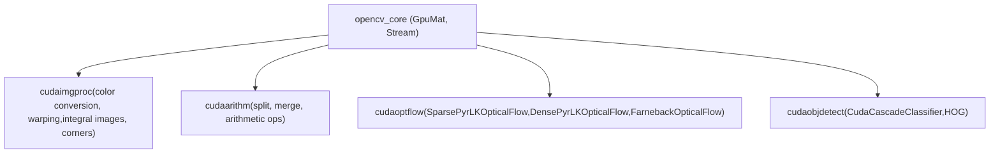

# GPU 加速图像处理与光流

相关源文件

-   [samples/gpu/farneback\_optical\_flow.cpp](https://github.com/opencv/opencv/blob/91c78f50/samples/gpu/farneback_optical_flow.cpp)
-   [samples/gpu/pyrlk\_optical\_flow.cpp](https://github.com/opencv/opencv/blob/91c78f50/samples/gpu/pyrlk_optical_flow.cpp)

## 目的与范围

本页介绍 OpenCV GPU 模块中可用的 CUDA 加速图像处理与光流算法。具体涵盖 `cudaimgproc`、`cudaoptflow`、`cudaarithm` 和 `cudaobjdetect` 模块，重点说明类接口、数据流模式，以及与 CPU 对应实现的行为差异。

关于 `GpuMat`、CUDA 流管理和设备内存分配（即这些算法所依赖的基础类型）的背景，参见 [GpuMat and CUDA Runtime Integration](/opencv/opencv/14.1-gpumat-and-cuda-runtime-integration)。关于与这些 GPU 实现共享算法设计的 CPU 侧光流算法（`calcOpticalFlowPyrLK`、`calcOpticalFlowFarneback`），参见 [Optical Flow and Object Tracking](/opencv/opencv/16.1-optical-flow-and-object-tracking)。

---

## 模块组织

此处覆盖的 GPU 加速功能分布在四个专用 CUDA 模块中，每个模块对应一个功能域：

**CUDA 模块映射**


Sources: [samples/gpu/pyrlk\_optical\_flow.cpp1-16](https://github.com/opencv/opencv/blob/91c78f50/samples/gpu/pyrlk_optical_flow.cpp#L1-L16) [samples/gpu/farneback\_optical\_flow.cpp1-16](https://github.com/opencv/opencv/blob/91c78f50/samples/gpu/farneback_optical_flow.cpp#L1-L16)

| 模块 | 头文件 | 主要职责 |
| --- | --- | --- |
| `cudaimgproc` | `opencv2/cudaimgproc.hpp` | 颜色转换、几何变换、积分图、角点检测 |
| `cudaarithm` | `opencv2/cudaarithm.hpp` | 算术、逻辑、通道拆分等操作 |
| `cudaoptflow` | `opencv2/cudaoptflow.hpp` | 稀疏与稠密光流算法 |
| `cudaobjdetect` | `opencv2/cudaobjdetect.hpp` | 级联分类器、基于 HOG 的行人检测 |

---

## 图像处理（`cudaimgproc`）

### 颜色转换

`cuda::cvtColor` 与 CPU 的 `cv::cvtColor` 签名对应，但作用于 `GpuMat` 参数。它接受同样的 `ColorConversionCodes` 常量（例如 `COLOR_BGR2GRAY`、`COLOR_BGR2HSV`）。转换在设备端执行，无需主机往返。

典型用法是：一次上传、设备端转换、再喂给后续 GPU 算法。例如在光流前做灰度转换，可避免额外的下载-转换-上传循环。

### 图像变换

`cuda::warpAffine` 与 `cuda::warpPerspective` 接收 `GpuMat` 源与目标，以及标准变换矩阵。插值标志（`INTER_LINEAR`、`INTER_NEAREST`、`INTER_CUBIC`）和边界模式与 CPU 路径行为一致。CUDA 内核会将图像分块，每个线程计算变换后的像素地址。

`cuda::remap` 应用逐像素映射数组（`map1`、`map2`，以 `GpuMat` 存储）。当预计算的去畸变映射（来自 `initUndistortRectifyMap`）需要跨多帧常驻设备端时，这是首选路径。

### 积分图

`cuda::integral` 计算 `GpuMat` 的二维积分图，输出类型为 `CV_32SC1`。这是 GPU 级联分类器（见下文）的标准前置步骤。对于大图像，CUDA 上的并行前缀和实现相较 CPU 顺序版本有显著吞吐优势。

### 角点检测（`CornersDetector`）

`cuda::CornersDetector` 接口封装 GPU 侧 Shi-Tomasi（Good Features to Track）与 Harris 角点检测。工厂函数 `cuda::createGoodFeaturesToTrackDetector` 返回 `Ptr<cuda::CornersDetector>`：

[samples/gpu/pyrlk\_optical\_flow.cpp285-286](https://github.com/opencv/opencv/blob/91c78f50/samples/gpu/pyrlk_optical_flow.cpp#L285-L286)

```
Ptr<cuda::CornersDetector> detector = cuda::createGoodFeaturesToTrackDetector(
    d_frame0Gray.type(), points, 0.01, minDist);
detector->detect(d_frame0Gray, d_prevPts);
```
`detect` 以 `CV_32FC2` 类型 `GpuMat` 输出关键点位置（列数 = 检测到的点数）。该输出可被 `SparsePyrLKOpticalFlow::calc` 直接消费，无需主机传输。

**角点检测器类层级**


Sources: [samples/gpu/pyrlk\_optical\_flow.cpp282-292](https://github.com/opencv/opencv/blob/91c78f50/samples/gpu/pyrlk_optical_flow.cpp#L282-L292)

---

## 光流（`cudaoptflow`）

三种光流类都实现了统一抽象接口 `cuda::SparseOpticalFlow` 或 `cuda::DenseOpticalFlow`，两者均继承自 `cv::Algorithm`。每类都通过静态工厂方法 `create()` 实例化。

**光流类层级**


Sources: [samples/gpu/pyrlk\_optical\_flow.cpp295-326](https://github.com/opencv/opencv/blob/91c78f50/samples/gpu/pyrlk_optical_flow.cpp#L295-L326) [samples/gpu/farneback\_optical\_flow.cpp74-98](https://github.com/opencv/opencv/blob/91c78f50/samples/gpu/farneback_optical_flow.cpp#L74-L98)

---

### 稀疏金字塔 Lucas-Kanade（`SparsePyrLKOpticalFlow`）

`cuda::SparsePyrLKOpticalFlow` 用于在前一帧到当前帧之间跟踪稀疏点集。它在图像金字塔上运行，以处理大位移。

**关键参数**（在 `create` 时设置）：

| 参数 | 默认值 | 含义 |
| --- | --- | --- |
| `winSize` | `Size(21,21)` | 每个金字塔层级的搜索窗口大小 |
| `maxLevel` | 3 | 金字塔层数 |
| `iters` | 30 | 每层最大迭代次数 |
| `useInitialFlow` | `false` | `nextPts` 是否预初始化 |

**调用签名：**

```
SparsePyrLKOpticalFlow::calc(prevImg, nextImg, prevPts, nextPts, status [, err])
```
-   `prevPts` / `nextPts`：类型 `CV_32FC2` 的 `GpuMat`，形状 `1 × N`
-   `status`：类型 `CV_8UC1` 的 `GpuMat`，若点跟踪成功则为 `1`
-   支持灰度和彩色源图像

[samples/gpu/pyrlk\_optical\_flow.cpp298-314](https://github.com/opencv/opencv/blob/91c78f50/samples/gpu/pyrlk_optical_flow.cpp#L298-L314)

`calc` 后，若要绘制或进行后续 CPU 处理，需先将结果下载到主机向量：

[samples/gpu/pyrlk\_optical\_flow.cpp17-29](https://github.com/opencv/opencv/blob/91c78f50/samples/gpu/pyrlk_optical_flow.cpp#L17-L29)

---

### 稠密金字塔 Lucas-Kanade（`DensePyrLKOpticalFlow`）

`cuda::DensePyrLKOpticalFlow` 为每个像素计算一个流向量。其构造参数与稀疏版本相同。输出是 `CV_32FC2` 类型的 `GpuMat`（双通道：每像素 `(dx, dy)`）。

[samples/gpu/pyrlk\_optical\_flow.cpp319-325](https://github.com/opencv/opencv/blob/91c78f50/samples/gpu/pyrlk_optical_flow.cpp#L319-L325)

可视化时，先用 `cuda::split` 将双通道流矩阵拆为 X、Y 平面，再下载用于着色编码：

[samples/gpu/pyrlk\_optical\_flow.cpp182-194](https://github.com/opencv/opencv/blob/91c78f50/samples/gpu/pyrlk_optical_flow.cpp#L182-L194)

---

### Farneback 稠密光流（`FarnebackOpticalFlow`）

`cuda::FarnebackOpticalFlow` 实现多项式展开法。其输出是存储为 `CV_32FC2` 的稠密双通道流场。GPU 实现与 CPU 的 `calcOpticalFlowFarneback` 在 API 上兼容，并公开 getter 方法（`getPyrScale`、`getNumLevels`、`getWinSize`、`getNumIters`、`getPolyN`、`getPolySigma`、`getFlags`），以便读取参数并传给 CPU 回退路径：

[samples/gpu/farneback\_optical\_flow.cpp74-111](https://github.com/opencv/opencv/blob/91c78f50/samples/gpu/farneback_optical_flow.cpp#L74-L111)

`calc` 方法签名：

```
FarnebackOpticalFlow::calc(prevImg, nextImg, flow [, stream])
```
可选 `Stream` 参数支持异步执行；省略时会在默认流上同步执行。

**Farneback 参数：**

| 参数 | 默认值 | 含义 |
| --- | --- | --- |
| `numLevels` | 5 | 金字塔深度 |
| `pyrScale` | 0.5 | 层间缩放比 |
| `fastPyramids` | `false` | 使用内置快速金字塔下采样 |
| `winSize` | 13 | 均值窗口大小 |
| `numIters` | 10 | 每层迭代次数 |
| `polyN` | 5 | 多项式展开邻域大小 |
| `polySigma` | 1.1 | 多项式展开的高斯 sigma |
| `flags` | 0 | `OPTFLOW_USE_INITIAL_FLOW`, `OPTFLOW_FARNEBACK_GAUSSIAN` |

Sources: [samples/gpu/farneback\_optical\_flow.cpp46-140](https://github.com/opencv/opencv/blob/91c78f50/samples/gpu/farneback_optical_flow.cpp#L46-L140)

---

## 典型数据流

所有 GPU 光流算法都遵循同一流程模式：

**GPU 光流数据流**

> **[Mermaid sequence]**
> *(图表结构无法解析)*

Sources: [samples/gpu/pyrlk\_optical\_flow.cpp281-326](https://github.com/opencv/opencv/blob/91c78f50/samples/gpu/pyrlk_optical_flow.cpp#L281-L326) [samples/gpu/farneback\_optical\_flow.cpp74-98](https://github.com/opencv/opencv/blob/91c78f50/samples/gpu/farneback_optical_flow.cpp#L74-L98)

---

## GPU 级联分类器（`cudaobjdetect`）

`cuda::CudaCascadeClassifier` 是 `cv::CascadeClassifier` 的 GPU 加速对应实现。它加载相同的 Haar 或 LBP 级联 XML 文件。检测前通常会先调用 `cuda::integral` 在设备端计算积分图。

GPU 侧检测流水线：

1.  上传图像 → `GpuMat`
2.  使用 `cuda::cvtColor` 转为灰度
3.  可选地使用 `cuda::integral` 计算积分图
4.  调用 `CudaCascadeClassifier::detectMultiScale(image, objects)`
5.  `objects` 为 `GpuMat`；调用 `CudaCascadeClassifier::convert(objects, host_rects)` 生成 `std::vector<Rect>`

该类内部维护自身尺度金字塔。`setScaleFactor`、`setMinNeighbors`、`setMinObjectSize` 与 `setMaxObjectSize` 方法用于控制检测参数，对应 CPU `detectMultiScale` 的参数语义。

---

## HOG 描述子（`cudaobjdetect`）

`cuda::HOG` 在 GPU 上执行方向梯度直方图特征提取与基于 SVM 的检测。其接口与 `cv::HOGDescriptor` 一致：

-   `setSVMDetector(detector)` —— 加载预计算 SVM 权重向量
-   `detect(img, found_locations [, confidences])` —— 返回边界框
-   `detectMultiScale(img, found_locations)` —— 多尺度检测
-   `getDefaultPeopleDetector()` —— 返回预训练 64×128 行人检测器权重的静态方法

GPU 实现并行处理滑动窗口，因此在大图像或多尺度场景下通常显著快于 CPU 路径。

---

## CPU 与 GPU API 对比

| 操作 | CPU API | GPU API | 说明 |
| --- | --- | --- | --- |
| 颜色转换 | `cv::cvtColor` | `cuda::cvtColor` | 相同 `ColorConversionCodes` |
| 仿射变换 | `cv::warpAffine` | `cuda::warpAffine` | 相同标志 |
| 透视变换 | `cv::warpPerspective` | `cuda::warpPerspective` | 相同标志 |
| 积分图 | `cv::integral` | `cuda::integral` | 输出类型 `CV_32SC1` |
| Good features | `cv::goodFeaturesToTrack` | `cuda::createGoodFeaturesToTrackDetector` | 工厂 + `detect()` |
| 稀疏 LK 光流 | `cv::calcOpticalFlowPyrLK` | `cuda::SparsePyrLKOpticalFlow::create` + `calc` | 工厂模式 |
| 稠密 LK 光流 | — | `cuda::DensePyrLKOpticalFlow::create` + `calc` | 无 CPU 对应实现 |
| Farneback 光流 | `cv::calcOpticalFlowFarneback` | `cuda::FarnebackOpticalFlow::create` + `calc` | 参数兼容 |
| 级联检测 | `cv::CascadeClassifier` | `cuda::CudaCascadeClassifier` | 需要 `convert` 步骤 |
| HOG 检测 | `cv::HOGDescriptor` | `cuda::HOG` | 相同 SVM 权重 |

---

## Stream 支持

所有 `calc` 与 `detect` 方法都接受可选的 `cuda::Stream` 作为最后一个参数。传入非默认 stream 可启用异步派发，使 CPU 工作或无关 GPU 操作与光流计算重叠。若需同步行为，可省略 stream 参数或传入 `cuda::Stream::Null()`。

关于 stream 管理细节，参见 [GpuMat and CUDA Runtime Integration](/opencv/opencv/14.1-gpumat-and-cuda-runtime-integration)。

Sources: [samples/gpu/pyrlk\_optical\_flow.cpp1-331](https://github.com/opencv/opencv/blob/91c78f50/samples/gpu/pyrlk_optical_flow.cpp#L1-L331) [samples/gpu/farneback\_optical\_flow.cpp1-140](https://github.com/opencv/opencv/blob/91c78f50/samples/gpu/farneback_optical_flow.cpp#L1-L140)
