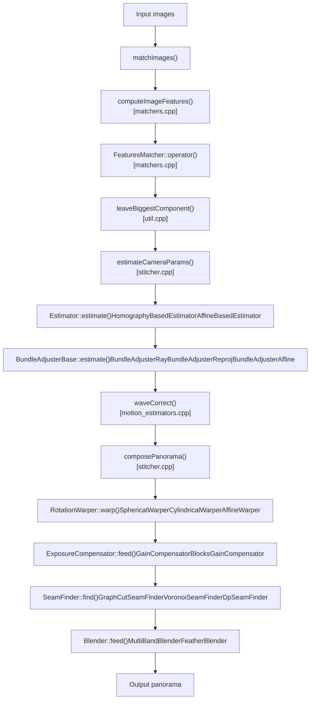
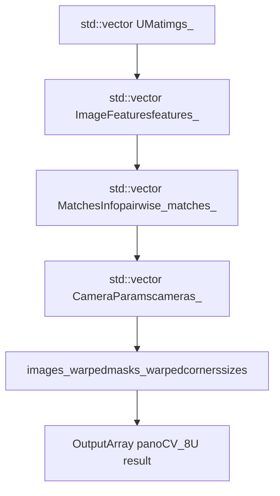

# 图像拼接

相关源文件

-   [modules/stitching/CMakeLists.txt](https://github.com/opencv/opencv/blob/91c78f50/modules/stitching/CMakeLists.txt)
-   [modules/stitching/include/opencv2/stitching.hpp](https://github.com/opencv/opencv/blob/91c78f50/modules/stitching/include/opencv2/stitching.hpp)
-   [modules/stitching/include/opencv2/stitching/detail/autocalib.hpp](https://github.com/opencv/opencv/blob/91c78f50/modules/stitching/include/opencv2/stitching/detail/autocalib.hpp)
-   [modules/stitching/include/opencv2/stitching/detail/blenders.hpp](https://github.com/opencv/opencv/blob/91c78f50/modules/stitching/include/opencv2/stitching/detail/blenders.hpp)
-   [modules/stitching/include/opencv2/stitching/detail/camera.hpp](https://github.com/opencv/opencv/blob/91c78f50/modules/stitching/include/opencv2/stitching/detail/camera.hpp)
-   [modules/stitching/include/opencv2/stitching/detail/exposure\_compensate.hpp](https://github.com/opencv/opencv/blob/91c78f50/modules/stitching/include/opencv2/stitching/detail/exposure_compensate.hpp)
-   [modules/stitching/include/opencv2/stitching/detail/matchers.hpp](https://github.com/opencv/opencv/blob/91c78f50/modules/stitching/include/opencv2/stitching/detail/matchers.hpp)
-   [modules/stitching/include/opencv2/stitching/detail/motion\_estimators.hpp](https://github.com/opencv/opencv/blob/91c78f50/modules/stitching/include/opencv2/stitching/detail/motion_estimators.hpp)
-   [modules/stitching/include/opencv2/stitching/detail/seam\_finders.hpp](https://github.com/opencv/opencv/blob/91c78f50/modules/stitching/include/opencv2/stitching/detail/seam_finders.hpp)
-   [modules/stitching/include/opencv2/stitching/detail/util.hpp](https://github.com/opencv/opencv/blob/91c78f50/modules/stitching/include/opencv2/stitching/detail/util.hpp)
-   [modules/stitching/include/opencv2/stitching/detail/util\_inl.hpp](https://github.com/opencv/opencv/blob/91c78f50/modules/stitching/include/opencv2/stitching/detail/util_inl.hpp)
-   [modules/stitching/include/opencv2/stitching/detail/warpers.hpp](https://github.com/opencv/opencv/blob/91c78f50/modules/stitching/include/opencv2/stitching/detail/warpers.hpp)
-   [modules/stitching/include/opencv2/stitching/detail/warpers\_inl.hpp](https://github.com/opencv/opencv/blob/91c78f50/modules/stitching/include/opencv2/stitching/detail/warpers_inl.hpp)
-   [modules/stitching/include/opencv2/stitching/warpers.hpp](https://github.com/opencv/opencv/blob/91c78f50/modules/stitching/include/opencv2/stitching/warpers.hpp)
-   [modules/stitching/misc/python/test/test\_stitching.py](https://github.com/opencv/opencv/blob/91c78f50/modules/stitching/misc/python/test/test_stitching.py)
-   [modules/stitching/perf/opencl/perf\_stitch.cpp](https://github.com/opencv/opencv/blob/91c78f50/modules/stitching/perf/opencl/perf_stitch.cpp)
-   [modules/stitching/perf/perf\_estimators.cpp](https://github.com/opencv/opencv/blob/91c78f50/modules/stitching/perf/perf_estimators.cpp)
-   [modules/stitching/perf/perf\_main.cpp](https://github.com/opencv/opencv/blob/91c78f50/modules/stitching/perf/perf_main.cpp)
-   [modules/stitching/perf/perf\_matchers.cpp](https://github.com/opencv/opencv/blob/91c78f50/modules/stitching/perf/perf_matchers.cpp)
-   [modules/stitching/perf/perf\_precomp.hpp](https://github.com/opencv/opencv/blob/91c78f50/modules/stitching/perf/perf_precomp.hpp)
-   [modules/stitching/perf/perf\_stich.cpp](https://github.com/opencv/opencv/blob/91c78f50/modules/stitching/perf/perf_stich.cpp)
-   [modules/stitching/src/blenders.cpp](https://github.com/opencv/opencv/blob/91c78f50/modules/stitching/src/blenders.cpp)
-   [modules/stitching/src/exposure\_compensate.cpp](https://github.com/opencv/opencv/blob/91c78f50/modules/stitching/src/exposure_compensate.cpp)
-   [modules/stitching/src/matchers.cpp](https://github.com/opencv/opencv/blob/91c78f50/modules/stitching/src/matchers.cpp)
-   [modules/stitching/src/motion\_estimators.cpp](https://github.com/opencv/opencv/blob/91c78f50/modules/stitching/src/motion_estimators.cpp)
-   [modules/stitching/src/opencl/warpers.cl](https://github.com/opencv/opencv/blob/91c78f50/modules/stitching/src/opencl/warpers.cl)
-   [modules/stitching/src/precomp.hpp](https://github.com/opencv/opencv/blob/91c78f50/modules/stitching/src/precomp.hpp)
-   [modules/stitching/src/seam\_finders.cpp](https://github.com/opencv/opencv/blob/91c78f50/modules/stitching/src/seam_finders.cpp)
-   [modules/stitching/src/stitcher.cpp](https://github.com/opencv/opencv/blob/91c78f50/modules/stitching/src/stitcher.cpp)
-   [modules/stitching/src/util.cpp](https://github.com/opencv/opencv/blob/91c78f50/modules/stitching/src/util.cpp)
-   [modules/stitching/src/warpers.cpp](https://github.com/opencv/opencv/blob/91c78f50/modules/stitching/src/warpers.cpp)
-   [modules/stitching/test/test\_exposure\_compensate.cpp](https://github.com/opencv/opencv/blob/91c78f50/modules/stitching/test/test_exposure_compensate.cpp)
-   [modules/stitching/test/test\_main.cpp](https://github.com/opencv/opencv/blob/91c78f50/modules/stitching/test/test_main.cpp)
-   [modules/stitching/test/test\_matchers.cpp](https://github.com/opencv/opencv/blob/91c78f50/modules/stitching/test/test_matchers.cpp)
-   [modules/stitching/test/test\_precomp.hpp](https://github.com/opencv/opencv/blob/91c78f50/modules/stitching/test/test_precomp.hpp)
-   [modules/stitching/test/test\_wave\_correction.cpp](https://github.com/opencv/opencv/blob/91c78f50/modules/stitching/test/test_wave_correction.cpp)
-   [samples/cpp/stitching\_detailed.cpp](https://github.com/opencv/opencv/blob/91c78f50/samples/cpp/stitching_detailed.cpp)

本页文档介绍 `opencv_stitching` 模块，该模块将多张彼此重叠的图像合成为无缝全景图。内容涵盖 `Stitcher` 类、两种支持的拼接模式，以及内部流水线的各个阶段。关于匹配阶段使用的特征检测器与描述子类型背景知识，请参阅 [Feature Detection and Matching (features2d)](/opencv/opencv/6-feature-detection-and-matching-(features2d))。关于旋转估计阶段所依赖的相机标定概念，请参阅 [Camera Calibration and 3D Vision (calib3d)](/opencv/opencv/8-camera-calibration-and-3d-vision-(calib3d))。

---

## 模块布局

拼接模块位于 `modules/stitching/`，并声明了对 `opencv_imgproc`、`opencv_features2d`、`opencv_calib3d` 和 `opencv_flann` 的强制依赖。当 `opencv_cudafeatures2d`、`opencv_cudawarping`、`opencv_cudaarithm` 及相关模块可用时，会条件编译 CUDA 加速的匹配与扭曲路径。

[modules/stitching/CMakeLists.txt1-13](https://github.com/opencv/opencv/blob/91c78f50/modules/stitching/CMakeLists.txt#L1-L13)

公共 API 通过一个顶层头文件暴露：

-   `modules/stitching/include/opencv2/stitching.hpp` — 包含 `Stitcher` 类，并会传递性地包含所有 `detail/` 头文件。

`detail` 命名空间中的头文件会单独暴露每个构建模块，因此可在不经由 `Stitcher` 的情况下自由组合。

---

## `Stitcher` 类

`Stitcher` 是主要入口。它持有所有流水线组件的引用，并通过 `stitch()` 提供单次调用执行完整流程的便捷接口。

**文件：** [modules/stitching/src/stitcher.cpp](https://github.com/opencv/opencv/blob/91c78f50/modules/stitching/src/stitcher.cpp)
**头文件：** [modules/stitching/include/opencv2/stitching.hpp96-300](https://github.com/opencv/opencv/blob/91c78f50/modules/stitching/include/opencv2/stitching.hpp#L96-L300)

### 模式

`Stitcher::create(Mode mode)` 返回一个已完全预配置的实例。支持两种模式：

| 模式 | 变换模型 | 匹配器 | 估计器 | Bundle Adjuster | Warper |
| --- | --- | --- | --- | --- | --- |
| `PANORAMA` | Homography（仅旋转相机） | `BestOf2NearestMatcher` | `HomographyBasedEstimator` | `BundleAdjusterRay` | `SphericalWarper` |
| `SCANS` | Affine（平移 + 旋转） | `AffineBestOf2NearestMatcher` | `AffineBasedEstimator` | `BundleAdjusterAffinePartial` | `AffineWarper` |

[modules/stitching/src/stitcher.cpp53-99](https://github.com/opencv/opencv/blob/91c78f50/modules/stitching/src/stitcher.cpp#L53-L99)

### 关键方法

| 方法 | 用途 |
| --- | --- |
| `stitch(images, pano)` | 运行完整流水线（匹配 + 合成） |
| `estimateTransform(images, masks)` | 仅进行特征检测与相机参数估计 |
| `composePanorama(pano)` | 仅进行扭曲、补偿、接缝搜索与融合 |
| `setTransform(images, cameras, component)` | 注入预计算相机参数，跳过估计 |

`stitch()` 会先调用 `estimateTransform()`，再调用 `composePanorama()`。

[modules/stitching/src/stitcher.cpp379-393](https://github.com/opencv/opencv/blob/91c78f50/modules/stitching/src/stitcher.cpp#L379-L393)

### 分辨率尺度

流水线在三个不同分辨率下运行，以平衡速度与质量：

| 参数 | 默认值 | 方法 |
| --- | --- | --- |
| Registration resolution | 0.6 Mpx | `setRegistrationResol()` |
| Seam estimation resolution | 0.1 Mpx | `setSeamEstimationResol()` |
| Compositing resolution | original | `setCompositingResol()` |

图像在特征检测阶段会缩小到 registration 分辨率。最终合成结果在 compositing 分辨率生成。接缝掩码在 seam estimation 分辨率计算。

[modules/stitching/src/stitcher.cpp57-69](https://github.com/opencv/opencv/blob/91c78f50/modules/stitching/src/stitcher.cpp#L57-L69)

---

## 流水线阶段

**Figure: Stitching pipeline — class names mapped to pipeline stages**


来源： [modules/stitching/src/stitcher.cpp](https://github.com/opencv/opencv/blob/91c78f50/modules/stitching/src/stitcher.cpp) [modules/stitching/src/matchers.cpp](https://github.com/opencv/opencv/blob/91c78f50/modules/stitching/src/matchers.cpp) [modules/stitching/src/motion\_estimators.cpp](https://github.com/opencv/opencv/blob/91c78f50/modules/stitching/src/motion_estimators.cpp) [modules/stitching/src/blenders.cpp](https://github.com/opencv/opencv/blob/91c78f50/modules/stitching/src/blenders.cpp) [modules/stitching/src/seam\_finders.cpp](https://github.com/opencv/opencv/blob/91c78f50/modules/stitching/src/seam_finders.cpp) [modules/stitching/src/exposure\_compensate.cpp](https://github.com/opencv/opencv/blob/91c78f50/modules/stitching/src/exposure_compensate.cpp)

---

### 阶段 1 — 特征检测

**内部方法：** `Stitcher::matchImages()` 调用 `detail::computeImageFeatures()`。

`computeImageFeatures()` 可接受任意 `Feature2D` 子类（`Stitcher::create` 默认使用 ORB；SIFT、AKAZE 与 SURF 也很常见）。结果保存为 `ImageFeatures` 结构体。

```
struct ImageFeatures {
    int img_idx;
    Size img_size;
    std::vector<KeyPoint> keypoints;
    UMat descriptors;
};
```
[modules/stitching/include/opencv2/stitching/detail/matchers.hpp57-65](https://github.com/opencv/opencv/blob/91c78f50/modules/stitching/include/opencv2/stitching/detail/matchers.hpp#L57-L65)
[modules/stitching/src/matchers.cpp282-315](https://github.com/opencv/opencv/blob/91c78f50/modules/stitching/src/matchers.cpp#L282-L315)

---

### 阶段 2 — 成对特征匹配

**类：**

| 类 | 说明 |
| --- | --- |
| `FeaturesMatcher` | 抽象基类；`operator()` 分发到 `match()` |
| `BestOf2NearestMatcher` | 对 kNN 匹配做交叉检查（比率测试），然后用 RANSAC 估计 homography |
| `BestOf2NearestRangeMatcher` | 类似 `BestOf2NearestMatcher`，但仅匹配索引距离处于滑动窗口 `range_width` 内的图像 |
| `AffineBestOf2NearestMatcher` | 估计 affine 变换而非 homography；用于 SCANS 模式 |

结果存储在 `MatchesInfo`：

```
struct MatchesInfo {
    int src_img_idx, dst_img_idx;
    std::vector<DMatch> matches;
    std::vector<uchar> inliers_mask;
    int num_inliers;
    Mat H;          // Estimated homography or affine transform
    double confidence;
};
```
[modules/stitching/include/opencv2/stitching/detail/matchers.hpp99-114](https://github.com/opencv/opencv/blob/91c78f50/modules/stitching/include/opencv2/stitching/detail/matchers.hpp#L99-L114)

当 `is_thread_safe_` 为 true（`CpuMatcher` 路径会设置该标志）时，匹配通过 `parallel_for_` 并行执行。GPU 匹配在 CUDA 可用时使用 `cuda::DescriptorMatcher`。

[modules/stitching/src/matchers.cpp338-363](https://github.com/opencv/opencv/blob/91c78f50/modules/stitching/src/matchers.cpp#L338-L363)
[modules/stitching/src/matchers.cpp368-480](https://github.com/opencv/opencv/blob/91c78f50/modules/stitching/src/matchers.cpp#L368-L480)

**置信度公式**（来自 Brown & Lowe 2007）：

```
confidence = num_inliers / (8 + 0.3 * num_matches)
```
置信度高于 `matches_confindece_thresh`（默认 3.0）的图像对会被排除（过近、信息量不足）。

[modules/stitching/src/matchers.cpp437-443](https://github.com/opencv/opencv/blob/91c78f50/modules/stitching/src/matchers.cpp#L437-L443)

匹配后，`leaveBiggestComponent()` 会基于 `pano_confid_thresh_`（默认 1.0）移除与主连通分量置信度不足的图像。

[modules/stitching/src/stitcher.cpp474-486](https://github.com/opencv/opencv/blob/91c78f50/modules/stitching/src/stitcher.cpp#L474-L486)

---

### 阶段 3 — 旋转 / 相机参数估计

**文件：** [modules/stitching/src/motion\_estimators.cpp](https://github.com/opencv/opencv/blob/91c78f50/modules/stitching/src/motion_estimators.cpp)
**头文件：** [modules/stitching/include/opencv2/stitching/detail/motion\_estimators.hpp](https://github.com/opencv/opencv/blob/91c78f50/modules/stitching/include/opencv2/stitching/detail/motion_estimators.hpp)

**Figure: Estimator class hierarchy**


来源： [modules/stitching/include/opencv2/stitching/detail/motion\_estimators.hpp](https://github.com/opencv/opencv/blob/91c78f50/modules/stitching/include/opencv2/stitching/detail/motion_estimators.hpp) [modules/stitching/src/motion\_estimators.cpp](https://github.com/opencv/opencv/blob/91c78f50/modules/stitching/src/motion_estimators.cpp)

`HomographyBasedEstimator::estimate()` 分两步执行：

1.  使用 `estimateFocal()` 估计每张图像的焦距。
2.  在成对匹配图上构建最大生成树，并通过 `CalcRotation` 遍历该树，将 homography 链接为全局旋转矩阵。

[modules/stitching/src/motion\_estimators.cpp128-193](https://github.com/opencv/opencv/blob/91c78f50/modules/stitching/src/motion_estimators.cpp#L128-L193)

`AffineBasedEstimator` 使用同样的生成树遍历过程，但通过 `CalcAffineTransform` 链接 affine 变换。

[modules/stitching/src/motion\_estimators.cpp199-219](https://github.com/opencv/opencv/blob/91c78f50/modules/stitching/src/motion_estimators.cpp#L199-L219)

#### Bundle Adjustment

`BundleAdjusterBase::estimate()` 通过 `CvLevMarq`（Levenberg-Marquardt）联合优化所有相机参数。它通过对每个参数做微小扰动并测量重投影误差变化，数值计算 Jacobian。

-   `BundleAdjusterRay`：每相机 4 个参数（焦距 + 3 分量旋转向量）。误差为光线夹角差。
-   `BundleAdjusterReproj`：每相机 7 个参数（focal、ppx、ppy、aspect、rvec）。误差为二维重投影距离。
-   `BundleAdjusterAffine` / `BundleAdjusterAffinePartial`：用于 affine 模型的每相机 6 或 4 个参数。

[modules/stitching/src/motion\_estimators.cpp224-329](https://github.com/opencv/opencv/blob/91c78f50/modules/stitching/src/motion_estimators.cpp#L224-L329)

#### Wave Correction

在 bundle adjustment 之后，`waveCorrect()` 会调整整组旋转矩阵，使全景地平线保持水平。提供两种模式：`WAVE_CORRECT_HORIZ` 与 `WAVE_CORRECT_VERT`。

[modules/stitching/src/stitcher.cpp530-538](https://github.com/opencv/opencv/blob/91c78f50/modules/stitching/src/stitcher.cpp#L530-L538)

---

### 阶段 4 — 图像扭曲

**文件：** [modules/stitching/include/opencv2/stitching/detail/warpers.hpp](https://github.com/opencv/opencv/blob/91c78f50/modules/stitching/include/opencv2/stitching/detail/warpers.hpp) [modules/stitching/src/warpers.cpp](https://github.com/opencv/opencv/blob/91c78f50/modules/stitching/src/warpers.cpp)

**Figure: Warper class hierarchy**


来源： [modules/stitching/include/opencv2/stitching/detail/warpers.hpp](https://github.com/opencv/opencv/blob/91c78f50/modules/stitching/include/opencv2/stitching/detail/warpers.hpp)

每种 warper 在一个继承自 `ProjectorBase` 的结构体中实现 `mapForward()` 与 `mapBackward()`（例如 `SphericalProjector`、`CylindricalProjector`）。`RotationWarperBase<P>` 通过遍历目标像素并应用 `mapBackward()`，以通用方式实现 `buildMaps()`。

[modules/stitching/include/opencv2/stitching/detail/warpers\_inl.hpp74-110](https://github.com/opencv/opencv/blob/91c78f50/modules/stitching/include/opencv2/stitching/detail/warpers_inl.hpp#L74-L110)

可用投影类型：

| Warper | 适用场景 |
| --- | --- |
| `SphericalWarper` | 完整 360° 全景 |
| `CylindricalWarper` | 宽幅全景，极区附近畸变更小 |
| `PlaneWarper` | 近似平面场景 |
| `AffineWarper` | 文档/扫描拼接 |
| `FisheyeWarper`, `StereographicWarper` | 广角光学 |
| `PaniniWarper` | 超宽全景并降低广角畸变 |
| `MercatorWarper`, `TransverseMercatorWarper` | 地图风格输出 |

在存在 `opencv_cudawarping` 时，可用 GPU 加速变体（`PlaneWarperGpu`、`CylindricalWarperGpu`、`SphericalWarperGpu`）。

warper 的尺度参数会设为所有相机焦距的中位数，该值在 bundle adjustment 后计算。

[modules/stitching/src/stitcher.cpp517-528](https://github.com/opencv/opencv/blob/91c78f50/modules/stitching/src/stitcher.cpp#L517-L528)

OpenCL 加速扭曲实现位于 `modules/stitching/src/opencl/warpers.cl`。

---

### 阶段 5 — 曝光补偿

**文件：** [modules/stitching/src/exposure\_compensate.cpp](https://github.com/opencv/opencv/blob/91c78f50/modules/stitching/src/exposure_compensate.cpp)
**头文件：** [modules/stitching/include/opencv2/stitching/detail/exposure\_compensate.hpp](https://github.com/opencv/opencv/blob/91c78f50/modules/stitching/include/opencv2/stitching/detail/exposure_compensate.hpp)

补偿器用于均衡重叠图像区域之间的亮度差异。

| 类 | 策略 |
| --- | --- |
| `NoExposureCompensator` | 直通，不做调整 |
| `GainCompensator` | 每图全局增益标量，通过重叠区最小二乘求解 |
| `ChannelsCompensator` | 每通道独立增益 |
| `BlocksGainCompensator` | 在块网格上估计空间变化增益 |
| `BlocksChannelsCompensator` | 在块网格上估计空间变化的逐通道增益 |

`ExposureCompensator::createDefault(int type)` 会根据常量（`NO`、`GAIN`、`GAIN_BLOCKS`、`CHANNELS`、`CHANNELS_BLOCKS`）构造对应子类。

[modules/stitching/src/exposure\_compensate.cpp52-70](https://github.com/opencv/opencv/blob/91c78f50/modules/stitching/src/exposure_compensate.cpp#L52-L70)

`GainCompensator` 通过比较重叠区平均强度构建线性系统，然后用 SVD（或可用时使用 Eigen）求解。可通过多次 `feed` 迭代（`nr_feeds_`）得到更好的收敛结果。

[modules/stitching/src/exposure\_compensate.cpp83-113](https://github.com/opencv/opencv/blob/91c78f50/modules/stitching/src/exposure_compensate.cpp#L83-L113)

在 `Stitcher` 中，曝光补偿会应用两次：一次在缩小图像上的接缝估计阶段，另一次在最终合成阶段逐图应用。

[modules/stitching/src/stitcher.cpp203-207](https://github.com/opencv/opencv/blob/91c78f50/modules/stitching/src/stitcher.cpp#L203-L207) [modules/stitching/src/stitcher.cpp321-323](https://github.com/opencv/opencv/blob/91c78f50/modules/stitching/src/stitcher.cpp#L321-L323)

---

### 阶段 6 — 接缝搜索

**文件：** [modules/stitching/src/seam\_finders.cpp](https://github.com/opencv/opencv/blob/91c78f50/modules/stitching/src/seam_finders.cpp)
**头文件：** [modules/stitching/include/opencv2/stitching/detail/seam\_finders.hpp](https://github.com/opencv/opencv/blob/91c78f50/modules/stitching/include/opencv2/stitching/detail/seam_finders.hpp)

接缝搜索器决定重叠区域中每个像素由哪张图像“胜出”，并更新图像掩码以消除可见接缝。

| 类 | 算法 |
| --- | --- |
| `NoSeamFinder` | 不处理；直接重叠 |
| `VoronoiSeamFinder` | 距离变换；像素归属最近图像边界 |
| `DpSeamFinder` | 在重叠连通区域上做动态规划 |
| `GraphCutSeamFinder` | 最小代价图割（最优；`Stitcher::create` 默认） |
| `GraphCutSeamFinderGpu` | 通过 `opencv_cudalegacy` 实现的 GPU 图割 |

`GraphCutSeamFinder` 使用 `imgproc` 的图割实现（`gcgraph.hpp`）。它在重叠区域上最小化代价函数，代价考虑颜色差异，并可选考虑颜色梯度。

[modules/stitching/src/seam\_finders.cpp44-58](https://github.com/opencv/opencv/blob/91c78f50/modules/stitching/src/seam_finders.cpp#L44-L58)

出于速度考虑，接缝搜索在 `seam_est_resol`（默认 0.1 Mpx）下执行。得到的掩码在合成前会被上采样并膨胀。

[modules/stitching/src/stitcher.cpp209-214](https://github.com/opencv/opencv/blob/91c78f50/modules/stitching/src/stitcher.cpp#L209-L214) [modules/stitching/src/stitcher.cpp333-337](https://github.com/opencv/opencv/blob/91c78f50/modules/stitching/src/stitcher.cpp#L333-L337)

---

### 阶段 7 — 融合

**文件：** [modules/stitching/src/blenders.cpp](https://github.com/opencv/opencv/blob/91c78f50/modules/stitching/src/blenders.cpp)
**头文件：** [modules/stitching/include/opencv2/stitching/detail/blenders.hpp](https://github.com/opencv/opencv/blob/91c78f50/modules/stitching/include/opencv2/stitching/detail/blenders.hpp)

| 类 | 算法 |
| --- | --- |
| `Blender` | 不融合；每像素最后一张图获胜 |
| `FeatherBlender` | 从图像中心线性 alpha 衰减；重叠区做加权平均 |
| `MultiBandBlender` | 在可配置 `num_bands_` 频带上执行 Laplacian 金字塔融合 |

`MultiBandBlender` 是 `Stitcher::create` 的默认选项。它将每张源图分解为 Laplacian 金字塔，用 Gaussian 权重金字塔在每个频带分别融合，然后重建最终图像。该方法能得到平滑过渡，并对视差错位更鲁棒。

[modules/stitching/src/blenders.cpp216-300](https://github.com/opencv/opencv/blob/91c78f50/modules/stitching/src/blenders.cpp#L216-L300)

`MultiBandBlender::feed()` 为每张图构建 Laplacian 金字塔并累加到 `dst_pyr_laplace_`。`blend()` 负责归一化并折叠金字塔。

[modules/stitching/src/blenders.cpp328-560](https://github.com/opencv/opencv/blob/91c78f50/modules/stitching/src/blenders.cpp#L328-L560)

一个 OpenCL kernel 可加速 `feed` 的累加步骤：

[modules/stitching/src/blenders.cpp303-326](https://github.com/opencv/opencv/blob/91c78f50/modules/stitching/src/blenders.cpp#L303-L326)

同时也存在基于 CUDA arithmetic 与 warping 模块的 GPU 路径，可用于金字塔构建和融合。

---

## 数据流汇总

**Figure: Data structures flowing between pipeline stages**


来源： [modules/stitching/src/stitcher.cpp](https://github.com/opencv/opencv/blob/91c78f50/modules/stitching/src/stitcher.cpp) [modules/stitching/include/opencv2/stitching/detail/camera.hpp](https://github.com/opencv/opencv/blob/91c78f50/modules/stitching/include/opencv2/stitching/detail/camera.hpp) [modules/stitching/include/opencv2/stitching/detail/matchers.hpp](https://github.com/opencv/opencv/blob/91c78f50/modules/stitching/include/opencv2/stitching/detail/matchers.hpp)

`CameraParams` 存储每张图像的内参与外参：

```
struct CameraParams {
    double focal;   // Focal length in pixels
    double aspect;  // Pixel aspect ratio
    double ppx, ppy; // Principal point
    Mat R;          // 3x3 rotation matrix
    Mat t;          // 3x1 translation vector
    Mat K();        // Returns 3x3 intrinsic matrix
};
```
[modules/stitching/include/opencv2/stitching/detail/camera.hpp](https://github.com/opencv/opencv/blob/91c78f50/modules/stitching/include/opencv2/stitching/detail/camera.hpp)

---

## 自定义流水线

`Stitcher` 的每个组件都可通过 setter 方法替换：

| Setter | 组件类型 |
| --- | --- |
| `setFeaturesFinder(Ptr<Feature2D>)` | 特征检测器 |
| `setFeaturesMatcher(Ptr<FeaturesMatcher>)` | 成对匹配器 |
| `setEstimator(Ptr<Estimator>)` | 初始相机估计器 |
| `setBundleAdjuster(Ptr<detail::BundleAdjusterBase>)` | Bundle Adjuster |
| `setWarper(Ptr<WarperCreator>)` | Warper 工厂 |
| `setExposureCompensator(Ptr<ExposureCompensator>)` | 曝光补偿器 |
| `setSeamFinder(Ptr<SeamFinder>)` | 接缝搜索器 |
| `setBlender(Ptr<Blender>)` | 融合器 |

若需底层控制，也可直接使用 `cv::detail` 中所有组件而不使用 `Stitcher`。完整的手动构建各阶段示例见 `samples/cpp/stitching_detailed.cpp`。

[samples/cpp/stitching\_detailed.cpp](https://github.com/opencv/opencv/blob/91c78f50/samples/cpp/stitching_detailed.cpp)

---

## Python 绑定

`Stitcher` 类以及核心 `detail` 类型（包括 `ImageFeatures`、`MatchesInfo`、`BestOf2NearestMatcher` 和 `PyRotationWarper`）都提供了 Python 包装。该模块在 CMakeLists.txt 中以 `WRAP python` 声明。

[modules/stitching/CMakeLists.txt11-13](https://github.com/opencv/opencv/blob/91c78f50/modules/stitching/CMakeLists.txt#L11-L13)
[modules/stitching/misc/python/test/test\_stitching.py](https://github.com/opencv/opencv/blob/91c78f50/modules/stitching/misc/python/test/test_stitching.py)

Python 的基本用法模式：

```
stitcher = cv2.Stitcher.create(cv2.Stitcher_PANORAMA)status, pano = stitcher.stitch(images)
```
---

## 相关页面

-   [15.1 — Panorama Stitching Pipeline](/opencv/opencv/15.1-panorama-stitching-pipeline)：`Stitcher` 流水线各子步骤的详细文档。
-   [6 — Feature Detection and Matching (features2d)](/opencv/opencv/6-feature-detection-and-matching-(features2d))：特征检测与匹配阶段使用的 `Feature2D` 与 `DescriptorMatcher` 接口。
-   [8 — Camera Calibration and 3D Vision (calib3d)](/opencv/opencv/8-camera-calibration-and-3d-vision-(calib3d))：运动估计阶段引用的相机模型与 homography 估计。
-   [14 — CUDA and GPU Acceleration](/opencv/opencv/14-cuda-and-gpu-acceleration)：GPU warper、matcher 与 blender 路径使用的 GpuMat 与 CUDA stream 管理。
