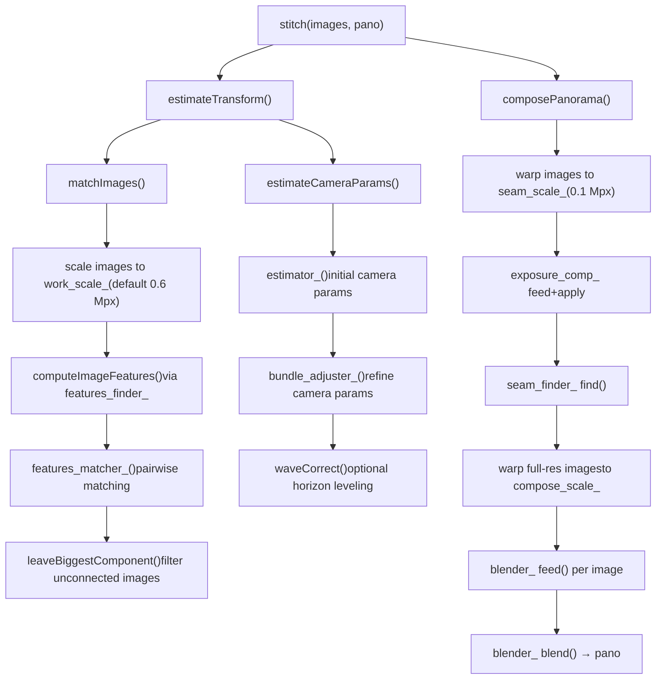
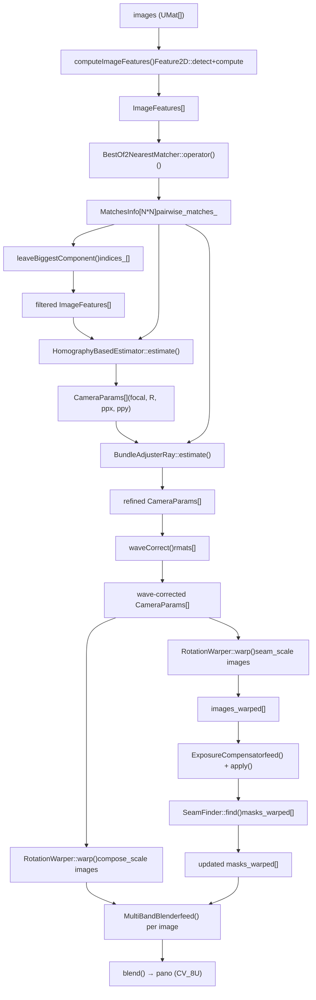

# 全景拼接流水线

相关源文件

-   [modules/stitching/CMakeLists.txt](https://github.com/opencv/opencv/blob/91c78f50/modules/stitching/CMakeLists.txt)
-   [modules/stitching/include/opencv2/stitching.hpp](https://github.com/opencv/opencv/blob/91c78f50/modules/stitching/include/opencv2/stitching.hpp)
-   [modules/stitching/include/opencv2/stitching/detail/autocalib.hpp](https://github.com/opencv/opencv/blob/91c78f50/modules/stitching/include/opencv2/stitching/detail/autocalib.hpp)
-   [modules/stitching/include/opencv2/stitching/detail/blenders.hpp](https://github.com/opencv/opencv/blob/91c78f50/modules/stitching/include/opencv2/stitching/detail/blenders.hpp)
-   [modules/stitching/include/opencv2/stitching/detail/camera.hpp](https://github.com/opencv/opencv/blob/91c78f50/modules/stitching/include/opencv2/stitching/detail/camera.hpp)
-   [modules/stitching/include/opencv2/stitching/detail/exposure\_compensate.hpp](https://github.com/opencv/opencv/blob/91c78f50/modules/stitching/include/opencv2/stitching/detail/exposure_compensate.hpp)
-   [modules/stitching/include/opencv2/stitching/detail/matchers.hpp](https://github.com/opencv/opencv/blob/91c78f50/modules/stitching/include/opencv2/stitching/detail/matchers.hpp)
-   [modules/stitching/include/opencv2/stitching/detail/motion\_estimators.hpp](https://github.com/opencv/opencv/blob/91c78f50/modules/stitching/include/opencv2/stitching/detail/motion_estimators.hpp)
-   [modules/stitching/include/opencv2/stitching/detail/seam\_finders.hpp](https://github.com/opencv/opencv/blob/91c78f50/modules/stitching/include/opencv2/stitching/detail/seam_finders.hpp)
-   [modules/stitching/include/opencv2/stitching/detail/util.hpp](https://github.com/opencv/opencv/blob/91c78f50/modules/stitching/include/opencv2/stitching/detail/util.hpp)
-   [modules/stitching/include/opencv2/stitching/detail/util\_inl.hpp](https://github.com/opencv/opencv/blob/91c78f50/modules/stitching/include/opencv2/stitching/detail/util_inl.hpp)
-   [modules/stitching/include/opencv2/stitching/detail/warpers.hpp](https://github.com/opencv/opencv/blob/91c78f50/modules/stitching/include/opencv2/stitching/detail/warpers.hpp)
-   [modules/stitching/include/opencv2/stitching/detail/warpers\_inl.hpp](https://github.com/opencv/opencv/blob/91c78f50/modules/stitching/include/opencv2/stitching/detail/warpers_inl.hpp)
-   [modules/stitching/include/opencv2/stitching/warpers.hpp](https://github.com/opencv/opencv/blob/91c78f50/modules/stitching/include/opencv2/stitching/warpers.hpp)
-   [modules/stitching/misc/python/test/test\_stitching.py](https://github.com/opencv/opencv/blob/91c78f50/modules/stitching/misc/python/test/test_stitching.py)
-   [modules/stitching/perf/opencl/perf\_stitch.cpp](https://github.com/opencv/opencv/blob/91c78f50/modules/stitching/perf/opencl/perf_stitch.cpp)
-   [modules/stitching/perf/perf\_estimators.cpp](https://github.com/opencv/opencv/blob/91c78f50/modules/stitching/perf/perf_estimators.cpp)
-   [modules/stitching/perf/perf\_main.cpp](https://github.com/opencv/opencv/blob/91c78f50/modules/stitching/perf/perf_main.cpp)
-   [modules/stitching/perf/perf\_matchers.cpp](https://github.com/opencv/opencv/blob/91c78f50/modules/stitching/perf/perf_matchers.cpp)
-   [modules/stitching/perf/perf\_precomp.hpp](https://github.com/opencv/opencv/blob/91c78f50/modules/stitching/perf/perf_precomp.hpp)
-   [modules/stitching/perf/perf\_stich.cpp](https://github.com/opencv/opencv/blob/91c78f50/modules/stitching/perf/perf_stich.cpp)
-   [modules/stitching/src/blenders.cpp](https://github.com/opencv/opencv/blob/91c78f50/modules/stitching/src/blenders.cpp)
-   [modules/stitching/src/exposure\_compensate.cpp](https://github.com/opencv/opencv/blob/91c78f50/modules/stitching/src/exposure_compensate.cpp)
-   [modules/stitching/src/matchers.cpp](https://github.com/opencv/opencv/blob/91c78f50/modules/stitching/src/matchers.cpp)
-   [modules/stitching/src/motion\_estimators.cpp](https://github.com/opencv/opencv/blob/91c78f50/modules/stitching/src/motion_estimators.cpp)
-   [modules/stitching/src/opencl/warpers.cl](https://github.com/opencv/opencv/blob/91c78f50/modules/stitching/src/opencl/warpers.cl)
-   [modules/stitching/src/precomp.hpp](https://github.com/opencv/opencv/blob/91c78f50/modules/stitching/src/precomp.hpp)
-   [modules/stitching/src/seam\_finders.cpp](https://github.com/opencv/opencv/blob/91c78f50/modules/stitching/src/seam_finders.cpp)
-   [modules/stitching/src/stitcher.cpp](https://github.com/opencv/opencv/blob/91c78f50/modules/stitching/src/stitcher.cpp)
-   [modules/stitching/src/util.cpp](https://github.com/opencv/opencv/blob/91c78f50/modules/stitching/src/util.cpp)
-   [modules/stitching/src/warpers.cpp](https://github.com/opencv/opencv/blob/91c78f50/modules/stitching/src/warpers.cpp)
-   [modules/stitching/test/test\_exposure\_compensate.cpp](https://github.com/opencv/opencv/blob/91c78f50/modules/stitching/test/test_exposure_compensate.cpp)
-   [modules/stitching/test/test\_main.cpp](https://github.com/opencv/opencv/blob/91c78f50/modules/stitching/test/test_main.cpp)
-   [modules/stitching/test/test\_matchers.cpp](https://github.com/opencv/opencv/blob/91c78f50/modules/stitching/test/test_matchers.cpp)
-   [modules/stitching/test/test\_precomp.hpp](https://github.com/opencv/opencv/blob/91c78f50/modules/stitching/test/test_precomp.hpp)
-   [modules/stitching/test/test\_wave\_correction.cpp](https://github.com/opencv/opencv/blob/91c78f50/modules/stitching/test/test_wave_correction.cpp)
-   [samples/cpp/stitching\_detailed.cpp](https://github.com/opencv/opencv/blob/91c78f50/samples/cpp/stitching_detailed.cpp)

## 目的与范围

本页记录 `opencv_stitching` 的内部机制。该模块负责将多张图像合成为无缝全景图。内容覆盖 `Stitcher` 类及其所有下级组件：特征匹配、运动估计、束调整、图像变形、曝光补偿、接缝查找与多频段融合。

关于特征检测器与描述子匹配器的一般工作方式，参见 [Feature Detection and Matching (features2d)](/opencv/opencv/6-feature-detection-and-matching-(features2d))。关于几何变换基础（单应、仿射），参见 [Camera Calibration and 3D Vision (calib3d)](/opencv/opencv/8-camera-calibration-and-3d-vision-(calib3d))。

---

## 模块布局

拼接模块位于 `modules/stitching/`。其必需依赖为 `opencv_imgproc`、`opencv_features2d`、`opencv_calib3d` 和 `opencv_flann`。可选 GPU 加速需要 `opencv_cudaarithm`、`opencv_cudawarping`、`opencv_cudafeatures2d`、`opencv_cudalegacy` 与 `opencv_cudaimgproc`。

[modules/stitching/CMakeLists.txt1-18](https://github.com/opencv/opencv/blob/91c78f50/modules/stitching/CMakeLists.txt#L1-L18)

公开 API 在 `modules/stitching/include/opencv2/stitching.hpp` 中声明。所有流水线构件位于 `cv::detail`，并在 include 树的 `detail/` 子目录中声明。

---

## 高层流水线

`Stitcher` 类是端到端拼接的唯一入口。它持有每个可插拔组件的引用，并按固定顺序调用。`stitch()` 方法是一个薄封装，内部依次调用 `estimateTransform()` 和 `composePanorama()`。

**流水线阶段：**


Sources: [modules/stitching/src/stitcher.cpp102-393](https://github.com/opencv/opencv/blob/91c78f50/modules/stitching/src/stitcher.cpp#L102-L393) [modules/stitching/include/opencv2/stitching.hpp62-96](https://github.com/opencv/opencv/blob/91c78f50/modules/stitching/include/opencv2/stitching.hpp#L62-L96)

---

## `Stitcher` 类

`Stitcher` 通过静态工厂 `Stitcher::create(Mode mode)` 创建。预定义两种模式：

| 模式 | 匹配器 | 估计器 | 束调整器 | Warper | 曝光补偿 | 波形校正 |
| --- | --- | --- | --- | --- | --- | --- |
| `PANORAMA` | `BestOf2NearestMatcher` | `HomographyBasedEstimator` | `BundleAdjusterRay` | `SphericalWarper` | `BlocksGainCompensator` | `WAVE_CORRECT_HORIZ` |
| `SCANS` | `AffineBestOf2NearestMatcher` | `AffineBasedEstimator` | `BundleAdjusterAffinePartial` | `AffineWarper` | `NoExposureCompensator` | disabled |

两种模式默认都使用 `GraphCutSeamFinder` 和 `MultiBandBlender`。

[modules/stitching/src/stitcher.cpp53-99](https://github.com/opencv/opencv/blob/91c78f50/modules/stitching/src/stitcher.cpp#L53-L99)

### 分辨率尺度

流水线在三个不同分辨率上运行，由独立参数控制：

| 参数 | 设置器 | 默认值 | 用途 |
| --- | --- | --- | --- |
| `registr_resol_` | `setRegistrationResol()` | 0.6 Mpx | 特征检测与匹配 |
| `seam_est_resol_` | `setSeamEstimationResol()` | 0.1 Mpx | 接缝估计阶段 |
| `compose_resol_` | `setCompositingResol()` | `ORIG_RESOL` (-1) | 最终合成（原始分辨率） |

工作尺度计算为 `work_scale = min(1.0, sqrt(registr_resol * 1e6 / image_area))`。每张图像在特征检测前会独立缩放。

[modules/stitching/src/stitcher.cpp404-454](https://github.com/opencv/opencv/blob/91c78f50/modules/stitching/src/stitcher.cpp#L404-L454)

### 可插拔组件

在调用 `stitch()` 前，可通过对应 setter 替换每个阶段：

```
setFeaturesFinder()      → Ptr<Feature2D>
setFeaturesMatcher()     → Ptr<detail::FeaturesMatcher>
setEstimator()           → Ptr<detail::Estimator>
setBundleAdjuster()      → Ptr<detail::BundleAdjusterBase>
setWarper()              → Ptr<WarperCreator>
setExposureCompensator() → Ptr<detail::ExposureCompensator>
setSeamFinder()          → Ptr<detail::SeamFinder>
setBlender()             → Ptr<detail::Blender>
```
---

## 阶段 1：特征检测

`Stitcher::matchImages()` 调用 `detail::computeImageFeatures()`，它可封装任意 `Feature2D` 实现。特征在缩小后的 `feature_find_imgs` 副本上检测。

`ImageFeatures` 是在流水线中传递的数据容器：

```
struct ImageFeatures {
    int img_idx;
    Size img_size;
    vector<KeyPoint> keypoints;
    UMat descriptors;
};
```
[modules/stitching/include/opencv2/stitching/detail/matchers.hpp58-65](https://github.com/opencv/opencv/blob/91c78f50/modules/stitching/include/opencv2/stitching/detail/matchers.hpp#L58-L65) [modules/stitching/src/matchers.cpp282-315](https://github.com/opencv/opencv/blob/91c78f50/modules/stitching/src/matchers.cpp#L282-L315)

两种模式下默认特征查找器都是 `ORB::create()`。在详细示例中常用替代方案包括 SURF（来自 `opencv_xfeatures2d`）与 AKAZE。

[modules/stitching/src/stitcher.cpp63](https://github.com/opencv/opencv/blob/91c78f50/modules/stitching/src/stitcher.cpp#L63-L63) [samples/cpp/stitching\_detailed.cpp421-443](https://github.com/opencv/opencv/blob/91c78f50/samples/cpp/stitching_detailed.cpp#L421-L443)

---

## 阶段 2：特征匹配

### 类层级


Sources: [modules/stitching/include/opencv2/stitching/detail/matchers.hpp117-270](https://github.com/opencv/opencv/blob/91c78f50/modules/stitching/include/opencv2/stitching/detail/matchers.hpp#L117-L270)

### `BestOf2NearestMatcher` 逻辑

对每个图像对，匹配器执行：

1.  **双向 kNN 匹配** —— 使用 `FlannBasedMatcher` 在两个方向（1→2 与 2→1）各找最近两个描述子（浮点描述子用 KDTree，二进制描述子用 LSH）。GPU 路径使用 `cuda::DescriptorMatcher`。
2.  **比值测试** —— 若 `distance[0] < (1 - match_conf) * distance[1]`，则保留该匹配。
3.  **RANSAC 单应估计** —— 在平移到图像中心的所有匹配点上调用 `findHomography()`。至少要求 `num_matches_thresh1_` 个匹配（默认 6）。
4.  **基于内点的置信度** —— 置信度为 `num_inliers / (8 + 0.3 * total_matches)`，来自 Brown & Lowe (2007) 论文。置信度超过 `matches_confindece_thresh_`（默认 3.0）的匹配会被视为过近重复而丢弃。
5.  **细化阶段** —— 若内点数 ≥ `num_matches_thresh2_`（默认 6），则仅在内点上重算单应。

[modules/stitching/src/matchers.cpp149-212](https://github.com/opencv/opencv/blob/91c78f50/modules/stitching/src/matchers.cpp#L149-L212) [modules/stitching/src/matchers.cpp397-475](https://github.com/opencv/opencv/blob/91c78f50/modules/stitching/src/matchers.cpp#L397-L475)

`MatchesInfo` 保存每个图像对的结果：

```
struct MatchesInfo {
    int src_img_idx, dst_img_idx;
    vector<DMatch> matches;
    vector<uchar> inliers_mask;
    int num_inliers;
    Mat H;           // estimated homography or affine transform
    double confidence;
};
```
[modules/stitching/include/opencv2/stitching/detail/matchers.hpp99-114](https://github.com/opencv/opencv/blob/91c78f50/modules/stitching/include/opencv2/stitching/detail/matchers.hpp#L99-L114)

基础 `FeaturesMatcher::match()` 通过 `parallel_for_` 与 `MatchPairsBody` 仿函数并行遍历所有图像对。`BestOf2NearestRangeMatcher` 将匹配限制在宽度为 `range_width` 的滑动窗口内（适用于有序图像序列）。

[modules/stitching/src/matchers.cpp65-111](https://github.com/opencv/opencv/blob/91c78f50/modules/stitching/src/matchers.cpp#L65-L111) [modules/stitching/src/matchers.cpp338-362](https://github.com/opencv/opencv/blob/91c78f50/modules/stitching/src/matchers.cpp#L338-L362)

匹配后，`leaveBiggestComponent()` 会过滤图像集，仅保留在置信度阈值（`conf_thresh_`，默认 1.0）之上形成良好连通全景的图像。

[modules/stitching/src/stitcher.cpp474](https://github.com/opencv/opencv/blob/91c78f50/modules/stitching/src/stitcher.cpp#L474-L474)

---

## 阶段 3：相机参数估计

### 估计器类


Sources: [modules/stitching/include/opencv2/stitching/detail/motion\_estimators.hpp57-120](https://github.com/opencv/opencv/blob/91c78f50/modules/stitching/include/opencv2/stitching/detail/motion_estimators.hpp#L57-L120)

`HomographyBasedEstimator` 会恢复每台相机的旋转与焦距：

1.  调用 `estimateFocal()`，从成对单应中推导每张图像的焦距。
2.  在匹配图上构建 **最大生成树**（边权 = 内点数）。
3.  按广度优先遍历该树，通过 `CalcRotation` 链式计算 `R = K_from.inv() * H.inv() * K_to`。

`AffineBasedEstimator` 类似地通过 `CalcAffineTransform` 链接仿射 `H` 矩阵。

输出是 `vector<CameraParams>`，每项包含 `focal`、`ppx`、`ppy`、`aspect` 与 `R`。

[modules/stitching/src/motion\_estimators.cpp128-219](https://github.com/opencv/opencv/blob/91c78f50/modules/stitching/src/motion_estimators.cpp#L128-L219)

---

## 阶段 4：束调整

束调整通过最小化所有内点对应上的重投影误差来同时优化全部相机参数。它使用 `CvLevMarq`（Levenberg–Marquardt）。

### 束调整器类

| 类 | 每相机参数数 | 误差度量 |
| --- | --- | --- |
| `BundleAdjusterReproj` | 7（focal, ppx, ppy, aspect, rvec×3） | 2D 重投影距离 |
| `BundleAdjusterRay` | 4（focal, rvec×3） | 单位球面上的射线角距离 |
| `BundleAdjusterAffine` | 6（完整 2×3 仿射） | 2D 点差 |
| `BundleAdjusterAffinePartial` | 4（部分仿射） | 2D 点差 |
| `NoBundleAdjuster` | — | no-op |

`BundleAdjusterRay` 是 `PANORAMA` 模式默认选项。它将相机旋转编码为 Rodrigues 向量，并最小化射线间角误差而非像素重投影误差，因此对退化配置更稳健。

[modules/stitching/src/motion\_estimators.cpp224-329](https://github.com/opencv/opencv/blob/91c78f50/modules/stitching/src/motion_estimators.cpp#L224-L329) [modules/stitching/src/motion\_estimators.cpp515-651](https://github.com/opencv/opencv/blob/91c78f50/modules/stitching/src/motion_estimators.cpp#L515-L651)

束调整后，所有相机焦距中位数会成为 `warped_image_scale_`，即 warper 使用的球/柱半径。

[modules/stitching/src/stitcher.cpp516-528](https://github.com/opencv/opencv/blob/91c78f50/modules/stitching/src/stitcher.cpp#L516-L528)

### 波形校正

`waveCorrect()` 会对所有相机矩阵施加全局旋转，使地平线保持水平。`WAVE_CORRECT_HORIZ`（`PANORAMA` 默认）对齐主水平向；`WAVE_CORRECT_VERT` 对齐垂直向。`SCANS` 模式禁用波形校正。

[modules/stitching/src/stitcher.cpp530-538](https://github.com/opencv/opencv/blob/91c78f50/modules/stitching/src/stitcher.cpp#L530-L538)

---

## 阶段 5：图像变形

### Warper 架构


Sources: [modules/stitching/include/opencv2/stitching/detail/warpers.hpp57-385](https://github.com/opencv/opencv/blob/91c78f50/modules/stitching/include/opencv2/stitching/detail/warpers.hpp#L57-L385)

每个 warper 都由 `Projector` 结构体参数化（例如 `SphericalProjector`、`CylindricalProjector`），该结构体实现 `mapForward(x, y, u, v)` 与 `mapBackward(u, v, x, y)`。模板 `RotationWarperBase<P>` 基于这些映射通过 `remap()` 构建 `(xmap, ymap)`。

可用投影类型：

| `WarperCreator` | 投影模型 |
| --- | --- |
| `SphericalWarper` | 单位球 |
| `CylindricalWarper` | x² + z² = 1 圆柱 |
| `PlaneWarper` | z = 1 平面 |
| `AffineWarper` | 仿射（旋转 + 平移） |
| `FisheyeWarper` | 鱼眼镜头 |
| `StereographicWarper` | 立体投影 |
| `CompressedRectilinearWarper` | 压缩直线投影 |
| `PaniniWarper` | Panini 投影 |
| `MercatorWarper` | 墨卡托 |
| `TransverseMercatorWarper` | 横轴墨卡托 |

[samples/cpp/stitching\_detailed.cpp638-684](https://github.com/opencv/opencv/blob/91c78f50/samples/cpp/stitching_detailed.cpp#L638-L684)

在合成过程中，`RotationWarper::warp()` 对每张图会调用两次：一次用于接缝估计分辨率，一次用于全分辨率合成。`warpRoi()` 方法计算每张变形图在输出画布中的包围框，用于融合时定位。

[modules/stitching/src/stitcher.cpp184-198](https://github.com/opencv/opencv/blob/91c78f50/modules/stitching/src/stitcher.cpp#L184-L198) [modules/stitching/src/stitcher.cpp259-282](https://github.com/opencv/opencv/blob/91c78f50/modules/stitching/src/stitcher.cpp#L259-L282)

---

## 阶段 6：曝光补偿

曝光补偿会在接缝查找前统一重叠区域的亮度。

### `ExposureCompensator` 层级


Sources: [modules/stitching/include/opencv2/stitching/detail/exposure\_compensate.hpp44-270](https://github.com/opencv/opencv/blob/91c78f50/modules/stitching/include/opencv2/stitching/detail/exposure_compensate.hpp#L44-L270) [modules/stitching/src/exposure\_compensate.cpp52-113](https://github.com/opencv/opencv/blob/91c78f50/modules/stitching/src/exposure_compensate.cpp#L52-L113)

`GainCompensator` 会在所有重叠图像对上求解线性系统，为每张图估计一个标量增益。`BlocksGainCompensator`（`PANORAMA` 默认）会将图像分块，估计每块增益并平滑。`ChannelsCompensator` 与 `BlocksChannelsCompensator` 则按颜色通道独立执行同样过程。

`feed()` 方法累积统计量；`apply()` 在合成阶段按计算得到的增益乘到每张图像上。

[modules/stitching/src/exposure\_compensate.cpp83-113](https://github.com/opencv/opencv/blob/91c78f50/modules/stitching/src/exposure_compensate.cpp#L83-L113)

---

## 阶段 7：接缝查找

接缝查找决定每个重叠区域像素来自哪一张源图，并生成更新后的二值掩码。

### `SeamFinder` 层级


Sources: [modules/stitching/include/opencv2/stitching/detail/seam\_finders.hpp58-260](https://github.com/opencv/opencv/blob/91c78f50/modules/stitching/include/opencv2/stitching/detail/seam_finders.hpp#L58-L260)

| Seam Finder | 算法 |
| --- | --- |
| `NoSeamFinder` | no-op；掩码边界直接使用原始重叠边缘 |
| `VoronoiSeamFinder` | 距离变换；接缝沿等距边界 |
| `DpSeamFinder` | 动态规划；最小化颜色或颜色+梯度代价 |
| `GraphCutSeamFinder` | 在图上做最小割，权重为颜色差（`COST_COLOR`）或颜色+梯度（`COST_COLOR_GRAD`）；两种模式默认 |

`GraphCutSeamFinder` 使用 `imgproc::detail::GCGraph` 图割实现。为提速，接缝查找在 `seam_scale_`（0.1 Mpx）运行；得到的掩码在合成前会膨胀并放大。

[modules/stitching/src/seam\_finders.cpp50-59](https://github.com/opencv/opencv/blob/91c78f50/modules/stitching/src/seam_finders.cpp#L50-L59) [modules/stitching/src/stitcher.cpp209-218](https://github.com/opencv/opencv/blob/91c78f50/modules/stitching/src/stitcher.cpp#L209-L218) [modules/stitching/src/stitcher.cpp333-337](https://github.com/opencv/opencv/blob/91c78f50/modules/stitching/src/stitcher.cpp#L333-L337)

---

## 阶段 8：融合

融合器将所有变形后的图像合成为最终输出。

### `Blender` 层级


Sources: [modules/stitching/include/opencv2/stitching/detail/blenders.hpp60-200](https://github.com/opencv/opencv/blob/91c78f50/modules/stitching/include/opencv2/stitching/detail/blenders.hpp#L60-L200) [modules/stitching/src/blenders.cpp68-77](https://github.com/opencv/opencv/blob/91c78f50/modules/stitching/src/blenders.cpp#L68-L77)

**`FeatherBlender`** 从接缝掩码计算权重图（`createWeightMap()`，使用 `sharpness_` 控制接缝边界附近衰减），再按加权平均融合图像。

**`MultiBandBlender`**（默认）执行拉普拉斯金字塔融合：

1.  将每张源图分解为拉普拉斯金字塔。
2.  将每图掩码分解为高斯金字塔。
3.  按高斯权重金字塔对各金字塔层进行加权累积。
4.  将合并后的金字塔塌缩为最终图像。

频带数上界为 `ceil(log2(max_dimension))`。`feed()` 内循环可通过 `ocl_MultiBandBlender_feed()` 使用 OpenCL 加速；也可使用 CUDA 路径。

[modules/stitching/src/blenders.cpp216-600](https://github.com/opencv/opencv/blob/91c78f50/modules/stitching/src/blenders.cpp#L216-L600)

`blend()` 的最终输出在内部是 `CV_16SC3`，但 `composePanorama()` 会立即将其转换为 `CV_8U`。

[modules/stitching/src/stitcher.cpp365-373](https://github.com/opencv/opencv/blob/91c78f50/modules/stitching/src/stitcher.cpp#L365-L373)

---

## 数据流总结

**带类名与函数名的流水线数据流：**


Sources: [modules/stitching/src/stitcher.cpp102-393](https://github.com/opencv/opencv/blob/91c78f50/modules/stitching/src/stitcher.cpp#L102-L393)

---

## 替代方案：拆分执行

`Stitcher` 将 `estimateTransform()` 与 `composePanorama()` 暴露为独立公共方法，可先估计一次相机参数，再应用到同一组图像的不同处理版本上。`setTransform()` 允许调用方完全注入外部计算得到的 `CameraParams`，从而绕过估计阶段。

[modules/stitching/src/stitcher.cpp543-638](https://github.com/opencv/opencv/blob/91c78f50/modules/stitching/src/stitcher.cpp#L543-L638)

---

## 组件参考表

| 流水线阶段 | 接口类 | 默认值（PANORAMA） | 默认值（SCANS） | 头文件 |
| --- | --- | --- | --- | --- |
| 特征检测 | `Feature2D` | `ORB` | `ORB` | `features2d.hpp` |
| 特征匹配 | `FeaturesMatcher` | `BestOf2NearestMatcher` | `AffineBestOf2NearestMatcher` | `detail/matchers.hpp` |
| 运动估计 | `Estimator` | `HomographyBasedEstimator` | `AffineBasedEstimator` | `detail/motion_estimators.hpp` |
| 束调整 | `BundleAdjusterBase` | `BundleAdjusterRay` | `BundleAdjusterAffinePartial` | `detail/motion_estimators.hpp` |
| 变形 | `RotationWarper` / `WarperCreator` | `SphericalWarper` | `AffineWarper` | `detail/warpers.hpp` |
| 曝光补偿 | `ExposureCompensator` | `BlocksGainCompensator` | `NoExposureCompensator` | `detail/exposure_compensate.hpp` |
| 接缝查找 | `SeamFinder` | `GraphCutSeamFinder` | `GraphCutSeamFinder` | `detail/seam_finders.hpp` |
| 融合 | `Blender` | `MultiBandBlender` | `MultiBandBlender` | `detail/blenders.hpp` |

Sources: [modules/stitching/src/stitcher.cpp53-99](https://github.com/opencv/opencv/blob/91c78f50/modules/stitching/src/stitcher.cpp#L53-L99) [modules/stitching/include/opencv2/stitching.hpp44-200](https://github.com/opencv/opencv/blob/91c78f50/modules/stitching/include/opencv2/stitching.hpp#L44-L200)
