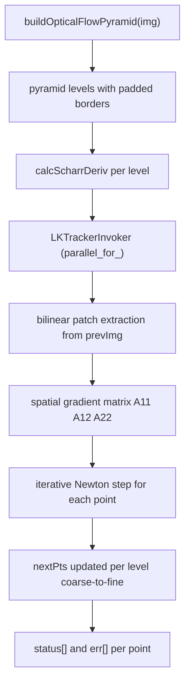
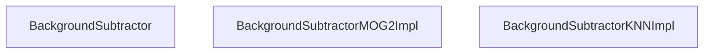
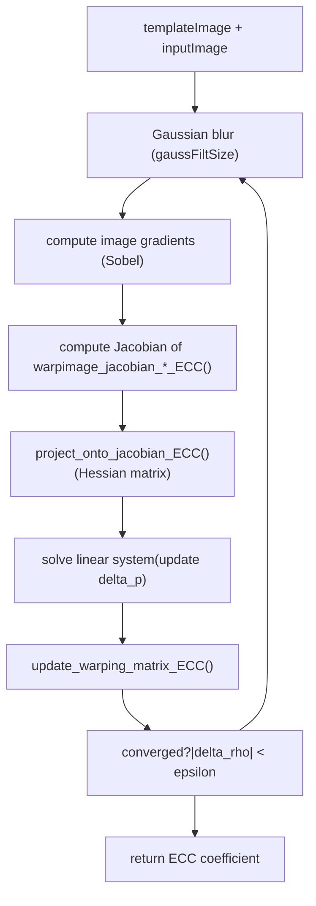

# 视频分析

相关源文件

-   [modules/features2d/src/precomp.hpp](https://github.com/opencv/opencv/blob/91c78f50/modules/features2d/src/precomp.hpp)
-   [modules/imgproc/src/floodfill.cpp](https://github.com/opencv/opencv/blob/91c78f50/modules/imgproc/src/floodfill.cpp)
-   [modules/imgproc/test/test\_floodfill.cpp](https://github.com/opencv/opencv/blob/91c78f50/modules/imgproc/test/test_floodfill.cpp)
-   [modules/video/include/opencv2/video/background\_segm.hpp](https://github.com/opencv/opencv/blob/91c78f50/modules/video/include/opencv2/video/background_segm.hpp)
-   [modules/video/include/opencv2/video/tracking.hpp](https://github.com/opencv/opencv/blob/91c78f50/modules/video/include/opencv2/video/tracking.hpp)
-   [modules/video/perf/opencl/perf\_bgfg\_knn.cpp](https://github.com/opencv/opencv/blob/91c78f50/modules/video/perf/opencl/perf_bgfg_knn.cpp)
-   [modules/video/perf/opencl/perf\_bgfg\_mog2.cpp](https://github.com/opencv/opencv/blob/91c78f50/modules/video/perf/opencl/perf_bgfg_mog2.cpp)
-   [modules/video/perf/opencl/perf\_optflow\_pyrlk.cpp](https://github.com/opencv/opencv/blob/91c78f50/modules/video/perf/opencl/perf_optflow_pyrlk.cpp)
-   [modules/video/perf/perf\_bgfg\_knn.cpp](https://github.com/opencv/opencv/blob/91c78f50/modules/video/perf/perf_bgfg_knn.cpp)
-   [modules/video/perf/perf\_bgfg\_mog2.cpp](https://github.com/opencv/opencv/blob/91c78f50/modules/video/perf/perf_bgfg_mog2.cpp)
-   [modules/video/perf/perf\_bgfg\_utils.hpp](https://github.com/opencv/opencv/blob/91c78f50/modules/video/perf/perf_bgfg_utils.hpp)
-   [modules/video/perf/perf\_ecc.cpp](https://github.com/opencv/opencv/blob/91c78f50/modules/video/perf/perf_ecc.cpp)
-   [modules/video/src/bgfg\_KNN.cpp](https://github.com/opencv/opencv/blob/91c78f50/modules/video/src/bgfg_KNN.cpp)
-   [modules/video/src/bgfg\_gaussmix2.cpp](https://github.com/opencv/opencv/blob/91c78f50/modules/video/src/bgfg_gaussmix2.cpp)
-   [modules/video/src/ecc.cpp](https://github.com/opencv/opencv/blob/91c78f50/modules/video/src/ecc.cpp)
-   [modules/video/src/lkpyramid.cpp](https://github.com/opencv/opencv/blob/91c78f50/modules/video/src/lkpyramid.cpp)
-   [modules/video/src/opencl/bgfg\_knn.cl](https://github.com/opencv/opencv/blob/91c78f50/modules/video/src/opencl/bgfg_knn.cl)
-   [modules/video/src/opencl/bgfg\_mog2.cl](https://github.com/opencv/opencv/blob/91c78f50/modules/video/src/opencl/bgfg_mog2.cl)
-   [modules/video/src/opencl/pyrlk.cl](https://github.com/opencv/opencv/blob/91c78f50/modules/video/src/opencl/pyrlk.cl)
-   [modules/video/src/precomp.hpp](https://github.com/opencv/opencv/blob/91c78f50/modules/video/src/precomp.hpp)
-   [modules/video/test/ocl/test\_bgfg\_mog2.cpp](https://github.com/opencv/opencv/blob/91c78f50/modules/video/test/ocl/test_bgfg_mog2.cpp)
-   [modules/video/test/ocl/test\_optflowpyrlk.cpp](https://github.com/opencv/opencv/blob/91c78f50/modules/video/test/ocl/test_optflowpyrlk.cpp)
-   [modules/video/test/test\_bgfg2.cpp](https://github.com/opencv/opencv/blob/91c78f50/modules/video/test/test_bgfg2.cpp)
-   [modules/video/test/test\_ecc.cpp](https://github.com/opencv/opencv/blob/91c78f50/modules/video/test/test_ecc.cpp)
-   [modules/video/test/test\_estimaterigid.cpp](https://github.com/opencv/opencv/blob/91c78f50/modules/video/test/test_estimaterigid.cpp)
-   [modules/videoio/perf/perf\_camera.impl.hpp](https://github.com/opencv/opencv/blob/91c78f50/modules/videoio/perf/perf_camera.impl.hpp)
-   [modules/videoio/perf/perf\_input.cpp](https://github.com/opencv/opencv/blob/91c78f50/modules/videoio/perf/perf_input.cpp)
-   [samples/cpp/image\_alignment.cpp](https://github.com/opencv/opencv/blob/91c78f50/samples/cpp/image_alignment.cpp)
-   [samples/python/background\_subtractor\_mask.py](https://github.com/opencv/opencv/blob/91c78f50/samples/python/background_subtractor_mask.py)

`opencv_video` 模块提供用于分析视频帧间运动与外观变化的算法。其覆盖三大方向：**光流**（稀疏与稠密）、**背景/前景分割**、以及**目标跟踪**（mean-shift、CAMshift、Kalman 滤波）。同时还包含 ECC 图像对齐算法，用于估计图像间几何变换。

本页覆盖 `modules/video` 源码树。关于 GPU 加速光流实现，参见 [GPU-Accelerated Image Processing and Optical Flow](/opencv/opencv/14.2-gpu-accelerated-image-processing-and-optical-flow)。关于视频采集与解码，参见 [Video Capture and Backend Architecture](/opencv/opencv/7.2-video-capture-and-backend-architecture)。

---

## 模块结构

该模块暴露两个主要头文件：

| 头文件 | 内容 |
| --- | --- |
| `modules/video/include/opencv2/video/tracking.hpp` | 光流、Kalman filter、ECC、meanShift、CamShift |
| `modules/video/include/opencv2/video/background_segm.hpp` | 背景减除接口与工厂函数 |

关键源文件：

| 源文件 | 用途 |
| --- | --- |
| `modules/video/src/lkpyramid.cpp` | Lucas-Kanade 金字塔光流 |
| `modules/video/src/bgfg_gaussmix2.cpp` | MOG2 背景减除器 |
| `modules/video/src/bgfg_KNN.cpp` | KNN 背景减除器 |
| `modules/video/src/ecc.cpp` | ECC 图像对齐 |
| `modules/video/src/opencl/pyrlk.cl` | LK 光流的 OpenCL 内核 |
| `modules/video/src/opencl/bgfg_mog2.cl` | MOG2 的 OpenCL 内核 |
| `modules/video/src/opencl/bgfg_knn.cl` | KNN 的 OpenCL 内核 |

---

## 类层级

**标题：opencv\_video 公共类层级**


Sources: [modules/video/include/opencv2/video/tracking.hpp509-585](https://github.com/opencv/opencv/blob/91c78f50/modules/video/include/opencv2/video/tracking.hpp#L509-L585) [modules/video/include/opencv2/video/background\_segm.hpp55-339](https://github.com/opencv/opencv/blob/91c78f50/modules/video/include/opencv2/video/background_segm.hpp#L55-L339)

---

## 光流

光流用于估计相邻两帧之间的像素运动。该模块提供稀疏（点级）与稠密（全像素）两类实现。

### 稀疏：Lucas-Kanade 金字塔（`calcOpticalFlowPyrLK`）

`calcOpticalFlowPyrLK` 使用图像金字塔中的迭代 Lucas-Kanade 方法，在帧间跟踪一组稀疏点。

**签名**（[modules/video/include/opencv2/video/tracking.hpp181-186](https://github.com/opencv/opencv/blob/91c78f50/modules/video/include/opencv2/video/tracking.hpp#L181-L186)）：

```
calcOpticalFlowPyrLK(prevImg, nextImg, prevPts, nextPts,
                     status, err,
                     winSize=Size(21,21), maxLevel=3,
                     criteria=TermCriteria(...),
                     flags=0, minEigThreshold=1e-4)
```
**关键标志**（定义于 [modules/video/include/opencv2/video/tracking.hpp59-62](https://github.com/opencv/opencv/blob/91c78f50/modules/video/include/opencv2/video/tracking.hpp#L59-L62)）：

| 标志 | 值 | 含义 |
| --- | --- | --- |
| `OPTFLOW_USE_INITIAL_FLOW` | 4 | 使用 `nextPts` 作为初始估计 |
| `OPTFLOW_LK_GET_MIN_EIGENVALS` | 8 | 使用最小特征值作为误差度量 |

**标题：calcOpticalFlowPyrLK 内部数据流**


Sources: [modules/video/src/lkpyramid.cpp747-843](https://github.com/opencv/opencv/blob/91c78f50/modules/video/src/lkpyramid.cpp#L747-L843) [modules/video/src/lkpyramid.cpp157-745](https://github.com/opencv/opencv/blob/91c78f50/modules/video/src/lkpyramid.cpp#L157-L745)

#### 金字塔构建：`buildOpticalFlowPyramid`

`buildOpticalFlowPyramid`（[modules/video/src/lkpyramid.cpp747-843](https://github.com/opencv/opencv/blob/91c78f50/modules/video/src/lkpyramid.cpp#L747-L843)）构建可在多次 `calcOpticalFlowPyrLK` 调用间复用的图像金字塔。每个金字塔层存储下采样图像，并可选存储其 Scharr 导数；同时添加 `winSize` 像素边界，以支持边缘处有效补丁读取。

-   返回实际构建层数（若图像过小，可能少于 `maxLevel`）。
-   预计算导数可避免在连续帧中使用同一金字塔时重复计算。

#### `LKTrackerInvoker`

核心跟踪逻辑位于 `LKTrackerInvoker::operator()`（[modules/video/src/lkpyramid.cpp187-745](https://github.com/opencv/opencv/blob/91c78f50/modules/video/src/lkpyramid.cpp#L187-L745)），并通过 `parallel_for_` 调度。对每个跟踪点：

1.  使用双线性插值从 `prevImg` 与 `derivI` 中提取图像补丁和梯度补丁。
2.  累积 2×2 空间梯度矩阵（`A11`、`A12`、`A22`）。
3.  将最小特征值与 `minEigThreshold` 比较；低于阈值则标记该点失败。
4.  迭代：计算图像差分 `b1`、`b2`，求解线性系统，更新点位置。
5.  当位移小于 `criteria.epsilon` 或达到 `criteria.maxCount` 次迭代时停止。

SIMD 加速通过 `CV_SIMD128` 路径实现（[modules/video/src/lkpyramid.cpp83-155](https://github.com/opencv/opencv/blob/91c78f50/modules/video/src/lkpyramid.cpp#L83-L155)），ARM 平台通过 NEON 路径实现（[modules/video/src/lkpyramid.cpp278-459](https://github.com/opencv/opencv/blob/91c78f50/modules/video/src/lkpyramid.cpp#L278-L459)）。

#### OpenCL 路径

具体 `Algorithm` 子类 `SparsePyrLKOpticalFlowImpl`（[modules/video/src/lkpyramid.cpp849](https://github.com/opencv/opencv/blob/91c78f50/modules/video/src/lkpyramid.cpp#L849-LNaN)）包含 `#ifdef HAVE_OPENCL` 分支。启用 OpenCL 时，每个金字塔层由 [modules/video/src/opencl/pyrlk.cl](https://github.com/opencv/opencv/blob/91c78f50/modules/video/src/opencl/pyrlk.cl) 中的内核处理。该内核使用 `cl_khr_image2d_from_buffer` 进行对齐的 pitch 访问，并在设备端完成 LK 迭代。

---

### 稠密：Farneback（`calcOpticalFlowFarneback`）

`calcOpticalFlowFarneback`（[modules/video/include/opencv2/video/tracking.hpp226-229](https://github.com/opencv/opencv/blob/91c78f50/modules/video/include/opencv2/video/tracking.hpp#L226-L229)）为每个像素计算稠密流场。它使用多项式近似局部图像邻域，并最小化帧间多项式系数差异。

**关键参数：**

| 参数 | 典型值 | 影响 |
| --- | --- | --- |
| `pyr_scale` | 0.5 | 金字塔层间缩放 |
| `levels` | 3–5 | 金字塔层数 |
| `winsize` | 13–25 | 平均窗口；更大=更稳健、也更模糊 |
| `poly_n` | 5 或 7 | 多项式邻域大小 |
| `poly_sigma` | 1.1–1.5 | 多项式基函数的高斯 sigma |
| `OPTFLOW_FARNEBACK_GAUSSIAN` | flag | 使用高斯滤波替代方框滤波 |

输出为 `CV_32FC2` `Mat`，每个像素存储位移 `(u, v)`。

`FarnebackOpticalFlow` 类（[modules/video/include/opencv2/video/tracking.hpp549-585](https://github.com/opencv/opencv/blob/91c78f50/modules/video/include/opencv2/video/tracking.hpp#L549-L585)）提供面向对象封装，带 getter/setter 属性，可由 Python/Java 绑定访问。

---

### 稠密：DIS 光流（`DISOpticalFlow`）

`DISOpticalFlow`（[modules/video/include/opencv2/video/tracking.hpp](https://github.com/opencv/opencv/blob/91c78f50/modules/video/include/opencv2/video/tracking.hpp)）通过 `DISOpticalFlow::create(preset)` 创建，实现 Dense Inverse Search 算法。提供三个预设级别：

| 预设 | 速度/质量 |
| --- | --- |
| `PRESET_ULTRAFAST` | 最快，精度最低 |
| `PRESET_FAST` | 均衡 |
| `PRESET_MEDIUM` | 默认；质量最佳 |

---

### 变分细化（`VariationalRefinement`）

`VariationalRefinement` 通过最小化变分能量泛函来细化预先计算的稠密流场。通常接在 `FarnebackOpticalFlow` 或 `DISOpticalFlow` 之后。

---

### 光流文件 I/O

模块提供两种用于光流基准中 `.flo` 文件格式的工具函数：

-   `readOpticalFlow(path)` → `Mat` (CV\_32FC2)
-   `writeOpticalFlow(path, flow)` → `bool`

声明于 [modules/video/include/opencv2/video/tracking.hpp494-505](https://github.com/opencv/opencv/blob/91c78f50/modules/video/include/opencv2/video/tracking.hpp#L494-L505)

---

## 背景减除

背景减除器为每个像素维护“背景”模型，并将新帧像素分类为前景或背景。

**标题：BackgroundSubtractor 接口与实现**


Sources: [modules/video/include/opencv2/video/background\_segm.hpp55-339](https://github.com/opencv/opencv/blob/91c78f50/modules/video/include/opencv2/video/background_segm.hpp#L55-L339) [modules/video/src/bgfg\_gaussmix2.cpp121-405](https://github.com/opencv/opencv/blob/91c78f50/modules/video/src/bgfg_gaussmix2.cpp#L121-L405) [modules/video/src/bgfg\_KNN.cpp67-278](https://github.com/opencv/opencv/blob/91c78f50/modules/video/src/bgfg_KNN.cpp#L67-L278)

### `BackgroundSubtractorMOG2`

实现 Zivkovic（2004, 2006）提出的高斯混合模型。创建方式：

```
Ptr<BackgroundSubtractorMOG2> createBackgroundSubtractorMOG2(
    int history=500, double varThreshold=16, bool detectShadows=true)
```
**逐像素模型：**最多 `nmixtures`（默认 5）个高斯分量，每个分量由权重、均值和单一方差描述。每像素活跃分量数可自适应。

**关键参数**（[modules/video/src/bgfg\_gaussmix2.cpp106-118](https://github.com/opencv/opencv/blob/91c78f50/modules/video/src/bgfg_gaussmix2.cpp#L106-L118)）：

| 参数 | 默认值 | 描述 |
| --- | --- | --- |
| `history` | 500 | 有效学习率 α = 1/history |
| `nmixtures` | 5 | 每像素最大高斯分量数 |
| `varThreshold` | 16.0 | 马氏距离阈值（Tb） |
| `backgroundRatio` | 0.9 | 背景判定的权重和阈值（TB） |
| `varThresholdGen` | 9.0 | 生成新分量阈值（Tg） |
| `varInit` | 15.0 | 新分量初始方差 |
| `fCT` | 0.05 | 复杂度削减先验 |
| `bShadowDetection` | true | 检测阴影并以 127 标记 |
| `fTau` | 0.5 | 阴影暗度阈值 |

**更新机制**（`MOG2Invoker`，[modules/video/src/bgfg\_gaussmix2.cpp541](https://github.com/opencv/opencv/blob/91c78f50/modules/video/src/bgfg_gaussmix2.cpp#L541-LNaN)）：

1.  对每个像素，按权重降序测试所有活跃高斯分量。
2.  若像素匹配某分量（马氏距离² < `varThreshold`），更新其权重与均值；若累计权重超过 `backgroundRatio`，标记为背景。
3.  若无分量匹配，则以 `varInit` 新建分量；若超过 `nmixtures`，裁剪最低权重分量。
4.  可选通过 `detectShadowGMM` 进行阴影分类（[modules/video/src/bgfg\_gaussmix2.cpp480-525](https://github.com/opencv/opencv/blob/91c78f50/modules/video/src/bgfg_gaussmix2.cpp#L480-L525)）。

**OpenCL 路径：**启用 OpenCL 时，`ocl_apply` 调用 [modules/video/src/opencl/bgfg\_mog2.cl](https://github.com/opencv/opencv/blob/91c78f50/modules/video/src/opencl/bgfg_mog2.cl) 中的 `mog2_kernel`。模型数组（`u_weight`、`u_variance`、`u_mean`、`u_bgmodelUsedModes`）存储为 `UMat`。

---

### `BackgroundSubtractorKNN`

实现 K 最近邻背景减除（Zivkovic & van der Heijden, 2006）。创建方式：

```
Ptr<BackgroundSubtractorKNN> createBackgroundSubtractorKNN(
    int history=500, double dist2Threshold=400.0, bool detectShadows=true)
```
与高斯拟合不同，KNN 模型在每像素每时序尺度存储 `nN` 个原始像素样本（默认 7），共短/中/长三个时间尺度。若至少 `nkNN` 个样本的平方距离落在 `dist2Threshold` 以内，则该像素判为背景。

**关键参数**（[modules/video/src/bgfg\_KNN.cpp58-66](https://github.com/opencv/opencv/blob/91c78f50/modules/video/src/bgfg_KNN.cpp#L58-L66)）：

| 参数 | 默认值 | 描述 |
| --- | --- | --- |
| `history` | 500 | 学习率 |
| `nN` | 7 | 每像素每速度模型存储样本数 |
| `nkNN` | ~2 | 判为背景所需最近邻数量 |
| `dist2Threshold` | 400.0 | 平方距离阈值 |
| `bShadowDetection` | true | 阴影检测 |

每像素维护三个环形样本缓冲区（短、中、长），以覆盖多时间尺度运动。OpenCL 加速由 `bgfg_knn.cl` 提供。

---

### `BackgroundSubtractor::apply` 语义

`apply` 每帧调用一次，并原地更新内部模型：

-   `learningRate=-1`：自动选择（预热后 α = 1/history）。
-   `learningRate=0`：模型冻结，不更新。
-   `learningRate=1`：由当前帧完全重初始化。

接受 `knownForegroundMask` 的双参数重载允许调用方对已知前景像素跳过模型更新。

输出掩码取值：

-   `0` = 背景
-   `255` = 前景
-   `127` = 阴影（默认，`detectShadows=true` 时）

---

## 目标跟踪

### meanShift 与 CamShift

两者都基于颜色直方图反投影跟踪目标。

-   `meanShift(probImage, window, criteria)` → 迭代次数
    迭代将 `window` 移动到其内部概率质量均值处。窗口大小与方向固定。

-   `CamShift(probImage, window, criteria)` → `RotatedRect`
    在 `meanShift` 基础上进一步调整窗口大小和方向以拟合目标分布。返回编码位置、尺度和角度的 `RotatedRect`。


声明于 [modules/video/include/opencv2/video/tracking.hpp82-107](https://github.com/opencv/opencv/blob/91c78f50/modules/video/include/opencv2/video/tracking.hpp#L82-L107)

---

### KalmanFilter

`KalmanFilter`（[modules/video/include/opencv2/video/tracking.hpp434-484](https://github.com/opencv/opencv/blob/91c78f50/modules/video/include/opencv2/video/tracking.hpp#L434-L484)）实现离散时间线性 Kalman 滤波。它支持标准线性滤波；也可通过外部修改状态转移和测量矩阵来适配扩展 Kalman 滤波。

**状态变量（均为 `Mat`）：**

| 成员 | 符号 | 描述 |
| --- | --- | --- |
| `statePre` | x′(k) | 预测状态 |
| `statePost` | x(k) | 校正状态 |
| `transitionMatrix` | A | 状态转移 |
| `controlMatrix` | B | 控制输入映射 |
| `measurementMatrix` | H | 观测模型 |
| `processNoiseCov` | Q | 过程噪声协方差 |
| `measurementNoiseCov` | R | 测量噪声协方差 |
| `errorCovPre` | P′(k) | 先验误差协方差 |
| `errorCovPost` | P(k) | 后验误差协方差 |
| `gain` | K(k) | Kalman 增益 |

**预测/校正循环：**

```
const Mat& predict(control)   // x'(k) = A*x(k-1) + B*u
const Mat& correct(measurement)  // x(k) = x'(k) + K*(z - H*x'(k))
```
---

## ECC 图像对齐

`findTransformECC` 通过最大化 Enhanced Correlation Coefficient（ECC）来估计两幅图像之间的几何变换。与基于特征的方法不同，它直接在像素强度上工作。

**标题：findTransformECC 计算流程**


Sources: [modules/video/src/ecc.cpp337](https://github.com/opencv/opencv/blob/91c78f50/modules/video/src/ecc.cpp#L337-LNaN) [modules/video/include/opencv2/video/tracking.hpp314-420](https://github.com/opencv/opencv/blob/91c78f50/modules/video/include/opencv2/video/tracking.hpp#L314-L420)

**运动类型**（[modules/video/include/opencv2/video/tracking.hpp264-269](https://github.com/opencv/opencv/blob/91c78f50/modules/video/include/opencv2/video/tracking.hpp#L264-L269)）：

| 常量 | 值 | DOF | `warpMatrix` 大小 |
| --- | --- | --- | --- |
| `MOTION_TRANSLATION` | 0 | 2 | 2×3 |
| `MOTION_EUCLIDEAN` | 1 | 3 | 2×3 |
| `MOTION_AFFINE` | 2 | 6 | 2×3 |
| `MOTION_HOMOGRAPHY` | 3 | 8 | 3×3 |

Jacobian 计算按运动类型拆分在 [modules/video/src/ecc.cpp50-188](https://github.com/opencv/opencv/blob/91c78f50/modules/video/src/ecc.cpp#L50-L188) 的辅助函数中：

-   `image_jacobian_homo_ECC` —— 单应（8 DOF）
-   `image_jacobian_euclidean_ECC` —— 欧氏/刚体（3 DOF）
-   `image_jacobian_affine_ECC` —— 仿射（6 DOF）
-   `image_jacobian_translation_ECC` —— 平移（2 DOF）

`computeECC`（[modules/video/src/ecc.cpp291-334](https://github.com/opencv/opencv/blob/91c78f50/modules/video/src/ecc.cpp#L291-L334)）是独立函数，用于度量两幅已对齐图像的 ECC 相似度。对无符号整型输入，它会先上转换到有符号类型，再计算零均值点积。

`findTransformECCWithMask`（[modules/video/include/opencv2/video/tracking.hpp377-420](https://github.com/opencv/opencv/blob/91c78f50/modules/video/include/opencv2/video/tracking.hpp#L377-L420)）在 `findTransformECC` 基础上支持模板图与输入图的独立有效掩码。每次迭代都会将输入掩码变换到模板坐标系，并与模板掩码求交。

---

## OpenCL 加速摘要

| 算法 | OpenCL 内核 | 激活点 |
| --- | --- | --- |
| LK 光流 | `modules/video/src/opencl/pyrlk.cl` | `SparsePyrLKOpticalFlowImpl::sparse()` 且 `ocl::isOpenCLActivated()` |
| MOG2 | `modules/video/src/opencl/bgfg_mog2.cl` | `BackgroundSubtractorMOG2Impl::ocl_apply()` |
| KNN | `modules/video/src/opencl/bgfg_knn.cl` | `BackgroundSubtractorKNNImpl::ocl_apply()` |

若 OpenCL 不可用或内核编译失败，这三者都会回退到 CPU 路径。MOG2 与 KNN 在 OpenCL 激活时将模型数据保存在 `UMat`（`u_weight`、`u_variance`、`u_mean` 等）中，以避免主机-设备传输。

---

## 子页面引用

各子系统详细文档见：

-   [Optical Flow and Object Tracking](/opencv/opencv/16.1-optical-flow-and-object-tracking) —— 深入讲解 `calcOpticalFlowPyrLK`、`calcOpticalFlowFarneback`、`KalmanFilter`、meanShift 与 CamShift 内部机制。
-   [Background Subtraction](/opencv/opencv/16.2-background-subtraction) —— MOG2 与 KNN 的详细参数说明及增量更新机制。
