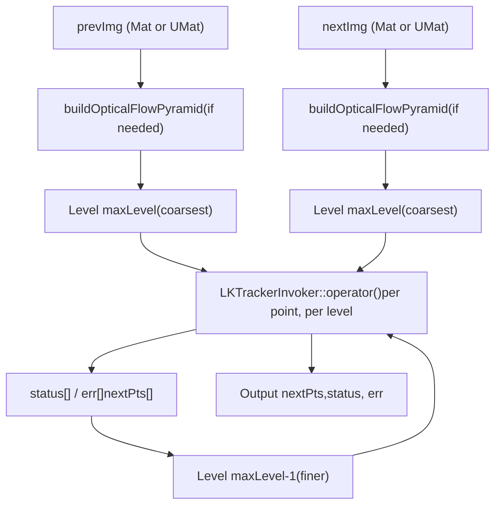
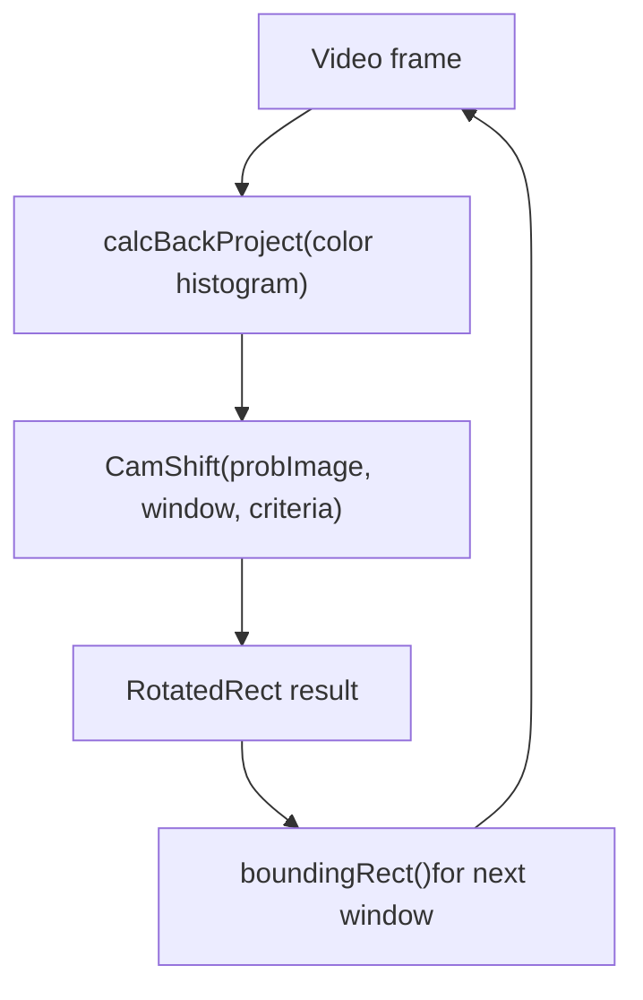
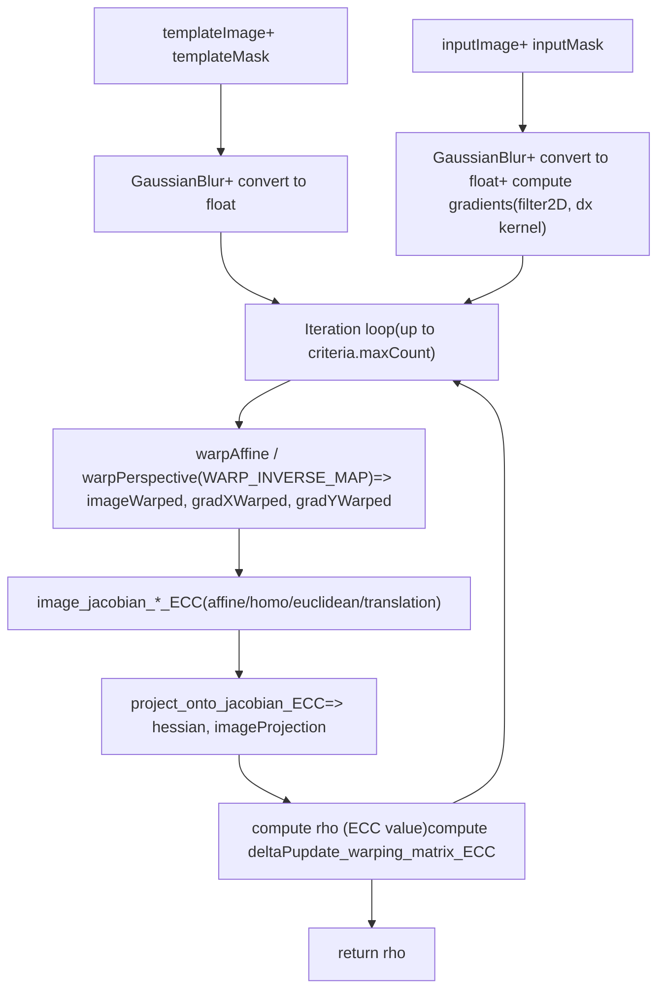
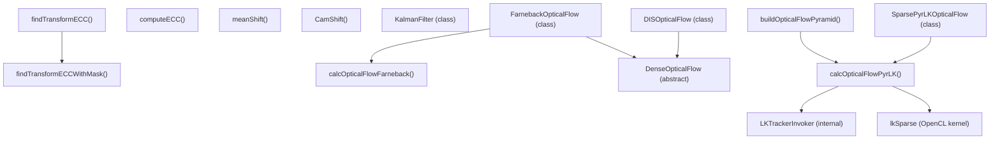

# 光流与目标跟踪

相关源文件

-   [modules/features2d/src/precomp.hpp](https://github.com/opencv/opencv/blob/91c78f50/modules/features2d/src/precomp.hpp)
-   [modules/video/include/opencv2/video/tracking.hpp](https://github.com/opencv/opencv/blob/91c78f50/modules/video/include/opencv2/video/tracking.hpp)
-   [modules/video/perf/opencl/perf\_optflow\_pyrlk.cpp](https://github.com/opencv/opencv/blob/91c78f50/modules/video/perf/opencl/perf_optflow_pyrlk.cpp)
-   [modules/video/perf/perf\_ecc.cpp](https://github.com/opencv/opencv/blob/91c78f50/modules/video/perf/perf_ecc.cpp)
-   [modules/video/src/ecc.cpp](https://github.com/opencv/opencv/blob/91c78f50/modules/video/src/ecc.cpp)
-   [modules/video/src/lkpyramid.cpp](https://github.com/opencv/opencv/blob/91c78f50/modules/video/src/lkpyramid.cpp)
-   [modules/video/src/opencl/pyrlk.cl](https://github.com/opencv/opencv/blob/91c78f50/modules/video/src/opencl/pyrlk.cl)
-   [modules/video/src/precomp.hpp](https://github.com/opencv/opencv/blob/91c78f50/modules/video/src/precomp.hpp)
-   [modules/video/test/ocl/test\_optflowpyrlk.cpp](https://github.com/opencv/opencv/blob/91c78f50/modules/video/test/ocl/test_optflowpyrlk.cpp)
-   [modules/video/test/test\_ecc.cpp](https://github.com/opencv/opencv/blob/91c78f50/modules/video/test/test_ecc.cpp)
-   [modules/video/test/test\_estimaterigid.cpp](https://github.com/opencv/opencv/blob/91c78f50/modules/video/test/test_estimaterigid.cpp)
-   [samples/cpp/image\_alignment.cpp](https://github.com/opencv/opencv/blob/91c78f50/samples/cpp/image_alignment.cpp)

## 目的与范围

本页记录 `opencv_video` 模块中的光流与目标跟踪能力，涵盖稀疏与稠密光流算法、Kalman 滤波器、meanShift/CAMShift 跟踪器，以及 Enhanced Correlation Coefficient（ECC）图像对齐算法。

背景减除（同属 `opencv_video`）在 [Background Subtraction](/opencv/opencv/16.2-background-subtraction) 中单独介绍。光流的 GPU 加速变体（CUDA PyrLK 与 Farneback）记录于 [GPU-Accelerated Image Processing and Optical Flow](/opencv/opencv/14.2-gpu-accelerated-image-processing-and-optical-flow)。用于初始化光流的特征检测器（如 `goodFeaturesToTrack`）属于 [Feature Detectors and Descriptors](/opencv/opencv/6.1-feature-detectors-and-descriptors)。

---

## 公共 API 概览

所有公共声明都位于：

[modules/video/include/opencv2/video/tracking.hpp1-630](https://github.com/opencv/opencv/blob/91c78f50/modules/video/include/opencv2/video/tracking.hpp#L1-L630)

**类层级与自由函数：**

Sources: [modules/video/include/opencv2/video/tracking.hpp509-630](https://github.com/opencv/opencv/blob/91c78f50/modules/video/include/opencv2/video/tracking.hpp#L509-L630)

**自由函数摘要：**

| 函数 | 用途 |
| --- | --- |
| `buildOpticalFlowPyramid` | 为 `calcOpticalFlowPyrLK` 预构建图像金字塔 |
| `calcOpticalFlowPyrLK` | 稀疏 LK 光流（金字塔） |
| `calcOpticalFlowFarneback` | 稠密光流（Farneback） |
| `meanShift` | 迭代 mean-shift 跟踪器 |
| `CamShift` | 自适应窗口 mean-shift 跟踪器 |
| `findTransformECC` | 基于 ECC 的图像对齐 |
| `findTransformECCWithMask` | 带逐图掩码的 ECC 对齐 |
| `computeECC` | 计算增强相关系数 |
| `readOpticalFlow` / `writeOpticalFlow` | `.flo` 文件 I/O |

Sources: [modules/video/include/opencv2/video/tracking.hpp59-506](https://github.com/opencv/opencv/blob/91c78f50/modules/video/include/opencv2/video/tracking.hpp#L59-L506)

---

## 稀疏光流：Lucas-Kanade（PyrLK）

### 算法

该实现遵循金字塔 Lucas-Kanade 方法（Bouguet 2000）。对每个跟踪点，会在前一帧图像的搜索窗口内构建 2×2 空间梯度矩阵，然后通过迭代 Newton-Raphson 步移动下一帧中的对应窗口，直到收敛或达到最大迭代次数。金字塔机制通过由粗到细求解来支持大位移跟踪。

**`calcOpticalFlowPyrLK` 数据流：**


Sources: [modules/video/src/lkpyramid.cpp747-843](https://github.com/opencv/opencv/blob/91c78f50/modules/video/src/lkpyramid.cpp#L747-L843) [modules/video/src/lkpyramid.cpp187-745](https://github.com/opencv/opencv/blob/91c78f50/modules/video/src/lkpyramid.cpp#L187-L745)

### `buildOpticalFlowPyramid`

[modules/video/src/lkpyramid.cpp747-843](https://github.com/opencv/opencv/blob/91c78f50/modules/video/src/lkpyramid.cpp#L747-L843)

签名：

```
int buildOpticalFlowPyramid(    InputArray img, OutputArrayOfArrays pyramid,    Size winSize, int maxLevel,    bool withDerivatives = true,    int pyrBorder = BORDER_REFLECT_101,    int derivBorder = BORDER_CONSTANT,    bool tryReuseInputImage = true);
```
-   分配长度为 `(maxLevel + 1) * pyrstep` 的 `Mat` 向量；当 `withDerivatives = true` 时 `pyrstep = 2`（每层图像 + 导数），否则为 `1`。
-   每层四周都会填充 `winSize` 像素，避免跟踪期间逐像素做边界检查。
-   Scharr 导数通过文件内局部函数 `calcScharrDeriv` 计算（同样用 `parallel_for_` + `ScharrDerivInvoker` 并行）。
-   返回实际构建层数（若图像小于 `winSize`，可能少于 `maxLevel`）。

Sources: [modules/video/src/lkpyramid.cpp747-843](https://github.com/opencv/opencv/blob/91c78f50/modules/video/src/lkpyramid.cpp#L747-L843)

### `calcOpticalFlowPyrLK`

[modules/video/include/opencv2/video/tracking.hpp181-186](https://github.com/opencv/opencv/blob/91c78f50/modules/video/include/opencv2/video/tracking.hpp#L181-L186)

关键参数：

| 参数 | 默认值 | 含义 |
| --- | --- | --- |
| `winSize` | `Size(21,21)` | 每个金字塔层级的搜索窗口 |
| `maxLevel` | `3` | 最大金字塔层级（0 = 不使用金字塔） |
| `criteria` | COUNT+EPS, 30, 0.01 | 迭代停止条件 |
| `flags` | `0` | `OPTFLOW_USE_INITIAL_FLOW`, `OPTFLOW_LK_GET_MIN_EIGENVALS` |
| `minEigThreshold` | `1e-4` | 最小特征值低于此阈值的点会被拒绝 |

`status[i]` 在以下情形会置 `0`（点被拒绝）：

-   该点在任意金字塔层级超出图像边界。
-   2×2 空间梯度矩阵接近奇异（最小特征值 < `minEigThreshold`）。

`err[i]` 默认输出 L1 补丁差；当设置 `OPTFLOW_LK_GET_MIN_EIGENVALS` 时输出最小特征值。

Sources: [modules/video/include/opencv2/video/tracking.hpp130-186](https://github.com/opencv/opencv/blob/91c78f50/modules/video/include/opencv2/video/tracking.hpp#L130-L186) [modules/video/src/lkpyramid.cpp187-745](https://github.com/opencv/opencv/blob/91c78f50/modules/video/src/lkpyramid.cpp#L187-L745)

### 面向对象接口：`SparsePyrLKOpticalFlow`

`SparsePyrLKOpticalFlow` 是 `calcOpticalFlowPyrLK` 的面向对象封装。通过静态工厂实例化：

```
auto lk = SparsePyrLKOpticalFlow::create(winSize, maxLevel, criteria, flags, minEigThreshold);lk->calc(prevImg, nextImg, prevPts, nextPts, status, err);
```
具体实现是 `SparsePyrLKOpticalFlowImpl`（位于 `lkpyramid.cpp` 的匿名命名空间）。它会根据输入是否为 `UMat` 以及 OpenCL 可用性，在 OpenCL 路径与 CPU `parallel_for_` 路径之间选择。

Sources: [modules/video/src/lkpyramid.cpp849-867](https://github.com/opencv/opencv/blob/91c78f50/modules/video/src/lkpyramid.cpp#L849-L867) [modules/video/include/opencv2/video/tracking.hpp527-544](https://github.com/opencv/opencv/blob/91c78f50/modules/video/include/opencv2/video/tracking.hpp#L527-L544)

### OpenCL 加速

输入为 `UMat` 时，OpenCL 路径使用如下文件中定义的 `lkSparse` 内核：

[modules/video/src/opencl/pyrlk.cl301-558](https://github.com/opencv/opencv/blob/91c78f50/modules/video/src/opencl/pyrlk.cl#L301-L558)

该内核为每个跟踪点分配一个 work-group。每个 work-group 会把前一帧的 `(winSize × winSize)` 补丁读入本地内存，在本地内存中计算 Scharr 导数、组装 2×2 梯度矩阵（A11、A12、A22），并使用通过 2D sampler 访问的下一帧图像（支持子像素线性插值）执行 Newton-Raphson 迭代。

本地内存 tile 尺寸为 `LM_W × LM_H`（其中 `LM_W = LSx*GRIDSIZE+2`，`LSx = 8`），用于提供导数计算所需的边界像素，避免额外全局读取。

Sources: [modules/video/src/opencl/pyrlk.cl48-558](https://github.com/opencv/opencv/blob/91c78f50/modules/video/src/opencl/pyrlk.cl#L48-L558)

### 内部并行性

在 CPU 路径上，`LKTrackerInvoker` 是 `ParallelLoopBody` 子类，通过 `parallel_for_` 在跟踪点范围上并行调度。SIMD 加速同时覆盖 SSE/AVX（通过 `v_int16x8` 通用 intrinsic）与 NEON 路径。

[modules/video/src/lkpyramid.cpp157-177](https://github.com/opencv/opencv/blob/91c78f50/modules/video/src/lkpyramid.cpp#L157-L177)

Sources: [modules/video/src/lkpyramid.cpp157-745](https://github.com/opencv/opencv/blob/91c78f50/modules/video/src/lkpyramid.cpp#L157-L745)

---

## 稠密光流：Farneback

### `calcOpticalFlowFarneback`

为输入图像每个像素计算运动，生成 `CV_32FC2` 流场，其中 `flow(y,x)[0]` 是水平位移，`flow(y,x)[1]` 是垂直位移。

```
void calcOpticalFlowFarneback(    InputArray prev, InputArray next, InputOutputArray flow,    double pyr_scale, int levels, int winsize,    int iterations, int poly_n, double poly_sigma, int flags);
```
关键参数：

| 参数 | 典型值 | 含义 |
| --- | --- | --- |
| `pyr_scale` | 0.5 | 金字塔层间缩放 |
| `levels` | 3–5 | 金字塔层数 |
| `winsize` | 13–25 | 平均窗口（越大越稳健，也更模糊） |
| `poly_n` | 5 或 7 | 多项式展开邻域 |
| `poly_sigma` | 1.1（n=5），1.5（n=7） | 多项式展开的高斯 sigma |
| `OPTFLOW_FARNEBACK_GAUSSIAN` flag | — | 使用高斯滤波而非方框滤波 |

Sources: [modules/video/include/opencv2/video/tracking.hpp188-229](https://github.com/opencv/opencv/blob/91c78f50/modules/video/include/opencv2/video/tracking.hpp#L188-L229)

### `FarnebackOpticalFlow` 类

Farneback 算法的面向对象接口。通过 getter/setter 暴露属性，并提供静态 `create()` 工厂：

```
auto farn = FarnebackOpticalFlow::create(5, 0.5, false, 13, 10, 5, 1.1, 0);farn->calc(prev, next, flow);
```
Sources: [modules/video/include/opencv2/video/tracking.hpp549-585](https://github.com/opencv/opencv/blob/91c78f50/modules/video/include/opencv2/video/tracking.hpp#L549-L585)

### DIS 光流

`DISOpticalFlow`（Dense Inverse Search）是另一种 `DenseOpticalFlow` 子类，可通过 `DISOpticalFlow::create(preset)` 获取，预设包括 `PRESET_ULTRAFAST`、`PRESET_FAST`、`PRESET_MEDIUM`。

Sources: [modules/video/include/opencv2/video/tracking.hpp590-640](https://github.com/opencv/opencv/blob/91c78f50/modules/video/include/opencv2/video/tracking.hpp#L590-L640)

### 光流文件 I/O

```
Mat readOpticalFlow(const String& path);         // reads .flo file -> CV_32FC2 Matbool writeOpticalFlow(const String& path, InputArray flow); // writes CV_32FC2 Mat -> .flo file
```
Sources: [modules/video/include/opencv2/video/tracking.hpp487-505](https://github.com/opencv/opencv/blob/91c78f50/modules/video/include/opencv2/video/tracking.hpp#L487-L505)

---

## MeanShift 与 CAMShift 跟踪器

两者都作用于概率（反投影）图像，该图通常由目标区域颜色直方图通过 `calcBackProject` 生成。

### `meanShift`

```
int meanShift(InputArray probImage, CV_IN_OUT Rect& window, TermCriteria criteria);
```
迭代将 `window` 移动到窗口内概率质量的质心。返回迭代次数。窗口大小不变。

### `CamShift`

```
RotatedRect CamShift(InputArray probImage, CV_IN_OUT Rect& window, TermCriteria criteria);
```
内部先调用 `meanShift` 找中心，再调整窗口大小与方向以匹配概率分布形状。返回编码位置、尺寸与朝向的 `RotatedRect`。该输出 `RotatedRect` 的外接矩形可作为下一帧初始窗口。

**典型 CamShift 跟踪循环：**


Sources: [modules/video/include/opencv2/video/tracking.hpp64-107](https://github.com/opencv/opencv/blob/91c78f50/modules/video/include/opencv2/video/tracking.hpp#L64-L107)

---

## Kalman 滤波器

### 类：`KalmanFilter`

[modules/video/include/opencv2/video/tracking.hpp434-484](https://github.com/opencv/opencv/blob/91c78f50/modules/video/include/opencv2/video/tracking.hpp#L434-L484)

实现标准离散 Kalman 滤波器。也可在调用间直接修改矩阵成员，将其用作扩展 Kalman 滤波器。

**矩阵与作用：**

| 矩阵成员 | 符号 | 作用 |
| --- | --- | --- |
| `transitionMatrix` | A | 状态转移：`x'(k) = A·x(k-1) + B·u(k)` |
| `controlMatrix` | B | 控制输入映射（可选） |
| `measurementMatrix` | H | 将状态映射到观测空间 |
| `processNoiseCov` | Q | 过程噪声协方差 |
| `measurementNoiseCov` | R | 测量噪声协方差 |
| `errorCovPre` | P' | 先验误差协方差 |
| `errorCovPost` | P | 后验误差协方差 |
| `gain` | K | Kalman 增益 |
| `statePre` | x'(k) | 预测状态 |
| `statePost` | x(k) | 校正状态 |

**每帧两步用法：**

> **[Mermaid sequence]**
> *(图表结构无法解析)*

-   `predict()` 计算 `x'(k) = A·x(k-1) + B·u`，`P'(k) = A·P(k-1)·Aᵀ + Q`。
-   `correct(z)` 计算增益 `K = P'·Hᵀ·inv(H·P'·Hᵀ + R)`，再计算 `x(k) = x'(k) + K·(z - H·x'(k))`，`P(k) = (I - K·H)·P'(k)`。

Sources: [modules/video/include/opencv2/video/tracking.hpp426-484](https://github.com/opencv/opencv/blob/91c78f50/modules/video/include/opencv2/video/tracking.hpp#L426-L484)

---

## ECC 图像对齐

### 概述

Enhanced Correlation Coefficient（ECC）算法寻找几何变换 `W`，使模板图像与输入图像变换版本之间的归一化相关最大。与基于特征的方法不同，它是区域法，并且对光照变化更具容忍度。

实现位于：

[modules/video/src/ecc.cpp1-629](https://github.com/opencv/opencv/blob/91c78f50/modules/video/src/ecc.cpp#L1-L629)

### 函数

```
double findTransformECC(    InputArray templateImage, InputArray inputImage,    InputOutputArray warpMatrix, int motionType,    TermCriteria criteria, InputArray inputMask, int gaussFiltSize); double findTransformECCWithMask(    InputArray templateImage, InputArray inputImage,    InputArray templateMask, InputArray inputMask,    InputOutputArray warpMatrix, int motionType,    TermCriteria criteria, int gaussFiltSize); double computeECC(    InputArray templateImage, InputArray inputImage,    InputArray inputMask = noArray());
```
`findTransformECC` 返回最终 ECC 值（`[-1, 1]`）。当算法发散（相关性被最小化）时会抛出异常。

### 运动类型

| 常量 | `motionType` 值 | `warpMatrix` 形状 | 自由参数 |
| --- | --- | --- | --- |
| `MOTION_TRANSLATION` | 0 | 2×3 | 2 |
| `MOTION_EUCLIDEAN` | 1 | 2×3 | 3 |
| `MOTION_AFFINE` | 2 | 2×3 | 6 |
| `MOTION_HOMOGRAPHY` | 3 | 3×3 | 8 |

Sources: [modules/video/include/opencv2/video/tracking.hpp263-376](https://github.com/opencv/opencv/blob/91c78f50/modules/video/include/opencv2/video/tracking.hpp#L263-L376)

### 内部迭代循环

**ECC 算法数据流：**


四个 `image_jacobian_*_ECC` 静态函数（[modules/video/src/ecc.cpp50-188](https://github.com/opencv/opencv/blob/91c78f50/modules/video/src/ecc.cpp#L50-L188)）按运动类型计算变换图像相对参数的 Jacobian。`project_onto_jacobian_ECC`（[modules/video/src/ecc.cpp190-228](https://github.com/opencv/opencv/blob/91c78f50/modules/video/src/ecc.cpp#L190-L228)）实现 Hessian 与误差投影所需的内积计算。

Sources: [modules/video/src/ecc.cpp337-612](https://github.com/opencv/opencv/blob/91c78f50/modules/video/src/ecc.cpp#L337-L612)

---

## 光流标志

定义于 `tracking.hpp`：

[modules/video/include/opencv2/video/tracking.hpp59-62](https://github.com/opencv/opencv/blob/91c78f50/modules/video/include/opencv2/video/tracking.hpp#L59-L62)

| 标志 | 值 | 效果 |
| --- | --- | --- |
| `OPTFLOW_USE_INITIAL_FLOW` | 4 | 在 `calcOpticalFlowPyrLK` 或 `findTransformECC` 中将 `nextPts` 作为初始估计 |
| `OPTFLOW_LK_GET_MIN_EIGENVALS` | 8 | 在 `err` 输出中报告梯度矩阵最小特征值 |
| `OPTFLOW_FARNEBACK_GAUSSIAN` | 256 | 在 `calcOpticalFlowFarneback` 中使用高斯滤波（非方框） |

---

## 代码实体汇总


Sources: [modules/video/include/opencv2/video/tracking.hpp1-630](https://github.com/opencv/opencv/blob/91c78f50/modules/video/include/opencv2/video/tracking.hpp#L1-L630) [modules/video/src/lkpyramid.cpp1-843](https://github.com/opencv/opencv/blob/91c78f50/modules/video/src/lkpyramid.cpp#L1-L843) [modules/video/src/ecc.cpp1-629](https://github.com/opencv/opencv/blob/91c78f50/modules/video/src/ecc.cpp#L1-L629) [modules/video/src/opencl/pyrlk.cl301-558](https://github.com/opencv/opencv/blob/91c78f50/modules/video/src/opencl/pyrlk.cl#L301-L558)
