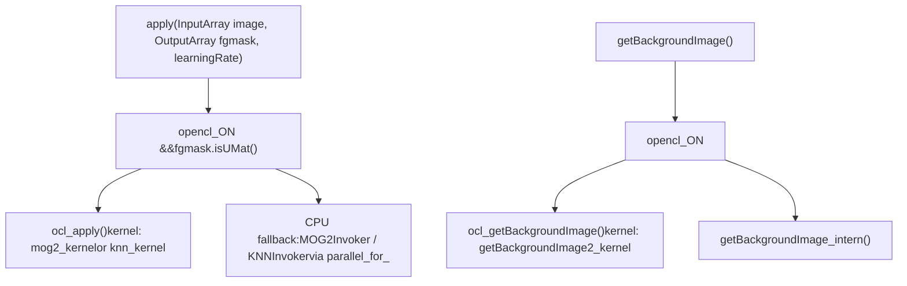
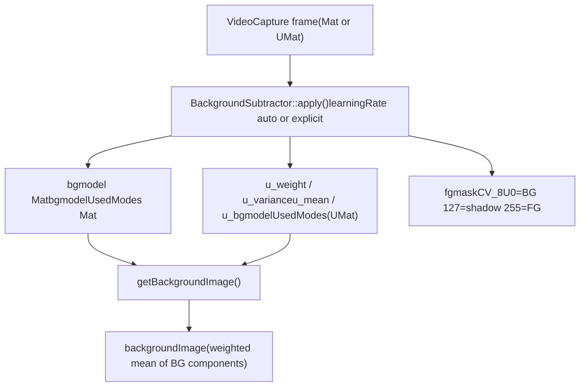

# 背景扣除 (Background Subtraction)

相关源文件

-   [modules/imgproc/src/floodfill.cpp](https://github.com/opencv/opencv/blob/91c78f50/modules/imgproc/src/floodfill.cpp)
-   [modules/imgproc/test/test\_floodfill.cpp](https://github.com/opencv/opencv/blob/91c78f50/modules/imgproc/test/test_floodfill.cpp)
-   [modules/video/include/opencv2/video/background\_segm.hpp](https://github.com/opencv/opencv/blob/91c78f50/modules/video/include/opencv2/video/background_segm.hpp)
-   [modules/video/perf/opencl/perf\_bgfg\_knn.cpp](https://github.com/opencv/opencv/blob/91c78f50/modules/video/perf/opencl/perf_bgfg_knn.cpp)
-   [modules/video/perf/opencl/perf\_bgfg\_mog2.cpp](https://github.com/opencv/opencv/blob/91c78f50/modules/video/perf/opencl/perf_bgfg_mog2.cpp)
-   [modules/video/perf/perf\_bgfg\_knn.cpp](https://github.com/opencv/opencv/blob/91c78f50/modules/video/perf/perf_bgfg_knn.cpp)
-   [modules/video/perf/perf\_bgfg\_mog2.cpp](https://github.com/opencv/opencv/blob/91c78f50/modules/video/perf/perf_bgfg_mog2.cpp)
-   [modules/video/perf/perf\_bgfg\_utils.hpp](https://github.com/opencv/opencv/blob/91c78f50/modules/video/perf/perf_bgfg_utils.hpp)
-   [modules/video/src/bgfg\_KNN.cpp](https://github.com/opencv/opencv/blob/91c78f50/modules/video/src/bgfg_KNN.cpp)
-   [modules/video/src/bgfg\_gaussmix2.cpp](https://github.com/opencv/opencv/blob/91c78f50/modules/video/src/bgfg_gaussmix2.cpp)
-   [modules/video/src/opencl/bgfg\_knn.cl](https://github.com/opencv/opencv/blob/91c78f50/modules/video/src/opencl/bgfg_knn.cl)
-   [modules/video/src/opencl/bgfg\_mog2.cl](https://github.com/opencv/opencv/blob/91c78f50/modules/video/src/opencl/bgfg_mog2.cl)
-   [modules/video/test/ocl/test\_bgfg\_mog2.cpp](https://github.com/opencv/opencv/blob/91c78f50/modules/video/test/ocl/test_bgfg_mog2.cpp)
-   [modules/video/test/test\_bgfg2.cpp](https://github.com/opencv/opencv/blob/91c78f50/modules/video/test/test_bgfg2.cpp)
-   [modules/videoio/perf/perf\_camera.impl.hpp](https://github.com/opencv/opencv/blob/91c78f50/modules/videoio/perf/perf_camera.impl.hpp)
-   [modules/videoio/perf/perf\_input.cpp](https://github.com/opencv/opencv/blob/91c78f50/modules/videoio/perf/perf_input.cpp)
-   [samples/python/background\_subtractor\_mask.py](https://github.com/opencv/opencv/blob/91c78f50/samples/python/background_subtractor_mask.py)

## 目的与范围

本页面涵盖了 `opencv_video` 模块中的背景扣除子系统：`BackgroundSubtractor` 抽象接口及其两个具体实现，`BackgroundSubtractorMOG2` 和 `BackgroundSubtractorKNN`。这些算法通过维护逐像素的统计模型（并进行增量更新），将视频帧中的每个像素分类为前景、背景或阴影。

有关光流、卡尔曼滤波和均值漂移追踪的信息，请参阅页面 [16.1](/opencv/opencv/16.1-optical-flow-and-object-tracking)。有关库中其他部分使用的机器学习算法（SVM、EM 等），请参阅页面 [13](/opencv/opencv/13-machine-learning-(ml))。

---

## 类层次结构

公共 API 位于 [modules/video/include/opencv2/video/background\_segm.hpp](https://github.com/opencv/opencv/blob/91c78f50/modules/video/include/opencv2/video/background_segm.hpp)

**类层次结构图**

```mermaid
flowchart TD
    classId_Algorithm_208["«opencv_core»"]
    classId_BackgroundSubtractor_209["BackgroundSubtractor"]
    classId_BackgroundSubtractorMOG2_210["BackgroundSubtractorMOG2"]
    classId_BackgroundSubtractorKNN_211["BackgroundSubtractorKNN"]
    classId_BackgroundSubtractorMOG2Impl_212["BackgroundSubtractorMOG2Impl"]
    classId_BackgroundSubtractorKNNImpl_213["BackgroundSubtractorKNNImpl"]
```


来源：[modules/video/include/opencv2/video/background\_segm.hpp60-338](https://github.com/opencv/opencv/blob/91c78f50/modules/video/include/opencv2/video/background_segm.hpp#L60-L338) [modules/video/src/bgfg\_gaussmix2.cpp121-405](https://github.com/opencv/opencv/blob/91c78f50/modules/video/src/bgfg_gaussmix2.cpp#L121-L405) [modules/video/src/bgfg\_KNN.cpp67-345](https://github.com/opencv/opencv/blob/91c78f50/modules/video/src/bgfg_KNN.cpp#L67-L345)

---

## BackgroundSubtractor 接口

`BackgroundSubtractor` 继承自 `Algorithm` 并定义了三个纯虚方法：

| 方法 | 描述 |
| --- | --- |
| `apply(image, fgmask, learningRate=-1)` | 处理一帧；将 8 位前景掩码写入 `fgmask`。 |
| `apply(image, knownForegroundMask, fgmask, learningRate=-1)` | 同上，但 `knownForegroundMask` 中标记的像素被强制设为前景，且不参与模型更新。 |
| `getBackgroundImage(backgroundImage)` | 从当前模型重构背景图像。 |

**`learningRate` 语义：**

-   `< 0` — 算法选择自动速率（随着帧的积累，从 1 降低到 `1/history`）。
-   `0` — 模型冻结；不进行更新。
-   `1` — 模型根据当前帧完全重新初始化。
-   `(0, 1)` — 显式指数衰减率 α。

来源：[modules/video/include/opencv2/video/background\_segm.hpp60-97](https://github.com/opencv/opencv/blob/91c78f50/modules/video/include/opencv2/video/background_segm.hpp#L60-L97)

---

## MOG2 — 高斯混合模型扣除器

### 算法摘要

`BackgroundSubtractorMOG2` 实现了 Zivkovic (2004, 2006) 自适应高斯混合算法。每个像素维持最多 `nmixtures`（默认 5）个高斯分量。这些分量按 `weight/sqrt(variance)` 降序排列，以便主要的背景模式保持在前端。

**每帧更新步骤（CPU 路径 — `MOG2Invoker`）：**

1.  将像素转换为浮点数。
2.  按权重降序遍历现有的模式。
3.  计算到每个分量的平方马哈拉诺比斯距离（Mahalanobis distance）。
4.  如果 `dist² < Tg * variance` → 像素符合该分量 → 更新权重、均值、方差；将该分量向上冒泡。
5.  如果 `totalWeight < TB` 且 `dist² < Tb * variance` → 像素为背景。
6.  如果没有分量符合且 `alphaT > 0` → 创建一个新分量（如果容量已满，则替换最弱的分量）。
7.  修剪权重衰减至 `-prune` 以下的分量。
8.  如果启用了阴影检测且像素为前景，则调用 `detectShadowGMM` — 输出 `shadowVal`（默认 127）而非 255。

来源：[modules/video/src/bgfg\_gaussmix2.cpp541-785](https://github.com/opencv/opencv/blob/91c78f50/modules/video/src/bgfg_gaussmix2.cpp#L541-L785)

### 工厂函数

```
createBackgroundSubtractorMOG2(int history=500, double varThreshold=16, bool detectShadows=true)
```
返回 `Ptr<BackgroundSubtractorMOG2>`。

来源：[modules/video/include/opencv2/video/background\_segm.hpp247-249](https://github.com/opencv/opencv/blob/91c78f50/modules/video/include/opencv2/video/background_segm.hpp#L247-L249)

### MOG2 参数

| 参数 | 默认值 | 含义 |
| --- | --- | --- |
| `history` | 500 | 窗口长度；学习率 α = 1/history |
| `nmixtures` | 5 | 每个像素的最大高斯分量数 |
| `varThreshold` (Tb) | 16 | 背景分类的平方马哈拉诺比斯距离阈值 |
| `varThresholdGen` (Tg) | 9 | 将像素分配给现有分量的平方马哈拉诺比斯距离阈值 |
| `backgroundRatio` (TB) | 0.9 | 定义“背景”分量的累积权重阈值 |
| `fVarInit` | 15 | 新分量的初始方差 |
| `fVarMin` | 4 | 最小方差钳制值 |
| `fVarMax` | 75 | 最大方差钳制值 |
| `fCT` | 0.05 | 复杂度降低先验（Stauffer–Grimson 设为 0） |
| `detectShadows` | true | 启用阴影分类 |
| `nShadowDetection` | 127 | 为检测到的阴影写入的像素值 |
| `fTau` | 0.5 | 阴影强度阈值 (Tau) |

来源：[modules/video/src/bgfg\_gaussmix2.cpp106-118](https://github.com/opencv/opencv/blob/91c78f50/modules/video/src/bgfg_gaussmix2.cpp#L106-L118) [modules/video/include/opencv2/video/background\_segm.hpp105-236](https://github.com/opencv/opencv/blob/91c78f50/modules/video/include/opencv2/video/background_segm.hpp#L105-L236)

### 内部数据布局 (CPU)

CPU 模型存储在 `CV_32F` 类型的单个扁平 `Mat bgmodel` 中：

```
[ GMM structs (weight + variance) ] [ mean values ]
  size: H * W * nmixtures * sizeof(GMM)  |  H * W * nmixtures * nchannels * sizeof(float)
```
一个单独的 `Mat bgmodelUsedModes`（类型为 `CV_8U`，大小为 `H × W`）存储每个像素的活动分量计数。

来源：[modules/video/src/bgfg\_gaussmix2.cpp229-238](https://github.com/opencv/opencv/blob/91c78f50/modules/video/src/bgfg_gaussmix2.cpp#L229-L238)

### 阴影检测

阴影检测在自由函数 `detectShadowGMM` [modules/video/src/bgfg\_gaussmix2.cpp480-525](https://github.com/opencv/opencv/blob/91c78f50/modules/video/src/bgfg_gaussmix2.cpp#L480-L525) 中实现。它检查像素是否为背景均值的缩放（更暗）版本。如果满足以下条件，则像素被分类为阴影：

-   `tau * ||mean||² ≤ dot(pixel, mean) ≤ ||mean||²`（强度在有效的阴影范围内）
-   `dist²(a * mean, pixel) < Tb * variance * a²`（色度足够接近）

其中 `a = dot(pixel, mean) / dot(mean, mean)`。

---

## KNN — K-最近邻扣除器

### 算法摘要

`BackgroundSubtractorKNN` 为每个像素存储一组固定的原始像素样本（而非参数化高斯分布）。背景分类通过 K-最近邻投票完成。当前景像素比例较小时，该算法特别高效。

每个像素维持 `3 * nN` 个样本，分布在三个不同时间尺度的循环缓冲区中：

| 层级 | 描述 |
| --- | --- |
| 短期 (Short) | 更新最快；存储最近的像素值 |
| 中期 (Mid) | 以较低速率从短期层更新 |
| 长期 (Long) | 以最低速率从中级层更新 |

这种三层级联既提供了快速自适应能力，又保证了长期稳定性。

**每帧分类 (`_cvCheckPixelBackgroundNP`)：**

1.  计算到 `3 * nN` 个存储样本中每一个的平方欧几里得距离。
2.  统计 `Pbf`（`fTb` 范围内的所有样本数）和 `Pb`（`fTb` 范围内标记为背景的样本数）。
3.  如果 `Pb >= nkNN` → 像素为背景；设置 `include = 1`。
4.  如果 `Pbf >= nkNN` → 设置 `include = 1`（即使本帧被分类为前景，该样本也具有足够的代表性，可以添加到背景中）。
5.  否则 → 前景；可选地使用与 MOG2 相同的标量投影进行阴影检查。

**每帧更新 (`_cvUpdatePixelBackgroundNP`)：**

-   每个层级都有一个逐像素计数器；在触发时，它从下一层级拷贝下一个样本并递增循环索引。

来源：[modules/video/src/bgfg\_KNN.cpp347-510](https://github.com/opencv/opencv/blob/91c78f50/modules/video/src/bgfg_KNN.cpp#L347-L510)

### 工厂函数

```
createBackgroundSubtractorKNN(int history=500, double dist2Threshold=400.0, bool detectShadows=true)
```
返回 `Ptr<BackgroundSubtractorKNN>`。

来源：[modules/video/include/opencv2/video/background\_segm.hpp336-338](https://github.com/opencv/opencv/blob/91c78f50/modules/video/include/opencv2/video/background_segm.hpp#L336-L338)

### KNN 参数

| 参数 | 默认值 | 含义 |
| --- | --- | --- |
| `history` | 500 | 控制各层级计数器的更新速率 |
| `nN` | 7 | 每个层级的样本数（每个像素总共 3 \* nN） |
| `nkNN` | 3 | KNN 中的 k；背景所需的相近样本数 |
| `dist2Threshold` (Tb) | 400 | 样本匹配的平方欧几里得距离阈值 |
| `detectShadows` | true | 启用阴影分类 |
| `nShadowDetection` | 127 | 阴影的掩码值 |
| `fTau` | 0.5 | 阴影强度比例阈值 |

来源：[modules/video/src/bgfg\_KNN.cpp58-65](https://github.com/opencv/opencv/blob/91c78f50/modules/video/src/bgfg_KNN.cpp#L58-L65) [modules/video/include/opencv2/video/background\_segm.hpp256-326](https://github.com/opencv/opencv/blob/91c78f50/modules/video/include/opencv2/video/background_segm.hpp#L256-L326)

---

## 前景掩码编码

两种算法生成的 8 位掩码编码相同：

| 值 | 含义 |
| --- | --- |
| `0` | 背景 |
| `127` (默认) | 阴影 (当 `detectShadows=true` 时) |
| `255` | 前景 |

阴影值可通过 `setShadowValue()` 配置。将 `detectShadows=false` 设为 false 可完全跳过阴影分类，从而提高性能。

---

## OpenCL 加速

当 `UMat` 传递给 `apply()` 或 OpenCL 可用时，两种实现都会透明地激活 OpenCL 加速路径。

**OpenCL 执行流程图**


来源：[modules/video/src/bgfg\_gaussmix2.cpp787-860](https://github.com/opencv/opencv/blob/91c78f50/modules/video/src/bgfg_gaussmix2.cpp#L787-L860) [modules/video/src/bgfg\_KNN.cpp647-750](https://github.com/opencv/opencv/blob/91c78f50/modules/video/src/bgfg_KNN.cpp#L647-L750)

**OpenCL 内核源码：**

| 算法 | 内核文件 | 内核名称 |
| --- | --- | --- |
| MOG2 | [modules/video/src/opencl/bgfg\_mog2.cl](https://github.com/opencv/opencv/blob/91c78f50/modules/video/src/opencl/bgfg_mog2.cl) | `mog2_kernel`, `getBackgroundImage2_kernel` |
| KNN | [modules/video/src/opencl/bgfg\_knn.cl](https://github.com/opencv/opencv/blob/91c78f50/modules/video/src/opencl/bgfg_knn.cl) | `knn_kernel`, `getBackgroundImage2_kernel` |

内核使用 `-D CN=<n> -D NMIXTURES=<n>` (MOG2) 或 `-D CN=<n> -D NSAMPLES=<n>` (KNN) 编译，以便内层循环在编译时展开。阴影检测通过 `-D SHADOW_DETECT` 条件编译。

MOG2 的 OpenCL UMat 模型缓冲区包括：

| 缓冲区 | 类型 | 布局 |
| --- | --- | --- |
| `u_weight` | `CV_32FC1` | `(H * nmixtures) × W` |
| `u_variance` | `CV_32FC1` | `(H * nmixtures) × W` |
| `u_mean` | `CV_32FC(4)` | `(H * nmixtures) × W` |
| `u_bgmodelUsedModes` | `CV_8UC1` | `H × W` |

来源：[modules/video/src/bgfg\_gaussmix2.cpp211-226](https://github.com/opencv/opencv/blob/91c78f50/modules/video/src/bgfg_gaussmix2.cpp#L211-L226) [modules/video/src/opencl/bgfg\_mog2.cl40-231](https://github.com/opencv/opencv/blob/91c78f50/modules/video/src/opencl/bgfg_mog2.cl#L40-L231)

---

## 并行 CPU 执行

两种 CPU 实现都使用带有行范围分区的 `parallel_for_`。并行体类为：

-   `MOG2Invoker` — [modules/video/src/bgfg\_gaussmix2.cpp541-785](https://github.com/opencv/opencv/blob/91c78f50/modules/video/src/bgfg_gaussmix2.cpp#L541-L785)
-   `KNNInvoker` — [modules/video/src/bgfg\_KNN.cpp512-645](https://github.com/opencv/opencv/blob/91c78f50/modules/video/src/bgfg_KNN.cpp#L512-L645)

每个调用器（invoker）的行切片在独立的像素行和扁平模型数组的指针上操作，因此不需要同步。

---

## 已知前景掩码

两种算法都接受一个可选的 `knownForegroundMask`（`CV_8UC1`，与输入帧大小相同）。该掩码中值 `> 0` 的任何像素都将：

1.  无条件地在输出掩码中记为 `255`（前景）。
2.  排除在背景模型更新之外。

这在预先知道地面真值（ground-truth）前景区域时非常有用（例如，用于评估或初始化）。

来源：[modules/video/src/bgfg\_gaussmix2.cpp595-606](https://github.com/opencv/opencv/blob/91c78f50/modules/video/src/bgfg_gaussmix2.cpp#L595-L606) [modules/video/src/bgfg\_KNN.cpp594-604](https://github.com/opencv/opencv/blob/91c78f50/modules/video/src/bgfg_KNN.cpp#L594-L604)

---

## 序列化

两种实现都支持通过 `FileStorage` (XML/YAML) 进行 `read` / `write`（继承自 `Algorithm`）。所有可调参数都会被序列化。写入的节点名称为 `"BackgroundSubtractor.MOG2"` 或 `"BackgroundSubtractor.KNN"`。

来源：[modules/video/src/bgfg\_gaussmix2.cpp291-324](https://github.com/opencv/opencv/blob/91c78f50/modules/video/src/bgfg_gaussmix2.cpp#L291-L324) [modules/video/src/bgfg\_KNN.cpp254-277](https://github.com/opencv/opencv/blob/91c78f50/modules/video/src/bgfg_KNN.cpp#L254-L277)

---

## 算法比较

| 属性 | MOG2 | KNN |
| --- | --- | --- |
| 模型类型 | 高斯混合（参数化） | 存储的像素样本（非参数化） |
| 每个像素的内存 | `nmixtures * (2 floats + nchannels floats)` | `3 * nN * (nchannels + 1) 字节` |
| 自适应分量数 | 是（逐像素，最多 `nmixtures`） | 否（每个层级固定为 `nN`） |
| 最佳适用场景 | 通用场景 | 前景稀疏的场景 |
| 阴影检测 | 是 (Prati 等, 2003 方法) | 是 (同上方法) |
| OpenCL 路径 | 是 | 是 |

---

## 使用模式

典型的帧循环（有关 Python 示例，请参阅 [samples/python/background\_subtractor\_mask.py](https://github.com/opencv/opencv/blob/91c78f50/samples/python/background_subtractor_mask.py)）：

1.  使用 `createBackgroundSubtractorMOG2()` 或 `createBackgroundSubtractorKNN()` 创建一次扣除器。
2.  对每个解码后的视频帧调用 `apply(frame, fgmask)`。模型会自动更新。
3.  在积累足够帧数后，可选地调用 `getBackgroundImage(bg)` 来获取估计的背景。
4.  检查 `fgmask`：值为 255 的像素是前景；127（默认）是阴影。

**数据流图**


来源：[modules/video/include/opencv2/video/background\_segm.hpp60-97](https://github.com/opencv/opencv/blob/91c78f50/modules/video/include/opencv2/video/background_segm.hpp#L60-L97) [modules/video/src/bgfg\_gaussmix2.cpp863-913](https://github.com/opencv/opencv/blob/91c78f50/modules/video/src/bgfg_gaussmix2.cpp#L863-L913) [modules/video/src/bgfg\_KNN.cpp750-850](https://github.com/opencv/opencv/blob/91c78f50/modules/video/src/bgfg_KNN.cpp#L750-L850)
