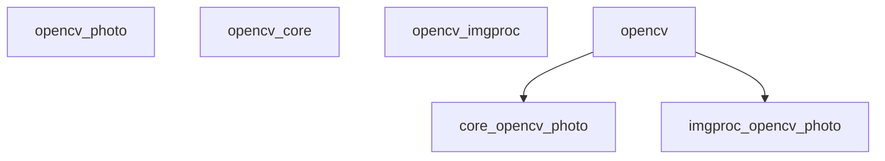
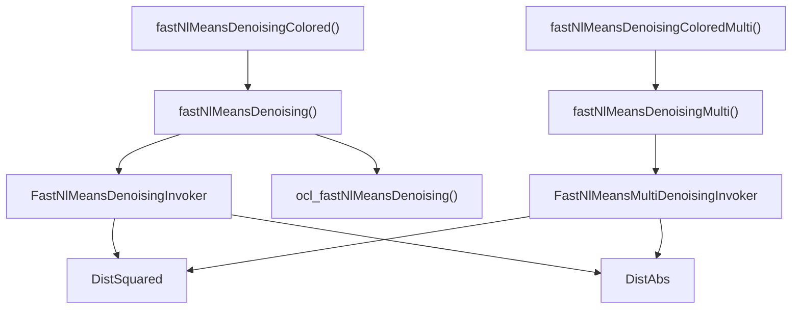
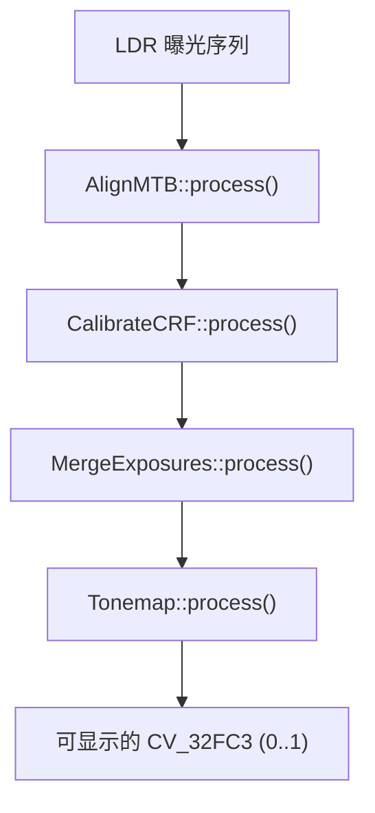
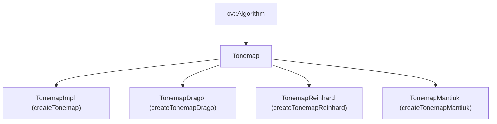
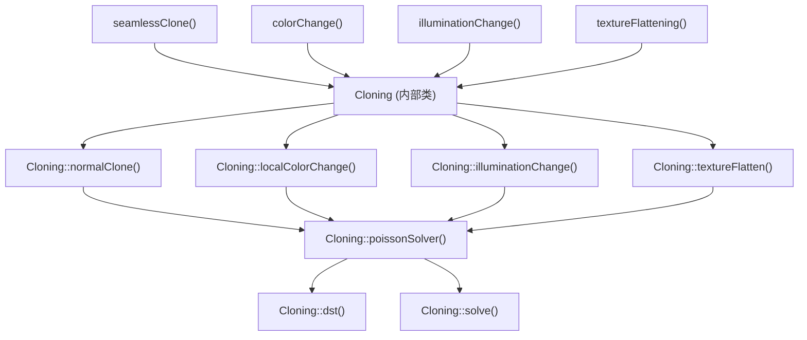

# 摄影与计算摄影 (Photo and Computational Photography)

相关源文件

-   [modules/flann/include/opencv2/flann/flann.hpp](https://github.com/opencv/opencv/blob/91c78f50/modules/flann/include/opencv2/flann/flann.hpp)
-   [modules/photo/include/opencv2/photo.hpp](https://github.com/opencv/opencv/blob/91c78f50/modules/photo/include/opencv2/photo.hpp)
-   [modules/photo/include/opencv2/photo/photo.hpp](https://github.com/opencv/opencv/blob/91c78f50/modules/photo/include/opencv2/photo/photo.hpp)
-   [modules/photo/perf/opencl/perf\_denoising.cpp](https://github.com/opencv/opencv/blob/91c78f50/modules/photo/perf/opencl/perf_denoising.cpp)
-   [modules/photo/src/align.cpp](https://github.com/opencv/opencv/blob/91c78f50/modules/photo/src/align.cpp)
-   [modules/photo/src/arrays.hpp](https://github.com/opencv/opencv/blob/91c78f50/modules/photo/src/arrays.hpp)
-   [modules/photo/src/calibrate.cpp](https://github.com/opencv/opencv/blob/91c78f50/modules/photo/src/calibrate.cpp)
-   [modules/photo/src/contrast\_preserve.cpp](https://github.com/opencv/opencv/blob/91c78f50/modules/photo/src/contrast_preserve.cpp)
-   [modules/photo/src/contrast\_preserve.hpp](https://github.com/opencv/opencv/blob/91c78f50/modules/photo/src/contrast_preserve.hpp)
-   [modules/photo/src/denoising.cpp](https://github.com/opencv/opencv/blob/91c78f50/modules/photo/src/denoising.cpp)
-   [modules/photo/src/fast\_nlmeans\_denoising\_invoker.hpp](https://github.com/opencv/opencv/blob/91c78f50/modules/photo/src/fast_nlmeans_denoising_invoker.hpp)
-   [modules/photo/src/fast\_nlmeans\_denoising\_invoker\_commons.hpp](https://github.com/opencv/opencv/blob/91c78f50/modules/photo/src/fast_nlmeans_denoising_invoker_commons.hpp)
-   [modules/photo/src/fast\_nlmeans\_denoising\_opencl.hpp](https://github.com/opencv/opencv/blob/91c78f50/modules/photo/src/fast_nlmeans_denoising_opencl.hpp)
-   [modules/photo/src/fast\_nlmeans\_multi\_denoising\_invoker.hpp](https://github.com/opencv/opencv/blob/91c78f50/modules/photo/src/fast_nlmeans_multi_denoising_invoker.hpp)
-   [modules/photo/src/hdr\_common.cpp](https://github.com/opencv/opencv/blob/91c78f50/modules/photo/src/hdr_common.cpp)
-   [modules/photo/src/hdr\_common.hpp](https://github.com/opencv/opencv/blob/91c78f50/modules/photo/src/hdr_common.hpp)
-   [modules/photo/src/merge.cpp](https://github.com/opencv/opencv/blob/91c78f50/modules/photo/src/merge.cpp)
-   [modules/photo/src/npr.cpp](https://github.com/opencv/opencv/blob/91c78f50/modules/photo/src/npr.cpp)
-   [modules/photo/src/npr.hpp](https://github.com/opencv/opencv/blob/91c78f50/modules/photo/src/npr.hpp)
-   [modules/photo/src/opencl/nlmeans.cl](https://github.com/opencv/opencv/blob/91c78f50/modules/photo/src/opencl/nlmeans.cl)
-   [modules/photo/src/precomp.hpp](https://github.com/opencv/opencv/blob/91c78f50/modules/photo/src/precomp.hpp)
-   [modules/photo/src/seamless\_cloning.cpp](https://github.com/opencv/opencv/blob/91c78f50/modules/photo/src/seamless_cloning.cpp)
-   [modules/photo/src/seamless\_cloning.hpp](https://github.com/opencv/opencv/blob/91c78f50/modules/photo/src/seamless_cloning.hpp)
-   [modules/photo/src/seamless\_cloning\_impl.cpp](https://github.com/opencv/opencv/blob/91c78f50/modules/photo/src/seamless_cloning_impl.cpp)
-   [modules/photo/src/tonemap.cpp](https://github.com/opencv/opencv/blob/91c78f50/modules/photo/src/tonemap.cpp)
-   [modules/photo/test/ocl/test\_denoising.cpp](https://github.com/opencv/opencv/blob/91c78f50/modules/photo/test/ocl/test_denoising.cpp)
-   [modules/photo/test/test\_cloning.cpp](https://github.com/opencv/opencv/blob/91c78f50/modules/photo/test/test_cloning.cpp)
-   [modules/photo/test/test\_decolor.cpp](https://github.com/opencv/opencv/blob/91c78f50/modules/photo/test/test_decolor.cpp)
-   [modules/photo/test/test\_denoising.cpp](https://github.com/opencv/opencv/blob/91c78f50/modules/photo/test/test_denoising.cpp)
-   [modules/photo/test/test\_hdr.cpp](https://github.com/opencv/opencv/blob/91c78f50/modules/photo/test/test_hdr.cpp)
-   [modules/photo/test/test\_npr.cpp](https://github.com/opencv/opencv/blob/91c78f50/modules/photo/test/test_npr.cpp)
-   [modules/video/include/opencv2/video/video.hpp](https://github.com/opencv/opencv/blob/91c78f50/modules/video/include/opencv2/video/video.hpp)
-   [samples/cpp/cloning\_demo.cpp](https://github.com/opencv/opencv/blob/91c78f50/samples/cpp/cloning_demo.cpp)
-   [samples/cpp/cloning\_gui.cpp](https://github.com/opencv/opencv/blob/91c78f50/samples/cpp/cloning_gui.cpp)
-   [samples/cpp/convexhull.cpp](https://github.com/opencv/opencv/blob/91c78f50/samples/cpp/convexhull.cpp)
-   [samples/cpp/create\_mask.cpp](https://github.com/opencv/opencv/blob/91c78f50/samples/cpp/create_mask.cpp)
-   [samples/cpp/intersectExample.cpp](https://github.com/opencv/opencv/blob/91c78f50/samples/cpp/intersectExample.cpp)
-   [samples/cpp/npr\_demo.cpp](https://github.com/opencv/opencv/blob/91c78f50/samples/cpp/npr_demo.cpp)
-   [samples/cpp/squares.cpp](https://github.com/opencv/opencv/blob/91c78f50/samples/cpp/squares.cpp)
-   [samples/cpp/tutorial\_code/photo/decolorization/decolor.cpp](https://github.com/opencv/opencv/blob/91c78f50/samples/cpp/tutorial_code/photo/decolorization/decolor.cpp)
-   [samples/cpp/tutorial\_code/photo/non\_photorealistic\_rendering/npr\_demo.cpp](https://github.com/opencv/opencv/blob/91c78f50/samples/cpp/tutorial_code/photo/non_photorealistic_rendering/npr_demo.cpp)
-   [samples/cpp/tutorial\_code/photo/seamless\_cloning/cloning\_demo.cpp](https://github.com/opencv/opencv/blob/91c78f50/samples/cpp/tutorial_code/photo/seamless_cloning/cloning_demo.cpp)
-   [samples/cpp/tutorial\_code/photo/seamless\_cloning/cloning\_gui.cpp](https://github.com/opencv/opencv/blob/91c78f50/samples/cpp/tutorial_code/photo/seamless_cloning/cloning_gui.cpp)

`opencv_photo` 模块提供的算法用于图像修复和增强任务，这些任务超越了简单的像素级过滤。它涵盖了图像修补 (inpainting)、非局部均值去噪 (non-local means denoising)、HDR 成像（相机响应校准、曝光对齐、合并和色调映射）、通过 Poisson 求解器进行的无缝克隆、保持对比度的脱色 (decolorization) 以及非写实渲染 (non-photorealistic rendering)。

本页面涵盖了 `modules/photo/` 目录。有关常规图像过滤和颜色操作，请参阅 [图像处理 (imgproc)](/opencv/opencv/4-image-processing-(imgproc))。有关面向视频的时间处理，请参阅 [视频分析](/opencv/opencv/16-video-analysis)。

---

## 模块结构

所有公共符号均在 [modules/photo/include/opencv2/photo.hpp](https://github.com/opencv/opencv/blob/91c78f50/modules/photo/include/opencv2/photo.hpp) 中声明，组织为六个 doxygen 组：

| Doxygen 组 | 描述 | 关键符号 |
| --- | --- | --- |
| `photo_inpaint` | 图像区域重建 | `inpaint` |
| `photo_denoise` | 非局部均值去噪 | `fastNlMeansDenoising`, `fastNlMeansDenoisingColored`, `denoise_TVL1` |
| `photo_hdr` | HDR 流水线 | `Tonemap`, `AlignMTB`, `CalibrateCRF`, `MergeExposures` |
| `photo_decolor` | 保持对比度的彩色转灰度 | `decolor` |
| `photo_clone` | 基于 Poisson 的无缝克隆 | `seamlessClone`, `colorChange`, `illuminationChange`, `textureFlattening` |
| `photo_render` | 非写实渲染 | `edgePreservingFilter`, `detailEnhance`, `pencilSketch`, `stylization` |

**模块依赖图：**


来源：[modules/photo/include/opencv2/photo.hpp43-82](https://github.com/opencv/opencv/blob/91c78f50/modules/photo/include/opencv2/photo.hpp#L43-L82)

---

## 图像修补 (Inpainting)

`inpaint` 从边界邻域重建被遮盖的区域。有两种方法可用，通过 `flags` 参数选择：

| 标志 | 值 | 算法 |
| --- | --- | --- |
| `INPAINT_NS` | 0 | 基于 Navier-Stokes |
| `INPAINT_TELEA` | 1 | 快速前进法 (Telea 2004) |

**签名：**

```
void inpaint(InputArray src, InputArray inpaintMask, OutputArray dst,
             double inpaintRadius, int flags)
```
-   `src`：8 位、16 位无符号或 32 位浮点；单通道或 8 位 3 通道。
-   `inpaintMask`：8 位单通道；非零像素标记要重建的区域。
-   `inpaintRadius`：每个修补点考虑的邻域半径。

来源：[modules/photo/include/opencv2/photo.hpp92-121](https://github.com/opencv/opencv/blob/91c78f50/modules/photo/include/opencv2/photo.hpp#L92-L121)

---

## 去噪 (Denoising)

### 非局部均值 (NLM) 去噪

NLM 算法为每个像素分配一个值，该值是在搜索窗口内找到的相似补丁的加权平均值。补丁相似度通过平方 L2 距离 (`NORM_L2`) 或 L1 距离 (`NORM_L1`) 来衡量。

**类/函数映射：**


来源：[modules/photo/src/denoising.cpp](https://github.com/opencv/opencv/blob/91c78f50/modules/photo/src/denoising.cpp) [modules/photo/src/fast\_nlmeans\_denoising\_invoker.hpp](https://github.com/opencv/opencv/blob/91c78f50/modules/photo/src/fast_nlmeans_denoising_invoker.hpp) [modules/photo/src/fast\_nlmeans\_multi\_denoising\_invoker.hpp](https://github.com/opencv/opencv/blob/91c78f50/modules/photo/src/fast_nlmeans_multi_denoising_invoker.hpp) [modules/photo/src/fast\_nlmeans\_denoising\_opencl.hpp](https://github.com/opencv/opencv/blob/91c78f50/modules/photo/src/fast_nlmeans_denoising_opencl.hpp)

#### 单张图像去噪

```
void fastNlMeansDenoising(InputArray src, OutputArray dst, float h = 3,
                           int templateWindowSize = 7, int searchWindowSize = 21)
```
| 参数 | 作用 |
| --- | --- |
| `h` | 过滤强度。较大的值可以去除更多噪声，但也会模糊细节。 |
| `templateWindowSize` | 用于相似性比较的补丁大小。必须为奇数；默认为 7。 |
| `searchWindowSize` | 搜索窗口大小。必须为奇数；默认为 21。对运行时有线性影响。 |

一个重载版本接受 `const std::vector<float>& h`，用于各通道强度控制，并带有 `normType` 参数 (`NORM_L2` 或 `NORM_L1`)。

#### 彩色图像去噪

`fastNlMeansDenoisingColored` 将输入转换为 CIELAB，分别对 L 通道（使用 `h`）和 AB 通道（使用 `hColor`）应用 `fastNlMeansDenoising`，然后转换回原色彩空间。OpenCL 路径 (`ocl_fastNlMeansDenoisingColored`) 使用 `UMat` 遵循相同的结构。

来源：[modules/photo/src/denoising.cpp168-208](https://github.com/opencv/opencv/blob/91c78f50/modules/photo/src/denoising.cpp#L168-L208) [modules/photo/src/fast\_nlmeans\_denoising\_opencl.hpp182-212](https://github.com/opencv/opencv/blob/91c78f50/modules/photo/src/fast_nlmeans_denoising_opencl.hpp#L182-L212)

#### 延时（多图像）去噪

`fastNlMeansDenoisingMulti` 和 `fastNlMeansDenoisingColoredMulti` 对图像序列进行操作。`temporalWindowSize` 参数控制有多少相邻帧参与去噪结果。调用器为 `FastNlMeansMultiDenoisingInvoker`。

#### 实现细节

CPU 调用器 `FastNlMeansDenoisingInvoker` 继承自 `ParallelLoopBody` 并通过 `parallel_for_` 分发行任务。补丁距离使用滑动窗口列和进行累加，以避免冗余计算。预计算的查找表 (`almost_dist2weight_`) 将离散化的距离映射到整数逻辑化的权重，从而在运行时取代浮点指数评估。

距离度量为策略类：

-   `DistSquared` — L2 平方距离；与 `NORM_L2` 一起使用。
-   `DistAbs` — L1 绝对距离；与 `NORM_L1` 一起使用。

OpenCL 内核位于 [modules/photo/src/opencl/nlmeans.cl](https://github.com/opencv/opencv/blob/91c78f50/modules/photo/src/opencl/nlmeans.cl)，通过 `ocl::Kernel` 在运行时编译。

来源：[modules/photo/src/fast\_nlmeans\_denoising\_invoker.hpp53-146](https://github.com/opencv/opencv/blob/91c78f50/modules/photo/src/fast_nlmeans_denoising_invoker.hpp#L53-L146) [modules/photo/src/fast\_nlmeans\_denoising\_invoker\_commons.hpp92-314](https://github.com/opencv/opencv/blob/91c78f50/modules/photo/src/fast_nlmeans_denoising_invoker_commons.hpp#L92-L314)

### 全变分 (TV-L1) 去噪

```
void denoise_TVL1(const std::vector<Mat>& observations, Mat& result,
                  double lambda = 1.0, int niters = 30)
```
实现了一个原-双对偶变分求解器，旨在最小化：

```
‖∇x‖ + λ Σᵢ ‖x - fᵢ‖
```
`lambda` 在平滑度与对噪声观测结果的保真度之间进行权衡。`niters` 控制收敛迭代次数。

来源：[modules/photo/include/opencv2/photo.hpp287-324](https://github.com/opencv/opencv/blob/91c78f50/modules/photo/include/opencv2/photo.hpp#L287-L324)

---

## HDR 成像

HDR 流水线分三个阶段进行：（可选）对齐曝光序列，校准相机响应函数 (CRF)，合并为线性 HDR 图像，然后色调映射到 8 位显示范围。

**HDR 流水线流程：**


来源：[modules/photo/include/opencv2/photo.hpp328-688](https://github.com/opencv/opencv/blob/91c78f50/modules/photo/include/opencv2/photo.hpp#L328-L688)

### 曝光对齐 — `AlignMTB`

`AlignMTB` (中值阈值位图) 通过在亮度中值处进行阈值化将每张图像转换为二进制位图，然后寻找使位图之间 XOR 一致性最大的整数像素偏移。搜索在 `max_bits` 金字塔层级（默认为 6，允许高达 63 像素的偏移）上分层进行。

`AlignMTB` 的关键方法：

-   `computeBitmaps(img, tb, eb)` — 生成阈值位图和排除位图。
-   `calculateShift(img0, img1)` — 返回像素偏移。
-   `shiftMat(src, dst, shift)` — 应用整数偏移，用零填充新区域。
-   `process(src, dst)` — 不需要曝光时间的便捷重载版本。

来源：[modules/photo/include/opencv2/photo.hpp473-526](https://github.com/opencv/opencv/blob/91c78f50/modules/photo/include/opencv2/photo.hpp#L473-L526) [modules/photo/src/align.cpp](https://github.com/opencv/opencv/blob/91c78f50/modules/photo/src/align.cpp)

### 相机响应校准

抽象基类 `CalibrateCRF` 暴露了 `process(src, dst, times)` 方法，该方法恢复每个通道 256×1（或针对 16 位的 65536×1）的逆 CRF。

| 类 | 算法 | 关键参数 |
| --- | --- | --- |
| `CalibrateDebevec` | 最小化带有平滑项的线性系统 (Debevec & Malik 1997) | `samples`, `lambda`, `random` |
| `CalibrateRobertson` | 迭代 Gauss-Seidel (Robertson et al. 1999) | `max_iter`, `threshold` |

工厂函数：`createCalibrateDebevec()`, `createCalibrateRobertson()`。

来源：[modules/photo/include/opencv2/photo.hpp528-593](https://github.com/opencv/opencv/blob/91c78f50/modules/photo/include/opencv2/photo.hpp#L528-L593) [modules/photo/src/calibrate.cpp](https://github.com/opencv/opencv/blob/91c78f50/modules/photo/src/calibrate.cpp)

### 曝光合并

抽象基类 `MergeExposures` 暴露了 `process(src, dst, times, response)` 方法。

| 类 | 算法 | 备注 |
| --- | --- | --- |
| `MergeDebevec` | 使用 CRF 在对数辐照度域进行加权平均 (Debevec 1997) | 需要响应；具有不带响应的简短重载版本 |
| `MergeRobertson` | 加权平均 (Robertson 1999) | 具有简短重载版本 |
| `MergeMertens` | 使用拉普拉斯金字塔进行曝光融合 (Mertens 2007) | 不需要 CRF；输出不需要色调映射 |

`MergeMertens` 通过三个质量指标对像素进行加权：对比度、饱和度和良好曝光度。这些由 `contrastWeight`、`saturationWeight`、`exposureWeight` 控制。

工厂函数：`createMergeDebevec()`, `createMergeRobertson()`, `createMergeMertens()`。

来源：[modules/photo/include/opencv2/photo.hpp595-686](https://github.com/opencv/opencv/blob/91c78f50/modules/photo/include/opencv2/photo.hpp#L595-L686) [modules/photo/src/merge.cpp](https://github.com/opencv/opencv/blob/91c78f50/modules/photo/src/merge.cpp) [modules/photo/src/hdr\_common.cpp](https://github.com/opencv/opencv/blob/91c78f50/modules/photo/src/hdr_common.cpp)

### 色调映射 (Tonemapping)

所有色调映射算子都继承自抽象类 `Tonemap`（其本身继承自 `Algorithm`）并实现：

```
virtual void process(InputArray src, OutputArray dst) = 0;
```
输入为 `CV_32FC3`；输出为值为 `[0, 1]` 的 `CV_32FC3`。


| 类 | 算法 | 关键参数 |
| --- | --- | --- |
| `TonemapImpl` | 线性重新缩放 + gamma | `gamma` |
| `TonemapDrago` | 自适应对数 (Drago 2003) | `gamma`, `saturation`, `bias` (0.7–0.9) |
| `TonemapReinhard` | 人类视觉系统模型 (Reinhard 2005) | `gamma`, `intensity`, `lightAdaptation`, `colorAdaptation` |
| `TonemapMantiuk` | 梯度域对比度缩放 (Mantiuk 2006) | `gamma`, `scale` (0.6–0.9), `saturation` |

[modules/photo/src/tonemap.cpp](https://github.com/opencv/opencv/blob/91c78f50/modules/photo/src/tonemap.cpp) 中的所有四个实现都支持通过 `FileStorage` 进行 `write`/`read` 以实现序列化。

来源：[modules/photo/include/opencv2/photo.hpp333-446](https://github.com/opencv/opencv/blob/91c78f50/modules/photo/include/opencv2/photo.hpp#L333-L446) [modules/photo/src/tonemap.cpp](https://github.com/opencv/opencv/blob/91c78f50/modules/photo/src/tonemap.cpp)

---

## 无缝克隆 (Seamless Cloning)

无缝克隆通过求解 Poisson 方程将源区域合成到目标图像中，该方程通过目标边界平滑地插值源的梯度场。该实现使用 2D 离散正弦变换 (DST) 作为快速 Poisson 求解器。

**无缝克隆内部机制：**


来源：[modules/photo/src/seamless\_cloning.hpp](https://github.com/opencv/opencv/blob/91c78f50/modules/photo/src/seamless_cloning.hpp) [modules/photo/src/seamless\_cloning.cpp](https://github.com/opencv/opencv/blob/91c78f50/modules/photo/src/seamless_cloning.cpp) [modules/photo/src/seamless\_cloning\_impl.cpp](https://github.com/opencv/opencv/blob/91c78f50/modules/photo/src/seamless_cloning_impl.cpp)

### 公共函数

```
void seamlessClone(InputArray src, InputArray dst, InputArray mask,
                   Point p, OutputArray blend, int flags)
void colorChange(InputArray src, InputArray mask, OutputArray dst,
                 float red_mul, float green_mul, float blue_mul)
void illuminationChange(InputArray src, InputArray mask, OutputArray dst,
                        float alpha, float beta)
void textureFlattening(InputArray src, InputArray mask, OutputArray dst,
                       float low_threshold, float high_threshold, int kernel_size)
```
### 克隆模式 (`SeamlessCloneFlags`)

| 标志 | 值 | 行为 |
| --- | --- | --- |
| `NORMAL_CLONE` | 1 | 按原样导入源梯度场 |
| `MIXED_CLONE` | 2 | 取源梯度幅值和目标梯度幅值的逐像素最大值 |
| `MONOCHROME_TRANSFER` | 3 | 仅从灰度版本派生源梯度 |
| `NORMAL_CLONE_WIDE` | 9 | 类似于 `NORMAL_CLONE`，但 ROI 计算使用完整掩码范围 |
| `MIXED_CLONE_WIDE` | 10 | 类似于 `MIXED_CLONE`，但具有更宽的 ROI |
| `MONOCHROME_TRANSFER_WIDE` | 11 | 类似于 `MONOCHROME_TRANSFER`，但具有更宽的 ROI |

### `Cloning` 类

`Cloning` 是在 [modules/photo/src/seamless\_cloning.hpp53-88](https://github.com/opencv/opencv/blob/91c78f50/modules/photo/src/seamless_cloning.hpp#L53-L88) 中声明的内部（非公开）类。其关键职责：

-   `computeDerivatives` — 通过带有简单有限差分内核的 `filter2D` 计算目标和源补丁的梯度场（X 和 Y）。
-   `poissonSolver(img, laplacianX, laplacianY, result)` — 组合梯度，提取边界条件，然后调用 `solve`。
-   `dst(src, dest, invert)` — 使用在对称扩展信号上的 `dft` 实现 2D DST。
-   `solve(img, mod_diff, result)` — 在 DST 域中使用预计算的余弦滤波器系数 (`filter_X`, `filter_Y`) 进行除法，然后应用逆 DST。

来源：[modules/photo/src/seamless\_cloning\_impl.cpp98-203](https://github.com/opencv/opencv/blob/91c78f50/modules/photo/src/seamless_cloning_impl.cpp#L98-L203)

---

## 保持对比度的脱色 (Decolorization)

```
void decolor(InputArray src, OutputArray grayscale, OutputArray color_boost)
```
将彩色图像转换为灰度图像，同时最大限度地保留知觉对比度。该算法通过迭代地最小化惩罚色彩梯度排序损失的能量函数，拟合 RGB 通道的多项式组合。

内部类 `Decolor`（位于 [modules/photo/src/contrast\_preserve.hpp50-75](https://github.com/opencv/opencv/blob/91c78f50/modules/photo/src/contrast_preserve.hpp#L50-L75)）管理：

-   `grad_system` — 从 CIELAB 表示构建多项式梯度基 (`polyGrad`) 和色彩梯度向量 (`Cg`)。
-   `weak_order` — 估计像素之间的软排序约束 (`alf`)。
-   `wei_update_matrix` / `wei_inti` — 初始化并迭代更新多项式权重。
-   `grayImContruct` — 从最终的权重向量组装灰度图像。

`color_boost` 输出将 LAB 图像的 L 通道替换为脱色后的灰度图，生成对比度增强的彩色版本。

来源：[modules/photo/src/contrast\_preserve.hpp](https://github.com/opencv/opencv/blob/91c78f50/modules/photo/src/contrast_preserve.hpp) [modules/photo/src/contrast\_preserve.cpp](https://github.com/opencv/opencv/blob/91c78f50/modules/photo/src/contrast_preserve.cpp)

---

## 非写实渲染 (Non-Photorealistic Rendering)

四个函数用于应用保持边缘的风格化效果，均在 [modules/photo/include/opencv2/photo.hpp](https://github.com/opencv/opencv/blob/91c78f50/modules/photo/include/opencv2/photo.hpp) 中声明，并在 [modules/photo/src/npr.cpp](https://github.com/opencv/opencv/blob/91c78f50/modules/photo/src/npr.cpp) 中实现：

| 函数 | 效果 |
| --- | --- |
| `edgePreservingFilter(src, dst, flags, sigma_s, sigma_r)` | 保持边缘的同时进行平滑；`flags` 选择 `RECURS_FILTER` (1) 或 `NORMCONV_FILTER` (2) |
| `detailEnhance(src, dst, sigma_s, sigma_r)` | 放大微小细节 |
| `pencilSketch(src, dst1, dst2, sigma_s, sigma_r, shade_factor)` | 灰度和彩色铅笔画效果 |
| `stylization(src, dst, sigma_s, sigma_r)` | 水彩/卡通风格 |

`sigma_s` 控制空间范围 (1–200)；`sigma_r` 控制颜色范围 (0–1)。这些函数内部使用域变换递归滤波器 (见 [modules/photo/src/npr.hpp](https://github.com/opencv/opencv/blob/91c78f50/modules/photo/src/npr.hpp))。

来源：[modules/photo/include/opencv2/photo.hpp833-960](https://github.com/opencv/opencv/blob/91c78f50/modules/photo/include/opencv2/photo.hpp#L833-L960) [modules/photo/src/npr.hpp](https://github.com/opencv/opencv/blob/91c78f50/modules/photo/src/npr.hpp) [modules/photo/src/npr.cpp](https://github.com/opencv/opencv/blob/91c78f50/modules/photo/src/npr.cpp)

---

## OpenCL 加速

去噪路径具有显式的 OpenCL 加速。当输入或输出为 `UMat` 时，`fastNlMeansDenoising` 和 `fastNlMeansDenoisingColored` 分别分发到 `ocl_fastNlMeansDenoising` 和 `ocl_fastNlMeansDenoisingColored`，并由 `CV_OCL_RUN` 保护。

[modules/photo/src/opencl/nlmeans.cl](https://github.com/opencv/opencv/blob/91c78f50/modules/photo/src/opencl/nlmeans.cl) 中的 OpenCL 内核实现了与 CPU 调用器相同的滑动窗口补丁距离累加，并使用补丁大小、搜索大小、像素类型和归一化模式的构建时宏进行编译。该内核使用 `BLOCK_ROWS=32`, `BLOCK_COLS=32` 的共享内存块平铺策略，以及可配置的 CTA 大小（Intel 设备为 64，其他为 256）。

来源：[modules/photo/src/fast\_nlmeans\_denoising\_opencl.hpp79-180](https://github.com/opencv/opencv/blob/91c78f50/modules/photo/src/fast_nlmeans_denoising_opencl.hpp#L79-L180) [modules/photo/src/opencl/nlmeans.cl](https://github.com/opencv/opencv/blob/91c78f50/modules/photo/src/opencl/nlmeans.cl) [modules/photo/src/denoising.cpp123-126](https://github.com/opencv/opencv/blob/91c78f50/modules/photo/src/denoising.cpp#L123-L126)

---

## 测试

测试按子系统组织：

| 测试文件 | 覆盖范围 |
| --- | --- |
| [modules/photo/test/test\_hdr.cpp](https://github.com/opencv/opencv/blob/91c78f50/modules/photo/test/test_hdr.cpp) | 色调映射回归测试、AlignMTB 偏移精度、MergeMertens/Debevec/Robertson 回归、CalibrateDebevec/Robertson 回归 |
| [modules/photo/test/test\_denoising.cpp](https://github.com/opencv/opencv/blob/91c78f50/modules/photo/test/test_denoising.cpp) | 对比参考图像的 NLM 去噪正确性 |
| [modules/photo/test/ocl/test\_denoising.cpp](https://github.com/opencv/opencv/blob/91c78f50/modules/photo/test/ocl/test_denoising.cpp) | 针对 1–4 通道输入，`fastNlMeansDenoising` 和 `fastNlMeansDenoisingColored` 的 OCL 与 CPU 一致性 |
| [modules/photo/test/test\_cloning.cpp](https://github.com/opencv/opencv/blob/91c78f50/modules/photo/test/test_cloning.cpp) | 带有所有模式的 `seamlessClone`、`colorChange`、`illuminationChange`、`textureFlattening` 的回归测试 |
| [modules/photo/test/test\_decolor.cpp](https://github.com/opencv/opencv/blob/91c78f50/modules/photo/test/test_decolor.cpp) | `decolor` 输出尺寸和类型 |
| [modules/photo/test/test\_npr.cpp](https://github.com/opencv/opencv/blob/91c78f50/modules/photo/test/test_npr.cpp) | NPR 函数冒烟测试 |
