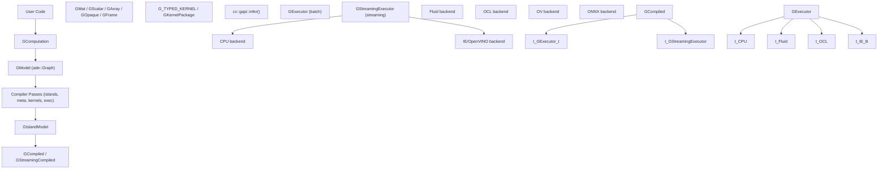
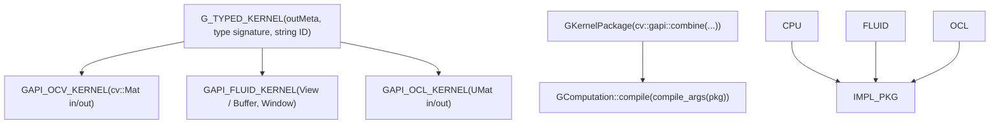
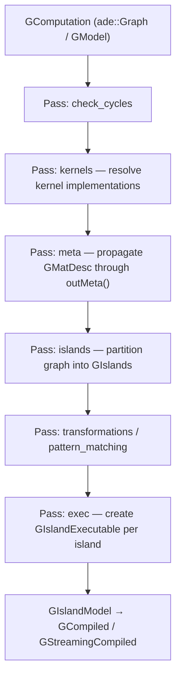
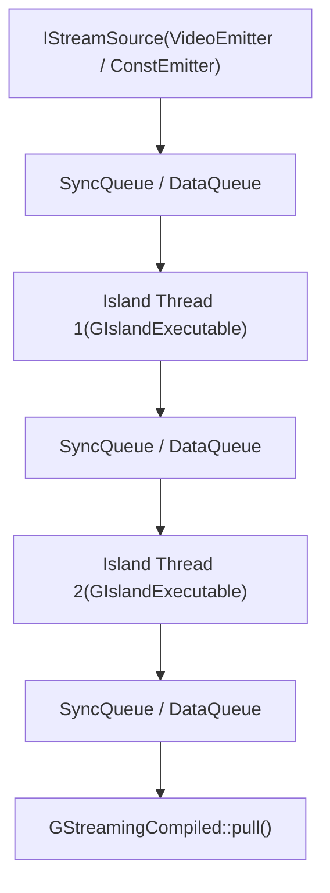
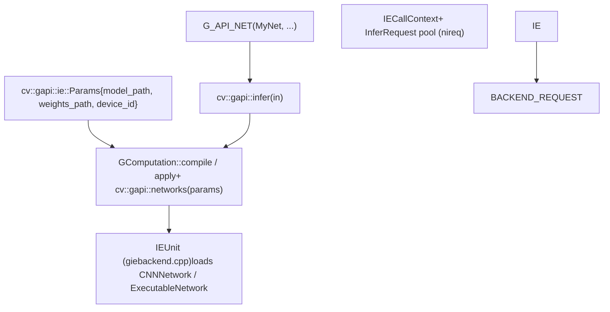

# 图形 API (GAPI)

相关源文件

-   [modules/gapi/CMakeLists.txt](https://github.com/opencv/opencv/blob/91c78f50/modules/gapi/CMakeLists.txt)
-   [modules/gapi/cmake/init.cmake](https://github.com/opencv/opencv/blob/91c78f50/modules/gapi/cmake/init.cmake)
-   [modules/gapi/cmake/standalone.cmake](https://github.com/opencv/opencv/blob/91c78f50/modules/gapi/cmake/standalone.cmake)
-   [modules/gapi/include/opencv2/gapi/core.hpp](https://github.com/opencv/opencv/blob/91c78f50/modules/gapi/include/opencv2/gapi/core.hpp)
-   [modules/gapi/include/opencv2/gapi/cpu/gcpukernel.hpp](https://github.com/opencv/opencv/blob/91c78f50/modules/gapi/include/opencv2/gapi/cpu/gcpukernel.hpp)
-   [modules/gapi/include/opencv2/gapi/cpu/ot.hpp](https://github.com/opencv/opencv/blob/91c78f50/modules/gapi/include/opencv2/gapi/cpu/ot.hpp)
-   [modules/gapi/include/opencv2/gapi/garg.hpp](https://github.com/opencv/opencv/blob/91c78f50/modules/gapi/include/opencv2/gapi/garg.hpp)
-   [modules/gapi/include/opencv2/gapi/garray.hpp](https://github.com/opencv/opencv/blob/91c78f50/modules/gapi/include/opencv2/gapi/garray.hpp)
-   [modules/gapi/include/opencv2/gapi/gcommon.hpp](https://github.com/opencv/opencv/blob/91c78f50/modules/gapi/include/opencv2/gapi/gcommon.hpp)
-   [modules/gapi/include/opencv2/gapi/gcompiled.hpp](https://github.com/opencv/opencv/blob/91c78f50/modules/gapi/include/opencv2/gapi/gcompiled.hpp)
-   [modules/gapi/include/opencv2/gapi/gcomputation.hpp](https://github.com/opencv/opencv/blob/91c78f50/modules/gapi/include/opencv2/gapi/gcomputation.hpp)
-   [modules/gapi/include/opencv2/gapi/gkernel.hpp](https://github.com/opencv/opencv/blob/91c78f50/modules/gapi/include/opencv2/gapi/gkernel.hpp)
-   [modules/gapi/include/opencv2/gapi/gmat.hpp](https://github.com/opencv/opencv/blob/91c78f50/modules/gapi/include/opencv2/gapi/gmat.hpp)
-   [modules/gapi/include/opencv2/gapi/gmetaarg.hpp](https://github.com/opencv/opencv/blob/91c78f50/modules/gapi/include/opencv2/gapi/gmetaarg.hpp)
-   [modules/gapi/include/opencv2/gapi/gopaque.hpp](https://github.com/opencv/opencv/blob/91c78f50/modules/gapi/include/opencv2/gapi/gopaque.hpp)
-   [modules/gapi/include/opencv2/gapi/gproto.hpp](https://github.com/opencv/opencv/blob/91c78f50/modules/gapi/include/opencv2/gapi/gproto.hpp)
-   [modules/gapi/include/opencv2/gapi/gpu/core.hpp](https://github.com/opencv/opencv/blob/91c78f50/modules/gapi/include/opencv2/gapi/gpu/core.hpp)
-   [modules/gapi/include/opencv2/gapi/gpu/imgproc.hpp](https://github.com/opencv/opencv/blob/91c78f50/modules/gapi/include/opencv2/gapi/gpu/imgproc.hpp)
-   [modules/gapi/include/opencv2/gapi/gscalar.hpp](https://github.com/opencv/opencv/blob/91c78f50/modules/gapi/include/opencv2/gapi/gscalar.hpp)
-   [modules/gapi/include/opencv2/gapi/gstreaming.hpp](https://github.com/opencv/opencv/blob/91c78f50/modules/gapi/include/opencv2/gapi/gstreaming.hpp)
-   [modules/gapi/include/opencv2/gapi/gtype\_traits.hpp](https://github.com/opencv/opencv/blob/91c78f50/modules/gapi/include/opencv2/gapi/gtype_traits.hpp)
-   [modules/gapi/include/opencv2/gapi/infer.hpp](https://github.com/opencv/opencv/blob/91c78f50/modules/gapi/include/opencv2/gapi/infer.hpp)
-   [modules/gapi/include/opencv2/gapi/infer/bindings\_ie.hpp](https://github.com/opencv/opencv/blob/91c78f50/modules/gapi/include/opencv2/gapi/infer/bindings_ie.hpp)
-   [modules/gapi/include/opencv2/gapi/infer/ie.hpp](https://github.com/opencv/opencv/blob/91c78f50/modules/gapi/include/opencv2/gapi/infer/ie.hpp)
-   [modules/gapi/include/opencv2/gapi/infer/parsers.hpp](https://github.com/opencv/opencv/blob/91c78f50/modules/gapi/include/opencv2/gapi/infer/parsers.hpp)
-   [modules/gapi/include/opencv2/gapi/ocl/goclkernel.hpp](https://github.com/opencv/opencv/blob/91c78f50/modules/gapi/include/opencv2/gapi/ocl/goclkernel.hpp)
-   [modules/gapi/include/opencv2/gapi/ot.hpp](https://github.com/opencv/opencv/blob/91c78f50/modules/gapi/include/opencv2/gapi/ot.hpp)
-   [modules/gapi/include/opencv2/gapi/rmat.hpp](https://github.com/opencv/opencv/blob/91c78f50/modules/gapi/include/opencv2/gapi/rmat.hpp)
-   [modules/gapi/include/opencv2/gapi/s11n.hpp](https://github.com/opencv/opencv/blob/91c78f50/modules/gapi/include/opencv2/gapi/s11n.hpp)
-   [modules/gapi/include/opencv2/gapi/s11n/base.hpp](https://github.com/opencv/opencv/blob/91c78f50/modules/gapi/include/opencv2/gapi/s11n/base.hpp)
-   [modules/gapi/include/opencv2/gapi/streaming/desync.hpp](https://github.com/opencv/opencv/blob/91c78f50/modules/gapi/include/opencv2/gapi/streaming/desync.hpp)
-   [modules/gapi/include/opencv2/gapi/streaming/format.hpp](https://github.com/opencv/opencv/blob/91c78f50/modules/gapi/include/opencv2/gapi/streaming/format.hpp)
-   [modules/gapi/include/opencv2/gapi/streaming/meta.hpp](https://github.com/opencv/opencv/blob/91c78f50/modules/gapi/include/opencv2/gapi/streaming/meta.hpp)
-   [modules/gapi/include/opencv2/gapi/streaming/onevpl/accel\_types.hpp](https://github.com/opencv/opencv/blob/91c78f50/modules/gapi/include/opencv2/gapi/streaming/onevpl/accel_types.hpp)
-   [modules/gapi/include/opencv2/gapi/streaming/onevpl/cfg\_params.hpp](https://github.com/opencv/opencv/blob/91c78f50/modules/gapi/include/opencv2/gapi/streaming/onevpl/cfg_params.hpp)
-   [modules/gapi/include/opencv2/gapi/streaming/onevpl/data\_provider\_interface.hpp](https://github.com/opencv/opencv/blob/91c78f50/modules/gapi/include/opencv2/gapi/streaming/onevpl/data_provider_interface.hpp)
-   [modules/gapi/include/opencv2/gapi/streaming/onevpl/device\_selector\_interface.hpp](https://github.com/opencv/opencv/blob/91c78f50/modules/gapi/include/opencv2/gapi/streaming/onevpl/device_selector_interface.hpp)
-   [modules/gapi/include/opencv2/gapi/streaming/onevpl/source.hpp](https://github.com/opencv/opencv/blob/91c78f50/modules/gapi/include/opencv2/gapi/streaming/onevpl/source.hpp)
-   [modules/gapi/misc/python/package/gapi/\_\_init\_\_.py](https://github.com/opencv/opencv/blob/91c78f50/modules/gapi/misc/python/package/gapi/__init__.py)
-   [modules/gapi/misc/python/pyopencv\_gapi.hpp](https://github.com/opencv/opencv/blob/91c78f50/modules/gapi/misc/python/pyopencv_gapi.hpp)
-   [modules/gapi/misc/python/python\_bridge.hpp](https://github.com/opencv/opencv/blob/91c78f50/modules/gapi/misc/python/python_bridge.hpp)
-   [modules/gapi/misc/python/shadow\_gapi.hpp](https://github.com/opencv/opencv/blob/91c78f50/modules/gapi/misc/python/shadow_gapi.hpp)
-   [modules/gapi/misc/python/test/test\_gapi\_core.py](https://github.com/opencv/opencv/blob/91c78f50/modules/gapi/misc/python/test/test_gapi_core.py)
-   [modules/gapi/misc/python/test/test\_gapi\_ot.py](https://github.com/opencv/opencv/blob/91c78f50/modules/gapi/misc/python/test/test_gapi_ot.py)
-   [modules/gapi/misc/python/test/test\_gapi\_sample\_pipelines.py](https://github.com/opencv/opencv/blob/91c78f50/modules/gapi/misc/python/test/test_gapi_sample_pipelines.py)
-   [modules/gapi/misc/python/test/test\_gapi\_streaming.py](https://github.com/opencv/opencv/blob/91c78f50/modules/gapi/misc/python/test/test_gapi_streaming.py)
-   [modules/gapi/misc/python/test/test\_gapi\_types.py](https://github.com/opencv/opencv/blob/91c78f50/modules/gapi/misc/python/test/test_gapi_types.py)
-   [modules/gapi/perf/common/gapi\_core\_perf\_tests.hpp](https://github.com/opencv/opencv/blob/91c78f50/modules/gapi/perf/common/gapi_core_perf_tests.hpp)
-   [modules/gapi/perf/common/gapi\_core\_perf\_tests\_inl.hpp](https://github.com/opencv/opencv/blob/91c78f50/modules/gapi/perf/common/gapi_core_perf_tests_inl.hpp)
-   [modules/gapi/perf/cpu/gapi\_core\_perf\_tests\_cpu.cpp](https://github.com/opencv/opencv/blob/91c78f50/modules/gapi/perf/cpu/gapi_core_perf_tests_cpu.cpp)
-   [modules/gapi/perf/cpu/gapi\_core\_perf\_tests\_fluid.cpp](https://github.com/opencv/opencv/blob/91c78f50/modules/gapi/perf/cpu/gapi_core_perf_tests_fluid.cpp)
-   [modules/gapi/perf/gpu/gapi\_core\_perf\_tests\_gpu.cpp](https://github.com/opencv/opencv/blob/91c78f50/modules/gapi/perf/gpu/gapi_core_perf_tests_gpu.cpp)
-   [modules/gapi/perf/perf\_precomp.hpp](https://github.com/opencv/opencv/blob/91c78f50/modules/gapi/perf/perf_precomp.hpp)
-   [modules/gapi/src/api/gbackend.cpp](https://github.com/opencv/opencv/blob/91c78f50/modules/gapi/src/api/gbackend.cpp)
-   [modules/gapi/src/api/gbackend\_priv.hpp](https://github.com/opencv/opencv/blob/91c78f50/modules/gapi/src/api/gbackend_priv.hpp)
-   [modules/gapi/src/api/gcomputation.cpp](https://github.com/opencv/opencv/blob/91c78f50/modules/gapi/src/api/gcomputation.cpp)
-   [modules/gapi/src/api/ginfer.cpp](https://github.com/opencv/opencv/blob/91c78f50/modules/gapi/src/api/ginfer.cpp)
-   [modules/gapi/src/api/gmat.cpp](https://github.com/opencv/opencv/blob/91c78f50/modules/gapi/src/api/gmat.cpp)
-   [modules/gapi/src/api/gproto.cpp](https://github.com/opencv/opencv/blob/91c78f50/modules/gapi/src/api/gproto.cpp)
-   [modules/gapi/src/api/grunarg.cpp](https://github.com/opencv/opencv/blob/91c78f50/modules/gapi/src/api/grunarg.cpp)
-   [modules/gapi/src/api/kernels\_core.cpp](https://github.com/opencv/opencv/blob/91c78f50/modules/gapi/src/api/kernels_core.cpp)
-   [modules/gapi/src/api/kernels\_nnparsers.cpp](https://github.com/opencv/opencv/blob/91c78f50/modules/gapi/src/api/kernels_nnparsers.cpp)
-   [modules/gapi/src/api/kernels\_ot.cpp](https://github.com/opencv/opencv/blob/91c78f50/modules/gapi/src/api/kernels_ot.cpp)
-   [modules/gapi/src/api/kernels\_streaming.cpp](https://github.com/opencv/opencv/blob/91c78f50/modules/gapi/src/api/kernels_streaming.cpp)
-   [modules/gapi/src/api/rmat.cpp](https://github.com/opencv/opencv/blob/91c78f50/modules/gapi/src/api/rmat.cpp)
-   [modules/gapi/src/api/s11n.cpp](https://github.com/opencv/opencv/blob/91c78f50/modules/gapi/src/api/s11n.cpp)
-   [modules/gapi/src/backends/common/gbackend.hpp](https://github.com/opencv/opencv/blob/91c78f50/modules/gapi/src/backends/common/gbackend.hpp)
-   [modules/gapi/src/backends/common/gmetabackend.cpp](https://github.com/opencv/opencv/blob/91c78f50/modules/gapi/src/backends/common/gmetabackend.cpp)
-   [modules/gapi/src/backends/common/gmetabackend.hpp](https://github.com/opencv/opencv/blob/91c78f50/modules/gapi/src/backends/common/gmetabackend.hpp)
-   [modules/gapi/src/backends/common/serialization.cpp](https://github.com/opencv/opencv/blob/91c78f50/modules/gapi/src/backends/common/serialization.cpp)
-   [modules/gapi/src/backends/common/serialization.hpp](https://github.com/opencv/opencv/blob/91c78f50/modules/gapi/src/backends/common/serialization.hpp)
-   [modules/gapi/src/backends/cpu/gcpubackend.cpp](https://github.com/opencv/opencv/blob/91c78f50/modules/gapi/src/backends/cpu/gcpubackend.cpp)
-   [modules/gapi/src/backends/cpu/gcpubackend.hpp](https://github.com/opencv/opencv/blob/91c78f50/modules/gapi/src/backends/cpu/gcpubackend.hpp)
-   [modules/gapi/src/backends/cpu/gcpucore.cpp](https://github.com/opencv/opencv/blob/91c78f50/modules/gapi/src/backends/cpu/gcpucore.cpp)
-   [modules/gapi/src/backends/cpu/gcpuot.cpp](https://github.com/opencv/opencv/blob/91c78f50/modules/gapi/src/backends/cpu/gcpuot.cpp)
-   [modules/gapi/src/backends/cpu/gnnparsers.cpp](https://github.com/opencv/opencv/blob/91c78f50/modules/gapi/src/backends/cpu/gnnparsers.cpp)
-   [modules/gapi/src/backends/cpu/gnnparsers.hpp](https://github.com/opencv/opencv/blob/91c78f50/modules/gapi/src/backends/cpu/gnnparsers.hpp)
-   [modules/gapi/src/backends/fluid/gfluidcore.cpp](https://github.com/opencv/opencv/blob/91c78f50/modules/gapi/src/backends/fluid/gfluidcore.cpp)
-   [modules/gapi/src/backends/fluid/gfluidcore\_func.dispatch.cpp](https://github.com/opencv/opencv/blob/91c78f50/modules/gapi/src/backends/fluid/gfluidcore_func.dispatch.cpp)
-   [modules/gapi/src/backends/fluid/gfluidcore\_func.hpp](https://github.com/opencv/opencv/blob/91c78f50/modules/gapi/src/backends/fluid/gfluidcore_func.hpp)
-   [modules/gapi/src/backends/fluid/gfluidcore\_func.simd.hpp](https://github.com/opencv/opencv/blob/91c78f50/modules/gapi/src/backends/fluid/gfluidcore_func.simd.hpp)
-   [modules/gapi/src/backends/ie/bindings\_ie.cpp](https://github.com/opencv/opencv/blob/91c78f50/modules/gapi/src/backends/ie/bindings_ie.cpp)
-   [modules/gapi/src/backends/ie/giebackend.cpp](https://github.com/opencv/opencv/blob/91c78f50/modules/gapi/src/backends/ie/giebackend.cpp)
-   [modules/gapi/src/backends/ie/giebackend.hpp](https://github.com/opencv/opencv/blob/91c78f50/modules/gapi/src/backends/ie/giebackend.hpp)
-   [modules/gapi/src/backends/ie/giebackend/giewrapper.cpp](https://github.com/opencv/opencv/blob/91c78f50/modules/gapi/src/backends/ie/giebackend/giewrapper.cpp)
-   [modules/gapi/src/backends/ie/giebackend/giewrapper.hpp](https://github.com/opencv/opencv/blob/91c78f50/modules/gapi/src/backends/ie/giebackend/giewrapper.hpp)
-   [modules/gapi/src/backends/ie/util.hpp](https://github.com/opencv/opencv/blob/91c78f50/modules/gapi/src/backends/ie/util.hpp)
-   [modules/gapi/src/backends/ocl/goclbackend.cpp](https://github.com/opencv/opencv/blob/91c78f50/modules/gapi/src/backends/ocl/goclbackend.cpp)
-   [modules/gapi/src/backends/ocl/goclcore.cpp](https://github.com/opencv/opencv/blob/91c78f50/modules/gapi/src/backends/ocl/goclcore.cpp)
-   [modules/gapi/src/backends/plaidml/gplaidmlbackend.cpp](https://github.com/opencv/opencv/blob/91c78f50/modules/gapi/src/backends/plaidml/gplaidmlbackend.cpp)
-   [modules/gapi/src/backends/streaming/gstreamingbackend.cpp](https://github.com/opencv/opencv/blob/91c78f50/modules/gapi/src/backends/streaming/gstreamingbackend.cpp)
-   [modules/gapi/src/backends/streaming/gstreamingbackend.hpp](https://github.com/opencv/opencv/blob/91c78f50/modules/gapi/src/backends/streaming/gstreamingbackend.hpp)
-   [modules/gapi/src/backends/streaming/gstreamingkernel.hpp](https://github.com/opencv/opencv/blob/91c78f50/modules/gapi/src/backends/streaming/gstreamingkernel.hpp)
-   [modules/gapi/src/compiler/gcompiled.cpp](https://github.com/opencv/opencv/blob/91c78f50/modules/gapi/src/compiler/gcompiled.cpp)
-   [modules/gapi/src/compiler/gcompiled\_priv.hpp](https://github.com/opencv/opencv/blob/91c78f50/modules/gapi/src/compiler/gcompiled_priv.hpp)
-   [modules/gapi/src/compiler/gcompiler.cpp](https://github.com/opencv/opencv/blob/91c78f50/modules/gapi/src/compiler/gcompiler.cpp)
-   [modules/gapi/src/compiler/gislandmodel.cpp](https://github.com/opencv/opencv/blob/91c78f50/modules/gapi/src/compiler/gislandmodel.cpp)
-   [modules/gapi/src/compiler/gislandmodel.hpp](https://github.com/opencv/opencv/blob/91c78f50/modules/gapi/src/compiler/gislandmodel.hpp)
-   [modules/gapi/src/compiler/gstreaming.cpp](https://github.com/opencv/opencv/blob/91c78f50/modules/gapi/src/compiler/gstreaming.cpp)
-   [modules/gapi/src/compiler/gstreaming\_priv.hpp](https://github.com/opencv/opencv/blob/91c78f50/modules/gapi/src/compiler/gstreaming_priv.hpp)
-   [modules/gapi/src/compiler/passes/exec.cpp](https://github.com/opencv/opencv/blob/91c78f50/modules/gapi/src/compiler/passes/exec.cpp)
-   [modules/gapi/src/executor/gexecutor.cpp](https://github.com/opencv/opencv/blob/91c78f50/modules/gapi/src/executor/gexecutor.cpp)
-   [modules/gapi/src/executor/gexecutor.hpp](https://github.com/opencv/opencv/blob/91c78f50/modules/gapi/src/executor/gexecutor.hpp)
-   [modules/gapi/src/executor/gstreamingexecutor.cpp](https://github.com/opencv/opencv/blob/91c78f50/modules/gapi/src/executor/gstreamingexecutor.cpp)
-   [modules/gapi/src/executor/gstreamingexecutor.hpp](https://github.com/opencv/opencv/blob/91c78f50/modules/gapi/src/executor/gstreamingexecutor.hpp)
-   [modules/gapi/src/streaming/onevpl/accelerators/accel\_policy\_va\_api.cpp](https://github.com/opencv/opencv/blob/91c78f50/modules/gapi/src/streaming/onevpl/accelerators/accel_policy_va_api.cpp)
-   [modules/gapi/src/streaming/onevpl/accelerators/accel\_policy\_va\_api.hpp](https://github.com/opencv/opencv/blob/91c78f50/modules/gapi/src/streaming/onevpl/accelerators/accel_policy_va_api.hpp)
-   [modules/gapi/src/streaming/onevpl/accelerators/dx11\_alloc\_resource.cpp](https://github.com/opencv/opencv/blob/91c78f50/modules/gapi/src/streaming/onevpl/accelerators/dx11_alloc_resource.cpp)
-   [modules/gapi/src/streaming/onevpl/cfg\_param\_device\_selector.cpp](https://github.com/opencv/opencv/blob/91c78f50/modules/gapi/src/streaming/onevpl/cfg_param_device_selector.cpp)
-   [modules/gapi/src/streaming/onevpl/cfg\_param\_device\_selector.hpp](https://github.com/opencv/opencv/blob/91c78f50/modules/gapi/src/streaming/onevpl/cfg_param_device_selector.hpp)
-   [modules/gapi/src/streaming/onevpl/cfg\_params.cpp](https://github.com/opencv/opencv/blob/91c78f50/modules/gapi/src/streaming/onevpl/cfg_params.cpp)
-   [modules/gapi/src/streaming/onevpl/data\_provider\_interface\_exception.cpp](https://github.com/opencv/opencv/blob/91c78f50/modules/gapi/src/streaming/onevpl/data_provider_interface_exception.cpp)
-   [modules/gapi/src/streaming/onevpl/default.cpp](https://github.com/opencv/opencv/blob/91c78f50/modules/gapi/src/streaming/onevpl/default.cpp)
-   [modules/gapi/src/streaming/onevpl/device\_selector\_interface.cpp](https://github.com/opencv/opencv/blob/91c78f50/modules/gapi/src/streaming/onevpl/device_selector_interface.cpp)
-   [modules/gapi/src/streaming/onevpl/file\_data\_provider.cpp](https://github.com/opencv/opencv/blob/91c78f50/modules/gapi/src/streaming/onevpl/file_data_provider.cpp)
-   [modules/gapi/src/streaming/onevpl/file\_data\_provider.hpp](https://github.com/opencv/opencv/blob/91c78f50/modules/gapi/src/streaming/onevpl/file_data_provider.hpp)
-   [modules/gapi/src/streaming/onevpl/source.cpp](https://github.com/opencv/opencv/blob/91c78f50/modules/gapi/src/streaming/onevpl/source.cpp)
-   [modules/gapi/src/streaming/onevpl/source\_priv.cpp](https://github.com/opencv/opencv/blob/91c78f50/modules/gapi/src/streaming/onevpl/source_priv.cpp)
-   [modules/gapi/src/streaming/onevpl/source\_priv.hpp](https://github.com/opencv/opencv/blob/91c78f50/modules/gapi/src/streaming/onevpl/source_priv.hpp)
-   [modules/gapi/test/common/gapi\_core\_tests.hpp](https://github.com/opencv/opencv/blob/91c78f50/modules/gapi/test/common/gapi_core_tests.hpp)
-   [modules/gapi/test/common/gapi\_core\_tests\_inl.hpp](https://github.com/opencv/opencv/blob/91c78f50/modules/gapi/test/common/gapi_core_tests_inl.hpp)
-   [modules/gapi/test/common/gapi\_parsers\_tests\_common.hpp](https://github.com/opencv/opencv/blob/91c78f50/modules/gapi/test/common/gapi_parsers_tests_common.hpp)
-   [modules/gapi/test/common/gapi\_tests\_common.hpp](https://github.com/opencv/opencv/blob/91c78f50/modules/gapi/test/common/gapi_tests_common.hpp)
-   [modules/gapi/test/cpu/gapi\_core\_tests\_cpu.cpp](https://github.com/opencv/opencv/blob/91c78f50/modules/gapi/test/cpu/gapi_core_tests_cpu.cpp)
-   [modules/gapi/test/cpu/gapi\_core\_tests\_fluid.cpp](https://github.com/opencv/opencv/blob/91c78f50/modules/gapi/test/cpu/gapi_core_tests_fluid.cpp)
-   [modules/gapi/test/cpu/gapi\_ocv\_stateful\_kernel\_test\_utils.hpp](https://github.com/opencv/opencv/blob/91c78f50/modules/gapi/test/cpu/gapi_ocv_stateful_kernel_test_utils.hpp)
-   [modules/gapi/test/cpu/gapi\_ot\_tests\_cpu.cpp](https://github.com/opencv/opencv/blob/91c78f50/modules/gapi/test/cpu/gapi_ot_tests_cpu.cpp)
-   [modules/gapi/test/gapi\_array\_tests.cpp](https://github.com/opencv/opencv/blob/91c78f50/modules/gapi/test/gapi_array_tests.cpp)
-   [modules/gapi/test/gapi\_desc\_tests.cpp](https://github.com/opencv/opencv/blob/91c78f50/modules/gapi/test/gapi_desc_tests.cpp)
-   [modules/gapi/test/gapi\_gcomputation\_tests.cpp](https://github.com/opencv/opencv/blob/91c78f50/modules/gapi/test/gapi_gcomputation_tests.cpp)
-   [modules/gapi/test/gapi\_opaque\_tests.cpp](https://github.com/opencv/opencv/blob/91c78f50/modules/gapi/test/gapi_opaque_tests.cpp)
-   [modules/gapi/test/gapi\_sample\_pipelines.cpp](https://github.com/opencv/opencv/blob/91c78f50/modules/gapi/test/gapi_sample_pipelines.cpp)
-   [modules/gapi/test/gpu/gapi\_core\_tests\_gpu.cpp](https://github.com/opencv/opencv/blob/91c78f50/modules/gapi/test/gpu/gapi_core_tests_gpu.cpp)
-   [modules/gapi/test/infer/gapi\_infer\_ie\_test.cpp](https://github.com/opencv/opencv/blob/91c78f50/modules/gapi/test/infer/gapi_infer_ie_test.cpp)
-   [modules/gapi/test/internal/gapi\_int\_garg\_test.cpp](https://github.com/opencv/opencv/blob/91c78f50/modules/gapi/test/internal/gapi_int_garg_test.cpp)
-   [modules/gapi/test/oak/gapi\_tests\_oak.cpp](https://github.com/opencv/opencv/blob/91c78f50/modules/gapi/test/oak/gapi_tests_oak.cpp)
-   [modules/gapi/test/rmat/rmat\_test\_common.hpp](https://github.com/opencv/opencv/blob/91c78f50/modules/gapi/test/rmat/rmat_test_common.hpp)
-   [modules/gapi/test/rmat/rmat\_tests.cpp](https://github.com/opencv/opencv/blob/91c78f50/modules/gapi/test/rmat/rmat_tests.cpp)
-   [modules/gapi/test/rmat/rmat\_view\_tests.cpp](https://github.com/opencv/opencv/blob/91c78f50/modules/gapi/test/rmat/rmat_view_tests.cpp)
-   [modules/gapi/test/s11n/gapi\_s11n\_tests.cpp](https://github.com/opencv/opencv/blob/91c78f50/modules/gapi/test/s11n/gapi_s11n_tests.cpp)
-   [modules/gapi/test/s11n/gapi\_sample\_pipelines\_s11n.cpp](https://github.com/opencv/opencv/blob/91c78f50/modules/gapi/test/s11n/gapi_sample_pipelines_s11n.cpp)
-   [modules/gapi/test/streaming/gapi\_streaming\_tests.cpp](https://github.com/opencv/opencv/blob/91c78f50/modules/gapi/test/streaming/gapi_streaming_tests.cpp)
-   [modules/gapi/test/streaming/gapi\_streaming\_vpl\_device\_selector.cpp](https://github.com/opencv/opencv/blob/91c78f50/modules/gapi/test/streaming/gapi_streaming_vpl_device_selector.cpp)
-   [modules/gapi/test/test\_precomp.hpp](https://github.com/opencv/opencv/blob/91c78f50/modules/gapi/test/test_precomp.hpp)

## 目的与范围

本页面涵盖了 `opencv_gapi` 模块 —— 一个基于图形的延迟执行框架，它将图像处理流水线的 *定义* 与 *执行* 分离开来。用户通过一个有向无环图来声明计算任务（该图由类型化操作组成）；框架会编译该图并在一个或多个后端（CPU, OpenCL, OpenVINO, ONNX 等）上执行它。

本页面涵盖了核心 API、编译与执行流水线、后端系统、推理集成以及流式执行模式。有关常规的 OpenCV 构建配置，请参阅 [构建系统](/opencv/opencv/2-build-system)。有关 DNN 模块（另一种推理方法），请参阅 [深度神经网络 (DNN)](/opencv/opencv/5-deep-neural-networks-(dnn))。

---

## 高层架构

GAPI 将关注点分离为三个不同的层：**前端**（图形构建 API）、**编译器**（图形分析与分区）以及**执行器**（各后端运行时）。

**GAPI 分层架构**


来源：[modules/gapi/CMakeLists.txt70-249](https://github.com/opencv/opencv/blob/91c78f50/modules/gapi/CMakeLists.txt#L70-L249) [modules/gapi/src/compiler/gcompiler.cpp1-50](https://github.com/opencv/opencv/blob/91c78f50/modules/gapi/src/compiler/gcompiler.cpp#L1-L50) [modules/gapi/src/executor/gexecutor.cpp1-65](https://github.com/opencv/opencv/blob/91c78f50/modules/gapi/src/executor/gexecutor.cpp#L1-L65) [modules/gapi/src/executor/gstreamingexecutor.cpp1-100](https://github.com/opencv/opencv/blob/91c78f50/modules/gapi/src/executor/gstreamingexecutor.cpp#L1-L100)

---

## 核心数据类型 (前端)

所有 GAPI 图形操作都作用于 *虚拟* 数据句柄上 —— 它们描述了图形中流动的数据，但在执行之前不持有实际数值。

| 类型 | 头文件 | 描述 |
| --- | --- | --- |
| `cv::GMat` | `gapi/gmat.hpp` | 矩阵（图像或张量）的延迟句柄 |
| `cv::GScalar` | `gapi/gscalar.hpp` | 标量值的延迟句柄 |
| `cv::GArray<T>` | `gapi/garray.hpp` | 类型化向量的延迟句柄 |
| `cv::GOpaque<T>` | `gapi/gopaque.hpp` | 任意值的延迟句柄 |
| `cv::GFrame` | `gapi/gframe.hpp` | 媒体帧（NV12, BGR, GRAY）的延迟句柄 |
| `cv::GMatDesc` | (metadata) | 描述 `GMat`（深度、通道、尺寸） |

`GMatDesc`, `GScalarDesc`, `GArrayDesc` 和 `GOpaqueDesc` 是在编译阶段使用的 *元数据* 类型，用于在不运行任何计算的情况下推断输出形状。

来源：[modules/gapi/include/opencv2/gapi/core.hpp40-44](https://github.com/opencv/opencv/blob/91c78f50/modules/gapi/include/opencv2/gapi/core.hpp#L40-L44) [modules/gapi/misc/python/pyopencv\_gapi.hpp40-63](https://github.com/opencv/opencv/blob/91c78f50/modules/gapi/misc/python/pyopencv_gapi.hpp#L40-L63)

---

## 内核定义系统

内核是图形中的操作。GAPI 将内核 *API*（签名 + 元数据函数）与内核 *实现*（后端相关）分离开来。

### 内核 API 声明

`G_TYPED_KERNEL` 宏声明了内核的类型签名及其 `outMeta()` 函数。`outMeta()` 函数在 *编译时* 被调用，用于在图形中传递描述符信息。

```
G_TYPED_KERNEL(GAdd, <GMat(GMat, GMat, int)>, "org.opencv.core.math.add") {
    static GMatDesc outMeta(GMatDesc a, GMatDesc b, int ddepth) { ... }
};
```
对于具有多个输出的内核，改用 `G_TYPED_KERNEL_M`。

### 内核实现

后端特定的实现使用各后端的宏：

| 后端 | 实现宏 | 头文件 |
| --- | --- | --- |
| CPU | `GAPI_OCV_KERNEL` | `cpu/gcpukernel.hpp` |
| Fluid | `GAPI_FLUID_KERNEL` | `fluid/gfluidkernel.hpp` |
| OCL | `GAPI_OCL_KERNEL` | `ocl/goclkernel.hpp` |

`GAPI_OCV_KERNEL` 接收普通的 `cv::Mat` 参数并写入输出 `cv::Mat`。`GAPI_FLUID_KERNEL` 接收 `View`（输入行缓冲区）和 `Buffer`（输出行缓冲区）对象，并指定滑动窗口 `Window` 大小。

**内核 API 与实现关系**


来源：[modules/gapi/include/opencv2/gapi/gkernel.hpp44-200](https://github.com/opencv/opencv/blob/91c78f50/modules/gapi/include/opencv2/gapi/gkernel.hpp#L44-L200) [modules/gapi/include/opencv2/gapi/cpu/gcpukernel.hpp1-80](https://github.com/opencv/opencv/blob/91c78f50/modules/gapi/include/opencv2/gapi/cpu/gcpukernel.hpp#L1-L80) [modules/gapi/src/backends/fluid/gfluidcore.cpp271-291](https://github.com/opencv/opencv/blob/91c78f50/modules/gapi/src/backends/fluid/gfluidcore.cpp#L271-L291) [modules/gapi/include/opencv2/gapi/core.hpp45-59](https://github.com/opencv/opencv/blob/91c78f50/modules/gapi/include/opencv2/gapi/core.hpp#L45-L59)

---

## GComputation: 图形构建与执行

`cv::GComputation` 是用于定义和执行流水线的主要用户面向对象。

**从输入/输出构建：**

```
cv::GMat in;
cv::GMat blurred = cv::gapi::blur(in, cv::Size(3,3));
cv::GMat edges   = cv::gapi::Canny(blurred, 50, 150);
cv::GComputation comp(cv::GIn(in), cv::GOut(edges));
```
**执行模式：**

| 方法 | 返回值 | 描述 |
| --- | --- | --- |
| `comp.apply(gin(...), gout(...), compile_args(...))` | `void` | 立即编译并运行（批处理） |
| `comp.compile(descr_of(...), compile_args(...))` | `GCompiled` | 提前编译；可重复调用 `cc(gin, gout)` |
| `comp.compileStreaming(compile_args(...))` | `GStreamingCompiled` | 为流模式编译 |

`GCompiled` 是一个可重用的可调用仿函数，无需重新编译即可处理各帧。`GStreamingCompiled` 是管道式流执行器的入口点。

来源：[modules/gapi/src/compiler/gcompiler.cpp1-80](https://github.com/opencv/opencv/blob/91c78f50/modules/gapi/src/compiler/gcompiler.cpp#L1-L80) [modules/gapi/perf/common/gapi\_core\_perf\_tests\_inl.hpp40-56](https://github.com/opencv/opencv/blob/91c78f50/modules/gapi/perf/common/gapi_core_perf_tests_inl.hpp#L40-L56) [modules/gapi/test/common/gapi\_core\_tests\_inl.hpp77-79](https://github.com/opencv/opencv/blob/91c78f50/modules/gapi/test/common/gapi_core_tests_inl.hpp#L77-L79)

---

## 编译流水线

当 `GComputation` 被编译时，`GCompiler` 会运行一系列 ADE 图形处理过程（Passes）。

**编译过程序列**


`src/compiler/passes/` 下的关键源文件：

| 文件 | 职责 |
| --- | --- |
| `kernels.cpp` | 将每个图形操作绑定到后端内核实现 |
| `meta.cpp` | 在每个节点上调用 `outMeta()` 以解析输出描述符 |
| `islands.cpp` | 将可以在同一后端运行的相邻节点分组为“孤岛”（islands） |
| `exec.cpp` | 为每个孤岛实例化 `GIslandExecutable` 对象 |
| `transformations.cpp` + `pattern_matching.cpp` | 图形替换/重写规则 |
| `streaming.cpp` | 流式处理特定的 Pass（异步区域标记） |

生成的 `GIslandModel` 包含了带有已解析 `GIslandExecutable` 实例的孤岛，执行器在运行时会驱动这些实例。

来源：[modules/gapi/src/compiler/gcompiler.cpp1-200](https://github.com/opencv/opencv/blob/91c78f50/modules/gapi/src/compiler/gcompiler.cpp#L1-L200) [modules/gapi/CMakeLists.txt101-117](https://github.com/opencv/opencv/blob/91c78f50/modules/gapi/CMakeLists.txt#L101-L117)

---

## 执行模式

### 批处理执行器 (`GExecutor`)

在 [modules/gapi/src/executor/gexecutor.cpp](https://github.com/opencv/opencv/blob/91c78f50/modules/gapi/src/executor/gexecutor.cpp) 中定义的 `GExecutor` 对 `GIslandModel` 执行简单的拓扑遍历。对于每个孤岛，它会准备输入和输出描述符向量，并调用该孤岛的 `GIslandExecutable`。这是一种单线程、逐帧处理的模式。

### 流式执行器 (`GStreamingExecutor`)

[modules/gapi/src/executor/gstreamingexecutor.cpp](https://github.com/opencv/opencv/blob/91c78f50/modules/gapi/src/executor/gstreamingexecutor.cpp) 中的 `GStreamingExecutor` 在各自的线程中运行每个孤岛，并通过有界的 `SyncQueue`（或 `DesyncQueue`）实例进行连接。

**流式流水线线程模型**


线程同步由 `QueueReader` 辅助类管理，它负责处理正常数据以及 `Stop` 消息（硬停止 vs. 软常量发射器停止）。`GStreamingCompiled::start()` 启动线程；`pull()` / `pull(GOptRunArgs)` 检索结果。

`desync()` 原语 ([modules/gapi/include/opencv2/gapi/streaming/desync.hpp](https://github.com/opencv/opencv/blob/91c78f50/modules/gapi/include/opencv2/gapi/streaming/desync.hpp)) 允许子图以不同于主流水线的速率运行，使用 `DesyncQueue` 代替 `SyncQueue`。

来源：[modules/gapi/src/executor/gstreamingexecutor.cpp37-470](https://github.com/opencv/opencv/blob/91c78f50/modules/gapi/src/executor/gstreamingexecutor.cpp#L37-L470) [modules/gapi/test/streaming/gapi\_streaming\_tests.cpp57-116](https://github.com/opencv/opencv/blob/91c78f50/modules/gapi/test/streaming/gapi_streaming_tests.cpp#L57-L116)

---

## 后端系统

每个后端提供一个 `cv::gapi::GBackend` 单例对象以及一组封装为 `GKernelPackage` 的内核实现。

**后端注册表**


来自多个后端的内核包通过 `cv::gapi::combine()` 进行合并。`cv::gapi::use_only{}` 编译参数将执行限制在特定的包中。

### Fluid 后端

Fluid 后端实现了缓存友好、逐行处理的机制，并带有可配置的滑动窗口。每个 `GAPI_FLUID_KERNEL` 都会声明一个 `Window` 常量（所需输入行数），并作用于 `View`/`Buffer` 对象而非完整的 `Mat` 对象。针对常用操作存在 SIMD 分发的实现（参见 `gfluidcore_func.dispatch.cpp`, `gfluidimgproc_func.dispatch.cpp`）。

来源：[modules/gapi/CMakeLists.txt129-197](https://github.com/opencv/opencv/blob/91c78f50/modules/gapi/CMakeLists.txt#L129-L197) [modules/gapi/src/backends/fluid/gfluidcore.cpp271-291](https://github.com/opencv/opencv/blob/91c78f50/modules/gapi/src/backends/fluid/gfluidcore.cpp#L271-L291) [modules/gapi/test/streaming/gapi\_streaming\_tests.cpp74-103](https://github.com/opencv/opencv/blob/91c78f50/modules/gapi/test/streaming/gapi_streaming_tests.cpp#L74-L103)

---

## 推理集成

GAPI 提供了一个类型化的神经网络推理 API，可以与后端集成。

### 定义网络类型

`G_API_NET` 声明了一个带有输入和输出签名的类型化网络：

```
G_API_NET(AgeGender, <std::tuple<cv::GMat,cv::GMat>(cv::GMat)>, "test-age-gender");
```
这类似于图像操作中的 `G_TYPED_KERNEL`。

### 在图形中使用推理

```
cv::GMat in;
cv::GMat age, gender;
std::tie(age, gender) = cv::gapi::infer<AgeGender>(in);
cv::GComputation comp(cv::GIn(in), cv::GOut(age, gender));
```
`cv::gapi::infer<Net>()` 在 [modules/gapi/include/opencv2/gapi/infer.hpp](https://github.com/opencv/opencv/blob/91c78f50/modules/gapi/include/opencv2/gapi/infer.hpp) 中声明。

### 后端参数

每个推理后端提供一个 `Params<Net>` 模板类：

| 后端 | 参数类 | 头文件 |
| --- | --- | --- |
| OpenVINO (旧版 IE) | `cv::gapi::ie::Params<Net>` | `gapi/infer/ie.hpp` |
| OpenVINO (新版 API) | `cv::gapi::ov::Params<Net>` | `gapi/infer/ov.hpp` |
| ONNX Runtime | `cv::gapi::onnx::Params<Net>` | `gapi/infer/onnx.hpp` |

这些参数作为编译参数通过 `cv::gapi::networks(pp)` 传递。

**推理集成数据流**


IE 后端 (`giebackend.cpp`) 内部管理着一个持有加载网络的 `IEUnit`，以及一个封装了每次推理调用的输入/输出的 `IECallContext`。支持通过可配置的 `nireq`（并发推理请求数）进行异步推理。

来源：[modules/gapi/src/backends/ie/giebackend.cpp431-583](https://github.com/opencv/opencv/blob/91c78f50/modules/gapi/src/backends/ie/giebackend.cpp#L431-L583) [modules/gapi/include/opencv2/gapi/infer/ie.hpp73-127](https://github.com/opencv/opencv/blob/91c78f50/modules/gapi/include/opencv2/gapi/infer/ie.hpp#L73-L127) [modules/gapi/test/infer/gapi\_infer\_ie\_test.cpp199-248](https://github.com/opencv/opencv/blob/91c78f50/modules/gapi/test/infer/gapi_infer_ie_test.cpp#L199-L248)

---

## 流式数据源

流式流水线从 `cv::gapi::wip::IStreamSource` 的实现中获取数据。

| 数据源类 | 描述 | 头文件 |
| --- | --- | --- |
| `cv::gapi::wip::GCaptureSource` | 封装 `cv::VideoCapture` | `streaming/cap.hpp` |
| `cv::gapi::wip::GStreamerSource` | GStreamer 流水线输入 | `streaming/gstreamer/gstreamersource.hpp` |
| `cv::gapi::wip::onevpl::GSource` | Intel oneVPL 硬件加速解码 | `streaming/onevpl/source.hpp` |
| `cv::gapi::wip::QueueSource<T>` | 手动将数据推送到流水线 | `streaming/queue_source.hpp` |

在 `setSource()` 时，数据源作为 `GRunArg` 传递：

```
sc.setSource(cv::gin(src));
sc.start();
while (sc.pull(cv::gout(out_mat))) { ... }
```
`MediaFrame` / `cv::GFrame` 是硬件无关帧（NV12, BGR, GRAY 格式）的抽象。用户通过实现 `cv::MediaFrame::IAdapter` 来封装自定义缓冲区类型。

来源：[modules/gapi/src/executor/gstreamingexecutor.cpp41-64](https://github.com/opencv/opencv/blob/91c78f50/modules/gapi/src/executor/gstreamingexecutor.cpp#L41-L64) [modules/gapi/test/streaming/gapi\_streaming\_tests.cpp128-210](https://github.com/opencv/opencv/blob/91c78f50/modules/gapi/test/streaming/gapi_streaming_tests.cpp#L128-L210) [modules/gapi/CMakeLists.txt199-243](https://github.com/opencv/opencv/blob/91c78f50/modules/gapi/CMakeLists.txt#L199-L243)

---

## 序列化

已编译的图形状态可以序列化和反序列化以供离线部署：

-   `cv::gapi::serialize(GCompiled)` → `std::vector<char>`
-   `cv::gapi::deserialize<GCompiled>(data)` → `GCompiled`

在 `src/backends/common/serialization.cpp` 和 `src/api/s11n.cpp` 中实现。序列化格式对 `GModel` 节点（`Data`, `Op`）及其元数据，以及常量值 (`ConstValue`) 进行编码。

来源：[modules/gapi/src/backends/common/serialization.cpp1-43](https://github.com/opencv/opencv/blob/91c78f50/modules/gapi/src/backends/common/serialization.cpp#L1-L43) [modules/gapi/CMakeLists.txt185-188](https://github.com/opencv/opencv/blob/91c78f50/modules/gapi/CMakeLists.txt#L185-L188)

---

## Python 绑定

GAPI 通过标准的 OpenCV 绑定生成器暴露 Python API。在 [modules/gapi/misc/python/pyopencv\_gapi.hpp](https://github.com/opencv/opencv/blob/91c78f50/modules/gapi/misc/python/pyopencv_gapi.hpp) 中定义的自定义类型映射处理了 GAPI 特有的类型：

| Python 类型别名 | C++ 类型 |
| --- | --- |
| `cv.GKernelPackage` | `cv::GKernelPackage` |
| `cv.GOpaque_int`, `cv.GOpaque_Rect`, … | `cv::GOpaque<int>`, `cv::GOpaque<cv::Rect>`, … |
| `cv.GArray_Mat`, `cv.GArray_Rect`, … | `cv::GArray<cv::Mat>`, `cv::GArray<cv::Rect>`, … |
| `cv.gapi_ie_PyParams` | `cv::gapi::ie::PyParams` |
| `cv.gapi_onnx_PyParams` | `cv::gapi::onnx::PyParams` |
| `cv.gapi_ov_PyParams` | `cv::gapi::ov::PyParams` |

Python 后端 (`src/backends/python/gpythonbackend.cpp`) 允许使用 Python 编写自定义内核并将其注册到 `GKernelPackage` 中。

来源：[modules/gapi/misc/python/pyopencv\_gapi.hpp14-68](https://github.com/opencv/opencv/blob/91c78f50/modules/gapi/misc/python/pyopencv_gapi.hpp#L14-L68) [modules/gapi/CMakeLists.txt193-196](https://github.com/opencv/opencv/blob/91c78f50/modules/gapi/CMakeLists.txt#L193-L196)

---

## 构建配置

该模块在 `modules/gapi/CMakeLists.txt` 中声明。关键构建标志：

| CMake 选项 | 默认值 | 效果 |
| --- | --- | --- |
| `OPENCV_GAPI_WITH_OPENVINO` | 若发现 `ocv.3rdparty.openvino` 则为 ON | 启用 OpenVINO/IE 后端 |
| `OPENCV_GAPI_GSTREAMER` | 若发现 GStreamer 则为 ON | 启用 GStreamer 数据源 |
| `OPENCV_GAPI_MSMF` | 若发现 MSMF 则为 ON | 启用 Windows Media Foundation 数据源 |
| `HAVE_ONNX` | 自动检测 | 启用 ONNX Runtime 后端 |
| `HAVE_GAPI_ONEVPL` | 自动检测 | 启用 Intel oneVPL 流式数据源 |
| `HAVE_OAK` | 自动检测 | 启用 OAK (DepthAI) 后端 |
| `HAVE_PLAIDML` | 自动检测 | 启用 PlaidML 后端 |

该模块无条件地需要 `ade`（图形处理库）。当 TBB 可用时会用于并发队列。Fluid 后端的内层循环具有由 `ocv_add_dispatched_file` 生成的 SSE4.1 和 AVX2 分发变体。

所需的 OpenCV 模块依赖：`opencv_imgproc`（强制），`opencv_video`，`opencv_calib3d`（可选）。

来源：[modules/gapi/CMakeLists.txt1-451](https://github.com/opencv/opencv/blob/91c78f50/modules/gapi/CMakeLists.txt#L1-L451)
