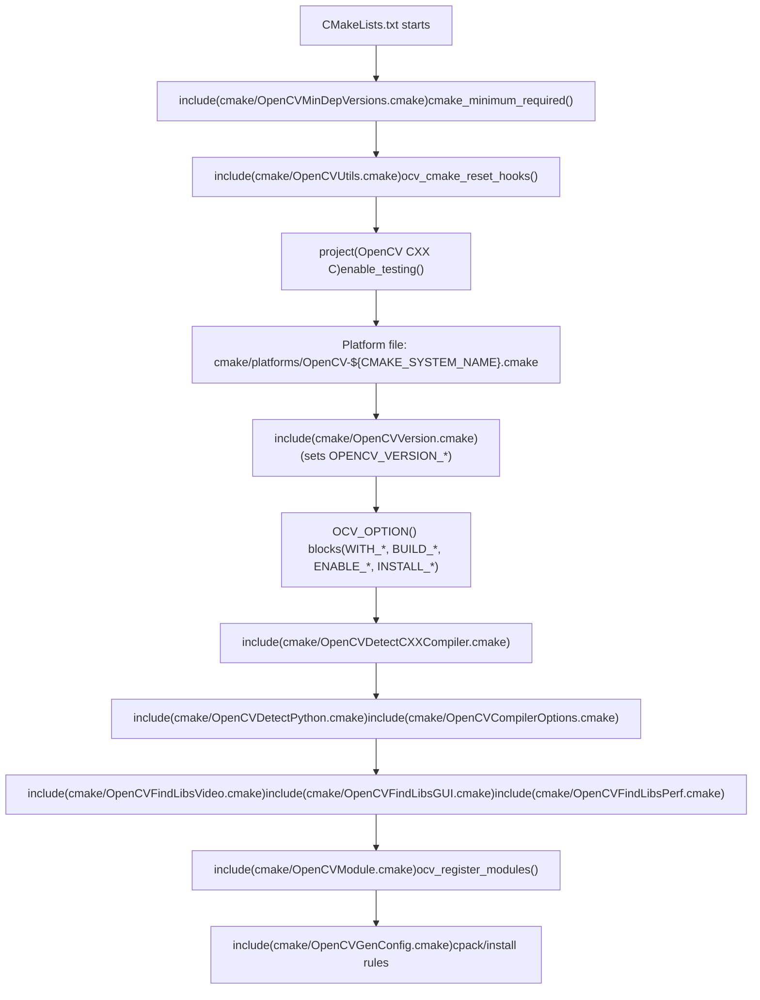
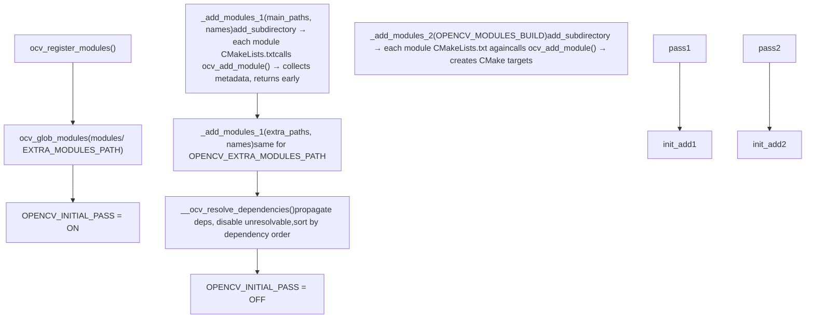
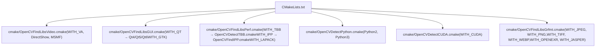
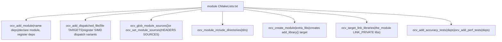

# 构建系统

相关源文件

-   [3rdparty/fastcv/fastcv.cmake](https://github.com/opencv/opencv/blob/91c78f50/3rdparty/fastcv/fastcv.cmake)
-   [3rdparty/ippicv/CMakeLists.txt](https://github.com/opencv/opencv/blob/91c78f50/3rdparty/ippicv/CMakeLists.txt)
-   [CMakeLists.txt](https://github.com/opencv/opencv/blob/91c78f50/CMakeLists.txt)
-   [cmake/OpenCVCRTLinkage.cmake](https://github.com/opencv/opencv/blob/91c78f50/cmake/OpenCVCRTLinkage.cmake)
-   [cmake/OpenCVCompilerOptions.cmake](https://github.com/opencv/opencv/blob/91c78f50/cmake/OpenCVCompilerOptions.cmake)
-   [cmake/OpenCVDetectCXXCompiler.cmake](https://github.com/opencv/opencv/blob/91c78f50/cmake/OpenCVDetectCXXCompiler.cmake)
-   [cmake/OpenCVFindIPP.cmake](https://github.com/opencv/opencv/blob/91c78f50/cmake/OpenCVFindIPP.cmake)
-   [cmake/OpenCVFindIPPIW.cmake](https://github.com/opencv/opencv/blob/91c78f50/cmake/OpenCVFindIPPIW.cmake)
-   [cmake/OpenCVFindLibsGUI.cmake](https://github.com/opencv/opencv/blob/91c78f50/cmake/OpenCVFindLibsGUI.cmake)
-   [cmake/OpenCVFindLibsPerf.cmake](https://github.com/opencv/opencv/blob/91c78f50/cmake/OpenCVFindLibsPerf.cmake)
-   [cmake/OpenCVFindLibsVideo.cmake](https://github.com/opencv/opencv/blob/91c78f50/cmake/OpenCVFindLibsVideo.cmake)
-   [cmake/OpenCVGenConfig.cmake](https://github.com/opencv/opencv/blob/91c78f50/cmake/OpenCVGenConfig.cmake)
-   [cmake/OpenCVInstallLayout.cmake](https://github.com/opencv/opencv/blob/91c78f50/cmake/OpenCVInstallLayout.cmake)
-   [cmake/OpenCVModule.cmake](https://github.com/opencv/opencv/blob/91c78f50/cmake/OpenCVModule.cmake)
-   [cmake/OpenCVPCHSupport.cmake](https://github.com/opencv/opencv/blob/91c78f50/cmake/OpenCVPCHSupport.cmake)
-   [cmake/OpenCVUtils.cmake](https://github.com/opencv/opencv/blob/91c78f50/cmake/OpenCVUtils.cmake)
-   [cmake/templates/OpenCVConfig-version.cmake.in](https://github.com/opencv/opencv/blob/91c78f50/cmake/templates/OpenCVConfig-version.cmake.in)
-   [cmake/templates/OpenCVConfig.cmake.in](https://github.com/opencv/opencv/blob/91c78f50/cmake/templates/OpenCVConfig.cmake.in)
-   [cmake/templates/OpenCVConfig.root-WIN32.cmake.in](https://github.com/opencv/opencv/blob/91c78f50/cmake/templates/OpenCVConfig.root-WIN32.cmake.in)
-   [cmake/templates/cvconfig.h.in](https://github.com/opencv/opencv/blob/91c78f50/cmake/templates/cvconfig.h.in)
-   [modules/core/CMakeLists.txt](https://github.com/opencv/opencv/blob/91c78f50/modules/core/CMakeLists.txt)
-   [modules/highgui/CMakeLists.txt](https://github.com/opencv/opencv/blob/91c78f50/modules/highgui/CMakeLists.txt)
-   [modules/highgui/include/opencv2/highgui.hpp](https://github.com/opencv/opencv/blob/91c78f50/modules/highgui/include/opencv2/highgui.hpp)
-   [modules/highgui/include/opencv2/highgui/highgui.hpp](https://github.com/opencv/opencv/blob/91c78f50/modules/highgui/include/opencv2/highgui/highgui.hpp)
-   [modules/highgui/include/opencv2/highgui/highgui\_c.h](https://github.com/opencv/opencv/blob/91c78f50/modules/highgui/include/opencv2/highgui/highgui_c.h)
-   [modules/highgui/src/precomp.hpp](https://github.com/opencv/opencv/blob/91c78f50/modules/highgui/src/precomp.hpp)
-   [modules/highgui/src/window.cpp](https://github.com/opencv/opencv/blob/91c78f50/modules/highgui/src/window.cpp)
-   [modules/highgui/src/window\_QT.cpp](https://github.com/opencv/opencv/blob/91c78f50/modules/highgui/src/window_QT.cpp)
-   [modules/highgui/src/window\_QT.h](https://github.com/opencv/opencv/blob/91c78f50/modules/highgui/src/window_QT.h)
-   [modules/highgui/src/window\_cocoa.mm](https://github.com/opencv/opencv/blob/91c78f50/modules/highgui/src/window_cocoa.mm)
-   [modules/highgui/src/window\_gtk.cpp](https://github.com/opencv/opencv/blob/91c78f50/modules/highgui/src/window_gtk.cpp)
-   [modules/highgui/src/window\_w32.cpp](https://github.com/opencv/opencv/blob/91c78f50/modules/highgui/src/window_w32.cpp)
-   [modules/java/CMakeLists.txt](https://github.com/opencv/opencv/blob/91c78f50/modules/java/CMakeLists.txt)
-   [modules/videoio/CMakeLists.txt](https://github.com/opencv/opencv/blob/91c78f50/modules/videoio/CMakeLists.txt)

本页描述了用于配置和编译 OpenCV 的基于 CMake 的构建系统。内容涵盖根 `CMakeLists.txt`、`cmake/` 目录中的主要支撑脚本、模块发现与依赖解析方式，以及第三方库检测方式。关于单个模块如何声明以及 `opencv_world` 如何组装，参见 [模块配置与 ocv\_add\_module](/opencv/opencv/2.2-module-configuration-and-ocv_add_module)。关于版本编号、打包和 Android SDK 构建脚本，参见 [版本管理、打包与平台构建](/opencv/opencv/2.3-version-management-packaging-and-platform-builds)。

---

## 概述

OpenCV 仅使用 CMake 作为其构建系统。一个根 `CMakeLists.txt` 驱动整个配置阶段，并将编译器检测、选项定义、模块扫描、依赖解析和第三方库探测委托给 `cmake/` 下的一组脚本。

**顶层构建脚本位置：**

| 文件 / 目录 | 作用 |
| --- | --- |
| `CMakeLists.txt` | 根入口 |
| `cmake/OpenCVUtils.cmake` | 共享工具宏（`OCV_OPTION`、`ocv_update`、标志检查） |
| `cmake/OpenCVModule.cmake` | 模块注册表、两阶段模块扫描、依赖解析 |
| `cmake/OpenCVDetectCXXCompiler.cmake` | 编译器识别、CPU 架构检测 |
| `cmake/OpenCVCompilerOptions.cmake` | 按编译器配置编译选项 |
| `cmake/OpenCVCompilerOptimizations.cmake` | SIMD 分发选项设置 |
| `cmake/OpenCVFindLibsVideo.cmake` | 视频 I/O 第三方库检测 |
| `cmake/OpenCVFindLibsGUI.cmake` | GUI 工具包检测（Qt、GTK） |
| `cmake/OpenCVFindLibsPerf.cmake` | 性能库检测（TBB、IPP、LAPACK） |
| `cmake/OpenCVDetectPython.cmake` | Python 解释器与库检测 |
| `cmake/OpenCVGenConfig.cmake` | 为下游使用者生成 `OpenCVConfig.cmake` |
| `cmake/templates/cvconfig.h.in` | 生成的 `cvconfig.h` 头文件模板 |
| `cmake/templates/OpenCVConfig.cmake.in` | 安装后的 `OpenCVConfig.cmake` 模板 |
| `cmake/platforms/` | 平台特定覆盖（Android、iOS 等） |

来源： [CMakeLists.txt1-200](https://github.com/opencv/opencv/blob/91c78f50/CMakeLists.txt#L1-L200) [cmake/OpenCVUtils.cmake1-50](https://github.com/opencv/opencv/blob/91c78f50/cmake/OpenCVUtils.cmake#L1-L50) [cmake/OpenCVModule.cmake1-55](https://github.com/opencv/opencv/blob/91c78f50/cmake/OpenCVModule.cmake#L1-L55)

---

## 根 CMakeLists.txt 逐步解析

根 `CMakeLists.txt` 按顺序执行以下步骤：

**`CMakeLists.txt` 中的配置期执行流：**


来源： [CMakeLists.txt16-800](https://github.com/opencv/opencv/blob/91c78f50/CMakeLists.txt#L16-L800)

### CMake 策略配置

根文件显式设置了 CMake 策略 `CMP0026` 到 `CMP0148`，以消除不同 CMake 版本之间的行为差异。特别是，`CMP0146` 和 `CMP0148` 被设置为 `OLD`，以保留传统 `FindCUDA` 与 `FindPythonInterp` 模块，而不是使用更新的 CMake 替代方案。

来源： [CMakeLists.txt31-93](https://github.com/opencv/opencv/blob/91c78f50/CMakeLists.txt#L31-L93)

### 禁止源码目录内构建

```
if(" ${CMAKE_SOURCE_DIR}" STREQUAL " ${CMAKE_BINARY_DIR}")  message(FATAL_ERROR ...)endif()
```
[CMakeLists.txt9-14](https://github.com/opencv/opencv/blob/91c78f50/CMakeLists.txt#L9-L14)

字符串比较中的前导空格是有意为之——它用于规避一个 CMake 问题：当 `CMAKE_SOURCE_DIR` 为空时，条件可能意外成立。

---

## 编译器与平台检测

`cmake/OpenCVDetectCXXCompiler.cmake` 在 `project()` 之后立即运行，并设置贯穿后续构建流程的布尔变量。

**编译器识别变量：**

| 变量 | 条件 |
| --- | --- |
| `CV_GCC` | `CMAKE_CXX_COMPILER_ID MATCHES "GNU"` |
| `CV_CLANG` | `CMAKE_CXX_COMPILER_ID MATCHES "Clang"`（包含 AppleClang） |
| `CV_ICC` | 检测到 Intel Classic 编译器 |
| `CV_ICX` | Intel LLVM 编译器（`icx`/`icpx`） |
| `MSVC` | 由 CMake 原生设置 |

**CPU 架构变量：**

| 变量 | 匹配到的处理器模式 |
| --- | --- |
| `X86_64` | `amd64.*`, `x86_64.*`, `AMD64.*` |
| `X86` | `i686.*`, `i386.*`, `x86.*` |
| `AARCH64` | `aarch64.*`, `arm64.*` |
| `ARM` | `arm.*`（32 位） |
| `PPC64LE` | `powerpc.*64le`, `ppc.*64le` |
| `RISCV` | `riscv.*` |
| `LOONGARCH64` | `loongarch64.*` |

`sizeof(void*)` 检查会在“64 位 CPU 上运行 32 位 OS”这类情况下修正架构变量（例如 `X86_64` → `X86`）。

来源： [cmake/OpenCVDetectCXXCompiler.cmake1-230](https://github.com/opencv/opencv/blob/91c78f50/cmake/OpenCVDetectCXXCompiler.cmake#L1-L230)

---

## 构建选项

宏 `OCV_OPTION`（定义于 `cmake/OpenCVUtils.cmake`）对 CMake 的 `option()` 进行了封装，支持条件可见性与构建后校验：

```
OCV_OPTION(<name> <description> <default>  [VISIBLE_IF <condition>]  [VERIFY <HAVE_variable>])
```
`VERIFY` 字段会在配置末尾检查：当 `WITH_<FEATURE>=ON` 时，`HAVE_<FEATURE>` 是否已实际设置。该检查由 `ENABLE_CONFIG_VERIFICATION` 启用。

`CMakeLists.txt` 中的主要选项分组：

| 前缀 | 目的 | 示例 |
| --- | --- | --- |
| `WITH_*` | 启用可选第三方特性 | `WITH_CUDA`, `WITH_TBB`, `WITH_QT`, `WITH_FFMPEG` |
| `BUILD_*` | 控制构建内容 | `BUILD_SHARED_LIBS`, `BUILD_TESTS`, `BUILD_opencv_world` |
| `ENABLE_*` | 编译器 / 代码生成选项 | `ENABLE_LTO`, `ENABLE_PROFILING`, `ENABLE_CCACHE` |
| `INSTALL_*` | 安装布局控制 | `INSTALL_CREATE_DISTRIB`, `INSTALL_TESTS` |

来源： [CMakeLists.txt195-555](https://github.com/opencv/opencv/blob/91c78f50/CMakeLists.txt#L195-L555) [cmake/OpenCVUtils.cmake715-800](https://github.com/opencv/opencv/blob/91c78f50/cmake/OpenCVUtils.cmake#L715-L800)

---

## 模块系统

OpenCV 模块系统完全实现于 `cmake/OpenCVModule.cmake`。它采用**两阶段**设计：第一阶段收集所有模块元数据；第二阶段创建 CMake target。

### 模块全局状态

每个模块 `opencv_<name>` 会填充一组缓存变量：

| 变量 | 含义 |
| --- | --- |
| `OPENCV_MODULE_<m>_LOCATION` | 模块源码目录 |
| `OPENCV_MODULE_<m>_DESCRIPTION` | 简短描述 |
| `OPENCV_MODULE_<m>_CLASS` | `PUBLIC`、`INTERNAL` 或 `BINDINGS` |
| `OPENCV_MODULE_<m>_REQ_DEPS` | 必需模块/库依赖 |
| `OPENCV_MODULE_<m>_OPT_DEPS` | 可选依赖 |
| `OPENCV_MODULE_<m>_DEPS` | 最终扁平依赖集合（传播后） |
| `OPENCV_MODULE_<m>_IS_PART_OF_WORLD` | 是否包含在 `opencv_world` 中 |
| `HAVE_<m>` | `ON`/`OFF` 快速可用性标志 |

模块构建状态列表：

| 列表变量 | 含义 |
| --- | --- |
| `OPENCV_MODULES_BUILD` | 计划编译的模块 |
| `OPENCV_MODULES_DISABLED_USER` | 通过 `BUILD_<m>=OFF` 显式禁用 |
| `OPENCV_MODULES_DISABLED_AUTO` | 因缺失必需依赖而禁用 |
| `OPENCV_MODULES_DISABLED_FORCE` | 由 `ocv_module_disable()` 无条件禁用 |

来源： [cmake/OpenCVModule.cmake1-75](https://github.com/opencv/opencv/blob/91c78f50/cmake/OpenCVModule.cmake#L1-L75)

### 两阶段模块扫描

**模块扫描与 target 创建流程：**


来源： [cmake/OpenCVModule.cmake347-399](https://github.com/opencv/opencv/blob/91c78f50/cmake/OpenCVModule.cmake#L347-L399)

### 依赖解析

`__ocv_resolve_dependencies()` 按以下顺序执行：

1.  **白名单过滤** —— 若设置了 `BUILD_LIST`，不在列表内（或其必需传递依赖链内）的模块将被禁用。
2.  **包装器依赖注入** —— 对声明了 `WRAP python` 的模块，加入对 `opencv_python2`/`opencv_python3` 的可选依赖。
3.  **迭代禁用** —— 必需依赖不可满足的模块会从 `OPENCV_MODULES_BUILD` 移到 `OPENCV_MODULES_DISABLED_AUTO`。该循环会重复直到稳定。
4.  **依赖传播** —— 每个模块的依赖集合扩展为包含传递依赖（依赖的依赖）。
5.  **world 替换** —— 当 `BUILD_opencv_world=ON` 时，对 world 成员模块的依赖会替换为对 `opencv_world` 的依赖。
6.  **拓扑排序** —— `__ocv_sort_modules_by_deps()` 对 `OPENCV_MODULES_BUILD` 排序，确保每个模块位于其所有依赖之后。

来源： [cmake/OpenCVModule.cmake500-695](https://github.com/opencv/opencv/blob/91c78f50/cmake/OpenCVModule.cmake#L500-L695)

### ocv\_add\_module 使用模式

典型模块 `CMakeLists.txt`（例如 `modules/core/CMakeLists.txt`）通常采用如下结构：

```
ocv_add_module(core    OPTIONAL opencv_cudev    WRAP java objc python js) ocv_glob_module_sources(...)ocv_module_include_directories(...)ocv_create_module(${extra_libs})ocv_add_accuracy_tests()ocv_add_perf_tests()
```
`ocv_add_module` 支持：

-   `INTERNAL` 或 `BINDINGS` 类别说明符（默认 `PUBLIC`）
-   `REQUIRED` 依赖（硬依赖——缺失即禁用模块）
-   `OPTIONAL` 依赖（软依赖——可用则纳入）
-   `PRIVATE_REQUIRED` / `PRIVATE_OPTIONAL` —— 不向依赖者传播
-   `WRAP <lang>` —— 注册语言绑定支持

来源： [cmake/OpenCVModule.cmake119-223](https://github.com/opencv/opencv/blob/91c78f50/cmake/OpenCVModule.cmake#L119-L223) [modules/core/CMakeLists.txt35-38](https://github.com/opencv/opencv/blob/91c78f50/modules/core/CMakeLists.txt#L35-L38)

---

## 第三方库检测

第三方检测遵循一致模式：根 `CMakeLists.txt` 检查某个 `WITH_<FEATURE>` 选项，然后包含相应检测脚本。每个脚本要么设置 `HAVE_<FEATURE>=ON`（并填充相关 include/library 变量），要么保持未设置。

**第三方检测脚本映射：**


来源： [CMakeLists.txt640-810](https://github.com/opencv/opencv/blob/91c78f50/CMakeLists.txt#L640-L810) [cmake/OpenCVFindLibsVideo.cmake1-12](https://github.com/opencv/opencv/blob/91c78f50/cmake/OpenCVFindLibsVideo.cmake#L1-L12) [cmake/OpenCVFindLibsGUI.cmake1-50](https://github.com/opencv/opencv/blob/91c78f50/cmake/OpenCVFindLibsGUI.cmake#L1-L50) [cmake/OpenCVFindLibsPerf.cmake1-80](https://github.com/opencv/opencv/blob/91c78f50/cmake/OpenCVFindLibsPerf.cmake#L1-L80)

### 内置第三方库

当系统库缺失，或强制 `BUILD_<LIB>=ON` 时，OpenCV 可以从源码构建其自带副本。各平台默认如下：

| 库 | Windows | macOS | Android | Linux（系统） |
| --- | --- | --- | --- | --- |
| `zlib` | bundled | bundled | bundled | system |
| `libjpeg` | bundled | bundled | bundled | system |
| `libpng` | bundled | bundled | bundled | system |
| `libtiff` | bundled | bundled | bundled | system |
| `OpenJPEG` | bundled | bundled | bundled | system |
| `TBB` | system | system | bundled | system |

全局开关 `OPENCV_FORCE_3RDPARTY_BUILD=ON` 可在所有平台强制使用内置构建。

来源： [CMakeLists.txt199-213](https://github.com/opencv/opencv/blob/91c78f50/CMakeLists.txt#L199-L213)

### IPP（Intel Performance Primitives）

`cmake/OpenCVFindIPP.cmake` 会先查找 ICV（可再分发子集），再查找独立 IPP 安装。找到后设置 `HAVE_IPP=ON`，并填充 `IPP_LIBRARIES` / `IPP_INCLUDE_DIRS`。配套脚本 `cmake/OpenCVFindIPPIW.cmake` 用于定位 IPP Integration Wrappers（`ipp_iw`）。

来源： [cmake/OpenCVFindIPP.cmake1-50](https://github.com/opencv/opencv/blob/91c78f50/cmake/OpenCVFindIPP.cmake#L1-L50) [cmake/OpenCVFindLibsPerf.cmake10-40](https://github.com/opencv/opencv/blob/91c78f50/cmake/OpenCVFindLibsPerf.cmake#L10-L40)

---

## 编译器选项

`cmake/OpenCVCompilerOptions.cmake` 在编译器检测后执行，将标志配置到 `OPENCV_EXTRA_CXX_FLAGS` 和 `OPENCV_EXTRA_C_FLAGS`。它通过 `ocv_check_flag_support`（定义在 `cmake/OpenCVUtils.cmake`）先探测某个标志是否可用，再决定是否添加。

关键配置结果：

| 设置 | GCC/Clang | MSVC |
| --- | --- | --- |
| 高警告级别 | `-Wall -W -Wreturn-type ...` | `/W4`（通过默认值） |
| 浮点模型 | （默认）或 `-ffast-math` | `/fp:precise` 或 `/fp:fast` |
| 帧指针 | `-fomit-frame-pointer`（可选） | N/A |
| 符号可见性 | `-fvisibility=hidden -fvisibility-inlines-hidden` | N/A |
| 函数段 | `-ffunction-sections -fdata-sections` | `/Gy` |
| 死代码剔除 | `-Wl,--gc-sections`（Linux）或 `-Wl,-dead_strip`（macOS） | N/A |
| LTO | `-flto` 或 `-flto=auto` | `/GL` + `/LTCG` |
| 预编译头 | 由 `ENABLE_PRECOMPILED_HEADERS` 控制 | `MSVC` 默认 ON |
| ccache | 通过 `RULE_LAUNCH_COMPILE` 或 Xcode 项目属性 | N/A |

SIMD 分发选项由 `cmake/OpenCVCompilerOptimizations.cmake` 设置，该脚本在 `OpenCVCompilerOptions.cmake` 末尾被包含。这会为 SSE2/SSE4/AVX2/NEON 等创建按文件分发 target（详见 [SIMD Intrinsics and CPU Dispatching](/opencv/opencv/3.5-simd-intrinsics-and-cpu-dispatching)）。

来源： [cmake/OpenCVCompilerOptions.cmake1-400](https://github.com/opencv/opencv/blob/91c78f50/cmake/OpenCVCompilerOptions.cmake#L1-L400)

---

## 配置输出文件

构建会生成两类配置输出，分别供 OpenCV 自身源码和下游 CMake 项目使用。

### cvconfig.h

从 `cmake/templates/cvconfig.h.in` 模板化生成，写入 `${CMAKE_BINARY_DIR}/cvconfig.h`。它包含每个已检测特性的 `#define` / `#cmakedefine` 宏：

```
#cmakedefine BUILD_SHARED_LIBS#cmakedefine CV_ENABLE_INTRINSICS#cmakedefine HAVE_JPEG#cmakedefine HAVE_PNG#cmakedefine HAVE_TBB/* ... */
```
OpenCV 自身源码会通过 `OPENCV_CONFIG_FILE_INCLUDE_DIR` include 路径包含该头文件。

来源： [cmake/templates/cvconfig.h.in1-80](https://github.com/opencv/opencv/blob/91c78f50/cmake/templates/cvconfig.h.in#L1-L80) [CMakeLists.txt626-627](https://github.com/opencv/opencv/blob/91c78f50/CMakeLists.txt#L626-L627)

### OpenCVConfig.cmake

由 `cmake/OpenCVGenConfig.cmake` 基于模板 `cmake/templates/OpenCVConfig.cmake.in` 生成。会产出三个变体：

| 变体 | 位置 | 使用场景 |
| --- | --- | --- |
| Build-tree | `${CMAKE_BINARY_DIR}/OpenCVConfig.cmake` | 不安装直接使用 OpenCV |
| Unix install | `${CMAKE_BINARY_DIR}/unix-install/OpenCVConfig.cmake` | `make install` 后 |
| Win install | `${CMAKE_BINARY_DIR}/win-install/OpenCVConfig.cmake` | 二进制包分发 |

下游项目按如下方式使用：

```
find_package(OpenCV REQUIRED core imgproc)target_link_libraries(my_app ${OpenCV_LIBS})
```
该配置文件会导出 `OpenCV_LIBS`、`OpenCV_INCLUDE_DIRS`、`OpenCV_VERSION` 以及按模块划分的 `OPENCV_<MODULE>_FOUND` 变量。

来源： [cmake/OpenCVGenConfig.cmake1-80](https://github.com/opencv/opencv/blob/91c78f50/cmake/OpenCVGenConfig.cmake#L1-L80) [cmake/templates/OpenCVConfig.cmake.in1-100](https://github.com/opencv/opencv/blob/91c78f50/cmake/templates/OpenCVConfig.cmake.in#L1-L100)

---

## CMake Hook 系统

`cmake/OpenCVUtils.cmake` 通过 `ocv_cmake_hook()` 和 `ocv_cmake_hook_append()` 实现了扩展 hook 系统。外部集成方可以通过设置 `OPENCV_CMAKE_HOOKS_DIR`，在配置序列命名节点注入自定义 `.cmake` 脚本。

命名 hook 点（节选）：

| Hook 名称 | 触发时机 |
| --- | --- |
| `CMAKE_INIT` | 最开始，加载工具函数之后 |
| `POST_DETECT_COMPILER` | `OpenCVDetectCXXCompiler.cmake` 之后 |
| `POST_OPTIONS` | 所有 `OCV_OPTION()` 声明之后 |
| `PRE_MODULES_SCAN` | 主模块第一次扫描前 |
| `PRE_MODULES_SCAN_EXTRA` | 扩展模块第一次扫描前 |
| `POST_MODULES_SCAN` | 第一阶段后、依赖解析前 |
| `PRE_MODULES_CREATE` | 第二阶段创建 target 前 |
| `POST_MODULES_CREATE` | 第二阶段后 |
| `PRE_ADD_MODULE_<name>` | 处理某个特定模块前 |

来源： [cmake/OpenCVUtils.cmake44-87](https://github.com/opencv/opencv/blob/91c78f50/cmake/OpenCVUtils.cmake#L44-L87) [CMakeLists.txt98-108](https://github.com/opencv/opencv/blob/91c78f50/CMakeLists.txt#L98-L108)

---

## 模块 CMakeLists.txt 结构

每个模块目录都包含一个 `CMakeLists.txt`，并会被处理两次（每阶段一次）。其中使用的宏都定义在 `cmake/OpenCVModule.cmake` 中。

**模块 CMakeLists.txt 内可用宏：**


来源： [cmake/OpenCVModule.cmake33-46](https://github.com/opencv/opencv/blob/91c78f50/cmake/OpenCVModule.cmake#L33-L46) [modules/core/CMakeLists.txt1-220](https://github.com/opencv/opencv/blob/91c78f50/modules/core/CMakeLists.txt#L1-L220) [modules/highgui/CMakeLists.txt1-50](https://github.com/opencv/opencv/blob/91c78f50/modules/highgui/CMakeLists.txt#L1-L50)

### 示例：highgui 后端选择

`modules/highgui/CMakeLists.txt` 展示了构建期条件后端选择。它会将 `OPENCV_HIGHGUI_BUILTIN_BACKEND` 设置为首个检测到的可用后端，并生成头文件：

```
Qt (HAVE_QT) > Wayland (HAVE_WAYLAND) > Cocoa (HAVE_COCOA) > Win32UI > GTK3/GTK2 > FB > NONE
```
结果通过 `ocv_update_file()` 写入 `opencv_highgui_config.hpp`。

来源： [modules/highgui/CMakeLists.txt50-270](https://github.com/opencv/opencv/blob/91c78f50/modules/highgui/CMakeLists.txt#L50-L270)

---

## 总结：脚本依赖关系图

下图将具体 CMake 脚本文件与其作用进行映射，并反映了实际 include 关系。

```mermaid
flowchart TD
    ROOT["CMakeLists.txt"]
    UTILS["cmake/OpenCVUtils.cmakeocv_update, OCV_OPTION,ocv_check_compiler_flag,ocv_cmake_hook"]
    VER["cmake/OpenCVVersion.cmakeOPENCV_VERSION_MAJOR/MINOR/PATCH"]
    COMPILER["cmake/OpenCVDetectCXXCompiler.cmakeCV_GCC, CV_CLANG, X86_64,AARCH64, ARM, RISCV"]
    COPTS["cmake/OpenCVCompilerOptions.cmakeOPENCV_EXTRA_CXX_FLAGSadd_extra_compiler_option()"]
    COPTIMIZE["cmake/OpenCVCompilerOptimizations.cmakeocv_add_dispatched_file()"]
    MODULE["cmake/OpenCVModule.cmakeocv_add_module()ocv_glob_modules()__ocv_resolve_dependencies()"]
    LIBVIDEO["cmake/OpenCVFindLibsVideo.cmakeHAVE_FFMPEG, HAVE_GSTREAMER,HAVE_MSMF, HAVE_V4L2"]
    LIBGUI["cmake/OpenCVFindLibsGUI.cmakeHAVE_QT, HAVE_GTK"]
    LIBPERF["cmake/OpenCVFindLibsPerf.cmakeHAVE_TBB, HAVE_IPP, HAVE_LAPACK"]
    PYTHON["cmake/OpenCVDetectPython.cmakePYTHON_DEFAULT_AVAILABLE"]
    GENCONF["cmake/OpenCVGenConfig.cmakeOpenCVConfig.cmake (3 variants)"]
    CONFTEMPL["cmake/templates/OpenCVConfig.cmake.inOpenCV_LIBS, OpenCV_INCLUDE_DIRS"]
    CVCONFIG["cmake/templates/cvconfig.h.in→ cvconfig.h (HAVE_* defines)"]

    ROOT --> UTILS
    ROOT --> VER
    ROOT --> COMPILER
    ROOT --> COPTS
    COPTS --> COPTIMIZE
    ROOT --> MODULE
    ROOT --> LIBVIDEO
    ROOT --> LIBGUI
    ROOT --> LIBPERF
    ROOT --> PYTHON
    ROOT --> GENCONF
    GENCONF --> CONFTEMPL
    ROOT --> CVCONFIG
```


来源： [CMakeLists.txt16-800](https://github.com/opencv/opencv/blob/91c78f50/CMakeLists.txt#L16-L800) [cmake/OpenCVModule.cmake1-10](https://github.com/opencv/opencv/blob/91c78f50/cmake/OpenCVModule.cmake#L1-L10) [cmake/OpenCVGenConfig.cmake1-80](https://github.com/opencv/opencv/blob/91c78f50/cmake/OpenCVGenConfig.cmake#L1-L80)
