# 跨平台构建配置

相关源文件

-   [CMakeLists.txt](https://github.com/opencv/opencv/blob/91c78f50/CMakeLists.txt)
-   [cmake/OpenCVCRTLinkage.cmake](https://github.com/opencv/opencv/blob/91c78f50/cmake/OpenCVCRTLinkage.cmake)
-   [cmake/OpenCVCompilerOptions.cmake](https://github.com/opencv/opencv/blob/91c78f50/cmake/OpenCVCompilerOptions.cmake)
-   [cmake/OpenCVDetectCXXCompiler.cmake](https://github.com/opencv/opencv/blob/91c78f50/cmake/OpenCVDetectCXXCompiler.cmake)
-   [cmake/OpenCVFindLibsGUI.cmake](https://github.com/opencv/opencv/blob/91c78f50/cmake/OpenCVFindLibsGUI.cmake)
-   [cmake/OpenCVFindLibsVideo.cmake](https://github.com/opencv/opencv/blob/91c78f50/cmake/OpenCVFindLibsVideo.cmake)
-   [cmake/OpenCVModule.cmake](https://github.com/opencv/opencv/blob/91c78f50/cmake/OpenCVModule.cmake)
-   [cmake/OpenCVPCHSupport.cmake](https://github.com/opencv/opencv/blob/91c78f50/cmake/OpenCVPCHSupport.cmake)
-   [cmake/OpenCVUtils.cmake](https://github.com/opencv/opencv/blob/91c78f50/cmake/OpenCVUtils.cmake)
-   [cmake/templates/OpenCVConfig.root-WIN32.cmake.in](https://github.com/opencv/opencv/blob/91c78f50/cmake/templates/OpenCVConfig.root-WIN32.cmake.in)
-   [cmake/templates/cvconfig.h.in](https://github.com/opencv/opencv/blob/91c78f50/cmake/templates/cvconfig.h.in)
-   [modules/core/CMakeLists.txt](https://github.com/opencv/opencv/blob/91c78f50/modules/core/CMakeLists.txt)
-   [modules/highgui/CMakeLists.txt](https://github.com/opencv/opencv/blob/91c78f50/modules/highgui/CMakeLists.txt)
-   [modules/highgui/include/opencv2/highgui.hpp](https://github.com/opencv/opencv/blob/91c78f50/modules/highgui/include/opencv2/highgui.hpp)
-   [modules/highgui/include/opencv2/highgui/highgui.hpp](https://github.com/opencv/opencv/blob/91c78f50/modules/highgui/include/opencv2/highgui/highgui.hpp)
-   [modules/highgui/include/opencv2/highgui/highgui\_c.h](https://github.com/opencv/opencv/blob/91c78f50/modules/highgui/include/opencv2/highgui/highgui_c.h)
-   [modules/highgui/src/precomp.hpp](https://github.com/opencv/opencv/blob/91c78f50/modules/highgui/src/precomp.hpp)
-   [modules/highgui/src/window.cpp](https://github.com/opencv/opencv/blob/91c78f50/modules/highgui/src/window.cpp)
-   [modules/highgui/src/window\_QT.cpp](https://github.com/opencv/opencv/blob/91c78f50/modules/highgui/src/window_QT.cpp)
-   [modules/highgui/src/window\_QT.h](https://github.com/opencv/opencv/blob/91c78f50/modules/highgui/src/window_QT.h)
-   [modules/highgui/src/window\_cocoa.mm](https://github.com/opencv/opencv/blob/91c78f50/modules/highgui/src/window_cocoa.mm)
-   [modules/highgui/src/window\_gtk.cpp](https://github.com/opencv/opencv/blob/91c78f50/modules/highgui/src/window_gtk.cpp)
-   [modules/highgui/src/window\_w32.cpp](https://github.com/opencv/opencv/blob/91c78f50/modules/highgui/src/window_w32.cpp)
-   [modules/java/CMakeLists.txt](https://github.com/opencv/opencv/blob/91c78f50/modules/java/CMakeLists.txt)
-   [modules/videoio/CMakeLists.txt](https://github.com/opencv/opencv/blob/91c78f50/modules/videoio/CMakeLists.txt)

## 目的与范围

本文解释 OpenCV 的跨平台构建配置系统，涵盖平台检测、编译器配置和第三方库集成。该构建系统使用 CMake 来检测目标平台、配置编译器并定位依赖。关于模块级配置，请参见第 2.2 页。

## 平台检测与配置

OpenCV 使用 CMake 检测目标平台并自动应用相应配置。流程从主 `CMakeLists.txt` 文件开始，在其中收集系统信息并加载平台特定文件。

### 构建系统初始化流程

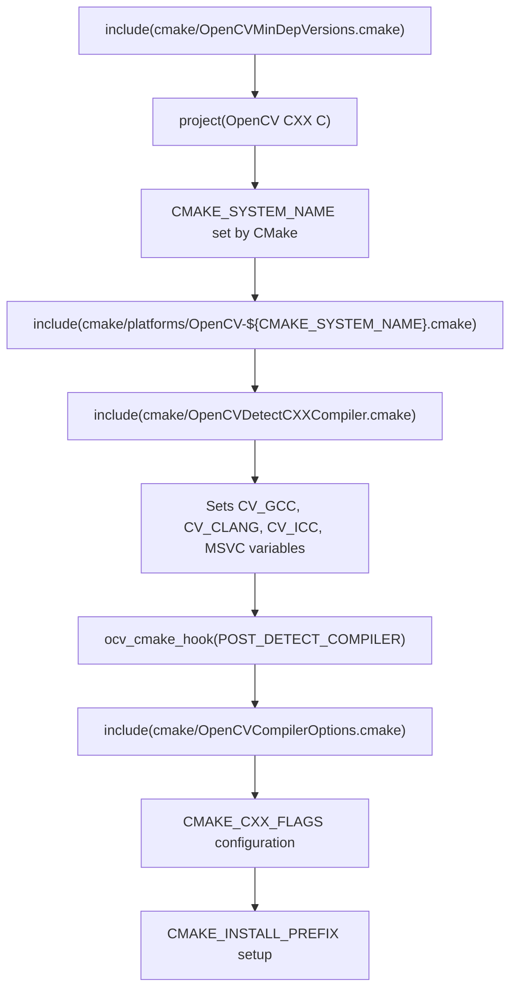
来源： [CMakeLists.txt16](https://github.com/opencv/opencv/blob/91c78f50/CMakeLists.txt#L16-L16) [CMakeLists.txt134](https://github.com/opencv/opencv/blob/91c78f50/CMakeLists.txt#L134-L134) [CMakeLists.txt144-149](https://github.com/opencv/opencv/blob/91c78f50/CMakeLists.txt#L144-L149) [CMakeLists.txt189](https://github.com/opencv/opencv/blob/91c78f50/CMakeLists.txt#L189-L189) [CMakeLists.txt646](https://github.com/opencv/opencv/blob/91c78f50/CMakeLists.txt#L646-L646) [cmake/OpenCVUtils.cmake104-114](https://github.com/opencv/opencv/blob/91c78f50/cmake/OpenCVUtils.cmake#L104-L114)

### 加载平台特定配置

OpenCV 基于 `CMAKE_SYSTEM_NAME` 加载平台特定配置文件：

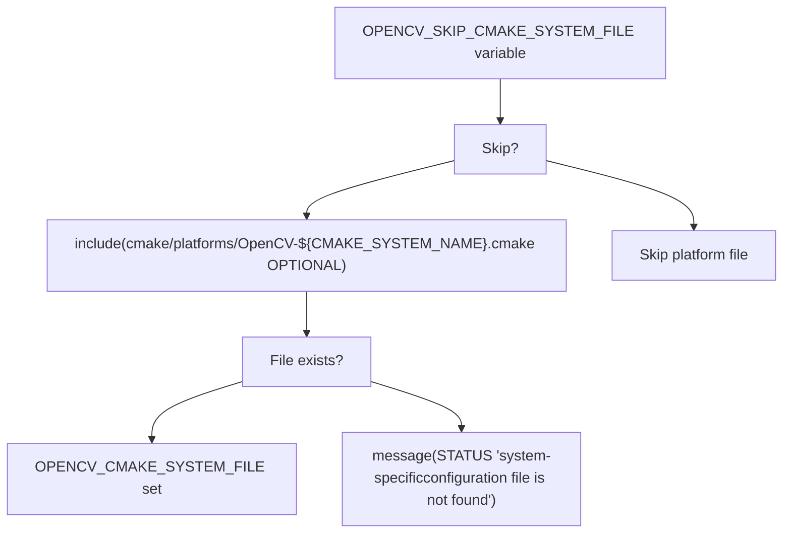
平台文件可能设置：

-   `OPENCV_EXTRA_FLAGS` - 编译器标志
-   `OPENCV_LINKER_LIBS` - 需要链接的系统库
-   `CMAKE_INSTALL_PREFIX` - 安装路径
-   平台特定 `OCV_OPTION` 默认值

来源： [CMakeLists.txt144-149](https://github.com/opencv/opencv/blob/91c78f50/CMakeLists.txt#L144-L149)

### 默认安装路径

`CMAKE_INSTALL_PREFIX` 会根据平台和交叉编译状态进行配置：

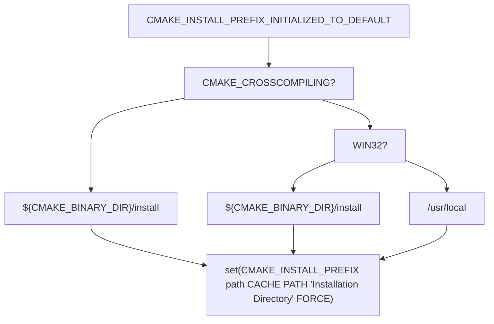
来源： [CMakeLists.txt151-162](https://github.com/opencv/opencv/blob/91c78f50/CMakeLists.txt#L151-L162)

## 编译器检测与配置

OpenCV 通过 `cmake/OpenCVCompilerOptions.cmake` 中定义的宏检测编译器类型并应用相应标志。

### 编译器检测与标志应用

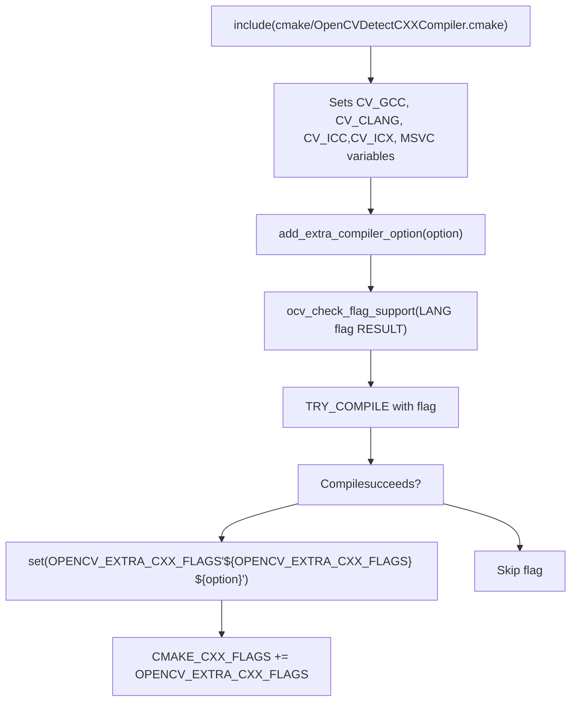
来源： [cmake/OpenCVCompilerOptions.cmake50-65](https://github.com/opencv/opencv/blob/91c78f50/cmake/OpenCVCompilerOptions.cmake#L50-L65) [cmake/OpenCVUtils.cmake455-559](https://github.com/opencv/opencv/blob/91c78f50/cmake/OpenCVUtils.cmake#L455-L559)

### 平台特定编译器配置

编译器标志会基于检测到的编译器类型进行配置：

| 编译器 | 关键标志 | 来源 |
| --- | --- | --- |
| GCC/Clang | `-W`, `-Wall`, `-Werror`（若 `OPENCV_WARNINGS_ARE_ERRORS`），`-fvisibility=hidden` | [cmake/OpenCVCompilerOptions.cmake132-214](https://github.com/opencv/opencv/blob/91c78f50/cmake/OpenCVCompilerOptions.cmake#L132-L214) |
| MSVC | `/D _CRT_SECURE_NO_DEPRECATE`, `/Gy`, `/bigobj`, `/WX`（若 `OPENCV_WARNINGS_ARE_ERRORS`） | [cmake/OpenCVCompilerOptions.cmake302-338](https://github.com/opencv/opencv/blob/91c78f50/cmake/OpenCVCompilerOptions.cmake#L302-L338) |
| ICC/ICX | `-fp-model precise`（若未启用 `ENABLE_FAST_MATH`） | [cmake/OpenCVCompilerOptions.cmake104-124](https://github.com/opencv/opencv/blob/91c78f50/cmake/OpenCVCompilerOptions.cmake#L104-L124) |

Fast Math 配置：

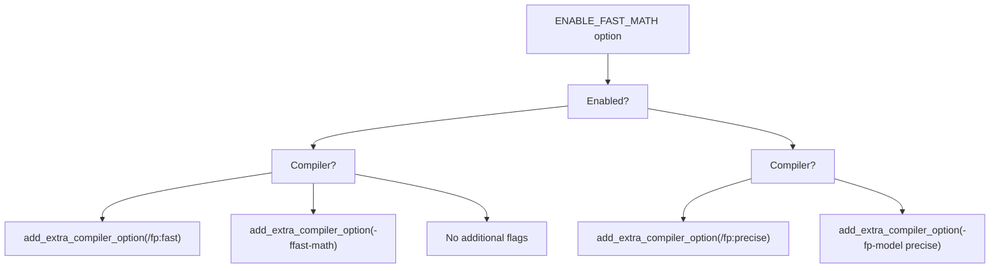
来源： [cmake/OpenCVCompilerOptions.cmake96-130](https://github.com/opencv/opencv/blob/91c78f50/cmake/OpenCVCompilerOptions.cmake#L96-L130)

### MSVC 运行时库链接

`BUILD_WITH_STATIC_CRT` 选项控制 MSVC 构建中的 C 运行时库链接方式：

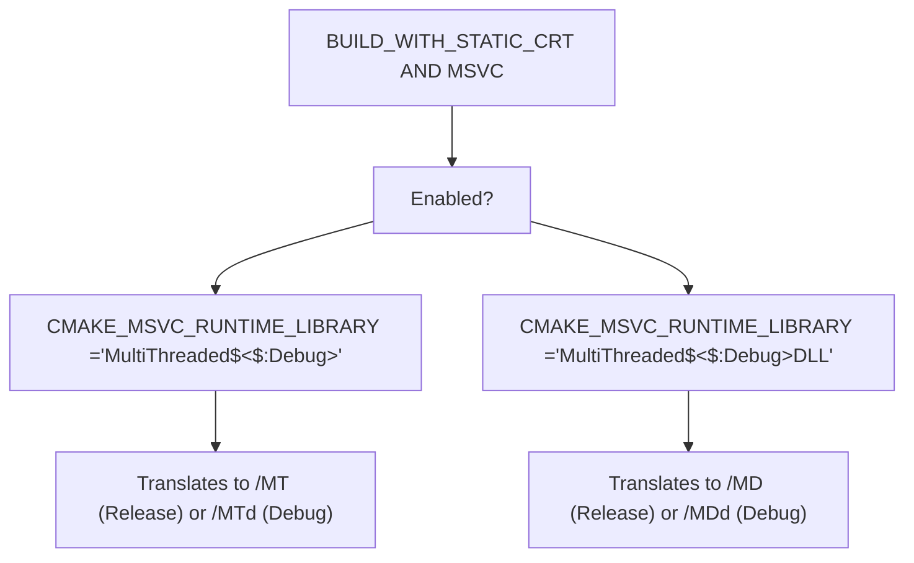
来源： [CMakeLists.txt497](https://github.com/opencv/opencv/blob/91c78f50/CMakeLists.txt#L497-L497) [cmake/OpenCVCRTLinkage.cmake40-60](https://github.com/opencv/opencv/blob/91c78f50/cmake/OpenCVCRTLinkage.cmake#L40-L60)

## 第三方库集成

OpenCV 通过 `OCV_OPTION` 宏和 `cmake/` 中的专用查找模块集成大量第三方库。

### OCV\_OPTION 依赖配置

`OCV_OPTION` 宏可在平台约束和校验条件下声明可选依赖：

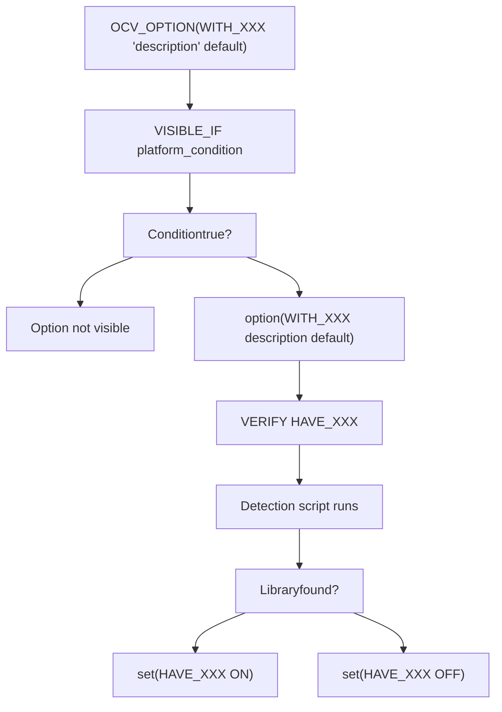
来源： [CMakeLists.txt196-482](https://github.com/opencv/opencv/blob/91c78f50/CMakeLists.txt#L196-L482) [cmake/OpenCVUtils.cmake715-780](https://github.com/opencv/opencv/blob/91c78f50/cmake/OpenCVUtils.cmake#L715-L780)

### 第三方库类别

OpenCV 在多个类别中集成库：

| 类别 | 库 | 检测脚本 |
| --- | --- | --- |
| 图像编解码 | JPEG、PNG、TIFF、WebP、OpenJPEG、AVIF | [cmake/OpenCVFindLibsGrfmt.cmake](https://github.com/opencv/opencv/blob/91c78f50/cmake/OpenCVFindLibsGrfmt.cmake) |
| 视频 I/O | FFmpeg、GStreamer、V4L2、MSMF | [cmake/OpenCVFindLibsVideo.cmake](https://github.com/opencv/opencv/blob/91c78f50/cmake/OpenCVFindLibsVideo.cmake) |
| GUI | Qt、GTK、Win32、Cocoa、Wayland | [cmake/OpenCVFindLibsGUI.cmake](https://github.com/opencv/opencv/blob/91c78f50/cmake/OpenCVFindLibsGUI.cmake) |
| 加速 | CUDA、OpenCL、TBB、OpenMP | [cmake/OpenCVDetectCUDA.cmake](https://github.com/opencv/opencv/blob/91c78f50/cmake/OpenCVDetectCUDA.cmake) [CMakeLists.txt351-359](https://github.com/opencv/opencv/blob/91c78f50/CMakeLists.txt#L351-L359) |
| 数学 | Eigen、LAPACK、IPP | [CMakeLists.txt262-264](https://github.com/opencv/opencv/blob/91c78f50/CMakeLists.txt#L262-L264) [CMakeLists.txt429-431](https://github.com/opencv/opencv/blob/91c78f50/CMakeLists.txt#L429-L431) |

### 图像编解码检测示例

`cmake/OpenCVFindLibsGrfmt.cmake` 中的图像编解码检测：

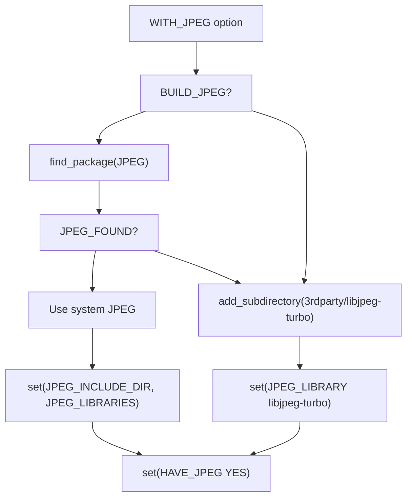
来源： [cmake/OpenCVFindLibsGrfmt.cmake71-120](https://github.com/opencv/opencv/blob/91c78f50/cmake/OpenCVFindLibsGrfmt.cmake#L71-L120)

### GUI 后端选择

在 `modules/highgui/CMakeLists.txt` 中，GUI 后端按优先级顺序选择：

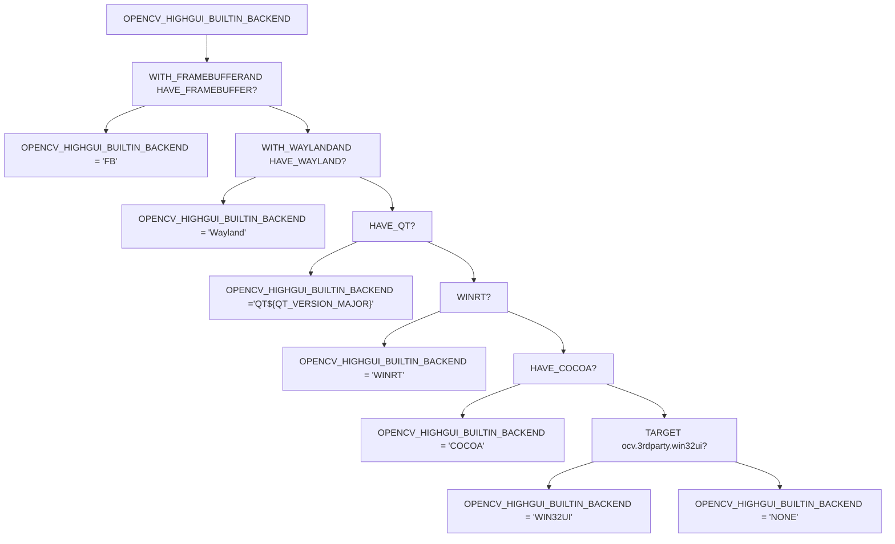
来源： [modules/highgui/CMakeLists.txt52-268](https://github.com/opencv/opencv/blob/91c78f50/modules/highgui/CMakeLists.txt#L52-L268)

### CUDA 检测示例

`cmake/OpenCVDetectCUDA.cmake` 中的 CUDA 检测流程：

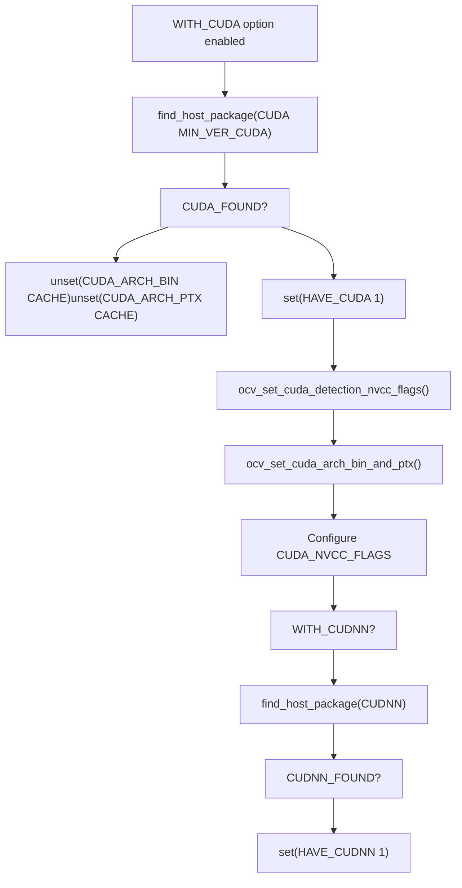
来源： [cmake/OpenCVDetectCUDA.cmake1-76](https://github.com/opencv/opencv/blob/91c78f50/cmake/OpenCVDetectCUDA.cmake#L1-L76) [CMakeLists.txt244-246](https://github.com/opencv/opencv/blob/91c78f50/CMakeLists.txt#L244-L246)

## 交叉编译支持

OpenCV 通过 CMake toolchain 文件与平台检测机制支持交叉编译。

### 交叉编译检测与配置

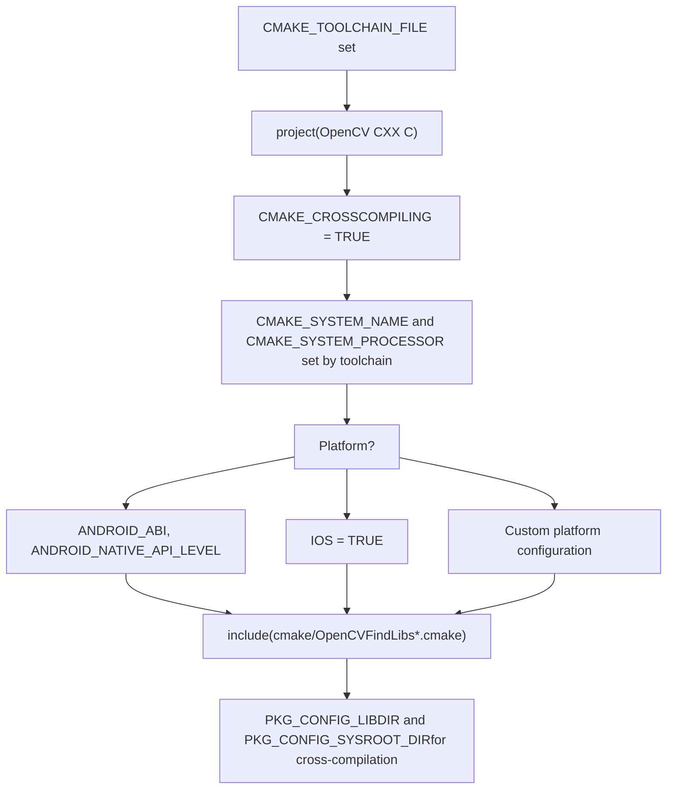
来源： [CMakeLists.txt705-722](https://github.com/opencv/opencv/blob/91c78f50/CMakeLists.txt#L705-L722) [CMakeLists.txt151-162](https://github.com/opencv/opencv/blob/91c78f50/CMakeLists.txt#L151-L162)

### 交叉编译时的调整

当 `CMAKE_CROSSCOMPILING` 为 true 时：

| 调整项 | 配置 |
| --- | --- |
| 安装路径 | `CMAKE_INSTALL_PREFIX = ${CMAKE_BINARY_DIR}/install` |
| pkg-config | 除非设置 `PKG_CONFIG_LIBDIR` 或 `PKG_CONFIG_SYSROOT_DIR`，否则禁用 |
| 系统库 | 库检测受限，主要使用内置 3rdparty |
| 模块选择 | 部分模块会根据目标平台被禁用 |

来源： [CMakeLists.txt151-162](https://github.com/opencv/opencv/blob/91c78f50/CMakeLists.txt#L151-L162) [CMakeLists.txt707-722](https://github.com/opencv/opencv/blob/91c78f50/CMakeLists.txt#L707-L722)

## 系统库与链接

OpenCV 会按平台检测并链接系统库，见 [CMakeLists.txt705-778](https://github.com/opencv/opencv/blob/91c78f50/CMakeLists.txt#L705-L778)

### UNIX/MinGW 系统库检测

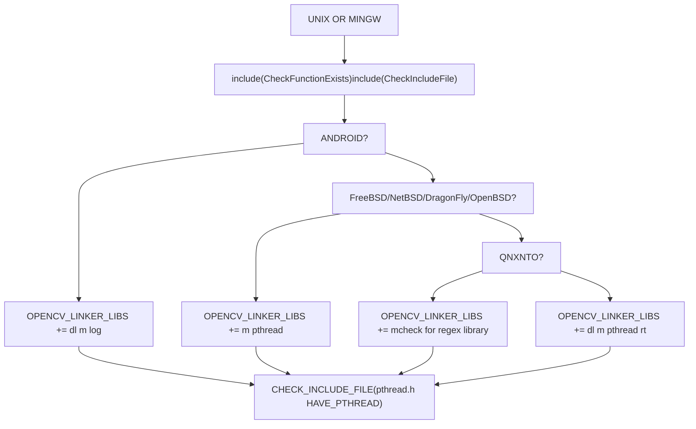
来源： [CMakeLists.txt705-778](https://github.com/opencv/opencv/blob/91c78f50/CMakeLists.txt#L705-L778)

### 内存对齐函数检测

OpenCV 会检测可用的内存对齐函数：

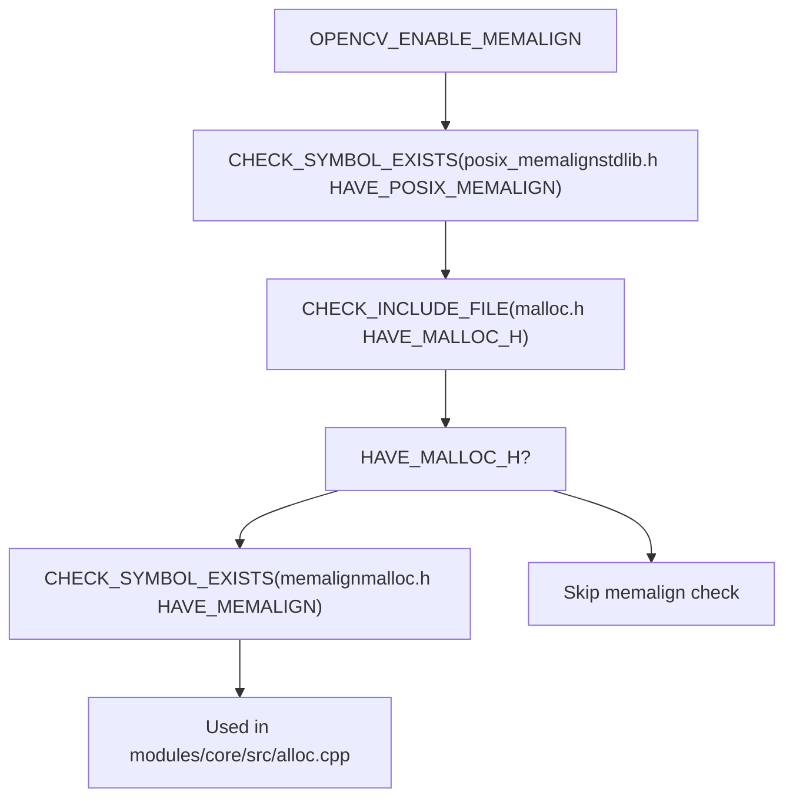
来源： [CMakeLists.txt756-777](https://github.com/opencv/opencv/blob/91c78f50/CMakeLists.txt#L756-L777) [modules/core/CMakeLists.txt107-118](https://github.com/opencv/opencv/blob/91c78f50/modules/core/CMakeLists.txt#L107-L118)

## 构建定制机制

OpenCV 通过 CMake hook 与环境变量支持构建定制。

### CMake Hook 系统

该 hook 系统允许在特定构建阶段注入自定义 CMake 脚本：

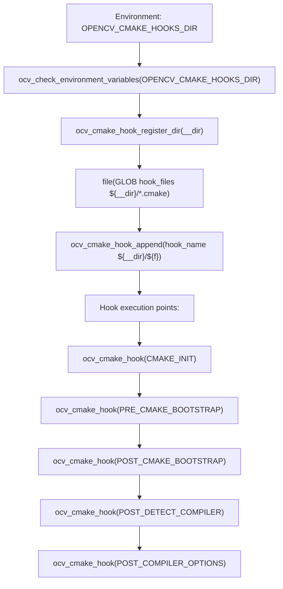
Hook 文件按 hook 点命名（例如 `POST_DETECT_COMPILER.cmake`），并会自动注册。

来源： [cmake/OpenCVUtils.cmake69-86](https://github.com/opencv/opencv/blob/91c78f50/cmake/OpenCVUtils.cmake#L69-L86) [CMakeLists.txt98-108](https://github.com/opencv/opencv/blob/91c78f50/CMakeLists.txt#L98-L108)

### 环境变量集成

`ocv_check_environment_variables()` 会从环境变量导入路径：

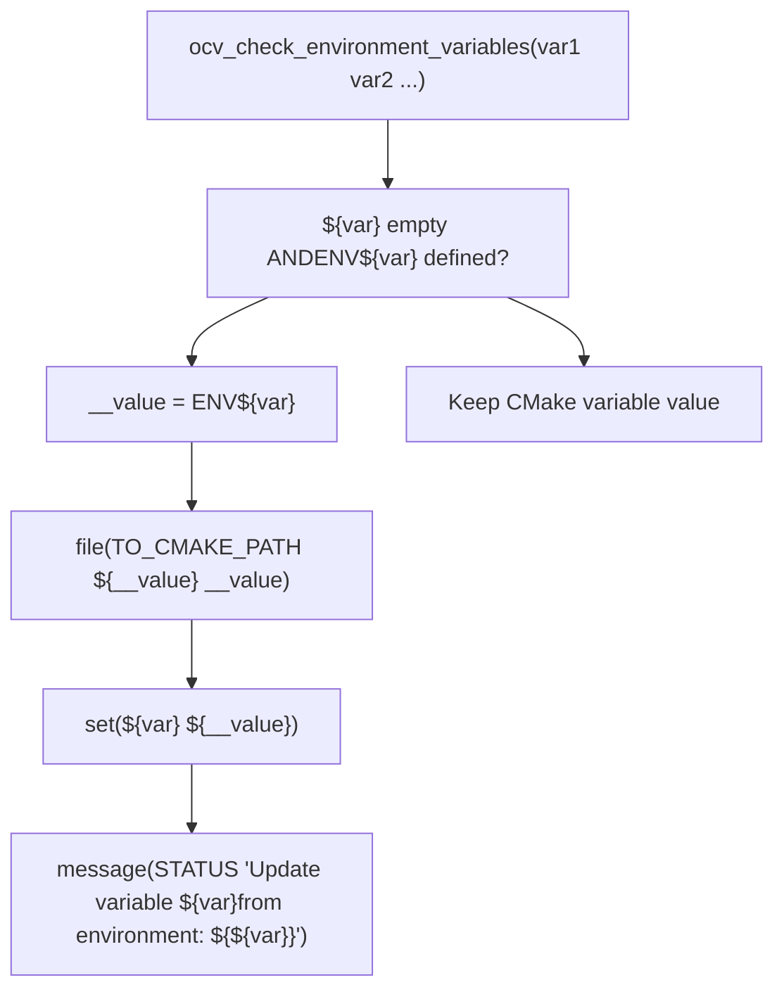
常见变量：`OPENCV_EXTRA_MODULES_PATH`、`OPENCV_CMAKE_HOOKS_DIR`

来源： [cmake/OpenCVUtils.cmake172-181](https://github.com/opencv/opencv/blob/91c78f50/cmake/OpenCVUtils.cmake#L172-L181) [CMakeLists.txt100](https://github.com/opencv/opencv/blob/91c78f50/CMakeLists.txt#L100-L100)

## 平台特定配置示例

### Windows 配置

| 组件 | 配置 | 来源 |
| --- | --- | --- |
| 编译器标志 | `/D _CRT_SECURE_NO_DEPRECATE`, `/Gy`, `/bigobj` | [cmake/OpenCVCompilerOptions.cmake302-338](https://github.com/opencv/opencv/blob/91c78f50/cmake/OpenCVCompilerOptions.cmake#L302-L338) |
| 系统库 | `comctl32`, `gdi32`, `ole32`, `setupapi`, `ws2_32` | [cmake/OpenCVFindLibsVideo.cmake2-4](https://github.com/opencv/opencv/blob/91c78f50/cmake/OpenCVFindLibsVideo.cmake#L2-L4) |
| GUI 后端 | 通过 `ocv.3rdparty.win32ui` target 使用 Win32 UI | [modules/highgui/CMakeLists.txt194-205](https://github.com/opencv/opencv/blob/91c78f50/modules/highgui/CMakeLists.txt#L194-L205) |
| 视频 I/O | DirectShow（`WITH_DSHOW`）或 Media Foundation（`WITH_MSMF`） | [CMakeLists.txt369-377](https://github.com/opencv/opencv/blob/91c78f50/CMakeLists.txt#L369-L377) |

### Linux 配置

| 组件 | 配置 | 来源 |
| --- | --- | --- |
| 编译器标志 | `-W`, `-Wall`, `-pthread`, `-fvisibility=hidden` | [cmake/OpenCVCompilerOptions.cmake132-206](https://github.com/opencv/opencv/blob/91c78f50/cmake/OpenCVCompilerOptions.cmake#L132-L206) |
| 系统库 | `dl`, `m`, `pthread`, `rt` | [CMakeLists.txt745](https://github.com/opencv/opencv/blob/91c78f50/CMakeLists.txt#L745-L745) |
| GUI 后端 | GTK2/GTK3 或 Qt | [cmake/OpenCVFindLibsGUI.cmake](https://github.com/opencv/opencv/blob/91c78f50/cmake/OpenCVFindLibsGUI.cmake) |
| 视频采集 | V4L2（`WITH_V4L`） | [CMakeLists.txt366-368](https://github.com/opencv/opencv/blob/91c78f50/CMakeLists.txt#L366-L368) |

### Android 配置

| 组件 | 配置 | 来源 |
| --- | --- | --- |
| ABI | `ANDROID_ABI`（armeabi-v7a、arm64-v8a、x86、x86\_64） | [cmake/OpenCVGenAndroidMK.cmake14-20](https://github.com/opencv/opencv/blob/91c78f50/cmake/OpenCVGenAndroidMK.cmake#L14-L20) |
| 系统库 | `dl`, `m`, `log` | [CMakeLists.txt731](https://github.com/opencv/opencv/blob/91c78f50/CMakeLists.txt#L731-L731) |
| Java 绑定 | 若 `BUILD_JAVA` 且 JNI 可用则启用 | [modules/java/CMakeLists.txt6-16](https://github.com/opencv/opencv/blob/91c78f50/modules/java/CMakeLists.txt#L6-L16) |
| 构建产物 | 通过 `build_sdk.py` 生成 `.aar` 包 | [platforms/android/build\_sdk.py](https://github.com/opencv/opencv/blob/91c78f50/platforms/android/build_sdk.py) |

### macOS/iOS 配置

| 组件 | 配置 | 来源 |
| --- | --- | --- |
| GUI 后端 | Cocoa（`HAVE_COCOA`） | [modules/highgui/CMakeLists.txt187-192](https://github.com/opencv/opencv/blob/91c78f50/modules/highgui/CMakeLists.txt#L187-L192) |
| 视频采集 | AVFoundation（`WITH_AVFOUNDATION`） | [CMakeLists.txt220-222](https://github.com/opencv/opencv/blob/91c78f50/CMakeLists.txt#L220-L222) |
| Framework | `APPLE_FRAMEWORK` 构建单一 framework | [CMakeLists.txt617-619](https://github.com/opencv/opencv/blob/91c78f50/CMakeLists.txt#L617-L619) |
| 系统库 | `-framework Cocoa`, `-framework Accelerate` | [modules/highgui/CMakeLists.txt191](https://github.com/opencv/opencv/blob/91c78f50/modules/highgui/CMakeLists.txt#L191-L191) |

## 结论

OpenCV 的跨平台构建配置系统是一套复杂而完善的机制，使该库能够在多样化的硬件与软件环境中被有效编译与使用。系统能够智能检测平台特征和可用依赖，从而为每个目标环境提供优化后的构建结果。

对于需要为特定平台定制 OpenCV 构建，或将 OpenCV 集成到跨平台项目中的开发者而言，理解这套配置系统至关重要。
