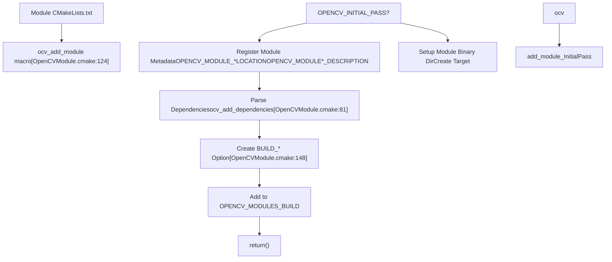
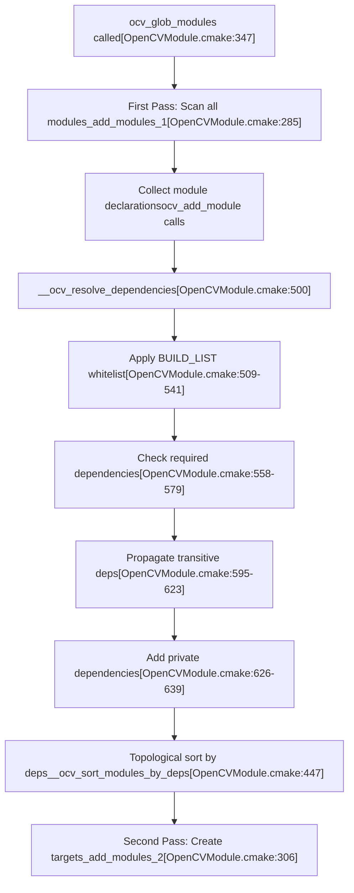
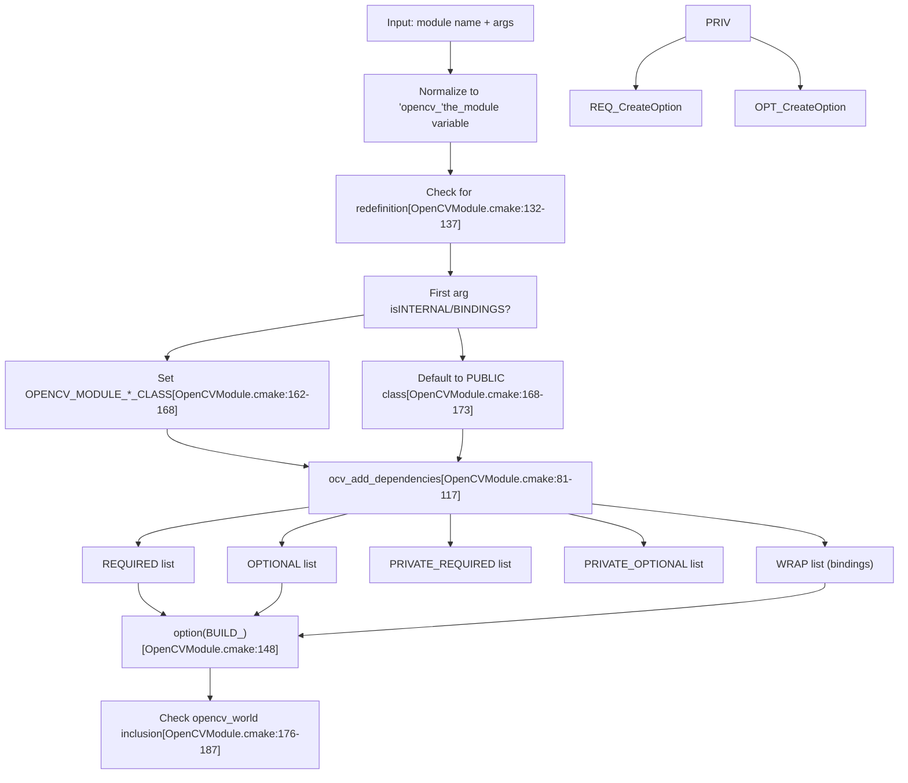
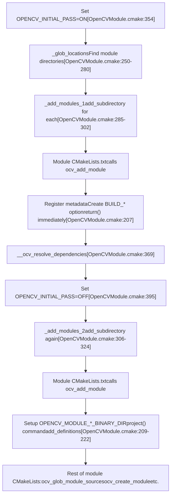
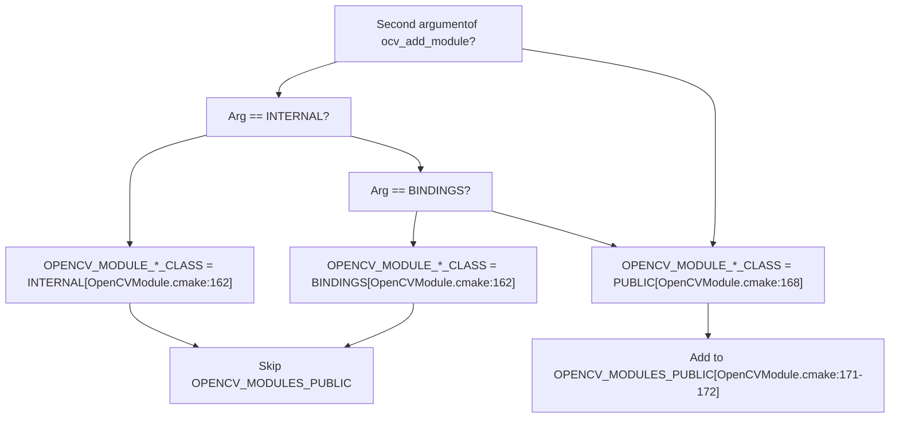
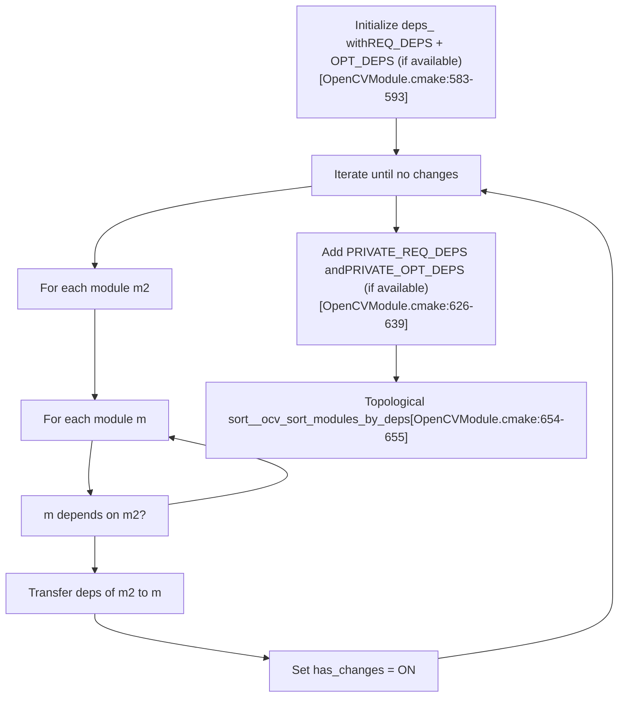
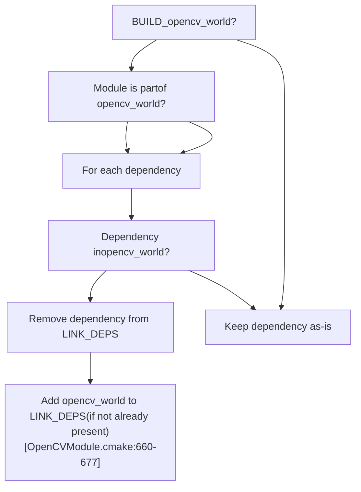
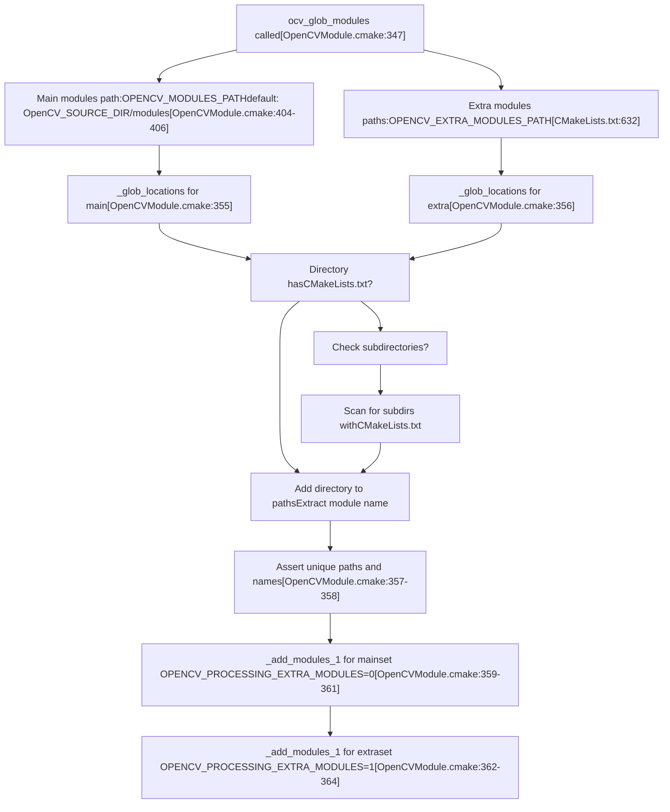

# 模块配置与 ocv\_add\_module

相关源文件

-   [3rdparty/fastcv/fastcv.cmake](https://github.com/opencv/opencv/blob/91c78f50/3rdparty/fastcv/fastcv.cmake)
-   [3rdparty/ippicv/CMakeLists.txt](https://github.com/opencv/opencv/blob/91c78f50/3rdparty/ippicv/CMakeLists.txt)
-   [CMakeLists.txt](https://github.com/opencv/opencv/blob/91c78f50/CMakeLists.txt)
-   [cmake/OpenCVCRTLinkage.cmake](https://github.com/opencv/opencv/blob/91c78f50/cmake/OpenCVCRTLinkage.cmake)
-   [cmake/OpenCVCompilerOptions.cmake](https://github.com/opencv/opencv/blob/91c78f50/cmake/OpenCVCompilerOptions.cmake)
-   [cmake/OpenCVDetectCXXCompiler.cmake](https://github.com/opencv/opencv/blob/91c78f50/cmake/OpenCVDetectCXXCompiler.cmake)
-   [cmake/OpenCVFindIPP.cmake](https://github.com/opencv/opencv/blob/91c78f50/cmake/OpenCVFindIPP.cmake)
-   [cmake/OpenCVFindIPPIW.cmake](https://github.com/opencv/opencv/blob/91c78f50/cmake/OpenCVFindIPPIW.cmake)
-   [cmake/OpenCVFindLibsGUI.cmake](https://github.com/opencv/opencv/blob/91c78f50/cmake/OpenCVFindLibsGUI.cmake)
-   [cmake/OpenCVFindLibsPerf.cmake](https://github.com/opencv/opencv/blob/91c78f50/cmake/OpenCVFindLibsPerf.cmake)
-   [cmake/OpenCVFindLibsVideo.cmake](https://github.com/opencv/opencv/blob/91c78f50/cmake/OpenCVFindLibsVideo.cmake)
-   [cmake/OpenCVGenConfig.cmake](https://github.com/opencv/opencv/blob/91c78f50/cmake/OpenCVGenConfig.cmake)
-   [cmake/OpenCVInstallLayout.cmake](https://github.com/opencv/opencv/blob/91c78f50/cmake/OpenCVInstallLayout.cmake)
-   [cmake/OpenCVModule.cmake](https://github.com/opencv/opencv/blob/91c78f50/cmake/OpenCVModule.cmake)
-   [cmake/OpenCVPCHSupport.cmake](https://github.com/opencv/opencv/blob/91c78f50/cmake/OpenCVPCHSupport.cmake)
-   [cmake/OpenCVUtils.cmake](https://github.com/opencv/opencv/blob/91c78f50/cmake/OpenCVUtils.cmake)
-   [cmake/templates/OpenCVConfig-version.cmake.in](https://github.com/opencv/opencv/blob/91c78f50/cmake/templates/OpenCVConfig-version.cmake.in)
-   [cmake/templates/OpenCVConfig.cmake.in](https://github.com/opencv/opencv/blob/91c78f50/cmake/templates/OpenCVConfig.cmake.in)
-   [cmake/templates/OpenCVConfig.root-WIN32.cmake.in](https://github.com/opencv/opencv/blob/91c78f50/cmake/templates/OpenCVConfig.root-WIN32.cmake.in)
-   [cmake/templates/cvconfig.h.in](https://github.com/opencv/opencv/blob/91c78f50/cmake/templates/cvconfig.h.in)
-   [modules/core/CMakeLists.txt](https://github.com/opencv/opencv/blob/91c78f50/modules/core/CMakeLists.txt)
-   [modules/highgui/CMakeLists.txt](https://github.com/opencv/opencv/blob/91c78f50/modules/highgui/CMakeLists.txt)
-   [modules/highgui/include/opencv2/highgui.hpp](https://github.com/opencv/opencv/blob/91c78f50/modules/highgui/include/opencv2/highgui.hpp)
-   [modules/highgui/include/opencv2/highgui/highgui.hpp](https://github.com/opencv/opencv/blob/91c78f50/modules/highgui/include/opencv2/highgui/highgui.hpp)
-   [modules/highgui/include/opencv2/highgui/highgui\_c.h](https://github.com/opencv/opencv/blob/91c78f50/modules/highgui/include/opencv2/highgui/highgui_c.h)
-   [modules/highgui/src/precomp.hpp](https://github.com/opencv/opencv/blob/91c78f50/modules/highgui/src/precomp.hpp)
-   [modules/highgui/src/window.cpp](https://github.com/opencv/opencv/blob/91c78f50/modules/highgui/src/window.cpp)
-   [modules/highgui/src/window\_QT.cpp](https://github.com/opencv/opencv/blob/91c78f50/modules/highgui/src/window_QT.cpp)
-   [modules/highgui/src/window\_QT.h](https://github.com/opencv/opencv/blob/91c78f50/modules/highgui/src/window_QT.h)
-   [modules/highgui/src/window\_cocoa.mm](https://github.com/opencv/opencv/blob/91c78f50/modules/highgui/src/window_cocoa.mm)
-   [modules/highgui/src/window\_gtk.cpp](https://github.com/opencv/opencv/blob/91c78f50/modules/highgui/src/window_gtk.cpp)
-   [modules/highgui/src/window\_w32.cpp](https://github.com/opencv/opencv/blob/91c78f50/modules/highgui/src/window_w32.cpp)
-   [modules/java/CMakeLists.txt](https://github.com/opencv/opencv/blob/91c78f50/modules/java/CMakeLists.txt)
-   [modules/videoio/CMakeLists.txt](https://github.com/opencv/opencv/blob/91c78f50/modules/videoio/CMakeLists.txt)

## 目的与范围

本文解释 OpenCV 的模块系统，重点说明模块如何声明、配置与构建。内容涵盖 `ocv_add_module` 宏、依赖解析、模块元数据管理，以及支持模块化编译的两阶段配置系统。

关于跨平台构建配置与第三方库检测，请参见 [跨平台构建配置](/opencv/opencv/2.1-cross-platform-build-configuration)。关于包生成与版本管理，请参见 [版本管理与平台构建](/opencv/opencv/2.3-version-management-packaging-and-platform-builds)。

## 模块声明概览

OpenCV 模块通过 `ocv_add_module` 宏定义。该宏将模块注册到构建系统并声明其依赖。每个模块都包含一个 `CMakeLists.txt` 文件，并将调用该宏作为其第一个关键动作。

**典型模块声明模式**

```
ocv_add_module(module_name     [INTERNAL|BINDINGS]    [REQUIRED] dependency1 dependency2    [OPTIONAL] optional_dep1    [PRIVATE_REQUIRED] private_dep    [WRAP] python java)
```
**模块声明流程**


来源： [cmake/OpenCVModule.cmake124-223](https://github.com/opencv/opencv/blob/91c78f50/cmake/OpenCVModule.cmake#L124-L223)

## 模块系统架构

模块系统使用集中式注册表来跟踪所有模块、其位置、依赖和构建状态。全局 CMake 缓存变量会在配置过程中维护这些状态。

**模块注册表结构**


来源： [cmake/OpenCVModule.cmake1-25](https://github.com/opencv/opencv/blob/91c78f50/cmake/OpenCVModule.cmake#L1-L25) [cmake/OpenCVModule.cmake69-74](https://github.com/opencv/opencv/blob/91c78f50/cmake/OpenCVModule.cmake#L69-L74)

## 依赖规格说明

依赖通过 `ocv_add_module` 和 `ocv_add_dependencies` 宏进行声明。系统支持四种依赖类型，它们在可见性和严格性上各不相同。

**依赖类型与解析**

| 依赖类型 | 关键字 | 可见性 | 缺失时影响 |
| --- | --- | --- | --- |
| 公有必需 | `REQUIRED` | 导出到 CMake 配置 | 模块禁用 |
| 公有可选 | `OPTIONAL` | 可用时导出 | 忽略 |
| 私有必需 | `PRIVATE_REQUIRED` | 仅内部 | 模块禁用 |
| 私有可选 | `PRIVATE_OPTIONAL` | 仅内部 | 忽略 |

**示例：core 模块依赖**

```
# From modules/core/CMakeLists.txtocv_add_module(core    OPTIONAL opencv_cudev    WRAP java objc python js)
```
**示例：imgcodecs 模块依赖**

```
# From modules/imgcodecs/CMakeLists.txtocv_add_module(imgcodecs opencv_imgproc     WRAP java objc python)
```
**依赖解析流程**


来源： [cmake/OpenCVModule.cmake347-399](https://github.com/opencv/opencv/blob/91c78f50/cmake/OpenCVModule.cmake#L347-L399) [cmake/OpenCVModule.cmake500-695](https://github.com/opencv/opencv/blob/91c78f50/cmake/OpenCVModule.cmake#L500-L695)

## ocv\_add\_module 宏

`ocv_add_module` 宏是模块注册的主要接口。它负责处理依赖声明、创建构建选项并初始化模块元数据。

**宏签名与参数**

[cmake/OpenCVModule.cmake119-223](https://github.com/opencv/opencv/blob/91c78f50/cmake/OpenCVModule.cmake#L119-L223)

```
ocv_add_module(<name>
    [INTERNAL|BINDINGS]
    [REQUIRED] <dep1> <dep2> ...
    [OPTIONAL] <opt_dep1> ...
    [PRIVATE_REQUIRED] <priv_dep1> ...
    [PRIVATE_OPTIONAL] <priv_opt1> ...
    [WRAP] <wrapper1> <wrapper2> ...)
```
**参数处理**


来源： [cmake/OpenCVModule.cmake124-223](https://github.com/opencv/opencv/blob/91c78f50/cmake/OpenCVModule.cmake#L124-L223)

## 两阶段配置系统

OpenCV 使用两阶段系统：第一阶段发现并注册全部模块，第二阶段在依赖解析后创建构建 target。

**两阶段执行模型**


来源： [cmake/OpenCVModule.cmake347-399](https://github.com/opencv/opencv/blob/91c78f50/cmake/OpenCVModule.cmake#L347-L399) [cmake/OpenCVModule.cmake130-223](https://github.com/opencv/opencv/blob/91c78f50/cmake/OpenCVModule.cmake#L130-L223)

## 模块类别与可见性

模块被分为三类，这会影响其在公共 API 与安装包中的可见性。

**模块分类系统**

| 类别 | 声明方式 | 公共 API | 安装 | 示例 |
| --- | --- | --- | --- | --- |
| `PUBLIC` | 默认或显式指定 | 是 | 是 | `core`, `imgproc`, `dnn` |
| `INTERNAL` | `ocv_add_module(name INTERNAL ...)` | 否 | 否 | 测试工具、内部工具 |
| `BINDINGS` | `ocv_add_module(name BINDINGS ...)` | 否 | 是 | `python`, `java` 绑定生成器 |

**类别判定逻辑**


来源： [cmake/OpenCVModule.cmake161-173](https://github.com/opencv/opencv/blob/91c78f50/cmake/OpenCVModule.cmake#L161-L173)

## 模块特定变量

构建系统为每个模块维护大量 CMake 缓存变量，前缀均为 `OPENCV_MODULE_<module_name>_`。

**关键模块变量**


来源： [cmake/OpenCVModule.cmake1-25](https://github.com/opencv/opencv/blob/91c78f50/cmake/OpenCVModule.cmake#L1-L25)

## 依赖解析细节

依赖解析算法会确保所有必需依赖可用，并在模块图中传播传递依赖。

**白名单过滤**

当设置 `BUILD_LIST` 时，仅构建指定模块及其依赖。

[cmake/OpenCVModule.cmake509-541](https://github.com/opencv/opencv/blob/91c78f50/cmake/OpenCVModule.cmake#L509-L541)

```
if(BUILD_LIST)    # Prepare the list    string(REGEX REPLACE "[ ,:]+" ";" whitelist "${BUILD_LIST}")    ocv_list_add_prefix(whitelist "opencv_")        # Expand the list to include dependencies    foreach(depth RANGE 10)        foreach(m ${whitelist})            list(APPEND new_whitelist ${OPENCV_MODULE_${m}_REQ_DEPS})            list(APPEND new_whitelist ${OPENCV_MODULE_${m}_PRIVATE_REQ_DEPS})        endforeach()    endforeach()        # Disable modules not in whitelist    foreach(m ${OPENCV_MODULES_BUILD})        if(m NOT IN whitelist)            __ocv_module_turn_off(${m})        endif()    endforeach()endif()
```
**传递依赖传播**


**拓扑排序算法**

`__ocv_sort_modules_by_deps` 函数会对模块排序，使依赖模块先于被依赖模块。

[cmake/OpenCVModule.cmake447-497](https://github.com/opencv/opencv/blob/91c78f50/cmake/OpenCVModule.cmake#L447-L497)

```
Algorithm:
1. Start with unsorted module list
2. For each module:
   - Check if all its dependencies are already in result
   - If yes, add module to result and remove from input
   - If no, skip and try next module
3. Repeat until all modules processed
4. If stuck (no progress), check for cycles or unresolved deps
```
来源： [cmake/OpenCVModule.cmake447-497](https://github.com/opencv/opencv/blob/91c78f50/cmake/OpenCVModule.cmake#L447-L497)

## 与 opencv\_world 的集成

`opencv_world` 模块是一个特殊聚合模块，会将多个 OpenCV 模块合并为一个共享库。

**opencv\_world 纳入逻辑**

[cmake/OpenCVModule.cmake176-187](https://github.com/opencv/opencv/blob/91c78f50/cmake/OpenCVModule.cmake#L176-L187)

模块会被纳入 `opencv_world` 的条件为：

-   `OPENCV_MODULE_IS_PART_OF_WORLD` 未显式设置为 OFF，且
-   模块类别不是 `BINDINGS`，且
-   要么构建共享库，要么模块类型未显式指定为 `STATIC`，且
-   当 `OPENCV_WORLD_EXCLUDE_EXTRA_MODULES` 为 ON 时，不处于额外模块处理阶段

**针对 opencv\_world 的依赖链接调整**


来源： [cmake/OpenCVModule.cmake660-677](https://github.com/opencv/opencv/blob/91c78f50/cmake/OpenCVModule.cmake#L660-L677)

## 模块发现流程

构建系统会通过扫描指定目录自动发现模块。

**模块发现流程**


来源： [cmake/OpenCVModule.cmake347-399](https://github.com/opencv/opencv/blob/91c78f50/cmake/OpenCVModule.cmake#L347-L399) [cmake/OpenCVModule.cmake250-280](https://github.com/opencv/opencv/blob/91c78f50/cmake/OpenCVModule.cmake#L250-L280)

## 实际示例

**示例 1：带依赖的简单模块**

`imgcodecs` 模块依赖 `imgproc`，并提供 Python/Java 绑定：

[modules/imgcodecs/CMakeLists.txt1-2](https://github.com/opencv/opencv/blob/91c78f50/modules/imgcodecs/CMakeLists.txt#L1-L2)

```
set(the_description "Image I/O")ocv_add_module(imgcodecs opencv_imgproc WRAP java objc python)
```
**示例 2：带可选依赖的模块**

`core` 模块在可用时可选使用 CUDA：

[modules/core/CMakeLists.txt35-37](https://github.com/opencv/opencv/blob/91c78f50/modules/core/CMakeLists.txt#L35-L37)

```
ocv_add_module(core               OPTIONAL opencv_cudev               WRAP java objc python js)
```
**示例 3：带多种依赖类型的复杂模块**

`highgui` 模块同时包含必需、可选和绑定依赖：

[modules/highgui/CMakeLists.txt3-7](https://github.com/opencv/opencv/blob/91c78f50/modules/highgui/CMakeLists.txt#L3-L7)

```
if(ANDROID)  ocv_add_module(highgui opencv_imgproc OPTIONAL opencv_imgcodecs opencv_videoio WRAP python)else()  ocv_add_module(highgui opencv_imgproc OPTIONAL opencv_imgcodecs opencv_videoio WRAP python java)endif()
```
**示例 4：Java 绑定模块**

`java` 模块属于 BINDINGS 类，并具有私有依赖：

[modules/java/CMakeLists.txt16](https://github.com/opencv/opencv/blob/91c78f50/modules/java/CMakeLists.txt#L16-L16)

```
ocv_add_module(java BINDINGS opencv_core opencv_imgproc     PRIVATE_REQUIRED opencv_java_bindings_generator)
```
## 模块辅助宏

除 `ocv_add_module` 之外，还有若干辅助宏可支持模块配置。

**模块禁用**

```
# Disable module if requirements not metocv_module_disable(module_name)# Or use underscore variant without automatic returnocv_module_disable_(module_name)
```
[cmake/OpenCVModule.cmake226-244](https://github.com/opencv/opencv/blob/91c78f50/cmake/OpenCVModule.cmake#L226-L244)

**依赖模块的 include 目录**

```
# Include headers from specified modulesocv_include_modules(opencv_core opencv_imgproc) # Include headers from modules and their dependencies (recursive)ocv_include_modules_recurse(opencv_core) # Target-specific includesocv_target_include_modules(target_name opencv_core opencv_imgproc)
```
[cmake/OpenCVModule.cmake699-752](https://github.com/opencv/opencv/blob/91c78f50/cmake/OpenCVModule.cmake#L699-L752)

**模块特定 include 目录**

```
# Add include directories for current moduleocv_module_include_directories([paths...])
```
[cmake/OpenCVModule.cmake755-772](https://github.com/opencv/opencv/blob/91c78f50/cmake/OpenCVModule.cmake#L755-L772)

来源： [cmake/OpenCVModule.cmake226-772](https://github.com/opencv/opencv/blob/91c78f50/cmake/OpenCVModule.cmake#L226-L772)

## 构建 Hook 与定制

模块系统在多个阶段提供 hook 以支持定制。

**可用 Hook 点**

| Hook 名称 | 调用点 | 使用场景 |
| --- | --- | --- |
| `PRE_ADD_MODULE` | 处理模块参数前 | 全局预处理 |
| `PRE_ADD_MODULE_${the_module}` | 特定模块前 | 模块级初始化 |
| `POST_ADD_MODULE` | 模块注册后 | 全局后处理 |
| `POST_ADD_MODULE_${the_module}` | 特定模块后 | 模块级收尾 |
| `PRE_MODULES_CREATE_${the_module}` | target 创建前 | 构建前准备 |
| `POST_MODULES_CREATE_${the_module}` | target 创建后 | 构建后处理 |

[cmake/OpenCVModule.cmake157-158](https://github.com/opencv/opencv/blob/91c78f50/cmake/OpenCVModule.cmake#L157-L158) [cmake/OpenCVModule.cmake205-206](https://github.com/opencv/opencv/blob/91c78f50/cmake/OpenCVModule.cmake#L205-L206) [cmake/OpenCVModule.cmake310-321](https://github.com/opencv/opencv/blob/91c78f50/cmake/OpenCVModule.cmake#L310-L321)

Hook 通过 `ocv_cmake_hook_append` 注册，通过 `ocv_cmake_hook` 执行。

来源： [cmake/OpenCVUtils.cmake48-87](https://github.com/opencv/opencv/blob/91c78f50/cmake/OpenCVUtils.cmake#L48-L87) [cmake/OpenCVModule.cmake157-158](https://github.com/opencv/opencv/blob/91c78f50/cmake/OpenCVModule.cmake#L157-L158) [cmake/OpenCVModule.cmake205-206](https://github.com/opencv/opencv/blob/91c78f50/cmake/OpenCVModule.cmake#L205-L206) [cmake/OpenCVModule.cmake310-321](https://github.com/opencv/opencv/blob/91c78f50/cmake/OpenCVModule.cmake#L310-L321)

## 总结

OpenCV 模块系统为模块化组件声明与构建提供了稳健框架：

1.  **声明式 API**：`ocv_add_module` 宏为模块注册提供清晰接口
2.  **灵活依赖**：四种依赖类型（公有/私有 × 必需/可选）支持精确控制
3.  **两阶段设计**：将发现与 target 创建分离，确保依赖解析正确
4.  **自动解析**：自动计算传递依赖并进行模块拓扑排序
5.  **分类系统**：PUBLIC、INTERNAL、BINDINGS 控制可见性与安装行为
6.  **World 集成**：自动处理聚合库 `opencv_world`
7.  **可扩展性**：hook 点与辅助宏支持多阶段定制

该架构使 OpenCV 能在支持选择性构建、多平台和多语言绑定的同时，维护具有复杂互依关系的大规模代码库。
