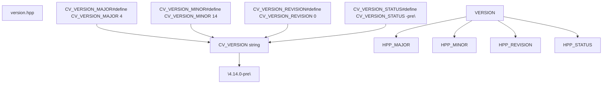

# 版本管理、打包与平台构建

相关源文件

-   [3rdparty/fastcv/fastcv.cmake](https://github.com/opencv/opencv/blob/91c78f50/3rdparty/fastcv/fastcv.cmake)
-   [3rdparty/ippicv/CMakeLists.txt](https://github.com/opencv/opencv/blob/91c78f50/3rdparty/ippicv/CMakeLists.txt)
-   [README.md](https://github.com/opencv/opencv/blob/91c78f50/README.md?plain=1)
-   [cmake/OpenCVFindIPP.cmake](https://github.com/opencv/opencv/blob/91c78f50/cmake/OpenCVFindIPP.cmake)
-   [cmake/OpenCVFindIPPIW.cmake](https://github.com/opencv/opencv/blob/91c78f50/cmake/OpenCVFindIPPIW.cmake)
-   [cmake/OpenCVFindLibsPerf.cmake](https://github.com/opencv/opencv/blob/91c78f50/cmake/OpenCVFindLibsPerf.cmake)
-   [cmake/OpenCVGenConfig.cmake](https://github.com/opencv/opencv/blob/91c78f50/cmake/OpenCVGenConfig.cmake)
-   [cmake/OpenCVInstallLayout.cmake](https://github.com/opencv/opencv/blob/91c78f50/cmake/OpenCVInstallLayout.cmake)
-   [cmake/OpenCVPackaging.cmake](https://github.com/opencv/opencv/blob/91c78f50/cmake/OpenCVPackaging.cmake)
-   [cmake/templates/OpenCVConfig-version.cmake.in](https://github.com/opencv/opencv/blob/91c78f50/cmake/templates/OpenCVConfig-version.cmake.in)
-   [cmake/templates/OpenCVConfig.cmake.in](https://github.com/opencv/opencv/blob/91c78f50/cmake/templates/OpenCVConfig.cmake.in)
-   [data/CMakeLists.txt](https://github.com/opencv/opencv/blob/91c78f50/data/CMakeLists.txt)
-   [doc/tutorials/dnn/dnn\_android/dnn\_android.markdown](https://github.com/opencv/opencv/blob/91c78f50/doc/tutorials/dnn/dnn_android/dnn_android.markdown?plain=1)
-   [doc/tutorials/introduction/cross\_referencing/tutorial\_cross\_referencing.markdown](https://github.com/opencv/opencv/blob/91c78f50/doc/tutorials/introduction/cross_referencing/tutorial_cross_referencing.markdown?plain=1)
-   [modules/core/include/opencv2/core/version.hpp](https://github.com/opencv/opencv/blob/91c78f50/modules/core/include/opencv2/core/version.hpp)
-   [modules/dnn/include/opencv2/dnn/version.hpp](https://github.com/opencv/opencv/blob/91c78f50/modules/dnn/include/opencv2/dnn/version.hpp)
-   [modules/python/package/setup.py](https://github.com/opencv/opencv/blob/91c78f50/modules/python/package/setup.py)
-   [platforms/android/build\_sdk.py](https://github.com/opencv/opencv/blob/91c78f50/platforms/android/build_sdk.py)
-   [platforms/android/ndk-10.config.py](https://github.com/opencv/opencv/blob/91c78f50/platforms/android/ndk-10.config.py)
-   [platforms/android/ndk-16.config.py](https://github.com/opencv/opencv/blob/91c78f50/platforms/android/ndk-16.config.py)
-   [platforms/maven/opencv-it/pom.xml](https://github.com/opencv/opencv/blob/91c78f50/platforms/maven/opencv-it/pom.xml)
-   [platforms/maven/opencv/pom.xml](https://github.com/opencv/opencv/blob/91c78f50/platforms/maven/opencv/pom.xml)
-   [platforms/maven/pom.xml](https://github.com/opencv/opencv/blob/91c78f50/platforms/maven/pom.xml)
-   [samples/CMakeLists.txt](https://github.com/opencv/opencv/blob/91c78f50/samples/CMakeLists.txt)
-   [samples/cpp/CMakeLists.txt](https://github.com/opencv/opencv/blob/91c78f50/samples/cpp/CMakeLists.txt)
-   [samples/gpu/CMakeLists.txt](https://github.com/opencv/opencv/blob/91c78f50/samples/gpu/CMakeLists.txt)

## 目的与范围

本文描述 OpenCV 的版本管理系统、基于 CPack 的打包机制以及平台特定构建流程。内容包括：

-   版本号方案与 `version.hpp` 头文件
-   版本号如何传播到 CMake、Python、Maven 以及 Android 构建脚本
-   通过 `cmake/OpenCVPackaging.cmake` 生成 DEB、RPM 与 ZIP 包
-   `build_sdk.py` 如何编排多 ABI Android SDK 构建
-   面向 Java/JVM 平台的 Maven 制品生成
-   Python 包分发（`setup.py`）

关于通用构建系统配置，请参见第 2.1 页。关于模块级构建细节，请参见第 2.2 页。 </old\_str> <new\_str>

## 目的与范围

本文描述 OpenCV 的版本管理系统、基于 CPack 的打包机制以及平台特定构建流程。内容包括：

-   版本号方案与 `version.hpp` 头文件
-   版本号如何传播到 CMake、Python、Maven 以及 Android 构建脚本
-   通过 `cmake/OpenCVPackaging.cmake` 生成 DEB、RPM 与 ZIP 包
-   `build_sdk.py` 如何编排多 ABI Android SDK 构建
-   面向 Java/JVM 平台的 Maven 制品生成
-   Python 包分发（`setup.py`）

关于通用构建系统配置，请参见第 2.1 页。关于模块级构建细节，请参见第 2.2 页。

---

## 版本号方案

OpenCV 使用四段式版本号方案，定义于 [modules/core/include/opencv2/core/version.hpp1-27](https://github.com/opencv/opencv/blob/91c78f50/modules/core/include/opencv2/core/version.hpp#L1-L27)：

```
CV_VERSION_MAJOR.CV_VERSION_MINOR.CV_VERSION_REVISION[CV_VERSION_STATUS]
```
### 版本组成

| 组成 | 宏 | 用途 | 示例 |
| --- | --- | --- | --- |
| Major | `CV_VERSION_MAJOR` | API 破坏性变更 | 4 |
| Minor | `CV_VERSION_MINOR` | 功能发布 | 14 |
| Revision | `CV_VERSION_REVISION` | Bug 修复 | 0 |
| Status | `CV_VERSION_STATUS` | 开发阶段 | "-pre" |

版本状态是可选项，通常为 `"-pre"`、`"-dev"`、`"-rc1"`，或在正式发布版本中为空字符串。

**版本头文件结构**


**来源：** [modules/core/include/opencv2/core/version.hpp1-27](https://github.com/opencv/opencv/blob/91c78f50/modules/core/include/opencv2/core/version.hpp#L1-L27)

---

## 版本在构建系统中的传播

版本信息会从源码头文件流经 CMake 配置，最终进入平台特定构建制品。

```mermaid
flowchart TD
    VER_HPP["version.hppCV_VERSION_MAJOR=4CV_VERSION_MINOR=14CV_VERSION_REVISION=0CV_VERSION_STATUS=-pre\"]
    CMAKE["CMakeLists.txtdetermine_opencv_version()"]
    VER_CMAKE["OpenCVVersion.cmakeOPENCV_VERSION variable"]
    WIN_DLL["Windows DLLopencv_core4140.dll"]
    LINUX_SO["Linux Shared Liblibopencv_core.so.4.14.0"]
    ANDROID_AAR["Android AAROpenCV-4.14.0-android-sdk.zip"]
    MAVEN_JAR["Maven Artifactopencv-4.13.0.jar"]
    PYTHON_WHL["Python Wheelopencv-4.13.0-py3-none-any.whl"]

    CMAKE --> VER_CMAKE
    VER --> HPP_CMAKE
    VER --> CMAKE_WIN_DLL
    VER --> CMAKE_LINUX_SO
    VER --> CMAKE_ANDROID_AAR
    VER --> CMAKE_MAVEN_JAR
    VER --> CMAKE_PYTHON_WHL
```


**来源：** [modules/core/include/opencv2/core/version.hpp1-27](https://github.com/opencv/opencv/blob/91c78f50/modules/core/include/opencv2/core/version.hpp#L1-L27) [CMakeLists.txt569-621](https://github.com/opencv/opencv/blob/91c78f50/CMakeLists.txt#L569-L621) [platforms/android/build\_sdk.py70-79](https://github.com/opencv/opencv/blob/91c78f50/platforms/android/build_sdk.py#L70-L79)

### DLL 版本后缀（Windows）

在 Windows 上，OpenCV 会在 DLL 名称中附加版本字符串，以支持多个版本并行安装：

-   **Release DLLs**：`opencv_<module><MAJOR><MINOR><REVISION>.dll`（例如 `opencv_core4140.dll`）
-   **Debug DLLs**：`opencv_<module><MAJOR><MINOR><REVISION>d.dll`（例如 `opencv_core4140d.dll`）

后缀配置位于 [CMakeLists.txt604-611](https://github.com/opencv/opencv/blob/91c78f50/CMakeLists.txt#L604-L611)：

```
if(WIN32)  # Postfix of DLLs:  ocv_update(OPENCV_DLLVERSION "${OPENCV_VERSION_MAJOR}${OPENCV_VERSION_MINOR}${OPENCV_VERSION_PATCH}")  ocv_update(OPENCV_DEBUG_POSTFIX d)else()  # Postfix of so's:  ocv_update(OPENCV_DLLVERSION "")  ocv_update(OPENCV_DEBUG_POSTFIX "")endif()
```
**来源：** [CMakeLists.txt604-615](https://github.com/opencv/opencv/blob/91c78f50/CMakeLists.txt#L604-L615)

---

## Android SDK 构建系统

Android SDK 通过 Python 脚本 `build_sdk.py` 构建。该脚本编排多 ABI 的 CMake 构建，并将结果打包为 AAR 压缩包。

### Android 构建流水线

```mermaid
flowchart TD
    BUILD_SDK_PY["build_sdk.py--config ndk-XX.config.py"]
    NDK_CONFIG["ndk-XX.config.pyABI definitions"]
    ANDROID_NDK["ANDROID_NDKenvironment variable"]
    ANDROID_SDK["ANDROID_SDKenvironment variable"]
    ABI_ARMV7["armeabi-v7a Buildplatform_id=2toolchain=clang"]
    ABI_ARM64["arm64-v8a Buildplatform_id=3toolchain=clang"]
    ABI_X86["x86 Buildplatform_id=5toolchain=clang"]
    ABI_X86_64["x86_64 Buildplatform_id=6toolchain=clang"]
    CMAKE_CONF["CMake Configure-DANDROID_ABI=...-DANDROID_PLATFORM=..."]
    NINJA_BUILD["Ninja Buildlibopencv_java4.so"]
    INSTALL["Install too4a/sdk/native/libs/"]
    COPY_LIBS["Copy Native Libslibs//libopencv_java4.so"]
    COPY_JAVA["Copy Java Classessrc/org/opencv/**/*.java"]
    COPY_HEADERS["Copy C++ Headerssdk/native/jni/include/"]
    GEN_AAR["Generate AAROpenCV-android-sdk/"]
    AAR_PKG["OpenCV-4.14.0-android-sdk.zip"]
    AAR_STRUCTURE["sdk/  native/libs//.so  native/jni/include/  java/src//.java  samples/"]

    BUILD --> SDK_PY_NDK_CONFIG
    BUILD --> SDK_PY_ANDROID_NDK
    BUILD --> SDK_PY_ANDROID_SDK
    NDK --> CONFIG_ABI_ARMV7
    NDK --> CONFIG_ABI_ARM64
    NDK --> CONFIG_ABI_X86
    NDK --> CONFIG_ABI_X86_64
    ABI --> ARMV7_CMAKE_CONF
    ABI --> ARM64_CMAKE_CONF
    ABI --> X86_CMAKE_CONF
    ABI --> X86_64_CMAKE_CONF
    CMAKE --> CONF_NINJA_BUILD
    NINJA --> BUILD_INSTALL
    INSTALL --> COPY_LIBS
    INSTALL --> COPY_JAVA
    INSTALL --> COPY_HEADERS
    COPY --> LIBS_GEN_AAR
    COPY --> JAVA_GEN_AAR
    COPY --> HEADERS_GEN_AAR
    GEN --> AAR_AAR_PKG
    AAR --> PKG_AAR_STRUCTURE
```


**来源：** [platforms/android/build\_sdk.py1-650](https://github.com/opencv/opencv/blob/91c78f50/platforms/android/build_sdk.py#L1-L650) [cmake/OpenCVGenAndroidMK.cmake1-100](https://github.com/opencv/opencv/blob/91c78f50/cmake/OpenCVGenAndroidMK.cmake#L1-L100)

### ABI 配置

每个 Android ABI 在 `ndk-XX.config.py` 这类配置文件中以特定构建参数定义：

| ABI | Platform ID | 架构 | 典型用途 |
| --- | --- | --- | --- |
| armeabi-v7a | 2 | ARMv7 32 位 + NEON | 老旧手机、低端设备 |
| arm64-v8a | 3 | ARMv8 64 位 | 新款手机、主目标 |
| x86 | 5 | Intel 32 位 | 模拟器、平板 |
| x86\_64 | 6 | Intel 64 位 | 高端平板、ChromeOS |

[platforms/android/build\_sdk.py120-143](https://github.com/opencv/opencv/blob/91c78f50/platforms/android/build_sdk.py#L120-L143) 中的 `ABI` 类封装了按 ABI 的配置：

```
class ABI:    def __init__(self, platform_id, name, toolchain, ndk_api_level = None, cmake_vars = dict()):        self.platform_id = platform_id  # platform code for apk version        self.name = name                # official Android ABI identifier        self.toolchain = toolchain      # toolchain identifier for cmake        self.cmake_vars = dict(            ANDROID_STL="c++_shared",            ANDROID_ABI=self.name,            ANDROID_PLATFORM_ID=platform_id,        )
```
**来源：** [platforms/android/build\_sdk.py120-143](https://github.com/opencv/opencv/blob/91c78f50/platforms/android/build_sdk.py#L120-L143) [platforms/android/ndk-10.config.py1-11](https://github.com/opencv/opencv/blob/91c78f50/platforms/android/ndk-10.config.py#L1-L11)

### Builder 类职责

[platforms/android/build\_sdk.py147-245](https://github.com/opencv/opencv/blob/91c78f50/platforms/android/build_sdk.py#L147-L245) 中的 `Builder` 类负责整个 Android SDK 构建：

| 方法 | 位置 | 职责 |
| --- | --- | --- |
| `get_cmake()` | [platforms/android/build\_sdk.py169-182](https://github.com/opencv/opencv/blob/91c78f50/platforms/android/build_sdk.py#L169-L182) | 定位 CMake（系统 PATH 或 Android SDK） |
| `get_ninja()` | [platforms/android/build\_sdk.py184-197](https://github.com/opencv/opencv/blob/91c78f50/platforms/android/build_sdk.py#L184-L197) | 定位 Ninja（系统 PATH 或 Android SDK） |
| `get_toolchain_file()` | [platforms/android/build\_sdk.py199-208](https://github.com/opencv/opencv/blob/91c78f50/platforms/android/build_sdk.py#L199-L208) | 选择 `android.toolchain.cmake`（NDK 或 OpenCV 回退） |
| `build_library(abi, do_install, no_media_ndk)` | [platforms/android/build\_sdk.py222-298](https://github.com/opencv/opencv/blob/91c78f50/platforms/android/build_sdk.py#L222-L298) | 为单个 ABI 配置 CMake 并运行 Ninja |
| `build_javadoc()` | [platforms/android/build\_sdk.py300-345](https://github.com/opencv/opencv/blob/91c78f50/platforms/android/build_sdk.py#L300-L345) | 从 Java 源生成 Javadoc |
| `gather_results()` | [platforms/android/build\_sdk.py350-368](https://github.com/opencv/opencv/blob/91c78f50/platforms/android/build_sdk.py#L350-L368) | 将安装输出复制/移动到最终 SDK 目录 |

来源： [platforms/android/build\_sdk.py147-368](https://github.com/opencv/opencv/blob/91c78f50/platforms/android/build_sdk.py#L147-L368)

---

## Maven 制品生成

OpenCV 会将 Java 制品发布到 Maven Central 以供 JVM 应用使用。Maven 构建通过 `platforms/maven/` 下的 POM 文件配置。

### Maven 项目结构

```mermaid
flowchart TD
    PARENT["opencv-parentpom.xmlgroupId: org.opencvversion: 4.13.0"]
    OPENCV_MODULE["opencvpom.xmlpackaging: bundleOSGi support"]
    OPENCV_IT["opencv-itpom.xmlIntegration testsPax Exam"]
    CMAKE_BUILD["CMake BuildBUILD_JAVA=ON"]
    JAVA_GEN["Java Code Generationgen2.py / gen_java.py"]
    JAR_BUILD["JAR Creationopencv-4130.jar"]
    NATIVE_LIB["Native Librarylibopencv_java4.so"]
    JAR_ARTIFACT["opencv-4.13.0.jarorg/opencv/**/*.class"]
    NATIVE_ARTIFACT["opencv-4.13.0-natives--.jarContains .so/.dylib/.dll"]
    POM_ARTIFACT["opencv-4.13.0.pomDependency metadata"]
    OSSRH["OSSRH Stagingoss.sonatype.org"]
    MAVEN_CENTRAL["Maven Centralrepo.maven.apache.org"]

    PARENT --> OPENCV_MODULE
    PARENT --> OPENCV_IT
    CMAKE --> BUILD_JAVA_GEN
    JAVA --> GEN_JAR_BUILD
    CMAKE --> BUILD_NATIVE_LIB
    JAR --> BUILD_JAR_ARTIFACT
    NATIVE --> LIB_NATIVE_ARTIFACT
    OPENCV --> MODULE_POM_ARTIFACT
    JAR --> ARTIFACT_OSSRH
    NATIVE --> ARTIFACT_OSSRH
    POM --> ARTIFACT_OSSRH
    OSSRH --> MAVEN_CENTRAL
```


**来源：** [platforms/maven/pom.xml1-58](https://github.com/opencv/opencv/blob/91c78f50/platforms/maven/pom.xml#L1-L58) [platforms/maven/opencv/pom.xml1-150](https://github.com/opencv/opencv/blob/91c78f50/platforms/maven/opencv/pom.xml#L1-L150)

### Maven 坐标与版本管理

父 POM [platforms/maven/pom.xml1-58](https://github.com/opencv/opencv/blob/91c78f50/platforms/maven/pom.xml#L1-L58) 定义：

```
<groupId>org.opencv</groupId><artifactId>opencv-parent</artifactId><version>4.13.0</version>
```
应用依赖 OpenCV 的方式为：

```
<dependency>    <groupId>org.opencv</groupId>    <artifactId>opencv</artifactId>    <version>4.13.0</version></dependency>
```
该版本必须与 [modules/core/include/opencv2/core/version.hpp8-11](https://github.com/opencv/opencv/blob/91c78f50/modules/core/include/opencv2/core/version.hpp#L8-L11) 中定义的 C++ 版本手动保持同步。这通常在发布准备阶段完成。

**来源：** [platforms/maven/pom.xml4-7](https://github.com/opencv/opencv/blob/91c78f50/platforms/maven/pom.xml#L4-L7) [platforms/maven/opencv/pom.xml4-12](https://github.com/opencv/opencv/blob/91c78f50/platforms/maven/opencv/pom.xml#L4-L12)

### Maven 构建属性

[platforms/maven/opencv/pom.xml14-19](https://github.com/opencv/opencv/blob/91c78f50/platforms/maven/opencv/pom.xml#L14-L19) 中定义的关键属性：

| 属性 | 值 | 用途 |
| --- | --- | --- |
| `source.path` | `../../..` | OpenCV 源码根路径 |
| `build.directory` | `<source>/build` | CMake 构建目录 |
| `nativelibrary.name` | `libopencv_java${lib.version.string}.so` | 原生库文件名 |
| `resources.directory` | `<build>/src` | 生成的 Java 源码 |

**来源：** [platforms/maven/opencv/pom.xml14-19](https://github.com/opencv/opencv/blob/91c78f50/platforms/maven/opencv/pom.xml#L14-L19)

---

## Python 包分发

OpenCV 提供通过 PyPI（pip）分发的 Python 绑定。该包通过 [modules/python/package/setup.py1-52](https://github.com/opencv/opencv/blob/91c78f50/modules/python/package/setup.py#L1-L52) 中的 setuptools 配置进行构建。

### Python 包结构

```mermaid
flowchart TD
    CPP_HEADERS["C++ Headersopencv2/*.hpp"]
    HDR_PARSER["hdr_parser.pyParse headers"]
    GEN2["gen2.pyGenerate bindings"]
    GENERATED["pyopencv_generated_*.hcv2.pyi stubs"]
    CV2_PKG["cv2/  init.py  cv2.so  *.pyi  py.typed"]
    SETUP_PY["setup.pyversion: 4.13.0name: opencv"]
    PYPROJECT["pyproject.tomlbuild-backend: setuptools"]
    CMAKE_PY["CMakeBUILD_opencv_python3=ON"]
    BUILD_EXT["build_extCompile cv2.so"]
    BDIST_WHEEL["bdist_wheelCreate .whl"]
    WHEEL["opencv-4.13.0-cp39-cp39-linux_x86_64.whl"]
    PYPI["PyPIpip install opencv"]
    CONDA["Conda Forgeconda install opencv"]

    CPP --> HEADERS_HDR_PARSER
    HDR --> PARSER_GEN2
    GEN2 --> GENERATED
    GENERATED --> CV2_PKG
    CV2 --> PKG_SETUP_PY
    SETUP --> PY_PYPROJECT
    CMAKE --> PY_BUILD_EXT
    SETUP --> PY_BUILD_EXT
    BUILD --> EXT_BDIST_WHEEL
    BDIST --> WHEEL_WHEEL
    WHEEL --> PYPI
    WHEEL --> CONDA
```


**来源：** [modules/python/package/setup.py1-52](https://github.com/opencv/opencv/blob/91c78f50/modules/python/package/setup.py#L1-L52) Diagram 2 from high-level overview

### Setup.py 配置

[modules/python/package/setup.py18-45](https://github.com/opencv/opencv/blob/91c78f50/modules/python/package/setup.py#L18-L45) 中的 setup 脚本定义：

```
def main():    package_name = 'opencv'    package_version = os.environ.get('OPENCV_VERSION', '4.13.0')        setuptools.setup(        name=package_name,        version=package_version,        url='https://github.com/opencv/opencv',        license='Apache 2.0',        description='OpenCV python bindings',        packages=setuptools.find_packages(),        package_data={            "cv2": typing_stub_files        },        # ...    )
```
版本由环境变量 `OPENCV_VERSION` 控制，通常由 CMake 在构建过程中设置。

**来源：** [modules/python/package/setup.py18-45](https://github.com/opencv/opencv/blob/91c78f50/modules/python/package/setup.py#L18-L45)

### 类型标注存根文件

OpenCV 包含 Python 类型标注存根（`.pyi` 文件），用于 IDE 自动补全与类型检查。setup 脚本在 [modules/python/package/setup.py8-15](https://github.com/opencv/opencv/blob/91c78f50/modules/python/package/setup.py#L8-L15) 中收集这些文件：

```
def collect_module_typing_stub_files(root_module_path):    stub_files = []    for module_path, _, files in os.walk(root_module_path):        stub_files.extend(            map(lambda p: os.path.join(module_path, p),                filter(lambda f: f.endswith(".pyi"), files))        )    return stub_files
```
当 `cv2/py.typed` 存在时，该包会被标记为符合 PEP 561，从而使类型检查器可使用这些存根。

**来源：** [modules/python/package/setup.py8-33](https://github.com/opencv/opencv/blob/91c78f50/modules/python/package/setup.py#L8-L33)

---

## 依赖版本的构建制品汇总

不同平台对版本信息的使用方式不同：

| 平台 | 版本来源 | 更新方式 | 示例制品 |
| --- | --- | --- | --- |
| **Windows DLL** | `OPENCV_DLLVERSION` CMake 变量 | 自动（CMake） | `opencv_core4140.dll` |
| **Linux Shared Lib** | CMake `SOVERSION` | 自动（CMake） | `libopencv_core.so.4.14.0` |
| **CPack DEB/RPM** | `OPENCV_VCSVERSION` CMake 变量 | 自动（CMake） | `opencv-4.14.0-amd64.deb` |
| **Android SDK ZIP** | `build_sdk.py` 中的 `determine_opencv_version()` | 自动（读取 `version.hpp`） | `OpenCV-4.14.0-android-sdk.zip` |
| **Maven JAR** | `pom.xml` 中的 `<version>` | 手动（发布流程） | `opencv-4.13.0.jar` |
| **Python Wheel** | `OPENCV_VERSION` 环境变量或回退字面值 | 半自动（由 CI 设置） | `opencv-4.13.0-cp39-cp39-linux_x86_64.whl` |

来源： [platforms/android/build\_sdk.py156-157](https://github.com/opencv/opencv/blob/91c78f50/platforms/android/build_sdk.py#L156-L157) [cmake/OpenCVPackaging.cmake20-23](https://github.com/opencv/opencv/blob/91c78f50/cmake/OpenCVPackaging.cmake#L20-L23) [platforms/maven/pom.xml6](https://github.com/opencv/opencv/blob/91c78f50/platforms/maven/pom.xml#L6-L6) [modules/python/package/setup.py22](https://github.com/opencv/opencv/blob/91c78f50/modules/python/package/setup.py#L22-L22)

### 跨平台版本一致性

**版本源与消费方映射**

```mermaid
flowchart TD
    MAVEN["platforms/maven/pom.xmlversion: 4.13.0"]
    PYTHON_FALLBACK["modules/python/package/setup.pyfallback literal '4.13.0'"]
    VER_HPP["modules/core/include/opencv2/core/version.hppCV_VERSION_MAJOR / MINOR / REVISION / STATUS"]
    CMAKE_VARS["CMake variablesOPENCV_VERSION_MAJOR/MINOR/PATCHOPENCV_VCSVERSION"]
    BUILD_SDK["build_sdk.pydetermine_opencv_version()lines 70-79"]
    CPACK["cmake/OpenCVPackaging.cmakeCPACK_PACKAGE_VERSION_*"]
    OPENCVCFG["cmake/templates/OpenCVConfig.cmake.inOpenCV_VERSION_MAJOR/MINOR/PATCH"]

    VER --> HPP_CMAKE_VARS
    CMAKE --> VARS_CPACK
    CMAKE --> VARS_OPENCVCFG
    VER --> HPP_BUILD_SDK
```


来源： [modules/core/include/opencv2/core/version.hpp1-27](https://github.com/opencv/opencv/blob/91c78f50/modules/core/include/opencv2/core/version.hpp#L1-L27) [platforms/android/build\_sdk.py70-79](https://github.com/opencv/opencv/blob/91c78f50/platforms/android/build_sdk.py#L70-L79) [cmake/OpenCVPackaging.cmake20-23](https://github.com/opencv/opencv/blob/91c78f50/cmake/OpenCVPackaging.cmake#L20-L23) [cmake/templates/OpenCVConfig.cmake.in48-53](https://github.com/opencv/opencv/blob/91c78f50/cmake/templates/OpenCVConfig.cmake.in#L48-L53) [platforms/maven/pom.xml6](https://github.com/opencv/opencv/blob/91c78f50/platforms/maven/pom.xml#L6-L6) [modules/python/package/setup.py22](https://github.com/opencv/opencv/blob/91c78f50/modules/python/package/setup.py#L22-L22)

要点：

1.  **单一事实源**：`version.hpp` 定义了全部四个版本组成。
2.  **CMake 在配置时读取它**，并将值存入 `OPENCV_VERSION_*` 变量；这些变量会替换进 `OpenCVConfig.cmake` 并提供给 CPack。
3.  **`build_sdk.py` 独立读取它**：通过 `determine_opencv_version()` 使用正则解析，而非 CMake，因此无需先运行 CMake。
4.  **Maven 与 Python 回退值是手工维护**：`platforms/maven/pom.xml` 的版本字面值和 `setup.py` 的回退值需要在发布流程中更新。`pom.xml` 包含一条 enforcer 规则，用于校验 POM 版本与提取出的 OpenCV 版本一致 [platforms/maven/opencv/pom.xml197-215](https://github.com/opencv/opencv/blob/91c78f50/platforms/maven/opencv/pom.xml#L197-L215)

---

## DNN 模块 API 版本管理

DNN 模块独立于 OpenCV 主版本维护其 API 版本。定义见 [modules/dnn/include/opencv2/dnn/version.hpp9](https://github.com/opencv/opencv/blob/91c78f50/modules/dnn/include/opencv2/dnn/version.hpp#L9-L9)：

```
#define OPENCV_DNN_API_VERSION 20251223
```
DNN API 版本采用基于日期的方案（YYYYMMDD），用于独立跟踪 API 兼容性，而不与 OpenCV 发布版本严格绑定。这使 DNN 模块能够在保持整体 OpenCV 版本兼容的同时独立演进其 API。

**来源：** [modules/dnn/include/opencv2/dnn/version.hpp1-18](https://github.com/opencv/opencv/blob/91c78f50/modules/dnn/include/opencv2/dnn/version.hpp#L1-L18)
