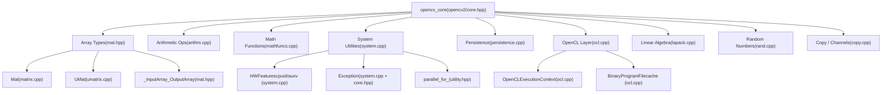
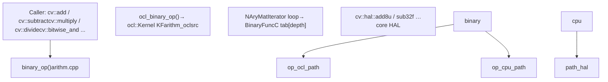
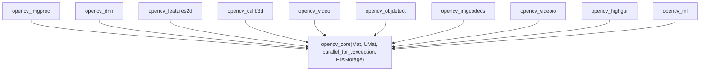

# Core 模块

相关源码文件

-   [3rdparty/libjpeg/jquant2.c](https://github.com/opencv/opencv/blob/91c78f50/3rdparty/libjpeg/jquant2.c)
-   [cmake/OpenCVCompilerOptimizations.cmake](https://github.com/opencv/opencv/blob/91c78f50/cmake/OpenCVCompilerOptimizations.cmake)
-   [modules/calib3d/src/rho.cpp](https://github.com/opencv/opencv/blob/91c78f50/modules/calib3d/src/rho.cpp)
-   [modules/calib3d/src/rho.h](https://github.com/opencv/opencv/blob/91c78f50/modules/calib3d/src/rho.h)
-   [modules/core/include/opencv2/core.hpp](https://github.com/opencv/opencv/blob/91c78f50/modules/core/include/opencv2/core.hpp)
-   [modules/core/include/opencv2/core/base.hpp](https://github.com/opencv/opencv/blob/91c78f50/modules/core/include/opencv2/core/base.hpp)
-   [modules/core/include/opencv2/core/core.hpp](https://github.com/opencv/opencv/blob/91c78f50/modules/core/include/opencv2/core/core.hpp)
-   [modules/core/include/opencv2/core/core\_c.h](https://github.com/opencv/opencv/blob/91c78f50/modules/core/include/opencv2/core/core_c.h)
-   [modules/core/include/opencv2/core/cv\_cpu\_dispatch.h](https://github.com/opencv/opencv/blob/91c78f50/modules/core/include/opencv2/core/cv_cpu_dispatch.h)
-   [modules/core/include/opencv2/core/cv\_cpu\_helper.h](https://github.com/opencv/opencv/blob/91c78f50/modules/core/include/opencv2/core/cv_cpu_helper.h)
-   [modules/core/include/opencv2/core/cvdef.h](https://github.com/opencv/opencv/blob/91c78f50/modules/core/include/opencv2/core/cvdef.h)
-   [modules/core/include/opencv2/core/cvstd.hpp](https://github.com/opencv/opencv/blob/91c78f50/modules/core/include/opencv2/core/cvstd.hpp)
-   [modules/core/include/opencv2/core/cvstd.inl.hpp](https://github.com/opencv/opencv/blob/91c78f50/modules/core/include/opencv2/core/cvstd.inl.hpp)
-   [modules/core/include/opencv2/core/cvstd\_wrapper.hpp](https://github.com/opencv/opencv/blob/91c78f50/modules/core/include/opencv2/core/cvstd_wrapper.hpp)
-   [modules/core/include/opencv2/core/mat.hpp](https://github.com/opencv/opencv/blob/91c78f50/modules/core/include/opencv2/core/mat.hpp)
-   [modules/core/include/opencv2/core/mat.inl.hpp](https://github.com/opencv/opencv/blob/91c78f50/modules/core/include/opencv2/core/mat.inl.hpp)
-   [modules/core/include/opencv2/core/matx.hpp](https://github.com/opencv/opencv/blob/91c78f50/modules/core/include/opencv2/core/matx.hpp)
-   [modules/core/include/opencv2/core/ocl.hpp](https://github.com/opencv/opencv/blob/91c78f50/modules/core/include/opencv2/core/ocl.hpp)
-   [modules/core/include/opencv2/core/opencl/ocl\_defs.hpp](https://github.com/opencv/opencv/blob/91c78f50/modules/core/include/opencv2/core/opencl/ocl_defs.hpp)
-   [modules/core/include/opencv2/core/operations.hpp](https://github.com/opencv/opencv/blob/91c78f50/modules/core/include/opencv2/core/operations.hpp)
-   [modules/core/include/opencv2/core/persistence.hpp](https://github.com/opencv/opencv/blob/91c78f50/modules/core/include/opencv2/core/persistence.hpp)
-   [modules/core/include/opencv2/core/private.hpp](https://github.com/opencv/opencv/blob/91c78f50/modules/core/include/opencv2/core/private.hpp)
-   [modules/core/include/opencv2/core/softfloat.hpp](https://github.com/opencv/opencv/blob/91c78f50/modules/core/include/opencv2/core/softfloat.hpp)
-   [modules/core/include/opencv2/core/types.hpp](https://github.com/opencv/opencv/blob/91c78f50/modules/core/include/opencv2/core/types.hpp)
-   [modules/core/include/opencv2/core/types\_c.h](https://github.com/opencv/opencv/blob/91c78f50/modules/core/include/opencv2/core/types_c.h)
-   [modules/core/include/opencv2/core/utility.hpp](https://github.com/opencv/opencv/blob/91c78f50/modules/core/include/opencv2/core/utility.hpp)
-   [modules/core/include/opencv2/core/utils/buffer\_area.private.hpp](https://github.com/opencv/opencv/blob/91c78f50/modules/core/include/opencv2/core/utils/buffer_area.private.hpp)
-   [modules/core/perf/opencl/perf\_arithm.cpp](https://github.com/opencv/opencv/blob/91c78f50/modules/core/perf/opencl/perf_arithm.cpp)
-   [modules/core/perf/perf\_io\_base64.cpp](https://github.com/opencv/opencv/blob/91c78f50/modules/core/perf/perf_io_base64.cpp)
-   [modules/core/src/algorithm.cpp](https://github.com/opencv/opencv/blob/91c78f50/modules/core/src/algorithm.cpp)
-   [modules/core/src/arithm.cpp](https://github.com/opencv/opencv/blob/91c78f50/modules/core/src/arithm.cpp)
-   [modules/core/src/array.cpp](https://github.com/opencv/opencv/blob/91c78f50/modules/core/src/array.cpp)
-   [modules/core/src/buffer\_area.cpp](https://github.com/opencv/opencv/blob/91c78f50/modules/core/src/buffer_area.cpp)
-   [modules/core/src/command\_line\_parser.cpp](https://github.com/opencv/opencv/blob/91c78f50/modules/core/src/command_line_parser.cpp)
-   [modules/core/src/copy.cpp](https://github.com/opencv/opencv/blob/91c78f50/modules/core/src/copy.cpp)
-   [modules/core/src/lapack.cpp](https://github.com/opencv/opencv/blob/91c78f50/modules/core/src/lapack.cpp)
-   [modules/core/src/mathfuncs.cpp](https://github.com/opencv/opencv/blob/91c78f50/modules/core/src/mathfuncs.cpp)
-   [modules/core/src/matrix.cpp](https://github.com/opencv/opencv/blob/91c78f50/modules/core/src/matrix.cpp)
-   [modules/core/src/matrix\_wrap.cpp](https://github.com/opencv/opencv/blob/91c78f50/modules/core/src/matrix_wrap.cpp)
-   [modules/core/src/ocl.cpp](https://github.com/opencv/opencv/blob/91c78f50/modules/core/src/ocl.cpp)
-   [modules/core/src/ocl\_disabled.impl.hpp](https://github.com/opencv/opencv/blob/91c78f50/modules/core/src/ocl_disabled.impl.hpp)
-   [modules/core/src/opencl/arithm.cl](https://github.com/opencv/opencv/blob/91c78f50/modules/core/src/opencl/arithm.cl)
-   [modules/core/src/opencl/gemm.cl](https://github.com/opencv/opencv/blob/91c78f50/modules/core/src/opencl/gemm.cl)
-   [modules/core/src/opencl/meanstddev.cl](https://github.com/opencv/opencv/blob/91c78f50/modules/core/src/opencl/meanstddev.cl)
-   [modules/core/src/opencl/minmaxloc.cl](https://github.com/opencv/opencv/blob/91c78f50/modules/core/src/opencl/minmaxloc.cl)
-   [modules/core/src/opencl/reduce.cl](https://github.com/opencv/opencv/blob/91c78f50/modules/core/src/opencl/reduce.cl)
-   [modules/core/src/persistence.cpp](https://github.com/opencv/opencv/blob/91c78f50/modules/core/src/persistence.cpp)
-   [modules/core/src/persistence.hpp](https://github.com/opencv/opencv/blob/91c78f50/modules/core/src/persistence.hpp)
-   [modules/core/src/persistence\_base64\_encoding.cpp](https://github.com/opencv/opencv/blob/91c78f50/modules/core/src/persistence_base64_encoding.cpp)
-   [modules/core/src/persistence\_base64\_encoding.hpp](https://github.com/opencv/opencv/blob/91c78f50/modules/core/src/persistence_base64_encoding.hpp)
-   [modules/core/src/persistence\_impl.hpp](https://github.com/opencv/opencv/blob/91c78f50/modules/core/src/persistence_impl.hpp)
-   [modules/core/src/persistence\_json.cpp](https://github.com/opencv/opencv/blob/91c78f50/modules/core/src/persistence_json.cpp)
-   [modules/core/src/persistence\_types.cpp](https://github.com/opencv/opencv/blob/91c78f50/modules/core/src/persistence_types.cpp)
-   [modules/core/src/persistence\_xml.cpp](https://github.com/opencv/opencv/blob/91c78f50/modules/core/src/persistence_xml.cpp)
-   [modules/core/src/persistence\_yml.cpp](https://github.com/opencv/opencv/blob/91c78f50/modules/core/src/persistence_yml.cpp)
-   [modules/core/src/precomp.hpp](https://github.com/opencv/opencv/blob/91c78f50/modules/core/src/precomp.hpp)
-   [modules/core/src/rand.cpp](https://github.com/opencv/opencv/blob/91c78f50/modules/core/src/rand.cpp)
-   [modules/core/src/softfloat.cpp](https://github.com/opencv/opencv/blob/91c78f50/modules/core/src/softfloat.cpp)
-   [modules/core/src/system.cpp](https://github.com/opencv/opencv/blob/91c78f50/modules/core/src/system.cpp)
-   [modules/core/src/umatrix.cpp](https://github.com/opencv/opencv/blob/91c78f50/modules/core/src/umatrix.cpp)
-   [modules/core/test/ocl/test\_arithm.cpp](https://github.com/opencv/opencv/blob/91c78f50/modules/core/test/ocl/test_arithm.cpp)
-   [modules/core/test/ocl/test\_opencl.cpp](https://github.com/opencv/opencv/blob/91c78f50/modules/core/test/ocl/test_opencl.cpp)
-   [modules/core/test/test\_arithm.cpp](https://github.com/opencv/opencv/blob/91c78f50/modules/core/test/test_arithm.cpp)
-   [modules/core/test/test\_io.cpp](https://github.com/opencv/opencv/blob/91c78f50/modules/core/test/test_io.cpp)
-   [modules/core/test/test\_mat.cpp](https://github.com/opencv/opencv/blob/91c78f50/modules/core/test/test_mat.cpp)
-   [modules/core/test/test\_math.cpp](https://github.com/opencv/opencv/blob/91c78f50/modules/core/test/test_math.cpp)
-   [modules/core/test/test\_operations.cpp](https://github.com/opencv/opencv/blob/91c78f50/modules/core/test/test_operations.cpp)
-   [modules/core/test/test\_precomp.hpp](https://github.com/opencv/opencv/blob/91c78f50/modules/core/test/test_precomp.hpp)
-   [modules/core/test/test\_rand.cpp](https://github.com/opencv/opencv/blob/91c78f50/modules/core/test/test_rand.cpp)
-   [modules/core/test/test\_umat.cpp](https://github.com/opencv/opencv/blob/91c78f50/modules/core/test/test_umat.cpp)
-   [modules/core/test/test\_utils.cpp](https://github.com/opencv/opencv/blob/91c78f50/modules/core/test/test_utils.cpp)
-   [modules/dnn/include/opencv2/dnn/shape\_utils.hpp](https://github.com/opencv/opencv/blob/91c78f50/modules/dnn/include/opencv2/dnn/shape_utils.hpp)
-   [modules/python/test/test\_algorithm\_rw.py](https://github.com/opencv/opencv/blob/91c78f50/modules/python/test/test_algorithm_rw.py)
-   [modules/python/test/test\_filestorage\_io.py](https://github.com/opencv/opencv/blob/91c78f50/modules/python/test/test_filestorage_io.py)
-   [modules/python/test/test\_persistence.py](https://github.com/opencv/opencv/blob/91c78f50/modules/python/test/test_persistence.py)
-   [modules/ts/include/opencv2/ts/ocl\_perf.hpp](https://github.com/opencv/opencv/blob/91c78f50/modules/ts/include/opencv2/ts/ocl_perf.hpp)
-   [modules/ts/src/ocl\_perf.cpp](https://github.com/opencv/opencv/blob/91c78f50/modules/ts/src/ocl_perf.cpp)
-   [modules/ts/src/ocl\_test.cpp](https://github.com/opencv/opencv/blob/91c78f50/modules/ts/src/ocl_test.cpp)
-   [platforms/linux/riscv64-071-gcc.toolchain.cmake](https://github.com/opencv/opencv/blob/91c78f50/platforms/linux/riscv64-071-gcc.toolchain.cmake)

`opencv_core` 模块（`modules/core/`）是所有其他 OpenCV 模块的基础依赖。它定义了主要数组类型、函数参数所用的抽象层、数组算术与数学运算、平台工具、OpenCL 加速基础设施以及数据持久化。本页概述这些子系统及其相互连接方式。

关于具体子系统的详细说明，见：

-   [Mat 和 UMat 数据结构](/opencv/opencv/3.1-mat-and-umat-data-structures)
-   [OpenCL 加速与透明 GPU 执行](/opencv/opencv/3.2-opencl-acceleration-and-transparent-gpu-execution)
-   [系统工具与并行处理](/opencv/opencv/3.3-system-utilities-and-parallel-processing)
-   [持久化与序列化（FileStorage）](/opencv/opencv/3.4-persistence-and-serialization-(filestorage))
-   [SIMD Intrinsics 与 CPU 分发](/opencv/opencv/3.5-simd-intrinsics-and-cpu-dispatching)

---

## 模块布局

该模块围绕 `modules/core/include/opencv2/core/` 下少量公共头文件及 `modules/core/src/` 中对应的实现文件组织。下游代码通常包含顶层聚合头文件 `modules/core/include/opencv2/core.hpp`，该文件会链式包含各个组件头文件。

**主要公共头文件**

| Header | Purpose |
| --- | --- |
| `opencv2/core.hpp` | 聚合头；包含下列所有头文件 |
| `opencv2/core/cvdef.h` | 编译器/平台宏、类型别名 |
| `opencv2/core/base.hpp` | 错误码、`CV_Error`、`CV_Assert` 宏 |
| `opencv2/core/types.hpp` | 几何基础类型：`Point`、`Size`、`Rect`、`Scalar` |
| `opencv2/core/mat.hpp` | `Mat`、`UMat`、`_InputArray`、`_OutputArray` |
| `opencv2/core/mat.inl.hpp` | `Mat`/`UMat` 方法的内联实现 |
| `opencv2/core/persistence.hpp` | `FileStorage`、`FileNode` |
| `opencv2/core/utility.hpp` | `parallel_for_`、`AutoBuffer`、`TickMeter`、`RNG` |
| `opencv2/core/ocl.hpp` | OpenCL `Context`、`Device`、`Kernel`、`Queue` |
| `opencv2/core/operations.hpp` | `Mat`、`Matx` 的运算符重载与增强赋值 |

来源： [modules/core/include/opencv2/core.hpp1-106](https://github.com/opencv/opencv/blob/91c78f50/modules/core/include/opencv2/core.hpp#L1-L106) [modules/core/include/opencv2/core/mat.hpp44-272](https://github.com/opencv/opencv/blob/91c78f50/modules/core/include/opencv2/core/mat.hpp#L44-L272) [modules/core/include/opencv2/core/cvdef.h45-120](https://github.com/opencv/opencv/blob/91c78f50/modules/core/include/opencv2/core/cvdef.h#L45-L120)

---

## 高层组件映射

下图将 `opencv_core` 的主要运行时组件映射到其对应的核心代码实体。

**Core 模块组件关系**

来源： [modules/core/include/opencv2/core.hpp52-105](https://github.com/opencv/opencv/blob/91c78f50/modules/core/include/opencv2/core.hpp#L52-L105) [modules/core/src/matrix.cpp1-200](https://github.com/opencv/opencv/blob/91c78f50/modules/core/src/matrix.cpp#L1-L200) [modules/core/src/umatrix.cpp1-60](https://github.com/opencv/opencv/blob/91c78f50/modules/core/src/umatrix.cpp#L1-L60) [modules/core/src/ocl.cpp846-1037](https://github.com/opencv/opencv/blob/91c78f50/modules/core/src/ocl.cpp#L846-L1037) [modules/core/src/system.cpp370-574](https://github.com/opencv/opencv/blob/91c78f50/modules/core/src/system.cpp#L370-L574)

---

## 主要数据结构

### Mat

`Mat` 声明于 `modules/core/include/opencv2/core/mat.hpp`，实现于 `modules/core/src/matrix.cpp`，是核心的 N 维稠密数组类型。关键字段如下：

| Field | Type | Meaning |
| --- | --- | --- |
| `flags` | `int` | 魔数、类型编码、连续性标志 |
| `dims` | `int` | 维度数量（内部始终 ≥ 2） |
| `rows`, `cols` | `int` | 当 `dims == 2` 时有效 |
| `data` | `uchar*` | 指向当前视图起始位置 |
| `datastart`, `dataend` | `uchar*` | 底层分配区域边界 |
| `u` | `UMatData*` | 共享的引用计数存储块 |
| `allocator` | `MatAllocator*` | 可插拔分配器 |
| `step` | `MatStep` | 各维字节步长 |
| `size` | `MatSize` | 各维元素数量 |

拷贝 `Mat` 是浅拷贝操作：它通过 `CV_XADD` 增加 `UMatData` 中的引用计数。深拷贝使用 `Mat::clone()` 或 `Mat::copyTo()`。

默认分配器 `StdMatAllocator` 注册于 [modules/core/src/matrix.cpp126-199](https://github.com/opencv/opencv/blob/91c78f50/modules/core/src/matrix.cpp#L126-L199)，并通过 `fastMalloc` 分配原始内存。可通过 `Mat::setDefaultAllocator` 接入自定义分配器。

子矩阵（ROI）通过调整 `data` 并在 `flags` 中设置 `SUBMATRIX_FLAG` 创建，不会复制数据。`CONTINUOUS_FLAG` 由 `updateContinuityFlag` 维护 [modules/core/src/matrix.cpp283-308](https://github.com/opencv/opencv/blob/91c78f50/modules/core/src/matrix.cpp#L283-L308)

### UMat

`UMat`（位于 `modules/core/src/umatrix.cpp`）是并行数组类型，其底层存储可位于 OpenCL 设备内存中。它与 `Mat` 共享 `UMatData`，但增加了 `offset` 字段并使用 OpenCL 感知分配器。当 `UMat` 传入 CPU 函数（通过 `getMat()`）或传入 OpenCL 内核时，数据会在 CPU 与设备间隐式迁移。完整细节见 [Mat 和 UMat 数据结构](/opencv/opencv/3.1-mat-and-umat-data-structures)。

### 几何基础类型

声明于 `modules/core/include/opencv2/core/types.hpp`。这些模板类型被别名为常用实例：

| Template | Common Aliases |
| --- | --- |
| `Point_<T>` | `Point2i`, `Point2f`, `Point2d` |
| `Size_<T>` | `Size`, `Size2f` |
| `Rect_<T>` | `Rect`, `Rect2f` |
| `Scalar_<T>` | `Scalar`（4 元素 double 向量） |
| `Vec<T, N>` | `Vec2f`, `Vec3b`, `Vec4i`, … |
| `Matx<T, M, N>` | `Matx33f`, `Matx44d`, … |

来源： [modules/core/include/opencv2/core/types.hpp1-60](https://github.com/opencv/opencv/blob/91c78f50/modules/core/include/opencv2/core/types.hpp#L1-L60) [modules/core/include/opencv2/core/mat.hpp160-394](https://github.com/opencv/opencv/blob/91c78f50/modules/core/include/opencv2/core/mat.hpp#L160-L394) [modules/core/src/matrix.cpp126-200](https://github.com/opencv/opencv/blob/91c78f50/modules/core/src/matrix.cpp#L126-L200) [modules/core/src/umatrix.cpp1-60](https://github.com/opencv/opencv/blob/91c78f50/modules/core/src/umatrix.cpp#L1-L60)

---

## InputArray / OutputArray 抽象

几乎所有公开 OpenCV 函数都接收 `InputArray`、`OutputArray` 或 `InputOutputArray`，而不是直接接收 `Mat`。这些是定义在 `mat.hpp` 中的引用类型，可在不拷贝的情况下绑定到 `Mat`、`UMat`、`Matx`、`std::vector<T>`、`cuda::GpuMat` 或 `cuda::GpuMatND`。

**参数抽象类型层次**

`_InputArray::kind()` 返回 `KindFlag` 枚举（`MAT`、`UMAT`、`CUDA_GPU_MAT`、`STD_VECTOR` 等），使函数实现可以根据实际底层类型分支。在多数函数中无需显式判断；函数直接调用 `getMat()` 或 `getUMat()` 即可获得轻量头部。

来源： [modules/core/include/opencv2/core/mat.hpp64-393](https://github.com/opencv/opencv/blob/91c78f50/modules/core/include/opencv2/core/mat.hpp#L64-L393)

---

## 类型系统与深度编码

`Mat` 的元素类型通过 `cvdef.h` 与 `types_c.h` 中的宏编码为紧凑整数。

| Depth Constant | C type | Bits |
| --- | --- | --- |
| `CV_8U` | `uint8_t` | 8 |
| `CV_8S` | `int8_t` | 8 |
| `CV_16U` | `uint16_t` | 16 |
| `CV_16S` | `int16_t` | 16 |
| `CV_32S` | `int32_t` | 32 |
| `CV_32F` | `float` | 32 |
| `CV_64F` | `double` | 64 |
| `CV_16F` | `hfloat` | 16（half） |

包含通道数的完整类型可由 `CV_MAKETYPE(depth, cn)` 组合，并可由 `CV_MAT_DEPTH(type)` 和 `CV_MAT_CN(type)` 分解。

来源： [modules/core/include/opencv2/core/cvdef.h1-120](https://github.com/opencv/opencv/blob/91c78f50/modules/core/include/opencv2/core/cvdef.h#L1-L120) [modules/core/include/opencv2/core/types\_c.h1-100](https://github.com/opencv/opencv/blob/91c78f50/modules/core/include/opencv2/core/types_c.h#L1-L100)

---

## 算术运算

实现位于 `modules/core/src/arithm.cpp`。每个算术函数遵循共同的双路径模式：

1.  **OpenCL 路径** — 如果任一输入为 `UMat`，则通过 `CV_OCL_RUN` 分发至 OpenCL 内核。
2.  **CPU 路径** — 使用 `NAryMatIterator` 迭代平面，并调用按类型索引的函数表项（例如 `getMaxTab()`、`getMinTab()`）。

**算术函数调用流**

公开 API 层提供的函数：

| Function | Operation |
| --- | --- |
| `cv::add` | 逐元素加法 |
| `cv::subtract` | 逐元素减法 |
| `cv::multiply` | 逐元素乘法（可选缩放） |
| `cv::divide` | 逐元素除法 |
| `cv::addWeighted` | 两数组加权混合 |
| `cv::absdiff` | 绝对差 |
| `cv::bitwise_and/or/xor/not` | 按位逻辑运算 |
| `cv::min`, `cv::max` | 逐元素最小/最大 |
| `cv::compare` | 与标量或数组逐元素比较 |

来源： [modules/core/src/arithm.cpp50-436](https://github.com/opencv/opencv/blob/91c78f50/modules/core/src/arithm.cpp#L50-L436)

---

## 数学函数

实现位于 `modules/core/src/mathfuncs.cpp`。这些函数对 `Mat` 或 `UMat` 数组逐元素运算，并采用与算术运算相同的 OpenCL/CPU 双路径结构。

| Function | Notes |
| --- | --- |
| `cv::sqrt` | 逐元素平方根 |
| `cv::pow` | 逐元素幂运算 |
| `cv::exp` | 逐元素指数 |
| `cv::log` | 逐元素自然对数 |
| `cv::magnitude` | 由两个平面计算 √(x²+y²) |
| `cv::phase` | atan2(y,x)，角度或弧度 |
| `cv::cartToPolar` / `cv::polarToCart` | 幅值+相位联合变换 |
| `cv::dct` / `cv::dft` / `cv::idft` | 离散余弦/傅里叶变换 |

位于 [modules/core/src/mathfuncs.cpp106-143](https://github.com/opencv/opencv/blob/91c78f50/modules/core/src/mathfuncs.cpp#L106-L143) 的 `cubeRoot` 函数是基于位操作的快速近似实现。

来源： [modules/core/src/mathfuncs.cpp50-100](https://github.com/opencv/opencv/blob/91c78f50/modules/core/src/mathfuncs.cpp#L50-L100)

---

## 线性代数

`modules/core/src/lapack.cpp` 封装了核心线性代数操作。这些函数接收 `InputArray`/`OutputArray`，并在内部调用 HAL 实现（或捆绑的 lapack）：

| Function | Description |
| --- | --- |
| `cv::solve` | 求解 `Ax = b` |
| `cv::invert` | 通过 LU、SVD 或 Cholesky 进行矩阵求逆 |
| `cv::determinant` | 矩阵行列式 |
| `cv::eigen` | 对称矩阵的特征值/特征向量 |
| `cv::SVD::compute` | 完整 SVD |
| `cv::PCA` | 主成分分析 |
| `cv::gemm` | 广义矩阵乘法 |

来源： [modules/core/src/lapack.cpp1-60](https://github.com/opencv/opencv/blob/91c78f50/modules/core/src/lapack.cpp#L1-L60)

---

## 错误处理

定义于 `modules/core/include/opencv2/core.hpp` 并实现于 `modules/core/src/system.cpp` 的 `cv::Exception` 类，携带数值错误码、人类可读消息以及抛出错误的源码位置。

主要报告宏：

-   `CV_Error(code, msg)` — 抛出 `cv::Exception`
-   `CV_Error_(code, args)` — printf 风格消息
-   `CV_Assert(cond)` — 当 `cond` 为假时抛出异常
-   `CV_DbgAssert(cond)` — 仅在调试构建中断言

错误码定义在 `modules/core/include/opencv2/core/base.hpp` 的 `cv::Error` 命名空间下（如 `cv::Error::StsOk`、`cv::Error::BadArgument`、`cv::Error::StsOutOfRange`）。

来源： [modules/core/include/opencv2/core.hpp119-156](https://github.com/opencv/opencv/blob/91c78f50/modules/core/include/opencv2/core.hpp#L119-L156) [modules/core/src/system.cpp323-368](https://github.com/opencv/opencv/blob/91c78f50/modules/core/src/system.cpp#L323-L368) [modules/core/include/opencv2/core/base.hpp1-80](https://github.com/opencv/opencv/blob/91c78f50/modules/core/include/opencv2/core/base.hpp#L1-L80)

---

## CPU 特性检测

`modules/core/src/system.cpp` 包含 `HWFeatures` 结构体，它在静态初始化阶段探测 CPU 能力。在 x86 上使用 `CPUID` 指令；在 ARM 上读取 `/proc/self/auxv` 或调用 Android 的 `android_getCpuFeatures`。

检测得到的特性标志（如 `CV_CPU_SSE2`、`CV_CPU_AVX2`、`CV_CPU_NEON`）可由 `cv::checkHardwareSupport(feature)` 在运行时查询。该信息驱动 CPU 分发机制（见 [SIMD Intrinsics 与 CPU 分发](/opencv/opencv/3.5-simd-intrinsics-and-cpu-dispatching)）。

已检测的特性组包括：

| Architecture | Features detected |
| --- | --- |
| x86 | MMX、SSE–SSE4.2、AVX、AVX2、FMA3、AVX-512 各变体 |
| ARM | NEON、FP16、NEON\_DOTPROD、BF16、SVE |
| PowerPC | VSX、VSX3 |
| RISC-V | RVV |
| LoongArch | LSX、LASX |

来源： [modules/core/src/system.cpp382-574](https://github.com/opencv/opencv/blob/91c78f50/modules/core/src/system.cpp#L382-L574)

---

## OpenCL 集成

OpenCL 子系统位于 `modules/core/src/ocl.cpp`，通过 `modules/core/include/opencv2/core/ocl.hpp` 暴露。其关键类型：

| Class | Role |
| --- | --- |
| `cv::ocl::Context` | 封装 `cl_context`；管理设备列表 |
| `cv::ocl::Device` | 封装 `cl_device_id`；查询能力 |
| `cv::ocl::Queue` | 封装 `cl_command_queue` |
| `cv::ocl::Kernel` | 封装已编译 `cl_kernel`；设置参数并运行 |
| `cv::ocl::Program` | 封装已编译 `cl_program`；缓存二进制 |
| `OpenCLExecutionContext` | 每线程 context+device+queue 三元组 |

`OpenCLExecutionContext::getCurrent()` 返回线程局部活动上下文（由 `Impl::getInitializedExecutionContext()` 惰性初始化）。二进制内核缓存使用 [modules/core/src/ocl.cpp520-841](https://github.com/opencv/opencv/blob/91c78f50/modules/core/src/ocl.cpp#L520-L841) 中的 `BinaryProgramFile`，并基于源码签名的 CRC-64 哈希作为键。

`arithm.cpp` 与 `mathfuncs.cpp` 中的函数通过 `CV_OCL_RUN(condition, expr)` 控制 OpenCL 路径：仅当 `condition` 为真且 OpenCL 已启用时才计算 `expr`。完整细节见 [OpenCL 加速与透明 GPU 执行](/opencv/opencv/3.2-opencl-acceleration-and-transparent-gpu-execution)。

来源： [modules/core/src/ocl.cpp846-1037](https://github.com/opencv/opencv/blob/91c78f50/modules/core/src/ocl.cpp#L846-L1037) [modules/core/include/opencv2/core/ocl.hpp1-100](https://github.com/opencv/opencv/blob/91c78f50/modules/core/include/opencv2/core/ocl.hpp#L1-L100) [modules/core/src/arithm.cpp60-148](https://github.com/opencv/opencv/blob/91c78f50/modules/core/src/arithm.cpp#L60-L148)

---

## 持久化（FileStorage）

`FileStorage`（声明于 `modules/core/include/opencv2/core/persistence.hpp`，实现于 `modules/core/src/persistence.cpp`）用于以 XML、YAML、JSON 格式读写结构化数据。它支持标量基本类型、`Mat`、`SparseMat`，以及实现 `<<`/`>>` 流操作符的用户自定义类型。

关键类：

| Class | Role |
| --- | --- |
| `FileStorage` | 文件/流句柄；`open()`、`<<`、`release()` |
| `FileNode` | 已解析文档中的游标；类型化访问 |
| `FileNodeIterator` | 序列与映射的迭代器 |

完整细节见 [持久化与序列化（FileStorage）](/opencv/opencv/3.4-persistence-and-serialization-(filestorage))。

来源： [modules/core/src/persistence.cpp415-432](https://github.com/opencv/opencv/blob/91c78f50/modules/core/src/persistence.cpp#L415-L432) [modules/core/include/opencv2/core/persistence.hpp1-60](https://github.com/opencv/opencv/blob/91c78f50/modules/core/include/opencv2/core/persistence.hpp#L1-L60)

---

## 并行处理

`modules/core/include/opencv2/core/utility.hpp` 中的 `cv::parallel_for_` 是主要并行循环原语。它接收 `Range` 与 `ParallelLoopBody` 仿函数。后端在构建时从 TBB、OpenMP、pthreads 或 GCD 中选择。详情见 [系统工具与并行处理](/opencv/opencv/3.3-system-utilities-and-parallel-processing)。

---

## 其他模块如何依赖 Core

所有其他 OpenCV 模块都链接 `opencv_core`，并将 `Mat`/`UMat` 用作通用图像载体、`InputArray`/`OutputArray` 用作函数参数、`cv::Exception` 用于错误传播、`parallel_for_` 用于多线程。该依赖在 CMake 层由 `ocv_add_module` 强制（见 [模块配置与 ocv\_add\_module](/opencv/opencv/2.2-module-configuration-and-ocv_add_module)）。

**模块间对 Core 的依赖**

来源： [modules/core/include/opencv2/core.hpp52-105](https://github.com/opencv/opencv/blob/91c78f50/modules/core/include/opencv2/core.hpp#L52-L105)
