# Mat 与 UMat 数据结构

相关源文件

-   [3rdparty/libjpeg/jquant2.c](https://github.com/opencv/opencv/blob/91c78f50/3rdparty/libjpeg/jquant2.c)
-   [cmake/OpenCVCompilerOptimizations.cmake](https://github.com/opencv/opencv/blob/91c78f50/cmake/OpenCVCompilerOptimizations.cmake)
-   [modules/calib3d/src/rho.cpp](https://github.com/opencv/opencv/blob/91c78f50/modules/calib3d/src/rho.cpp)
-   [modules/calib3d/src/rho.h](https://github.com/opencv/opencv/blob/91c78f50/modules/calib3d/src/rho.h)
-   [modules/core/include/opencv2/core.hpp](https://github.com/opencv/opencv/blob/91c78f50/modules/core/include/opencv2/core.hpp)
-   [modules/core/include/opencv2/core/base.hpp](https://github.com/opencv/opencv/blob/91c78f50/modules/core/include/opencv2/core/base.hpp)
-   [modules/core/include/opencv2/core/core.hpp](https://github.com/opencv/opencv/blob/91c78f50/modules/core/include/opencv2/core/core.hpp)
-   [modules/core/include/opencv2/core/cv\_cpu\_dispatch.h](https://github.com/opencv/opencv/blob/91c78f50/modules/core/include/opencv2/core/cv_cpu_dispatch.h)
-   [modules/core/include/opencv2/core/cv\_cpu\_helper.h](https://github.com/opencv/opencv/blob/91c78f50/modules/core/include/opencv2/core/cv_cpu_helper.h)
-   [modules/core/include/opencv2/core/cvdef.h](https://github.com/opencv/opencv/blob/91c78f50/modules/core/include/opencv2/core/cvdef.h)
-   [modules/core/include/opencv2/core/mat.hpp](https://github.com/opencv/opencv/blob/91c78f50/modules/core/include/opencv2/core/mat.hpp)
-   [modules/core/include/opencv2/core/mat.inl.hpp](https://github.com/opencv/opencv/blob/91c78f50/modules/core/include/opencv2/core/mat.inl.hpp)
-   [modules/core/include/opencv2/core/matx.hpp](https://github.com/opencv/opencv/blob/91c78f50/modules/core/include/opencv2/core/matx.hpp)
-   [modules/core/include/opencv2/core/ocl.hpp](https://github.com/opencv/opencv/blob/91c78f50/modules/core/include/opencv2/core/ocl.hpp)
-   [modules/core/include/opencv2/core/opencl/ocl\_defs.hpp](https://github.com/opencv/opencv/blob/91c78f50/modules/core/include/opencv2/core/opencl/ocl_defs.hpp)
-   [modules/core/include/opencv2/core/operations.hpp](https://github.com/opencv/opencv/blob/91c78f50/modules/core/include/opencv2/core/operations.hpp)
-   [modules/core/include/opencv2/core/private.hpp](https://github.com/opencv/opencv/blob/91c78f50/modules/core/include/opencv2/core/private.hpp)
-   [modules/core/include/opencv2/core/softfloat.hpp](https://github.com/opencv/opencv/blob/91c78f50/modules/core/include/opencv2/core/softfloat.hpp)
-   [modules/core/include/opencv2/core/types.hpp](https://github.com/opencv/opencv/blob/91c78f50/modules/core/include/opencv2/core/types.hpp)
-   [modules/core/include/opencv2/core/types\_c.h](https://github.com/opencv/opencv/blob/91c78f50/modules/core/include/opencv2/core/types_c.h)
-   [modules/core/include/opencv2/core/utility.hpp](https://github.com/opencv/opencv/blob/91c78f50/modules/core/include/opencv2/core/utility.hpp)
-   [modules/core/include/opencv2/core/utils/buffer\_area.private.hpp](https://github.com/opencv/opencv/blob/91c78f50/modules/core/include/opencv2/core/utils/buffer_area.private.hpp)
-   [modules/core/perf/opencl/perf\_arithm.cpp](https://github.com/opencv/opencv/blob/91c78f50/modules/core/perf/opencl/perf_arithm.cpp)
-   [modules/core/src/algorithm.cpp](https://github.com/opencv/opencv/blob/91c78f50/modules/core/src/algorithm.cpp)
-   [modules/core/src/arithm.cpp](https://github.com/opencv/opencv/blob/91c78f50/modules/core/src/arithm.cpp)
-   [modules/core/src/array.cpp](https://github.com/opencv/opencv/blob/91c78f50/modules/core/src/array.cpp)
-   [modules/core/src/buffer\_area.cpp](https://github.com/opencv/opencv/blob/91c78f50/modules/core/src/buffer_area.cpp)
-   [modules/core/src/command\_line\_parser.cpp](https://github.com/opencv/opencv/blob/91c78f50/modules/core/src/command_line_parser.cpp)
-   [modules/core/src/copy.cpp](https://github.com/opencv/opencv/blob/91c78f50/modules/core/src/copy.cpp)
-   [modules/core/src/lapack.cpp](https://github.com/opencv/opencv/blob/91c78f50/modules/core/src/lapack.cpp)
-   [modules/core/src/mathfuncs.cpp](https://github.com/opencv/opencv/blob/91c78f50/modules/core/src/mathfuncs.cpp)
-   [modules/core/src/matrix.cpp](https://github.com/opencv/opencv/blob/91c78f50/modules/core/src/matrix.cpp)
-   [modules/core/src/matrix\_wrap.cpp](https://github.com/opencv/opencv/blob/91c78f50/modules/core/src/matrix_wrap.cpp)
-   [modules/core/src/ocl.cpp](https://github.com/opencv/opencv/blob/91c78f50/modules/core/src/ocl.cpp)
-   [modules/core/src/ocl\_disabled.impl.hpp](https://github.com/opencv/opencv/blob/91c78f50/modules/core/src/ocl_disabled.impl.hpp)
-   [modules/core/src/opencl/arithm.cl](https://github.com/opencv/opencv/blob/91c78f50/modules/core/src/opencl/arithm.cl)
-   [modules/core/src/opencl/gemm.cl](https://github.com/opencv/opencv/blob/91c78f50/modules/core/src/opencl/gemm.cl)
-   [modules/core/src/opencl/meanstddev.cl](https://github.com/opencv/opencv/blob/91c78f50/modules/core/src/opencl/meanstddev.cl)
-   [modules/core/src/opencl/minmaxloc.cl](https://github.com/opencv/opencv/blob/91c78f50/modules/core/src/opencl/minmaxloc.cl)
-   [modules/core/src/opencl/reduce.cl](https://github.com/opencv/opencv/blob/91c78f50/modules/core/src/opencl/reduce.cl)
-   [modules/core/src/precomp.hpp](https://github.com/opencv/opencv/blob/91c78f50/modules/core/src/precomp.hpp)
-   [modules/core/src/rand.cpp](https://github.com/opencv/opencv/blob/91c78f50/modules/core/src/rand.cpp)
-   [modules/core/src/softfloat.cpp](https://github.com/opencv/opencv/blob/91c78f50/modules/core/src/softfloat.cpp)
-   [modules/core/src/system.cpp](https://github.com/opencv/opencv/blob/91c78f50/modules/core/src/system.cpp)
-   [modules/core/src/umatrix.cpp](https://github.com/opencv/opencv/blob/91c78f50/modules/core/src/umatrix.cpp)
-   [modules/core/test/ocl/test\_arithm.cpp](https://github.com/opencv/opencv/blob/91c78f50/modules/core/test/ocl/test_arithm.cpp)
-   [modules/core/test/ocl/test\_opencl.cpp](https://github.com/opencv/opencv/blob/91c78f50/modules/core/test/ocl/test_opencl.cpp)
-   [modules/core/test/test\_arithm.cpp](https://github.com/opencv/opencv/blob/91c78f50/modules/core/test/test_arithm.cpp)
-   [modules/core/test/test\_mat.cpp](https://github.com/opencv/opencv/blob/91c78f50/modules/core/test/test_mat.cpp)
-   [modules/core/test/test\_math.cpp](https://github.com/opencv/opencv/blob/91c78f50/modules/core/test/test_math.cpp)
-   [modules/core/test/test\_operations.cpp](https://github.com/opencv/opencv/blob/91c78f50/modules/core/test/test_operations.cpp)
-   [modules/core/test/test\_precomp.hpp](https://github.com/opencv/opencv/blob/91c78f50/modules/core/test/test_precomp.hpp)
-   [modules/core/test/test\_rand.cpp](https://github.com/opencv/opencv/blob/91c78f50/modules/core/test/test_rand.cpp)
-   [modules/core/test/test\_umat.cpp](https://github.com/opencv/opencv/blob/91c78f50/modules/core/test/test_umat.cpp)
-   [modules/core/test/test\_utils.cpp](https://github.com/opencv/opencv/blob/91c78f50/modules/core/test/test_utils.cpp)
-   [modules/ts/include/opencv2/ts/ocl\_perf.hpp](https://github.com/opencv/opencv/blob/91c78f50/modules/ts/include/opencv2/ts/ocl_perf.hpp)
-   [modules/ts/src/ocl\_perf.cpp](https://github.com/opencv/opencv/blob/91c78f50/modules/ts/src/ocl_perf.cpp)
-   [modules/ts/src/ocl\_test.cpp](https://github.com/opencv/opencv/blob/91c78f50/modules/ts/src/ocl_test.cpp)
-   [platforms/linux/riscv64-071-gcc.toolchain.cmake](https://github.com/opencv/opencv/blob/91c78f50/platforms/linux/riscv64-071-gcc.toolchain.cmake)

## 目的与范围

本文描述 OpenCV 两种主要数据结构的内部架构与内存管理：`Mat`（CPU 矩阵）和 `UMat`（统一内存矩阵）。内容涵盖内存布局、引用计数机制、分配器设计，以及两者之间的关系。关于 OpenCL 特定加速机制，请参见 [OpenCL 加速与透明 GPU 执行](/opencv/opencv/3.2-opencl-acceleration-and-transparent-gpu-execution)。 </old\_str> <new\_str>

## 目的与范围

本文描述 OpenCV 两种主要数据结构的内部架构与内存管理：`Mat`（CPU 矩阵）和 `UMat`（统一内存矩阵）。内容涵盖内存布局、引用计数机制、分配器设计，以及两者之间的关系。关于 OpenCL 特定加速机制，请参见 [OpenCL 加速与透明 GPU 执行](/opencv/opencv/3.2-opencl-acceleration-and-transparent-gpu-execution)。

## 概述

OpenCV 提供两种基础多维数组类型：

| 类型 | 用途 | 内存位置 | 主要使用场景 |
| --- | --- | --- | --- |
| `cv::Mat` | 通用矩阵 | 仅 CPU | 标准 CPU 处理 |
| `cv::UMat` | 统一内存矩阵 | CPU 和/或 GPU | 通过 OpenCL 进行透明硬件加速 |

两种结构共享同一套底层内存管理基础设施（`UMatData`）和分配器接口（`MatAllocator`），从而实现高效内存处理与互操作。

来源： [modules/core/include/opencv2/core/mat.hpp59-393](https://github.com/opencv/opencv/blob/91c78f50/modules/core/include/opencv2/core/mat.hpp#L59-L393) [modules/core/src/matrix.cpp126-200](https://github.com/opencv/opencv/blob/91c78f50/modules/core/src/matrix.cpp#L126-L200) [modules/core/src/umatrix.cpp1-100](https://github.com/opencv/opencv/blob/91c78f50/modules/core/src/umatrix.cpp#L1-L100)

## Mat 类架构

### 核心组成

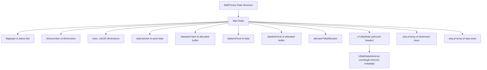
来源： [modules/core/include/opencv2/core/mat.hpp796-900](https://github.com/opencv/opencv/blob/91c78f50/modules/core/include/opencv2/core/mat.hpp#L796-L900) [modules/core/src/matrix.cpp336-444](https://github.com/opencv/opencv/blob/91c78f50/modules/core/src/matrix.cpp#L336-L444)

### 类型化封装：`Mat_<T>`

`Mat_<_Tp>` 是 `Mat` 的模板子类，它为矩阵关联编译期元素类型。它提供类型安全的 `operator()` 元素访问，并会使用正确的类型码自动调用 `create()`。其内存布局和引用计数基础设施与普通 `Mat` 完全相同。定义于 [modules/core/include/opencv2/core/mat.hpp](https://github.com/opencv/opencv/blob/91c78f50/modules/core/include/opencv2/core/mat.hpp)

### 内存布局

Mat 使用灵活的内存布局系统存储多维数据：

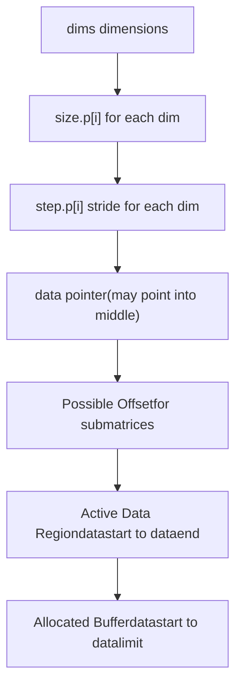
**关键布局属性：**

-   **datastart**：已分配内存缓冲区的起始位置
-   **data**：当前数据指针（子矩阵时可能有偏移）
-   **dataend**：有效数据结束位置
-   **datalimit**：已分配缓冲区结束位置
-   **step.p\[i\]**：在第 i 维移动到下一个元素需跨越的字节数
-   **size.p\[i\]**：第 i 维元素数量

来源： [modules/core/include/opencv2/core/mat.hpp796-900](https://github.com/opencv/opencv/blob/91c78f50/modules/core/include/opencv2/core/mat.hpp#L796-L900) [modules/core/src/matrix.cpp218-281](https://github.com/opencv/opencv/blob/91c78f50/modules/core/src/matrix.cpp#L218-L281)

### 连续与非连续内存

Mat 通过 `CONTINUOUS_FLAG` 跟踪数据是否在内存中连续存储：

| 布局类型 | 描述 | 标志状态 | 访问性能 |
| --- | --- | --- | --- |
| 连续 | 所有元素顺序存储 | `flags & CONTINUOUS_FLAG` | 最优——可做整块操作 |
| 非连续 | 行/切片填充或子矩阵 | 未设置该标志 | 较慢——需要处理步长 |

连续性标志由 `updateContinuityFlag()` 计算，依据是所有维度是否满足 `step[j] * size[j] == step[j-1]`。

来源： [modules/core/src/matrix.cpp283-308](https://github.com/opencv/opencv/blob/91c78f50/modules/core/src/matrix.cpp#L283-L308) [modules/core/src/matrix.cpp305-308](https://github.com/opencv/opencv/blob/91c78f50/modules/core/src/matrix.cpp#L305-L308)

## UMat 类架构

### 统一内存模型

UMat 在 Mat 设计基础上扩展，以支持透明 GPU 执行：

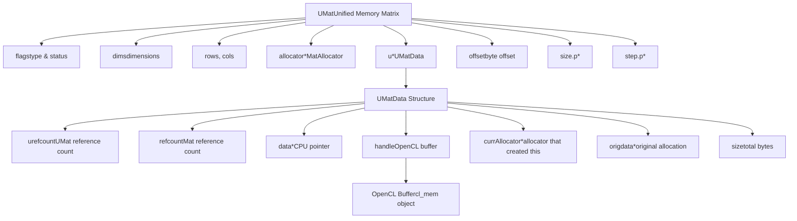
来源： [modules/core/include/opencv2/core/mat.hpp2533-2700](https://github.com/opencv/opencv/blob/91c78f50/modules/core/include/opencv2/core/mat.hpp#L2533-L2700) [modules/core/src/umatrix.cpp1-500](https://github.com/opencv/opencv/blob/91c78f50/modules/core/src/umatrix.cpp#L1-L500)

### OpenCL 集成

UMat 会在需要时自动在 CPU 与 GPU 之间迁移数据：

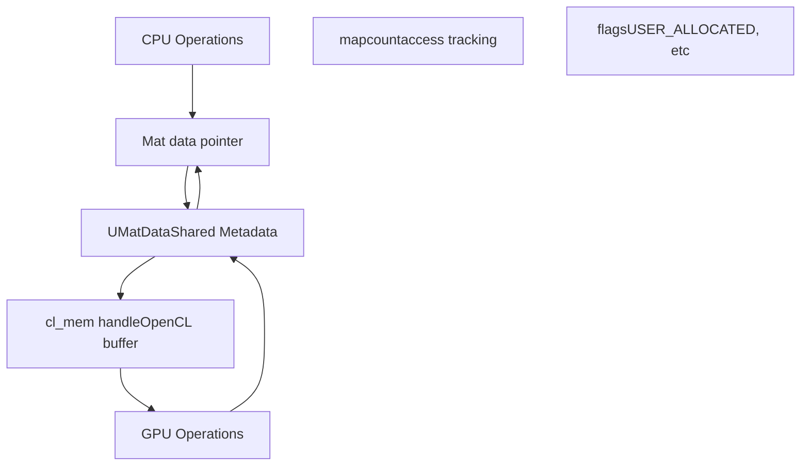
OpenCL 上下文、设备和队列由 `OpenCLExecutionContext` 管理（参见 [OpenCL 加速与透明 GPU 执行](/opencv/opencv/3.2-opencl-acceleration-and-transparent-gpu-execution)）。

来源： [modules/core/src/ocl.cpp846-1037](https://github.com/opencv/opencv/blob/91c78f50/modules/core/src/ocl.cpp#L846-L1037) [modules/core/src/umatrix.cpp1-500](https://github.com/opencv/opencv/blob/91c78f50/modules/core/src/umatrix.cpp#L1-L500)

## 内存管理基础设施

### UMatData 结构

`UMatData` 是 Mat 与 UMat 共用的引用计数头结构：

```mermaid
flowchart TD
    UMatData["UMatDataReference-counted header"]
    Pointers["Memory Pointers"]
    Refcounts["Reference Counts"]
    Allocators["Allocator Links"]
    Status["Status Flags"]
    OpenCL["OpenCL Handles"]
    data["data*CPU pointer"]
    origdata["origdata*original allocation"]
    refcount["refcountMat instances"]
    urefcount["urefcountUMat instances"]
    mapcount["mapcountactive mappings"]
    allocatorFlags["allocatorFlags_"]
    currAllocator["currAllocator*"]
    flags["flagsUSER_ALLOCATED, etc"]
    size["sizetotal bytes"]
    handle["handleOpenCL cl_mem"]
    devMemOffset["devMemOffset_"]
    deviceCopyObsolete["deviceCopyObsolete_"]
    hostCopyObsolete["hostCopyObsolete_"]

    UMatData --> Pointers
    UMatData --> Refcounts
    UMatData --> Allocators
    UMatData --> Status
    UMatData --> OpenCL
    Pointers --> data
    Pointers --> origdata
    Refcounts --> refcount
    Refcounts --> urefcount
    Refcounts --> mapcount
    Allocators --> allocatorFlags
    Allocators --> currAllocator
    Status --> flags
    Status --> size
    OpenCL --> handle
    OpenCL --> devMemOffset
    OpenCL --> deviceCopyObsolete
    OpenCL --> hostCopyObsolete
```
**引用计数规则：**

-   `refcount`：每有一个共享该数据的 `Mat` 就递增
-   `urefcount`：每有一个共享该数据的 `UMat` 就递增
-   当 `refcount == 0` 且 `urefcount == 0` 时释放内存

来源： [modules/core/include/opencv2/core/mat.hpp661-746](https://github.com/opencv/opencv/blob/91c78f50/modules/core/include/opencv2/core/mat.hpp#L661-L746) [modules/core/src/matrix.cpp10-21](https://github.com/opencv/opencv/blob/91c78f50/modules/core/src/matrix.cpp#L10-L21)

### MatAllocator 层次

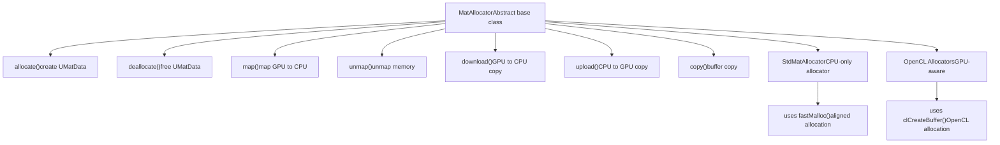
**默认分配器：**

-   `Mat::getStdAllocator()` 返回单例 `StdMatAllocator`
-   可通过 `Mat::setDefaultAllocator()` 设置自定义分配器
-   UMat 在可用时使用 OpenCL 分配器

来源： [modules/core/src/matrix.cpp126-199](https://github.com/opencv/opencv/blob/91c78f50/modules/core/src/matrix.cpp#L126-L199) [modules/core/include/opencv2/core/mat.hpp634-660](https://github.com/opencv/opencv/blob/91c78f50/modules/core/include/opencv2/core/mat.hpp#L634-L660)

### 引用计数机制

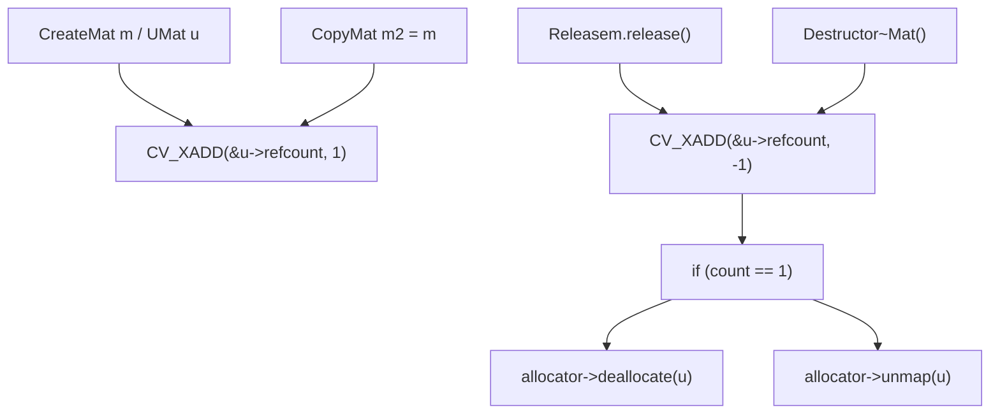
**线程安全原子操作：**

-   `CV_XADD(addr, delta)` - 原子增减
-   通过 `std::atomic` 或平台内建指令实现
-   定义见 [modules/core/include/opencv2/core/cvdef.h1-1200](https://github.com/opencv/opencv/blob/91c78f50/modules/core/include/opencv2/core/cvdef.h#L1-L1200)

来源： [modules/core/src/matrix.cpp541-565](https://github.com/opencv/opencv/blob/91c78f50/modules/core/src/matrix.cpp#L541-L565) [modules/core/src/matrix.cpp733-741](https://github.com/opencv/opencv/blob/91c78f50/modules/core/src/matrix.cpp#L733-L741)

## 数据布局与寻址

### 多维索引

Mat 支持最多 `CV_MAX_DIM` 个维度（通常为 32）：

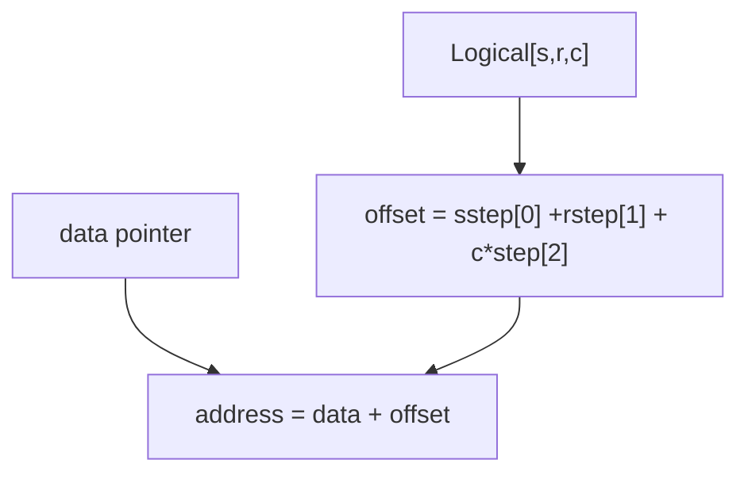
**Step 数组布局：**

-   `step[0]`：每个切片的字节数（最外层维度）
-   `step[1]`：每行字节数
-   `step[2]`：每列字节数（通常是 elemSize）
-   对 2D 而言：`step[0]` 是行步长，`step[1]` 是元素大小

**1-2 维优化：**

-   1D/2D 数组使用内嵌 `step.buf[2]`，而非堆分配
-   `size.p` 为效率直接指向 `&rows`
-   更高维度会动态分配 `step.p` 和 `size.p`

来源： [modules/core/src/matrix.cpp218-281](https://github.com/opencv/opencv/blob/91c78f50/modules/core/src/matrix.cpp#L218-L281) [modules/core/include/opencv2/core/mat.hpp796-900](https://github.com/opencv/opencv/blob/91c78f50/modules/core/include/opencv2/core/mat.hpp#L796-L900)

### 子矩阵与 ROI 实现

创建子矩阵或 ROI 会共享底层数据：

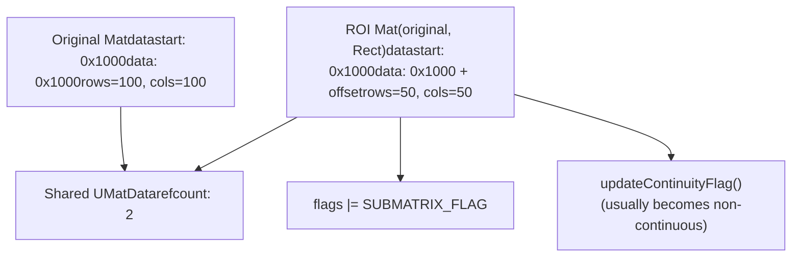
**实现细节：**

-   构造函数 `Mat(const Mat& m, const Rect& roi)`
-   引用计数递增：`CV_XADD(&u->refcount, 1)`
-   调整 `data` 指针：`data += roi.y*step[0] + roi.x*elemSize()`
-   在 flags 中设置 `SUBMATRIX_FLAG`
-   保持 `datastart` 与 `datalimit` 不变

来源： [modules/core/src/matrix.cpp796-820](https://github.com/opencv/opencv/blob/91c78f50/modules/core/src/matrix.cpp#L796-L820) [modules/core/src/matrix.cpp743-793](https://github.com/opencv/opencv/blob/91c78f50/modules/core/src/matrix.cpp#L743-L793)

## Mat 与 UMat 互操作

### Mat 与 UMat 的转换

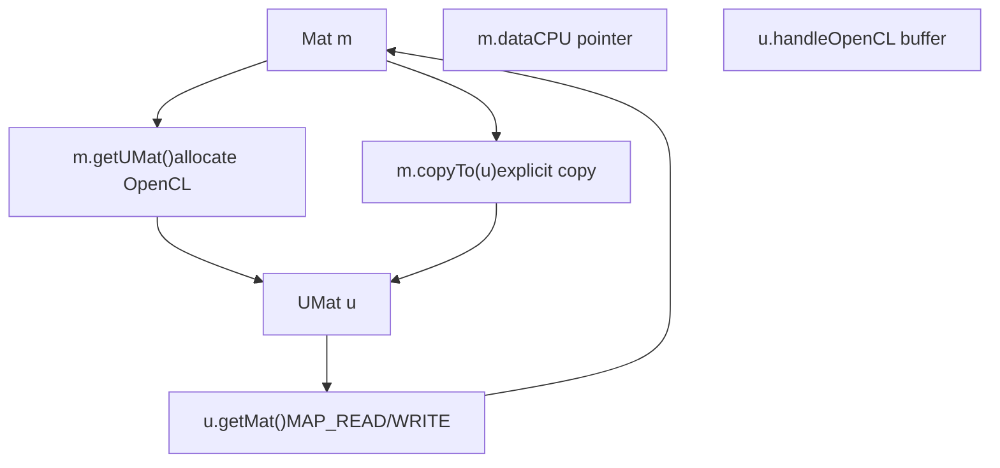
**转换方法：**

| 方法 | 方向 | 数据复制 | 使用场景 |
| --- | --- | --- | --- |
| `UMat::getMat(AccessFlag)` | UMat → Mat | 惰性（访问时） | 在 CPU 上访问 GPU 数据 |
| `Mat::getUMat(AccessFlag)` | Mat → UMat | 惰性 | 将 CPU 数据上传至 GPU |
| `Mat::copyTo(UMat)` | Mat → UMat | 立即 | 显式复制 |
| `UMat::copyTo(Mat)` | UMat → Mat | 立即 | 显式复制 |

**访问标志：**

-   `ACCESS_READ`：只读访问（1<<24）
-   `ACCESS_WRITE`：只写访问（1<<25）
-   `ACCESS_RW`：读写访问
-   `ACCESS_FAST`：快速映射提示

来源： [modules/core/include/opencv2/core/mat.hpp65-68](https://github.com/opencv/opencv/blob/91c78f50/modules/core/include/opencv2/core/mat.hpp#L65-L68) [modules/core/src/matrix.cpp1-200](https://github.com/opencv/opencv/blob/91c78f50/modules/core/src/matrix.cpp#L1-L200)

### InputArray/OutputArray 抽象

OpenCV 函数使用多态数组包装器来同时接收 Mat 和 UMat：

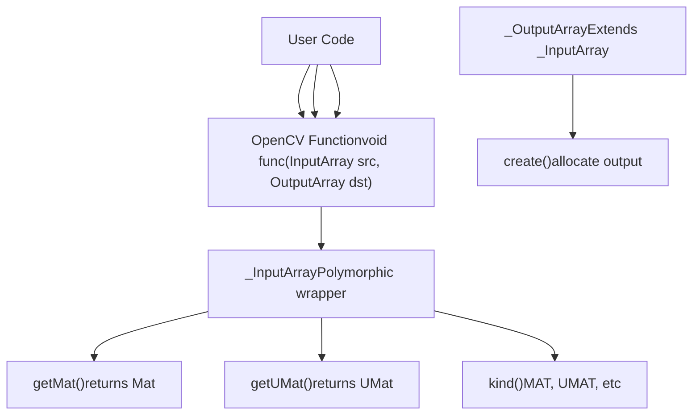
**Kind 标志：**

-   `MAT = 1 << KIND_SHIFT`
-   `UMAT = 10 << KIND_SHIFT`
-   `STD_VECTOR_MAT = 5 << KIND_SHIFT`
-   以及其他容器类型标志

来源： [modules/core/include/opencv2/core/mat.hpp160-272](https://github.com/opencv/opencv/blob/91c78f50/modules/core/include/opencv2/core/mat.hpp#L160-L272) [modules/core/include/opencv2/core/mat.hpp301-393](https://github.com/opencv/opencv/blob/91c78f50/modules/core/include/opencv2/core/mat.hpp#L301-L393)

### 透明 GPU 执行

T-API（Transparent API）会自动选择 CPU 或 GPU 执行：

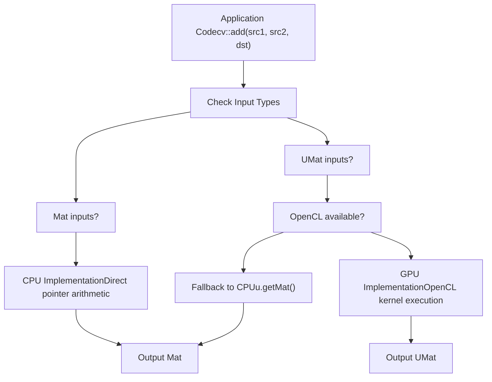
**执行决策：**

`arithm.cpp` 中的 `binary_op` 等函数遵循以下模式：

1.  计算 `use_opencl = (kind1 == _InputArray::UMAT || kind2 == _InputArray::UMAT) && dims <= 2`
2.  调用 `CV_OCL_RUN(use_opencl, ocl_binary_op(...))`——若 OpenCL 实现返回 `false`，则继续后续路径
3.  否则对所有输入调用 `getMat()` 并执行 CPU 路径

当构建时未定义 `HAVE_OPENCL`，`CV_OCL_RUN` 宏会退化为空操作，因此在无 OpenCL 平台上整个分发路径会被编译期消除。

来源： [modules/core/src/arithm.cpp151-246](https://github.com/opencv/opencv/blob/91c78f50/modules/core/src/arithm.cpp#L151-L246) [modules/core/src/arithm.cpp60-147](https://github.com/opencv/opencv/blob/91c78f50/modules/core/src/arithm.cpp#L60-L147)

---

本页记录了支撑 OpenCV 全部操作的核心数据结构。理解 Mat 与 UMat 的内存布局、引用计数和互操作机制，是高效使用 OpenCV 以及理解 [OpenCL 加速与透明 GPU 执行](/opencv/opencv/3.2-opencl-acceleration-and-transparent-gpu-execution) 中加速机制的基础。
