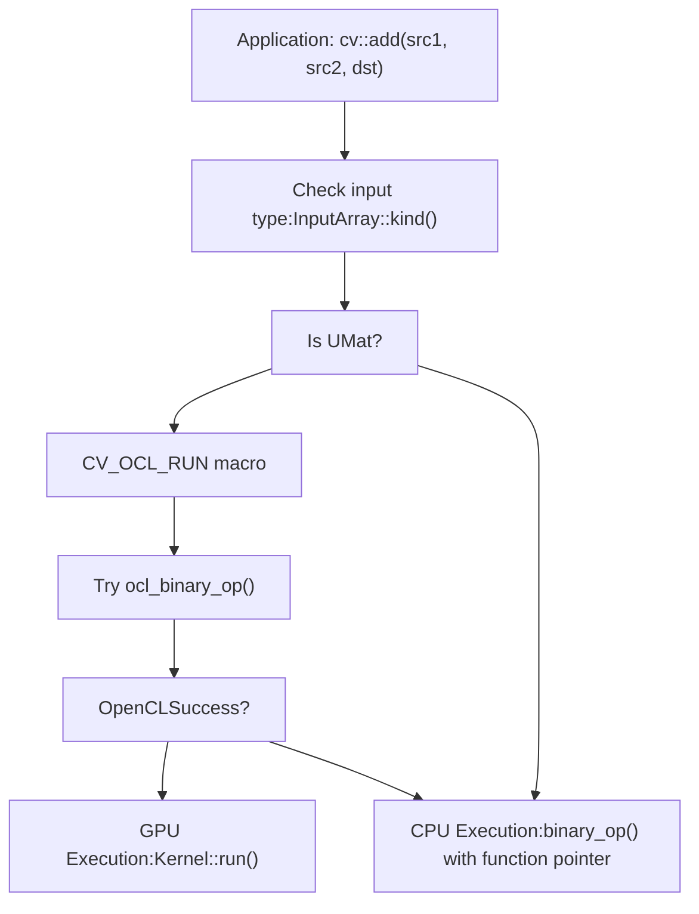
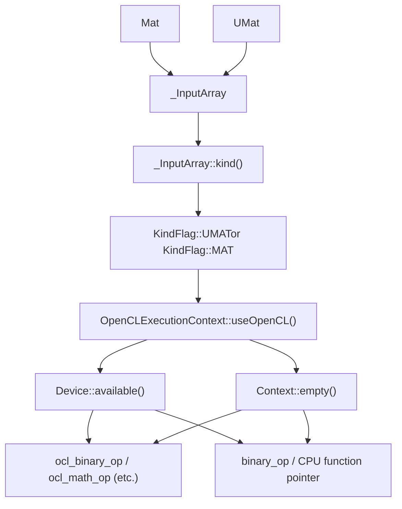
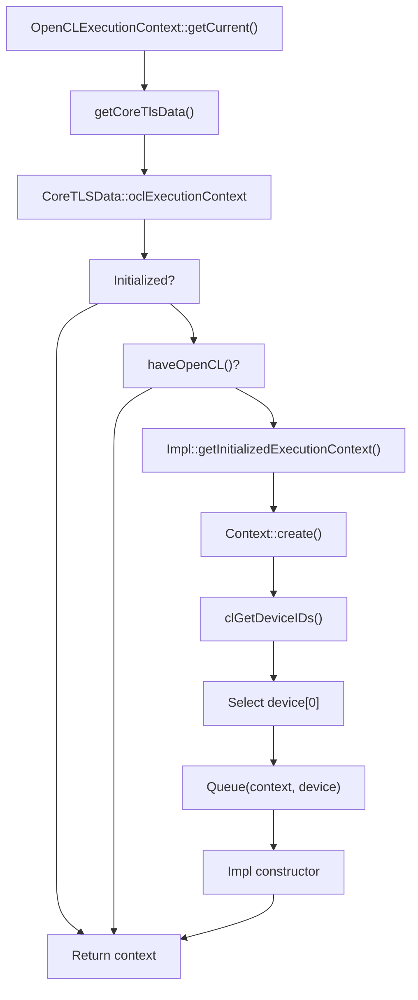
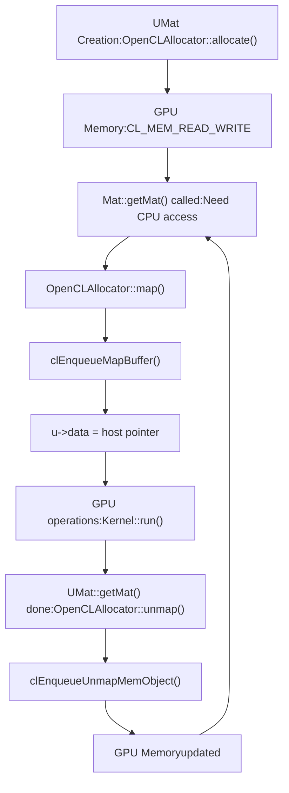
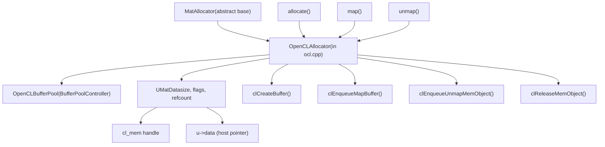
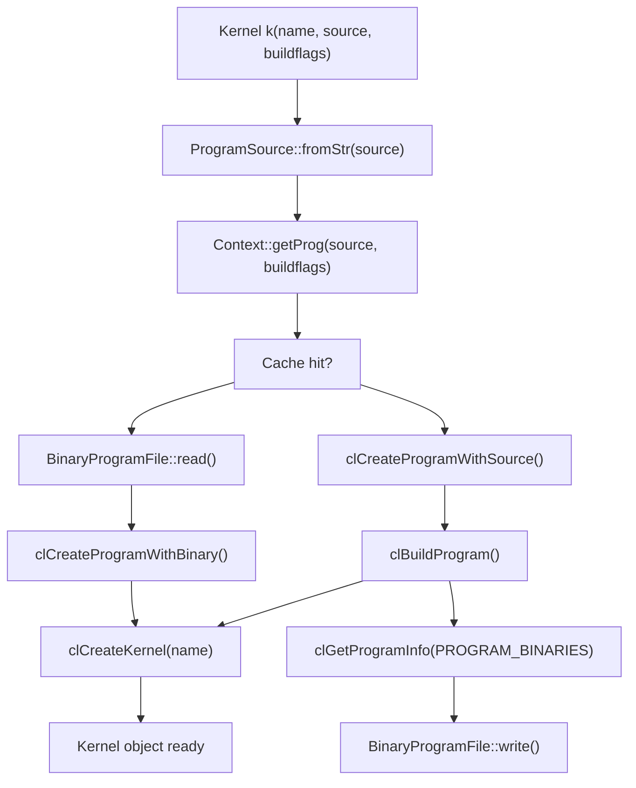
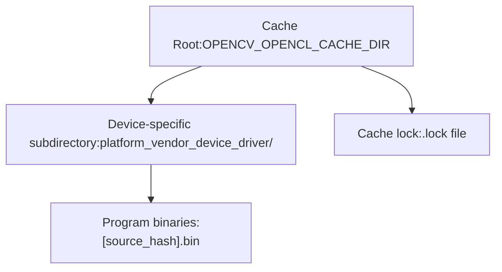
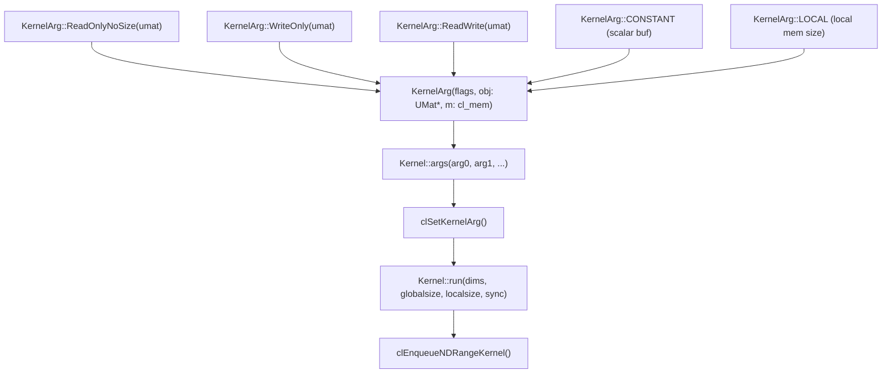
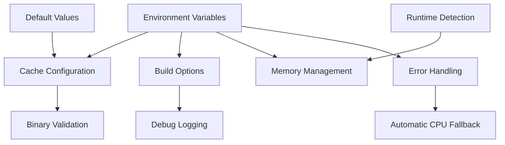

# OpenCL 加速与透明 GPU 执行

相关源文件

-   [3rdparty/libjpeg/jquant2.c](https://github.com/opencv/opencv/blob/91c78f50/3rdparty/libjpeg/jquant2.c)
-   [cmake/OpenCVCompilerOptimizations.cmake](https://github.com/opencv/opencv/blob/91c78f50/cmake/OpenCVCompilerOptimizations.cmake)
-   [modules/calib3d/src/rho.cpp](https://github.com/opencv/opencv/blob/91c78f50/modules/calib3d/src/rho.cpp)
-   [modules/calib3d/src/rho.h](https://github.com/opencv/opencv/blob/91c78f50/modules/calib3d/src/rho.h)
-   [modules/core/include/opencv2/core.hpp](https://github.com/opencv/opencv/blob/91c78f50/modules/core/include/opencv2/core.hpp)
-   [modules/core/include/opencv2/core/base.hpp](https://github.com/opencv/opencv/blob/91c78f50/modules/core/include/opencv2/core/base.hpp)
-   [modules/core/include/opencv2/core/core.hpp](https://github.com/opencv/opencv/blob/91c78f50/modules/core/include/opencv2/core/core.hpp)
-   [modules/core/include/opencv2/core/cv\_cpu\_dispatch.h](https://github.com/opencv/opencv/blob/91c78f50/modules/core/include/opencv2/core/cv_cpu_dispatch.h)
-   [modules/core/include/opencv2/core/cv\_cpu\_helper.h](https://github.com/opencv/opencv/blob/91c78f50/modules/core/include/opencv2/core/cv_cpu_helper.h)
-   [modules/core/include/opencv2/core/cvdef.h](https://github.com/opencv/opencv/blob/91c78f50/modules/core/include/opencv2/core/cvdef.h)
-   [modules/core/include/opencv2/core/mat.hpp](https://github.com/opencv/opencv/blob/91c78f50/modules/core/include/opencv2/core/mat.hpp)
-   [modules/core/include/opencv2/core/mat.inl.hpp](https://github.com/opencv/opencv/blob/91c78f50/modules/core/include/opencv2/core/mat.inl.hpp)
-   [modules/core/include/opencv2/core/matx.hpp](https://github.com/opencv/opencv/blob/91c78f50/modules/core/include/opencv2/core/matx.hpp)
-   [modules/core/include/opencv2/core/ocl.hpp](https://github.com/opencv/opencv/blob/91c78f50/modules/core/include/opencv2/core/ocl.hpp)
-   [modules/core/include/opencv2/core/opencl/ocl\_defs.hpp](https://github.com/opencv/opencv/blob/91c78f50/modules/core/include/opencv2/core/opencl/ocl_defs.hpp)
-   [modules/core/include/opencv2/core/operations.hpp](https://github.com/opencv/opencv/blob/91c78f50/modules/core/include/opencv2/core/operations.hpp)
-   [modules/core/include/opencv2/core/private.hpp](https://github.com/opencv/opencv/blob/91c78f50/modules/core/include/opencv2/core/private.hpp)
-   [modules/core/include/opencv2/core/softfloat.hpp](https://github.com/opencv/opencv/blob/91c78f50/modules/core/include/opencv2/core/softfloat.hpp)
-   [modules/core/include/opencv2/core/types.hpp](https://github.com/opencv/opencv/blob/91c78f50/modules/core/include/opencv2/core/types.hpp)
-   [modules/core/include/opencv2/core/types\_c.h](https://github.com/opencv/opencv/blob/91c78f50/modules/core/include/opencv2/core/types_c.h)
-   [modules/core/include/opencv2/core/utility.hpp](https://github.com/opencv/opencv/blob/91c78f50/modules/core/include/opencv2/core/utility.hpp)
-   [modules/core/include/opencv2/core/utils/buffer\_area.private.hpp](https://github.com/opencv/opencv/blob/91c78f50/modules/core/include/opencv2/core/utils/buffer_area.private.hpp)
-   [modules/core/perf/opencl/perf\_arithm.cpp](https://github.com/opencv/opencv/blob/91c78f50/modules/core/perf/opencl/perf_arithm.cpp)
-   [modules/core/src/algorithm.cpp](https://github.com/opencv/opencv/blob/91c78f50/modules/core/src/algorithm.cpp)
-   [modules/core/src/arithm.cpp](https://github.com/opencv/opencv/blob/91c78f50/modules/core/src/arithm.cpp)
-   [modules/core/src/array.cpp](https://github.com/opencv/opencv/blob/91c78f50/modules/core/src/array.cpp)
-   [modules/core/src/buffer\_area.cpp](https://github.com/opencv/opencv/blob/91c78f50/modules/core/src/buffer_area.cpp)
-   [modules/core/src/command\_line\_parser.cpp](https://github.com/opencv/opencv/blob/91c78f50/modules/core/src/command_line_parser.cpp)
-   [modules/core/src/copy.cpp](https://github.com/opencv/opencv/blob/91c78f50/modules/core/src/copy.cpp)
-   [modules/core/src/lapack.cpp](https://github.com/opencv/opencv/blob/91c78f50/modules/core/src/lapack.cpp)
-   [modules/core/src/mathfuncs.cpp](https://github.com/opencv/opencv/blob/91c78f50/modules/core/src/mathfuncs.cpp)
-   [modules/core/src/matrix.cpp](https://github.com/opencv/opencv/blob/91c78f50/modules/core/src/matrix.cpp)
-   [modules/core/src/matrix\_wrap.cpp](https://github.com/opencv/opencv/blob/91c78f50/modules/core/src/matrix_wrap.cpp)
-   [modules/core/src/ocl.cpp](https://github.com/opencv/opencv/blob/91c78f50/modules/core/src/ocl.cpp)
-   [modules/core/src/ocl\_disabled.impl.hpp](https://github.com/opencv/opencv/blob/91c78f50/modules/core/src/ocl_disabled.impl.hpp)
-   [modules/core/src/opencl/arithm.cl](https://github.com/opencv/opencv/blob/91c78f50/modules/core/src/opencl/arithm.cl)
-   [modules/core/src/opencl/gemm.cl](https://github.com/opencv/opencv/blob/91c78f50/modules/core/src/opencl/gemm.cl)
-   [modules/core/src/opencl/meanstddev.cl](https://github.com/opencv/opencv/blob/91c78f50/modules/core/src/opencl/meanstddev.cl)
-   [modules/core/src/opencl/minmaxloc.cl](https://github.com/opencv/opencv/blob/91c78f50/modules/core/src/opencl/minmaxloc.cl)
-   [modules/core/src/opencl/reduce.cl](https://github.com/opencv/opencv/blob/91c78f50/modules/core/src/opencl/reduce.cl)
-   [modules/core/src/precomp.hpp](https://github.com/opencv/opencv/blob/91c78f50/modules/core/src/precomp.hpp)
-   [modules/core/src/rand.cpp](https://github.com/opencv/opencv/blob/91c78f50/modules/core/src/rand.cpp)
-   [modules/core/src/softfloat.cpp](https://github.com/opencv/opencv/blob/91c78f50/modules/core/src/softfloat.cpp)
-   [modules/core/src/system.cpp](https://github.com/opencv/opencv/blob/91c78f50/modules/core/src/system.cpp)
-   [modules/core/src/umatrix.cpp](https://github.com/opencv/opencv/blob/91c78f50/modules/core/src/umatrix.cpp)
-   [modules/core/test/ocl/test\_arithm.cpp](https://github.com/opencv/opencv/blob/91c78f50/modules/core/test/ocl/test_arithm.cpp)
-   [modules/core/test/ocl/test\_opencl.cpp](https://github.com/opencv/opencv/blob/91c78f50/modules/core/test/ocl/test_opencl.cpp)
-   [modules/core/test/test\_arithm.cpp](https://github.com/opencv/opencv/blob/91c78f50/modules/core/test/test_arithm.cpp)
-   [modules/core/test/test\_mat.cpp](https://github.com/opencv/opencv/blob/91c78f50/modules/core/test/test_mat.cpp)
-   [modules/core/test/test\_math.cpp](https://github.com/opencv/opencv/blob/91c78f50/modules/core/test/test_math.cpp)
-   [modules/core/test/test\_operations.cpp](https://github.com/opencv/opencv/blob/91c78f50/modules/core/test/test_operations.cpp)
-   [modules/core/test/test\_precomp.hpp](https://github.com/opencv/opencv/blob/91c78f50/modules/core/test/test_precomp.hpp)
-   [modules/core/test/test\_rand.cpp](https://github.com/opencv/opencv/blob/91c78f50/modules/core/test/test_rand.cpp)
-   [modules/core/test/test\_umat.cpp](https://github.com/opencv/opencv/blob/91c78f50/modules/core/test/test_umat.cpp)
-   [modules/core/test/test\_utils.cpp](https://github.com/opencv/opencv/blob/91c78f50/modules/core/test/test_utils.cpp)
-   [modules/ts/include/opencv2/ts/ocl\_perf.hpp](https://github.com/opencv/opencv/blob/91c78f50/modules/ts/include/opencv2/ts/ocl_perf.hpp)
-   [modules/ts/src/ocl\_perf.cpp](https://github.com/opencv/opencv/blob/91c78f50/modules/ts/src/ocl_perf.cpp)
-   [modules/ts/src/ocl\_test.cpp](https://github.com/opencv/opencv/blob/91c78f50/modules/ts/src/ocl_test.cpp)
-   [platforms/linux/riscv64-071-gcc.toolchain.cmake](https://github.com/opencv/opencv/blob/91c78f50/platforms/linux/riscv64-071-gcc.toolchain.cmake)

OpenCV 的 OpenCL 加速系统通过 OpenCL 框架提供透明 GPU 计算。该系统的关键特性是**透明执行**：当使用 UMat 时，算法会自动在 GPU 上执行；当 OpenCL 不可用或被禁用时，会自动回退到 CPU。这样的透明性使你可以编写与设备无关的代码，并自动利用可用硬件加速。

系统由三个主要组件构成：

-   **UMat 数据结构** - 感知 GPU 的矩阵，触发 OpenCL 执行路径
-   **OpenCL 运行时封装** - 对 OpenCL API 的 C++ 封装类（Device、Context、Queue、Program、Kernel）
-   **二进制程序缓存** - 持久化存储已编译内核，加速启动

关于 Mat 与 UMat 数据结构，请参见第 3.1 页。关于更广泛的系统工具，请参见第 3.3 页。关于并行处理抽象，请参见第 3.3 页。

来源： [modules/core/src/ocl.cpp44-130](https://github.com/opencv/opencv/blob/91c78f50/modules/core/src/ocl.cpp#L44-L130) [modules/core/include/opencv2/core/ocl.hpp1-100](https://github.com/opencv/opencv/blob/91c78f50/modules/core/include/opencv2/core/ocl.hpp#L1-L100)

## 透明执行机制

透明执行机制允许算法根据输入数据类型在 CPU 与 GPU 之间自动选择执行路径。函数收到 UMat 输入时会尝试 OpenCL 执行；收到 Mat 输入时则在 CPU 上执行。

**透明执行流程**

`CV_OCL_RUN` 宏（定义于 [modules/core/include/opencv2/core/private.hpp](https://github.com/opencv/opencv/blob/91c78f50/modules/core/include/opencv2/core/private.hpp)）提供执行切换能力。当 OpenCL 执行不可用或失败时，代码会自动落回 CPU 执行路径。

**代码实体映射：执行路径选择**

执行控制相关关键类与函数：

| 符号 | 作用 | 位置 |
| --- | --- | --- |
| `_InputArray::kind()` | 返回 `MAT` 或 `UMAT` 标志 | [modules/core/include/opencv2/core/mat.hpp163-190](https://github.com/opencv/opencv/blob/91c78f50/modules/core/include/opencv2/core/mat.hpp#L163-L190) |
| `CV_OCL_RUN` 宏 | 守护每一次 OpenCL 尝试 | [modules/core/include/opencv2/core/private.hpp](https://github.com/opencv/opencv/blob/91c78f50/modules/core/include/opencv2/core/private.hpp) |
| `OpenCLExecutionContext::useOpenCL()` | 按上下文启用/禁用开关 | [modules/core/src/ocl.cpp947-969](https://github.com/opencv/opencv/blob/91c78f50/modules/core/src/ocl.cpp#L947-L969) |
| `Device::available()` | 查询 `CL_DEVICE_AVAILABLE` | [modules/core/src/ocl.cpp955-959](https://github.com/opencv/opencv/blob/91c78f50/modules/core/src/ocl.cpp#L955-L959) |
| `Context::empty()` | 若无有效 cl\_context 则为 true | [modules/core/src/ocl.cpp](https://github.com/opencv/opencv/blob/91c78f50/modules/core/src/ocl.cpp) |

来源： [modules/core/src/arithm.cpp151-328](https://github.com/opencv/opencv/blob/91c78f50/modules/core/src/arithm.cpp#L151-L328) [modules/core/src/ocl.cpp846-1080](https://github.com/opencv/opencv/blob/91c78f50/modules/core/src/ocl.cpp#L846-L1080) [modules/core/include/opencv2/core/mat.hpp160-272](https://github.com/opencv/opencv/blob/91c78f50/modules/core/include/opencv2/core/mat.hpp#L160-L272)

## OpenCL 上下文与设备管理

OpenCL 资源通过线程本地执行上下文管理，并在首次使用时惰性初始化。

**执行上下文初始化**

`OpenCLExecutionContext::Impl` 类封装了 OpenCL 状态：

-   `context_` - 封装 cl\_context 的 ocl::Context
-   `device_` - 上下文中选中设备的索引
-   `queue_` - 封装 cl\_command\_queue 的 ocl::Queue
-   `useOpenCL_` - 缓存的可用性标志

来源： [modules/core/src/ocl.cpp979-1037](https://github.com/opencv/opencv/blob/91c78f50/modules/core/src/ocl.cpp#L979-L1037) [modules/core/src/ocl.cpp846-978](https://github.com/opencv/opencv/blob/91c78f50/modules/core/src/ocl.cpp#L846-L978) [modules/core/src/ocl.cpp1068-1080](https://github.com/opencv/opencv/blob/91c78f50/modules/core/src/ocl.cpp#L1068-L1080)

## 透明执行的实际工作方式

透明执行模型无需改动代码即可在 CPU/GPU 间切换。将 `UMat` 传给支持 OpenCL 的 OpenCV 函数时会在 GPU 上执行；传入 `Mat` 时会在 CPU 上执行。CPU 与 GPU 内存间的数据迁移由 `UMat`/`UMatData` 系统自动处理。

**`cv::add()` 中的执行流**

[modules/core/src/arithm.cpp151-328](https://github.com/opencv/opencv/blob/91c78f50/modules/core/src/arithm.cpp#L151-L328) 中内部派发函数 `binary_op()` 遵循如下模式：

1.  通过 `_InputArray::kind()` 检查输入类型——判断是否带 `UMAT` 标志
2.  若检测到 UMat：调用 `CV_OCL_RUN(use_opencl, ocl_binary_op(...))`
3.  `ocl_binary_op()` 会编译或读取缓存内核，通过 `KernelArg` 设参并调用 `Kernel::run()`
4.  若 OpenCL 路径返回 `false`（不可用、设备不匹配、构建错误）：执行会落回 CPU 的 `binary_op()` 函数指针路径

[modules/core/include/opencv2/core/private.hpp](https://github.com/opencv/opencv/blob/91c78f50/modules/core/include/opencv2/core/private.hpp) 中 `CV_OCL_RUN` 宏会守护每次 OpenCL 尝试：它先判断条件，再执行 OCL 函数；若返回 `true`，则立即从外层函数返回。

**OpenCL 算法支持情况**

`CV_OCL_RUN` / `ocl_*` 模式在库中广泛使用。下表概述其出现位置：

| 模块 | 示例函数 | 源码位置 |
| --- | --- | --- |
| core | `add`, `subtract`, `multiply`, `bitwise_and` | [modules/core/src/arithm.cpp60-404](https://github.com/opencv/opencv/blob/91c78f50/modules/core/src/arithm.cpp#L60-L404) |
| core | `magnitude`, `phase`, `log`, `exp` | [modules/core/src/mathfuncs.cpp58-100](https://github.com/opencv/opencv/blob/91c78f50/modules/core/src/mathfuncs.cpp#L58-L100) |
| core | `copyTo`, `setTo` | [modules/core/src/copy.cpp](https://github.com/opencv/opencv/blob/91c78f50/modules/core/src/copy.cpp) |
| imgproc | `GaussianBlur`, `filter2D`, 形态学操作 | `modules/imgproc/src/` |
| imgproc | `resize`, `warpAffine`, `warpPerspective` | `modules/imgproc/src/` |
| imgproc | `cvtColor` | `modules/imgproc/src/color.cpp` |
| features2d | `ORB`, `FAST` | `modules/features2d/src/` |

对于没有 OpenCL 实现的函数，即便输入是 UMat 也会回退到 CPU，并使用 `UMatData` 分配器透明完成所需的 CPU↔GPU 数据传输。

来源： [modules/core/src/arithm.cpp60-404](https://github.com/opencv/opencv/blob/91c78f50/modules/core/src/arithm.cpp#L60-L404) [modules/core/src/mathfuncs.cpp58-100](https://github.com/opencv/opencv/blob/91c78f50/modules/core/src/mathfuncs.cpp#L58-L100) [modules/core/src/copy.cpp1-200](https://github.com/opencv/opencv/blob/91c78f50/modules/core/src/copy.cpp#L1-L200)

## UMat 与内存管理

UMat 提供 GPU 感知的内存管理，并可在 CPU 与 GPU 内存空间间自动迁移数据。系统通过 `UMatData` 跟踪内存状态，并在需要时触发迁移。

**UMat 内存状态机**

**UMatData 结构与标志**

`UMatData` 通过以下标志跟踪内存状态：

-   `COPY_ON_MAP` - 映射前必须先拷贝到主机
-   `HOST_COPY_OBSOLETE` - CPU 副本已过期，GPU 数据更新
-   `DEVICE_COPY_OBSOLETE` - GPU 副本已过期，CPU 数据更新
-   `TEMP_UMAT` - 操作临时缓冲
-   `TEMP_COPIED_UMAT` - 带拷贝数据的临时缓冲
-   `USER_ALLOCATED` - 用户管理内存，不由 OpenCV 管理

**内存分配策略**

系统通过 `UMatUsageFlags` 支持不同分配模式：

| 标志 | 行为 | 使用场景 |
| --- | --- | --- |
| `USAGE_ALLOCATE_HOST_MEMORY` | 仅 CPU 分配 | CPU 密集型操作 |
| `USAGE_ALLOCATE_DEVICE_MEMORY` | 仅 GPU 分配 | GPU 密集型操作 |
| `USAGE_ALLOCATE_SHARED_MEMORY` | OpenCL SVM（共享虚拟内存） | 可用时零拷贝 |
| `USAGE_DEFAULT` | 自动选择 | 通用场景 |

分配器会基于以下因素决定内存放置：

-   设备能力（SVM 支持、host pointer 对齐）
-   配置标志（`CV_OPENCL_ENABLE_MEM_USE_HOST_PTR`）
-   大小阈值（`CV_OPENCL_ALIGNMENT_MEM_USE_HOST_PTR`）

**代码实体：OpenCL 内存分配器**

关键实现细节：

-   `OpenCLAllocator::allocate()` 创建 cl\_mem 对象 [modules/core/src/ocl.cpp1480-1630](https://github.com/opencv/opencv/blob/91c78f50/modules/core/src/ocl.cpp#L1480-L1630)
-   缓冲池复用内存以降低分配开销 [modules/core/include/opencv2/core/bufferpool.hpp](https://github.com/opencv/opencv/blob/91c78f50/modules/core/include/opencv2/core/bufferpool.hpp)
-   内存迁移可通过 `CV_OPENCL_DISABLE_BUFFER_RECT_OPERATIONS` 控制是否使用 clEnqueueReadBufferRect [modules/core/src/ocl.cpp224-231](https://github.com/opencv/opencv/blob/91c78f50/modules/core/src/ocl.cpp#L224-L231)

来源： [modules/core/src/ocl.cpp1080-1900](https://github.com/opencv/opencv/blob/91c78f50/modules/core/src/ocl.cpp#L1080-L1900) [modules/core/src/matrix.cpp10-125](https://github.com/opencv/opencv/blob/91c78f50/modules/core/src/matrix.cpp#L10-L125) [modules/core/src/umatrix.cpp1-1000](https://github.com/opencv/opencv/blob/91c78f50/modules/core/src/umatrix.cpp#L1-L1000)

## 内核编译与二进制缓存

OpenCL 内核在运行时编译，并作为二进制程序缓存，以避免跨程序运行的重复编译开销。

**内核编译流水线**

**二进制缓存文件结构**

`BinaryProgramFile` 类实现了存储在磁盘上的哈希表结构：

| 组件 | 描述 |
| --- | --- |
| FileHeader | 源签名大小 + 签名（CRC64） |
| FileTable | 条目数（64）+ 条目偏移数组 |
| FileEntry | 下一条偏移 + 键大小 + 数据大小 + 键 + 二进制数据 |

哈希冲突通过文件内链表处理。每个条目包含：

-   `nextEntryFileOffset` - 链中下一条目的偏移（末尾为 0）
-   `keySize` - 构建选项键长度
-   `dataSize` - 已编译二进制大小
-   键字符串 - 编译时使用的构建选项
-   二进制数据 - 编译后的程序二进制

**缓存目录组织**

缓存目录结构：

-   根目录：由环境变量 `OPENCV_OPENCL_CACHE_DIR` 设置 [modules/core/src/ocl.cpp329-333](https://github.com/opencv/opencv/blob/91c78f50/modules/core/src/ocl.cpp#L329-L333)
-   按设备划分子目录：利用设备属性创建，确保二进制兼容
-   锁文件：在多进程场景下防止并发写入 [modules/core/src/ocl.cpp349-392](https://github.com/opencv/opencv/blob/91c78f50/modules/core/src/ocl.cpp#L349-L392)

**代码实体映射：内核参数与执行流水线**

关键内核执行步骤：

1.  `KernelArg` 构造函数从 `UMat` 中提取 `cl_mem` — [modules/core/include/opencv2/core/ocl.hpp400-450](https://github.com/opencv/opencv/blob/91c78f50/modules/core/include/opencv2/core/ocl.hpp#L400-L450)
2.  `Kernel::args()` 接收可变参数 `KernelArg` 并逐项调用 `clSetKernelArg()`
3.  `Kernel::run(dims, globalsize, localsize, sync)` 通过 `clEnqueueNDRangeKernel()` 提交内核 — [modules/core/src/ocl.cpp4200-4400](https://github.com/opencv/opencv/blob/91c78f50/modules/core/src/ocl.cpp#L4200-L4400)

来源： [modules/core/src/ocl.cpp520-841](https://github.com/opencv/opencv/blob/91c78f50/modules/core/src/ocl.cpp#L520-L841) [modules/core/src/ocl.cpp310-519](https://github.com/opencv/opencv/blob/91c78f50/modules/core/src/ocl.cpp#L310-L519) [modules/core/src/ocl.cpp3900-4500](https://github.com/opencv/opencv/blob/91c78f50/modules/core/src/ocl.cpp#L3900-L4500) [modules/core/include/opencv2/core/ocl.hpp400-450](https://github.com/opencv/opencv/blob/91c78f50/modules/core/include/opencv2/core/ocl.hpp#L400-L450)

## 运行时配置

OpenCL 行为可通过环境变量与运行时配置控制：

| 配置项 | 环境变量 | 作用 |
| --- | --- | --- |
| 缓存启用 | `OPENCV_OPENCL_CACHE_ENABLE` | 启用/禁用二进制缓存 |
| 缓存目录 | `OPENCV_OPENCL_CACHE_DIR` | 设置缓存存储位置 |
| 缓存加锁 | `OPENCV_OPENCL_CACHE_LOCK_ENABLE` | 启用缓存文件锁 |
| 构建选项 | `OPENCV_OPENCL_BUILD_EXTRA_OPTIONS` | 额外编译标志 |
| 错误处理 | `OPENCV_OPENCL_RAISE_ERROR` | 控制错误行为 |
| 缓冲操作 | `OPENCV_OPENCL_DISABLE_BUFFER_RECT_OPERATIONS` | 禁用矩形缓冲操作 |

配置系统会在首次访问时初始化静态变量，并通过 `cv::utils::getConfigurationParameter*` 函数族提供线程安全的配置参数访问。

来源： [modules/core/src/ocl.cpp215-249](https://github.com/opencv/opencv/blob/91c78f50/modules/core/src/ocl.cpp#L215-L249) [modules/core/src/ocl.cpp142-164](https://github.com/opencv/opencv/blob/91c78f50/modules/core/src/ocl.cpp#L142-L164)
