# 系统工具与并行处理

相关源文件

-   [3rdparty/libjpeg/jquant2.c](https://github.com/opencv/opencv/blob/91c78f50/3rdparty/libjpeg/jquant2.c)
-   [cmake/OpenCVCompilerOptimizations.cmake](https://github.com/opencv/opencv/blob/91c78f50/cmake/OpenCVCompilerOptimizations.cmake)
-   [modules/calib3d/src/rho.cpp](https://github.com/opencv/opencv/blob/91c78f50/modules/calib3d/src/rho.cpp)
-   [modules/calib3d/src/rho.h](https://github.com/opencv/opencv/blob/91c78f50/modules/calib3d/src/rho.h)
-   [modules/core/include/opencv2/core.hpp](https://github.com/opencv/opencv/blob/91c78f50/modules/core/include/opencv2/core.hpp)
-   [modules/core/include/opencv2/core/base.hpp](https://github.com/opencv/opencv/blob/91c78f50/modules/core/include/opencv2/core/base.hpp)
-   [modules/core/include/opencv2/core/core.hpp](https://github.com/opencv/opencv/blob/91c78f50/modules/core/include/opencv2/core/core.hpp)
-   [modules/core/include/opencv2/core/cv\_cpu\_dispatch.h](https://github.com/opencv/opencv/blob/91c78f50/modules/core/include/opencv2/core/cv_cpu_dispatch.h)
-   [modules/core/include/opencv2/core/cv\_cpu\_helper.h](https://github.com/opencv/opencv/blob/91c78f50/modules/core/include/opencv2/core/cv_cpu_helper.h)
-   [modules/core/include/opencv2/core/cvdef.h](https://github.com/opencv/opencv/blob/91c78f50/modules/core/include/opencv2/core/cvdef.h)
-   [modules/core/include/opencv2/core/mat.hpp](https://github.com/opencv/opencv/blob/91c78f50/modules/core/include/opencv2/core/mat.hpp)
-   [modules/core/include/opencv2/core/mat.inl.hpp](https://github.com/opencv/opencv/blob/91c78f50/modules/core/include/opencv2/core/mat.inl.hpp)
-   [modules/core/include/opencv2/core/matx.hpp](https://github.com/opencv/opencv/blob/91c78f50/modules/core/include/opencv2/core/matx.hpp)
-   [modules/core/include/opencv2/core/ocl.hpp](https://github.com/opencv/opencv/blob/91c78f50/modules/core/include/opencv2/core/ocl.hpp)
-   [modules/core/include/opencv2/core/opencl/ocl\_defs.hpp](https://github.com/opencv/opencv/blob/91c78f50/modules/core/include/opencv2/core/opencl/ocl_defs.hpp)
-   [modules/core/include/opencv2/core/operations.hpp](https://github.com/opencv/opencv/blob/91c78f50/modules/core/include/opencv2/core/operations.hpp)
-   [modules/core/include/opencv2/core/private.hpp](https://github.com/opencv/opencv/blob/91c78f50/modules/core/include/opencv2/core/private.hpp)
-   [modules/core/include/opencv2/core/softfloat.hpp](https://github.com/opencv/opencv/blob/91c78f50/modules/core/include/opencv2/core/softfloat.hpp)
-   [modules/core/include/opencv2/core/types.hpp](https://github.com/opencv/opencv/blob/91c78f50/modules/core/include/opencv2/core/types.hpp)
-   [modules/core/include/opencv2/core/types\_c.h](https://github.com/opencv/opencv/blob/91c78f50/modules/core/include/opencv2/core/types_c.h)
-   [modules/core/include/opencv2/core/utility.hpp](https://github.com/opencv/opencv/blob/91c78f50/modules/core/include/opencv2/core/utility.hpp)
-   [modules/core/include/opencv2/core/utils/buffer\_area.private.hpp](https://github.com/opencv/opencv/blob/91c78f50/modules/core/include/opencv2/core/utils/buffer_area.private.hpp)
-   [modules/core/perf/opencl/perf\_arithm.cpp](https://github.com/opencv/opencv/blob/91c78f50/modules/core/perf/opencl/perf_arithm.cpp)
-   [modules/core/src/algorithm.cpp](https://github.com/opencv/opencv/blob/91c78f50/modules/core/src/algorithm.cpp)
-   [modules/core/src/arithm.cpp](https://github.com/opencv/opencv/blob/91c78f50/modules/core/src/arithm.cpp)
-   [modules/core/src/array.cpp](https://github.com/opencv/opencv/blob/91c78f50/modules/core/src/array.cpp)
-   [modules/core/src/buffer\_area.cpp](https://github.com/opencv/opencv/blob/91c78f50/modules/core/src/buffer_area.cpp)
-   [modules/core/src/command\_line\_parser.cpp](https://github.com/opencv/opencv/blob/91c78f50/modules/core/src/command_line_parser.cpp)
-   [modules/core/src/copy.cpp](https://github.com/opencv/opencv/blob/91c78f50/modules/core/src/copy.cpp)
-   [modules/core/src/lapack.cpp](https://github.com/opencv/opencv/blob/91c78f50/modules/core/src/lapack.cpp)
-   [modules/core/src/mathfuncs.cpp](https://github.com/opencv/opencv/blob/91c78f50/modules/core/src/mathfuncs.cpp)
-   [modules/core/src/matrix.cpp](https://github.com/opencv/opencv/blob/91c78f50/modules/core/src/matrix.cpp)
-   [modules/core/src/matrix\_wrap.cpp](https://github.com/opencv/opencv/blob/91c78f50/modules/core/src/matrix_wrap.cpp)
-   [modules/core/src/ocl.cpp](https://github.com/opencv/opencv/blob/91c78f50/modules/core/src/ocl.cpp)
-   [modules/core/src/ocl\_disabled.impl.hpp](https://github.com/opencv/opencv/blob/91c78f50/modules/core/src/ocl_disabled.impl.hpp)
-   [modules/core/src/opencl/arithm.cl](https://github.com/opencv/opencv/blob/91c78f50/modules/core/src/opencl/arithm.cl)
-   [modules/core/src/opencl/gemm.cl](https://github.com/opencv/opencv/blob/91c78f50/modules/core/src/opencl/gemm.cl)
-   [modules/core/src/opencl/meanstddev.cl](https://github.com/opencv/opencv/blob/91c78f50/modules/core/src/opencl/meanstddev.cl)
-   [modules/core/src/opencl/minmaxloc.cl](https://github.com/opencv/opencv/blob/91c78f50/modules/core/src/opencl/minmaxloc.cl)
-   [modules/core/src/opencl/reduce.cl](https://github.com/opencv/opencv/blob/91c78f50/modules/core/src/opencl/reduce.cl)
-   [modules/core/src/parallel.cpp](https://github.com/opencv/opencv/blob/91c78f50/modules/core/src/parallel.cpp)
-   [modules/core/src/precomp.hpp](https://github.com/opencv/opencv/blob/91c78f50/modules/core/src/precomp.hpp)
-   [modules/core/src/rand.cpp](https://github.com/opencv/opencv/blob/91c78f50/modules/core/src/rand.cpp)
-   [modules/core/src/softfloat.cpp](https://github.com/opencv/opencv/blob/91c78f50/modules/core/src/softfloat.cpp)
-   [modules/core/src/system.cpp](https://github.com/opencv/opencv/blob/91c78f50/modules/core/src/system.cpp)
-   [modules/core/src/umatrix.cpp](https://github.com/opencv/opencv/blob/91c78f50/modules/core/src/umatrix.cpp)
-   [modules/core/test/ocl/test\_arithm.cpp](https://github.com/opencv/opencv/blob/91c78f50/modules/core/test/ocl/test_arithm.cpp)
-   [modules/core/test/ocl/test\_opencl.cpp](https://github.com/opencv/opencv/blob/91c78f50/modules/core/test/ocl/test_opencl.cpp)
-   [modules/core/test/test\_arithm.cpp](https://github.com/opencv/opencv/blob/91c78f50/modules/core/test/test_arithm.cpp)
-   [modules/core/test/test\_mat.cpp](https://github.com/opencv/opencv/blob/91c78f50/modules/core/test/test_mat.cpp)
-   [modules/core/test/test\_math.cpp](https://github.com/opencv/opencv/blob/91c78f50/modules/core/test/test_math.cpp)
-   [modules/core/test/test\_operations.cpp](https://github.com/opencv/opencv/blob/91c78f50/modules/core/test/test_operations.cpp)
-   [modules/core/test/test\_precomp.hpp](https://github.com/opencv/opencv/blob/91c78f50/modules/core/test/test_precomp.hpp)
-   [modules/core/test/test\_rand.cpp](https://github.com/opencv/opencv/blob/91c78f50/modules/core/test/test_rand.cpp)
-   [modules/core/test/test\_umat.cpp](https://github.com/opencv/opencv/blob/91c78f50/modules/core/test/test_umat.cpp)
-   [modules/core/test/test\_utils.cpp](https://github.com/opencv/opencv/blob/91c78f50/modules/core/test/test_utils.cpp)
-   [modules/ts/CMakeLists.txt](https://github.com/opencv/opencv/blob/91c78f50/modules/ts/CMakeLists.txt)
-   [modules/ts/include/opencv2/ts.hpp](https://github.com/opencv/opencv/blob/91c78f50/modules/ts/include/opencv2/ts.hpp)
-   [modules/ts/include/opencv2/ts/ocl\_perf.hpp](https://github.com/opencv/opencv/blob/91c78f50/modules/ts/include/opencv2/ts/ocl_perf.hpp)
-   [modules/ts/include/opencv2/ts/ts\_ext.hpp](https://github.com/opencv/opencv/blob/91c78f50/modules/ts/include/opencv2/ts/ts_ext.hpp)
-   [modules/ts/include/opencv2/ts/ts\_gtest.h](https://github.com/opencv/opencv/blob/91c78f50/modules/ts/include/opencv2/ts/ts_gtest.h)
-   [modules/ts/include/opencv2/ts/ts\_perf.hpp](https://github.com/opencv/opencv/blob/91c78f50/modules/ts/include/opencv2/ts/ts_perf.hpp)
-   [modules/ts/src/ocl\_perf.cpp](https://github.com/opencv/opencv/blob/91c78f50/modules/ts/src/ocl_perf.cpp)
-   [modules/ts/src/ocl\_test.cpp](https://github.com/opencv/opencv/blob/91c78f50/modules/ts/src/ocl_test.cpp)
-   [modules/ts/src/precomp.hpp](https://github.com/opencv/opencv/blob/91c78f50/modules/ts/src/precomp.hpp)
-   [modules/ts/src/ts.cpp](https://github.com/opencv/opencv/blob/91c78f50/modules/ts/src/ts.cpp)
-   [modules/ts/src/ts\_arrtest.cpp](https://github.com/opencv/opencv/blob/91c78f50/modules/ts/src/ts_arrtest.cpp)
-   [modules/ts/src/ts\_func.cpp](https://github.com/opencv/opencv/blob/91c78f50/modules/ts/src/ts_func.cpp)
-   [modules/ts/src/ts\_gtest.cpp](https://github.com/opencv/opencv/blob/91c78f50/modules/ts/src/ts_gtest.cpp)
-   [modules/ts/src/ts\_perf.cpp](https://github.com/opencv/opencv/blob/91c78f50/modules/ts/src/ts_perf.cpp)
-   [platforms/linux/riscv64-071-gcc.toolchain.cmake](https://github.com/opencv/opencv/blob/91c78f50/platforms/linux/riscv64-071-gcc.toolchain.cmake)

本文档覆盖 OpenCV 的系统级基础设施，包括错误处理、CPU 特性检测、并行处理框架、配置参数和计时工具。这些组件为整个 OpenCV 库提供跨平台系统服务支撑。

关于内存管理与数据结构，请参见第 3.1 页。关于 OpenCL 加速细节，请参见第 3.2 页。关于持久化与序列化，请参见第 3.4 页。

## 概述

core 模块提供的关键系统工具使以下能力成为可能：

-   **错误处理**：基于异常的错误上报，并支持可定制回调
-   **CPU 特性检测**：运行时检测 SIMD 能力（SSE、AVX、NEON 等）
-   **并行处理**：对多种线程后端的统一抽象
-   **内存分配**：缓存对齐的 `fastMalloc`/`fastFree` 与带栈缓冲的 `AutoBuffer`
-   **随机数生成**：`RNG` 类，支持多种分布与线程本地状态
-   **配置**：基于环境变量的运行时配置
-   **计时**：高精度性能测量工具
-   **系统信息**：构建配置与版本查询

这些工具是整个 OpenCV 库的基础，支撑性能优化、错误诊断与跨平台兼容。

来源： [modules/core/src/system.cpp1-1046](https://github.com/opencv/opencv/blob/91c78f50/modules/core/src/system.cpp#L1-L1046) [modules/core/src/parallel.cpp1-778](https://github.com/opencv/opencv/blob/91c78f50/modules/core/src/parallel.cpp#L1-L778) [modules/core/include/opencv2/core/utility.hpp1-800](https://github.com/opencv/opencv/blob/91c78f50/modules/core/include/opencv2/core/utility.hpp#L1-L800)

## 错误处理与异常

OpenCV 使用完整的异常式错误处理系统，核心是 `Exception` 类和可定制错误回调。

### Exception 类结构

`cv::Exception` 类继承 `std::exception`，并提供详细错误上下文：

| 字段 | 类型 | 描述 |
| --- | --- | --- |
| `code` | `int` | 来自 `CVStatus` 枚举的错误码 |
| `err` | `String` | 错误描述消息 |
| `func` | `String` | 发生错误的函数名 |
| `file` | `String` | 源文件名 |
| `line` | `int` | 源码行号 |
| `msg` | `String` | 格式化后的错误消息 |

来源： [modules/core/src/system.cpp323-367](https://github.com/opencv/opencv/blob/91c78f50/modules/core/src/system.cpp#L323-L367) [modules/core/include/opencv2/core.hpp119-146](https://github.com/opencv/opencv/blob/91c78f50/modules/core/include/opencv2/core.hpp#L119-L146)

### 错误生成与处理

**错误宏与函数流程**

```mermaid
flowchart TD
    CV_Error["CV_Error(code, msg)"]
    CV_Error_["CV_Error_(code, fmt, args)"]
    CV_Assert["CV_Assert(expr)"]
    CV_DbgAssert["CV_DbgAssert(expr)"]
    CV_CheckEQ["CV_CheckEQ / CV_CheckNE / CV_CheckLT / CV_CheckGE"]
    Exception_ctor["Exception(code, err, func, file, line)"]
    formatMessage["formatMessage()"]
    msg_field["msg: string"]
    what_method["what() -> msg.c_str()"]
    error_func["error(const Exception& exc)"]
    param_dumpErrors["param_dumpErrors flag"]
    getUserErrorCallback["getUserErrorCallback()"]
    ErrorCallback["ErrorCallback (function ptr)"]
    setBreakOnError["setBreakOnError()"]
    redirectError["redirectError(errCallback, userdata)"]
    PrintStderr["fprintf(stderr, ...)"]
    InvokeCallback["callback(status, func, msg, file, line, userdata)"]
    BreakDebugger["CV_DBG_BREAK()"]
    ThrowExc["throw exc"]

    CV --> Error_Exception_ctor
    CV --> Error__Exception_ctor
    CV --> Assert_Exception_ctor
    CV --> DbgAssert_Exception_ctor
    CV --> CheckEQ_Exception_ctor
    Exception --> ctor_formatMessage
    formatMessage --> msg_field
    msg --> field_what_method
    Exception --> ctor_error_func
    error --> func_param_dumpErrors
    param --> dumpErrors_PrintStderr
    error --> func_getUserErrorCallback
    getUserErrorCallback --> ErrorCallback
    ErrorCallback --> InvokeCallback
    error --> func_setBreakOnError
    setBreakOnError --> BreakDebugger
    error --> func_ThrowExc
    redirectError --> ErrorCallback
```


来源： [modules/core/src/system.cpp323-367](https://github.com/opencv/opencv/blob/91c78f50/modules/core/src/system.cpp#L323-L367) [modules/core/include/opencv2/core/base.hpp223-403](https://github.com/opencv/opencv/blob/91c78f50/modules/core/include/opencv2/core/base.hpp#L223-L403) [modules/core/include/opencv2/core.hpp119-156](https://github.com/opencv/opencv/blob/91c78f50/modules/core/include/opencv2/core.hpp#L119-L156)

`Exception::formatMessage()` 方法会生成如下格式的详细错误消息：

```
OpenCV(version) file:line: error: (code:description) message text in function 'function_name'
```
对于多行错误消息，每行都会以 `>` 作为前缀以提高清晰度。

### 自定义错误回调

应用可通过 `redirectError()` 自定义错误处理：

```
typedef int (*ErrorCallback)(int status, const char* func_name,                             const char* err_msg, const char* file_name,                             int line, void* userdata); ErrorCallback redirectError(ErrorCallback errCallback,                             void* userdata = 0,                            void** prevUserdata = 0);
```
回调返回值：

-   返回 `0`：继续正常抛出异常
-   返回非 0：抑制异常抛出

来源： [modules/core/include/opencv2/core/utility.hpp160-177](https://github.com/opencv/opencv/blob/91c78f50/modules/core/include/opencv2/core/utility.hpp#L160-L177)

## CPU 特性检测

OpenCV 在运行时检测 CPU 特性，以启用基于 SIMD 指令的优化路径。内部 `HWFeatures` 结构维护特性可用标志，而公开 API 则提供查询能力。

### 平台特定检测方法

**`HWFeatures` 初始化与公开查询 API**

```mermaid
flowchart TD
    initializeNames["initializeNames()"]
    initialize["initialize()"]
    have_array["have[CV_HARDWARE_MAX_FEATURE]"]
    featuresEnabled["featuresEnabled (global)"]
    featuresDisabled["featuresDisabled (global)"]
    currentFeatures["currentFeatures (ptr)"]
    env_disable["OPENCV_CPU_DISABLE env var"]
    CV_CPUID_X86["CV_CPUID_X86 macro (x86/x64)"]
    auxv_file["/proc/self/auxv (ARM Linux/QNX)"]
    android_getCpuFeatures["android_getCpuFeatures() (ARM Android)"]
    sysctlbyname["sysctlbyname() (ARM macOS)"]
    getauxval_ppc["getauxval(AT_HWCAP/AT_HWCAP2) (PowerPC)"]
    getauxval_la["getauxval(AT_HWCAP) (LoongArch)"]
    CPU_SSE2["CPU_SSE2"]
    CPU_AVX2["CPU_AVX2"]
    CPU_AVX_512F["CPU_AVX_512F"]
    CPU_NEON["CPU_NEON"]
    CPU_SVE["CPU_SVE"]
    CPU_VSX["CPU_VSX"]
    CPU_RVV["CPU_RVV"]
    CPU_LSX["CPU_LSX"]
    checkHardwareSupport["checkHardwareSupport(int feature)"]
    getCPUFeaturesLine["getCPUFeaturesLine()"]
    setUseOptimized["setUseOptimized(bool onoff)"]
    useOptimized["useOptimized()"]

    CV --> CPUID_X86_initialize
    auxv --> file_initialize
    android --> getCpuFeatures_initialize
    sysctlbyname --> initialize
    getauxval --> ppc_initialize
    getauxval --> la_initialize
    initialize --> have_array
    initialize --> initializeNames
    env --> disable_featuresDisabled
    have --> array_featuresEnabled
    featuresEnabled --> currentFeatures
    featuresDisabled --> currentFeatures
    currentFeatures --> checkHardwareSupport
    currentFeatures --> getCPUFeaturesLine
    CPU --> SSE2_checkHardwareSupport
    CPU --> AVX2_checkHardwareSupport
    CPU --> AVX_512F_checkHardwareSupport
    CPU --> NEON_checkHardwareSupport
    CPU --> SVE_checkHardwareSupport
    CPU --> VSX_checkHardwareSupport
    CPU --> RVV_checkHardwareSupport
    CPU --> LSX_checkHardwareSupport
```


来源： [modules/core/src/system.cpp382-753](https://github.com/opencv/opencv/blob/91c78f50/modules/core/src/system.cpp#L382-L753) [modules/core/include/opencv2/core/cvdef.h307-366](https://github.com/opencv/opencv/blob/91c78f50/modules/core/include/opencv2/core/cvdef.h#L307-L366)

### 特性检测实现细节

| 平台 | 检测方法 | 示例特性 |
| --- | --- | --- |
| x86/x64 | `CV_CPUID_X86` 宏 | SSE2、AVX2、AVX512F |
| ARM Linux | `/proc/self/auxv`（Elf64\_auxv\_t） | NEON、FP16、DOTPROD、SVE |
| ARM Android | `android_getCpuFeatures()` | NEON、VFP\_FP16 |
| ARM macOS | `sysctlbyname()` | NEON（arm64 始终可用） |
| PowerPC | `getauxval(AT_HWCAP/AT_HWCAP2)` | VSX、VSX3 |
| LoongArch | `getauxval(AT_HWCAP)` | LSX、LASX |

检测流程会检查 OS 支持（如 x86 上 AVX 对应的 xgetbv），读取环境变量 `OPENCV_CPU_DISABLE` 以允许手动禁用特性，并维护三组全局特性集合：`featuresEnabled`、`featuresDisabled` 与 `currentFeatures`（活动集合指针）。

关键 API 函数：

-   `bool checkHardwareSupport(int feature)` - 查询某特性是否可用
-   `String getCPUFeaturesLine()` - 获取带标记的人类可读特性列表：基线特性（无标记）、分发特性（`*`）、不可用（`?`）
-   `void setUseOptimized(bool onoff)` - 全局启用/禁用优化代码路径

来源： [modules/core/src/system.cpp463-574](https://github.com/opencv/opencv/blob/91c78f50/modules/core/src/system.cpp#L463-L574) [modules/core/src/system.cpp576-753](https://github.com/opencv/opencv/blob/91c78f50/modules/core/src/system.cpp#L576-L753) [modules/core/src/system.cpp854-906](https://github.com/opencv/opencv/blob/91c78f50/modules/core/src/system.cpp#L854-L906)

## 并行处理框架

OpenCV 提供统一的并行处理抽象，可工作在多种线程后端之上。框架核心是 `parallel_for_()` 与 `ParallelLoopBody` 接口。

### 支持的并行后端

OpenCV 在构建时或运行时选择并行后端：

| 后端 | CMake 标志 / 宏 | 描述 |
| --- | --- | --- |
| Intel TBB | `WITH_TBB` / `HAVE_TBB` | Thread Building Blocks |
| OpenMP | `WITH_OPENMP` / `_OPENMP` | 编译器级并行 |
| Grand Central Dispatch | `WITH_GCD` / `HAVE_GCD` | Apple 的 `libdispatch` |
| Windows Concurrency | `WINRT` | Windows Runtime 并发库 |
| PThreads pool | 默认回退 | POSIX 线程池 |

当前后端由编译期宏 `CV_PARALLEL_FRAMEWORK` 决定，可在运行时通过 `cv::getParallelFramework()` 查询。也可以通过 `setParallelForBackend()` 在运行时注册自定义后端。

来源： [modules/core/src/parallel.cpp1-166](https://github.com/opencv/opencv/blob/91c78f50/modules/core/src/parallel.cpp#L1-L166) [modules/core/include/opencv2/core/utility.hpp689-791](https://github.com/opencv/opencv/blob/91c78f50/modules/core/include/opencv2/core/utility.hpp#L689-L791)

### 并行循环接口

**`parallel_for_` 在 `parallel.cpp` 中的调用链**

```mermaid
flowchart TD
    UserBody["class Body : public ParallelLoopBody"]
    op["operator()(const Range& r) const"]
    parallel_for["parallel_for_(Range, ParallelLoopBody, double nstripes)"]
    nstripes_calc["nstripes / grain calculation"]
    CreateCtx["ParallelLoopBodyWrapperContext ctor"]
    ProxyBody["ProxyLoopBody : public ParallelLoopBody"]
    WrapCtx["body, range, nstripes"]
    RNG_capture["theRNG() state snapshot"]
    FP_capture["FP denormal state (fp_control_utils.hpp)"]
    Trace_capture["CV_TRACE_REGION context"]
    Instr_capture["cv::instr context"]
    exc_storage["stored_exception ptr"]
    api_ptr["ParallelForAPI* api"]
    parallel_for_virtual["virtual void parallel_for(Range, FN, nstripes)"]
    TBB["tbb::parallel_for (HAVE_TBB)"]
    OMP["#pragma omp parallel for (_OPENMP)"]
    GCD["dispatch_apply (HAVE_GCD)"]
    Pthreads["WorkerThread pool"]

    UserBody --> parallel_for
    parallel --> for_nstripes_calc
    parallel --> for_CreateCtx
    CreateCtx --> WrapCtx
    WrapCtx --> RNG_capture
    WrapCtx --> FP_capture
    WrapCtx --> Trace_capture
    WrapCtx --> Instr_capture
    WrapCtx --> exc_storage
    parallel --> for_ProxyBody
    ProxyBody --> api_ptr
    api --> ptr_parallel_for_virtual
    parallel --> for_virtual_TBB
    parallel --> for_virtual_OMP
    parallel --> for_virtual_GCD
    parallel --> for_virtual_Pthreads
    TBB --> op
    OMP --> op
    GCD --> op
    Pthreads --> op
```


来源： [modules/core/src/parallel.cpp201-389](https://github.com/opencv/opencv/blob/91c78f50/modules/core/src/parallel.cpp#L201-L389) [modules/core/src/parallel.cpp634-778](https://github.com/opencv/opencv/blob/91c78f50/modules/core/src/parallel.cpp#L634-L778) [modules/core/include/opencv2/core/utility.hpp689-791](https://github.com/opencv/opencv/blob/91c78f50/modules/core/include/opencv2/core/utility.hpp#L689-L791)

### 线程管理 API

```
// Thread count controlvoid setNumThreads(int nthreads);  // Set max threads for parallel regionsint getNumThreads();                // Get current thread limitint getThreadNum();                 // Get current thread index (0-based) // Thread affinity (Linux only)bool setThreadAffinityMask(const vector<unsigned char>& mask); // Query parallel frameworkint getParallelFramework();  // Returns CV_PARALLEL_FRAMEWORK_* constant
```
`setNumThreads()` 会影响后续 `parallel_for_()` 调用。设置为 0 或 1 将禁用并行。实际线程数可能受后端或系统限制。

来源： [modules/core/src/parallel.cpp391-579](https://github.com/opencv/opencv/blob/91c78f50/modules/core/src/parallel.cpp#L391-L579)

### 并行循环中的上下文传播

`ParallelLoopBodyWrapperContext` 会确保从调用线程正确捕获状态，并在调用用户 body 前在各工作线程中恢复。

> **[Mermaid sequence]**
> *(图表结构无法解析)*

来源： [modules/core/src/parallel.cpp201-308](https://github.com/opencv/opencv/blob/91c78f50/modules/core/src/parallel.cpp#L201-L308) [modules/core/src/parallel.cpp310-389](https://github.com/opencv/opencv/blob/91c78f50/modules/core/src/parallel.cpp#L310-L389)

关键保证：

-   **RNG 独立性**：每个工作线程由主线程 RNG 状态与线程 ID 异或后得到种子，因此迭代结果可复现。
-   **FP 一致性**：反非正规数处理标志（`fp_control_utils.hpp`）会传播到工作线程。
-   **异常安全**：任一工作线程抛出的首个异常会被原子保存，并在全部工作线程结束后于调用线程重新抛出。
-   **可观测性**：`CV_TRACE_REGION` 与 `cv::instr` 上下文会传播，确保 profiling 工具在并行体内也能正常工作。

## 内存分配

OpenCV 提供缓存对齐分配原语，在库内部广泛用于性能敏感缓冲区。

### `fastMalloc` 与 `fastFree`

`fastMalloc(size_t bufSize)` 通过“超额分配 + 在对齐地址前保存原始指针”的方式分配至少 16 字节（通常对齐到缓存行大小，如 64 字节）的内存。`fastFree(void* ptr)` 则恢复原始指针并调用系统 `free`。

这些函数在 `modules/core/src/matrix.cpp` 的 `StdMatAllocator::allocate` 中直接使用，并在 core 模块中用于各种临时对齐缓冲区。

### `AutoBuffer<_Tp, fixed_size>`

`AutoBuffer`（定义于 `modules/core/include/opencv2/core/utility.hpp`）是固定容量栈缓冲区：当请求大小超过 `fixed_size` 时会自动回退到堆分配。

| 成员 | 描述 |
| --- | --- |
| `allocate(size_t sz)` | 当 `sz <= fixed_size` 使用栈存储，否则使用 `fastMalloc` |
| `deallocate()` | 若使用堆存储则释放 |
| `data()` | 返回缓冲区指针 |
| `size()` | 当前分配大小 |

`AutoBuffer` 可避免小而短生命周期缓冲区的堆分配（如滤波核中的逐行临时缓冲）。默认 `fixed_size` 为 1024 字节。`resize(sz)` 方法可扩展分配。

来源： [modules/core/src/system.cpp107-108](https://github.com/opencv/opencv/blob/91c78f50/modules/core/src/system.cpp#L107-L108) [modules/core/src/matrix.cpp126-177](https://github.com/opencv/opencv/blob/91c78f50/modules/core/src/matrix.cpp#L126-L177) [modules/core/include/opencv2/core/utility.hpp1-150](https://github.com/opencv/opencv/blob/91c78f50/modules/core/include/opencv2/core/utility.hpp#L1-L150)

---

## 随机数生成

OpenCV 的 `RNG` 类（定义于 `modules/core/include/opencv2/core/utility.hpp`）实现了 64 位 Multiply-With-Carry 伪随机数生成器。可通过 `theRNG()` 访问线程本地实例。

### `RNG` 类 API

| 方法 | 描述 |
| --- | --- |
| `RNG(uint64 state)` | 使用种子构造（默认：`0xffffffffffffffff`） |
| `next()` | 推进状态并返回下一个 `uint32` |
| `uniform(a, b)` | Uniform distribution over `<FileRef file-url="https://github.com/opencv/opencv/blob/91c78f50/a, b)` (int, float, double) |

---

## 配置参数

OpenCV 使用环境变量进行运行时配置。系统提供类型安全访问器来读取常见参数类型。

### 配置参数 API

```
namespace cv { namespace utils { // Query configuration parametersbool getConfigurationParameterBool(const char* name, bool defaultValue);size_t getConfigurationParameterSizeT(const char* name, size_t defaultValue);String getConfigurationParameterString(const char* name, const String& defaultValue); }}
```
参数会在首次访问时读取并缓存。系统按以下顺序检查环境变量：先查精确名称；若不存在且未带 `OPENCV_` 前缀，则再查带前缀名称。

来源： [modules/core/include/opencv2/core/utils/configuration.private.hpp1-50](https://github.com/opencv/opencv/blob/91c78f50/modules/core/include/opencv2/core/utils/configuration.private.hpp#L1-L50) [modules/core/src/system.cpp99-105](https://github.com/opencv/opencv/blob/91c78f50/modules/core/src/system.cpp#L99-L105)

### 常见配置参数

| 参数 | 类型 | 用途 | 示例 |
| --- | --- | --- | --- |
| `OPENCV_DUMP_CONFIG` | bool | 启动时打印构建配置 | `OPENCV_DUMP_CONFIG=1` |
| `OPENCV_DUMP_ERRORS` | bool | 将错误打印到 stderr | 默认：debug 下为 true |
| `OPENCV_CPU_DISABLE` | string | 禁用 CPU 特性 | `AVX2,AVX512F` |
| `OPENCV_OPENCL_DEVICE` | string | 选择 OpenCL 设备 | `Intel:GPU:0` |
| `OPENCV_OPENCL_CACHE_DIR` | string | OpenCL 二进制缓存目录 | `/tmp/opencv_cache` |
| `OPENCV_OPENCL_CACHE_ENABLE` | bool | 启用 OpenCL 程序缓存 | 默认：true |
| `OPENCV_OPENCL_CACHE_WRITE` | bool | 允许写入缓存 | 默认：true |
| `OPENCV_OPENCL_CACHE_LOCK_ENABLE` | bool | 对缓存启用文件锁 | 默认：true |

更多 OpenCL 特定参数见第 3.2 页。

来源： [modules/core/src/ocl.cpp215-248](https://github.com/opencv/opencv/blob/91c78f50/modules/core/src/ocl.cpp#L215-L248) [modules/core/src/system.cpp99-105](https://github.com/opencv/opencv/blob/91c78f50/modules/core/src/system.cpp#L99-L105) [modules/core/src/system.cpp455-459](https://github.com/opencv/opencv/blob/91c78f50/modules/core/src/system.cpp#L455-L459)

## 计时与性能工具

OpenCV 提供高精度计时能力，用于性能测量与分析。

### 计时函数

**计时原语与 `TickMeter` 组合关系**

```mermaid
flowchart TD
    getTickCount["getTickCount() -> int64"]
    getTickFrequency["getTickFrequency() -> double"]
    getCPUTickCount["getCPUTickCount() -> int64"]
    getTimestampNS["getTimestampNS() -> uint64_t"]
    steady_clock["std::chrono::steady_clock (default)"]
    mach_time["mach_absolute_time() (macOS)"]
    rdtsc["__rdtsc() / RDTSC asm (x86)"]
    cntvct["CNTVCT_EL0 (ARM64)"]
    tm_start["start()"]
    tm_stop["stop()"]
    tm_reset["reset()"]
    tm_getTimeTicks["getTimeTicks() -> int64"]
    tm_getTimeMicro["getTimeMicro() -> double"]
    tm_getTimeMilli["getTimeMilli() -> double"]
    tm_getTimeSec["getTimeSec() -> double"]
    tm_getFPS["getFPS() -> double"]
    tm_counter["counter (iteration count)"]

    getTickCount --> steady_clock
    getTickCount --> mach_time
    getCPUTickCount --> rdtsc
    getCPUTickCount --> cntvct
    getTimestampNS --> steady_clock
    tm --> start_getTickCount
    tm --> stop_getTickCount
    tm --> getTimeSec_getTickFrequency
    tm --> getFPS_tm_counter
    tm --> getFPS_tm_getTimeSec
```


来源： [modules/core/src/system.cpp908-984](https://github.com/opencv/opencv/blob/91c78f50/modules/core/src/system.cpp#L908-L984) [modules/core/include/opencv2/core/utility.hpp292-357](https://github.com/opencv/opencv/blob/91c78f50/modules/core/include/opencv2/core/utility.hpp#L292-L357)

### 计时 API 细节

| 函数 | 返回值 | 分辨率 | 用途 |
| --- | --- | --- | --- |
| `getTickCount()` | `int64` | ~1 ns | 通用计时 |
| `getTickFrequency()` | `double` | \- | 将 tick 转换为秒 |
| `getCPUTickCount()` | `int64` | 1 CPU 周期 | 微基准测试 |
| `getTimestampNS()` | `uint64_t` | 1 ns | 绝对时间戳 |

`TickMeter` 类提供便捷区间计时，并支持多种时间单位访问：

```
cv::TickMeter tm;tm.start();// ... code to measure ...tm.stop();std::cout << "Time: " << tm.getTimeMilli() << " ms" << std::endl;std::cout << "FPS: " << tm.getFPS() << std::endl;
```
支持多次 start/stop 周期，`TickMeter` 会累计总时长并统计迭代次数。

来源： [modules/core/include/opencv2/core/utility.hpp292-443](https://github.com/opencv/opencv/blob/91c78f50/modules/core/include/opencv2/core/utility.hpp#L292-L443) [modules/core/src/system.cpp908-1028](https://github.com/opencv/opencv/blob/91c78f50/modules/core/src/system.cpp#L908-L1028)

## 日志与诊断

OpenCV 提供完整的日志系统，支持多级别严重性和可定制输出。

### 日志基础设施

日志系统使用编译期日志级别裁剪与运行时消息格式化：

```mermaid
flowchart TD
    SILENT["CV_LOG_LEVEL_SILENT"]
    FATAL["CV_LOG_LEVEL_FATAL"]
    ERROR["CV_LOG_LEVEL_ERROR"]
    WARNING["CV_LOG_LEVEL_WARN"]
    INFO["CV_LOG_LEVEL_INFO"]
    DEBUG["CV_LOG_LEVEL_DEBUG"]
    VERBOSE["CV_LOG_LEVEL_VERBOSE"]
    CV_LOG_FATAL["CV_LOG_FATAL(tag, msg)"]
    CV_LOG_ERROR["CV_LOG_ERROR(tag, msg)"]
    CV_LOG_WARNING["CV_LOG_WARNING(tag, msg)"]
    CV_LOG_INFO["CV_LOG_INFO(tag, msg)"]
    CV_LOG_DEBUG["CV_LOG_DEBUG(tag, msg)"]
    CV_LOG_VERBOSE["CV_LOG_VERBOSE(tag, level, msg)"]
    WriteLogMessage["utils::logging::internal::writeLogMessage()"]
    LogTagManager["LogTagManager - tag-based filtering"]
    LogMessageFormatting["Format with timestamp, tag, level"]
    OutputDestination["stderr / custom handler"]

    CV --> LOG_FATAL_WriteLogMessage
    CV --> LOG_ERROR_WriteLogMessage
    CV --> LOG_WARNING_WriteLogMessage
    CV --> LOG_INFO_WriteLogMessage
    CV --> LOG_DEBUG_WriteLogMessage
    CV --> LOG_VERBOSE_WriteLogMessage
    WriteLogMessage --> LogTagManager
    WriteLogMessage --> LogMessageFormatting
    LogMessageFormatting --> OutputDestination
```


来源： [modules/core/include/opencv2/core/utils/logger.hpp1-200](https://github.com/opencv/opencv/blob/91c78f50/modules/core/include/opencv2/core/utils/logger.hpp#L1-L200)

### 日志级别配置

日志级别可通过以下方式控制：

1.  **编译期**：`CV_LOG_STRIP_LEVEL` 宏会裁剪高于指定级别的全部日志
2.  **运行时**：`OPENCV_LOG_LEVEL` 环境变量设置全局级别
3.  **按 tag**：`registerLogTag()` 支持按组件过滤

示例：

```
CV_LOG_INFO("MyModule", "Processing started");CV_LOG_DEBUG("MyModule", "Intermediate value: " << value);CV_LOG_VERBOSE("MyModule", 1, "Detailed debug info");
```
来源： [modules/core/include/opencv2/core/utils/logger.hpp100-200](https://github.com/opencv/opencv/blob/91c78f50/modules/core/include/opencv2/core/utils/logger.hpp#L100-L200)

## 系统信息与版本查询

OpenCV 提供全面系统信息，包括构建配置、版本详情和运行时能力。

### 构建信息系统


来源： [modules/core/src/system.cpp1031-1046](https://github.com/opencv/opencv/blob/91c78f50/modules/core/src/system.cpp#L1031-L1046) [modules/core/src/system.cpp869-888](https://github.com/opencv/opencv/blob/91c78f50/modules/core/src/system.cpp#L869-L888)

`getBuildInformation()` 返回完整构建报告，包括：

-   OpenCV 版本与构建时间戳
-   编译器版本与标志
-   CPU 基线与分发特性
-   启用模块与第三方库
-   平台特定构建选项

构建信息在编译期生成，并嵌入 `version_string.inc`。

### CPU 特性报告格式

`getCPUFeaturesLine()` 使用特定标记格式化 CPU 能力：

| 标记 | 含义 | 示例 |
| --- | --- | --- |
| （无） | 基线特性 | `SSE2` |
| `*` | 分发特性 | `*AVX2` |
| `?` | 可识别但硬件不可用 | `*AVX512-SKX?` |

该格式可帮助用户快速理解当前激活的优化以及可用于分发的能力。

来源： [modules/core/src/system.cpp869-888](https://github.com/opencv/opencv/blob/91c78f50/modules/core/src/system.cpp#L869-L888)
