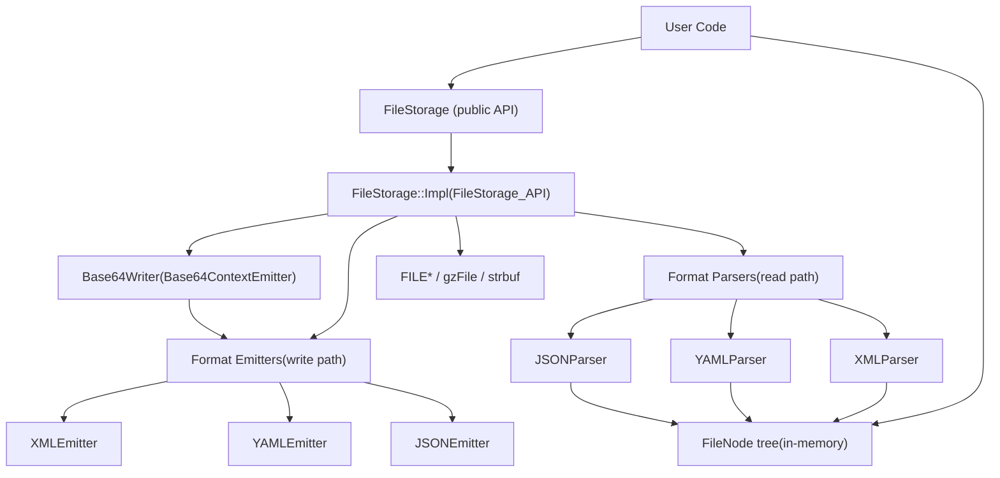

# 持久化与序列化（FileStorage）

相关源文件

-   [modules/core/include/opencv2/core/core\_c.h](https://github.com/opencv/opencv/blob/91c78f50/modules/core/include/opencv2/core/core_c.h)
-   [modules/core/include/opencv2/core/cvstd.hpp](https://github.com/opencv/opencv/blob/91c78f50/modules/core/include/opencv2/core/cvstd.hpp)
-   [modules/core/include/opencv2/core/cvstd.inl.hpp](https://github.com/opencv/opencv/blob/91c78f50/modules/core/include/opencv2/core/cvstd.inl.hpp)
-   [modules/core/include/opencv2/core/cvstd\_wrapper.hpp](https://github.com/opencv/opencv/blob/91c78f50/modules/core/include/opencv2/core/cvstd_wrapper.hpp)
-   [modules/core/include/opencv2/core/persistence.hpp](https://github.com/opencv/opencv/blob/91c78f50/modules/core/include/opencv2/core/persistence.hpp)
-   [modules/core/perf/perf\_io\_base64.cpp](https://github.com/opencv/opencv/blob/91c78f50/modules/core/perf/perf_io_base64.cpp)
-   [modules/core/src/persistence.cpp](https://github.com/opencv/opencv/blob/91c78f50/modules/core/src/persistence.cpp)
-   [modules/core/src/persistence.hpp](https://github.com/opencv/opencv/blob/91c78f50/modules/core/src/persistence.hpp)
-   [modules/core/src/persistence\_base64\_encoding.cpp](https://github.com/opencv/opencv/blob/91c78f50/modules/core/src/persistence_base64_encoding.cpp)
-   [modules/core/src/persistence\_base64\_encoding.hpp](https://github.com/opencv/opencv/blob/91c78f50/modules/core/src/persistence_base64_encoding.hpp)
-   [modules/core/src/persistence\_impl.hpp](https://github.com/opencv/opencv/blob/91c78f50/modules/core/src/persistence_impl.hpp)
-   [modules/core/src/persistence\_json.cpp](https://github.com/opencv/opencv/blob/91c78f50/modules/core/src/persistence_json.cpp)
-   [modules/core/src/persistence\_types.cpp](https://github.com/opencv/opencv/blob/91c78f50/modules/core/src/persistence_types.cpp)
-   [modules/core/src/persistence\_xml.cpp](https://github.com/opencv/opencv/blob/91c78f50/modules/core/src/persistence_xml.cpp)
-   [modules/core/src/persistence\_yml.cpp](https://github.com/opencv/opencv/blob/91c78f50/modules/core/src/persistence_yml.cpp)
-   [modules/core/test/test\_io.cpp](https://github.com/opencv/opencv/blob/91c78f50/modules/core/test/test_io.cpp)
-   [modules/dnn/include/opencv2/dnn/shape\_utils.hpp](https://github.com/opencv/opencv/blob/91c78f50/modules/dnn/include/opencv2/dnn/shape_utils.hpp)
-   [modules/python/test/test\_algorithm\_rw.py](https://github.com/opencv/opencv/blob/91c78f50/modules/python/test/test_algorithm_rw.py)
-   [modules/python/test/test\_filestorage\_io.py](https://github.com/opencv/opencv/blob/91c78f50/modules/python/test/test_filestorage_io.py)
-   [modules/python/test/test\_persistence.py](https://github.com/opencv/opencv/blob/91c78f50/modules/python/test/test_persistence.py)

本页面记录 OpenCV 的文件持久化系统：`FileStorage` 类，以及用于在 XML、YAML、JSON 格式中读写结构化数据的配套 `FileNode` / `FileNodeIterator` API（包含用于二进制数组的 Base64 编码）。该系统完全位于 `opencv_core` 模块中。关于 `core` 模块中更广泛的数据结构（如 `Mat`），请参见 [3.1](/opencv/opencv/3.1-mat-and-umat-data-structures)。

---

## 目标与范围

`FileStorage` 提供统一 API，用于序列化与反序列化以下数据：

-   基本标量（int、int64、float、double、string）
-   OpenCV 矩阵（`Mat`、`SparseMat`、N 维 `MatND`）
-   通过 `write()` / `read()` 自由函数重载支持的用户自定义类型
-   任意层级嵌套的 map（键值）与 sequence（有序列表）

格式（XML、YAML 或 JSON）可通过文件扩展名或显式 flag 选择。借助 `BASE64` flag，二进制矩阵数据可以以 Base64 文本形式嵌入，从而在文本文件内实现无损往返。

---

## 核心类

### 类总览

| 类 | 作用 | 头文件 |
| --- | --- | --- |
| `FileStorage` | 公共 API：打开/关闭文件、写入数据 | `modules/core/include/opencv2/core/persistence.hpp` |
| `FileNode` | 解析树中的只读节点 | `modules/core/include/opencv2/core/persistence.hpp` |
| `FileNodeIterator` | 遍历 `FileNode` 子节点的 STL 风格迭代器 | `modules/core/include/opencv2/core/persistence.hpp` |
| `FileStorage::Impl` | 内部状态与 I/O 实现 | `modules/core/src/persistence_impl.hpp` |
| `FileStorage_API` | 发射器与解析器使用的抽象接口 | `modules/core/src/persistence.hpp` |
| `FileStorageEmitter` | 写路径抽象接口 | `modules/core/src/persistence.hpp` |
| `FileStorageParser` | 读路径抽象接口 | `modules/core/src/persistence.hpp` |
| `XMLEmitter` / `XMLParser` | XML 格式 | `modules/core/src/persistence_xml.cpp` |
| `YAMLEmitter` / `YAMLParser` | YAML 格式 | `modules/core/src/persistence_yml.cpp` |
| `JSONEmitter` / `JSONParser` | JSON 格式 | `modules/core/src/persistence_json.cpp` |
| `Base64Writer` | 原始二进制的缓冲 Base64 编码 | `modules/core/src/persistence_base64_encoding.hpp` |

来源： [modules/core/include/opencv2/core/persistence.hpp254-440](https://github.com/opencv/opencv/blob/91c78f50/modules/core/include/opencv2/core/persistence.hpp#L254-L440) [modules/core/src/persistence.hpp115-220](https://github.com/opencv/opencv/blob/91c78f50/modules/core/src/persistence.hpp#L115-L220) [modules/core/src/persistence\_impl.hpp23-180](https://github.com/opencv/opencv/blob/91c78f50/modules/core/src/persistence_impl.hpp#L23-L180)

---

### `FileStorage`

定义于 [modules/core/include/opencv2/core/persistence.hpp260-426](https://github.com/opencv/opencv/blob/91c78f50/modules/core/include/opencv2/core/persistence.hpp#L260-L426)

**打开模式**（`Mode` 枚举）：

| Flag | Value | 含义 |
| --- | --- | --- |
| `READ` | 0 | 以读取方式打开；整个文件会被解析进内存 |
| `WRITE` | 1 | 以写入方式打开；创建或截断文件 |
| `APPEND` | 2 | 追加到已有文件 |
| `MEMORY` | 4 | 从内存字符串读取 / 写入到内存字符串缓冲 |
| `FORMAT_XML` | `1<<3` | 强制 XML 格式 |
| `FORMAT_YAML` | `2<<3` | 强制 YAML 格式 |
| `FORMAT_JSON` | `3<<3` | 强制 JSON 格式 |
| `FORMAT_AUTO` | 0 | 由文件扩展名自动判断 |
| `BASE64` | 64 | 以 Base64 文本嵌入二进制数组 |
| `WRITE_BASE64` | `BASE64|WRITE` | 便捷别名 |

**关键方法：**

| 方法 | 用途 |
| --- | --- |
| `open(filename, flags, encoding)` | 打开或重新打开文件 |
| `isOpened()` | 文件成功打开后返回 true |
| `release()` | 刷新并关闭；同时写入收尾标签 |
| `releaseAndGetString()` | 与 `release()` 类似，在启用 `MEMORY` 时返回缓冲内容 |
| `operator[](name)` | 按名称返回顶层 `FileNode` |
| `root(streamidx)` | 返回根映射节点（YAML 支持多 stream） |
| `getFirstTopLevelNode()` | 返回根节点的第一个子节点 |
| `write(name, value)` | 写入带名称的标量（int、int64、double、String、Mat） |
| `writeRaw(fmt, vec, len)` | 通过格式说明字符串写入类型化二进制数组 |
| `writeComment(comment, append)` | 嵌入注释（读取时会跳过） |
| `startWriteStruct(name, flags, typeName)` | 开始一个嵌套 map 或 sequence |
| `endWriteStruct()` | 结束当前嵌套结构 |
| `getFormat()` | 返回当前 `Mode` 格式 flag |

来源： [modules/core/include/opencv2/core/persistence.hpp260-426](https://github.com/opencv/opencv/blob/91c78f50/modules/core/include/opencv2/core/persistence.hpp#L260-L426)

---

### `FileNode`

定义于 [modules/core/include/opencv2/core/persistence.hpp440-580](https://github.com/opencv/opencv/blob/91c78f50/modules/core/include/opencv2/core/persistence.hpp#L440-L580)

当文件以读取模式打开时，整个文档会被解析为 `FileStorage::Impl` 内部维护的一棵 `FileNode` 树。`FileNode` 是指向该存储的轻量句柄（块索引 + 字节偏移）。

**节点类型标记：**

| Constant | Value | 含义 |
| --- | --- | --- |
| `NONE` | 0 | 空 / 缺失节点 |
| `INT` | 1 | 整数标量 |
| `REAL` / `FLOAT` | 2 | 浮点标量 |
| `STR` / `STRING` | 3 | UTF-8 文本字符串 |
| `SEQ` | 4 | 有序序列 |
| `MAP` | 5 | 具名映射 |
| `FLOW` | 8 | 以紧凑内联样式写出（YAML/JSON） |
| `EMPTY` | 16 | 空集合 |
| `NAMED` | 32 | 节点有键名（位于 map 中） |

**关键方法：**

| 方法 | 用途 |
| --- | --- |
| `type()` | 返回上述节点类型常量之一 |
| `empty()` / `isNone()` | 检查是否缺失 |
| `isInt()`, `isReal()`, `isString()`, `isSeq()`, `isMap()` | 类型谓词 |
| `operator int()`, `operator double()`, `operator std::string()` | 提取标量值 |
| `operator[](name)` | 按 key 查找子节点（map） |
| `operator[](i)` | 按索引查找子节点（sequence） |
| `size()` | 集合中的元素数量 |
| `keys()` | 映射节点的全部键 |
| `begin()` / `end()` | 返回 `FileNodeIterator` |
| `readRaw(fmt, vec, len)` | 批量读取类型化二进制数组 |
| `real()` / `string()` / `mat()` | 便于绑定层使用的简化访问器 |

来源： [modules/core/include/opencv2/core/persistence.hpp440-580](https://github.com/opencv/opencv/blob/91c78f50/modules/core/include/opencv2/core/persistence.hpp#L440-L580)

---

### `FileNodeIterator`

由 `FileNode::begin()` 与 `FileNode::end()` 返回的 STL 风格前向迭代器。支持 `++`、`+= n`、`*`，以及 `==` / `!=` 比较。可用于遍历 `SEQ` 与 `MAP` 节点。

---

## 架构

**FileStorage 系统架构**


来源： [modules/core/src/persistence.hpp115-220](https://github.com/opencv/opencv/blob/91c78f50/modules/core/src/persistence.hpp#L115-L220) [modules/core/src/persistence\_impl.hpp23-100](https://github.com/opencv/opencv/blob/91c78f50/modules/core/src/persistence_impl.hpp#L23-L100) [modules/core/src/persistence.cpp415-820](https://github.com/opencv/opencv/blob/91c78f50/modules/core/src/persistence.cpp#L415-L820)

---

**类关系与文件位置**


来源： [modules/core/src/persistence\_impl.hpp23-200](https://github.com/opencv/opencv/blob/91c78f50/modules/core/src/persistence_impl.hpp#L23-L200) [modules/core/src/persistence.hpp115-220](https://github.com/opencv/opencv/blob/91c78f50/modules/core/src/persistence.hpp#L115-L220) [modules/core/include/opencv2/core/persistence.hpp440-580](https://github.com/opencv/opencv/blob/91c78f50/modules/core/include/opencv2/core/persistence.hpp#L440-L580)

---

## 打开与格式检测

`FileStorage::Impl::open()`（[modules/core/src/persistence.cpp514-818](https://github.com/opencv/opencv/blob/91c78f50/modules/core/src/persistence.cpp#L514-L818)）执行流程如下：

1.  **模式解析** —— 从 `flags` 中读取 `READ`、`WRITE`、`APPEND`、`MEMORY`、`BASE64`。
2.  **文件名分析** —— `analyze_file_name()` 去除查询参数（例如 `file.json?base64`），将真实路径与选项分离。
3.  **GZ 检测** —— 若文件名以 `.gz` 结尾，使用 `gzopen()` 而非 `fopen()`。
4.  **写入时的格式选择** —— 当 `FORMAT_AUTO` 启用时，按扩展名不区分大小写匹配：
    -   `.xml` → `FORMAT_XML`
    -   `.json` → `FORMAT_JSON`
    -   其他（`.yml`、`.yaml`）→ `FORMAT_YAML`
5.  **创建发射器** —— 调用 `createXMLEmitter()`、`createYAMLEmitter()` 或 `createJSONEmitter()` 之一。
6.  **读取时的格式检测** —— 预读前 16 字节。签名 `%YAML` → YAML，`{` → JSON，`<?xml` → XML。
7.  **解析** —— 对应解析器的 `parse()` 方法构建内存中的 `FileNode` 树。随后文件句柄关闭、缓冲释放；此后仅使用 `FileNode` 树。

来源： [modules/core/src/persistence.cpp514-818](https://github.com/opencv/opencv/blob/91c78f50/modules/core/src/persistence.cpp#L514-L818)

---

## 写入数据

### 流式操作符

`<<` 操作符是主要写接口。向 map 中写入键值对时：

```
fs << "frameCount" << 5;
```
这会调用 `FileStorage::Impl::write(key, value)`，再委托给 `getEmitter().write(key, value)`。

### 嵌套结构

序列通过 `"["` 打开、通过 `"]"` 关闭。map 使用 `"{"` 与 `"}"`。其紧凑（flow）变体分别是 `"[:"` 与 `"{:"`。

```
fs << "features" << "[";     // begin sequence
fs << "{:" << "x" << x << "y" << y << "}";  // compact map element
fs << "]";                   // end sequence
```
来源： [modules/core/include/opencv2/core/persistence.hpp62-172](https://github.com/opencv/opencv/blob/91c78f50/modules/core/include/opencv2/core/persistence.hpp#L62-L172)

### `writeRaw` 与格式说明字符串

`FileStorage::writeRaw(fmt, vec, len)` 会将打包二进制数组逐元素写成文本标量；当启用 `BASE64` 时则写成 Base64。

`fmt` 字符串是紧凑的类型描述符。每个字母映射到一种 C++ 类型：

| Char | Type |
| --- | --- |
| `u` | `uint8_t` |
| `c` | `int8_t` |
| `w` | `uint16_t` |
| `s` | `int16_t` |
| `i` | `int32_t` |
| `f` | `float` |
| `d` | `double` |
| `h` | `hfloat` (16-bit) |
| `r` | pointer (32 lower bits) |

前缀数字表示重复次数：`2if` 表示每个元素由两个 int 后跟一个 float 组成。

格式编码与解码由 [modules/core/src/persistence.cpp198-328](https://github.com/opencv/opencv/blob/91c78f50/modules/core/src/persistence.cpp#L198-L328) 中的 `fs::encodeFormat()`、`fs::decodeFormat()`、`fs::calcStructSize()` 和 `fs::calcElemSize()` 处理。

来源： [modules/core/include/opencv2/core/persistence.hpp224-242](https://github.com/opencv/opencv/blob/91c78f50/modules/core/include/opencv2/core/persistence.hpp#L224-L242) [modules/core/src/persistence.cpp198-328](https://github.com/opencv/opencv/blob/91c78f50/modules/core/src/persistence.cpp#L198-L328)

### 写入 OpenCV 内建类型

`Mat`、`SparseMat` 与 `MatND` 在 [modules/core/src/persistence\_types.cpp](https://github.com/opencv/opencv/blob/91c78f50/modules/core/src/persistence_types.cpp) 中都有专用 `write()` 自由函数。

对 2-D `Mat`，序列化结构如下：

```
my_matrix: !!opencv-matrix   rows: 3   cols: 3   dt: d   data: [ 1., 0., 0., 0., 1., 0., 0., 0., 1. ]
```
当提供 `typeName` 时，`startWriteStruct()` 会写出 `type_id` / `!!type_name` 标签。

来源： [modules/core/src/persistence\_types.cpp11-115](https://github.com/opencv/opencv/blob/91c78f50/modules/core/src/persistence_types.cpp#L11-L115)

---

## 读取数据

### 节点查找

在 `READ` 模式下调用 `FileStorage::open()` 后，解析结果是一个 `FileNode` 树，可通过以下方式访问：

-   `fs["key"]` —— 返回顶层 `FileNode`
-   `node["childKey"]` —— 进入 map 子节点
-   `node[i]` —— 按索引进入 sequence 子节点

### 值提取

支持两种模式：

```
int n = (int)fs["count"];          // cast operatorfs["matrix"] >> mat;               // >> operator
```
对 `int`、`int64_t`、`float`、`double` 和 `std::string` 都定义了 cast 与 `>>` 操作符。

### 遍历序列

```
FileNodeIterator it = fs["features"].begin();FileNodeIterator it_end = fs["features"].end();for (; it != it_end; ++it) {    int x = (int)(*it)["x"];}
```
### `readRaw`

`FileNode::readRaw(fmt, vec, len)` 是 `writeRaw` 的逆操作。它使用相同格式字符串，将节点下的标量序列读回到类型化缓冲区。

来源： [modules/core/include/opencv2/core/persistence.hpp173-222](https://github.com/opencv/opencv/blob/91c78f50/modules/core/include/opencv2/core/persistence.hpp#L173-L222) [modules/core/test/test\_io.cpp181-304](https://github.com/opencv/opencv/blob/91c78f50/modules/core/test/test_io.cpp#L181-L304)

---

## Base64 二进制编码

当设置 `BASE64`（或 `WRITE_BASE64`）flag 时，通过 `writeRaw` 存储的二进制数组会以 Base64 ASCII 字符串嵌入，而不是十进制数字。这会让大矩阵数据更紧凑。

**写路径：**

1.  `FileStorage::Impl::writeRawData()` 检测到 `is_using_base64` 为 true。
2.  它委托给 `writeRawDataBase64()`，后者创建 `Base64Writer`。
3.  `Base64Writer` 使用 `Base64ContextEmitter`（位于 `persistence_base64_encoding.cpp` 内部）缓冲输入字节，每 48 字节编码一次，并输出 Base64 文本行。
4.  一个 24 字节头（编码后填充到 32 个字符）记录元素类型描述符 `dt`，用于正确解码。

**读路径：**

各格式解析器在遇到 Base64 标记值时，都会调用 `FileStorage_API` 的 `parseBase64()`。解码器会逆向解析头信息、做类型检查，并把解码后的二进制流写入已分配的 `FileNode` 存储。

Base64 字母表、编码函数以及 `Base64Writer` 类位于 [modules/core/src/persistence\_base64\_encoding.hpp](https://github.com/opencv/opencv/blob/91c78f50/modules/core/src/persistence_base64_encoding.hpp) 与 [modules/core/src/persistence\_base64\_encoding.cpp](https://github.com/opencv/opencv/blob/91c78f50/modules/core/src/persistence_base64_encoding.cpp)

**Base64 编码流程**

> **[Mermaid sequence]**
> *(图表结构无法解析)*

来源： [modules/core/src/persistence\_base64\_encoding.hpp](https://github.com/opencv/opencv/blob/91c78f50/modules/core/src/persistence_base64_encoding.hpp) [modules/core/src/persistence\_base64\_encoding.cpp](https://github.com/opencv/opencv/blob/91c78f50/modules/core/src/persistence_base64_encoding.cpp) [modules/core/src/persistence.cpp1109-1200](https://github.com/opencv/opencv/blob/91c78f50/modules/core/src/persistence.cpp#L1109-L1200)

---

## 各格式细节

### XML

在 [modules/core/src/persistence\_xml.cpp](https://github.com/opencv/opencv/blob/91c78f50/modules/core/src/persistence_xml.cpp) 中通过 `XMLEmitter` 与 `XMLParser` 实现。

-   顶层包装：`<opencv_storage> … </opencv_storage>`
-   map 条目使用 `<key>value</key>` 标签。
-   sequence 条目使用 `<_>value</_>`（匿名标签）。
-   特殊 XML 字符（`<`、`>`、`&`、`'`、`"`）会转义为实体。
-   类型名称通过 `type_id` 属性传递（例如 `type_id="opencv-matrix"`）。
-   注释使用 `<!-- … -->` 语法。
-   追加模式会定位到最后一个 `</opencv_storage>`，并将其替换为 `<!-- resumed -->`。

### YAML

在 [modules/core/src/persistence\_yml.cpp](https://github.com/opencv/opencv/blob/91c78f50/modules/core/src/persistence_yml.cpp) 中通过 `YAMLEmitter` 与 `YAMLParser` 实现。

-   头部：`%YAML:1.0\n---\n`
-   类型标签使用 YAML 的 `!!typename` 记法。
-   缩进步长：3 个空格（`CV_YML_INDENT`）。
-   flow（紧凑）集合使用内联 `{…}` 与 `[…]`。
-   二进制数据标记为 `!!binary |`，Base64 内容写在续行中。
-   支持单文件多文档（多个 stream，以 `---` 分隔）。

### JSON

在 [modules/core/src/persistence\_json.cpp](https://github.com/opencv/opencv/blob/91c78f50/modules/core/src/persistence_json.cpp) 中通过 `JSONEmitter` 与 `JSONParser` 实现。

-   外层包装：`{ … }`。
-   map 键必须以字母或 `_` 开头，且由 `[a-zA-Z0-9_-\s]` 组成。
-   类型名在 map 内通过显式键值对 `"type_id": "typename"` 存储。
-   注释写作 `// …`（非标准，但读取时可容忍）。
-   浮点零始终写为 `0.0`（启用 explicit zero 模式）。
-   追加模式会定位到最后一个 `}`，插入逗号后继续写入。

来源： [modules/core/src/persistence\_xml.cpp](https://github.com/opencv/opencv/blob/91c78f50/modules/core/src/persistence_xml.cpp) [modules/core/src/persistence\_yml.cpp](https://github.com/opencv/opencv/blob/91c78f50/modules/core/src/persistence_yml.cpp) [modules/core/src/persistence\_json.cpp](https://github.com/opencv/opencv/blob/91c78f50/modules/core/src/persistence_json.cpp) [modules/core/src/persistence.cpp590-728](https://github.com/opencv/opencv/blob/91c78f50/modules/core/src/persistence.cpp#L590-L728)

---

## 内存模式

传入 `FileStorage::MEMORY` 可跳过所有文件 I/O。写入时，输出会积累到 `Impl::outbuf`（`std::vector<char>`）中。`releaseAndGetString()` 将其作为 `cv::String` 返回。读取时，作为“filename”参数传入的字符串会直接作为输入缓冲，通过 `strbuf` / `strbufsize` / `strbufpos` 读取。

```
// Write to stringFileStorage fs(".yml", FileStorage::WRITE | FileStorage::MEMORY);fs << "x" << 42;std::string s = fs.releaseAndGetString(); // Read from stringFileStorage fs2(s, FileStorage::READ | FileStorage::MEMORY);int x = (int)fs2["x"];
```
来源： [modules/core/src/persistence.cpp519-520](https://github.com/opencv/opencv/blob/91c78f50/modules/core/src/persistence.cpp#L519-L520) [modules/core/src/persistence.cpp732-737](https://github.com/opencv/opencv/blob/91c78f50/modules/core/src/persistence.cpp#L732-L737) [modules/core/src/persistence.cpp480-482](https://github.com/opencv/opencv/blob/91c78f50/modules/core/src/persistence.cpp#L480-L482)

---

## 用户自定义类型序列化

任意类型都可以通过在 `cv` 命名空间（或 ADL 可发现命名空间）中重载两个自由函数实现可序列化：

```
void write(FileStorage& fs, const String& name, const MyType& value);void read(const FileNode& node, MyType& value, const MyType& default_value);
```
之后 `fs << "key" << value` 与 `node >> value` 会自动生效。

`Algorithm` 基类（`AKAZE`、`ORB` 等所使用）暴露了 `write(FileStorage&, String)` 与 `read(FileNode)` 虚函数，由各具体算法实现。这是保存/恢复检测器参数的方式（见 [modules/python/test/test\_algorithm\_rw.py](https://github.com/opencv/opencv/blob/91c78f50/modules/python/test/test_algorithm_rw.py)）。

来源： [modules/core/test/test\_io.cpp316-347](https://github.com/opencv/opencv/blob/91c78f50/modules/core/test/test_io.cpp#L316-L347) [modules/python/test/test\_algorithm\_rw.py](https://github.com/opencv/opencv/blob/91c78f50/modules/python/test/test_algorithm_rw.py)

---

## 压缩文件支持

若文件名以 `.gz` 结尾（例如 `data.xml.gz`），OpenCV 会在启用 zlib（`USE_ZLIB=1`）时使用 `gzopen()` 打开。`puts()` 与 `gets()` 会透明调用 `gzputs()` / `gzgets()`。压缩文件不支持追加模式。

来源： [modules/core/src/persistence.cpp548-581](https://github.com/opencv/opencv/blob/91c78f50/modules/core/src/persistence.cpp#L548-L581) [modules/core/src/persistence.hpp14-25](https://github.com/opencv/opencv/blob/91c78f50/modules/core/src/persistence.hpp#L14-L25)

---

## 读取节点的内部内存布局

解析时，`FileStorage::Impl` 会在固定大小块池（`fs_data`、`fs_data_ptrs`、`fs_data_blksz`）中分配 `FileNode` 数据。每个节点占用紧凑的二进制记录：

-   1 字节：类型标签
-   4 字节：字符串哈希表中的名称偏移，或内联整数
-   4 字节：子节点数量或值

字符串通过 `str_hash` / `str_hash_data` 去重。`reserveNodeSpace()` 从当前块分配空间，若不足则新增块。解析完成后，`finalizeCollection()` 会回填子节点数量。

来源： [modules/core/src/persistence\_impl.hpp115-180](https://github.com/opencv/opencv/blob/91c78f50/modules/core/src/persistence_impl.hpp#L115-L180) [modules/core/src/persistence.cpp760-810](https://github.com/opencv/opencv/blob/91c78f50/modules/core/src/persistence.cpp#L760-L810)

---

## 测试

主测试文件是 [modules/core/test/test\_io.cpp](https://github.com/opencv/opencv/blob/91c78f50/modules/core/test/test_io.cpp) 关键测试用例包括：

-   `Core_IOTest` —— 在三种格式及内存模式下写入并重读整数、double、字符串、`Mat`、`MatND`、`SparseMat`、sequence 与 map。
-   `CV_MiscIOTest` —— 对 STL vector、OpenCV 几何类型（`Point`、`Size`、`Rect`、`Vec`、`Scalar`、`Range`）及用户自定义类型进行往返测试。
-   `filestorage_base64_*` —— 使用 `WRITE_BASE64` 写入，并与 `opencv_extra` 中的参考文件逐字节比较。
-   `filestorage_heap_overflow` —— 确保畸形输入会抛异常而非导致段错误。

性能基准（默认关闭）位于 [modules/core/perf/perf\_io\_base64.cpp](https://github.com/opencv/opencv/blob/91c78f50/modules/core/perf/perf_io_base64.cpp)，用于测试大 `Mat` 对象在文本与 Base64 读写路径下的吞吐。

Python 绑定测试位于 [modules/python/test/test\_persistence.py](https://github.com/opencv/opencv/blob/91c78f50/modules/python/test/test_persistence.py) 与 [modules/python/test/test\_filestorage\_io.py](https://github.com/opencv/opencv/blob/91c78f50/modules/python/test/test_filestorage_io.py)

来源： [modules/core/test/test\_io.cpp](https://github.com/opencv/opencv/blob/91c78f50/modules/core/test/test_io.cpp) [modules/core/perf/perf\_io\_base64.cpp](https://github.com/opencv/opencv/blob/91c78f50/modules/core/perf/perf_io_base64.cpp) [modules/python/test/test\_persistence.py](https://github.com/opencv/opencv/blob/91c78f50/modules/python/test/test_persistence.py) [modules/python/test/test\_filestorage\_io.py](https://github.com/opencv/opencv/blob/91c78f50/modules/python/test/test_filestorage_io.py)
