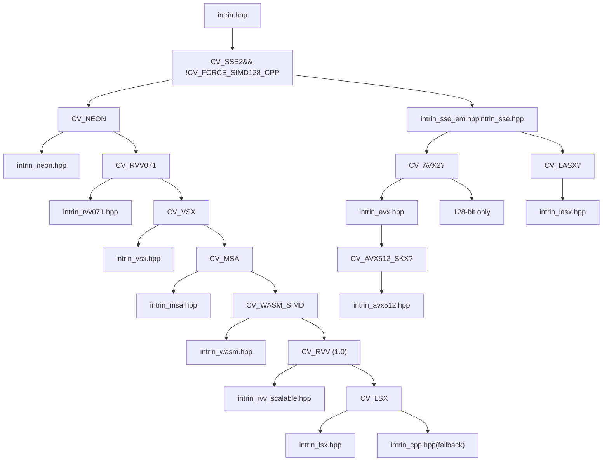
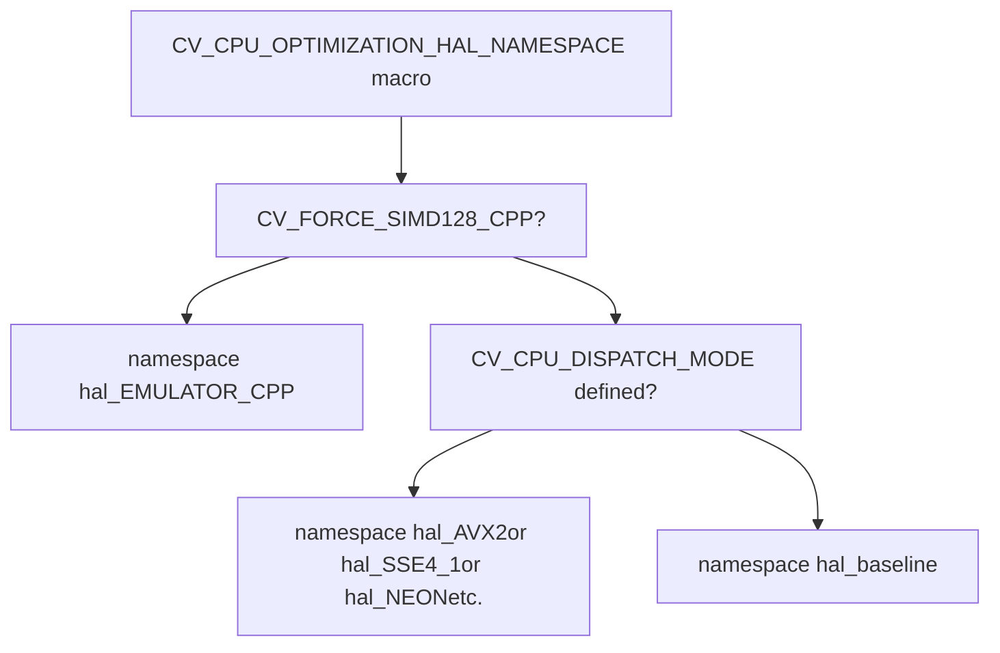
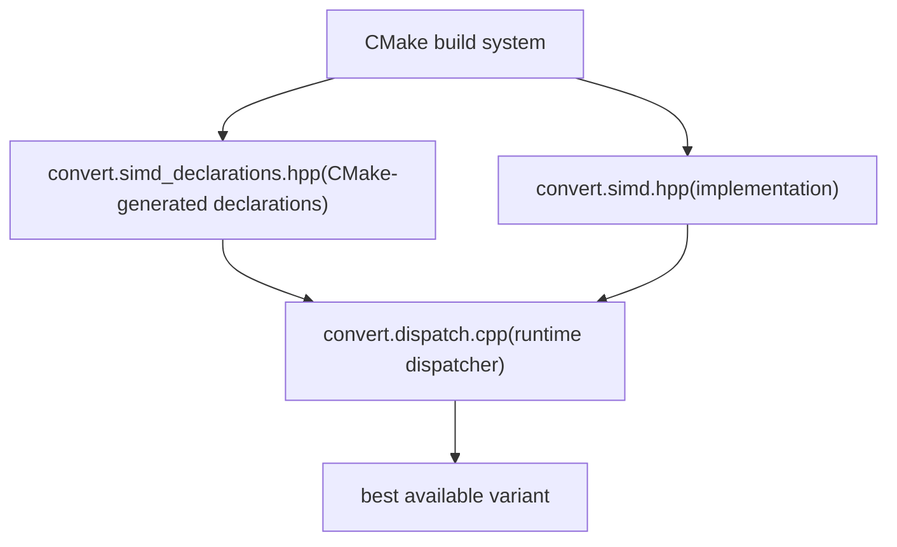
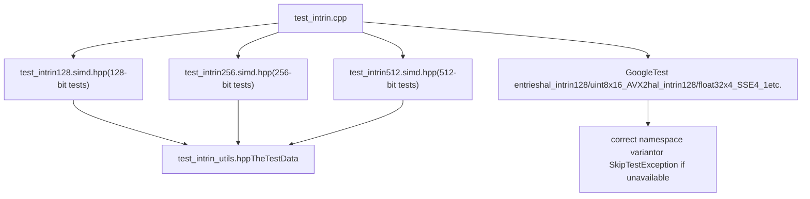
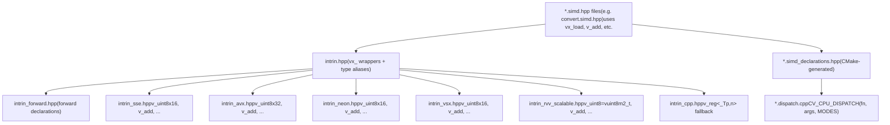

# SIMD 内在函数与 CPU 分发

相关源文件

-   [cmake/checks/cpu\_rvv.cpp](https://github.com/opencv/opencv/blob/91c78f50/cmake/checks/cpu_rvv.cpp)
-   [cmake/checks/cpu\_vsx\_asm.cpp](https://github.com/opencv/opencv/blob/91c78f50/cmake/checks/cpu_vsx_asm.cpp)
-   [modules/core/include/opencv2/core/hal/intrin.hpp](https://github.com/opencv/opencv/blob/91c78f50/modules/core/include/opencv2/core/hal/intrin.hpp)
-   [modules/core/include/opencv2/core/hal/intrin\_avx.hpp](https://github.com/opencv/opencv/blob/91c78f50/modules/core/include/opencv2/core/hal/intrin_avx.hpp)
-   [modules/core/include/opencv2/core/hal/intrin\_avx512.hpp](https://github.com/opencv/opencv/blob/91c78f50/modules/core/include/opencv2/core/hal/intrin_avx512.hpp)
-   [modules/core/include/opencv2/core/hal/intrin\_cpp.hpp](https://github.com/opencv/opencv/blob/91c78f50/modules/core/include/opencv2/core/hal/intrin_cpp.hpp)
-   [modules/core/include/opencv2/core/hal/intrin\_lasx.hpp](https://github.com/opencv/opencv/blob/91c78f50/modules/core/include/opencv2/core/hal/intrin_lasx.hpp)
-   [modules/core/include/opencv2/core/hal/intrin\_lsx.hpp](https://github.com/opencv/opencv/blob/91c78f50/modules/core/include/opencv2/core/hal/intrin_lsx.hpp)
-   [modules/core/include/opencv2/core/hal/intrin\_math.hpp](https://github.com/opencv/opencv/blob/91c78f50/modules/core/include/opencv2/core/hal/intrin_math.hpp)
-   [modules/core/include/opencv2/core/hal/intrin\_msa.hpp](https://github.com/opencv/opencv/blob/91c78f50/modules/core/include/opencv2/core/hal/intrin_msa.hpp)
-   [modules/core/include/opencv2/core/hal/intrin\_neon.hpp](https://github.com/opencv/opencv/blob/91c78f50/modules/core/include/opencv2/core/hal/intrin_neon.hpp)
-   [modules/core/include/opencv2/core/hal/intrin\_rvv071.hpp](https://github.com/opencv/opencv/blob/91c78f50/modules/core/include/opencv2/core/hal/intrin_rvv071.hpp)
-   [modules/core/include/opencv2/core/hal/intrin\_rvv\_scalable.hpp](https://github.com/opencv/opencv/blob/91c78f50/modules/core/include/opencv2/core/hal/intrin_rvv_scalable.hpp)
-   [modules/core/include/opencv2/core/hal/intrin\_sse.hpp](https://github.com/opencv/opencv/blob/91c78f50/modules/core/include/opencv2/core/hal/intrin_sse.hpp)
-   [modules/core/include/opencv2/core/hal/intrin\_vsx.hpp](https://github.com/opencv/opencv/blob/91c78f50/modules/core/include/opencv2/core/hal/intrin_vsx.hpp)
-   [modules/core/include/opencv2/core/hal/intrin\_wasm.hpp](https://github.com/opencv/opencv/blob/91c78f50/modules/core/include/opencv2/core/hal/intrin_wasm.hpp)
-   [modules/core/include/opencv2/core/vsx\_utils.hpp](https://github.com/opencv/opencv/blob/91c78f50/modules/core/include/opencv2/core/vsx_utils.hpp)
-   [modules/core/src/convert.dispatch.cpp](https://github.com/opencv/opencv/blob/91c78f50/modules/core/src/convert.dispatch.cpp)
-   [modules/core/src/convert.simd.hpp](https://github.com/opencv/opencv/blob/91c78f50/modules/core/src/convert.simd.hpp)
-   [modules/core/src/convert\_scale.simd.hpp](https://github.com/opencv/opencv/blob/91c78f50/modules/core/src/convert_scale.simd.hpp)
-   [modules/core/src/count\_non\_zero.simd.hpp](https://github.com/opencv/opencv/blob/91c78f50/modules/core/src/count_non_zero.simd.hpp)
-   [modules/core/src/sum.simd.hpp](https://github.com/opencv/opencv/blob/91c78f50/modules/core/src/sum.simd.hpp)
-   [modules/core/test/test\_intrin.cpp](https://github.com/opencv/opencv/blob/91c78f50/modules/core/test/test_intrin.cpp)
-   [modules/core/test/test\_intrin256.simd.hpp](https://github.com/opencv/opencv/blob/91c78f50/modules/core/test/test_intrin256.simd.hpp)
-   [modules/core/test/test\_intrin\_utils.hpp](https://github.com/opencv/opencv/blob/91c78f50/modules/core/test/test_intrin_utils.hpp)
-   [platforms/linux/riscv64-clang.toolchain.cmake](https://github.com/opencv/opencv/blob/91c78f50/platforms/linux/riscv64-clang.toolchain.cmake)
-   [platforms/linux/riscv64-gcc.toolchain.cmake](https://github.com/opencv/opencv/blob/91c78f50/platforms/linux/riscv64-gcc.toolchain.cmake)

## 目标与范围

本页覆盖 OpenCV core 模块中两个相关系统：

1.  **Universal Intrinsics** —— 一个 C++ API（`v_*` / `vx_*` 函数与类型），在统一接口下抽象不同平台的 SIMD 指令集（SSE、AVX2、NEON、VSX、RVV 等）。
2.  **CPU Dispatch** —— 构建期与运行期联动机制：将同一逻辑的多个 SIMD 专用代码路径编译进同一二进制，并在运行时根据 CPUID 选择最佳实现。

关于运行时 CPU 特性检测（`cv::checkHardwareSupport`、`cv::getCPUFeaturesLine`）请参见 [系统工具与并行处理](/opencv/opencv/3.3-system-utilities-and-parallel-processing)。关于 OpenCL GPU 加速请参见 [OpenCL 加速](/opencv/opencv/3.2-opencl-acceleration-and-transparent-gpu-execution)。

---

## 文件组织

所有 universal intrinsics 头文件位于 `modules/core/include/opencv2/core/hal/`。入口为 `intrin.hpp`，它会为目标架构选择正确后端。

```
modules/core/include/opencv2/core/hal/
├── intrin.hpp              ← top-level include; backend selector
├── intrin_forward.hpp      ← forward declarations for vx_ wrappers
├── intrin_cpp.hpp          ← portable C++ fallback (scalar emulation)
├── intrin_sse.hpp          ← x86 SSE/SSE2/SSE4.x (128-bit)
├── intrin_sse_em.hpp       ← SSE emulation helpers
├── intrin_avx.hpp          ← x86 AVX2 (256-bit)
├── intrin_avx512.hpp       ← x86 AVX-512 (512-bit)
├── intrin_neon.hpp         ← ARM NEON (128-bit)
├── intrin_vsx.hpp          ← PowerPC VSX (128-bit)
├── intrin_msa.hpp          ← MIPS MSA (128-bit)
├── intrin_wasm.hpp         ← WebAssembly SIMD (128-bit)
├── intrin_rvv071.hpp       ← RISC-V RVV 0.7.1 fixed-length (128-bit)
├── intrin_rvv_scalable.hpp ← RISC-V RVV 1.0 scalable
├── intrin_lsx.hpp          ← LoongArch LSX (128-bit)
├── intrin_lasx.hpp         ← LoongArch LASX (256-bit)
└── intrin_math.hpp         ← transcendental math (exp, log, sin, cos)
```
来源： [modules/core/include/opencv2/core/hal/intrin.hpp1-300](https://github.com/opencv/opencv/blob/91c78f50/modules/core/include/opencv2/core/hal/intrin.hpp#L1-L300)

---

## Universal Intrinsics 层

### 后端选择

`intrin.hpp` 通过一串 `#if` 预处理判断精确选择一个 128-bit 后端，并可在其上叠加 256-bit（AVX2 / LASX）与 512-bit（AVX-512）支持。

**图：`intrin.hpp` 后端选择逻辑**


来源： [modules/core/include/opencv2/core/hal/intrin.hpp222-298](https://github.com/opencv/opencv/blob/91c78f50/modules/core/include/opencv2/core/hal/intrin.hpp#L222-L298)

---

### 后端汇总

| Backend File | Architecture | Register Width | Guard Macro |
| --- | --- | --- | --- |
| `intrin_sse.hpp` | x86 SSE/SSE4.x | 128-bit | `CV_SSE2` |
| `intrin_avx.hpp` | x86 AVX2 | 256-bit | `CV_AVX2` |
| `intrin_avx512.hpp` | x86 AVX-512 | 512-bit | `CV_AVX512_SKX` |
| `intrin_neon.hpp` | ARM (AArch32/AArch64) | 128-bit | `CV_NEON` |
| `intrin_vsx.hpp` | PowerPC VSX | 128-bit | `CV_VSX` |
| `intrin_msa.hpp` | MIPS MSA | 128-bit | `CV_MSA` |
| `intrin_wasm.hpp` | WebAssembly SIMD | 128-bit | `CV_WASM_SIMD` |
| `intrin_rvv071.hpp` | RISC-V RVV 0.7.1 | 128-bit (fixed) | `CV_RVV071` |
| `intrin_rvv_scalable.hpp` | RISC-V RVV 1.0 | Scalable (VLA) | `CV_RVV` |
| `intrin_lsx.hpp` | LoongArch LSX | 128-bit | `CV_LSX` |
| `intrin_lasx.hpp` | LoongArch LASX | 256-bit | `CV_LASX` |
| `intrin_cpp.hpp` | All (scalar emulation) | 128-bit emulated | fallback |

来源： [modules/core/include/opencv2/core/hal/intrin.hpp222-298](https://github.com/opencv/opencv/blob/91c78f50/modules/core/include/opencv2/core/hal/intrin.hpp#L222-L298) [modules/core/include/opencv2/core/hal/intrin\_cpp.hpp84-105](https://github.com/opencv/opencv/blob/91c78f50/modules/core/include/opencv2/core/hal/intrin_cpp.hpp#L84-L105)

---

## 向量寄存器类型

### 固定宽度类型

每个后端都定义了一组固定宽度结构体。对 128-bit 寄存器，命名形式为 `v_<signedness><element_bits>x<lanes>`。

| Type | Element | Lanes (128-bit) | SSE backing field | NEON backing field |
| --- | --- | --- | --- | --- |
| `v_uint8x16` | `uchar` | 16 | `__m128i` | `uint8x16_t` |
| `v_int8x16` | `schar` | 16 | `__m128i` | `int8x16_t` |
| `v_uint16x8` | `ushort` | 8 | `__m128i` | `uint16x8_t` |
| `v_int16x8` | `short` | 8 | `__m128i` | `int16x8_t` |
| `v_uint32x4` | `unsigned` | 4 | `__m128i` | `uint32x4_t` |
| `v_int32x4` | `int` | 4 | `__m128i` | `int32x4_t` |
| `v_uint64x2` | `uint64` | 2 | `__m128i` | `uint64x2_t` |
| `v_int64x2` | `int64` | 2 | `__m128i` | `int64x2_t` |
| `v_float32x4` | `float` | 4 | `__m128` | `float32x4_t` |
| `v_float64x2` | `double` | 2 | `__m128d` | `float64x2_t` |

256-bit AVX2 类型也遵循 `v_<type>x<lanes>` 模式：`v_uint8x32`、`v_float32x8` 等。512-bit AVX-512 类型为 `v_uint8x64`、`v_float32x16` 等。

纯 C++ 回退路径通过通用模板 `v_reg<_Tp, n>` 定义全部类型。

来源： [modules/core/include/opencv2/core/hal/intrin\_cpp.hpp388-456](https://github.com/opencv/opencv/blob/91c78f50/modules/core/include/opencv2/core/hal/intrin_cpp.hpp#L388-L456) [modules/core/include/opencv2/core/hal/intrin\_sse.hpp72-324](https://github.com/opencv/opencv/blob/91c78f50/modules/core/include/opencv2/core/hal/intrin_sse.hpp#L72-L324) [modules/core/include/opencv2/core/hal/intrin\_neon.hpp148-379](https://github.com/opencv/opencv/blob/91c78f50/modules/core/include/opencv2/core/hal/intrin_neon.hpp#L148-L379)

### 宽度无关类型别名

`intrin.hpp` 定义了无后缀短名（`v_uint8`、`v_float32` 等），作为对当前可用最宽固定宽度类型的 `typedef` 别名：

| Alias | On SSE2 only | On AVX2 | On AVX-512 | On RVV scalable |
| --- | --- | --- | --- | --- |
| `v_uint8` | `v_uint8x16` | `v_uint8x32` | `v_uint8x64` | `vuint8m2_t` |
| `v_float32` | `v_float32x4` | `v_float32x8` | `v_float32x16` | `vfloat32m2_t` |
| `v_int32` | `v_int32x4` | `v_int32x8` | `v_int32x16` | `vint32m2_t` |

在可伸缩 RISC-V（RVV 1.0）上，这些类型是原生 RVV 类型（`vuint8m2_t` 等），lane 数在运行时确定。

来源： [modules/core/include/opencv2/core/hal/intrin.hpp300-450](https://github.com/opencv/opencv/blob/91c78f50/modules/core/include/opencv2/core/hal/intrin.hpp#L300-L450) [modules/core/include/opencv2/core/hal/intrin\_rvv\_scalable.hpp35-48](https://github.com/opencv/opencv/blob/91c78f50/modules/core/include/opencv2/core/hal/intrin_rvv_scalable.hpp#L35-L48)

### `VTraits<R>` 模板

`VTraits<R>` 为任意向量寄存器类型 `R` 提供类型元信息。它是编写跨固定宽度与可伸缩类型通用 SIMD 代码的核心手段。

| Member | Meaning |
| --- | --- |
| `VTraits<R>::lane_type` | 标量元素类型（如 `uchar`、`float`） |
| `VTraits<R>::vlanes()` | 有效 lane 数（可伸缩类型为运行时值） |
| `VTraits<R>::max_nlanes` | 编译期可达的最大 lane 数 |

对固定宽度类型，`vlanes()` 始终等于 `max_nlanes`。对 RVV 可伸缩类型，`vlanes()` 会调用 `__riscv_vsetvlmax_*()`。

`modules/core/test/test_intrin_utils.hpp` 中的测试框架广泛使用 `VTraits<R>::vlanes()` 与 `VTraits<R>::lane_type` 编写后端无关测试。

### `V_TypeTraits<_Tp>` 标量 traits

`V_TypeTraits<_Tp>`（定义于 `intrin.hpp`）将标量 C++ 类型映射到关联类型：其有符号整数等价类型（`int_type`）、无符号形式（`uint_type`）、下一档更宽类型（`w_type`）以及累加类型（`sum_type`）。这被 `v_dotprod`、`v_absdiff` 等操作使用。

来源： [modules/core/include/opencv2/core/hal/intrin.hpp109-173](https://github.com/opencv/opencv/blob/91c78f50/modules/core/include/opencv2/core/hal/intrin.hpp#L109-L173) [modules/core/test/test\_intrin\_utils.hpp40-161](https://github.com/opencv/opencv/blob/91c78f50/modules/core/test/test_intrin_utils.hpp#L40-L161)

---

## API 总览

**图：Universal Intrinsics API 分类与关键函数**

```mermaid
flowchart TD
    API["Universal Intrinsics API"]
    LS["Load / Store"]
    ARITH["Arithmetic"]
    CMP["Comparison"]
    LOGIC["Bitwise Logic"]
    REDUCE["Reduce"]
    REORDER["Value Reordering"]
    CONV["Conversions"]
    MATH["Float Math"]
    LS1["vx_loadvx_load_alignedvx_load_lowvx_load_halvesvx_load_expandv_storev_store_alignedv_store_highv_store_low"]
    A1["v_add / v_sub / v_mul / v_divv_add_wrap / v_sub_wrap / v_mul_wrapv_mul_expandv_dotprod / v_dotprod_fastv_dotprod_expand"]
    C1["v_eq / v_nev_gt / v_gev_lt / v_le"]
    L1["v_and / v_orv_xor / v_notv_shl / v_shr"]
    R1["v_reduce_minv_reduce_maxv_reduce_sumv_reduce_sadv_signmaskv_check_all / v_check_any"]
    RO1["v_expand / v_expand_low / v_expand_highv_pack / v_pack_uv_zip / v_recombinev_load_deinterleavev_store_interleavev_reverse / v_extractv_select"]
    CV1["v_round / v_floor / v_ceil / v_truncv_cvt_f32 / v_cvt_f64v_reinterpret_as_u8v_reinterpret_as_f32 ..."]
    M1["v_sqrt / v_invsqrtv_abs / v_absdiff / v_absdiffsv_min / v_maxv_exp / v_logv_sin / v_cos / v_erfv_matmul / v_transpose4x4"]

    API --> LS
    API --> ARITH
    API --> CMP
    API --> LOGIC
    API --> REDUCE
    API --> REORDER
    API --> CONV
    API --> MATH
    LS --> LS1
    ARITH --> A1
    CMP --> C1
    LOGIC --> L1
    REDUCE --> R1
    REORDER --> RO1
    CONV --> CV1
    MATH --> M1
```


来源： [modules/core/include/opencv2/core/hal/intrin\_cpp.hpp168-385](https://github.com/opencv/opencv/blob/91c78f50/modules/core/include/opencv2/core/hal/intrin_cpp.hpp#L168-L385) [modules/core/include/opencv2/core/hal/intrin\_math.hpp1-100](https://github.com/opencv/opencv/blob/91c78f50/modules/core/include/opencv2/core/hal/intrin_math.hpp#L1-L100)

### 加载与存储

| Function | Behavior |
| --- | --- |
| `vx_load(ptr)` | 非对齐加载到当前最宽寄存器 |
| `vx_load_aligned(ptr)` | 对齐加载 |
| `vx_load_low(ptr)` | 只加载低半部分，高半置零 |
| `vx_load_halves(ptr0, ptr1)` | 低半从 `ptr0`、高半从 `ptr1` 加载 |
| `vx_load_expand(ptr)` | 加载窄类型并逐元素扩宽 |
| `vx_load_expand_q(ptr)` | 从最窄类型加载并扩展为 4 倍宽 |
| `v_store(ptr, v)` | 非对齐存储 |
| `v_store_aligned(ptr, v)` | 对齐存储 |
| `v_store_aligned_nocache(ptr, v)` | 非时序存储 |
| `v_store_low(ptr, v)` | 存储低半部分 |
| `v_store_high(ptr, v)` | 存储高半部分 |

`v_store` 还可接收定义在 `intrin.hpp` 中的 `hal::StoreMode` 参数（`STORE_UNALIGNED`、`STORE_ALIGNED`、`STORE_ALIGNED_NOCACHE`）。

### 交错 / 反交错

`v_load_deinterleave` 与 `v_store_interleave` 支持 2、3、4 通道打包内存（如 RGB / RGBA 像素）。这在 NEON 上可直接映射到 `vld2q_*` / `vst2q_*`，其他平台则使用等效实现。

### 操作适用性矩阵

并非所有操作都适用于所有元素类型。关键约束如下：

-   **位移**（`v_shl`、`v_shr`）：仅支持 16-bit 及以上整数
-   **`dotprod`**：有符号 16-bit → int32，有符号 32-bit → int64
-   **`mul_expand`**：支持至 32-bit 的整数
-   **`v_sqrt`、`v_abs`**：仅浮点类型；整数绝对值使用 `v_abs`
-   **`v_float64`**：需要 `CV_SIMD128_64F` 或 `CV_SIMD_SCALABLE_64F`（32-bit ARM NEON 与 WASM 不可用）

来源： [modules/core/include/opencv2/core/hal/intrin\_cpp.hpp300-386](https://github.com/opencv/opencv/blob/91c78f50/modules/core/include/opencv2/core/hal/intrin_cpp.hpp#L300-L386) [modules/core/test/test\_intrin\_utils.hpp503-1090](https://github.com/opencv/opencv/blob/91c78f50/modules/core/test/test_intrin_utils.hpp#L503-L1090)

---

## HAL 命名空间与多宽度共存

每个 SIMD 后端都把定义包在与当前编译模式绑定的命名空间中。该机制由 `CV_CPU_OPTIMIZATION_HAL_NAMESPACE` 与 `CV_CPU_OPTIMIZATION_HAL_NAMESPACE_BEGIN/END` 宏管理。

**图：按编译模式分配 HAL 命名空间**


当某个 `.simd.hpp` 文件按 AVX2 编译时，其中类型与函数进入 `cv::hal_AVX2`。按 SSE4_1 编译时则进入 `cv::hal_SSE4_1`。两套实现可在同一二进制中共存，因为命名空间不同。用户代码中的 `vx_load`、`v_store` 等通过 `using namespace CV_CPU_OPTIMIZATION_HAL_NAMESPACE` 解析到当前编译命名空间。

来源： [modules/core/include/opencv2/core/hal/intrin.hpp177-209](https://github.com/opencv/opencv/blob/91c78f50/modules/core/include/opencv2/core/hal/intrin.hpp#L177-L209)

---

## CPU 分发机制

CPU 分发让一个二进制可同时包含同一函数的多个 SIMD 实现，并在运行时选择硬件支持的最佳版本。

### 三文件模式

| File | Role |
| --- | --- |
| `*.simd.hpp` | 包含 SIMD 实现；使用 `CV_CPU_OPTIMIZATION_NAMESPACE_BEGIN/END` |
| `*.simd_declarations.hpp` | CMake 自动生成；声明各已编译变体函数签名 |
| `*.dispatch.cpp` | 同时包含上述头文件；使用 `CV_CPU_DISPATCH` 进行运行时选择 |

**图：CPU 分发文件关系**


### 实现文件（`*.simd.hpp`）

实现代码包裹在 `CV_CPU_OPTIMIZATION_NAMESPACE_BEGIN` 与 `CV_CPU_OPTIMIZATION_NAMESPACE_END` 之间。CMake 会为 `CMakeLists.txt` 中列出的每个 SIMD 目标重复编译该文件。每次编译都将 `CV_CPU_DISPATCH_MODE` 设为不同值（如 `AVX2`、`SSE4_1`），使函数落入不同命名空间。

来自 `modules/core/src/convert.simd.hpp`：

```
CV_CPU_OPTIMIZATION_NAMESPACE_BEGIN

void cvt16f32f(const hfloat* src, float* dst, int len);
void cvt32f16f(const float* src, hfloat* dst, int len);
// ... implementations using universal intrinsics ...

CV_CPU_OPTIMIZATION_NAMESPACE_END
```
### 分发文件（`*.dispatch.cpp`）

分发器会包含自动生成的声明头，并使用 `CV_CPU_DISPATCH` 宏生成运行时分发链。`CV_CPU_DISPATCH_MODES_ALL` 由 CMake 根据实际编译出的 SIMD 模式定义。

来自 `modules/core/src/convert.dispatch.cpp`：

```
#include "convert.simd.hpp"
#include "convert.simd_declarations.hpp"
// CV_CPU_DISPATCH_MODES_ALL = AVX2, BASELINE (set by CMake)

namespace cv { namespace hal {

void cvt16f32f(const hfloat* src, float* dst, int len)
{
    CV_CPU_DISPATCH(cvt16f32f, (src, dst, len), CV_CPU_DISPATCH_MODES_ALL);
}
```
`CV_CPU_DISPATCH` 会展开成一串运行时 CPUID 检查：按列表顺序尝试各模式，调用首个满足要求的实现。列表最后一项始终是 `BASELINE`，保证可用。

来源： [modules/core/src/convert.dispatch.cpp1-30](https://github.com/opencv/opencv/blob/91c78f50/modules/core/src/convert.dispatch.cpp#L1-L30) [modules/core/src/convert.simd.hpp1-35](https://github.com/opencv/opencv/blob/91c78f50/modules/core/src/convert.simd.hpp#L1-L35)

### 编译期特性宏

在 `.simd.hpp` 文件内部，还可使用更细粒度的特性宏：

| Macro | Meaning |
| --- | --- |
| `CV_SIMD128` | 具备任意 128-bit SIMD |
| `CV_SIMD128_64F` | 128-bit 寄存器具备 64-bit 浮点 lane |
| `CV_SIMD256` | 具备 256-bit（AVX2） |
| `CV_SIMD512` | 具备 512-bit（AVX-512） |
| `CV_SIMD_SCALABLE` | 具备可伸缩向量长度（RVV 1.0） |
| `CV_SIMD_SCALABLE_64F` | 可伸缩寄存器支持 64-bit 浮点 |

来源： [modules/core/include/opencv2/core/hal/intrin\_cpp.hpp55-70](https://github.com/opencv/opencv/blob/91c78f50/modules/core/include/opencv2/core/hal/intrin_cpp.hpp#L55-L70) [modules/core/include/opencv2/core/hal/intrin\_sse.hpp51-53](https://github.com/opencv/opencv/blob/91c78f50/modules/core/include/opencv2/core/hal/intrin_sse.hpp#L51-L53) [modules/core/include/opencv2/core/hal/intrin\_rvv\_scalable.hpp32-33](https://github.com/opencv/opencv/blob/91c78f50/modules/core/include/opencv2/core/hal/intrin_rvv_scalable.hpp#L32-L33)

### 实际示例：`count_non_zero`

`modules/core/src/count_non_zero.simd.hpp` 是更简洁的真实示例：函数在 `CV_CPU_OPTIMIZATION_NAMESPACE_BEGIN` 中实现，并使用 `v_eq`、`v_check_any` 与 `v_reduce_sum`。

来源： [modules/core/src/count\_non\_zero.simd.hpp1-50](https://github.com/opencv/opencv/blob/91c78f50/modules/core/src/count_non_zero.simd.hpp#L1-L50)

---

## 平台特定工具

### VSX（PowerPC）

`modules/core/include/opencv2/core/vsx_utils.hpp` 提供了 PowerPC 专用 `typedef`（如 `vec_uchar16`、`vec_float4`、`vec_dword2`）和包含 `intrin_vsx.hpp` 前所需的编译器兼容宏。它还包含对 GCC < 8 的 VSX 缺陷绕过（内联汇编回退）。

### RISC-V RVV 工具链

在 RISC-V 上进行 RVV 交叉编译需要特定 LLVM 或 GCC 工具链。对应 toolchain 文件位于：

-   `platforms/linux/riscv64-clang.toolchain.cmake`
-   `platforms/linux/riscv64-gcc.toolchain.cmake`

CMake 通过 `cmake/checks/cpu_rvv.cpp` 探测编译器是否支持 RVV intrinsics。

来源： [modules/core/include/opencv2/core/vsx\_utils.hpp1-130](https://github.com/opencv/opencv/blob/91c78f50/modules/core/include/opencv2/core/vsx_utils.hpp#L1-L130) [platforms/linux/riscv64-clang.toolchain.cmake1-20](https://github.com/opencv/opencv/blob/91c78f50/platforms/linux/riscv64-clang.toolchain.cmake#L1-L20) [cmake/checks/cpu\_rvv.cpp1-30](https://github.com/opencv/opencv/blob/91c78f50/cmake/checks/cpu_rvv.cpp#L1-L30)

---

## Intrinsics 测试

### 测试结构

`modules/core/test/test_intrin.cpp` 是主测试驱动。它通过分发机制编译 `test_intrin128.simd.hpp`、`test_intrin256.simd.hpp`、`test_intrin512.simd.hpp` 的多个变体，并将每个变体作为独立 GoogleTest 运行。

`modules/core/test/test_intrin_utils.hpp` 包含后端无关模板 `TheTest<R>`，其为每一类操作提供测试方法。每个方法都使用 `VTraits<R>::vlanes()` 与 `Data<R>`（保存 `lane_type` 数组的辅助结构）来确保跨后端可移植。

**图：`test_intrin.cpp` 分发与测试结构**


### `Data<R>` 与 `TheTest<R>`

`Data<R>` 是轻量数组包装器，它：

-   通过 `vx_load` / `v_store` 在寄存器类型 `R` 与数组之间转换
-   通过 `operator[]` 提供元素访问
-   以 `VTraits<R>::max_nlanes` 作为编译期存储尺寸
-   以 `VTraits<R>::vlanes()` 作为迭代边界（对可伸缩类型正确）

`TheTest<R>` 为每类操作提供一个测试方法：`test_loadstore()`、`test_addsub()`、`test_mul()`、`test_interleave()`、`test_pack()`、`test_reduce()`、`test_mask()`、`test_dotprod()` 等。每个方法构造 `Data<R>`，调用对应 `v_*` intrinsic，并通过 `EXPECT_EQ` 断言结果。

可伸缩宽度（RVV）intrinsics 的测试也复用同一套 `TheTest<R>` 框架，并通过 `#if CV_SIMD_SCALABLE` 条件启用。

来源： [modules/core/test/test\_intrin.cpp1-130](https://github.com/opencv/opencv/blob/91c78f50/modules/core/test/test_intrin.cpp#L1-L130) [modules/core/test/test\_intrin\_utils.hpp40-500](https://github.com/opencv/opencv/blob/91c78f50/modules/core/test/test_intrin_utils.hpp#L40-L500)

---

## 总结：层次关系


来源： [modules/core/include/opencv2/core/hal/intrin.hpp1-500](https://github.com/opencv/opencv/blob/91c78f50/modules/core/include/opencv2/core/hal/intrin.hpp#L1-L500) [modules/core/src/convert.dispatch.cpp1-50](https://github.com/opencv/opencv/blob/91c78f50/modules/core/src/convert.dispatch.cpp#L1-L50) [modules/core/src/convert.simd.hpp1-35](https://github.com/opencv/opencv/blob/91c78f50/modules/core/src/convert.simd.hpp#L1-L35)
