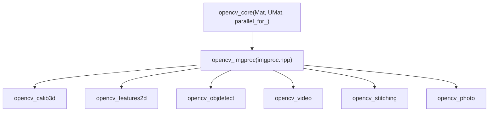
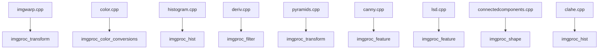
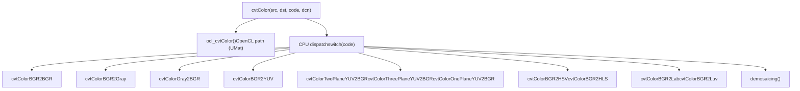

# 图像处理（imgproc）

相关源文件

-   [cmake/vars/EnableModeVars.cmake](https://github.com/opencv/opencv/blob/91c78f50/cmake/vars/EnableModeVars.cmake)
-   [cmake/vars/OPENCV\_SEMIHOSTING.cmake](https://github.com/opencv/opencv/blob/91c78f50/cmake/vars/OPENCV_SEMIHOSTING.cmake)
-   [doc/opencv.bib](https://github.com/opencv/opencv/blob/91c78f50/doc/opencv.bib)
-   [modules/calib3d/doc/calib3d.bib](https://github.com/opencv/opencv/blob/91c78f50/modules/calib3d/doc/calib3d.bib)
-   [modules/calib3d/doc/solvePnP.markdown](https://github.com/opencv/opencv/blob/91c78f50/modules/calib3d/doc/solvePnP.markdown?plain=1)
-   [modules/calib3d/include/opencv2/calib3d.hpp](https://github.com/opencv/opencv/blob/91c78f50/modules/calib3d/include/opencv2/calib3d.hpp)
-   [modules/calib3d/perf/perf\_pnp.cpp](https://github.com/opencv/opencv/blob/91c78f50/modules/calib3d/perf/perf_pnp.cpp)
-   [modules/calib3d/perf/perf\_stereosgbm.cpp](https://github.com/opencv/opencv/blob/91c78f50/modules/calib3d/perf/perf_stereosgbm.cpp)
-   [modules/calib3d/src/ap3p.cpp](https://github.com/opencv/opencv/blob/91c78f50/modules/calib3d/src/ap3p.cpp)
-   [modules/calib3d/src/ap3p.h](https://github.com/opencv/opencv/blob/91c78f50/modules/calib3d/src/ap3p.h)
-   [modules/calib3d/src/dls.cpp](https://github.com/opencv/opencv/blob/91c78f50/modules/calib3d/src/dls.cpp)
-   [modules/calib3d/src/dls.h](https://github.com/opencv/opencv/blob/91c78f50/modules/calib3d/src/dls.h)
-   [modules/calib3d/src/epnp.cpp](https://github.com/opencv/opencv/blob/91c78f50/modules/calib3d/src/epnp.cpp)
-   [modules/calib3d/src/epnp.h](https://github.com/opencv/opencv/blob/91c78f50/modules/calib3d/src/epnp.h)
-   [modules/calib3d/src/ippe.cpp](https://github.com/opencv/opencv/blob/91c78f50/modules/calib3d/src/ippe.cpp)
-   [modules/calib3d/src/p3p.cpp](https://github.com/opencv/opencv/blob/91c78f50/modules/calib3d/src/p3p.cpp)
-   [modules/calib3d/src/p3p.h](https://github.com/opencv/opencv/blob/91c78f50/modules/calib3d/src/p3p.h)
-   [modules/calib3d/src/solvepnp.cpp](https://github.com/opencv/opencv/blob/91c78f50/modules/calib3d/src/solvepnp.cpp)
-   [modules/calib3d/test/test\_solvepnp\_ransac.cpp](https://github.com/opencv/opencv/blob/91c78f50/modules/calib3d/test/test_solvepnp_ransac.cpp)
-   [modules/core/perf/perf\_mat.cpp](https://github.com/opencv/opencv/blob/91c78f50/modules/core/perf/perf_mat.cpp)
-   [modules/core/src/opencl/copyset.cl](https://github.com/opencv/opencv/blob/91c78f50/modules/core/src/opencl/copyset.cl)
-   [modules/features2d/perf/perf\_batchDistance.cpp](https://github.com/opencv/opencv/blob/91c78f50/modules/features2d/perf/perf_batchDistance.cpp)
-   [modules/imgcodecs/test/test\_main.cpp](https://github.com/opencv/opencv/blob/91c78f50/modules/imgcodecs/test/test_main.cpp)
-   [modules/imgproc/doc/colors.markdown](https://github.com/opencv/opencv/blob/91c78f50/modules/imgproc/doc/colors.markdown?plain=1)
-   [modules/imgproc/doc/pics/Bayer\_patterns.png](https://github.com/opencv/opencv/blob/91c78f50/modules/imgproc/doc/pics/Bayer_patterns.png)
-   [modules/imgproc/include/opencv2/imgproc.hpp](https://github.com/opencv/opencv/blob/91c78f50/modules/imgproc/include/opencv2/imgproc.hpp)
-   [modules/imgproc/perf/opencl/perf\_color.cpp](https://github.com/opencv/opencv/blob/91c78f50/modules/imgproc/perf/opencl/perf_color.cpp)
-   [modules/imgproc/perf/opencl/perf\_imgwarp.cpp](https://github.com/opencv/opencv/blob/91c78f50/modules/imgproc/perf/opencl/perf_imgwarp.cpp)
-   [modules/imgproc/perf/opencl/perf\_moments.cpp](https://github.com/opencv/opencv/blob/91c78f50/modules/imgproc/perf/opencl/perf_moments.cpp)
-   [modules/imgproc/perf/opencl/perf\_pyramid.cpp](https://github.com/opencv/opencv/blob/91c78f50/modules/imgproc/perf/opencl/perf_pyramid.cpp)
-   [modules/imgproc/src/canny.cpp](https://github.com/opencv/opencv/blob/91c78f50/modules/imgproc/src/canny.cpp)
-   [modules/imgproc/src/ccl\_bolelli\_forest.inc.hpp](https://github.com/opencv/opencv/blob/91c78f50/modules/imgproc/src/ccl_bolelli_forest.inc.hpp)
-   [modules/imgproc/src/ccl\_bolelli\_forest\_firstline.inc.hpp](https://github.com/opencv/opencv/blob/91c78f50/modules/imgproc/src/ccl_bolelli_forest_firstline.inc.hpp)
-   [modules/imgproc/src/ccl\_bolelli\_forest\_lastline.inc.hpp](https://github.com/opencv/opencv/blob/91c78f50/modules/imgproc/src/ccl_bolelli_forest_lastline.inc.hpp)
-   [modules/imgproc/src/ccl\_bolelli\_forest\_singleline.inc.hpp](https://github.com/opencv/opencv/blob/91c78f50/modules/imgproc/src/ccl_bolelli_forest_singleline.inc.hpp)
-   [modules/imgproc/src/clahe.cpp](https://github.com/opencv/opencv/blob/91c78f50/modules/imgproc/src/clahe.cpp)
-   [modules/imgproc/src/color.cpp](https://github.com/opencv/opencv/blob/91c78f50/modules/imgproc/src/color.cpp)
-   [modules/imgproc/src/connectedcomponents.cpp](https://github.com/opencv/opencv/blob/91c78f50/modules/imgproc/src/connectedcomponents.cpp)
-   [modules/imgproc/src/deriv.cpp](https://github.com/opencv/opencv/blob/91c78f50/modules/imgproc/src/deriv.cpp)
-   [modules/imgproc/src/histogram.cpp](https://github.com/opencv/opencv/blob/91c78f50/modules/imgproc/src/histogram.cpp)
-   [modules/imgproc/src/imgwarp.cpp](https://github.com/opencv/opencv/blob/91c78f50/modules/imgproc/src/imgwarp.cpp)
-   [modules/imgproc/src/lsd.cpp](https://github.com/opencv/opencv/blob/91c78f50/modules/imgproc/src/lsd.cpp)
-   [modules/imgproc/src/min\_enclosing\_convex\_polygon.cpp](https://github.com/opencv/opencv/blob/91c78f50/modules/imgproc/src/min_enclosing_convex_polygon.cpp)
-   [modules/imgproc/src/opencl/bilateral.cl](https://github.com/opencv/opencv/blob/91c78f50/modules/imgproc/src/opencl/bilateral.cl)
-   [modules/imgproc/src/opencl/clahe.cl](https://github.com/opencv/opencv/blob/91c78f50/modules/imgproc/src/opencl/clahe.cl)
-   [modules/imgproc/src/opencl/covardata.cl](https://github.com/opencv/opencv/blob/91c78f50/modules/imgproc/src/opencl/covardata.cl)
-   [modules/imgproc/src/opencl/filter2DSmall.cl](https://github.com/opencv/opencv/blob/91c78f50/modules/imgproc/src/opencl/filter2DSmall.cl)
-   [modules/imgproc/src/opencl/filterSepCol.cl](https://github.com/opencv/opencv/blob/91c78f50/modules/imgproc/src/opencl/filterSepCol.cl)
-   [modules/imgproc/src/opencl/filterSepRow.cl](https://github.com/opencv/opencv/blob/91c78f50/modules/imgproc/src/opencl/filterSepRow.cl)
-   [modules/imgproc/src/opencl/filterSep\_singlePass.cl](https://github.com/opencv/opencv/blob/91c78f50/modules/imgproc/src/opencl/filterSep_singlePass.cl)
-   [modules/imgproc/src/opencl/filterSmall.cl](https://github.com/opencv/opencv/blob/91c78f50/modules/imgproc/src/opencl/filterSmall.cl)
-   [modules/imgproc/src/opencl/histogram.cl](https://github.com/opencv/opencv/blob/91c78f50/modules/imgproc/src/opencl/histogram.cl)
-   [modules/imgproc/src/opencl/laplacian5.cl](https://github.com/opencv/opencv/blob/91c78f50/modules/imgproc/src/opencl/laplacian5.cl)
-   [modules/imgproc/src/opencl/morph.cl](https://github.com/opencv/opencv/blob/91c78f50/modules/imgproc/src/opencl/morph.cl)
-   [modules/imgproc/src/opencl/pyr\_down.cl](https://github.com/opencv/opencv/blob/91c78f50/modules/imgproc/src/opencl/pyr_down.cl)
-   [modules/imgproc/src/opencl/pyr\_up.cl](https://github.com/opencv/opencv/blob/91c78f50/modules/imgproc/src/opencl/pyr_up.cl)
-   [modules/imgproc/src/opencl/pyramid\_up.cl](https://github.com/opencv/opencv/blob/91c78f50/modules/imgproc/src/opencl/pyramid_up.cl)
-   [modules/imgproc/src/opencl/remap.cl](https://github.com/opencv/opencv/blob/91c78f50/modules/imgproc/src/opencl/remap.cl)
-   [modules/imgproc/src/opencl/resize.cl](https://github.com/opencv/opencv/blob/91c78f50/modules/imgproc/src/opencl/resize.cl)
-   [modules/imgproc/src/opencl/warp\_affine.cl](https://github.com/opencv/opencv/blob/91c78f50/modules/imgproc/src/opencl/warp_affine.cl)
-   [modules/imgproc/src/opencl/warp\_perspective.cl](https://github.com/opencv/opencv/blob/91c78f50/modules/imgproc/src/opencl/warp_perspective.cl)
-   [modules/imgproc/src/opencl/warp\_transform.cl](https://github.com/opencv/opencv/blob/91c78f50/modules/imgproc/src/opencl/warp_transform.cl)
-   [modules/imgproc/src/phasecorr\_iterative.cpp](https://github.com/opencv/opencv/blob/91c78f50/modules/imgproc/src/phasecorr_iterative.cpp)
-   [modules/imgproc/src/pyramids.cpp](https://github.com/opencv/opencv/blob/91c78f50/modules/imgproc/src/pyramids.cpp)
-   [modules/imgproc/test/ocl/test\_color.cpp](https://github.com/opencv/opencv/blob/91c78f50/modules/imgproc/test/ocl/test_color.cpp)
-   [modules/imgproc/test/ocl/test\_filters.cpp](https://github.com/opencv/opencv/blob/91c78f50/modules/imgproc/test/ocl/test_filters.cpp)
-   [modules/imgproc/test/ocl/test\_pyramids.cpp](https://github.com/opencv/opencv/blob/91c78f50/modules/imgproc/test/ocl/test_pyramids.cpp)
-   [modules/imgproc/test/ocl/test\_warp.cpp](https://github.com/opencv/opencv/blob/91c78f50/modules/imgproc/test/ocl/test_warp.cpp)
-   [modules/imgproc/test/test\_connectedcomponents.cpp](https://github.com/opencv/opencv/blob/91c78f50/modules/imgproc/test/test_connectedcomponents.cpp)
-   [modules/imgproc/test/test\_histograms.cpp](https://github.com/opencv/opencv/blob/91c78f50/modules/imgproc/test/test_histograms.cpp)
-   [modules/imgproc/test/test\_imgproc\_umat.cpp](https://github.com/opencv/opencv/blob/91c78f50/modules/imgproc/test/test_imgproc_umat.cpp)
-   [modules/imgproc/test/test\_imgwarp.cpp](https://github.com/opencv/opencv/blob/91c78f50/modules/imgproc/test/test_imgwarp.cpp)
-   [modules/imgproc/test/test\_imgwarp\_strict.cpp](https://github.com/opencv/opencv/blob/91c78f50/modules/imgproc/test/test_imgwarp_strict.cpp)
-   [modules/imgproc/test/test\_ipc.cpp](https://github.com/opencv/opencv/blob/91c78f50/modules/imgproc/test/test_ipc.cpp)
-   [modules/imgproc/test/test\_lsd.cpp](https://github.com/opencv/opencv/blob/91c78f50/modules/imgproc/test/test_lsd.cpp)
-   [modules/imgproc/test/test\_pyramid.cpp](https://github.com/opencv/opencv/blob/91c78f50/modules/imgproc/test/test_pyramid.cpp)
-   [modules/ts/include/opencv2/ts/ocl\_test.hpp](https://github.com/opencv/opencv/blob/91c78f50/modules/ts/include/opencv2/ts/ocl_test.hpp)
-   [modules/videoio/test/test\_main.cpp](https://github.com/opencv/opencv/blob/91c78f50/modules/videoio/test/test_main.cpp)
-   [platforms/semihosting/aarch64-semihosting.toolchain.cmake](https://github.com/opencv/opencv/blob/91c78f50/platforms/semihosting/aarch64-semihosting.toolchain.cmake)
-   [platforms/semihosting/include/aarch64\_semihosting\_port.hpp](https://github.com/opencv/opencv/blob/91c78f50/platforms/semihosting/include/aarch64_semihosting_port.hpp)
-   [samples/cpp/lsd\_lines.cpp](https://github.com/opencv/opencv/blob/91c78f50/samples/cpp/lsd_lines.cpp)

本页概述 `opencv_imgproc` 模块：其功能范围、主要 API 分组、关键枚举以及实现结构。内容涵盖从像素级滤波到结构化形状分析的操作。

关于几何变换的详细内容，请参见 [Geometric Transformations and Image Warping](/opencv/opencv/4.1-geometric-transformations-and-image-warping)。关于滤波与颜色转换细节，请参见 [Filtering and Color Conversion](/opencv/opencv/4.2-filtering-and-color-conversion)。关于阈值、模板匹配与矩，请参见 [Thresholding, Template Matching, and Moments](/opencv/opencv/4.3-thresholding-template-matching-and-moments)。关于绘制与结构分析，请参见 [Drawing, Contours, and Structural Analysis](/opencv/opencv/4.4-drawing-contours-and-structural-analysis)。

---

## 模块结构

`opencv_imgproc` 模块声明于 [modules/imgproc/include/opencv2/imgproc.hpp](https://github.com/opencv/opencv/blob/91c78f50/modules/imgproc/include/opencv2/imgproc.hpp)，并通过 Doxygen 的 `@defgroup` 注解划分为多个具名功能组。所有公开 API 均位于 `cv` 命名空间。

**功能分组（来自 `imgproc.hpp`）：**

| 分组标签 | 说明 |
| --- | --- |
| `imgproc_filter` | 线性与非线性二维滤波、形态学操作 |
| `imgproc_transform` | 几何变换：resize、warp、remap、金字塔 |
| `imgproc_misc` | 阈值、距离变换、洪泛填充、GrabCut |
| `imgproc_color_conversions` | `cvtColor` 与全部 `ColorConversionCodes` |
| `imgproc_colormap` | `applyColorMap` 与 `ColormapTypes` |
| `imgproc_hist` | 直方图计算、均衡化、CLAHE、反向投影 |
| `imgproc_shape` | 轮廓、连通域、凸包、形状匹配 |
| `imgproc_feature` | Hough 变换、Line Segment Detector |
| `imgproc_draw` | 线、矩形、圆、椭圆、文本渲染 |
| `imgproc_object` | 模板匹配 |
| `imgproc_subdiv2d` | `Subdiv2D` – Delaunay 三角剖分 / Voronoi 图 |
| `imgproc_motion` | 用于运动分析的 `accumulate` 系列 |
| `imgproc_segmentation` | `watershed`、`grabCut` |
| `imgproc_hal` | HAL 函数与接口定义 |

Sources: [modules/imgproc/include/opencv2/imgproc.hpp48-199](https://github.com/opencv/opencv/blob/91c78f50/modules/imgproc/include/opencv2/imgproc.hpp#L48-L199)

---

## 依赖与数据流

该模块仅依赖 `opencv_core`（用于 `Mat`、`UMat`、`InputArray`/`OutputArray`）。它也是大多数其它 OpenCV 模块的基础依赖。

**模块依赖图**


Sources: [modules/imgproc/include/opencv2/imgproc.hpp46-47](https://github.com/opencv/opencv/blob/91c78f50/modules/imgproc/include/opencv2/imgproc.hpp#L46-L47)

---

## 关键源文件

**功能区域到源文件映射**


Sources: [modules/imgproc/src/imgwarp.cpp1-60](https://github.com/opencv/opencv/blob/91c78f50/modules/imgproc/src/imgwarp.cpp#L1-L60) [modules/imgproc/src/color.cpp1-15](https://github.com/opencv/opencv/blob/91c78f50/modules/imgproc/src/color.cpp#L1-L15) [modules/imgproc/src/histogram.cpp1-50](https://github.com/opencv/opencv/blob/91c78f50/modules/imgproc/src/histogram.cpp#L1-L50) [modules/imgproc/src/deriv.cpp1-50](https://github.com/opencv/opencv/blob/91c78f50/modules/imgproc/src/deriv.cpp#L1-L50) [modules/imgproc/src/pyramids.cpp1-50](https://github.com/opencv/opencv/blob/91c78f50/modules/imgproc/src/pyramids.cpp#L1-L50) [modules/imgproc/src/canny.cpp1-50](https://github.com/opencv/opencv/blob/91c78f50/modules/imgproc/src/canny.cpp#L1-L50) [modules/imgproc/src/lsd.cpp1-60](https://github.com/opencv/opencv/blob/91c78f50/modules/imgproc/src/lsd.cpp#L1-L60) [modules/imgproc/src/connectedcomponents.cpp1-46](https://github.com/opencv/opencv/blob/91c78f50/modules/imgproc/src/connectedcomponents.cpp#L1-L46) [modules/imgproc/src/clahe.cpp1-30](https://github.com/opencv/opencv/blob/91c78f50/modules/imgproc/src/clahe.cpp#L1-L30)

---

## 插值方法

几何变换函数（resize、remap、warpAffine、warpPerspective）共享 `InterpolationFlags` 枚举。所有函数都从目标映射到源（反向映射），以避免空洞。

| 标志 | 值 | 说明 |
| --- | --- | --- |
| `INTER_NEAREST` | 0 | 最近邻 |
| `INTER_LINEAR` | 1 | 双线性 |
| `INTER_CUBIC` | 2 | 双三次（4×4 邻域） |
| `INTER_AREA` | 3 | 像素面积关系（降采样优先） |
| `INTER_LANCZOS4` | 4 | 8×8 邻域上的 Lanczos |
| `INTER_LINEAR_EXACT` | 5 | 位精确双线性 |
| `INTER_NEAREST_EXACT` | 6 | 位精确最近邻 |
| `WARP_FILL_OUTLIERS` | 8 | 对超出源范围的目标像素填 0 |
| `WARP_INVERSE_MAP` | 16 | 输入映射已是逆映射 |
| `WARP_RELATIVE_MAP` | 32 | 映射值为相对偏移 |

双线性、双三次和 Lanczos 的系数查找表在启动时由 `initInterTab2D` 预计算，位于 [modules/imgproc/src/imgwarp.cpp152-226](https://github.com/opencv/opencv/blob/91c78f50/modules/imgproc/src/imgwarp.cpp#L152-L226)。这些表按亚像素小数位置索引，每像素使用 `INTER_TAB_SIZE = 32` 个细分。

Sources: [modules/imgproc/include/opencv2/imgproc.hpp249-296](https://github.com/opencv/opencv/blob/91c78f50/modules/imgproc/include/opencv2/imgproc.hpp#L249-L296) [modules/imgproc/src/imgwarp.cpp64-84](https://github.com/opencv/opencv/blob/91c78f50/modules/imgproc/src/imgwarp.cpp#L64-L84)

---

## 边界处理

所有滤波与几何变换函数都接受来自 `cv::BorderTypes`（定义于 `opencv_core`）的 `borderType` 参数。imgproc 模块为几何变换函数补充了 `BORDER_TRANSPARENT`：当源坐标落在图像外时，目标像素保持不变。

imgproc 中常见边界类型：

| 类型 | 行为 |
| --- | --- |
| `BORDER_CONSTANT` | 用常数值填充 |
| `BORDER_REPLICATE` | 重复边缘像素 |
| `BORDER_REFLECT` | 镜像，不重复边缘像素 |
| `BORDER_REFLECT_101` | 镜像，排除边缘像素（多数滤波默认） |
| `BORDER_WRAP` | 平铺图像 |
| `BORDER_TRANSPARENT` | 目标保持不变（仅几何变换函数） |

Sources: [modules/imgproc/include/opencv2/imgproc.hpp90-128](https://github.com/opencv/opencv/blob/91c78f50/modules/imgproc/include/opencv2/imgproc.hpp#L90-L128)

---

## 滤波

### 线性滤波

| 函数 | 说明 |
| --- | --- |
| `filter2D` | 任意核的通用二维卷积 |
| `sepFilter2D` | 可分离滤波（行核 × 列核） |
| `GaussianBlur` | 高斯平滑 |
| `blur` | 方框（均值）滤波 |
| `medianBlur` | 非线性中值滤波 |
| `bilateralFilter` | 保边双边滤波 |

### 导数滤波

`Sobel`、`Scharr` 与 `Laplacian` 实现于 `deriv.cpp`。`getDerivKernels` 生成可分离的 Sobel 或 Scharr 核对。若 `ksize <= 0`，使用 `Scharr` 核 `[3, 10, 3]` / `[-1, 0, 1]`。

```
getScharrKernels → [3, 10, 3] smoothing kernel, [-1, 0, 1] derivative kernel
getSobelKernels  → Pascal triangle rows for smoothing, differences for derivative
getDerivKernels  → routes to getScharrKernels or getSobelKernels
```
`createDerivFilter` 通过 `createSeparableLinearFilter` 将这些核封装为 `FilterEngine`。

Sources: [modules/imgproc/src/deriv.cpp55-182](https://github.com/opencv/opencv/blob/91c78f50/modules/imgproc/src/deriv.cpp#L55-L182)

### 形态学操作

结构元素通过 `getStructuringElement` 结合 `MorphShapes` 创建：

| 形状 | 说明 |
| --- | --- |
| `MORPH_RECT` | 实心矩形 |
| `MORPH_CROSS` | 十字形（锚点所在行列为 1） |
| `MORPH_ELLIPSE` | 外接矩形内接的实心椭圆 |
| `MORPH_DIAMOND` | 菱形（曼哈顿距离 ≤ 半径） |

更高层的复合操作通过 `morphologyEx` 和 `MorphTypes` 提供：

| 类型 | 操作 |
| --- | --- |
| `MORPH_ERODE` | 腐蚀 |
| `MORPH_DILATE` | 膨胀 |
| `MORPH_OPEN` | 先腐蚀后膨胀 |
| `MORPH_CLOSE` | 先膨胀后腐蚀 |
| `MORPH_GRADIENT` | 膨胀 − 腐蚀 |
| `MORPH_TOPHAT` | src − open(src) |
| `MORPH_BLACKHAT` | close(src) − src |
| `MORPH_HITMISS` | 击中-击不中（仅二值 `CV_8UC1`） |

Sources: [modules/imgproc/include/opencv2/imgproc.hpp216-241](https://github.com/opencv/opencv/blob/91c78f50/modules/imgproc/include/opencv2/imgproc.hpp#L216-L241)

---

## 颜色转换

`cvtColor(src, dst, code, dcn)` 根据 `ColorConversionCodes` 枚举分派到各具体转换函数。双平面变体 `cvtColorTwoPlane(ysrc, uvsrc, dst, code)` 用于跨两平面的 NV12/NV21 YUV 输入。

**颜色转换分派（来自 `color.cpp`）**


Sources: [modules/imgproc/src/color.cpp14-388](https://github.com/opencv/opencv/blob/91c78f50/modules/imgproc/src/color.cpp#L14-L388)

**支持的颜色空间族：**

| 族 | 代表性编码 |
| --- | --- |
| BGR ↔ RGB ↔ BGRA ↔ RGBA | `COLOR_BGR2BGRA`, `COLOR_RGB2BGR`, … |
| BGR ↔ 灰度 | `COLOR_BGR2GRAY`, `COLOR_GRAY2BGR` |
| BGR/RGB ↔ HSV | `COLOR_BGR2HSV`, `COLOR_BGR2HSV_FULL` |
| BGR/RGB ↔ HLS | `COLOR_BGR2HLS`, `COLOR_BGR2HLS_FULL` |
| BGR/RGB ↔ YCrCb / YUV | `COLOR_BGR2YCrCb`, `COLOR_BGR2YUV` |
| YUV 4:2:0（NV12/NV21/I420/YV12） | `COLOR_YUV2BGR_NV12`, `COLOR_YUV2BGR_IYUV`, … |
| YUV 4:2:2（UYVY/YUY2/YVYU） | `COLOR_YUV2BGR_UYVY`, `COLOR_YUV2BGR_YUY2`, … |
| BGR/RGB ↔ CIE XYZ | `COLOR_BGR2XYZ` |
| BGR/RGB ↔ CIE Lab | `COLOR_BGR2Lab`, `COLOR_LBGR2Lab` |
| BGR/RGB ↔ CIE Luv | `COLOR_BGR2Luv` |
| Bayer → BGR/Gray | `COLOR_BayerBG2BGR`, `COLOR_BayerBG2BGR_VNG`, … |
| 打包 16 位格式（BGR565/BGR555） | `COLOR_BGR2BGR565`, … |

Sources: [modules/imgproc/include/opencv2/imgproc.hpp542-880](https://github.com/opencv/opencv/blob/91c78f50/modules/imgproc/include/opencv2/imgproc.hpp#L542-L880) [modules/imgproc/src/color.cpp192-387](https://github.com/opencv/opencv/blob/91c78f50/modules/imgproc/src/color.cpp#L192-L387)

---

## 阈值处理

`threshold(src, dst, thresh, maxval, type)` 通过 `ThresholdTypes` 支持以下类型：

| 类型 | 行为 |
| --- | --- |
| `THRESH_BINARY` | src > thresh 时 dst = maxval，否则为 0 |
| `THRESH_BINARY_INV` | 反向二值 |
| `THRESH_TRUNC` | src > thresh 时 dst = thresh，否则为 src |
| `THRESH_TOZERO` | src > thresh 时 dst = src，否则为 0 |
| `THRESH_TOZERO_INV` | 反向置零 |
| `THRESH_OTSU` | 标志：使用 Otsu 方法自动确定阈值 |
| `THRESH_TRIANGLE` | 标志：使用三角算法自动确定阈值 |
| `THRESH_DRYRUN` | 标志：仅计算最优阈值，不应用 |

`adaptiveThreshold` 使用 `AdaptiveThresholdTypes`：

-   `ADAPTIVE_THRESH_MEAN_C` – 局部邻域均值减去 C
-   `ADAPTIVE_THRESH_GAUSSIAN_C` – 高斯加权和减去 C

Sources: [modules/imgproc/include/opencv2/imgproc.hpp325-348](https://github.com/opencv/opencv/blob/91c78f50/modules/imgproc/include/opencv2/imgproc.hpp#L325-L348)

---

## 直方图

| 函数 | 说明 |
| --- | --- |
| `calcHist` | 对一个或多个图像/通道计算 N 维直方图 |
| `calcBackProject` | 将直方图反投影到图像（概率图） |
| `compareHist` | 使用 `HistCompMethods` 度量比较两个直方图 |
| `equalizeHist` | 全局直方图均衡化（8 位单通道） |
| `createCLAHE` | 返回用于对比度受限自适应直方图均衡化的 `CLAHE` 对象 |

位于 [modules/imgproc/src/histogram.cpp](https://github.com/opencv/opencv/blob/91c78f50/modules/imgproc/src/histogram.cpp) 的 `calcHist` 同时处理等宽和非等宽分箱。对等范围 8U 图像，它会在 `calcHistLookupTables_8u` 中构建快速逐像素查找表。对多维直方图，则遍历所有通道组合。

**直方图比较度量（`HistCompMethods`）：**

| 方法 | 公式 |
| --- | --- |
| `HISTCMP_CORREL` | 归一化互相关 |
| `HISTCMP_CHISQR` | 卡方 |
| `HISTCMP_CHISQR_ALT` | 替代卡方（纹理比较） |
| `HISTCMP_INTERSECT` | 直方图交集（最小值求和） |
| `HISTCMP_BHATTACHARYYA` / `HISTCMP_HELLINGER` | Hellinger 距离 |
| `HISTCMP_KL_DIV` | Kullback-Leibler 散度 |

Sources: [modules/imgproc/src/histogram.cpp59-222](https://github.com/opencv/opencv/blob/91c78f50/modules/imgproc/src/histogram.cpp#L59-L222) [modules/imgproc/src/clahe.cpp1-30](https://github.com/opencv/opencv/blob/91c78f50/modules/imgproc/src/clahe.cpp#L1-L30) [modules/imgproc/include/opencv2/imgproc.hpp507-532](https://github.com/opencv/opencv/blob/91c78f50/modules/imgproc/include/opencv2/imgproc.hpp#L507-L532)

---

## 图像金字塔

位于 [modules/imgproc/src/pyramids.cpp](https://github.com/opencv/opencv/blob/91c78f50/modules/imgproc/src/pyramids.cpp) 的 `pyrDown` 与 `pyrUp` 实现高斯与拉普拉斯金字塔操作。使用的高斯核为 `[1, 4, 6, 4, 1] / 16`（可分离应用）。SIMD 加速的水平通道函数（`PyrDownVecH`、`PyrUpVecH`）针对 `uchar`/`short` 的 1–4 通道做了特化，使用 `CV_SIMD` 内在函数层。

`buildPyramid` 通过迭代调用 `pyrDown` 构建多尺度金字塔。

Sources: [modules/imgproc/src/pyramids.cpp65-160](https://github.com/opencv/opencv/blob/91c78f50/modules/imgproc/src/pyramids.cpp#L65-L160)

---

## 边缘检测（Canny）

位于 [modules/imgproc/src/canny.cpp](https://github.com/opencv/opencv/blob/91c78f50/modules/imgproc/src/canny.cpp) 的 `Canny` 实现了 Canny 边缘检测器，处理步骤如下：

1.  使用 Sobel（孔径 3、5 或 7）计算梯度幅值与方向。
2.  沿梯度方向执行非极大值抑制。
3.  双阈值滞后连接（低阈值 → 候选边缘，高阈值 → 确认边缘）。

当 `_dst.isUMat()` 时，OpenCL 路径（`ocl_Canny`）会在 GPU 上编译并分派同样三个阶段的内核。

Sources: [modules/imgproc/src/canny.cpp52-170](https://github.com/opencv/opencv/blob/91c78f50/modules/imgproc/src/canny.cpp#L52-L170)

---

## 线段检测器（LSD）

`createLineSegmentDetector(mode, ...)` 返回一个 `LineSegmentDetector` 对象。其 `detect` 方法实现 LSD 算法：

1.  高斯降采样并计算梯度幅值/角度。
2.  使用 `N_BINS = 1024` 个桶按梯度幅值进行伪排序。
3.  从高梯度种子像素生长线支撑区域。
4.  拟合矩形，并通过 NFA（误报数）准则进行验证。

通过 `LineSegmentDetectorModes` 选择模式：

-   `LSD_REFINE_NONE` – 不做后处理细化
-   `LSD_REFINE_STD` – 标准细化（弧段打断）
-   `LSD_REFINE_ADV` – 高级细化（提升精度、减小尺寸）

Sources: [modules/imgproc/src/lsd.cpp46-60](https://github.com/opencv/opencv/blob/91c78f50/modules/imgproc/src/lsd.cpp#L46-L60)

---

## Hough 变换

`HoughLines`、`HoughLinesP` 与 `HoughCircles` 共享 `HoughModes` 枚举：

| 模式 | 函数 | 输出 |
| --- | --- | --- |
| `HOUGH_STANDARD` | `HoughLines` | `CV_32FC2` 中的 `(ρ, θ)` 对 |
| `HOUGH_PROBABILISTIC` | `HoughLinesP` | `CV_32SC4` 中的线段 `(x1, y1, x2, y2)` |
| `HOUGH_MULTI_SCALE` | 使用 `HOUGH_MULTI_SCALE` 的 `HoughLines` | 与标准模式类似，多分辨率 |
| `HOUGH_GRADIENT` | `HoughCircles` | 圆心与半径 |
| `HOUGH_GRADIENT_ALT` | `HoughCircles` | 更高精度变体 |

Sources: [modules/imgproc/include/opencv2/imgproc.hpp475-492](https://github.com/opencv/opencv/blob/91c78f50/modules/imgproc/include/opencv2/imgproc.hpp#L475-L492)

---

## 连通域

位于 [modules/imgproc/src/connectedcomponents.cpp](https://github.com/opencv/opencv/blob/91c78f50/modules/imgproc/src/connectedcomponents.cpp) 的 `connectedComponents` 与 `connectedComponentsWithStats` 用于标记二值图中的连通像素区域。

**算法选项（`ConnectedComponentsAlgorithmsTypes`）：**

| 标志 | 算法 |
| --- | --- |
| `CCL_DEFAULT` / `CCL_SPAGHETTI` / `CCL_BOLELLI` | Spaghetti（8 邻域）、Spaghetti4C（4 邻域） |
| `CCL_WU` / `CCL_SAUF` | SAUF（8 邻域），支持并行选项 |
| `CCL_GRANA` / `CCL_BBDT` | BBDT（8 邻域）+ SAUF（4 邻域），支持并行选项 |

`connectedComponentsWithStats` 通过 `ConnectedComponentsTypes` 输出每个连通域统计：

-   `CC_STAT_LEFT`、`CC_STAT_TOP`、`CC_STAT_WIDTH`、`CC_STAT_HEIGHT` – 包围框
-   `CC_STAT_AREA` – 像素数量

Sources: [modules/imgproc/include/opencv2/imgproc.hpp399-421](https://github.com/opencv/opencv/blob/91c78f50/modules/imgproc/include/opencv2/imgproc.hpp#L399-L421) [modules/imgproc/src/connectedcomponents.cpp40-46](https://github.com/opencv/opencv/blob/91c78f50/modules/imgproc/src/connectedcomponents.cpp#L40-L46)

---

## 轮廓分析

`findContours(image, contours, hierarchy, mode, method)` 从二值图中提取轮廓。

**检索模式（`RetrievalModes`）：**

| 模式 | 说明 |
| --- | --- |
| `RETR_EXTERNAL` | 仅最外层轮廓 |
| `RETR_LIST` | 所有轮廓，不构建层级 |
| `RETR_CCOMP` | 两层层级：外边界 + 孔洞 |
| `RETR_TREE` | 完整嵌套层级 |

**近似模式（`ContourApproximationModes`）：**

| 模式 | 说明 |
| --- | --- |
| `CHAIN_APPROX_NONE` | 保存所有边界点 |
| `CHAIN_APPROX_SIMPLE` | 仅保留水平/垂直/对角线段端点 |
| `CHAIN_APPROX_TC89_L1` / `CHAIN_APPROX_TC89_KCOS` | Teh-Chin 链码近似 |

轮廓间形状匹配由 `matchShapes` 完成，使用 `ShapeMatchModes`（`CONTOURS_MATCH_I1`、`I2`、`I3`）并基于 Hu 矩计算。

Sources: [modules/imgproc/include/opencv2/imgproc.hpp423-467](https://github.com/opencv/opencv/blob/91c78f50/modules/imgproc/include/opencv2/imgproc.hpp#L423-L467)

---

## 其他变换

| 函数 | 分组 | 说明 |
| --- | --- | --- |
| `distanceTransform` | `imgproc_misc` | 到最近零像素的逐像素距离。度量：`DIST_L1`、`DIST_L2`、`DIST_C` |
| `floodFill` | `imgproc_misc` | 从种子点洪泛填充。`FLOODFILL_FIXED_RANGE` 与种子比较；`FLOODFILL_MASK_ONLY` 仅写掩码 |
| `grabCut` | `imgproc_misc` / `imgproc_segmentation` | 迭代前景/背景分割。可用 `GC_INIT_WITH_RECT` 或 `GC_INIT_WITH_MASK` 初始化；用 `GC_EVAL` 继续 |
| `watershed` | `imgproc_segmentation` | 基于标记的分水岭分割 |
| `inpaint` | —（位于 `photo` 模块） | — |

Sources: [modules/imgproc/include/opencv2/imgproc.hpp303-392](https://github.com/opencv/opencv/blob/91c78f50/modules/imgproc/include/opencv2/imgproc.hpp#L303-L392)

---

## 绘图函数

所有绘图函数都在目标 `Mat` 上原地操作。坐标默认以像素为单位；若指定 `shift` 参数，则使用定点亚像素坐标：点 `(x, y)` 被解释为 `(x * 2^-shift, y * 2^-shift)`。

| 函数 | 绘制内容 |
| --- | --- |
| `line` | 抗锯齿或非抗锯齿线段 |
| `rectangle` | 矩形轮廓或填充 |
| `circle` | 圆轮廓或填充 |
| `ellipse` | 椭圆或椭圆弧 |
| `fillPoly` / `polylines` | 多边形轮廓或填充 |
| `putText` | 使用内置 Hershey 字体的栅格文本 |
| `arrowedLine` | 从 pt1 指向 pt2 的箭头线 |
| `drawMarker` | 在点位绘制预定义标记 |

线型选项：`LINE_4`（4 连通）、`LINE_8`（8 连通）、`LINE_AA`（抗锯齿，仅 8 位图像）。

绘图颜色以 `Scalar(B, G, R[, A])` 传入，遵循 OpenCV 默认 BGR 通道顺序。

Sources: [modules/imgproc/include/opencv2/imgproc.hpp129-157](https://github.com/opencv/opencv/blob/91c78f50/modules/imgproc/include/opencv2/imgproc.hpp#L129-L157)

---

## 硬件加速

### OpenCL

大多数 imgproc 函数都包含由 `CV_OCL_RUN(...)` 宏保护的 OpenCL 路径。该宏会检查输出是否为 `UMat`，并分派到对应 `ocl_*` 函数（例如 `ocl_cvtColor`、`ocl_Canny`、`ocl_sepFilter3x3_8UC1`）。OpenCL 内核位于 `modules/imgproc/src/opencl/`，并通过 `opencl_kernels_imgproc` 头按需编译。

### SIMD

`imgwarp.cpp`（如 `RemapVec_8u`）、`pyramids.cpp`（`PyrDownVecH`、`PyrUpVecH`）以及 `deriv.cpp` 中的热点循环使用通用 SIMD 内在函数层（`opencv2/core/hal/intrin.hpp`）与 `v_int16x8`、`v_int32x4` 等类型。它们会根据检测到的 CPU 特性编译为 SSE、AVX、NEON 或 RVV。底层机制见 [SIMD Intrinsics and CPU Dispatching](/opencv/opencv/3.5-simd-intrinsics-and-cpu-dispatching)。

### HAL（硬件抽象层）

`imgproc_hal` 分组在 `hal_replacement.hpp` 中定义了替换钩子，使集成方无需修改 OpenCV 源码即可替换核心操作为平台优化实现。

Sources: [modules/imgproc/src/imgwarp.cpp50-57](https://github.com/opencv/opencv/blob/91c78f50/modules/imgproc/src/imgwarp.cpp#L50-L57) [modules/imgproc/src/canny.cpp130-170](https://github.com/opencv/opencv/blob/91c78f50/modules/imgproc/src/canny.cpp#L130-L170) [modules/imgproc/src/deriv.cpp276-370](https://github.com/opencv/opencv/blob/91c78f50/modules/imgproc/src/deriv.cpp#L276-L370) [modules/imgproc/src/opencl/filterSep\_singlePass.cl1-30](https://github.com/opencv/opencv/blob/91c78f50/modules/imgproc/src/opencl/filterSep_singlePass.cl#L1-L30)

---

## 深度兼容性

`imgproc_filter` 中的滤波函数遵循固定的允许深度组合：

| 输入深度 | 允许的输出深度 |
| --- | --- |
| `CV_8U` | `-1`（同输入）、`CV_16S`、`CV_32F`、`CV_64F` |
| `CV_16U`, `CV_16S` | `-1`、`CV_32F`、`CV_64F` |
| `CV_32F` | `-1`、`CV_32F` |
| `CV_64F` | `-1`、`CV_64F` |

传入 `ddepth = -1` 时，输出深度保持与输入一致。几何变换（`imgproc_transform`）不支持 `CV_8S` 或 `CV_32S` 图像。

Sources: [modules/imgproc/include/opencv2/imgproc.hpp76-88](https://github.com/opencv/opencv/blob/91c78f50/modules/imgproc/include/opencv2/imgproc.hpp#L76-L88) [modules/imgproc/include/opencv2/imgproc.hpp127](https://github.com/opencv/opencv/blob/91c78f50/modules/imgproc/include/opencv2/imgproc.hpp#L127-L127)
