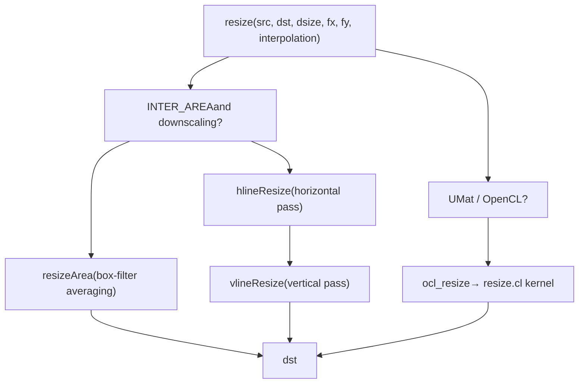
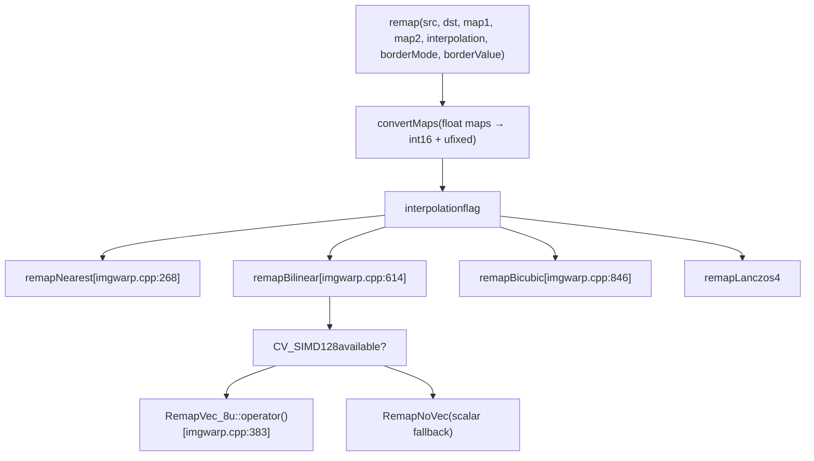
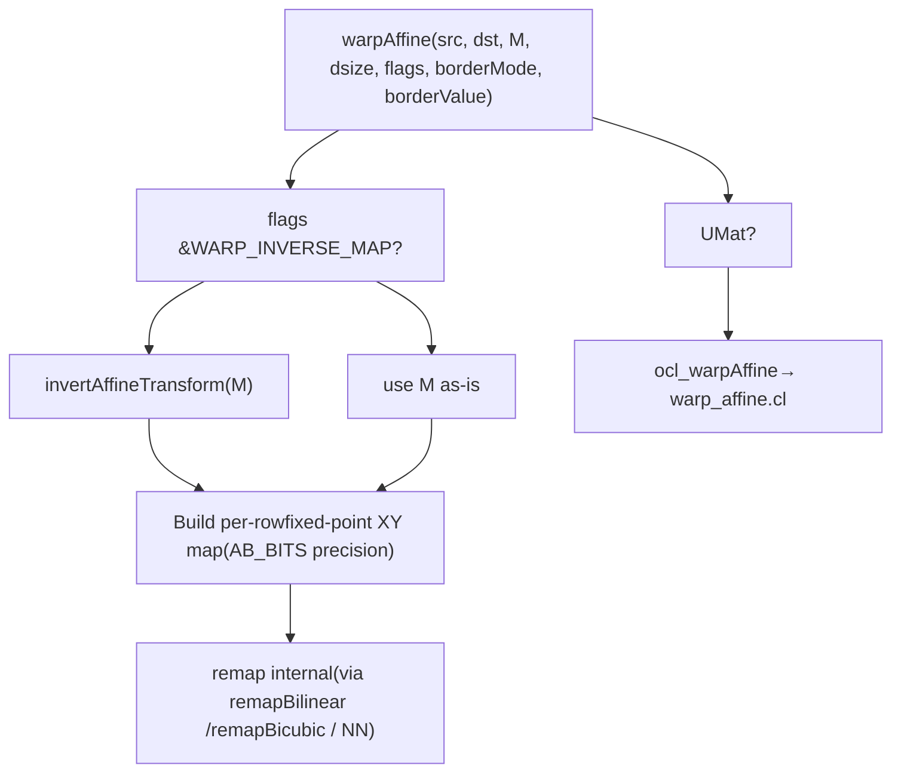
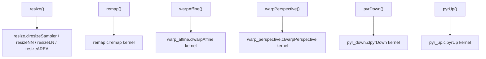
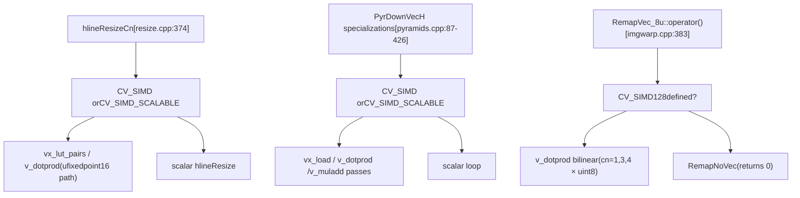

# 几何变换与图像扭曲

相关源文件

-   [modules/core/include/opencv2/core/utils/trace.private.hpp](https://github.com/opencv/opencv/blob/91c78f50/modules/core/include/opencv2/core/utils/trace.private.hpp)
-   [modules/core/src/opencl/copyset.cl](https://github.com/opencv/opencv/blob/91c78f50/modules/core/src/opencl/copyset.cl)
-   [modules/core/src/parallel/parallel.cpp](https://github.com/opencv/opencv/blob/91c78f50/modules/core/src/parallel/parallel.cpp)
-   [modules/core/src/parallel/registry\_parallel.impl.hpp](https://github.com/opencv/opencv/blob/91c78f50/modules/core/src/parallel/registry_parallel.impl.hpp)
-   [modules/features2d/src/fast.avx2.cpp](https://github.com/opencv/opencv/blob/91c78f50/modules/features2d/src/fast.avx2.cpp)
-   [modules/features2d/src/fast.hpp](https://github.com/opencv/opencv/blob/91c78f50/modules/features2d/src/fast.hpp)
-   [modules/imgproc/doc/colors.markdown](https://github.com/opencv/opencv/blob/91c78f50/modules/imgproc/doc/colors.markdown?plain=1)
-   [modules/imgproc/doc/pics/Bayer\_patterns.png](https://github.com/opencv/opencv/blob/91c78f50/modules/imgproc/doc/pics/Bayer_patterns.png)
-   [modules/imgproc/perf/opencl/perf\_color.cpp](https://github.com/opencv/opencv/blob/91c78f50/modules/imgproc/perf/opencl/perf_color.cpp)
-   [modules/imgproc/perf/opencl/perf\_imgwarp.cpp](https://github.com/opencv/opencv/blob/91c78f50/modules/imgproc/perf/opencl/perf_imgwarp.cpp)
-   [modules/imgproc/perf/opencl/perf\_moments.cpp](https://github.com/opencv/opencv/blob/91c78f50/modules/imgproc/perf/opencl/perf_moments.cpp)
-   [modules/imgproc/perf/opencl/perf\_pyramid.cpp](https://github.com/opencv/opencv/blob/91c78f50/modules/imgproc/perf/opencl/perf_pyramid.cpp)
-   [modules/imgproc/src/color.cpp](https://github.com/opencv/opencv/blob/91c78f50/modules/imgproc/src/color.cpp)
-   [modules/imgproc/src/imgwarp.avx2.cpp](https://github.com/opencv/opencv/blob/91c78f50/modules/imgproc/src/imgwarp.avx2.cpp)
-   [modules/imgproc/src/imgwarp.cpp](https://github.com/opencv/opencv/blob/91c78f50/modules/imgproc/src/imgwarp.cpp)
-   [modules/imgproc/src/imgwarp.hpp](https://github.com/opencv/opencv/blob/91c78f50/modules/imgproc/src/imgwarp.hpp)
-   [modules/imgproc/src/imgwarp.sse4\_1.cpp](https://github.com/opencv/opencv/blob/91c78f50/modules/imgproc/src/imgwarp.sse4_1.cpp)
-   [modules/imgproc/src/opencl/pyr\_down.cl](https://github.com/opencv/opencv/blob/91c78f50/modules/imgproc/src/opencl/pyr_down.cl)
-   [modules/imgproc/src/opencl/pyr\_up.cl](https://github.com/opencv/opencv/blob/91c78f50/modules/imgproc/src/opencl/pyr_up.cl)
-   [modules/imgproc/src/opencl/pyramid\_up.cl](https://github.com/opencv/opencv/blob/91c78f50/modules/imgproc/src/opencl/pyramid_up.cl)
-   [modules/imgproc/src/opencl/remap.cl](https://github.com/opencv/opencv/blob/91c78f50/modules/imgproc/src/opencl/remap.cl)
-   [modules/imgproc/src/opencl/resize.cl](https://github.com/opencv/opencv/blob/91c78f50/modules/imgproc/src/opencl/resize.cl)
-   [modules/imgproc/src/opencl/warp\_affine.cl](https://github.com/opencv/opencv/blob/91c78f50/modules/imgproc/src/opencl/warp_affine.cl)
-   [modules/imgproc/src/opencl/warp\_perspective.cl](https://github.com/opencv/opencv/blob/91c78f50/modules/imgproc/src/opencl/warp_perspective.cl)
-   [modules/imgproc/src/opencl/warp\_transform.cl](https://github.com/opencv/opencv/blob/91c78f50/modules/imgproc/src/opencl/warp_transform.cl)
-   [modules/imgproc/src/pyramids.cpp](https://github.com/opencv/opencv/blob/91c78f50/modules/imgproc/src/pyramids.cpp)
-   [modules/imgproc/src/resize.avx2.cpp](https://github.com/opencv/opencv/blob/91c78f50/modules/imgproc/src/resize.avx2.cpp)
-   [modules/imgproc/src/resize.cpp](https://github.com/opencv/opencv/blob/91c78f50/modules/imgproc/src/resize.cpp)
-   [modules/imgproc/src/resize.hpp](https://github.com/opencv/opencv/blob/91c78f50/modules/imgproc/src/resize.hpp)
-   [modules/imgproc/src/resize.sse4\_1.cpp](https://github.com/opencv/opencv/blob/91c78f50/modules/imgproc/src/resize.sse4_1.cpp)
-   [modules/imgproc/test/ocl/test\_color.cpp](https://github.com/opencv/opencv/blob/91c78f50/modules/imgproc/test/ocl/test_color.cpp)
-   [modules/imgproc/test/ocl/test\_pyramids.cpp](https://github.com/opencv/opencv/blob/91c78f50/modules/imgproc/test/ocl/test_pyramids.cpp)
-   [modules/imgproc/test/ocl/test\_warp.cpp](https://github.com/opencv/opencv/blob/91c78f50/modules/imgproc/test/ocl/test_warp.cpp)
-   [modules/imgproc/test/test\_imgwarp.cpp](https://github.com/opencv/opencv/blob/91c78f50/modules/imgproc/test/test_imgwarp.cpp)
-   [modules/imgproc/test/test\_imgwarp\_strict.cpp](https://github.com/opencv/opencv/blob/91c78f50/modules/imgproc/test/test_imgwarp_strict.cpp)
-   [modules/imgproc/test/test\_pyramid.cpp](https://github.com/opencv/opencv/blob/91c78f50/modules/imgproc/test/test_pyramid.cpp)
-   [modules/imgproc/test/test\_resize\_bitexact.cpp](https://github.com/opencv/opencv/blob/91c78f50/modules/imgproc/test/test_resize_bitexact.cpp)
-   [modules/ts/include/opencv2/ts/ocl\_test.hpp](https://github.com/opencv/opencv/blob/91c78f50/modules/ts/include/opencv2/ts/ocl_test.hpp)

本页记录 `opencv_imgproc` 模块中的几何变换与图像扭曲函数：`resize`、`remap`、`warpAffine`、`warpPerspective`，以及图像金字塔函数 `pyrDown`/`pyrUp`。内容包括插值方法、边界外推模式、内部实现结构，以及 OpenCL/SIMD 加速路径。

关于颜色空间转换（如 `cvtColor`），请参见 [4.2](/opencv/opencv/4.2-filtering-and-color-conversion)。关于由标定推导的去畸变和透视变换，请参见 [8.1](/opencv/opencv/8.1-camera-models-and-calibration-algorithms) 与 [8.2](/opencv/opencv/8.2-pose-estimation-(solvepnp)-and-geometric-transforms)。关于这些操作的 GPU（CUDA）版本，请参见 [14.2](/opencv/opencv/14.2-gpu-accelerated-image-processing-and-optical-flow)。

---

## 公共 API 概览

所有函数都位于 `cv` 命名空间。其声明位于 `modules/imgproc/include/opencv2/imgproc.hpp`。

| Function | Purpose | Transform type |
| --- | --- | --- |
| `resize` | 将图像缩放到新尺寸 | 缩放（可分离） |
| `remap` | 应用任意像素映射 | 自由形式逐像素映射 |
| `warpAffine` | 应用 2×3 仿射矩阵 | 仿射 |
| `warpPerspective` | 应用 3×3 单应矩阵 | 投影 |
| `pyrDown` | 2× 高斯降采样 | 固定金字塔核 |
| `pyrUp` | 2× 升采样 | 固定金字塔核 |
| `getRotationMatrix2D` | 计算旋转/缩放 2×3 矩阵 | 辅助函数 |
| `getPerspectiveTransform` | 由点对应关系计算 3×3 单应矩阵 | 辅助函数 |
| `getAffineTransform` | 由点对应关系计算 2×3 仿射矩阵 | 辅助函数 |

---

## 插值方法

插值模式通过整数 flag 传入，定义在 `InterpolationFlags` 枚举中。

| Flag | Value | Kernel size | Notes |
| --- | --- | --- | --- |
| `INTER_NEAREST` | 0 | 1×1 | 不混合，取最近邻 |
| `INTER_LINEAR` | 1 | 2×2 | 双线性；多数函数默认值 |
| `INTER_CUBIC` | 2 | 4×4 | 双三次，`A = -0.75` |
| `INTER_AREA` | 3 | varies | 区域平均；更适合下采样 |
| `INTER_LANCZOS4` | 4 | 8×8 | 窗口大小为 4 的 Lanczos |
| `INTER_LINEAR_EXACT` | 5 | 2×2 | 位精确双线性；仅整数路径 |
| `INTER_NEAREST_EXACT` | 6 | 1×1 | 位精确最近邻；与 PIL 一致 |

对于 `warpAffine` 与 `warpPerspective`，还可将 `WARP_INVERSE_MAP` 与插值 flag 按位或，用于指示矩阵是 destination→source 而非 source→destination。

### 插值系数查找表

所有非最近邻插值模式都会在启动时预计算查找表。这些表以子像素分辨率 `INTER_TAB_SIZE = 32`（5 bits）缓存分数坐标权重。

在 [modules/imgproc/src/imgwarp.cpp64-83](https://github.com/opencv/opencv/blob/91c78f50/modules/imgproc/src/imgwarp.cpp#L64-L83) 中声明的表：

| Table | Type | Shape | Used for |
| --- | --- | --- | --- |
| `NNDeltaTab_i` | `uchar[1024][2]` | `INTER_TAB_SIZE²×2` | 最近邻取整 |
| `BilinearTab_f` | `float[1024][2][2]` | `INTER_TAB_SIZE²×2×2` | 双线性（float） |
| `BilinearTab_i` | `short[1024][2][2]` | `INTER_TAB_SIZE²×2×2` | 双线性（定点） |
| `BilinearTab_iC4` | `short[...][2][8]` | SIMD-padded | 4 通道 SIMD 双线性 |
| `BicubicTab_f/i` | `float/short[1024][4][4]` | `INTER_TAB_SIZE²×4×4` | 双三次 |
| `Lanczos4Tab_f/i` | `float/short[1024][8][8]` | `INTER_TAB_SIZE²×8×8` | Lanczos4 |

表初始化函数如下：

-   `interpolateLinear(float x, float* coeffs)` – [modules/imgproc/src/imgwarp.cpp85-89](https://github.com/opencv/opencv/blob/91c78f50/modules/imgproc/src/imgwarp.cpp#L85-L89)
-   `interpolateCubic(float x, float* coeffs)` – [modules/imgproc/src/imgwarp.cpp91-99](https://github.com/opencv/opencv/blob/91c78f50/modules/imgproc/src/imgwarp.cpp#L91-L99)
-   `interpolateLanczos4(float x, float* coeffs)` – [modules/imgproc/src/imgwarp.cpp101-127](https://github.com/opencv/opencv/blob/91c78f50/modules/imgproc/src/imgwarp.cpp#L101-L127)
-   `initInterTab1D(int method, float* tab, int tabsz)` – [modules/imgproc/src/imgwarp.cpp129-149](https://github.com/opencv/opencv/blob/91c78f50/modules/imgproc/src/imgwarp.cpp#L129-L149)
-   `initInterTab2D(int method, bool fixpt)` – [modules/imgproc/src/imgwarp.cpp152-226](https://github.com/opencv/opencv/blob/91c78f50/modules/imgproc/src/imgwarp.cpp#L152-L226)

定点运算使用 `INTER_REMAP_COEF_BITS = 15` 与 `INTER_REMAP_COEF_SCALE = 32768`（[modules/imgproc/src/imgwarp.cpp66-67](https://github.com/opencv/opencv/blob/91c78f50/modules/imgproc/src/imgwarp.cpp#L66-L67)）。

---

## 边界外推模式

当映射像素落在源图像之外时，边界模式决定使用的像素值。

| Flag | Behavior | Example (border is `|`) | |---|---|---| | `BORDER_CONSTANT` | Fill with a fixed value (default: 0) | `000|abcdef|000` | | `BORDER_REPLICATE` | Repeat the edge pixel | `aaa|abcdef|fff` | | `BORDER_REFLECT` | Mirror across the edge | `cba|abcdef|fed` | | `BORDER_REFLECT_101` | Mirror, excluding the edge pixel | `dcb|abcdef|edc` | | `BORDER_WRAP` | Tile the image | `cde|abcdef|abc` | | `BORDER_TRANSPARENT` | Leave destination pixels unchanged | (no fill) |

`borderInterpolate` 函数（来自 `core`）会把越界坐标映射到有效坐标。它在 [modules/imgproc/src/imgwarp.cpp314-315](https://github.com/opencv/opencv/blob/91c78f50/modules/imgproc/src/imgwarp.cpp#L314-L315) 等标量回退路径中被调用。

---

## `resize`

**Source:** [modules/imgproc/src/resize.cpp](https://github.com/opencv/opencv/blob/91c78f50/modules/imgproc/src/resize.cpp)

`resize` 将图像缩放到新的 `Size`，或按 `fx`/`fy` 比例缩放。内部实现将 2D 重采样分解为可分离的水平与垂直两次 pass。

### 内部流水线

**Figure: resize internal data flow**


来源： [modules/imgproc/src/resize.cpp](https://github.com/opencv/opencv/blob/91c78f50/modules/imgproc/src/resize.cpp) [modules/imgproc/src/opencl/resize.cl](https://github.com/opencv/opencv/blob/91c78f50/modules/imgproc/src/opencl/resize.cl)

### 关键内部函数

-   `hlineResize<ET, FT, n, mulall>` – 在每一行上应用核宽为 `n` 的 1D 重采样滤波并写入临时缓冲。为 cn=1,2,3,4 提供特化。 [modules/imgproc/src/resize.cpp76-110](https://github.com/opencv/opencv/blob/91c78f50/modules/imgproc/src/resize.cpp#L76-L110)
-   `hlineResizeCn` – 选择合适的 `hline<...>::ResizeCn` 特化的分发器。 [modules/imgproc/src/resize.cpp374-378](https://github.com/opencv/opencv/blob/91c78f50/modules/imgproc/src/resize.cpp#L374-L378)
-   `uint8_t`/`ufixedpoint16` 的 SIMD 特化位于 [modules/imgproc/src/resize.cpp380](https://github.com/opencv/opencv/blob/91c78f50/modules/imgproc/src/resize.cpp#L380-LNaN)，SSE4.1 版本位于 [modules/imgproc/src/resize.sse4\_1.cpp](https://github.com/opencv/opencv/blob/91c78f50/modules/imgproc/src/resize.sse4_1.cpp)

对于 `INTER_AREA`，当缩放因子是精确整数时，会走快速路径，直接做像素平均而不使用通用系数表。

---

## `remap`

**Source:** [modules/imgproc/src/imgwarp.cpp](https://github.com/opencv/opencv/blob/91c78f50/modules/imgproc/src/imgwarp.cpp)

`remap` 执行自由形式几何映射。调用方提供两个浮点 map：`map1` 与 `map2`，指定每个目标像素应从源图像的哪个位置采样。

```
dst(x, y) = src(map1(x, y), map2(x, y))
```
内部会通过 `convertMaps` 将 map 转换为紧凑表示（整数像素坐标 + 定点小数偏移）。

### remap 分发架构

**Figure: remap CPU dispatch to typed kernel functions**


来源： [modules/imgproc/src/imgwarp.cpp268-843](https://github.com/opencv/opencv/blob/91c78f50/modules/imgproc/src/imgwarp.cpp#L268-L843) [modules/imgproc/src/opencl/remap.cl](https://github.com/opencv/opencv/blob/91c78f50/modules/imgproc/src/opencl/remap.cl)

### `remapBilinear` 的 inlier/outlier 分段

`remapBilinear` 会把每个目标行切分为连续 inlier 段（双线性 4 邻点都在源图像内）与 outlier 段（部分邻点越界）。向量化算子 `RemapVec_8u` 仅用于 inlier 段；outlier 回退到调用 `borderInterpolate` 的标量代码。见 [modules/imgproc/src/imgwarp.cpp640-843](https://github.com/opencv/opencv/blob/91c78f50/modules/imgproc/src/imgwarp.cpp#L640-L843)

SIMD 路径 `RemapVec_8u` 支持 `uint8_t` 图像的 `cn = 1, 3, 4`，通过 128-bit 向量中的 `v_dotprod` 计算双线性累加 [modules/imgproc/src/imgwarp.cpp383-612](https://github.com/opencv/opencv/blob/91c78f50/modules/imgproc/src/imgwarp.cpp#L383-L612)

---

## `warpAffine`

**Source:** [modules/imgproc/src/imgwarp.cpp](https://github.com/opencv/opencv/blob/91c78f50/modules/imgproc/src/imgwarp.cpp) [modules/imgproc/src/opencl/warp\_affine.cl](https://github.com/opencv/opencv/blob/91c78f50/modules/imgproc/src/opencl/warp_affine.cl)

`warpAffine` 应用 2×3 仿射矩阵 `M`：

```
dst(x, y) = src(M[0,0]*x + M[0,1]*y + M[0,2],
                M[1,0]*x + M[1,1]*y + M[1,2])
```
除非设置了 `WARP_INVERSE_MAP`，否则矩阵会先求逆，使其将目标坐标反向映射回源坐标（inverse mapping）。

### 处理流水线

**Figure: warpAffine execution paths**


来源： [modules/imgproc/src/imgwarp.cpp](https://github.com/opencv/opencv/blob/91c78f50/modules/imgproc/src/imgwarp.cpp) [modules/imgproc/src/opencl/warp\_affine.cl](https://github.com/opencv/opencv/blob/91c78f50/modules/imgproc/src/opencl/warp_affine.cl)

OpenCL 内核 `warp_affine.cl` 在坐标计算中使用定点算术，精度为 `AB_BITS = max(10, INTER_BITS)`，插值权重使用 `INTER_REMAP_COEF_BITS`（[modules/imgproc/src/opencl/warp\_affine.cl54-59](https://github.com/opencv/opencv/blob/91c78f50/modules/imgproc/src/opencl/warp_affine.cl#L54-L59)）。

---

## `warpPerspective`

**Source:** [modules/imgproc/src/imgwarp.cpp](https://github.com/opencv/opencv/blob/91c78f50/modules/imgproc/src/imgwarp.cpp) [modules/imgproc/src/opencl/warp\_perspective.cl](https://github.com/opencv/opencv/blob/91c78f50/modules/imgproc/src/opencl/warp_perspective.cl)

`warpPerspective` 应用完整 3×3 单应矩阵 `M`：

```
(x', y', w') = M * (x, y, 1)^T
dst(x, y) = src(x'/w', y'/w')
```
每个像素都执行齐次除法。除非设置 `WARP_INVERSE_MAP`，否则会通过 `invert(M, iM, DECOMP_LU)` 对 3×3 矩阵求逆。

内部实现中，对每个输出行 `y`，代码会预计算该行对 `X`、`Y`、`W` 的贡献，并沿 `x` 增量更新，避免重复矩阵乘法。得到的分数坐标会量化为 `INTER_TAB_SIZE` 级别，并存入与 `remap` 相同的 `short` + `ushort` 映射。随后像素插值走与 `remap` 相同代码路径。

---

## 图像金字塔（`pyrDown` / `pyrUp`）

**Source:** [modules/imgproc/src/pyramids.cpp](https://github.com/opencv/opencv/blob/91c78f50/modules/imgproc/src/pyramids.cpp) [modules/imgproc/src/opencl/pyr\_down.cl](https://github.com/opencv/opencv/blob/91c78f50/modules/imgproc/src/opencl/pyr_down.cl) [modules/imgproc/src/opencl/pyr\_up.cl](https://github.com/opencv/opencv/blob/91c78f50/modules/imgproc/src/opencl/pyr_up.cl)

两个函数都使用固定 5-tap 二项式（高斯）核 `[1 4 6 4 1] / 16`。

### `pyrDown`

先用 5-tap 核平滑，再进行 2× 子采样。输出尺寸默认是 `⌈(src.rows+1)/2⌉ × ⌈(src.cols+1)/2⌉`。

实现为两次可分离 pass：

-   **水平**：`PyrDownVecH<T1, T2, cn>` – 为 `uchar`、`ushort`、`short`、`float`、`double` 且 cn=1,2,3,4 提供 SIMD 特化。 [modules/imgproc/src/pyramids.cpp87-426](https://github.com/opencv/opencv/blob/91c78f50/modules/imgproc/src/pyramids.cpp#L87-L426)
-   **垂直**：`PyrDownVecV<T1, T2>` – SIMD 特化。 [modules/imgproc/src/pyramids.cpp428-514](https://github.com/opencv/opencv/blob/91c78f50/modules/imgproc/src/pyramids.cpp#L428-L514)

水平 pass 在源图每隔一列（步长 2）计算并累积到整型行缓冲。垂直 pass 读取 5 条该类行缓冲，应用 5-tap 核后写出目标行。

### `pyrUp`

通过在像素间插零进行上采样，再卷积 `4 × [1 4 6 4 1] / 16`。默认输出尺寸为 `2*src.rows × 2*src.cols`，也可指定与默认值相差不超过 ±1 像素的 `dstsize`。

-   **水平**：`PyrUpVecH<T1, T2, cn>` [modules/imgproc/src/pyramids.cpp74-77](https://github.com/opencv/opencv/blob/91c78f50/modules/imgproc/src/pyramids.cpp#L74-L77)
-   **垂直**：`PyrUpVecV<T1, T2>`、`PyrUpVecVOneRow<T1, T2>` [modules/imgproc/src/pyramids.cpp81-83](https://github.com/opencv/opencv/blob/91c78f50/modules/imgproc/src/pyramids.cpp#L81-L83)

### 金字塔中的边界处理

OpenCL 内核 `pyr_down.cl` 通过 `EXTRAPOLATE(x, maxV)` 宏支持 `BORDER_REPLICATE`、`BORDER_WRAP`、`BORDER_REFLECT` 与 `BORDER_REFLECT_101`（[modules/imgproc/src/opencl/pyr\_down.cl54-66](https://github.com/opencv/opencv/blob/91c78f50/modules/imgproc/src/opencl/pyr_down.cl#L54-L66)）。CPU 路径对越界坐标使用 `borderInterpolate`。

---

## OpenCL 加速

主要 warp 函数都提供 OpenCL 加速路径；当输入或输出是 `UMat` 时会透明触发（参见 [3.2](/opencv/opencv/3.2-opencl-acceleration-and-transparent-gpu-execution)）。入口模式使用 `CV_OCL_RUN` 宏。

**Figure: OpenCL acceleration dispatch (mapping functions to .cl kernels)**


来源： [modules/imgproc/src/resize.cpp](https://github.com/opencv/opencv/blob/91c78f50/modules/imgproc/src/resize.cpp) [modules/imgproc/src/imgwarp.cpp](https://github.com/opencv/opencv/blob/91c78f50/modules/imgproc/src/imgwarp.cpp) [modules/imgproc/src/pyramids.cpp](https://github.com/opencv/opencv/blob/91c78f50/modules/imgproc/src/pyramids.cpp) [modules/imgproc/src/opencl/resize.cl](https://github.com/opencv/opencv/blob/91c78f50/modules/imgproc/src/opencl/resize.cl) [modules/imgproc/src/opencl/remap.cl](https://github.com/opencv/opencv/blob/91c78f50/modules/imgproc/src/opencl/remap.cl) [modules/imgproc/src/opencl/warp\_affine.cl](https://github.com/opencv/opencv/blob/91c78f50/modules/imgproc/src/opencl/warp_affine.cl) [modules/imgproc/src/opencl/warp\_perspective.cl](https://github.com/opencv/opencv/blob/91c78f50/modules/imgproc/src/opencl/warp_perspective.cl) [modules/imgproc/src/opencl/pyr\_down.cl](https://github.com/opencv/opencv/blob/91c78f50/modules/imgproc/src/opencl/pyr_down.cl) [modules/imgproc/src/opencl/pyr\_up.cl](https://github.com/opencv/opencv/blob/91c78f50/modules/imgproc/src/opencl/pyr_up.cl)

### `resize.cl` 细节

resize OpenCL 内核有两种编译期模式：

-   `USE_SAMPLER`：使用 GPU 硬件纹理采样器进行双线性插值。源图上传为 `image2d_t`。内核：`resizeSampler`。 [modules/imgproc/src/opencl/resize.cl101](https://github.com/opencv/opencv/blob/91c78f50/modules/imgproc/src/opencl/resize.cl#L101-LNaN)
-   非 sampler 模式：使用全局内存显式执行双线性或最近邻插值。内核：`resizeNN`、`resizeLN`、`resizeAREA`。

### `warp_affine.cl` 细节

该内核计算每个线程的目标坐标，使用定点算术应用逆仿射变换，并进行双线性或最近邻插值。插值子像素索引存于低位 `INTER_BITS = 5` bit，查表使用预计算系数。 [modules/imgproc/src/opencl/warp\_affine.cl54-59](https://github.com/opencv/opencv/blob/91c78f50/modules/imgproc/src/opencl/warp_affine.cl#L54-L59)

---

## SIMD 加速

CPU 热路径通过 OpenCV 的 universal SIMD intrinsics 加速（参见 [3.5](/opencv/opencv/3.5-simd-intrinsics-and-cpu-dispatching)）。

**Figure: SIMD dispatch paths for imgwarp and resize**


来源： [modules/imgproc/src/imgwarp.cpp378-612](https://github.com/opencv/opencv/blob/91c78f50/modules/imgproc/src/imgwarp.cpp#L378-L612) [modules/imgproc/src/pyramids.cpp85-514](https://github.com/opencv/opencv/blob/91c78f50/modules/imgproc/src/pyramids.cpp#L85-L514) [modules/imgproc/src/resize.cpp380](https://github.com/opencv/opencv/blob/91c78f50/modules/imgproc/src/resize.cpp#L380-LNaN) [modules/imgproc/src/imgwarp.sse4\_1.cpp](https://github.com/opencv/opencv/blob/91c78f50/modules/imgproc/src/imgwarp.sse4_1.cpp) [modules/imgproc/src/imgwarp.avx2.cpp](https://github.com/opencv/opencv/blob/91c78f50/modules/imgproc/src/imgwarp.avx2.cpp) [modules/imgproc/src/resize.sse4\_1.cpp](https://github.com/opencv/opencv/blob/91c78f50/modules/imgproc/src/resize.sse4_1.cpp)

具体 CPU 分发文件：

| File | Dispatch baseline |
| --- | --- |
| `modules/imgproc/src/imgwarp.sse4_1.cpp` | SSE4.1 |
| `modules/imgproc/src/imgwarp.avx2.cpp` | AVX2 |
| `modules/imgproc/src/resize.sse4_1.cpp` | SSE4.1 |

---

## `convertMaps`

`convertMaps` 将一对浮点映射（`CV_32FC1` 或 `CV_32FC2`）转换为内部使用的紧凑 `(int16, uint16)` 格式：

-   `map1` → `short` array storing truncated pixel coordinates (interleaved x, y)
-   `map2` → `ushort` array storing the fractional part as an index into the interpolation coefficient table (in range <FileRef file-url="https://github.com/opencv/opencv/blob/91c78f50/0, INTER_TAB_SIZE²)`)\\n\\nThis conversion is shared by `remap`, `warpAffine`, and `warpPerspective`.\\n\\n---\\n\\n## Testing\\n\\nTests are organized in three files#LNaN-LNaN" NaN file-path="0, INTER\_TAB\_SIZE²)`)

This conversion is shared by` remap`,` warpAffine`, and` warpPerspective\`.\\n\\n---\\n\\n## Testing\\n\\nTests are organized in three files">Hii

Performance benchmarks for the OpenCL paths are in `modules/imgproc/perf/opencl/perf_imgwarp.cpp` and `modules/imgproc/perf/opencl/perf_pyramid.cpp`.
