# 过滤、颜色转换和阈值处理

相关源文件

-   [modules/core/src/opencl/copyset.cl](https://github.com/opencv/opencv/blob/91c78f50/modules/core/src/opencl/copyset.cl)
-   [modules/imgcodecs/test/test\_main.cpp](https://github.com/opencv/opencv/blob/91c78f50/modules/imgcodecs/test/test_main.cpp)
-   [modules/imgproc/doc/colors.markdown](https://github.com/opencv/opencv/blob/91c78f50/modules/imgproc/doc/colors.markdown?plain=1)
-   [modules/imgproc/doc/pics/Bayer\_patterns.png](https://github.com/opencv/opencv/blob/91c78f50/modules/imgproc/doc/pics/Bayer_patterns.png)
-   [modules/imgproc/perf/opencl/perf\_color.cpp](https://github.com/opencv/opencv/blob/91c78f50/modules/imgproc/perf/opencl/perf_color.cpp)
-   [modules/imgproc/perf/opencl/perf\_imgwarp.cpp](https://github.com/opencv/opencv/blob/91c78f50/modules/imgproc/perf/opencl/perf_imgwarp.cpp)
-   [modules/imgproc/perf/opencl/perf\_moments.cpp](https://github.com/opencv/opencv/blob/91c78f50/modules/imgproc/perf/opencl/perf_moments.cpp)
-   [modules/imgproc/perf/opencl/perf\_pyramid.cpp](https://github.com/opencv/opencv/blob/91c78f50/modules/imgproc/perf/opencl/perf_pyramid.cpp)
-   [modules/imgproc/src/canny.cpp](https://github.com/opencv/opencv/blob/91c78f50/modules/imgproc/src/canny.cpp)
-   [modules/imgproc/src/clahe.cpp](https://github.com/opencv/opencv/blob/91c78f50/modules/imgproc/src/clahe.cpp)
-   [modules/imgproc/src/color.cpp](https://github.com/opencv/opencv/blob/91c78f50/modules/imgproc/src/color.cpp)
-   [modules/imgproc/src/deriv.cpp](https://github.com/opencv/opencv/blob/91c78f50/modules/imgproc/src/deriv.cpp)
-   [modules/imgproc/src/histogram.cpp](https://github.com/opencv/opencv/blob/91c78f50/modules/imgproc/src/histogram.cpp)
-   [modules/imgproc/src/imgwarp.cpp](https://github.com/opencv/opencv/blob/91c78f50/modules/imgproc/src/imgwarp.cpp)
-   [modules/imgproc/src/opencl/bilateral.cl](https://github.com/opencv/opencv/blob/91c78f50/modules/imgproc/src/opencl/bilateral.cl)
-   [modules/imgproc/src/opencl/clahe.cl](https://github.com/opencv/opencv/blob/91c78f50/modules/imgproc/src/opencl/clahe.cl)
-   [modules/imgproc/src/opencl/covardata.cl](https://github.com/opencv/opencv/blob/91c78f50/modules/imgproc/src/opencl/covardata.cl)
-   [modules/imgproc/src/opencl/filter2DSmall.cl](https://github.com/opencv/opencv/blob/91c78f50/modules/imgproc/src/opencl/filter2DSmall.cl)
-   [modules/imgproc/src/opencl/filterSepCol.cl](https://github.com/opencv/opencv/blob/91c78f50/modules/imgproc/src/opencl/filterSepCol.cl)
-   [modules/imgproc/src/opencl/filterSepRow.cl](https://github.com/opencv/opencv/blob/91c78f50/modules/imgproc/src/opencl/filterSepRow.cl)
-   [modules/imgproc/src/opencl/filterSep\_singlePass.cl](https://github.com/opencv/opencv/blob/91c78f50/modules/imgproc/src/opencl/filterSep_singlePass.cl)
-   [modules/imgproc/src/opencl/filterSmall.cl](https://github.com/opencv/opencv/blob/91c78f50/modules/imgproc/src/opencl/filterSmall.cl)
-   [modules/imgproc/src/opencl/histogram.cl](https://github.com/opencv/opencv/blob/91c78f50/modules/imgproc/src/opencl/histogram.cl)
-   [modules/imgproc/src/opencl/laplacian5.cl](https://github.com/opencv/opencv/blob/91c78f50/modules/imgproc/src/opencl/laplacian5.cl)
-   [modules/imgproc/src/opencl/morph.cl](https://github.com/opencv/opencv/blob/91c78f50/modules/imgproc/src/opencl/morph.cl)
-   [modules/imgproc/src/opencl/pyr\_down.cl](https://github.com/opencv/opencv/blob/91c78f50/modules/imgproc/src/opencl/pyr_down.cl)
-   [modules/imgproc/src/opencl/pyr\_up.cl](https://github.com/opencv/opencv/blob/91c78f50/modules/imgproc/src/opencl/pyr_up.cl)
-   [modules/imgproc/src/opencl/pyramid\_up.cl](https://github.com/opencv/opencv/blob/91c78f50/modules/imgproc/src/opencl/pyramid_up.cl)
-   [modules/imgproc/src/opencl/remap.cl](https://github.com/opencv/opencv/blob/91c78f50/modules/imgproc/src/opencl/remap.cl)
-   [modules/imgproc/src/opencl/resize.cl](https://github.com/opencv/opencv/blob/91c78f50/modules/imgproc/src/opencl/resize.cl)
-   [modules/imgproc/src/opencl/warp\_affine.cl](https://github.com/opencv/opencv/blob/91c78f50/modules/imgproc/src/opencl/warp_affine.cl)
-   [modules/imgproc/src/opencl/warp\_perspective.cl](https://github.com/opencv/opencv/blob/91c78f50/modules/imgproc/src/opencl/warp_perspective.cl)
-   [modules/imgproc/src/opencl/warp\_transform.cl](https://github.com/opencv/opencv/blob/91c78f50/modules/imgproc/src/opencl/warp_transform.cl)
-   [modules/imgproc/src/pyramids.cpp](https://github.com/opencv/opencv/blob/91c78f50/modules/imgproc/src/pyramids.cpp)
-   [modules/imgproc/test/ocl/test\_color.cpp](https://github.com/opencv/opencv/blob/91c78f50/modules/imgproc/test/ocl/test_color.cpp)
-   [modules/imgproc/test/ocl/test\_filters.cpp](https://github.com/opencv/opencv/blob/91c78f50/modules/imgproc/test/ocl/test_filters.cpp)
-   [modules/imgproc/test/ocl/test\_pyramids.cpp](https://github.com/opencv/opencv/blob/91c78f50/modules/imgproc/test/ocl/test_pyramids.cpp)
-   [modules/imgproc/test/ocl/test\_warp.cpp](https://github.com/opencv/opencv/blob/91c78f50/modules/imgproc/test/ocl/test_warp.cpp)
-   [modules/imgproc/test/test\_histograms.cpp](https://github.com/opencv/opencv/blob/91c78f50/modules/imgproc/test/test_histograms.cpp)
-   [modules/imgproc/test/test\_imgproc\_umat.cpp](https://github.com/opencv/opencv/blob/91c78f50/modules/imgproc/test/test_imgproc_umat.cpp)
-   [modules/imgproc/test/test\_imgwarp.cpp](https://github.com/opencv/opencv/blob/91c78f50/modules/imgproc/test/test_imgwarp.cpp)
-   [modules/imgproc/test/test\_imgwarp\_strict.cpp](https://github.com/opencv/opencv/blob/91c78f50/modules/imgproc/test/test_imgwarp_strict.cpp)
-   [modules/imgproc/test/test\_pyramid.cpp](https://github.com/opencv/opencv/blob/91c78f50/modules/imgproc/test/test_pyramid.cpp)
-   [modules/ts/include/opencv2/ts/ocl\_test.hpp](https://github.com/opencv/opencv/blob/91c78f50/modules/ts/include/opencv2/ts/ocl_test.hpp)
-   [modules/videoio/test/test\_main.cpp](https://github.com/opencv/opencv/blob/91c78f50/modules/videoio/test/test_main.cpp)

本文档涵盖了 OpenCV `imgproc` 模块中图像处理操作的三个基本类别：用于图像平滑和边缘检测的过滤操作、用于不同颜色表示之间转换的颜色空间转换以及用于图像二值化和分割的阈值技术。

对于调整大小和扭曲等几何变换，请参见第[4.1](https://github.com/opencv/opencv/blob/91c78f50/4.1)页面。有关整体模块架构的详细信息，请参见第[4](https://github.com/opencv/opencv/blob/91c78f50/4)页面

## 操作类别概述

过滤、颜色转换和阈值处理操作构成了大多数图像处理管道的基础。这些操作跨多个源文件实现，并通过 OpenCL 支持硬件加速。


**过滤、颜色转换和阈值架构**

来源： [modules/imgproc/src/filter.cpp](https://github.com/opencv/opencv/blob/91c78f50/modules/imgproc/src/filter.cpp) [modules/imgproc/src/color.cpp1-403](https://github.com/opencv/opencv/blob/91c78f50/modules/imgproc/src/color.cpp#L1-L403) [modules/imgproc/src/thresh.cpp1-120](https://github.com/opencv/opencv/blob/91c78f50/modules/imgproc/src/thresh.cpp#L1-L120) [modules/imgproc/src/deriv.cpp1-436](https://github.com/opencv/opencv/blob/91c78f50/modules/imgproc/src/deriv.cpp#L1-L436)

## 过滤操作

过滤操作根据邻域修改像素值，从而实现平滑、锐化、边缘检测和形态变换。 OpenCV 提供线性和非线性过滤原语以及优化的实现。

### 线性过滤系统

线性滤波器应用与内核的卷积来计算输出像素作为输入邻域的加权和。

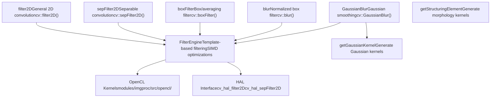
**线性滤波架构**

|功能|签名|关键参数|
| --- | --- | --- |
|`filter2D`|`(src, dst, ddepth, kernel, anchor, delta, borderType)`|`ddepth`：输出深度； `kernel`：卷积核|
|`sepFilter2D`|`(src, dst, ddepth, kernelX, kernelY, anchor, delta, borderType)`|X 和 Y 方向的可分离内核|
|`GaussianBlur`|`(src, dst, ksize, sigmaX, sigmaY, borderType)`|`ksize`：内核大小； `sigmaX/Y`：高斯西格玛|
|`blur`|`(src, dst, ksize, anchor, borderType)`|简单的箱平均滤波器|

来源：[modules/imgproc/src/filter.cpp](https://github.com/opencv/opencv/blob/91c78f50/modules/imgproc/src/filter.cpp)[modules/imgproc/src/opencl/filterSepRow.cl1-28](https://github.com/opencv/opencv/blob/91c78f50/modules/imgproc/src/opencl/filterSepRow.cl#L1-L28)[modules/imgproc/src/opencl/filterSepCol.cl1-28](https://github.com/opencv/opencv/blob/91c78f50/modules/imgproc/src/opencl/filterSepCol.cl#L1-L28)

### 非线性滤波器

非线性滤波器不能表示为卷积运算，需要专门的算法。

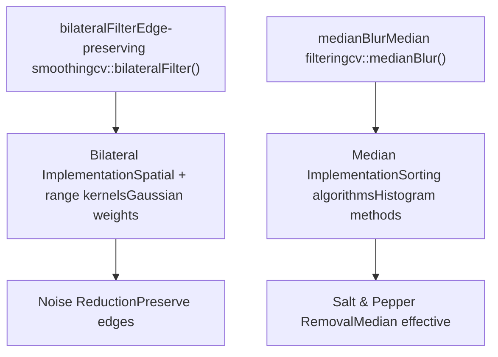
**非线性滤波方法**

**双边滤波器**：将空间邻近性与强度相似性相结合，以在平滑时保留边缘。

```
bilateralFilter(src, dst, d, sigmaColor, sigmaSpace, borderType)
```
- `d`：像素邻域的直径
- `sigmaColor`：在色彩空间中过滤西格玛
- `sigmaSpace`：在坐标空间中过滤西格玛

**中值滤波器**：用其邻域的中值替换每个像素，对脉冲噪声有效。

```
medianBlur(src, dst, ksize)
```
- `ksize`：孔径线性尺寸（奇数，大于1）

来源：[modules/imgproc/src/filter.cpp](https://github.com/opencv/opencv/blob/91c78f50/modules/imgproc/src/filter.cpp)

### 形态运算

形态学操作根据形状处理图像，使用结构元素来探测输入图像。

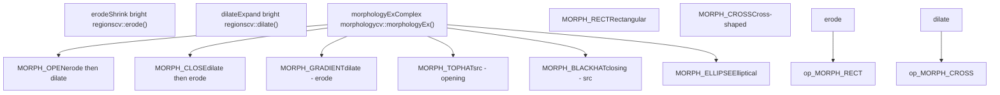
**形态学运算**

|功能|目的|常用|
| --- | --- | --- |
|`erode()`|侵蚀明亮区域|去除小亮点，分离物体|
|`dilate()`|扩大明亮区域|填补漏洞，连接附近的物体|
|`morphologyEx(MORPH_OPEN)`|开仓操作|去除噪音同时保留形状|
|`morphologyEx(MORPH_CLOSE)`|关闭操作|填充物体上的小孔|
|`morphologyEx(MORPH_GRADIENT)`|形态梯度|边缘检测|

来源：[modules/imgproc/src/opencl/morph.cl1-28](https://github.com/opencv/opencv/blob/91c78f50/modules/imgproc/src/opencl/morph.cl#L1-L28)

### 导数滤波器

导数滤波器通过与导数核进行卷积来计算梯度和边缘。

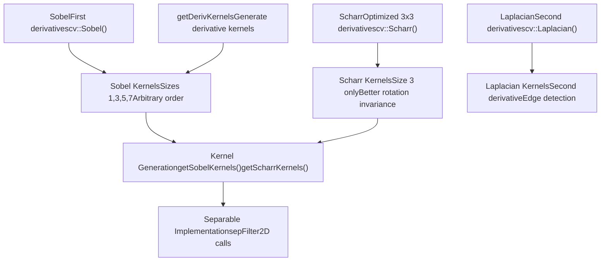
**导数过滤功能**

**Sobel 算子**：使用高斯近似的导数计算图像梯度。

```
void Sobel(InputArray src, OutputArray dst, int ddepth,            int dx, int dy, int ksize=3, double scale=1,            double delta=0, int borderType=BORDER_DEFAULT)
```
- `dx, dy`：导数阶数（0、1 或 2）
- `ksize`：内核大小（1、3、5、7，或 Scharr 的特殊 -1）

**Scharr 算子**：3×3 导数滤波器，具有比 Sobel 更好的旋转对称性。

```
void Scharr(InputArray src, OutputArray dst, int ddepth,            int dx, int dy, double scale=1, double delta=0,            int borderType=BORDER_DEFAULT)
```
**拉普拉斯算子**：用于边缘检测的二阶导数滤波器。

```
void Laplacian(InputArray src, OutputArray dst, int ddepth,               int ksize=1, double scale=1, double delta=0,               int borderType=BORDER_DEFAULT)
```
来源：[modules/imgproc/src/deriv.cpp55-172](https://github.com/opencv/opencv/blob/91c78f50/modules/imgproc/src/deriv.cpp#L55-L172)[modules/imgproc/src/opencl/laplacian5.cl1-50](https://github.com/opencv/opencv/blob/91c78f50/modules/imgproc/src/opencl/laplacian5.cl#L1-L50)

## 色彩空间转换

颜色空间转换可转换不同颜色模型之间的像素表示。 `cvtColor`函数为所有转换提供了统一的接口，其操作由`ColorConversionCodes`枚举指定。

### 颜色转换系统架构

```mermaid
flowchart TD
    cvtColor["cvtColorcv::cvtColor()Unified conversion function"]
    cvtColorTwoPlane["cvtColorTwoPlanecv::cvtColorTwoPlane()YUV 4:2:0 formats"]
    RGB_Conversions["RGB/BGR FamilyCOLOR_BGR2RGBCOLOR_BGR2BGRACOLOR_BGR2GRAY"]
    HSV_Conversions["HSV/HLS FamilyCOLOR_BGR2HSVCOLOR_BGR2HLSCOLOR_HSV2BGR"]
    Lab_Conversions["Lab/Luv FamilyCOLOR_BGR2LabCOLOR_BGR2LuvCOLOR_Lab2BGR"]
    YUV_Conversions["YUV/YCrCb FamilyCOLOR_BGR2YUVCOLOR_BGR2YCrCbCOLOR_YUV2BGR"]
    XYZ_Conversions["XYZ FamilyCOLOR_BGR2XYZCOLOR_XYZ2BGR"]
    cvtColorBGR2BGR["cvtColorBGR2BGRRGB channel reordering"]
    cvtColorBGR2Gray["cvtColorBGR2GrayGrayscale conversion"]
    cvtColorBGR2HSV["cvtColorBGR2HSVHSV transformation"]
    cvtColorBGR2Lab["cvtColorBGR2LabLab transformation"]
    cvtColorBGR2YUV["cvtColorBGR2YUVYUV transformation"]

    cvtColor --> RGB_Conversions
    cvtColor --> HSV_Conversions
    cvtColor --> Lab_Conversions
    cvtColor --> YUV_Conversions
    cvtColor --> XYZ_Conversions
    RGB --> Conversions_cvtColorBGR2BGR
    RGB --> Conversions_cvtColorBGR2Gray
    HSV --> Conversions_cvtColorBGR2HSV
    Lab --> Conversions_cvtColorBGR2Lab
    YUV --> Conversions_cvtColorBGR2YUV
```
**颜色转换架构**

主要转换函数签名：

```
void cvtColor(InputArray src, OutputArray dst, int code,               int dstCn=0, AlgorithmHint hint=cv::ALGO_HINT_DEFAULT)
```
来源：[modules/imgproc/src/color.cpp192-387](https://github.com/opencv/opencv/blob/91c78f50/modules/imgproc/src/color.cpp#L192-L387)

### RGB 和灰度转换

RGB/BGR 转换处理通道重新排序和灰度转换。

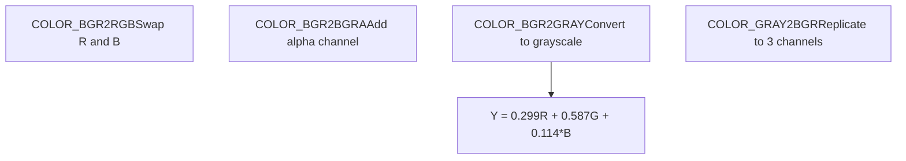
**RGB/Grayscale 转换代码**

|转换代码|手术|笔记|
| --- | --- | --- |
|`COLOR_BGR2RGB`|交换红色和蓝色通道|无需计算，只需重新排序|
|`COLOR_BGR2BGRA`|添加 Alpha 通道|将 alpha 设置为 255|
|`COLOR_BGR2GRAY`|转换为灰度|使用 ITU-R BT.601 系数|
|`COLOR_GRAY2BGR`|复制到 RGB|将灰色复制到所有通道|

**灰度转换公式**：

```
Y = 0.299 * R + 0.587 * G + 0.114 * B
```
来源：[modules/imgproc/src/color.cpp208-241](https://github.com/opencv/opencv/blob/91c78f50/modules/imgproc/src/color.cpp#L208-L241)

### HSV 和 HLS 颜色空间

HSV（色相、饱和度、明度）和 HLS（色相、亮度、饱和度）是圆柱形颜色空间，可用于基于颜色的分割。

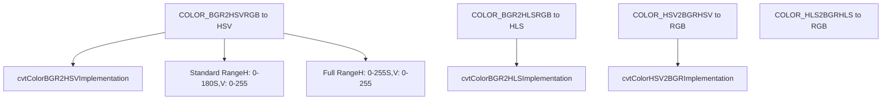
**HSV/HLS 转换代码**

|转换|代码|色调范围|笔记|
| --- | --- | --- | --- |
|BGR 至 HSV|`COLOR_BGR2HSV`| 0-180 |标准范围|
|BGR 至 HSV|`COLOR_BGR2HSV_FULL`| 0-255 |品种齐全|
|BGR 至 HLS|`COLOR_BGR2HLS`| 0-180 |标准范围|
|HSV 至 BGR|`COLOR_HSV2BGR`| 0-180 |逆变换|

**HSV 色彩空间**：将色彩内容与强度分开，其中 H 代表色调角度，S 代表饱和度，V 代表亮度。

**HLS 色彩空间**：与 HSV 类似，但使用 L（亮度）而不是 V（值），提供不同的感知属性。

来源：[modules/imgproc/src/color.cpp268-286](https://github.com/opencv/opencv/blob/91c78f50/modules/imgproc/src/color.cpp#L268-L286)

### Lab 和 Luv 色彩空间

Lab 和 Luv 是感知统一的色彩空间，旨在模拟人类的色彩感知。

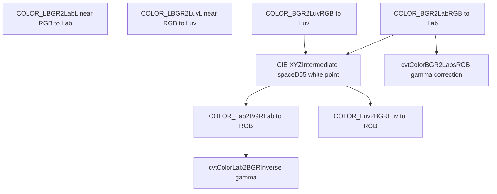
**Lab/Luv 转换代码**

|转换|代码|色彩空间|使用案例|
| --- | --- | --- | --- |
|BGR 到实验室|`COLOR_BGR2Lab`|CIE L*a*b\*|感知颜色差异|
|BGR 飞往 卢夫|`COLOR_BGR2Luv`|CIE L*u*v\*|另类感知空间|
|实验室到 BGR|`COLOR_Lab2BGR`|逆|转换回 RGB|

**Lab Color Space**：L\* 表示亮度（0-100），a\* 绿红轴，b\* 蓝黄轴。欧氏距离近似于感知差异。

**sRGB 变体**： `LBGR` 前缀表示线性 RGB 输入（未应用伽玛校正）。

来源：[modules/imgproc/src/color.cpp288-306](https://github.com/opencv/opencv/blob/91c78f50/modules/imgproc/src/color.cpp#L288-L306)

### YUV 和 YCrCb 色彩空间

YUV 和 YCrCb 将亮度与色度分开，常用于视频压缩和广播。


**YUV/YCrCb 转换代码**

|转换|代码|格式|二次采样|
| --- | --- | --- | --- |
|BGR 转 YUV|`COLOR_BGR2YUV`|包装好的| 4:4:4 |
|BGR 转换为 YCrCb|`COLOR_BGR2YCrCb`|包装好的| 4:4:4 |
|YUV420p 转 BGR|`COLOR_YUV2BGR_I420`|平面| 4:2:0 |
|YUV420sp 转 BGR|`COLOR_YUV2BGR_NV12`|半平面| 4:2:0 |

**YCrCb 变换**：

```
Y  = 0.299*R + 0.587*G + 0.114*B
Cr = (R-Y) * 0.713 + 128
Cb = (B-Y) * 0.564 + 128
```
**多平面格式**：I420/YV12将 Y、U 和 V 存储在不同的平面中。 NV12/NV21 将 Y 存储在一个平面中，将交错的 UV 存储在另一个平面中。

来源：[modules/imgproc/src/color.cpp248-375](https://github.com/opencv/opencv/blob/91c78f50/modules/imgproc/src/color.cpp#L248-L375)

### 用于颜色转换的 OpenCL 加速

当使用 UMat 输入时，可以使用 OpenCL 加速颜色转换。

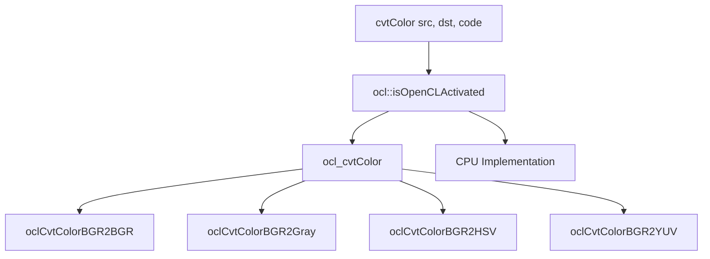
**OpenCL 颜色转换加速**

当`_src`和`_dst`是UMat对象并且OpenCL可用时，转换会在GPU上加速。 `ocl_cvtColor` 函数处理对专用 OpenCL 内核的调度。

来源：[modules/imgproc/src/color.cpp14-164](https://github.com/opencv/opencv/blob/91c78f50/modules/imgproc/src/color.cpp#L14-L164)

## 阈值操作

阈值处理通过将像素值与阈值进行比较，将灰度或彩色图像转换为二值图像。 OpenCV 提供了基本的、自适应的和自动的阈值方法。

### 阈值系统架构

```mermaid
flowchart TD
    threshold["thresholdcv::threshold()Basic thresholding"]
    adaptiveThreshold["adaptiveThresholdcv::adaptiveThreshold()Local adaptive threshold"]
    THRESH_BINARY["THRESH_BINARYval > thresh : maxval : 0"]
    THRESH_BINARY_INV["THRESH_BINARY_INVval > thresh : 0 : maxval"]
    THRESH_TRUNC["THRESH_TRUNCval > thresh : thresh : val"]
    THRESH_TOZERO["THRESH_TOZEROval > thresh : val : 0"]
    THRESH_TOZERO_INV["THRESH_TOZERO_INVval > thresh : 0 : val"]
    THRESH_OTSU["THRESH_OTSUOtsu's methodMinimize intra-class variance"]
    THRESH_TRIANGLE["THRESH_TRIANGLETriangle methodGeometric approach"]
    ADAPTIVE_THRESH_MEAN_C["ADAPTIVE_THRESH_MEAN_CMean of neighborhood"]
    ADAPTIVE_THRESH_GAUSSIAN_C["ADAPTIVE_THRESH_GAUSSIAN_CGaussian-weighted mean"]

    threshold --> THRESH_BINARY
    threshold --> THRESH_BINARY_INV
    threshold --> THRESH_TRUNC
    threshold --> THRESH_TOZERO
    threshold --> THRESH_TOZERO_INV
    threshold --> THRESH_OTSU
    threshold --> THRESH_TRIANGLE
    adaptiveThreshold --> ADAPTIVE_THRESH_MEAN_C
    adaptiveThreshold --> ADAPTIVE_THRESH_GAUSSIAN_C
```
**阈值架构**

来源：[modules/imgproc/src/thresh.cpp50-178](https://github.com/opencv/opencv/blob/91c78f50/modules/imgproc/src/thresh.cpp#L50-L178)

### 基本阈值

`threshold` 函数对每个像素应用固定阈值。

```
double threshold(InputArray src, OutputArray dst, double thresh,                 double maxval, int type)
```
**阈值类型操作**：

|类型|公式|描述|
| --- | --- | --- |
|`THRESH_BINARY`|`dst(x,y) = src(x,y) > thresh ? maxval : 0`|标准二进制阈值|
|`THRESH_BINARY_INV`|`dst(x,y) = src(x,y) > thresh ? 0 : maxval`|倒置二进制阈值|
|`THRESH_TRUNC`|`dst(x,y) = src(x,y) > thresh ? thresh : src(x,y)`|在阈值处截断|
|`THRESH_TOZERO`|`dst(x,y) = src(x,y) > thresh ? src(x,y) : 0`|设置为零低于阈值|
|`THRESH_TOZERO_INV`|`dst(x,y) = src(x,y) > thresh ? 0 : src(x,y)`|高于阈值设置为零|

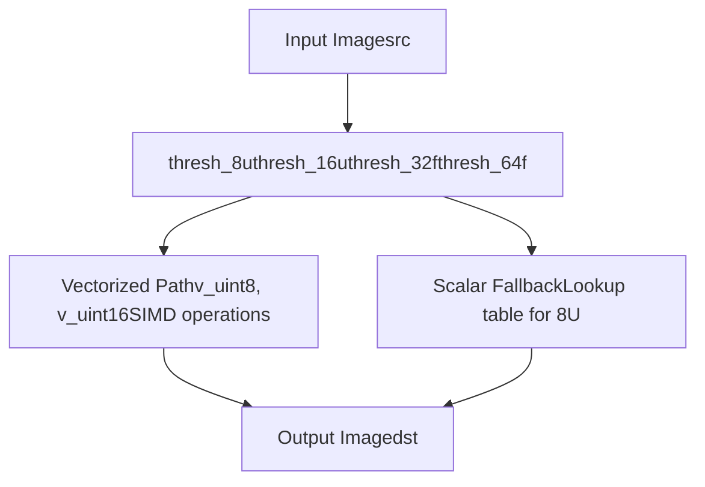
**基本阈值实施**

当可用于提高性能时，该实现使用 SIMD 指令：

- 对于`CV_8U`：带有查找表后备的矢量化操作
- 对于`CV_16U`：具有 16 位运算的 SIMD 矢量化
- 对于浮点：基于模板的通用实现

来源：[modules/imgproc/src/thresh.cpp182-390](https://github.com/opencv/opencv/blob/91c78f50/modules/imgproc/src/thresh.cpp#L182-L390)

### 自动阈值选择

自动方法根据图像直方图计算最佳阈值。

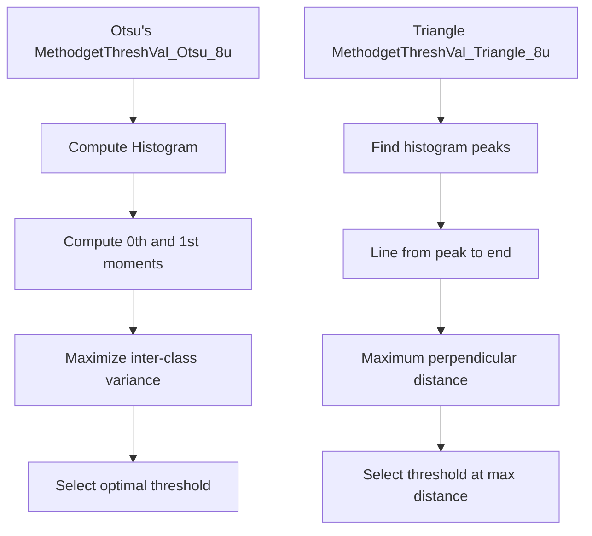
**自动阈值选择**

**大津方法** (`THRESH_OTSU`)：找到最小化类内方差（相当于最大化类间方差）的阈值。最适合双峰直方图。

**三角形法**（`THRESH_TRIANGLE`）：通过从直方图峰值到最远端构建一条线，选择最大垂直距离的点来查找阈值。

自动方法的用法：

```
// Combine with threshold type using bitwise ORdouble otsu_thresh = threshold(src, dst, 0, 255, THRESH_BINARY | THRESH_OTSU);double tri_thresh = threshold(src, dst, 0, 255, THRESH_BINARY | THRESH_TRIANGLE);
```
来源：[modules/imgproc/src/thresh.cpp690-890](https://github.com/opencv/opencv/blob/91c78f50/modules/imgproc/src/thresh.cpp#L690-L890)

### 自适应阈值

自适应阈值计算图像不同区域的局部阈值，处理不同的照明。

```
void adaptiveThreshold(InputArray src, OutputArray dst, double maxValue,                       int adaptiveMethod, int thresholdType,                       int blockSize, double C)
```
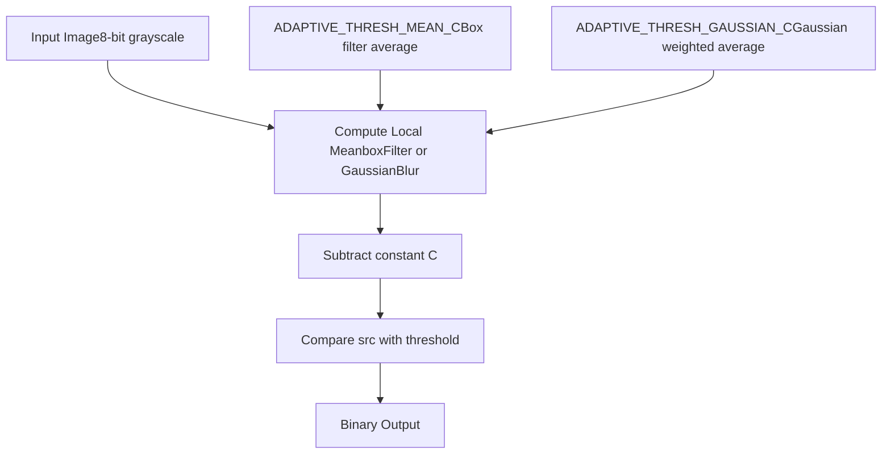
**自适应阈值方法**

|方法|描述|计算|
| --- | --- | --- |
|`ADAPTIVE_THRESH_MEAN_C`|块的平均值|`T(x,y) = mean(neighborhood) - C`|
|`ADAPTIVE_THRESH_GAUSSIAN_C`|高斯加权平均值|`T(x,y) = gaussian_mean(neighborhood) - C`|

**参数**：

- `blockSize`：像素邻域的大小（奇数）
- `C`：从计算平均值中减去常数

**用例**：自适应阈值对于具有不均匀照明的图像至关重要，在这种情况下，单个全局阈值会失败。

来源：[modules/imgproc/src/thresh.cpp890-1000](https://github.com/opencv/opencv/blob/91c78f50/modules/imgproc/src/thresh.cpp#L890-L1000)

### 实施优化

阈值实现使用各种性能优化技术。

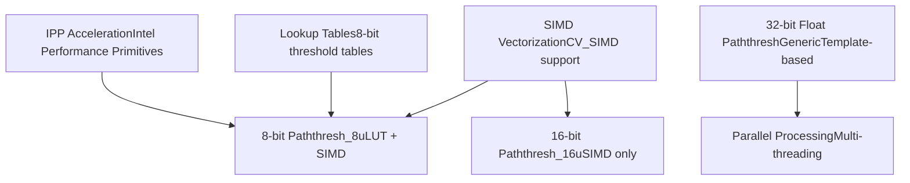
**阈值优化技术**

**SIMD 矢量化**：使用矢量指令（SSE、AVX、NEON）同时处理多个像素。于[modules/imgproc/src/thresh.cpp250-323](https://github.com/opencv/opencv/blob/91c78f50/modules/imgproc/src/thresh.cpp#L250-L323)实施

**查找表**：对于 8 位图像，预先计算标量后备路径的 256 条目表中的阈值结果。

**IPP 集成**：在可用时使用 Intel IPP 库函数，以在 Intel CPU 上实现最大性能。

来源：[modules/imgproc/src/thresh.cpp196-244](https://github.com/opencv/opencv/blob/91c78f50/modules/imgproc/src/thresh.cpp#L196-L244)[modules/imgproc/src/thresh.cpp392-520](https://github.com/opencv/opencv/blob/91c78f50/modules/imgproc/src/thresh.cpp#L392-L520)

## 与 OpenCV 加速系统集成

过滤、颜色转换和阈值操作与 OpenCV 的加速基础设施集成，可在不同的硬件平台上实现最佳性能。

### 硬件加速层集成

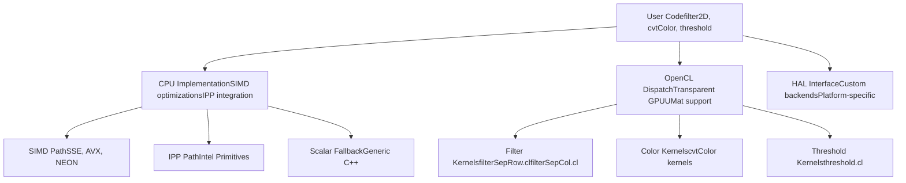
**硬件加速集成**

来源：[modules/imgproc/src/opencl/filterSepRow.cl1-28](https://github.com/opencv/opencv/blob/91c78f50/modules/imgproc/src/opencl/filterSepRow.cl#L1-L28)[modules/imgproc/src/opencl/filterSepCol.cl1-28](https://github.com/opencv/opencv/blob/91c78f50/modules/imgproc/src/opencl/filterSepCol.cl#L1-L28)[modules/imgproc/src/color.cpp14-164](https://github.com/opencv/opencv/blob/91c78f50/modules/imgproc/src/color.cpp#L14-L164)

### 性能特点

根据实施路径，不同的操作具有不同的性能特征。

|经营类别|中央处理器性能|OpenCL 的优势|笔记|
| --- | --- | --- | --- |
|**线性滤波**|高（SIMD）|高的|大内核从 GPU 中获益最多|
|**可分离过滤器**|非常高|中等的|CPU SIMD 非常有效|
|**颜色转换**|高的|中等的|内存带宽有限|
|**阈值**|非常高|低的|操作简单，CPU充足|
|**形态学**|中等的|高的|结构元素依赖|
|**双边过滤器**|低的|高的|计算密集型|

**优化指南**：

- 尽可能使用可分离滤波器（例如高斯滤波器）
- 对于大图像和复杂操作，UMat 实现透明 GPU 加速
- 简单的操作（阈值、通道操作）在 CPU 上通常速度更快
- 批处理多个操作以最大限度地减少 CPU-GPU 传输

来源：[modules/imgproc/src/filter.cpp](https://github.com/opencv/opencv/blob/91c78f50/modules/imgproc/src/filter.cpp)[modules/imgproc/src/thresh.cpp196-390](https://github.com/opencv/opencv/blob/91c78f50/modules/imgproc/src/thresh.cpp#L196-L390)

### 测试和验证

`imgproc` 模块包括用于过滤、颜色转换和阈值操作的综合测试套件。

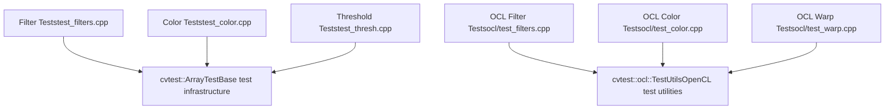
**测试基础设施**

测试套件验证：

- **正确性**：与参考实现相比的输出准确性
- **边界处理**：图像边界处的正确行为
- **数据类型支持**：所有支持的深度和通道数
- **OpenCL 奇偶校验**：GPU 结果与 CPU 结果匹配
- **性能**：优化更改的回归测试

来源：[modules/imgproc/test/ocl/test\_filters.cpp1-126](https://github.com/opencv/opencv/blob/91c78f50/modules/imgproc/test/ocl/test_filters.cpp#L1-L126)[modules/imgproc/test/ocl/test\_color.cpp1-127](https://github.com/opencv/opencv/blob/91c78f50/modules/imgproc/test/ocl/test_color.cpp#L1-L127)[modules/imgproc/test/test\_thresh.cpp1-62](https://github.com/opencv/opencv/blob/91c78f50/modules/imgproc/test/test_thresh.cpp#L1-L62)

## 硬件加速集成

`imgproc` 模块与 OpenCV 的硬件加速层 (HAL) 集成，为支持的操作提供透明加速，同时保持 API 一致性。

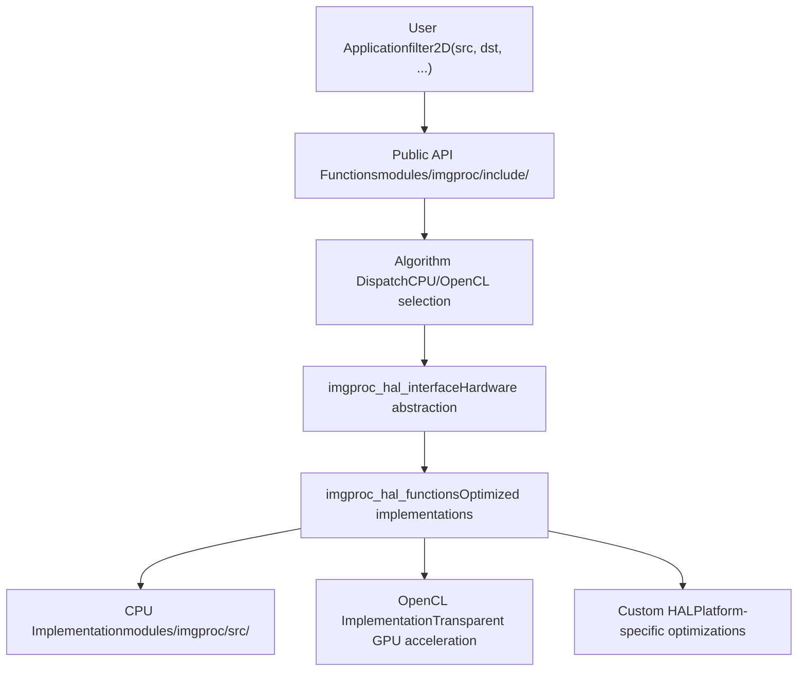
**硬件加速架构**

### HAL 集成点

|成分|目的|地点|
| --- | --- | --- |
|`imgproc_hal_interface`|硬件抽象定义|[modules/imgproc/include/opencv2/imgproc.hpp196](https://github.com/opencv/opencv/blob/91c78f50/modules/imgproc/include/opencv2/imgproc.hpp#L196-L196)|
|`imgproc_hal_functions`|优化功能实现|实施文件|
|**调度逻辑**|运行时后端选择|内部算法路由|
|**后备系统**|CPU执行保证|始终可用的基线|

HAL 系统允许透明地利用相同的 API 调用：

- **CPU 优化**（SIMD、矢量化）
- **OpenCL 加速**（GPU 计算）
- **自定义 HAL 实现**（特定于供应商的优化）

来源：[modules/imgproc/include/opencv2/imgproc.hpp193-197](https://github.com/opencv/opencv/blob/91c78f50/modules/imgproc/include/opencv2/imgproc.hpp#L193-L197)[modules/core/include/opencv2/core.hpp](https://github.com/opencv/opencv/blob/91c78f50/modules/core/include/opencv2/core.hpp)
