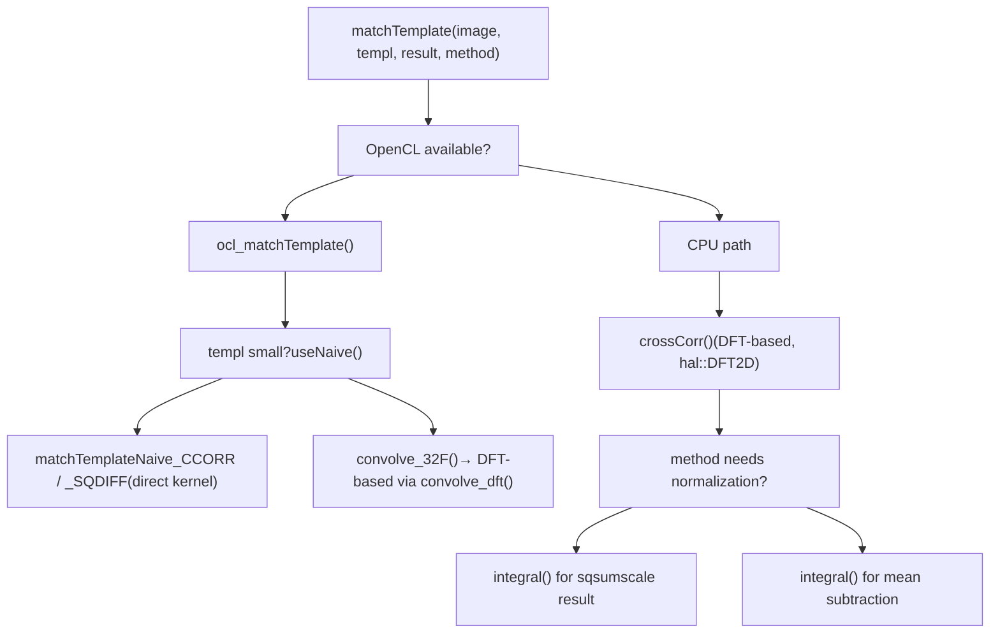
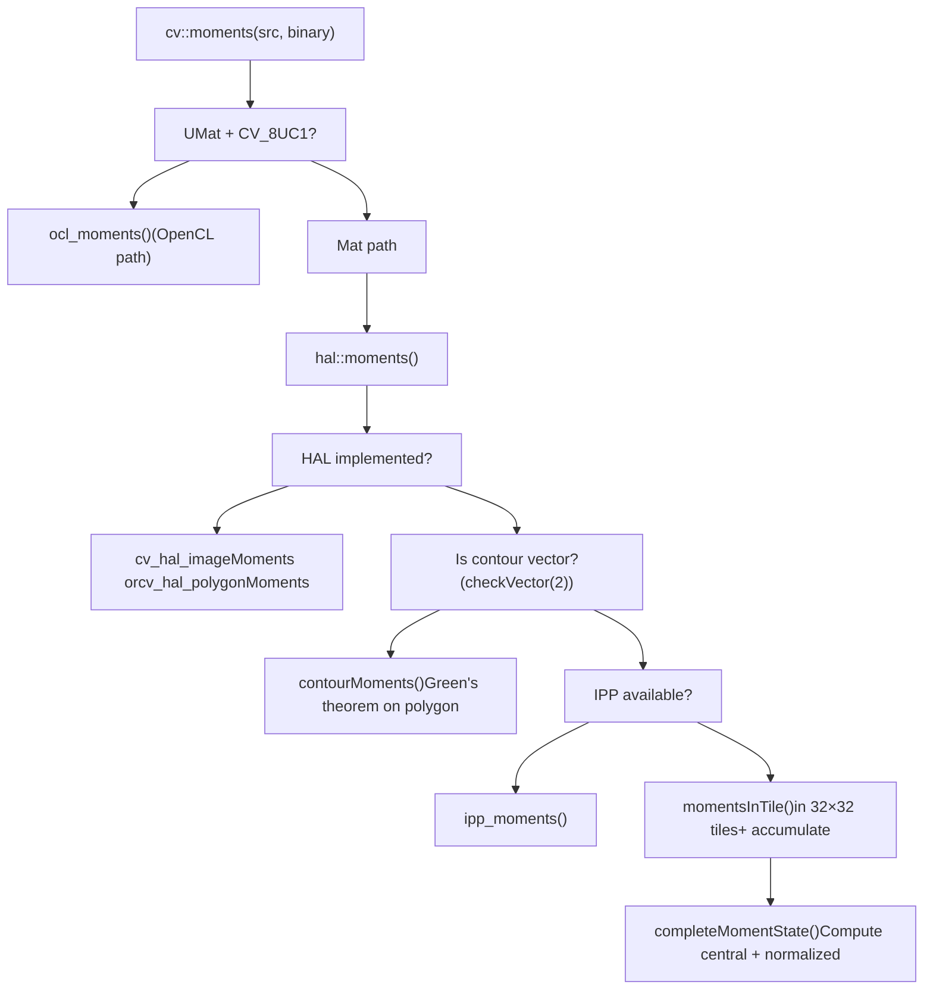
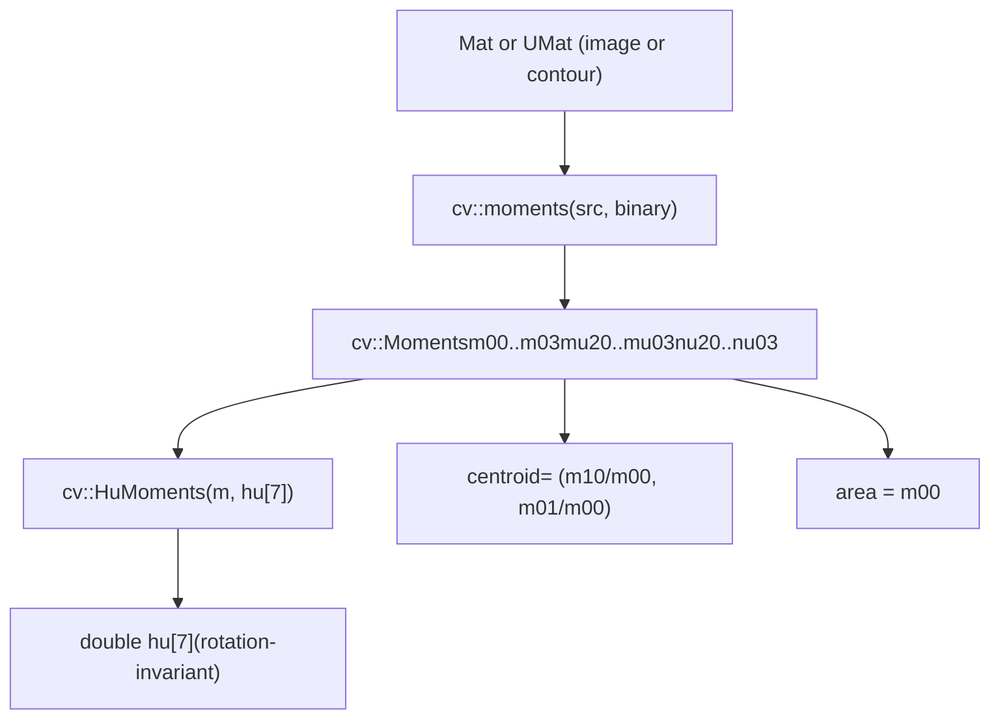
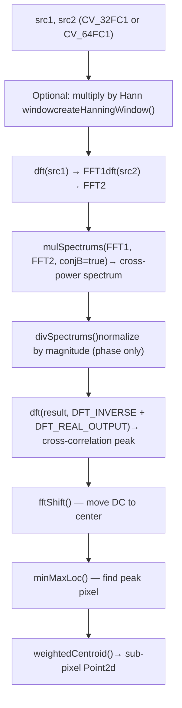

# 阈值、模板匹配和矩

相关源文件

-   [modules/core/src/opencl/convert.cl](https://github.com/opencv/opencv/blob/91c78f50/modules/core/src/opencl/convert.cl)
-   [modules/core/src/opencl/copymakeborder.cl](https://github.com/opencv/opencv/blob/91c78f50/modules/core/src/opencl/copymakeborder.cl)
-   [modules/core/test/ocl/test\_matrix\_operation.cpp](https://github.com/opencv/opencv/blob/91c78f50/modules/core/test/ocl/test_matrix_operation.cpp)
-   [modules/imgproc/perf/opencl/perf\_blend.cpp](https://github.com/opencv/opencv/blob/91c78f50/modules/imgproc/perf/opencl/perf_blend.cpp)
-   [modules/imgproc/perf/opencl/perf\_filters.cpp](https://github.com/opencv/opencv/blob/91c78f50/modules/imgproc/perf/opencl/perf_filters.cpp)
-   [modules/imgproc/perf/opencl/perf\_imgproc.cpp](https://github.com/opencv/opencv/blob/91c78f50/modules/imgproc/perf/opencl/perf_imgproc.cpp)
-   [modules/imgproc/perf/opencl/perf\_matchTemplate.cpp](https://github.com/opencv/opencv/blob/91c78f50/modules/imgproc/perf/opencl/perf_matchTemplate.cpp)
-   [modules/imgproc/perf/perf\_phasecorr.cpp](https://github.com/opencv/opencv/blob/91c78f50/modules/imgproc/perf/perf_phasecorr.cpp)
-   [modules/imgproc/src/blend.cpp](https://github.com/opencv/opencv/blob/91c78f50/modules/imgproc/src/blend.cpp)
-   [modules/imgproc/src/filterengine.hpp](https://github.com/opencv/opencv/blob/91c78f50/modules/imgproc/src/filterengine.hpp)
-   [modules/imgproc/src/moments.cpp](https://github.com/opencv/opencv/blob/91c78f50/modules/imgproc/src/moments.cpp)
-   [modules/imgproc/src/opencl/accumulate.cl](https://github.com/opencv/opencv/blob/91c78f50/modules/imgproc/src/opencl/accumulate.cl)
-   [modules/imgproc/src/opencl/blend\_linear.cl](https://github.com/opencv/opencv/blob/91c78f50/modules/imgproc/src/opencl/blend_linear.cl)
-   [modules/imgproc/src/opencl/boxFilter.cl](https://github.com/opencv/opencv/blob/91c78f50/modules/imgproc/src/opencl/boxFilter.cl)
-   [modules/imgproc/src/opencl/boxFilter3x3.cl](https://github.com/opencv/opencv/blob/91c78f50/modules/imgproc/src/opencl/boxFilter3x3.cl)
-   [modules/imgproc/src/opencl/calc\_back\_project.cl](https://github.com/opencv/opencv/blob/91c78f50/modules/imgproc/src/opencl/calc_back_project.cl)
-   [modules/imgproc/src/opencl/canny.cl](https://github.com/opencv/opencv/blob/91c78f50/modules/imgproc/src/opencl/canny.cl)
-   [modules/imgproc/src/opencl/filter2D.cl](https://github.com/opencv/opencv/blob/91c78f50/modules/imgproc/src/opencl/filter2D.cl)
-   [modules/imgproc/src/opencl/integral\_sum.cl](https://github.com/opencv/opencv/blob/91c78f50/modules/imgproc/src/opencl/integral_sum.cl)
-   [modules/imgproc/src/opencl/match\_template.cl](https://github.com/opencv/opencv/blob/91c78f50/modules/imgproc/src/opencl/match_template.cl)
-   [modules/imgproc/src/opencl/medianFilter.cl](https://github.com/opencv/opencv/blob/91c78f50/modules/imgproc/src/opencl/medianFilter.cl)
-   [modules/imgproc/src/opencl/moments.cl](https://github.com/opencv/opencv/blob/91c78f50/modules/imgproc/src/opencl/moments.cl)
-   [modules/imgproc/src/phasecorr.cpp](https://github.com/opencv/opencv/blob/91c78f50/modules/imgproc/src/phasecorr.cpp)
-   [modules/imgproc/src/templmatch.cpp](https://github.com/opencv/opencv/blob/91c78f50/modules/imgproc/src/templmatch.cpp)
-   [modules/imgproc/src/thresh.cpp](https://github.com/opencv/opencv/blob/91c78f50/modules/imgproc/src/thresh.cpp)
-   [modules/imgproc/test/ocl/test\_accumulate.cpp](https://github.com/opencv/opencv/blob/91c78f50/modules/imgproc/test/ocl/test_accumulate.cpp)
-   [modules/imgproc/test/ocl/test\_blend.cpp](https://github.com/opencv/opencv/blob/91c78f50/modules/imgproc/test/ocl/test_blend.cpp)
-   [modules/imgproc/test/ocl/test\_boxfilter.cpp](https://github.com/opencv/opencv/blob/91c78f50/modules/imgproc/test/ocl/test_boxfilter.cpp)
-   [modules/imgproc/test/ocl/test\_canny.cpp](https://github.com/opencv/opencv/blob/91c78f50/modules/imgproc/test/ocl/test_canny.cpp)
-   [modules/imgproc/test/ocl/test\_filter2d.cpp](https://github.com/opencv/opencv/blob/91c78f50/modules/imgproc/test/ocl/test_filter2d.cpp)
-   [modules/imgproc/test/ocl/test\_histogram.cpp](https://github.com/opencv/opencv/blob/91c78f50/modules/imgproc/test/ocl/test_histogram.cpp)
-   [modules/imgproc/test/ocl/test\_imgproc.cpp](https://github.com/opencv/opencv/blob/91c78f50/modules/imgproc/test/ocl/test_imgproc.cpp)
-   [modules/imgproc/test/ocl/test\_match\_template.cpp](https://github.com/opencv/opencv/blob/91c78f50/modules/imgproc/test/ocl/test_match_template.cpp)
-   [modules/imgproc/test/ocl/test\_medianfilter.cpp](https://github.com/opencv/opencv/blob/91c78f50/modules/imgproc/test/ocl/test_medianfilter.cpp)
-   [modules/imgproc/test/ocl/test\_sepfilter2d.cpp](https://github.com/opencv/opencv/blob/91c78f50/modules/imgproc/test/ocl/test_sepfilter2d.cpp)
-   [modules/imgproc/test/test\_canny.cpp](https://github.com/opencv/opencv/blob/91c78f50/modules/imgproc/test/test_canny.cpp)
-   [modules/imgproc/test/test\_moments.cpp](https://github.com/opencv/opencv/blob/91c78f50/modules/imgproc/test/test_moments.cpp)
-   [modules/imgproc/test/test\_pc.cpp](https://github.com/opencv/opencv/blob/91c78f50/modules/imgproc/test/test_pc.cpp)
-   [modules/imgproc/test/test\_templmatch.cpp](https://github.com/opencv/opencv/blob/91c78f50/modules/imgproc/test/test_templmatch.cpp)
-   [modules/imgproc/test/test\_templmatchmask.cpp](https://github.com/opencv/opencv/blob/91c78f50/modules/imgproc/test/test_templmatchmask.cpp)
-   [modules/imgproc/test/test\_thresh.cpp](https://github.com/opencv/opencv/blob/91c78f50/modules/imgproc/test/test_thresh.cpp)

本页涵盖了`opencv_imgproc`中的三个相关的像素级和区域级分析子系统：`threshold`函数（包括Otsu自动阈值选择）、`matchTemplate`函数（所有六种比较方法）、`moments`和`HuMoments`函数以及用于子像素图像配准的`phaseCorrelate`。所有这些都是`imgproc`模块的一部分。

对于过滤和颜色转换（Canny、高斯模糊等），请参阅[4.2](/opencv/opencv/4.2-filtering-and-color-conversion)。对于消耗力矩输出的轮廓查找和结构分析，请参见[4.4](/opencv/opencv/4.4-drawing-contours-and-structural-analysis)。

---

## 阈值

＃＃＃ 概述

入口点是`cv::threshold`，在[modules/imgproc/src/thresh.cpp](https://github.com/opencv/opencv/blob/91c78f50/modules/imgproc/src/thresh.cpp)中实现，它根据标量阈值对源图像中的每个像素进行分类，并将结果写入相同类型的目标图像。

函数签名是：

```
double cv::threshold(InputArray src, OutputArray dst,
                     double thresh, double maxval, int type)
```
`type`参数是基本阈值类型和可选标志（`THRESH_OTSU`，`THRESH_TRIANGLE`）的组合。返回值是大津或三角模式激活时计算出的阈值；否则它会回显输入`thresh`。

### 阈值类型

|持续的|像素法则|适用于|
| --- | --- | --- |
|`THRESH_BINARY`|`dst = src > thresh ? maxval : 0`|所有支持的深度|
|`THRESH_BINARY_INV`|`dst = src <= thresh ? maxval : 0`|所有支持的深度|
|`THRESH_TRUNC`|`dst = min(src, thresh)`|所有支持的深度|
|`THRESH_TOZERO`|`dst = src > thresh ? src : 0`|所有支持的深度|
|`THRESH_TOZERO_INV`|`dst = src <= thresh ? src : 0`|所有支持的深度|

每像素逻辑由 [modules/imgproc/src/thresh.cpp51-78](https://github.com/opencv/opencv/blob/91c78f50/modules/imgproc/src/thresh.cpp#L51-L78) 处的内联模板 `threshBinary`、`threshBinaryInv`、`threshTrunc`、`threshToZero` 和 `threshToZeroInv` 实现

### 支持的数据类型和调度

顶级调度程序（大约[modules/imgproc/src/thresh.cpp1040-1130](https://github.com/opencv/opencv/blob/91c78f50/modules/imgproc/src/thresh.cpp#L1040-L1130)）路由到五个特定于类型的内部函数之一：

- `thresh_8u` — `uchar`，使用 256 项查找表进行标量后备； SIMD 加速
- `thresh_16u` — `ushort`，SIMD 加速
- `thresh_16s` — `short`，SIMD 通过 IPP 快速路径加速
- `thresh_32f` — `float`，SIMD 通过 IPP 快速路径加速
- `thresh_64f` — `double`，SIMD 加速（如果可用）

对于`uchar`，标量回退预先计算一个 256 个条目的查找表（参见[modules/imgproc/src/thresh.cpp328-389](https://github.com/opencv/opencv/blob/91c78f50/modules/imgproc/src/thresh.cpp#L328-L389)），允许每个像素进行单个表查找而无需分支。

SIMD 路径使用通用内在函数层（`v_uint8`、`v_int16`、`v_float32` 等），因此相同的源根据构建目标编译为 SSE、AVX、NEON 或 RVV。有关内在函数抽象，请参阅第 [3.5](/opencv/opencv/3.5-simd-intrinsics-and-cpu-dispatching) 页。

### 大津自动阈值选择

当`type`包含`THRESH_OTSU`时，在应用阈值操作之前根据图像直方图自动计算阈值。此模式仅限于`CV_8U`和`CV_16U`单通道输入。

Otsu 算法最大化前景和背景像素类之间的类间方差。该实现扫描直方图并找到最大化的强度`t`：

```
sigma²_B(t) = q1(t) * q2(t) * (mu1(t) - mu2(t))²
```
计算出的 `t` 作为函数的返回值返回，然后应用于所选的基本阈值类型。

**三角形法** (`THRESH_TRIANGLE`) 是单峰直方图的另一种自动模式，通过从直方图曲线到连接直方图端点的线的最大垂直距离来选择阈值。

来源：[modules/imgproc/src/thresh.cpp1040-1400](https://github.com/opencv/opencv/blob/91c78f50/modules/imgproc/src/thresh.cpp#L1040-L1400)[modules/imgproc/test/test\_thresh.cpp142-189](https://github.com/opencv/opencv/blob/91c78f50/modules/imgproc/test/test_thresh.cpp#L142-L189)

### OpenCL 加速

当输入为 PH0 时，该函数会在回退到 CPU 之前尝试 OpenCL 路径。 OpenCL 内核是从`thresh.cl`（称为`opencl_kernels_imgproc.hpp`）编译的，并跨工作项并行处理相同的五种阈值类型。

---

## 模板匹配

＃＃＃ 概述

`cv::matchTemplate` 将模板图像滑动到源图像上，并计算每个有效位置的比较分数。结果是大小为 PH2 的单通道 PH1 矩阵，其中 PH3 是图像大小， PH4 是模板大小。

实施：[modules/imgproc/src/templmatch.cpp](https://github.com/opencv/opencv/blob/91c78f50/modules/imgproc/src/templmatch.cpp)

```
void cv::matchTemplate(InputArray image, InputArray templ,
                       OutputArray result, int method,
                       InputArray mask = noArray())
```
### 比较方法

|持续的|价值|公式|最佳匹配|
| --- | --- | --- | --- |
|`TM_SQDIFF`| 0 |`Σ(I(x,y) - T(x,y))²`|最低限度|
|`TM_SQDIFF_NORMED`| 1 |归一化平方差|最小值 → 0|
|`TM_CCORR`| 2 |`Σ I(x,y)·T(x,y)`|最大限度|
|`TM_CCORR_NORMED`| 3 |归一化互相关|最大值 → 1|
|`TM_CCOEFF`| 4 |`Σ (I - Ī)·(T - T̄)`|最大限度|
|`TM_CCOEFF_NORMED`| 5 |归一化系数|最大值 → 1|

### 计算策略：DFT 与 Naive

**图：matchTemplate计算流程**


来源：[modules/imgproc/src/templmatch.cpp111-560](https://github.com/opencv/opencv/blob/91c78f50/modules/imgproc/src/templmatch.cpp#L111-L560)

基于 DFT 的核心卷积函数是 `crossCorr` ([modules/imgproc/src/templmatch.cpp566-760](https://github.com/opencv/opencv/blob/91c78f50/modules/imgproc/src/templmatch.cpp#L566-L760))。它：

1. 计算模板的 DFT（每个通道）。
2. 使用 `hal::DFT2D` 对象处理图块中的图像（`cF` 为正向，`cR` 为反向）。
3. 将光谱与`mulSpectrums`相乘（共轭相乘产生互相关）。
4. 将实际输出累加到结果矩阵中。

块大小源自通过 `blockScale = 4.5` 缩放的模板大小，最小为 256 像素，通过 `getOptimalDFTSize` 四舍五入到最佳 DFT 大小。

### 通过积分图像标准化

标准化方法需要在每个模板窗口下计算`Σ I²`。使用 `integral()` 构建平方和积分图像即可完成此操作。对于任何窗口位置`(x, y)`，窗口平方和是通过四次查找积分图像来检索的。

对于`TM_CCOEFF`及其标准化变体，还使用总和积分图像减去窗口下的图像平均值。

### 屏蔽模板匹配

当提供`mask`时，`matchTemplateMask`（[modules/imgproc/src/templmatch.cpp762-870](https://github.com/opencv/opencv/blob/91c78f50/modules/imgproc/src/templmatch.cpp#L762-L870)）单独处理计算。蒙版匹配：

- 将所有输入转换为`CV_32F`。
- 在计算每个方法的分数之前，对图像补丁和模板应用按元素屏蔽。
- 不使用 OpenCL 路径（回退到 CPU）。

### OpenCL 内核详细信息

OpenCL 内核位于 [modules/imgproc/src/opencl/match\_template.cl](https://github.com/opencv/opencv/blob/91c78f50/modules/imgproc/src/opencl/match_template.cl) 它们是使用预处理器标志进行有条件编译的：

|编译标志|核心|目的|
| --- | --- | --- |
|`CCORR`|`matchTemplate_Naive_CCORR`|小模板的直接 CCORR|
|`CCORR_NORMED`|`matchTemplate_CCORR_NORMED`|通过 sqsum 查找进行标准化|
|`SQDIFF`|`matchTemplate_Naive_SQDIFF`|对于小模板直接 SQDIFF|
|`SQDIFF_PREPARED`|`matchTemplate_Prepared_SQDIFF`|来自预先计算的 CCORR 的 SQDIFF|
|`SQDIFF_NORMED`|`matchTemplate_SQDIFF_NORMED`|标准化 SQDIFF|
|`CCOEFF`|`matchTemplate_Prepared_CCOEFF`|从 CCORR 中减去平均值|
|`CCOEFF_NORMED`|`matchTemplate_CCOEFF_NORMED`|完全归一化的 CCOEFF|
|`CALC_SUM`|`calcSum`|总和模板像素（用于 sqsum）|

对于非朴素方法，GPU 路径首先调用 `matchTemplate(..., TM_CCORR)` 来计算互相关，然后应用第二个内核来执行归一化或均值减法。

来源：[modules/imgproc/src/templmatch.cpp543-560](https://github.com/opencv/opencv/blob/91c78f50/modules/imgproc/src/templmatch.cpp#L543-L560)[modules/imgproc/src/opencl/match\_template.cl77-450](https://github.com/opencv/opencv/blob/91c78f50/modules/imgproc/src/opencl/match_template.cl#L77-L450)

---

## 图像时刻

### `Moments` 结构

`cv::Moments` ([modules/imgproc/src/moments.cpp360-395](https://github.com/opencv/opencv/blob/91c78f50/modules/imgproc/src/moments.cpp#L360-L395)) 成立：

- **空间时刻** `m00`、`m10`、`m01`、`m20`、`m11`、`m02`、`m30`、`m21`、`m12`、`m03`
- **核心时刻** `mu20`、`mu11`、`mu02`、`mu30`、`mu21`、`mu12`、`mu03`
- **归一化中心矩** `nu20`、`nu11`、`nu02`、`nu30`、`nu21`、`nu12`、`nu03`

阶空间矩`(p, q)`定义为：

```
m_pq = Σ_x Σ_y x^p · y^q · I(x, y)
```
中心矩是平移不变的，相对于质心`(cx, cy) = (m10/m00, m01/m00)`计算。归一化中心矩另外具有尺度不变性，除以`m00^((p+q)/2+1)`。

### `cv::moments()` — 调度链

**图：moments()执行调度**


来源：[modules/imgproc/src/moments.cpp595-706](https://github.com/opencv/opencv/blob/91c78f50/modules/imgproc/src/moments.cpp#L595-L706)

### 平铺光栅计算

对于光栅图像，`cv::moments`以 32×32 像素图块处理图像，以将中间值保留在缓存中。 `momentsInTile` 模板函数 ([modules/imgproc/src/moments.cpp314-356](https://github.com/opencv/opencv/blob/91c78f50/modules/imgproc/src/moments.cpp#L314-L356)) 使用逐行求和计算每个图块内的 10 个原始空间矩，`MomentsInTile_SIMD` 专门化为 `uchar` 和 `ushort` 输入提供 SIMD 加速。

在每个图块之后，使用多项式偏移将每个图块的矩累积成全局矩，以说明图块的 `(x, y)` 原点。累积公式（例如，`m10_global = m10_tile + x * m00_tile`）适用于[modules/imgproc/src/moments.cpp668-700](https://github.com/opencv/opencv/blob/91c78f50/modules/imgproc/src/moments.cpp#L668-L700) 处的所有 10 个时刻

一旦所有图块都累积起来，函数`completeMomentState`（[modules/imgproc/src/moments.cpp50-91](https://github.com/opencv/opencv/blob/91c78f50/modules/imgproc/src/moments.cpp#L50-L91)）就会从空间矩中导出中心矩和归一化矩。

### 轮廓时刻

当`cv::moments`的输入是轮廓（通过`checkVector(2)`检测到的2D点向量）时，该函数调用`contourMoments`（[modules/imgproc/src/moments.cpp95-200](https://github.com/opencv/opencv/blob/91c78f50/modules/imgproc/src/moments.cpp#L95-L200)）。这应用格林定理来计算来自多边形边界的精确矩，而无需光栅化。整数 (`CV_32S`) 和浮点 (`CV_32F`) 点类型均被处理。

### OpenCL 时刻

OpenCL 路径（`ocl_moments`、[modules/imgproc/src/moments.cpp399-472](https://github.com/opencv/opencv/blob/91c78f50/modules/imgproc/src/moments.cpp#L399-L472)）将图像划分为 32×32 块，每个块由内核中位于 [modules/imgproc/src/opencl/moments.cl](https://github.com/opencv/opencv/blob/91c78f50/modules/imgproc/src/opencl/moments.cl) 的单个工作组处理，每个组将 10 个 `int` 累加器值写入缓冲区。然后，CPU 读取缓冲区并使用 CPU 平铺路径中使用的相同多项式偏移逻辑来累积每个平铺的贡献。

### `cv::HuMoments`

`HuMoments` ([modules/imgproc/src/moments.cpp709-746](https://github.com/opencv/opencv/blob/91c78f50/modules/imgproc/src/moments.cpp#L709-L746)) 从归一化中心矩导出七个旋转不变描述符。这些是经典的 Hu 不变矩。该函数接受 `Moments` 结构体并写入 `double[7]` 数组或 `OutputArray`。

七个 Hu 矩由 `nu20`、`nu11`、`nu02`、`nu30`、`nu21`、`nu12`、`nu03` 的组合计算得出。它们对于平移、缩放和旋转具有不变性，因此无论姿势如何，它们都可用于形状识别。

**图表：Moments API 和数据流**


来源：[modules/imgproc/src/moments.cpp709-746](https://github.com/opencv/opencv/blob/91c78f50/modules/imgproc/src/moments.cpp#L709-L746)[modules/imgproc/src/moments.cpp360-395](https://github.com/opencv/opencv/blob/91c78f50/modules/imgproc/src/moments.cpp#L360-L395)

---

## 相位相关

＃＃＃ 概述

`cv::phaseCorrelate` ([modules/imgproc/src/phasecorr.cpp519-620](https://github.com/opencv/opencv/blob/91c78f50/modules/imgproc/src/phasecorr.cpp#L519-L620)) 使用相位相关算法以亚像素精度估计两幅图像之间的平移位移。

```
Point2d cv::phaseCorrelate(InputArray src1, InputArray src2,
                            InputArray window = noArray(),
                            double* response = nullptr)
```
两个输入都必须是`CV_32FC1`或`CV_64FC1`。可选的 Hann 窗可以通过 `createHanningWindow` 预先计算并作为 `window` 传递以抑制频谱泄漏。

＃＃＃ 算法

**图表：相位相关管道**


来源：[modules/imgproc/src/phasecorr.cpp519-620](https://github.com/opencv/opencv/blob/91c78f50/modules/imgproc/src/phasecorr.cpp#L519-L620)

### 关键辅助函数

|功能|文件|目的|
| --- | --- | --- |
|`divSpectrums`|[phasecorr.cpp162-357](https://github.com/opencv/opencv/blob/91c78f50/phasecorr.cpp#L162-L357)|逐元素复数除法；将互功率谱归一化为单位幅度|
|`fftShift`|[phasecorr.cpp360-435](https://github.com/opencv/opencv/blob/91c78f50/phasecorr.cpp#L360-L435)|重新排列象限，将 DC 置于频谱阵列的中心|
|`weightedCentroid`|[phasecorr.cpp437-515](https://github.com/opencv/opencv/blob/91c78f50/phasecorr.cpp#L437-L515)|计算峰值周围邻域的强度加权质心；返回子像素位置和可选的响应强度|
|`magSpectrums`|[phasecorr.cpp46-160](https://github.com/opencv/opencv/blob/91c78f50/phasecorr.cpp#L46-L160)|计算复杂频谱的幅度（内部使用）|

`divSpectrums` 将 `FLT_EPSILON` 或 `DBL_EPSILON` 添加到分母以防止被零除。对于相位相关中使用的共轭情况 (`conjB=true`)，它计算`(A · conj(B)) / |A · conj(B)|`。

`weightedCentroid` 函数将搜索框剪切到图像边界并计算：

```
centroid.x = Σ x·I(x,y) / Σ I(x,y)
centroid.y = Σ y·I(x,y) / Σ I(x,y)
```
在检测到的峰值周围的一个小邻域上，提供子像素移位估计。

---

## 加速总结

|功能|CPU单指令多数据流|独立聚丙烯|OpenCL|
| --- | --- | --- | --- |
|`threshold` (8u)|是的 — `thresh_8u`|部分（TRUNC、TOZERO）|是的|
|`threshold` (16s/32f)|是的|部分的|是的|
|`matchTemplate`（所有方法）|否（使用 DFT）|不|是的 — `match_template.cl` 中有 6 个内核|
|`moments` (CV\_8UC1)|是（SIMD 块）|是的|是的 — `moments.cl`|
|`moments`（其他）|是（SIMD 块）|部分的|不|
|`phaseCorrelate`|继承于`dft`|继承|没有直接内核|

来源：[modules/imgproc/src/thresh.cpp196-244](https://github.com/opencv/opencv/blob/91c78f50/modules/imgproc/src/thresh.cpp#L196-L244)[modules/imgproc/src/templmatch.cpp543-560](https://github.com/opencv/opencv/blob/91c78f50/modules/imgproc/src/templmatch.cpp#L543-L560)[modules/imgproc/src/moments.cpp609-637](https://github.com/opencv/opencv/blob/91c78f50/modules/imgproc/src/moments.cpp#L609-L637)
