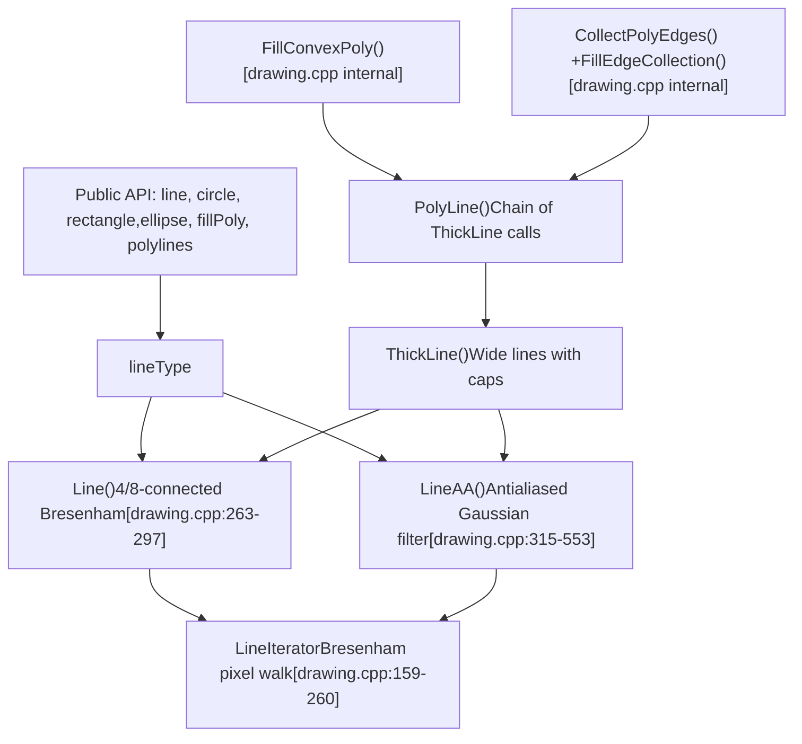
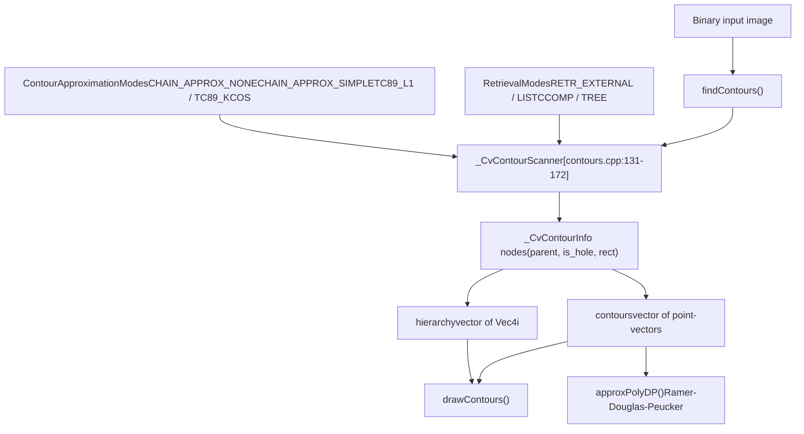
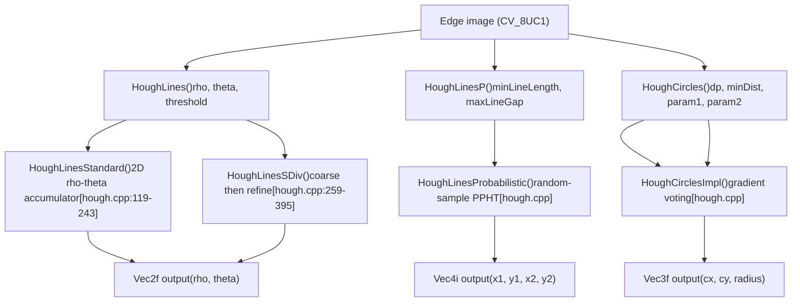
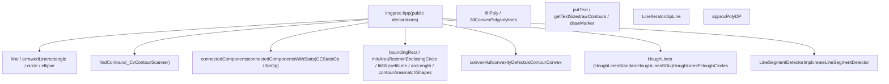

# 绘图、轮廓和结构分析

相关源文件

-   [cmake/OpenCVBindingsPreprocessorDefinitions.cmake](https://github.com/opencv/opencv/blob/91c78f50/cmake/OpenCVBindingsPreprocessorDefinitions.cmake)
-   [cmake/platforms/OpenCV-Emscripten.cmake](https://github.com/opencv/opencv/blob/91c78f50/cmake/platforms/OpenCV-Emscripten.cmake)
-   [cmake/vars/EnableModeVars.cmake](https://github.com/opencv/opencv/blob/91c78f50/cmake/vars/EnableModeVars.cmake)
-   [cmake/vars/OPENCV\_SEMIHOSTING.cmake](https://github.com/opencv/opencv/blob/91c78f50/cmake/vars/OPENCV_SEMIHOSTING.cmake)
-   [doc/js\_tutorials/js\_setup/js\_setup/js\_setup.markdown](https://github.com/opencv/opencv/blob/91c78f50/doc/js_tutorials/js_setup/js_setup/js_setup.markdown?plain=1)
-   [doc/opencv.bib](https://github.com/opencv/opencv/blob/91c78f50/doc/opencv.bib)
-   [modules/calib3d/doc/calib3d.bib](https://github.com/opencv/opencv/blob/91c78f50/modules/calib3d/doc/calib3d.bib)
-   [modules/calib3d/doc/solvePnP.markdown](https://github.com/opencv/opencv/blob/91c78f50/modules/calib3d/doc/solvePnP.markdown?plain=1)
-   [modules/calib3d/include/opencv2/calib3d.hpp](https://github.com/opencv/opencv/blob/91c78f50/modules/calib3d/include/opencv2/calib3d.hpp)
-   [modules/calib3d/misc/js/gen\_dict.json](https://github.com/opencv/opencv/blob/91c78f50/modules/calib3d/misc/js/gen_dict.json)
-   [modules/calib3d/perf/perf\_pnp.cpp](https://github.com/opencv/opencv/blob/91c78f50/modules/calib3d/perf/perf_pnp.cpp)
-   [modules/calib3d/perf/perf\_stereosgbm.cpp](https://github.com/opencv/opencv/blob/91c78f50/modules/calib3d/perf/perf_stereosgbm.cpp)
-   [modules/calib3d/src/ap3p.cpp](https://github.com/opencv/opencv/blob/91c78f50/modules/calib3d/src/ap3p.cpp)
-   [modules/calib3d/src/ap3p.h](https://github.com/opencv/opencv/blob/91c78f50/modules/calib3d/src/ap3p.h)
-   [modules/calib3d/src/dls.cpp](https://github.com/opencv/opencv/blob/91c78f50/modules/calib3d/src/dls.cpp)
-   [modules/calib3d/src/dls.h](https://github.com/opencv/opencv/blob/91c78f50/modules/calib3d/src/dls.h)
-   [modules/calib3d/src/epnp.cpp](https://github.com/opencv/opencv/blob/91c78f50/modules/calib3d/src/epnp.cpp)
-   [modules/calib3d/src/epnp.h](https://github.com/opencv/opencv/blob/91c78f50/modules/calib3d/src/epnp.h)
-   [modules/calib3d/src/ippe.cpp](https://github.com/opencv/opencv/blob/91c78f50/modules/calib3d/src/ippe.cpp)
-   [modules/calib3d/src/p3p.cpp](https://github.com/opencv/opencv/blob/91c78f50/modules/calib3d/src/p3p.cpp)
-   [modules/calib3d/src/p3p.h](https://github.com/opencv/opencv/blob/91c78f50/modules/calib3d/src/p3p.h)
-   [modules/calib3d/src/solvepnp.cpp](https://github.com/opencv/opencv/blob/91c78f50/modules/calib3d/src/solvepnp.cpp)
-   [modules/calib3d/test/test\_solvepnp\_ransac.cpp](https://github.com/opencv/opencv/blob/91c78f50/modules/calib3d/test/test_solvepnp_ransac.cpp)
-   [modules/core/misc/js/gen\_dict.json](https://github.com/opencv/opencv/blob/91c78f50/modules/core/misc/js/gen_dict.json)
-   [modules/core/perf/perf\_mat.cpp](https://github.com/opencv/opencv/blob/91c78f50/modules/core/perf/perf_mat.cpp)
-   [modules/dnn/misc/js/gen\_dict.json](https://github.com/opencv/opencv/blob/91c78f50/modules/dnn/misc/js/gen_dict.json)
-   [modules/features2d/misc/js/gen\_dict.json](https://github.com/opencv/opencv/blob/91c78f50/modules/features2d/misc/js/gen_dict.json)
-   [modules/features2d/perf/perf\_batchDistance.cpp](https://github.com/opencv/opencv/blob/91c78f50/modules/features2d/perf/perf_batchDistance.cpp)
-   [modules/imgproc/include/opencv2/imgproc.hpp](https://github.com/opencv/opencv/blob/91c78f50/modules/imgproc/include/opencv2/imgproc.hpp)
-   [modules/imgproc/include/opencv2/imgproc/imgproc\_c.h](https://github.com/opencv/opencv/blob/91c78f50/modules/imgproc/include/opencv2/imgproc/imgproc_c.h)
-   [modules/imgproc/misc/java/test/ImgprocTest.java](https://github.com/opencv/opencv/blob/91c78f50/modules/imgproc/misc/java/test/ImgprocTest.java)
-   [modules/imgproc/misc/js/gen\_dict.json](https://github.com/opencv/opencv/blob/91c78f50/modules/imgproc/misc/js/gen_dict.json)
-   [modules/imgproc/perf/perf\_blur.cpp](https://github.com/opencv/opencv/blob/91c78f50/modules/imgproc/perf/perf_blur.cpp)
-   [modules/imgproc/perf/perf\_houghcircles.cpp](https://github.com/opencv/opencv/blob/91c78f50/modules/imgproc/perf/perf_houghcircles.cpp)
-   [modules/imgproc/perf/perf\_houghlines.cpp](https://github.com/opencv/opencv/blob/91c78f50/modules/imgproc/perf/perf_houghlines.cpp)
-   [modules/imgproc/src/\_geom.h](https://github.com/opencv/opencv/blob/91c78f50/modules/imgproc/src/_geom.h)
-   [modules/imgproc/src/ccl\_bolelli\_forest.inc.hpp](https://github.com/opencv/opencv/blob/91c78f50/modules/imgproc/src/ccl_bolelli_forest.inc.hpp)
-   [modules/imgproc/src/ccl\_bolelli\_forest\_firstline.inc.hpp](https://github.com/opencv/opencv/blob/91c78f50/modules/imgproc/src/ccl_bolelli_forest_firstline.inc.hpp)
-   [modules/imgproc/src/ccl\_bolelli\_forest\_lastline.inc.hpp](https://github.com/opencv/opencv/blob/91c78f50/modules/imgproc/src/ccl_bolelli_forest_lastline.inc.hpp)
-   [modules/imgproc/src/ccl\_bolelli\_forest\_singleline.inc.hpp](https://github.com/opencv/opencv/blob/91c78f50/modules/imgproc/src/ccl_bolelli_forest_singleline.inc.hpp)
-   [modules/imgproc/src/connectedcomponents.cpp](https://github.com/opencv/opencv/blob/91c78f50/modules/imgproc/src/connectedcomponents.cpp)
-   [modules/imgproc/src/contours.cpp](https://github.com/opencv/opencv/blob/91c78f50/modules/imgproc/src/contours.cpp)
-   [modules/imgproc/src/convhull.cpp](https://github.com/opencv/opencv/blob/91c78f50/modules/imgproc/src/convhull.cpp)
-   [modules/imgproc/src/drawing.cpp](https://github.com/opencv/opencv/blob/91c78f50/modules/imgproc/src/drawing.cpp)
-   [modules/imgproc/src/geometry.cpp](https://github.com/opencv/opencv/blob/91c78f50/modules/imgproc/src/geometry.cpp)
-   [modules/imgproc/src/hough.cpp](https://github.com/opencv/opencv/blob/91c78f50/modules/imgproc/src/hough.cpp)
-   [modules/imgproc/src/linefit.cpp](https://github.com/opencv/opencv/blob/91c78f50/modules/imgproc/src/linefit.cpp)
-   [modules/imgproc/src/lsd.cpp](https://github.com/opencv/opencv/blob/91c78f50/modules/imgproc/src/lsd.cpp)
-   [modules/imgproc/src/matchcontours.cpp](https://github.com/opencv/opencv/blob/91c78f50/modules/imgproc/src/matchcontours.cpp)
-   [modules/imgproc/src/min\_enclosing\_convex\_polygon.cpp](https://github.com/opencv/opencv/blob/91c78f50/modules/imgproc/src/min_enclosing_convex_polygon.cpp)
-   [modules/imgproc/src/min\_enclosing\_triangle.cpp](https://github.com/opencv/opencv/blob/91c78f50/modules/imgproc/src/min_enclosing_triangle.cpp)
-   [modules/imgproc/src/opencl/hough\_lines.cl](https://github.com/opencv/opencv/blob/91c78f50/modules/imgproc/src/opencl/hough_lines.cl)
-   [modules/imgproc/src/phasecorr\_iterative.cpp](https://github.com/opencv/opencv/blob/91c78f50/modules/imgproc/src/phasecorr_iterative.cpp)
-   [modules/imgproc/src/precomp.hpp](https://github.com/opencv/opencv/blob/91c78f50/modules/imgproc/src/precomp.hpp)
-   [modules/imgproc/src/rotcalipers.cpp](https://github.com/opencv/opencv/blob/91c78f50/modules/imgproc/src/rotcalipers.cpp)
-   [modules/imgproc/src/shapedescr.cpp](https://github.com/opencv/opencv/blob/91c78f50/modules/imgproc/src/shapedescr.cpp)
-   [modules/imgproc/src/stackblur.cpp](https://github.com/opencv/opencv/blob/91c78f50/modules/imgproc/src/stackblur.cpp)
-   [modules/imgproc/test/ocl/test\_houghlines.cpp](https://github.com/opencv/opencv/blob/91c78f50/modules/imgproc/test/ocl/test_houghlines.cpp)
-   [modules/imgproc/test/test\_connectedcomponents.cpp](https://github.com/opencv/opencv/blob/91c78f50/modules/imgproc/test/test_connectedcomponents.cpp)
-   [modules/imgproc/test/test\_contours.cpp](https://github.com/opencv/opencv/blob/91c78f50/modules/imgproc/test/test_contours.cpp)
-   [modules/imgproc/test/test\_convhull.cpp](https://github.com/opencv/opencv/blob/91c78f50/modules/imgproc/test/test_convhull.cpp)
-   [modules/imgproc/test/test\_drawing.cpp](https://github.com/opencv/opencv/blob/91c78f50/modules/imgproc/test/test_drawing.cpp)
-   [modules/imgproc/test/test\_fitellipse.cpp](https://github.com/opencv/opencv/blob/91c78f50/modules/imgproc/test/test_fitellipse.cpp)
-   [modules/imgproc/test/test\_fitellipse\_ams.cpp](https://github.com/opencv/opencv/blob/91c78f50/modules/imgproc/test/test_fitellipse_ams.cpp)
-   [modules/imgproc/test/test\_fitellipse\_direct.cpp](https://github.com/opencv/opencv/blob/91c78f50/modules/imgproc/test/test_fitellipse_direct.cpp)
-   [modules/imgproc/test/test\_houghcircles.cpp](https://github.com/opencv/opencv/blob/91c78f50/modules/imgproc/test/test_houghcircles.cpp)
-   [modules/imgproc/test/test\_houghlines.cpp](https://github.com/opencv/opencv/blob/91c78f50/modules/imgproc/test/test_houghlines.cpp)
-   [modules/imgproc/test/test\_intersectconvexconvex.cpp](https://github.com/opencv/opencv/blob/91c78f50/modules/imgproc/test/test_intersectconvexconvex.cpp)
-   [modules/imgproc/test/test\_ipc.cpp](https://github.com/opencv/opencv/blob/91c78f50/modules/imgproc/test/test_ipc.cpp)
-   [modules/imgproc/test/test\_lsd.cpp](https://github.com/opencv/opencv/blob/91c78f50/modules/imgproc/test/test_lsd.cpp)
-   [modules/imgproc/test/test\_stackblur.cpp](https://github.com/opencv/opencv/blob/91c78f50/modules/imgproc/test/test_stackblur.cpp)
-   [modules/js/CMakeLists.txt](https://github.com/opencv/opencv/blob/91c78f50/modules/js/CMakeLists.txt)
-   [modules/js/common.cmake](https://github.com/opencv/opencv/blob/91c78f50/modules/js/common.cmake)
-   [modules/js/generator/CMakeLists.txt](https://github.com/opencv/opencv/blob/91c78f50/modules/js/generator/CMakeLists.txt)
-   [modules/js/generator/embindgen.py](https://github.com/opencv/opencv/blob/91c78f50/modules/js/generator/embindgen.py)
-   [modules/js/generator/templates.py](https://github.com/opencv/opencv/blob/91c78f50/modules/js/generator/templates.py)
-   [modules/js/src/core\_bindings.cpp](https://github.com/opencv/opencv/blob/91c78f50/modules/js/src/core_bindings.cpp)
-   [modules/js/src/helpers.js](https://github.com/opencv/opencv/blob/91c78f50/modules/js/src/helpers.js)
-   [modules/js/test/init\_cv.js](https://github.com/opencv/opencv/blob/91c78f50/modules/js/test/init_cv.js)
-   [modules/js/test/package.json](https://github.com/opencv/opencv/blob/91c78f50/modules/js/test/package.json)
-   [modules/js/test/run\_puppeteer.js](https://github.com/opencv/opencv/blob/91c78f50/modules/js/test/run_puppeteer.js)
-   [modules/js/test/test\_calib3d.js](https://github.com/opencv/opencv/blob/91c78f50/modules/js/test/test_calib3d.js)
-   [modules/js/test/test\_core.js](https://github.com/opencv/opencv/blob/91c78f50/modules/js/test/test_core.js)
-   [modules/js/test/test\_features2d.js](https://github.com/opencv/opencv/blob/91c78f50/modules/js/test/test_features2d.js)
-   [modules/js/test/test\_imgproc.js](https://github.com/opencv/opencv/blob/91c78f50/modules/js/test/test_imgproc.js)
-   [modules/js/test/test\_mat.js](https://github.com/opencv/opencv/blob/91c78f50/modules/js/test/test_mat.js)
-   [modules/js/test/test\_objdetect.js](https://github.com/opencv/opencv/blob/91c78f50/modules/js/test/test_objdetect.js)
-   [modules/js/test/test\_photo.js](https://github.com/opencv/opencv/blob/91c78f50/modules/js/test/test_photo.js)
-   [modules/js/test/test\_utils.js](https://github.com/opencv/opencv/blob/91c78f50/modules/js/test/test_utils.js)
-   [modules/js/test/test\_video.js](https://github.com/opencv/opencv/blob/91c78f50/modules/js/test/test_video.js)
-   [modules/js/test/tests.html](https://github.com/opencv/opencv/blob/91c78f50/modules/js/test/tests.html)
-   [modules/js/test/tests.js](https://github.com/opencv/opencv/blob/91c78f50/modules/js/test/tests.js)
-   [modules/objc/generator/CMakeLists.txt](https://github.com/opencv/opencv/blob/91c78f50/modules/objc/generator/CMakeLists.txt)
-   [modules/objdetect/misc/js/gen\_dict.json](https://github.com/opencv/opencv/blob/91c78f50/modules/objdetect/misc/js/gen_dict.json)
-   [modules/photo/misc/js/gen\_dict.json](https://github.com/opencv/opencv/blob/91c78f50/modules/photo/misc/js/gen_dict.json)
-   [modules/python/test/test\_legacy.py](https://github.com/opencv/opencv/blob/91c78f50/modules/python/test/test_legacy.py)
-   [modules/video/misc/js/gen\_dict.json](https://github.com/opencv/opencv/blob/91c78f50/modules/video/misc/js/gen_dict.json)
-   [platforms/js/build\_js.py](https://github.com/opencv/opencv/blob/91c78f50/platforms/js/build_js.py)
-   [platforms/js/opencv\_js.config.py](https://github.com/opencv/opencv/blob/91c78f50/platforms/js/opencv_js.config.py)
-   [platforms/semihosting/aarch64-semihosting.toolchain.cmake](https://github.com/opencv/opencv/blob/91c78f50/platforms/semihosting/aarch64-semihosting.toolchain.cmake)
-   [platforms/semihosting/include/aarch64\_semihosting\_port.hpp](https://github.com/opencv/opencv/blob/91c78f50/platforms/semihosting/include/aarch64_semihosting_port.hpp)
-   [samples/cpp/digits\_svm.cpp](https://github.com/opencv/opencv/blob/91c78f50/samples/cpp/digits_svm.cpp)
-   [samples/cpp/lsd\_lines.cpp](https://github.com/opencv/opencv/blob/91c78f50/samples/cpp/lsd_lines.cpp)
-   [samples/cpp/minarea.cpp](https://github.com/opencv/opencv/blob/91c78f50/samples/cpp/minarea.cpp)
-   [samples/cpp/tutorial\_code/snippets/imgproc\_HoughLinesPointSet.cpp](https://github.com/opencv/opencv/blob/91c78f50/samples/cpp/tutorial_code/snippets/imgproc_HoughLinesPointSet.cpp)

本页涵盖了绘图基元、轮廓检测、连接组件标记、凸包计算、形状拟合、霍夫线和圆变换以及线段检测器 - 所有这些都在 `modules/imgproc/` 下的 `opencv_imgproc` 模块中实现。

有关图像过滤、边缘检测和颜色转换，请参见第[4.2](/opencv/opencv/4.2-filtering-and-color-conversion)页。有关阈值、矩和模板匹配，请参见第[4.3](/opencv/opencv/4.3-thresholding-template-matching-and-moments)页。对于几何图像变换，请参见第[4.1](/opencv/opencv/4.1-geometric-transformations-and-image-warping)页。

---

## 绘制基元

＃＃＃ 概述

所有绘图函数都将`Mat`图像作为`InputOutputArray`并直接写入。关键共享参数：

|范围|描述|
| --- | --- |
|`color`|`Scalar` 按 BGR 顺序；对于灰度，仅使用第一个元素|
|`thickness`|正值 = 轮廓宽度； `FILLED` (-1) = 实心填充|
|`lineType`|控制渲染质量（见下表）|
|`shift`|坐标中的定点小数位（亚像素精度）|

**线型常量**（在`imgproc.hpp`中定义）：

|持续的|价值|描述|
| --- | --- | --- |
|`LINE_4`| 4 |4-连接布雷森纳姆|
|`LINE_8`| 8 |8 个连接的 Bresenham（默认）|
|`LINE_AA`| 16 |抗锯齿（仅限 8 位图像）|
|`FILLED`| \-1 |填充实心形状|

### 核心绘图功能

|功能|输出|
| --- | --- |
|`line`|两个`Point`之间的段|
|`arrowedLine`|带箭头的线段|
|`rectangle`|轴对齐矩形|
|`circle`|圆圈|
|`ellipse`|完整或部分椭圆/圆弧|
|`fillConvexPoly`|填充凸多边形（快速路径）|
|`fillPoly`|填充任意多边形|
|`polylines`|开放或闭合折线轮廓|
|`drawMarker`|预定义的标记形状（十字形、星形等）|
|`drawContours`|从 `findContours` 输出渲染轮廓|
|`putText`|好时字体光栅化文本|
|`getTextSize`|无需绘图即可计算文本边界框|

### 子像素坐标编码

绘图引擎使用 16 位定点内部表示。常数`XY_SHIFT = 16`设置为[modules/imgproc/src/drawing.cpp46](https://github.com/opencv/opencv/blob/91c78f50/modules/imgproc/src/drawing.cpp#L46-L46)和`XY_ONE = 1 << XY_SHIFT`。当调用者传递`shift = s`时，逻辑坐标`x`将作为`x << s`传递。这允许在子像素位置绘制抗锯齿形状，而无需浮点坐标。

### 内部渲染管线

**绘制原始渲染管线**


来源：[modules/imgproc/src/drawing.cpp46-297](https://github.com/opencv/opencv/blob/91c78f50/modules/imgproc/src/drawing.cpp#L46-L297)[modules/imgproc/src/drawing.cpp314-553](https://github.com/opencv/opencv/blob/91c78f50/modules/imgproc/src/drawing.cpp#L314-L553)

### `LineIterator`

`LineIterator` 是一个公共类，它使用 Bresenham 算法迭代两点之间的所有像素地址。它被所有画线例程内部使用，也可以直接使用：

[modules/imgproc/src/drawing.cpp159-260](https://github.com/opencv/opencv/blob/91c78f50/modules/imgproc/src/drawing.cpp#L159-L260)

它支持4连接和8连接遍历。当使用 `Mat` 构造时，它以指针模式运行（`++` 运算符推进内部 `uchar*`）。当没有 `Mat` 构建时，它仅返回 `Point` 值。

### 抗锯齿线

`LineAA` [modules/imgproc/src/drawing.cpp315-553](https://github.com/opencv/opencv/blob/91c78f50/modules/imgproc/src/drawing.cpp#L315-L553) 使用预先计算的高斯形滤波器每一步混合两个相邻像素：

- `SlopeCorrTable[32]` — 按坡度类别索引的修正权重 [drawing.cpp301-303](https://github.com/opencv/opencv/blob/91c78f50/drawing.cpp#L301-L303)
- `FilterTable[64]` — 垂直距离的高斯形状 alpha 权重 [drawing.cpp307-312](https://github.com/opencv/opencv/blob/91c78f50/drawing.cpp#L307-L312)

抗锯齿仅适用于 1、3 和 4 通道`CV_8U` 图像。对于其他类型，`LineAA` 回退到非抗锯齿的`Line`。

### 文本渲染

`putText` 使用好时矢量字体。可用的面常数：

|持续的|风格|
| --- | --- |
|`FONT_HERSHEY_SIMPLEX`|普通粗细无衬线字体|
|`FONT_HERSHEY_PLAIN`|小号无衬线字体|
|`FONT_HERSHEY_DUPLEX`|双笔画无衬线|
|`FONT_HERSHEY_COMPLEX`|衬线|
|`FONT_HERSHEY_TRIPLEX`|三笔衬线|
|`FONT_HERSHEY_SCRIPT_SIMPLEX`|草书|
|`FONT_ITALIC`|斜体修饰符（与任何面按位或）|

`getTextSize` 计算字符串的边界框和基线而不进行绘制。

---

## 轮廓查找和近似

### `findContours`

`findContours` 实现了 Suzuki-Abe 边界跟踪算法。它扫描二进制图像，修改适当的像素值（用边界索引标签替换它们），并将轮廓输出为 `Point` 的向量。

```
findContours(InputArray image,
             OutputArrayOfArrays contours,
             OutputArray hierarchy,
             int mode,
             int method,
             Point offset = Point())
```
内部扫描仪状态保存在 `_CvContourScanner` [modules/imgproc/src/contours.cpp131-172](https://github.com/opencv/opencv/blob/91c78f50/modules/imgproc/src/contours.cpp#L131-L172) 中，它跟踪：

- `cinfo_storage` / `cinfo_set` — 持有父、子和洞关系的 `_CvContourInfo` 节点池
- `approx_method1` / `approx_method2` — 首次通过和最终近似代码
- `mode` — 控制层次结构深度以及存储哪些边界

### 检索模式 (`RetrievalModes`)

[modules/imgproc/include/opencv2/imgproc.hpp424-438](https://github.com/opencv/opencv/blob/91c78f50/modules/imgproc/include/opencv2/imgproc.hpp#L424-L438)

|持续的|价值|影响|
| --- | --- | --- |
|`RETR_EXTERNAL`| 0 |仅最外层轮廓；没有等级制度|
|`RETR_LIST`| 1 |所有轮廓、扁平列表、无层次结构|
|`RETR_CCOMP`| 2 |两级：外边界和孔|
|`RETR_TREE`| 3 |完整的递归层次结构|
|`RETR_FLOODFILL`| 4 |对于`CV_32SC1`洪水填充输入|

### 近似模式 (`ContourApproximationModes`)

[modules/imgproc/include/opencv2/imgproc.hpp441-453](https://github.com/opencv/opencv/blob/91c78f50/modules/imgproc/include/opencv2/imgproc.hpp#L441-L453)

|持续的|价值|影响|
| --- | --- | --- |
|`CHAIN_APPROX_NONE`| 1 |存储每个边界像素|
|`CHAIN_APPROX_SIMPLE`| 2 |压缩horizontal/vertical/diagonal运行；仅保留端点|
|`CHAIN_APPROX_TC89_L1`| 3 |Teh-Chin L1 链近似|
|`CHAIN_APPROX_TC89_KCOS`| 4 |Teh-Chin k-余弦链近似|

### 轮廓层次结构

When `mode` is `RETR_CCOMP` or `RETR_TREE`, a `hierarchy` vector of `Vec4i` is populated.对于轮廓指数`i`：

|`hierarchy[i]`索引|意义|
| --- | --- |
| `[0]` |下一个兄弟的索引|
| `[1]` |前一个兄弟的索引|
| `[2]` |第一个孩子的索引|
| `[3]` |父级索引|

值为`-1`意味着不存在这样的条目。

### `approxPolyDP`

将 Ramer-Douglas-Peucker 算法应用于轮廓。 `epsilon` 参数是允许的最大垂直偏差。用于在几何拟合之前简化轮廓。

### 轮廓查找数据流

**Contour API 和内部流程**


来源：[modules/imgproc/src/contours.cpp110-308](https://github.com/opencv/opencv/blob/91c78f50/modules/imgproc/src/contours.cpp#L110-L308)[modules/imgproc/include/opencv2/imgproc.hpp424-453](https://github.com/opencv/opencv/blob/91c78f50/modules/imgproc/include/opencv2/imgproc.hpp#L424-L453)

---

## 连接组件标签

### API

```
connectedComponents(InputArray image, OutputArray labels,
                    int connectivity = 8, int ltype = CV_32S)

connectedComponentsWithStats(InputArray image, OutputArray labels,
                             OutputArray stats, OutputArray centroids,
                             int connectivity = 8, int ltype = CV_32S,
                             int ccltype = CCL_DEFAULT)
```
`labels` 是与输入大小相同的整数图像，每个像素分配一个分量索引。标签`0`始终是背景。

`connectedComponentsWithStats` 另外填充：

- `stats`：`int`的N行矩阵，每个标签一行，列由`ConnectedComponentsTypes`定义
- `centroids`：`double`的N行矩阵，列为(x, y)

### 统计列 (`ConnectedComponentsTypes`)

[modules/imgproc/include/opencv2/imgproc.hpp399-410](https://github.com/opencv/opencv/blob/91c78f50/modules/imgproc/include/opencv2/imgproc.hpp#L399-L410)

|持续的|柱子|意义|
| --- | --- | --- |
|`CC_STAT_LEFT`| 0 |边界框的左边缘 (x)|
|`CC_STAT_TOP`| 1 |边界框的上边缘 (y)|
|`CC_STAT_WIDTH`| 2 |边界框宽度|
|`CC_STAT_HEIGHT`| 3 |边界框高度|
|`CC_STAT_AREA`| 4 |像素数|

### 算法选择 (`ConnectedComponentsAlgorithmsTypes`)

[modules/imgproc/include/opencv2/imgproc.hpp412-421](https://github.com/opencv/opencv/blob/91c78f50/modules/imgproc/include/opencv2/imgproc.hpp#L412-L421)

|持续的|算法|连接性|
| --- | --- | --- |
|`CCL_DEFAULT`|Spaghetti (8 路) / Spaghetti4C (4 路)|两个都|
|`CCL_SPAGHETTI` / `CCL_BOLELLI`|意大利面家族|两个都|
|`CCL_BBDT` / `CCL_GRANA`|BBDT|8路；回落到 SAUF 进行 4 路|
|`CCL_SAUF` / `CCL_WU`|南澳联邦基金|两个都|

所有三个系列都支持可选的并行合并步骤（Bolelli 2017）。

### 内部统计数据积累

`CCStatsOp` 结构体[modules/imgproc/src/connectedcomponents.cpp91-120](https://github.com/opencv/opencv/blob/91c78f50/modules/imgproc/src/connectedcomponents.cpp#L91-L120) 在标记过程中累积每个组件的边界框限制和质心总和。当只需要标签（不需要统计数据）时，`NoOp`结构被用作零成本策略。两者都是算法专业化的模板参数。

来源：[modules/imgproc/src/connectedcomponents.cpp52-120](https://github.com/opencv/opencv/blob/91c78f50/modules/imgproc/src/connectedcomponents.cpp#L52-L120)[modules/imgproc/include/opencv2/imgproc.hpp399-421](https://github.com/opencv/opencv/blob/91c78f50/modules/imgproc/include/opencv2/imgproc.hpp#L399-L421)

---

## 形状描述符和几何拟合

这些函数接受轮廓（`Point`或`Point2f`的向量）作为输入。

### 边界和包围形状

|功能|返回类型|笔记|
| --- | --- | --- |
|`boundingRect`|`Rect`|轴对齐边界矩形|
|`minAreaRect`|`RotatedRect`|最小面积旋转矩形|
|`minEnclosingCircle`|`Point2f` 中心 + `float` 半径|基于Welzl的|
|`minEnclosingTriangle`|三角形顶点|O(n) 算法[min\_enclosing\_triangle.cpp](https://github.com/opencv/opencv/blob/91c78f50/min_enclosing_triangle.cpp)|
|`fitEllipse`|`RotatedRect`|代数最小二乘法|
|`fitEllipseAMS`|`RotatedRect`|近似均方|
|`fitEllipseDirect`|`RotatedRect`|直接最小二乘法|
|`fitLine`|4/6-element `Vec`|多个距离度量 (`DistanceTypes`)|

对于 3 点外接圆情况，`minEnclosingCircle` 在 [modules/imgproc/src/shapedescr.cpp](https://github.com/opencv/opencv/blob/91c78f50/modules/imgproc/src/shapedescr.cpp) 中使用增量方法与帮助器 `findCircle3pts` [modules/imgproc/src/shapedescr.cpp49-75](https://github.com/opencv/opencv/blob/91c78f50/modules/imgproc/src/shapedescr.cpp#L49-L75) 实现。

### 轮廓测量

|功能|退货|笔记|
| --- | --- | --- |
|`contourArea`|`double`|鞋带配方；如果 `oriented=true` 则签名|
|`arcLength`|`double`|欧几里得线段长度之和|
|`pointPolygonTest`|`double`|到轮廓的符号距离（正 = 内部）|

### 形状匹配 (`ShapeMatchModes`)

`matchShapes(contour1, contour2, method, parameter)` 通过 Hu 矩比较两个形状。

[modules/imgproc/include/opencv2/imgproc.hpp463-467](https://github.com/opencv/opencv/blob/91c78f50/modules/imgproc/include/opencv2/imgproc.hpp#L463-L467)

|持续的|公式变体|
| --- | --- |
|`CONTOURS_MATCH_I1`|Hu矩差倒数之和|
|`CONTOURS_MATCH_I2`|绝对 Hu 矩差之和|
|`CONTOURS_MATCH_I3`|最大相对Hu矩差|

### 凸包

`convexHull(InputArray points, OutputArray hull, bool clockwise=false, bool returnPoints=true)`

使用安德鲁单调链算法在[modules/imgproc/src/convhull.cpp](https://github.com/opencv/opencv/blob/91c78f50/modules/imgproc/src/convhull.cpp)中实现。当`returnPoints=false`时，将索引输出到原始点数组中，而不是点本身。

`convexityDefects(contour, convexhull, convexityDefects)` 计算轮廓与其外壳之间的最深点。每个缺陷都是`Vec4i(start_idx, end_idx, farthest_idx, depth)`，其中`depth`采用 Q8 定点（像素除以 256）。

`isContourConvex` 测试所有连续叉积的符号一致性。

其他几何实用程序：

|功能|描述|
| --- | --- |
|`intersectConvexConvex`|两个凸包的交点多边形|
|`rotatedRectangleIntersection`|检查并计算两个`RotatedRect`的交集|
|`clipLine`|Cohen-Sutherland 片段裁剪到图像矩形|

来源： [modules/imgproc/src/shapedescr.cpp](https://github.com/opencv/opencv/blob/91c78f50/modules/imgproc/src/shapedescr.cpp) [modules/imgproc/src/convhull.cpp](https://github.com/opencv/opencv/blob/91c78f50/modules/imgproc/src/convhull.cpp) [modules/imgproc/src/geometry.cpp](https://github.com/opencv/opencv/blob/91c78f50/modules/imgproc/src/geometry.cpp) [modules/imgproc/src/min\_enclosing\_triangle.cpp](https://github.com/opencv/opencv/blob/91c78f50/modules/imgproc/src/min_enclosing_triangle.cpp)

---

## 霍夫变换

直线和圆形变体都需要二进制边缘图作为输入（通常由 Canny 边缘检测生成；参见第[4.2](/opencv/opencv/4.2-filtering-and-color-conversion)页）。

### 霍夫线变换

**标准霍夫 (`HOUGH_STANDARD`)** — `HoughLines`
将每个边缘像素投票到 2D `(rho, theta)` 累加器中。高于`threshold`的局部最大值将作为`Vec2f(rho, theta)`返回。累加器和三角表内置于 `HoughLinesStandard` [modules/imgproc/src/hough.cpp119-243](https://github.com/opencv/opencv/blob/91c78f50/modules/imgproc/src/hough.cpp#L119-L243)

**概率霍夫 (`HOUGH_PROBABILISTIC`)** — `HoughLinesP`
将行*段*返回为`Vec4i(x1, y1, x2, y2)`。使用`minLineLength`和`maxLineGap`过滤和合并共线片段。当图像包含一些长片段时，比标准霍夫更有效。

**多尺度霍夫 (`HOUGH_MULTI_SCALE`)** — `HoughLines` 与 `srn`、`stn`
分层变体。首先执行粗略扫描，然后细化候选峰值。于`HoughLinesSDiv`[modules/imgproc/src/hough.cpp259-395](https://github.com/opencv/opencv/blob/91c78f50/modules/imgproc/src/hough.cpp#L259-L395)实施

### 霍夫圆变换

`HoughCircles(InputArray image, OutputArray circles, int method, double dp, double minDist, double param1=100, double param2=100, int minRadius=0, int maxRadius=0)`

|模式|描述|`param1`|`param2`|
| --- | --- | --- | --- |
|`HOUGH_GRADIENT`|21HT梯度法（Yuen 1990）|精明门槛高|累加器阈值|
|`HOUGH_GRADIENT_ALT`|改进的梯度法|精明门槛高|圈出“完美”(0–1)|

输出格式：默认为`Vec3f(cx, cy, radius)`； `HOUGH_GRADIENT_ALT`可以返回`Vec4f`，包括投票计数。

`dp` 是累加器分辨率的倒数（例如，`dp=1` 表示与输入相同的分辨率；`dp=2` 表示一半分辨率）。

### 霍夫变换数据流

**Hough API 到实施图**


来源：[modules/imgproc/src/hough.cpp1-395](https://github.com/opencv/opencv/blob/91c78f50/modules/imgproc/src/hough.cpp#L1-L395)[modules/imgproc/include/opencv2/imgproc.hpp475-492](https://github.com/opencv/opencv/blob/91c78f50/modules/imgproc/include/opencv2/imgproc.hpp#L475-L492)

---

## 线段检测器（LSD）

LSD 算法（Grompone von Gioi 等人）通过将梯度对齐的像素分组为矩形区域来检测线段。它计算统计误报数 (NFA) 来决定有效性，无需手动调整阈值。

### 类结构

`LineSegmentDetector`是一个扩展`Algorithm`的抽象类。具体实现是`LineSegmentDetectorImpl`[modules/imgproc/src/lsd.cpp167](https://github.com/opencv/opencv/blob/91c78f50/modules/imgproc/src/lsd.cpp#L167-L167)

工厂功能：

```
createLineSegmentDetector(int refine = LSD_REFINE_STD,
                          double scale = 0.8,
                          double sigma_scale = 0.6,
                          double quant = 2.0,
                          double ang_th = 22.5,
                          double log_eps = 0.0,
                          double density_th = 0.7,
                          int n_bins = 1024)
```
### 细化模式 (`LineSegmentDetectorModes`)

[modules/imgproc/include/opencv2/imgproc.hpp495-500](https://github.com/opencv/opencv/blob/91c78f50/modules/imgproc/include/opencv2/imgproc.hpp#L495-L500)

|持续的|价值|描述|
| --- | --- | --- |
|`LSD_REFINE_NONE`| 0 |无需后期处理|
|`LSD_REFINE_STD`| 1 |将弧形检测分成更直的子段|
|`LSD_REFINE_ADV`| 2 |基于NFA的误报过滤和精度细化|

### 关键参数

|范围|默认|角色|
| --- | --- | --- |
|`scale`| 0.8 |检测前应用缩小因子|
|`sigma_scale`| 0.6 |高斯模糊 sigma = `sigma_scale / scale`|
|`quant`| 2.0 |梯度幅度的量化界限|
|`ang_th`| 22.5 |区域成员资格的梯度角度容差（度）|
|`log_eps`| 0.0 |检测阈值：如果 −log₁₀(NFA) > `log_eps` 则接受|
|`density_th`| 0.7 |候选矩形内对齐像素的最小比率|
|`n_bins`| 1024 |用于伪排序的梯度幅度箱|

### API 方法

`LineSegmentDetector::detect(InputArray image, OutputArray lines, OutputArray width, OutputArray prec, OutputArray nfa)` — `lines` 是`CV_32FC4`，其中每行保存`(x1, y1, x2, y2)`。可选输出提供每段宽度、精度和 NFA 值。

`LineSegmentDetector::drawSegments(InputOutputArray image, InputArray lines)` — 渲染检测到的片段。

`LineSegmentDetector::compareSegments(const Size& size, InputArray lines1, InputArray lines2, InputOutputArray image)` — 计算两个段集之间的 precision/recall。

来源：[modules/imgproc/src/lsd.cpp41-170](https://github.com/opencv/opencv/blob/91c78f50/modules/imgproc/src/lsd.cpp#L41-L170)[modules/imgproc/include/opencv2/imgproc.hpp494-500](https://github.com/opencv/opencv/blob/91c78f50/modules/imgproc/include/opencv2/imgproc.hpp#L494-L500)

---

## 模块功能图

下图将功能组映射到其主要源文件和主要 API 入口点，如`imgproc.hpp`中声明的那样。

**imgproc 模块：绘图和结构分析 - 源图**


来源： [modules/imgproc/include/opencv2/imgproc.hpp129-502](https://github.com/opencv/opencv/blob/91c78f50/modules/imgproc/include/opencv2/imgproc.hpp#L129-L502) [modules/imgproc/src/drawing.cpp](https://github.com/opencv/opencv/blob/91c78f50/modules/imgproc/src/drawing.cpp) [modules/imgproc/src/contours.cpp](https://github.com/opencv/opencv/blob/91c78f50/modules/imgproc/src/contours.cpp) [modules/imgproc/src/connectedcomponents.cpp](https://github.com/opencv/opencv/blob/91c78f50/modules/imgproc/src/connectedcomponents.cpp) [modules/imgproc/src/shapedescr.cpp](https://github.com/opencv/opencv/blob/91c78f50/modules/imgproc/src/shapedescr.cpp) [modules/imgproc/src/convhull.cpp](https://github.com/opencv/opencv/blob/91c78f50/modules/imgproc/src/convhull.cpp) [modules/imgproc/src/hough.cpp](https://github.com/opencv/opencv/blob/91c78f50/modules/imgproc/src/hough.cpp) [modules/imgproc/src/lsd.cpp](https://github.com/opencv/opencv/blob/91c78f50/modules/imgproc/src/lsd.cpp)
