# 深度神经网络 (DNN)

相关源文件

-   [cmake/OpenCVDetectInferenceEngine.cmake](https://github.com/opencv/opencv/blob/91c78f50/cmake/OpenCVDetectInferenceEngine.cmake)
-   [modules/dnn/CMakeLists.txt](https://github.com/opencv/opencv/blob/91c78f50/modules/dnn/CMakeLists.txt)
-   [modules/dnn/include/opencv2/dnn/all\_layers.hpp](https://github.com/opencv/opencv/blob/91c78f50/modules/dnn/include/opencv2/dnn/all_layers.hpp)
-   [modules/dnn/include/opencv2/dnn/dnn.hpp](https://github.com/opencv/opencv/blob/91c78f50/modules/dnn/include/opencv2/dnn/dnn.hpp)
-   [modules/dnn/misc/python/pyopencv\_dnn.hpp](https://github.com/opencv/opencv/blob/91c78f50/modules/dnn/misc/python/pyopencv_dnn.hpp)
-   [modules/dnn/misc/python/test/test\_dnn.py](https://github.com/opencv/opencv/blob/91c78f50/modules/dnn/misc/python/test/test_dnn.py)
-   [modules/dnn/perf/perf\_net.cpp](https://github.com/opencv/opencv/blob/91c78f50/modules/dnn/perf/perf_net.cpp)
-   [modules/dnn/perf/perf\_utils.cpp](https://github.com/opencv/opencv/blob/91c78f50/modules/dnn/perf/perf_utils.cpp)
-   [modules/dnn/src/caffe/caffe\_importer.cpp](https://github.com/opencv/opencv/blob/91c78f50/modules/dnn/src/caffe/caffe_importer.cpp)
-   [modules/dnn/src/cuda/activations.cu](https://github.com/opencv/opencv/blob/91c78f50/modules/dnn/src/cuda/activations.cu)
-   [modules/dnn/src/cuda/functors.hpp](https://github.com/opencv/opencv/blob/91c78f50/modules/dnn/src/cuda/functors.hpp)
-   [modules/dnn/src/cuda4dnn/kernels/activations.hpp](https://github.com/opencv/opencv/blob/91c78f50/modules/dnn/src/cuda4dnn/kernels/activations.hpp)
-   [modules/dnn/src/cuda4dnn/primitives/activation.hpp](https://github.com/opencv/opencv/blob/91c78f50/modules/dnn/src/cuda4dnn/primitives/activation.hpp)
-   [modules/dnn/src/cuda4dnn/primitives/matmul\_broadcast.hpp](https://github.com/opencv/opencv/blob/91c78f50/modules/dnn/src/cuda4dnn/primitives/matmul_broadcast.hpp)
-   [modules/dnn/src/darknet/darknet\_importer.cpp](https://github.com/opencv/opencv/blob/91c78f50/modules/dnn/src/darknet/darknet_importer.cpp)
-   [modules/dnn/src/darknet/darknet\_io.cpp](https://github.com/opencv/opencv/blob/91c78f50/modules/dnn/src/darknet/darknet_io.cpp)
-   [modules/dnn/src/darknet/darknet\_io.hpp](https://github.com/opencv/opencv/blob/91c78f50/modules/dnn/src/darknet/darknet_io.hpp)
-   [modules/dnn/src/dnn.cpp](https://github.com/opencv/opencv/blob/91c78f50/modules/dnn/src/dnn.cpp)
-   [modules/dnn/src/dnn\_common.hpp](https://github.com/opencv/opencv/blob/91c78f50/modules/dnn/src/dnn_common.hpp)
-   [modules/dnn/src/dnn\_utils.cpp](https://github.com/opencv/opencv/blob/91c78f50/modules/dnn/src/dnn_utils.cpp)
-   [modules/dnn/src/graph\_simplifier.cpp](https://github.com/opencv/opencv/blob/91c78f50/modules/dnn/src/graph_simplifier.cpp)
-   [modules/dnn/src/graph\_simplifier.hpp](https://github.com/opencv/opencv/blob/91c78f50/modules/dnn/src/graph_simplifier.hpp)
-   [modules/dnn/src/ie\_ngraph.cpp](https://github.com/opencv/opencv/blob/91c78f50/modules/dnn/src/ie_ngraph.cpp)
-   [modules/dnn/src/ie\_ngraph.hpp](https://github.com/opencv/opencv/blob/91c78f50/modules/dnn/src/ie_ngraph.hpp)
-   [modules/dnn/src/init.cpp](https://github.com/opencv/opencv/blob/91c78f50/modules/dnn/src/init.cpp)
-   [modules/dnn/src/layers/convolution\_layer.cpp](https://github.com/opencv/opencv/blob/91c78f50/modules/dnn/src/layers/convolution_layer.cpp)
-   [modules/dnn/src/layers/elementwise\_layers.cpp](https://github.com/opencv/opencv/blob/91c78f50/modules/dnn/src/layers/elementwise_layers.cpp)
-   [modules/dnn/src/layers/fully\_connected\_layer.cpp](https://github.com/opencv/opencv/blob/91c78f50/modules/dnn/src/layers/fully_connected_layer.cpp)
-   [modules/dnn/src/layers/layers\_common.simd.hpp](https://github.com/opencv/opencv/blob/91c78f50/modules/dnn/src/layers/layers_common.simd.hpp)
-   [modules/dnn/src/layers/pooling\_layer.cpp](https://github.com/opencv/opencv/blob/91c78f50/modules/dnn/src/layers/pooling_layer.cpp)
-   [modules/dnn/src/layers/recurrent\_layers.cpp](https://github.com/opencv/opencv/blob/91c78f50/modules/dnn/src/layers/recurrent_layers.cpp)
-   [modules/dnn/src/layers/region\_layer.cpp](https://github.com/opencv/opencv/blob/91c78f50/modules/dnn/src/layers/region_layer.cpp)
-   [modules/dnn/src/model.cpp](https://github.com/opencv/opencv/blob/91c78f50/modules/dnn/src/model.cpp)
-   [modules/dnn/src/net\_openvino.cpp](https://github.com/opencv/opencv/blob/91c78f50/modules/dnn/src/net_openvino.cpp)
-   [modules/dnn/src/onnx/onnx\_graph\_simplifier.cpp](https://github.com/opencv/opencv/blob/91c78f50/modules/dnn/src/onnx/onnx_graph_simplifier.cpp)
-   [modules/dnn/src/onnx/onnx\_graph\_simplifier.hpp](https://github.com/opencv/opencv/blob/91c78f50/modules/dnn/src/onnx/onnx_graph_simplifier.hpp)
-   [modules/dnn/src/onnx/onnx\_importer.cpp](https://github.com/opencv/opencv/blob/91c78f50/modules/dnn/src/onnx/onnx_importer.cpp)
-   [modules/dnn/src/op\_inf\_engine.cpp](https://github.com/opencv/opencv/blob/91c78f50/modules/dnn/src/op_inf_engine.cpp)
-   [modules/dnn/src/op\_inf\_engine.hpp](https://github.com/opencv/opencv/blob/91c78f50/modules/dnn/src/op_inf_engine.hpp)
-   [modules/dnn/src/opencl/activations.cl](https://github.com/opencv/opencv/blob/91c78f50/modules/dnn/src/opencl/activations.cl)
-   [modules/dnn/src/tensorflow/tf\_graph\_simplifier.cpp](https://github.com/opencv/opencv/blob/91c78f50/modules/dnn/src/tensorflow/tf_graph_simplifier.cpp)
-   [modules/dnn/src/tensorflow/tf\_graph\_simplifier.hpp](https://github.com/opencv/opencv/blob/91c78f50/modules/dnn/src/tensorflow/tf_graph_simplifier.hpp)
-   [modules/dnn/src/tensorflow/tf\_importer.cpp](https://github.com/opencv/opencv/blob/91c78f50/modules/dnn/src/tensorflow/tf_importer.cpp)
-   [modules/dnn/src/torch/torch\_importer.cpp](https://github.com/opencv/opencv/blob/91c78f50/modules/dnn/src/torch/torch_importer.cpp)
-   [modules/dnn/test/test\_backends.cpp](https://github.com/opencv/opencv/blob/91c78f50/modules/dnn/test/test_backends.cpp)
-   [modules/dnn/test/test\_caffe\_importer.cpp](https://github.com/opencv/opencv/blob/91c78f50/modules/dnn/test/test_caffe_importer.cpp)
-   [modules/dnn/test/test\_common.hpp](https://github.com/opencv/opencv/blob/91c78f50/modules/dnn/test/test_common.hpp)
-   [modules/dnn/test/test\_common.impl.hpp](https://github.com/opencv/opencv/blob/91c78f50/modules/dnn/test/test_common.impl.hpp)
-   [modules/dnn/test/test\_darknet\_importer.cpp](https://github.com/opencv/opencv/blob/91c78f50/modules/dnn/test/test_darknet_importer.cpp)
-   [modules/dnn/test/test\_graph\_simplifier.cpp](https://github.com/opencv/opencv/blob/91c78f50/modules/dnn/test/test_graph_simplifier.cpp)
-   [modules/dnn/test/test\_ie\_models.cpp](https://github.com/opencv/opencv/blob/91c78f50/modules/dnn/test/test_ie_models.cpp)
-   [modules/dnn/test/test\_layers.cpp](https://github.com/opencv/opencv/blob/91c78f50/modules/dnn/test/test_layers.cpp)
-   [modules/dnn/test/test\_misc.cpp](https://github.com/opencv/opencv/blob/91c78f50/modules/dnn/test/test_misc.cpp)
-   [modules/dnn/test/test\_model.cpp](https://github.com/opencv/opencv/blob/91c78f50/modules/dnn/test/test_model.cpp)
-   [modules/dnn/test/test\_onnx\_importer.cpp](https://github.com/opencv/opencv/blob/91c78f50/modules/dnn/test/test_onnx_importer.cpp)
-   [modules/dnn/test/test\_tf\_importer.cpp](https://github.com/opencv/opencv/blob/91c78f50/modules/dnn/test/test_tf_importer.cpp)
-   [modules/dnn/test/test\_torch\_importer.cpp](https://github.com/opencv/opencv/blob/91c78f50/modules/dnn/test/test_torch_importer.cpp)
-   [modules/flann/misc/python/pyopencv\_flann.hpp](https://github.com/opencv/opencv/blob/91c78f50/modules/flann/misc/python/pyopencv_flann.hpp)
-   [modules/ml/misc/python/pyopencv\_ml.hpp](https://github.com/opencv/opencv/blob/91c78f50/modules/ml/misc/python/pyopencv_ml.hpp)

## 目的和范围

DNN 模块提供了一个统一的接口，用于从多个框架加载和执行深度神经网络模型。它支持对 ONNX、TensorFlow、Caffe、Darknet 和 Torch 等格式的预训练模型进行推理（前向传递）。该模块通过支持 CPU、OpenCL、CUDA、Intel OpenVINO 和其他执行引擎的后端/目标系统抽象硬件加速。

本页重点介绍 DNN 模块的架构、模型导入管道和执行系统。有关各个图层类型及其操作的信息，请参阅中的图层实现类[modules/dnn/include/opencv2/dnn/all\_layers.hpp](https://github.com/opencv/opencv/blob/91c78f50/modules/dnn/include/opencv2/dnn/all_layers.hpp)

**来源：**[modules/dnn/include/opencv2/dnn/dnn.hpp42-109](https://github.com/opencv/opencv/blob/91c78f50/modules/dnn/include/opencv2/dnn/dnn.hpp#L42-L109) [modules/dnn/src/dnn.cpp1-11](https://github.com/opencv/opencv/blob/91c78f50/modules/dnn/src/dnn.cpp#L1-L11)（存根 - 内容在重构中被分割成多个文件）

## 核心架构

### 网络表示：cv::dnn::Net

这`cv::dnn::Net`类将加载的神经网络表示为层的有向无环图 (DAG)。每个网络维护：

-   的图表`Layer`通过数据依赖关系连接的实例
-   输入/输出 blob 形状和数据布局
-   执行的后端和目标首选项
-   前向传递计算的内部状态

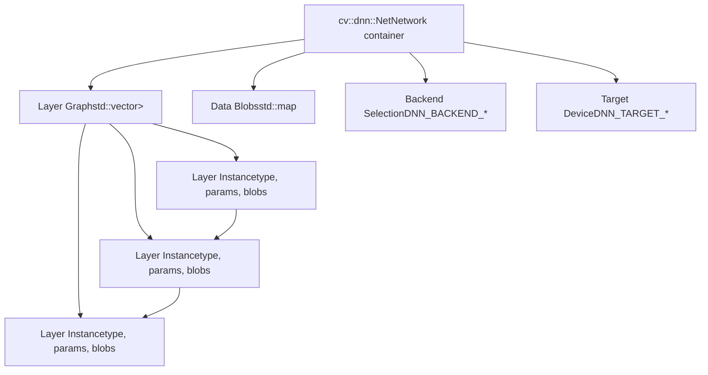
**关键方法：**

-   `Net::setInput()`- 设置网络的输入数据
-   `Net::forward()`- 执行前向传递并返回输出
-   `Net::setPreferableBackend()`- 选择执行后端
-   `Net::setPreferableTarget()`- 选择目标设备
-   `Net::getLayerNames()`- 返回网络中的所有层名称

**来源：**[modules/dnn/include/opencv2/dnn/dnn.hpp567-892](https://github.com/opencv/opencv/blob/91c78f50/modules/dnn/include/opencv2/dnn/dnn.hpp#L567-L892)

### 层抽象

这`cv::dnn::Layer`类为所有图层类型提供通用接口。每层实现：

-   `finalize()`- 计算输出形状并初始化内部状态
-   `forward()`- 对输入数据执行层的计算
-   `supportBackend()`- 指示该层支持哪些后端
-   后端特定的初始化方法（`initHalide()`, `initNgraph()`, `initCUDA()`， ETC。）

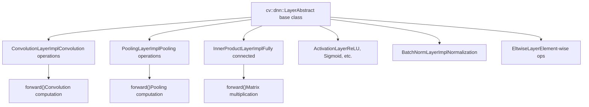
**公共层成员：**

-   `blobs`- 学习参数（权重、偏差）
-   `name`- 图层实例名称
-   `type`- 层类型标识符
-   `preferableTarget`- 首选执行目标

**来源：**[modules/dnn/include/opencv2/dnn/dnn.hpp220-403](https://github.com/opencv/opencv/blob/91c78f50/modules/dnn/include/opencv2/dnn/dnn.hpp#L220-L403) [modules/dnn/include/opencv2/dnn/all\_layers.hpp49-73](https://github.com/opencv/opencv/blob/91c78f50/modules/dnn/include/opencv2/dnn/all_layers.hpp#L49-L73)

### 后端和目标系统

DNN 模块使用两级抽象进行硬件加速：

**后端** (`cv::dnn::Backend`枚举）：

-   `DNN_BACKEND_OPENCV`- OpenCV 的原生 CPU/OpenCL 实现
-   `DNN_BACKEND_INFERENCE_ENGINE`- 英特尔 OpenVINO 推理引擎（另请参阅`DNN_BACKEND_INFERENCE_ENGINE_NGRAPH`内部别名）
-   `DNN_BACKEND_CUDA`- 带有 cuDNN 的 NVIDIA CUDA
-   `DNN_BACKEND_HALIDE`- Halide JIT 后端（实验性）
-   `DNN_BACKEND_VKCOM`- Vulkan计算后端
-   `DNN_BACKEND_WEBNN`- 网络神经网络API
-   `DNN_BACKEND_TIMVX`- TIM-VX NPU 后端（用于嵌入式加速器）
-   `DNN_BACKEND_CANN`- 华为CANN（神经网络计算架构）

**目标** （`cv::dnn::Target`枚举）：

-   `DNN_TARGET_CPU`- CPU执行
-   `DNN_TARGET_OPENCL`- OpenCL（GPU）FP32
-   `DNN_TARGET_OPENCL_FP16`- OpenCL FP16（半精度）
-   `DNN_TARGET_MYRIAD`- 英特尔Movidius VPU
-   `DNN_TARGET_CUDA`- NVIDIA GPU FP32
-   `DNN_TARGET_CUDA_FP16`- NVIDIA GPU FP16
-   `DNN_TARGET_FPGA`- 具有CPU回退功能的FPGA

```mermaid
flowchart TD
    APP["Application Code"]
    NET["cv::dnn::Net"]
    BACKEND_SEL["Backend Selection"]
    TARGET_SEL["Target Selection"]
    OPENCV["DNN_BACKEND_OPENCV"]
    OPENVINO["DNN_BACKEND_INFERENCE_ENGINE"]
    CUDA["DNN_BACKEND_CUDA"]
    CPU["DNN_TARGET_CPU"]
    OPENCL["DNN_TARGET_OPENCL"]
    GPU_CUDA["DNN_TARGET_CUDA"]
    VPU["DNN_TARGET_MYRIAD"]

    APP --> BACKEND_SEL
    APP --> TARGET_SEL
    BACKEND --> SEL_OPENCV
    BACKEND --> SEL_OPENVINO
    BACKEND --> SEL_CUDA
    TARGET --> SEL_CPU
    TARGET --> SEL_OPENCL
    TARGET --> SEL_GPU_CUDA
    TARGET --> SEL_VPU
    OPENCV --> CPU
    OPENCV --> OPENCL
    OPENVINO --> CPU
    OPENVINO --> OPENCL
    OPENVINO --> VPU
    CUDA --> GPU_CUDA
```
使用`getAvailableBackends()`查询哪些后端/目标对已编译并在运行时可用。使用`getAvailableTargets(backend)`列出特定后端的目标。

**来源：**[modules/dnn/include/opencv2/dnn/dnn.hpp70-127](https://github.com/opencv/opencv/blob/91c78f50/modules/dnn/include/opencv2/dnn/dnn.hpp#L70-L127) [modules/dnn/CMakeLists.txt20-56](https://github.com/opencv/opencv/blob/91c78f50/modules/dnn/CMakeLists.txt#L20-L56)

## 模型导入管道

### 进口商架构

每个受支持的框架都有一个专用的导入器类，用于解析模型文件并构造内部`Net`表示：

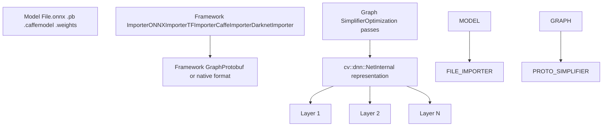
**特定于框架的导入器：**

| 进口商等级 | 文件 | 框架 | 负载功能 | 格式 |
| --- | --- | --- | --- | --- |
| `ONNXImporter` | [modules/dnn/src/onnx/onnx\_importer.cpp](https://github.com/opencv/opencv/blob/91c78f50/modules/dnn/src/onnx/onnx_importer.cpp) | 奥恩克斯 | `readNetFromONNX()` | `.onnx`（协议缓冲区） |
| `TFImporter` | [modules/dnn/src/tensorflow/tf\_importer.cpp](https://github.com/opencv/opencv/blob/91c78f50/modules/dnn/src/tensorflow/tf_importer.cpp) | TensorFlow | `readNetFromTensorflow()` | `.pb` `.pbtxt` |
| `CaffeImporter` | [modules/dnn/src/caffe/caffe\_importer.cpp](https://github.com/opencv/opencv/blob/91c78f50/modules/dnn/src/caffe/caffe_importer.cpp) | 咖啡厅 | `readNetFromCaffe()` | `.prototxt` `.caffemodel` |
| `DarknetImporter` | [modules/dnn/src/darknet/darknet\_io.cpp](https://github.com/opencv/opencv/blob/91c78f50/modules/dnn/src/darknet/darknet_io.cpp) | 暗网/YOLO | `readNetFromDarknet()` | `.cfg` `.weights` |
| 火炬进口商 | [modules/dnn/src/torch/torch\_importer.cpp](https://github.com/opencv/opencv/blob/91c78f50/modules/dnn/src/torch/torch_importer.cpp) | 火炬7 | `readNetFromTorch()` | `.t7` `.net` |

所有格式也可以通过统一访问`readNet()`函数，它根据文件扩展名分派到适当的导入器。这`readNetFromONNX()`, `readNetFromTensorflow()`Error 500 (Server Error)!!1500.That’s an error.There was an error. Please try again later.That’s all we know.

**来源：**[modules/dnn/src/onnx/onnx\_importer.cpp65-233](https://github.com/opencv/opencv/blob/91c78f50/modules/dnn/src/onnx/onnx_importer.cpp#L65-L233) [modules/dnn/src/tensorflow/tf\_importer.cpp512-556](https://github.com/opencv/opencv/blob/91c78f50/modules/dnn/src/tensorflow/tf_importer.cpp#L512-L556) [modules/dnn/test/test\_darknet\_importer.cpp56-99](https://github.com/opencv/opencv/blob/91c78f50/modules/dnn/test/test_darknet_importer.cpp#L56-L99) [modules/dnn/test/test\_torch\_importer.cpp1-40](https://github.com/opencv/opencv/blob/91c78f50/modules/dnn/test/test_torch_importer.cpp#L1-L40)

### ONNX 导入管道

ONNX导入器是最积极开发的路径，支持模型交换的ONNX标准：

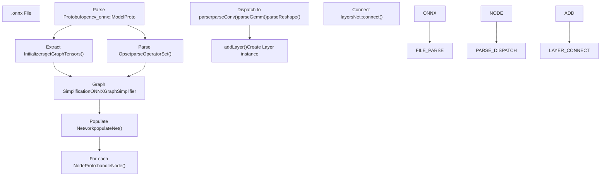
**关键 ONNX 导入组件：**

**`ONNXImporter`班级**[modules/dnn/src/onnx/onnx\_importer.cpp65-233](https://github.com/opencv/opencv/blob/91c78f50/modules/dnn/src/onnx/onnx_importer.cpp#L65-L233):

-   `parseOperatorSet()`- 确定 ONNX opset 版本以使用正确的操作语义
-   `getGraphTensors()`- 从模型的初始值设定项列表中提取权重张量
-   `handleNode()`- 处理图中的每个操作节点
-   `buildDispatchMap_ONNX_AI()`- 将 ONNX 操作类型映射到解析器方法

**解析器方法**（选定的示例）：

-   `parseConv()`- 卷积和ConvTranspose操作
-   `parseGemm()` / `parseMatMul()`- 矩阵乘法运算
-   `parseReshape()` / `parseFlatten()`- 形状操纵
-   `parseBatchNormalization()`- 批量归一化
-   `parseReduce()`- 归约运算（总和、平均值、最大值等）

**来源：**[modules/dnn/src/onnx/onnx\_importer.cpp266-315](https://github.com/opencv/opencv/blob/91c78f50/modules/dnn/src/onnx/onnx_importer.cpp#L266-L315) [modules/dnn/src/onnx/onnx\_importer.cpp673-685](https://github.com/opencv/opencv/blob/91c78f50/modules/dnn/src/onnx/onnx_importer.cpp#L673-L685)

### 图的简化

在构建最终版本之前`Net`，导入器应用优化过程来简化计算图：

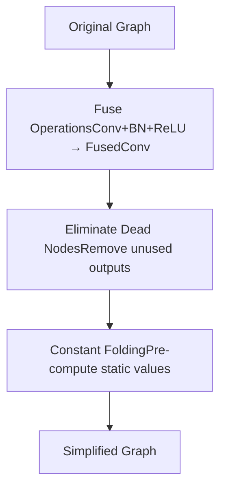
**常见的简化：**

1.  **层融合** - 组合连续操作：

    -   卷积 + BatchNorm + 激活 → 单融合层
    -   减少内存流量并提高缓存局部性
2.  **恒定折叠** - 使用恒定输入预先计算操作：

    -   不依赖于运行时数据的形状操作
    -   降低图形复杂性
3.  **死代码消除** - 删除未使用的计算：

    -   没有消费者的层
    -   无法到达的分支

**实施文件：**

-   奥恩克斯：[modules/dnn/src/onnx/onnx\_graph\_simplifier.cpp](https://github.com/opencv/opencv/blob/91c78f50/modules/dnn/src/onnx/onnx_graph_simplifier.cpp)
-   张力流：[modules/dnn/src/tensorflow/tf\_graph\_simplifier.cpp](https://github.com/opencv/opencv/blob/91c78f50/modules/dnn/src/tensorflow/tf_graph_simplifier.cpp)

**来源：**[modules/dnn/src/onnx/onnx\_graph\_simplifier.cpp1-79](https://github.com/opencv/opencv/blob/91c78f50/modules/dnn/src/onnx/onnx_graph_simplifier.cpp#L1-L79) [modules/dnn/src/tensorflow/tf\_graph\_simplifier.cpp1-19](https://github.com/opencv/opencv/blob/91c78f50/modules/dnn/src/tensorflow/tf_graph_simplifier.cpp#L1-L19)

## 执行后端

### OpenCV 原生后端

默认`DNN_BACKEND_OPENCV`提供CPU和OpenCL实现：

**CPU执行路径：**

-   针对 x86（AVX2、AVX-512）、ARM (NEON)、RISC-V 的 SIMD 优化内核
-   优化的 GEMM（通用矩阵乘法）例程
-   快速卷积实现：direct、im2col、Winograd
-   多线程通过`cv::parallel_for_()`使用 TBB/OpenMP/pthreads

**OpenCL 执行路径：**

-   启用时间`OPENCV_DNN_OPENCL=ON`和`HAVE_OPENCL`被定义
-   用于 GPU 内存管理的透明 UMat 使用情况
-   专门的内核[modules/dnn/src/opencl/](https://github.com/opencv/opencv/blob/91c78f50/modules/dnn/src/opencl/)
-   支持 FP32 和 FP16 精度

```mermaid
flowchart TD
    LAYER_FWD["Layer::forward()"]
    BACKEND_CHECK["Check preferableTarget"]
    CPU_PATH["CPU PathSIMD kernels"]
    OPENCL_PATH["OpenCL PathGPU kernels"]
    CPU_SIMD["Dispatch SIMDAVX2/NEON/RVV"]
    CPU_PARALLEL["parallel_for_Multi-threading"]
    OCL_KERNEL["Launch OCL kernelocl::Kernel::run()"]
    OCL_UMAT["UMat data transfer"]

    LAYER --> FWD_BACKEND_CHECK
    BACKEND --> CHECK_CPU_PATH
    BACKEND --> CHECK_OPENCL_PATH
    CPU --> PATH_CPU_SIMD
    CPU --> PATH_CPU_PARALLEL
    OPENCL --> PATH_OCL_KERNEL
    OPENCL --> PATH_OCL_UMAT
```
**关键CPU实现文件：**

-   [modules/dnn/src/layers/cpu\_kernels/convolution.hpp](https://github.com/opencv/opencv/blob/91c78f50/modules/dnn/src/layers/cpu_kernels/convolution.hpp)- 卷积核
-   [modules/dnn/src/layers/cpu\_kernels/conv\_winograd\_f63.simd.hpp](https://github.com/opencv/opencv/blob/91c78f50/modules/dnn/src/layers/cpu_kernels/conv_winograd_f63.simd.hpp)- 维诺格拉德卷积
-   [modules/dnn/src/layers/cpu\_kernels/fast\_gemm\_kernels.simd.hpp](https://github.com/opencv/opencv/blob/91c78f50/modules/dnn/src/layers/cpu_kernels/fast_gemm_kernels.simd.hpp)- 矩阵乘法

**来源：**[modules/dnn/src/layers/convolution\_layer.cpp79-242](https://github.com/opencv/opencv/blob/91c78f50/modules/dnn/src/layers/convolution_layer.cpp#L79-L242) [modules/dnn/CMakeLists.txt20-24](https://github.com/opencv/opencv/blob/91c78f50/modules/dnn/CMakeLists.txt#L20-L24)

### 英特尔 OpenVINO 后端

这`DNN_BACKEND_INFERENCE_ENGINE`后端将执行委托给 Intel OpenVINO（以前称为推理引擎）：

**建筑学：**

-   将 OpenCV 的内部图转换为 OpenVINO 的内部图`ov::Model`表示
-   使用 OpenVINO 在 Intel 硬件（CPU、GPU、VPU、FPGA）上的优化执行
-   支持跨多个设备异构执行

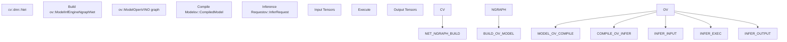
**重点课程：**

**`InfEngineNgraphNet`** [modules/dnn/src/ie\_ngraph.cpp](https://github.com/opencv/opencv/blob/91c78f50/modules/dnn/src/ie_ngraph.cpp):

-   将 cv::dnn 层转换为 OpenVINO 操作
-   管理模型编译和推理请求
-   处理异步执行

**层后端方法：**

-   `Layer::initNgraph()`- 为该层创建 OpenVINO 操作
-   退货`Ptr<BackendNode>`包含 OpenVINO 操作

**配置：**

-   通过 CMake 检测到：[cmake/OpenCVDetectInferenceEngine.cmake](https://github.com/opencv/opencv/blob/91c78f50/cmake/OpenCVDetectInferenceEngine.cmake)
-   需要安装 OpenVINO 运行时
-   套`HAVE_INF_ENGINE`和`HAVE_DNN_NGRAPH`预处理器标志

**来源：**[modules/dnn/src/op\_inf\_engine.hpp1-62](https://github.com/opencv/opencv/blob/91c78f50/modules/dnn/src/op_inf_engine.hpp#L1-L62) [modules/dnn/src/ie\_ngraph.cpp1-42](https://github.com/opencv/opencv/blob/91c78f50/modules/dnn/src/ie_ngraph.cpp#L1-L42) [cmake/OpenCVDetectInferenceEngine.cmake1-16](https://github.com/opencv/opencv/blob/91c78f50/cmake/OpenCVDetectInferenceEngine.cmake#L1-L16)

### CUDA后端

这`DNN_BACKEND_CUDA`后端使用 NVIDIA CUDA 和 cuDNN 进行 GPU 加速：

**要求：**

-   CUDA工具包（计算能力>=3.0）
-   cuDNN 库
-   用于矩阵运算的 cuBLAS 和 cuBLAS-Lt
-   启用与`OPENCV_DNN_CUDA=ON`CMake选项

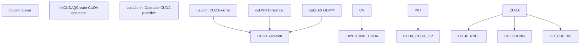
**CUDA实现结构：**

-   CUDA操作：[modules/dnn/src/cuda4dnn/primitives/](https://github.com/opencv/opencv/blob/91c78f50/modules/dnn/src/cuda4dnn/primitives/)
-   内核实现：[modules/dnn/src/cuda4dnn/kernels/](https://github.com/opencv/opencv/blob/91c78f50/modules/dnn/src/cuda4dnn/kernels/)
-   常见的 CUDA 实用程序：[modules/dnn/src/cuda4dnn/csl/](https://github.com/opencv/opencv/blob/91c78f50/modules/dnn/src/cuda4dnn/csl/)（CSL = CUDA 支持库）

**CUDA 基元示例：**

-   `cuda4dnn::ConvolutionOp`- 使用 cuDNN 进行卷积
-   `cuda4dnn::PoolingOp`- 池化操作
-   `cuda4dnn::FullyConnectedOp`- 通过 cuBLAS 进行矩阵乘法
-   `cuda4dnn::ActivationOp`- 逐元素激活

**来源：**[modules/dnn/CMakeLists.txt38-56](https://github.com/opencv/opencv/blob/91c78f50/modules/dnn/CMakeLists.txt#L38-L56) [modules/dnn/src/layers/convolution\_layer.cpp304-311](https://github.com/opencv/opencv/blob/91c78f50/modules/dnn/src/layers/convolution_layer.cpp#L304-L311)

## 层实现深入探讨

### 卷积层

这`ConvolutionLayerImpl`类实现 2D 和 3D 卷积运算，这是大多数 CNN 的骨干：

**实施策略：**

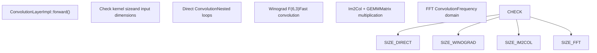
**关键实施细节：**

**Im2Col 算法：**

1.  将输入图像转换为列矩阵，其中每列包含内核大小的补丁
2.  执行批量矩阵乘法：`output = weights × im2col_matrix`
3.  将结果重塑回输出张量维度

**维诺格拉德卷积：**

-   用于 3×3 内核，步长=1，膨胀=1
-   与直接卷积相比减少了乘法计数
-   执行：[modules/dnn/src/layers/cpu\_kernels/conv\_winograd\_f63.simd.hpp](https://github.com/opencv/opencv/blob/91c78f50/modules/dnn/src/layers/cpu_kernels/conv_winograd_f63.simd.hpp)
-   控制者`Net::enableWinograd()` / `useWinograd`范围

**融合优化：**

-   `tryFuse()`方法将 BatchNorm、Scale 和 Activation 层合并为卷积层
-   减少内存带宽和内核启动开销
-   实施于`BaseConvolutionLayerImpl::tryFuse()` [modules/dnn/src/layers/convolution\_layer.cpp180-199](https://github.com/opencv/opencv/blob/91c78f50/modules/dnn/src/layers/convolution_layer.cpp#L180-L199)

**来源：**[modules/dnn/src/layers/convolution\_layer.cpp246-285](https://github.com/opencv/opencv/blob/91c78f50/modules/dnn/src/layers/convolution_layer.cpp#L246-L285) [modules/dnn/src/layers/cpu\_kernels/convolution.hpp](https://github.com/opencv/opencv/blob/91c78f50/modules/dnn/src/layers/cpu_kernels/convolution.hpp)

### 池化层

这`PoolingLayerImpl`类实现各种池化操作：

**池类型：**

-   `MAX`- 最大池化（在 CNN 中最常见）
-   `AVE`- 平均池化
-   `SUM`- 总和池
-   `ROI`- 感兴趣区域池（用于对象检测）
-   `PSROI`- 位置敏感的 ROI 池

**最大池化实施：**

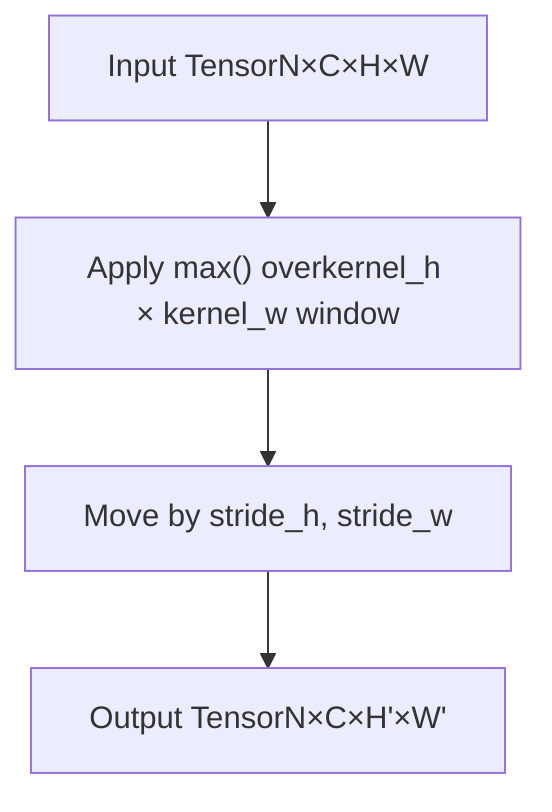
**全球汇集：**

-   什么时候`global_pooling=true`，汇集整个空间维度
-   内核大小自动设置为输入空间大小
-   常见于最终 FC 层之前的分类网络中

**来源：**[modules/dnn/src/layers/pooling\_layer.cpp98-137](https://github.com/opencv/opencv/blob/91c78f50/modules/dnn/src/layers/pooling_layer.cpp#L98-L137)

### 全连接（内积）层

这`InnerProductLayerImpl`实现密集/全连接层：

**手术：**`output = weights × input + bias`

**优化：**

-   使用优化的 BLAS 实现（OpenBLAS、MKL、Eigen 或内置）
-   支持转置权重矩阵以提高缓存效率
-   具有激活函数（ReLU 等）的熔断器

**重量存储：**

-   权重存储为`numOutput × numInput`矩阵
-   偏差存储为`numOutput`向量
-   两者都在`LayerParams::blobs`向量

**来源：**[modules/dnn/src/layers/fully\_connected\_layer.cpp1-41](https://github.com/opencv/opencv/blob/91c78f50/modules/dnn/src/layers/fully_connected_layer.cpp#L1-L41)

### 激活层

逐元素激活函数继承自`ActivationLayer`:

**常见激活：**

-   `ReLULayer`- 修正线性单位：`f(x) = max(0, x)`
-   `ReLU6Layer`- 上限 ReLU：`f(x) = min(max(0, x), 6)`
-   `SigmoidLayer`-乙状结肠：`f(x) = 1 / (1 + exp(-x))`
-   `TanHLayer`- 双曲正切
-   `ELULayer`- 指数线性单位
-   `SwishLayer`- Swish/SiLU：`f(x) = x * sigmoid(x)`

**层融合：**

-   激活层经常融合到前面的 Conv 或 FC 层中
-   减少内存往返
-   实施通过`Layer::tryFuse()`

**来源：**[modules/dnn/src/layers/elementwise\_layers.cpp1-47](https://github.com/opencv/opencv/blob/91c78f50/modules/dnn/src/layers/elementwise_layers.cpp#L1-L47) [modules/dnn/include/opencv2/dnn/all\_layers.hpp241-328](https://github.com/opencv/opencv/blob/91c78f50/modules/dnn/include/opencv2/dnn/all_layers.hpp#L241-L328)

## 预处理实用程序

### blobFromImage / blobFromImages

在将图像传递到网络之前，必须将像素数据从`cv::Mat`（HWC，uint8）到 4D blob（NCHW，float32）。 DNN 模块为此提供了帮助器：

-   `blobFromImage(image, scalefactor, size, mean, swapRB, crop)`— 从单个图像返回 4D 斑点。
-   `blobFromImages(images, ...)`— 从图像向量返回批处理的 blob。
-   `imagesFromBlob(blob, images)`— 逆：将 blob 转换回图像向量。

`Image2BlobParams`封装所有预处理参数（scale、size、mean、swapRB、crop、数据布局、padding 模式）并可以传递给`blobFromImageWithParams()`为了更多的控制。

这`DataLayout`枚举控制输出内存布局：

| 价值 | 布局 | 典型用途 |
| --- | --- | --- |
| `DNN_LAYOUT_NCHW` | 长×宽×高×宽 | OpenCV 默认值 |
| `DNN_LAYOUT_NHWC` | 长×高×宽×厚 | TensorFlow/TFLite |
| `DNN_LAYOUT_NCDHW` | 长×宽×深×高×宽 | 3D（视频） |

**来源：**[modules/dnn/include/opencv2/dnn/dnn.hpp114-123](https://github.com/opencv/opencv/blob/91c78f50/modules/dnn/include/opencv2/dnn/dnn.hpp#L114-L123) [modules/dnn/include/opencv2/dnn/dnn.hpp880-953](https://github.com/opencv/opencv/blob/91c78f50/modules/dnn/include/opencv2/dnn/dnn.hpp#L880-L953)

## 自定义层注册

新的图层类型可以注册`LayerFactory`在运行时使用`CV_DNN_REGISTER_LAYER_CLASS`宏或通过调用`LayerFactory::registerLayer(type, creator)`。工厂将字符串类型名称映射到生成的创建者函数`Ptr<Layer>`实例。

-   `LayerFactory::registerLayer(typeName, creator)`— 注册一个新的图层类型。
-   `LayerFactory::createLayerInstance(type, params)`— 按类型名称实例化图层；导入时使用。

`LayerParams`携带构建层所需的所有数据：

-   继承自`Dict`对于命名标量/字符串/数组参数。
-   `blobs` — `std::vector<Mat>`学习到的权重张量。
-   `name`, `type`— 实例名称和类型字符串。

**来源：**[modules/dnn/include/opencv2/dnn/dnn.hpp145-153](https://github.com/opencv/opencv/blob/91c78f50/modules/dnn/include/opencv2/dnn/dnn.hpp#L145-L153) [modules/dnn/test/test\_layers.cpp47](https://github.com/opencv/opencv/blob/91c78f50/modules/dnn/test/test_layers.cpp#L47-L47)

## 网络推理流程

### 前向传递执行

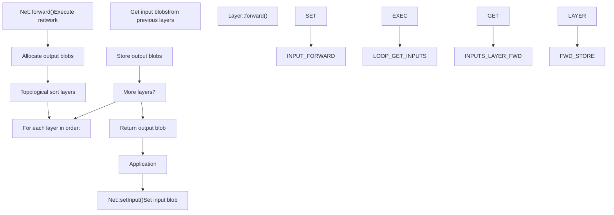
**执行步骤：**

1.  **输入设置：**

    -   `Net::setInput(blob, name)`将输入数据与输入层相关联
    -   具有多个输入节点的网络支持多个输入
    -   存储在内部映射中的输入 blob：`std::map<int, Mat>`
2.  **图层调度：**

    -   网络维持各层的拓扑顺序
    -   每一层都取决于前一层的输出
    -   执行顺序确保满足所有依赖关系
3.  **内存管理：**

    -   输出 blob 分配基于`Layer::getMemoryShapes()`
    -   尽可能重用内存（就地操作）
    -   为特定于层的需求分配的内部 blob
4.  **后端调度：**

    -   每层检查`preferableBackend`和`preferableTarget`
    -   调用适当的后端特定代码路径
    -   如果后端不受支持，则回退到 OpenCV 实现

**来源：**[modules/dnn/include/opencv2/dnn/dnn.hpp745-807](https://github.com/opencv/opencv/blob/91c78f50/modules/dnn/include/opencv2/dnn/dnn.hpp#L745-L807)

### 异步执行

对于支持异步执行的后端（OpenVINO、CUDA），DNN 模块提供非阻塞推理：

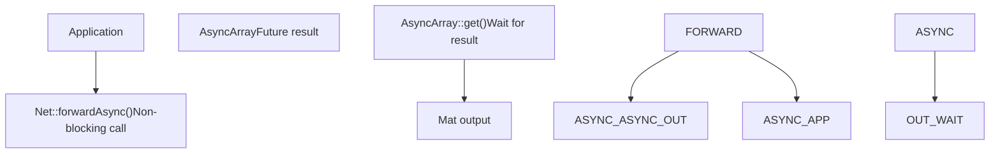
**使用模式：**

```
net.setInput(input);AsyncArray async_result = net.forwardAsync();// Do other work...Mat output = async_result.get(); // Block until complete
```
**来源：**[modules/dnn/include/opencv2/dnn/dnn.hpp792-807](https://github.com/opencv/opencv/blob/91c78f50/modules/dnn/include/opencv2/dnn/dnn.hpp#L792-L807)

### 批处理

DNN 模块支持批量推理以分摊开销：

**批量尺寸：**

-   输入形状：`[batch_size, channels, height, width]`对于 2D
-   输入形状：`[batch_size, channels, depth, height, width]`3D 版
-   第一个维度是批次轴

**批量处理：**

-   所有层都透明地处理批量维度
-   GEMM 操作通过矩阵维度处理批次
-   卷积并行处理批次

**内存布局：**

-   NCHW（批次、通道、高度、宽度）- OpenCV 默认值
-   NHWC（批量、高度、宽度、通道）——TensorFlow/TFLite 选项
-   控制者`DataLayout`枚举；另请参阅上面的预处理部分

**来源：**[modules/dnn/include/opencv2/dnn/dnn.hpp114-123](https://github.com/opencv/opencv/blob/91c78f50/modules/dnn/include/opencv2/dnn/dnn.hpp#L114-L123)

## 测试和验证

### 测试基础设施

DNN 模块包括以下综合测试：

-   模型导入正确性
-   层实现
-   后端兼容性
-   数值准确度

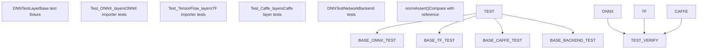
**重点测试课程：**

**`DNNTestLayer`** [modules/dnn/test/test\_common.hpp](https://github.com/opencv/opencv/blob/91c78f50/modules/dnn/test/test_common.hpp):

-   提供通用测试实用程序的基类
-   `checkBackend()`- 验证后端/目标支持
-   `normAssert()`- 使用 L1/Linf 指标将输出与参考进行比较
-   后端/目标参数化通过`GetParam()`

**测试数据格式：**

-   输入/输出存储为 NumPy`.npy`文件
-   原始框架生成的参考输出
-   帮手：`blobFromNPY()`加载测试数据

**后端兼容性测试：**

-   每个测试在多个后端/目标组合上运行
-   跳过应用于不支持的配置的标签
-   例子：`applyTestTag(CV_TEST_TAG_DNN_SKIP_CUDA)`

**来源：**[modules/dnn/test/test\_common.hpp1-55](https://github.com/opencv/opencv/blob/91c78f50/modules/dnn/test/test_common.hpp#L1-L55) [modules/dnn/test/test\_onnx\_importer.cpp31-128](https://github.com/opencv/opencv/blob/91c78f50/modules/dnn/test/test_onnx_importer.cpp#L31-L128) [modules/dnn/test/test\_backends.cpp13-73](https://github.com/opencv/opencv/blob/91c78f50/modules/dnn/test/test_backends.cpp#L13-L73)

### 诊断模式

DNN 模块提供了用于调试模型加载问题的诊断模式：

**激活：**

```
cv::dnn::enableModelDiagnostics(true);
```
**功能：**

-   模型解析的详细日志记录
-   报告不支持的图层类型
-   尽管出现错误，仍继续加载以报告所有问题
-   帮助识别缺失层的实现

**执行：**

-   全局标志：`DNN_DIAGNOSTICS_RUN` [modules/dnn/src/onnx/onnx\_importer.cpp53](https://github.com/opencv/opencv/blob/91c78f50/modules/dnn/src/onnx/onnx_importer.cpp#L53-L53)
-   层处理程序跟踪丢失的操作
-   输出通过`CV_LOG_*`宏

**来源：**[modules/dnn/include/opencv2/dnn/dnn.hpp128-138](https://github.com/opencv/opencv/blob/91c78f50/modules/dnn/include/opencv2/dnn/dnn.hpp#L128-L138)

## 构建配置

### CMake 选项

控制 DNN 模块功能的关键 CMake 变量：

| 选项 | 描述 | 默认 |
| --- | --- | --- |
| `OPENCV_DNN_OPENCL` | 启用 OpenCL 后端 | `HAVE_OPENCL AND NOT APPLE` |
| `OPENCV_DNN_CUDA` | 启用 CUDA 后端 | `OFF`（需要CUDA+cuDNN） |
| `WITH_OPENVINO` | 启用 OpenVINO 后端 | `OFF`（如果安装则自动检测） |
| `BUILD_PROTOBUF` | 构建捆绑的 protobuf | `ON` |
| `PROTOBUF_UPDATE_FILES` | 重新生成 .pb 文件 | `OFF` |
| `OPENCV_DNN_TFLITE` | 启用 TFLite 导入 | `ON`（如果可用的平面缓冲区） |

**配置检测：**

-   打开VINO：[cmake/OpenCVDetectInferenceEngine.cmake](https://github.com/opencv/opencv/blob/91c78f50/cmake/OpenCVDetectInferenceEngine.cmake)
-   CUDA/cuDNN：标准 OpenCV CUDA 检测
-   Protobuf：FindProtobuf.cmake 或捆绑版本

**生成的文件：**

-   协议缓冲区源位于`misc/`目录（预先生成）
-   或者重新生成自`.proto`文件如果`PROTOBUF_UPDATE_FILES=ON`

**来源：**[modules/dnn/CMakeLists.txt1-230](https://github.com/opencv/opencv/blob/91c78f50/modules/dnn/CMakeLists.txt#L1-L230) [cmake/OpenCVDetectInferenceEngine.cmake1-16](https://github.com/opencv/opencv/blob/91c78f50/cmake/OpenCVDetectInferenceEngine.cmake#L1-L16)

### 预处理器定义

关键编译时标志：

-   `HAVE_PROTOBUF`- 启用 ONNX/TensorFlow/Caffe 导入
-   `CV_OCL4DNN`- 启用 OpenCL 优化内核
-   `CV_CUDA4DNN`- 启用 CUDA 后端
-   `HAVE_INF_ENGINE` / `HAVE_DNN_NGRAPH`- OpenVINO 支持
-   `HAVE_WEBNN`- WebNN 后端支持
-   `HAVE_TIMVX`- TIM-VX NPU后端
-   `HAVE_CANN`- 华为CANN后端

**来源：**[modules/dnn/CMakeLists.txt22-36](https://github.com/opencv/opencv/blob/91c78f50/modules/dnn/CMakeLists.txt#L22-L36)
