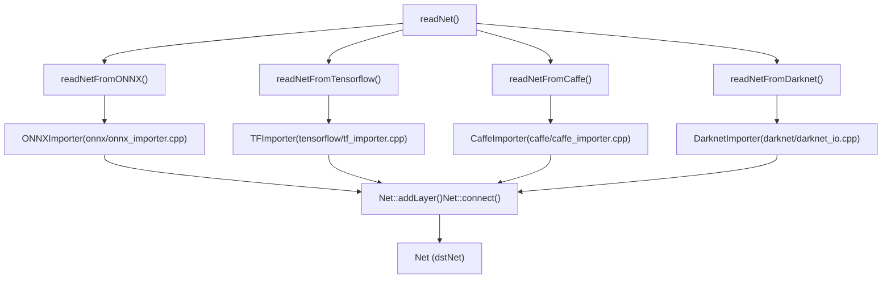
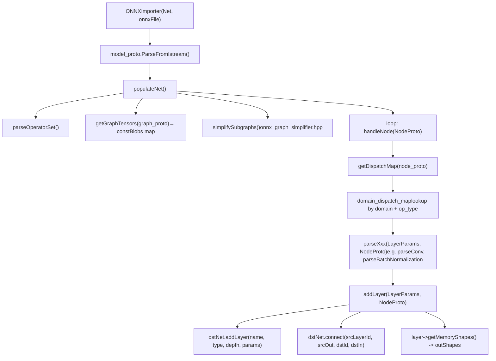
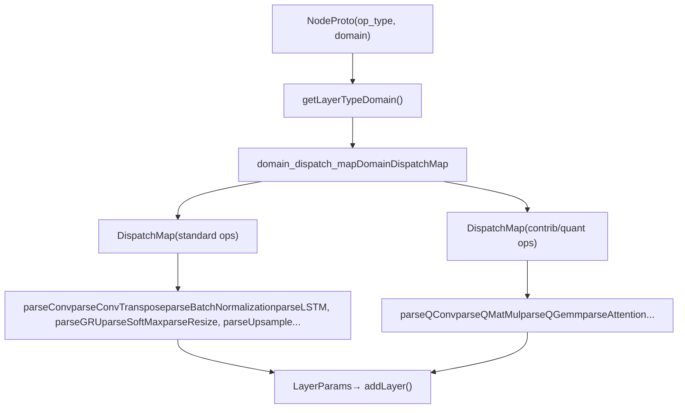
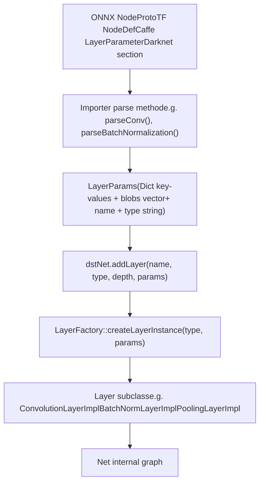

# 模型导入器（ONNX、TensorFlow、Caffe、Darknet）

相关源文件

-   [cmake/OpenCVDetectInferenceEngine.cmake](https://github.com/opencv/opencv/blob/91c78f50/cmake/OpenCVDetectInferenceEngine.cmake)
-   [modules/dnn/CMakeLists.txt](https://github.com/opencv/opencv/blob/91c78f50/modules/dnn/CMakeLists.txt)
-   [modules/dnn/include/opencv2/dnn/all\_layers.hpp](https://github.com/opencv/opencv/blob/91c78f50/modules/dnn/include/opencv2/dnn/all_layers.hpp)
-   [modules/dnn/include/opencv2/dnn/dnn.hpp](https://github.com/opencv/opencv/blob/91c78f50/modules/dnn/include/opencv2/dnn/dnn.hpp)
-   [modules/dnn/misc/python/pyopencv\_dnn.hpp](https://github.com/opencv/opencv/blob/91c78f50/modules/dnn/misc/python/pyopencv_dnn.hpp)
-   [modules/dnn/misc/python/test/test\_dnn.py](https://github.com/opencv/opencv/blob/91c78f50/modules/dnn/misc/python/test/test_dnn.py)
-   [modules/dnn/perf/perf\_net.cpp](https://github.com/opencv/opencv/blob/91c78f50/modules/dnn/perf/perf_net.cpp)
-   [modules/dnn/perf/perf\_utils.cpp](https://github.com/opencv/opencv/blob/91c78f50/modules/dnn/perf/perf_utils.cpp)
-   [modules/dnn/src/caffe/caffe\_importer.cpp](https://github.com/opencv/opencv/blob/91c78f50/modules/dnn/src/caffe/caffe_importer.cpp)
-   [modules/dnn/src/cuda/activations.cu](https://github.com/opencv/opencv/blob/91c78f50/modules/dnn/src/cuda/activations.cu)
-   [modules/dnn/src/cuda/functors.hpp](https://github.com/opencv/opencv/blob/91c78f50/modules/dnn/src/cuda/functors.hpp)
-   [modules/dnn/src/cuda4dnn/kernels/activations.hpp](https://github.com/opencv/opencv/blob/91c78f50/modules/dnn/src/cuda4dnn/kernels/activations.hpp)
-   [modules/dnn/src/cuda4dnn/primitives/activation.hpp](https://github.com/opencv/opencv/blob/91c78f50/modules/dnn/src/cuda4dnn/primitives/activation.hpp)
-   [modules/dnn/src/cuda4dnn/primitives/matmul\_broadcast.hpp](https://github.com/opencv/opencv/blob/91c78f50/modules/dnn/src/cuda4dnn/primitives/matmul_broadcast.hpp)
-   [modules/dnn/src/darknet/darknet\_importer.cpp](https://github.com/opencv/opencv/blob/91c78f50/modules/dnn/src/darknet/darknet_importer.cpp)
-   [modules/dnn/src/darknet/darknet\_io.cpp](https://github.com/opencv/opencv/blob/91c78f50/modules/dnn/src/darknet/darknet_io.cpp)
-   [modules/dnn/src/darknet/darknet\_io.hpp](https://github.com/opencv/opencv/blob/91c78f50/modules/dnn/src/darknet/darknet_io.hpp)
-   [modules/dnn/src/dnn.cpp](https://github.com/opencv/opencv/blob/91c78f50/modules/dnn/src/dnn.cpp)
-   [modules/dnn/src/dnn\_common.hpp](https://github.com/opencv/opencv/blob/91c78f50/modules/dnn/src/dnn_common.hpp)
-   [modules/dnn/src/dnn\_utils.cpp](https://github.com/opencv/opencv/blob/91c78f50/modules/dnn/src/dnn_utils.cpp)
-   [modules/dnn/src/graph\_simplifier.cpp](https://github.com/opencv/opencv/blob/91c78f50/modules/dnn/src/graph_simplifier.cpp)
-   [modules/dnn/src/graph\_simplifier.hpp](https://github.com/opencv/opencv/blob/91c78f50/modules/dnn/src/graph_simplifier.hpp)
-   [modules/dnn/src/ie\_ngraph.cpp](https://github.com/opencv/opencv/blob/91c78f50/modules/dnn/src/ie_ngraph.cpp)
-   [modules/dnn/src/ie\_ngraph.hpp](https://github.com/opencv/opencv/blob/91c78f50/modules/dnn/src/ie_ngraph.hpp)
-   [modules/dnn/src/init.cpp](https://github.com/opencv/opencv/blob/91c78f50/modules/dnn/src/init.cpp)
-   [modules/dnn/src/layers/convolution\_layer.cpp](https://github.com/opencv/opencv/blob/91c78f50/modules/dnn/src/layers/convolution_layer.cpp)
-   [modules/dnn/src/layers/elementwise\_layers.cpp](https://github.com/opencv/opencv/blob/91c78f50/modules/dnn/src/layers/elementwise_layers.cpp)
-   [modules/dnn/src/layers/fully\_connected\_layer.cpp](https://github.com/opencv/opencv/blob/91c78f50/modules/dnn/src/layers/fully_connected_layer.cpp)
-   [modules/dnn/src/layers/layers\_common.simd.hpp](https://github.com/opencv/opencv/blob/91c78f50/modules/dnn/src/layers/layers_common.simd.hpp)
-   [modules/dnn/src/layers/pooling\_layer.cpp](https://github.com/opencv/opencv/blob/91c78f50/modules/dnn/src/layers/pooling_layer.cpp)
-   [modules/dnn/src/layers/recurrent\_layers.cpp](https://github.com/opencv/opencv/blob/91c78f50/modules/dnn/src/layers/recurrent_layers.cpp)
-   [modules/dnn/src/layers/region\_layer.cpp](https://github.com/opencv/opencv/blob/91c78f50/modules/dnn/src/layers/region_layer.cpp)
-   [modules/dnn/src/model.cpp](https://github.com/opencv/opencv/blob/91c78f50/modules/dnn/src/model.cpp)
-   [modules/dnn/src/net\_openvino.cpp](https://github.com/opencv/opencv/blob/91c78f50/modules/dnn/src/net_openvino.cpp)
-   [modules/dnn/src/onnx/onnx\_graph\_simplifier.cpp](https://github.com/opencv/opencv/blob/91c78f50/modules/dnn/src/onnx/onnx_graph_simplifier.cpp)
-   [modules/dnn/src/onnx/onnx\_graph\_simplifier.hpp](https://github.com/opencv/opencv/blob/91c78f50/modules/dnn/src/onnx/onnx_graph_simplifier.hpp)
-   [modules/dnn/src/onnx/onnx\_importer.cpp](https://github.com/opencv/opencv/blob/91c78f50/modules/dnn/src/onnx/onnx_importer.cpp)
-   [modules/dnn/src/op\_inf\_engine.cpp](https://github.com/opencv/opencv/blob/91c78f50/modules/dnn/src/op_inf_engine.cpp)
-   [modules/dnn/src/op\_inf\_engine.hpp](https://github.com/opencv/opencv/blob/91c78f50/modules/dnn/src/op_inf_engine.hpp)
-   [modules/dnn/src/opencl/activations.cl](https://github.com/opencv/opencv/blob/91c78f50/modules/dnn/src/opencl/activations.cl)
-   [modules/dnn/src/tensorflow/tf\_graph\_simplifier.cpp](https://github.com/opencv/opencv/blob/91c78f50/modules/dnn/src/tensorflow/tf_graph_simplifier.cpp)
-   [modules/dnn/src/tensorflow/tf\_graph\_simplifier.hpp](https://github.com/opencv/opencv/blob/91c78f50/modules/dnn/src/tensorflow/tf_graph_simplifier.hpp)
-   [modules/dnn/src/tensorflow/tf\_importer.cpp](https://github.com/opencv/opencv/blob/91c78f50/modules/dnn/src/tensorflow/tf_importer.cpp)
-   [modules/dnn/src/torch/torch\_importer.cpp](https://github.com/opencv/opencv/blob/91c78f50/modules/dnn/src/torch/torch_importer.cpp)
-   [modules/dnn/test/test\_backends.cpp](https://github.com/opencv/opencv/blob/91c78f50/modules/dnn/test/test_backends.cpp)
-   [modules/dnn/test/test\_caffe\_importer.cpp](https://github.com/opencv/opencv/blob/91c78f50/modules/dnn/test/test_caffe_importer.cpp)
-   [modules/dnn/test/test\_common.hpp](https://github.com/opencv/opencv/blob/91c78f50/modules/dnn/test/test_common.hpp)
-   [modules/dnn/test/test\_common.impl.hpp](https://github.com/opencv/opencv/blob/91c78f50/modules/dnn/test/test_common.impl.hpp)
-   [modules/dnn/test/test\_darknet\_importer.cpp](https://github.com/opencv/opencv/blob/91c78f50/modules/dnn/test/test_darknet_importer.cpp)
-   [modules/dnn/test/test\_graph\_simplifier.cpp](https://github.com/opencv/opencv/blob/91c78f50/modules/dnn/test/test_graph_simplifier.cpp)
-   [modules/dnn/test/test\_ie\_models.cpp](https://github.com/opencv/opencv/blob/91c78f50/modules/dnn/test/test_ie_models.cpp)
-   [modules/dnn/test/test\_layers.cpp](https://github.com/opencv/opencv/blob/91c78f50/modules/dnn/test/test_layers.cpp)
-   [modules/dnn/test/test\_misc.cpp](https://github.com/opencv/opencv/blob/91c78f50/modules/dnn/test/test_misc.cpp)
-   [modules/dnn/test/test\_model.cpp](https://github.com/opencv/opencv/blob/91c78f50/modules/dnn/test/test_model.cpp)
-   [modules/dnn/test/test\_onnx\_importer.cpp](https://github.com/opencv/opencv/blob/91c78f50/modules/dnn/test/test_onnx_importer.cpp)
-   [modules/dnn/test/test\_tf\_importer.cpp](https://github.com/opencv/opencv/blob/91c78f50/modules/dnn/test/test_tf_importer.cpp)
-   [modules/dnn/test/test\_torch\_importer.cpp](https://github.com/opencv/opencv/blob/91c78f50/modules/dnn/test/test_torch_importer.cpp)
-   [modules/flann/misc/python/pyopencv\_flann.hpp](https://github.com/opencv/opencv/blob/91c78f50/modules/flann/misc/python/pyopencv_flann.hpp)
-   [modules/ml/misc/python/pyopencv\_ml.hpp](https://github.com/opencv/opencv/blob/91c78f50/modules/ml/misc/python/pyopencv_ml.hpp)

## 目的和范围

本页描述了 OpenCV 中的四个特定于框架的导入器`opencv_dnn`将外部模型格式转换为 OpenCV 内部模型的模块`Net`表示。它涵盖了`readNet`公共 API 函数系列、内部导入器类、图形简化过程、操作员分派机制和数据布局处理。

有关详细信息`Net`类本身、层执行以及模型加载后的后端选择，请参见第 4 页[5.2](https://github.com/opencv/opencv/blob/91c78f50/5.2)

---

## 构建要求

仅当 **Protocol Buffers** (`HAVE_PROTOBUF`) 在构建时可用。 CMake 变量设置在[modules/dnn/CMakeLists.txt113-138](https://github.com/opencv/opencv/blob/91c78f50/modules/dnn/CMakeLists.txt#L113-L138)预先生成的 protobuf 源保存在：

| 进口商 | 原型模式 | 生成的源 |
| --- | --- | --- |
| 奥恩克斯 | `src/onnx/opencv-onnx.proto` | `misc/onnx/opencv-onnx.pb.cc` |
| TensorFlow | `src/tensorflow/*.proto` | `misc/tensorflow/*.cc` |
| 咖啡厅 | `src/caffe/opencv-caffe.proto` | `misc/caffe/opencv-caffe.pb.cc` |
| 暗网 | —（自定义文本解析器） | — |

TFLite 支持是一个单独的条件功能`HAVE_FLATBUFFERS`并且不属于此页面。

---

## 公共API

所有进口商都通过在中声明的自由函数浮出水面[modules/dnn/include/opencv2/dnn/dnn.hpp](https://github.com/opencv/opencv/blob/91c78f50/modules/dnn/include/opencv2/dnn/dnn.hpp)

### 特定于格式的函数

| 功能 | 架构文件 | 辅助（权重）文件 |
| --- | --- | --- |
| `readNetFromONNX(onnxFile)` | `.onnx`（protobuf 二进制文件） | — |
| `readNetFromTensorflow(model, config)` | `.pb`（二进制 GraphDef） | `.pbtxt`可选文本 GraphDef |
| `readNetFromCaffe(prototxt, caffeModel)` | `.prototxt`（文本 NetDef） | `.caffemodel`选修的 |
| `readNetFromDarknet(cfgFile, weights)` | `.cfg`（类似于 INI 的文本） | `.weights`可选二进制 |

每个都有一个内存缓冲区过载：

```
readNetFromONNX(const char* buffer, size_t sizeBuffer)
readNetFromTensorflow(const char* bufferModel, size_t lenModel, ...)
readNetFromCaffe(const char* bufferProto, size_t lenProto, ...)
readNetFromDarknet(const char* bufferCfg, size_t lenCfg, ...)
```
### 万能阅读器

`readNet(model, config, framework)`通过文件扩展名自动检测格式并委托给适当的导入程序。在测试中用作`readNet(weights, proto)`.

---

## 架构概述

**图：将类导入到网络的公共 API**


资料来源：[modules/dnn/src/onnx/onnx\_importer.cpp106-110](https://github.com/opencv/opencv/blob/91c78f50/modules/dnn/src/onnx/onnx_importer.cpp#L106-L110) [modules/dnn/src/tensorflow/tf\_importer.cpp516-518](https://github.com/opencv/opencv/blob/91c78f50/modules/dnn/src/tensorflow/tf_importer.cpp#L516-L518) [modules/dnn/src/caffe/caffe\_importer.cpp](https://github.com/opencv/opencv/blob/91c78f50/modules/dnn/src/caffe/caffe_importer.cpp) [modules/dnn/src/darknet/darknet\_io.cpp](https://github.com/opencv/opencv/blob/91c78f50/modules/dnn/src/darknet/darknet_io.cpp)

---

## ONNX 进口商

### 类结构

`ONNXImporter`定义于[modules/dnn/src/onnx/onnx\_importer.cpp65-233](https://github.com/opencv/opencv/blob/91c78f50/modules/dnn/src/onnx/onnx_importer.cpp#L65-L233)

主要成员领域：

| 场地 | 类型 | 角色 |
| --- | --- | --- |
| `model_proto` | `opencv_onnx::ModelProto` | 解析的protobuf模型 |
| `constBlobs` | `std::map<string, Mat>` | 初始化张量（权重/偏差） |
| `constBlobsExtraInfo` | `std::map<string, TensorInfo>` | 跟踪原始张量 ndims |
| `layer_id` | `std::map<string, LayerInfo>` | 将输出张量名称映射到`(layerId, outputId, depth)` |
| `outShapes` | `std::map<string, MatShape>` | 每个张量名称的计算输出形状 |
| `domain_dispatch_map` | `DomainDispatchMap` | Op 类型 → 处理程序方法指针 |
| `onnx_opset` | `int` | 解析的 opset 版本`ai.onnx`领域 |
| `hasDynamicShapes` | `bool` | 任何输入是否具有符号维度 |

这`LayerInfo`结构体[modules/dnn/src/onnx/onnx\_importer.cpp70-76](https://github.com/opencv/opencv/blob/91c78f50/modules/dnn/src/onnx/onnx_importer.cpp#L70-L76)持有`(layerId, outputId, depth)`——这就是允许`addLayer()`打电话`dstNet.connect()`具有正确的源/目标索引。

### 进口流程

**图：ONNXImporter 内部流程**


资料来源：[modules/dnn/src/onnx/onnx\_importer.cpp266-315](https://github.com/opencv/opencv/blob/91c78f50/modules/dnn/src/onnx/onnx_importer.cpp#L266-L315) [modules/dnn/src/onnx/onnx\_importer.cpp622-664](https://github.com/opencv/opencv/blob/91c78f50/modules/dnn/src/onnx/onnx_importer.cpp#L622-L664)

### 操作员调度

`buildDispatchMap_ONNX_AI()`注册处理程序`ai.onnx`领域。`buildDispatchMap_COM_MICROSOFT()`注册处理程序`com.microsoft`域（量化贡献操作）。每个处理程序都是一个类型的成员函数指针：

```
typedef void (ONNXImporter::*ONNXImporterNodeParser)(LayerParams&, const opencv_onnx::NodeProto&);
```
**图：ONNX 调度机制**


资料来源：[modules/dnn/src/onnx/onnx\_importer.cpp134-218](https://github.com/opencv/opencv/blob/91c78f50/modules/dnn/src/onnx/onnx_importer.cpp#L134-L218) [modules/dnn/src/onnx/onnx\_importer.cpp136-137](https://github.com/opencv/opencv/blob/91c78f50/modules/dnn/src/onnx/onnx_importer.cpp#L136-L137)

标准`ai.onnx`处理的操作包括卷积、池化、批量/实例标准化、激活（ReLU、PReLU、Clip、ELU、Tanh）、LSTM、GRU、Gemm、MatMul、重塑/展平/挤压/取消挤压、转置、收集、连接、调整大小/上采样、Softmax、切片、分割、Pad、Cast、Shape、Reduce（平均值/总和/最大值）、CumSum、 Scatter、Tile、LayerNorm、TopK、Einsum、DepthToSpace/SpaceToDepth 等等。

对于诊断模式下无法识别的操作，`ONNXLayerHandler` [modules/dnn/src/onnx/onnx\_importer.cpp236-264](https://github.com/opencv/opencv/blob/91c78f50/modules/dnn/src/onnx/onnx_importer.cpp#L236-L264)通过收集缺失操作报告`addMissing()`和`printMissing()`.

### 属性翻译（`getLayerParams`)

`getLayerParams()` [modules/dnn/src/onnx/onnx\_importer.cpp444-586](https://github.com/opencv/opencv/blob/91c78f50/modules/dnn/src/onnx/onnx_importer.cpp#L444-L586)皈依者`NodeProto.attribute`进入`LayerParams`键值对。值得注意的映射：

| ONNX 属性 | LayerParams 键 |
| --- | --- |
| `kernel_shape` | `kernel_size` |
| `strides` | `stride` |
| `pads` | `pad`（转化次数/池）或`paddings`(垫层) |
| `auto_pad = SAME_UPPER/SAME_LOWER` | `pad_mode = SAME` |
| `dilations` | `dilation` |
| `activations`（LSTM） | `activations` |
| 标量`i`属性 | 32 位 int 参数 |
| `t`属性（内联张量） | 附加到`blobs` |

### 图简化

`simplifySubgraphs()`在[modules/dnn/src/onnx/onnx\_graph\_simplifier.cpp](https://github.com/opencv/opencv/blob/91c78f50/modules/dnn/src/onnx/onnx_graph_simplifier.cpp)在节点迭代之前运行模式匹配遍。它的工作原理是通过`ONNXNodeWrapper`和`ONNXGraphWrapper`实施`ImportNodeWrapper` / `ImportGraphWrapper`从`graph_simplifier.hpp`。模式简化了序列，例如调整大小预处理、LSTM 重新格式化以及将批量范数子图融合到单个规范节点中。

### 配置参数

| 环境/配置键 | 影响 |
| --- | --- |
| `OPENCV_DNN_ONNX_USE_LEGACY_NAMES` | 使用 4.x 之前的层命名方案 |
| `DNN_DIAGNOSTICS_RUN`（由设置`enableModelDiagnostics()`) | 跳过断言失败；收集缺失操作列表 |

---

## TensorFlow 导入器

### 类结构

`TFImporter`定义于[modules/dnn/src/tensorflow/tf\_importer.cpp512-566](https://github.com/opencv/opencv/blob/91c78f50/modules/dnn/src/tensorflow/tf_importer.cpp#L512-L566)

关键领域：

| 场地 | 类型 | 角色 |
| --- | --- | --- |
| `netBin` | `tensorflow::GraphDef` | 带权重的二进制序列化图 |
| `netTxt` | `tensorflow::GraphDef` | 可选的文本格式图形结构 |
| `data_layouts` | `std::map<String, DataLayout>` | 每个节点的布局跟踪 |
| `value_id` | `std::map<String, int>` | 常数指数`Const`节点 |
| `sharedWeights` | `std::map<String, Mat>` | 跨层共享的恒定斑点 |
| `layer_id` | `std::map<String, int>` | 将节点名称映射到网络层 ID |

两个文件加载模式反映了 Caffe：`netBin` (`.pb`) 提供权重，同时`netTxt` (`.pbtxt`）提供图拓扑。当仅给出二进制文件时，两者都会从中加载。

### NHWC → NCHW 转换

TensorFlow采用NHWC布局； OpenCV DNN 在 NCHW 中工作。`TFImporter`通过跟踪每层布局`data_layouts`地图和插入`Permute`需要的地方层。辅助功能：

-   `toNCHW(idx)` [modules/dnn/src/tensorflow/tf\_importer.cpp52-57](https://github.com/opencv/opencv/blob/91c78f50/modules/dnn/src/tensorflow/tf_importer.cpp#L52-L57)— 重新映射 4D 张量轴索引
-   `toNCDHW(idx)` [modules/dnn/src/tensorflow/tf\_importer.cpp59-65](https://github.com/opencv/opencv/blob/91c78f50/modules/dnn/src/tensorflow/tf_importer.cpp#L59-L65)— 重新映射 5D 张量轴索引
-   `getDataLayout(layer)` [modules/dnn/src/tensorflow/tf\_importer.cpp269-283](https://github.com/opencv/opencv/blob/91c78f50/modules/dnn/src/tensorflow/tf_importer.cpp#L269-L283)— 读到`data_format`属性（例如`NHWC`, `NCHW`, `NDHWC`)
-   存储在 HWIO 中的权重张量（滤波器内核）通过以下方式重新排序到 OIHW`kernelFromTensor()`使用`parseTensor<T>()`手动转置 4D blob

### 操作员调度

`buildDispatchMap()` [modules/dnn/src/tensorflow/tf\_importer.cpp567](https://github.com/opencv/opencv/blob/91c78f50/modules/dnn/src/tensorflow/tf_importer.cpp#L567-L567)返回一个静态的`DispatchMap`映射 TF 操作字符串（例如`"Conv2D"`, `"MatMul"`, `"MaxPool"`） 到`TFImporterNodeParser`方法指针。调用约定是：

```
typedef void (TFImporter::*TFImporterNodeParser)(tensorflow::GraphDef&, const tensorflow::NodeDef&, LayerParams&);
```
处理的操作包括：`Conv2D`, `DepthwiseConv2dNative`, `Conv2DBackpropInput`, `BiasAdd`, `MatMul`, `Reshape`, `Flatten`, `Transpose`, `Const`, `LRN`, `ConcatV2`, `MaxPool`, `AvgPool`, `MaxPool3D`, `AvgPool3D`, `MaxPoolGrad`, `Placeholder`, `Split`, `Slice`, `StridedSlice`, `Mul`、批标准化变体、激活函数、重塑操作和逐元素操作。

### 图简化

`simplifySubgraphs()`在[modules/dnn/src/tensorflow/tf\_graph\_simplifier.cpp](https://github.com/opencv/opencv/blob/91c78f50/modules/dnn/src/tensorflow/tf_graph_simplifier.cpp)在节点分派之前应用模式传递。它使用相同的`graph_simplifier.hpp`框架。模式瓦解了常见的 TF 习惯用法，例如围绕批量归一化、调整大小操作和 LSTM 单元的预处理/后处理。

### TFLayerHandler

类似于`ONNXLayerHandler`, `TFLayerHandler`收集缺失操作的诊断信息`DNN_DIAGNOSTICS_RUN`是活跃的。

---

## 咖啡进口商

来源：[modules/dnn/src/caffe/caffe\_importer.cpp](https://github.com/opencv/opencv/blob/91c78f50/modules/dnn/src/caffe/caffe_importer.cpp)

Caffe 进口商写道：

-   `.prototxt`— 文本格式`caffe::NetParameter`描述层拓扑和类型
-   `.caffemodel`（可选）——二进制格式`caffe::NetParameter`包含学习到的 blob 数据

处理的图层类型包括：`Convolution`, `Deconvolution`, `InnerProduct`, `Pooling`, `LRN`, `MVN`, `BatchNorm`, `Scale`, `ReLU`, `PReLU`, `Sigmoid`, `TanH`, `AbsVal`, `Power`, `BNLL`, `Dropout`, `Softmax`, `Concat`, `Eltwise`, `Reshape`, `Flatten`, `Slice`, `Split`， 和`Crop`.

对于 prototxt 中的每个层，特定于层类型的属性提取会填充一个`LayerParams`然后传递给`dstNet.addLayer()`.

---

## 暗网进口商

来源：[modules/dnn/src/darknet/darknet\_io.cpp](https://github.com/opencv/opencv/blob/91c78f50/modules/dnn/src/darknet/darknet_io.cpp)

暗网进口商写道：

-   `.cfg`— INI 样式文本文件`[net]`, `[convolutional]`, `[yolo]`等部分
-   `.weights`（可选）- 具有连续 float32 blob 的自定义二进制格式

处理的部分类型包括：`convolutional`, `maxpool`, `avgpool`, `route`, `shortcut`, `upsample`, `dropout`, `region`， 和`yolo`.

这`.weights`二进制格式按固定顺序按层顺序存储滤波器计数和偏差。导入器跟踪累积的偏移量以提取每层的权重。

---

## 常见的导入机制：`LayerParams`

所有导入器将特定于框架的运算符转换为`LayerParams`对象，它们是 OpenCV DNN 中图层创建的通用货币。

**图：LayerParams 作为导入器和图层注册表之间的桥梁**


资料来源：[modules/dnn/include/opencv2/dnn/dnn.hpp145-153](https://github.com/opencv/opencv/blob/91c78f50/modules/dnn/include/opencv2/dnn/dnn.hpp#L145-L153) [modules/dnn/src/onnx/onnx\_importer.cpp622-664](https://github.com/opencv/opencv/blob/91c78f50/modules/dnn/src/onnx/onnx_importer.cpp#L622-L664)

`LayerParams`延伸`Dict`并携带：

-   标量/字符串参数可通过以下方式访问`get<T>(key)`
-   `blobs`- 学习参数（权重、偏差）为`std::vector<Mat>`
-   `name`和`type`使用的字符串`LayerFactory`

---

## 诊断模式

`enableModelDiagnostics(true)`设置全局`DNN_DIAGNOSTICS_RUN`旗帜。在此模式下：

-   `ONNXLayerHandler`和`TFLayerHandler`导入和调用之前预扫描图形`printMissing()`列出无法识别的操作类型
-   CV 断言被放宽，以允许加载继续过去不受支持的操作
-   每个进口商都构建自己的`LayerHandler`仅当诊断处于活动状态时[modules/dnn/src/onnx/onnx\_importer.cpp267](https://github.com/opencv/opencv/blob/91c78f50/modules/dnn/src/onnx/onnx_importer.cpp#L267-L267)

诊断模式仅用于探索；由此产生的`Net`可能不完整。

---

## FP 非规格化移除

两个都`ONNXImporter`和`TFImporter`持有一个`FPDenormalsIgnoreHintScope`成员[modules/dnn/src/onnx/onnx\_importer.cpp67](https://github.com/opencv/opencv/blob/91c78f50/modules/dnn/src/onnx/onnx_importer.cpp#L67-L67) [modules/dnn/src/tensorflow/tf\_importer.cpp514](https://github.com/opencv/opencv/blob/91c78f50/modules/dnn/src/tensorflow/tf_importer.cpp#L514-L514)这会在导入阶段抑制浮点非正规处理，以避免在处理来自 protobuf 的小权重值时出现性能异常。

---

## 支持的 ONNX Opsets

`parseOperatorSet()` [modules/dnn/src/onnx/onnx\_importer.cpp673-700](https://github.com/opencv/opencv/blob/91c78f50/modules/dnn/src/onnx/onnx_importer.cpp#L673-L700)读`model_proto.opset_import`并存储`ai.onnx`版本在`onnx_opset`。几种解析器方法检查`onnx_opset`在与 opset 兼容的行为之间进行选择（例如，`Squeeze`/`Unsqueeze`更改了 opset 11 和 13 之间的轴规格）。

这`com.microsoft`域 opset 存储在`onnx_opset_map`并用于调度由以下注册的量化运算符处理程序`buildDispatchMap_COM_MICROSOFT()`.

---

## 汇总表

| 进口商 | 班级 | 来源 | 图简化 | Protobuf 架构 |
| --- | --- | --- | --- | --- |
| 奥恩克斯 | `ONNXImporter` | `onnx/onnx_importer.cpp` | `onnx/onnx_graph_simplifier.cpp` | `misc/onnx/opencv-onnx.pb.cc` |
| TensorFlow | `TFImporter` | `tensorflow/tf_importer.cpp` | `tensorflow/tf_graph_simplifier.cpp` | `misc/tensorflow/*.cc` |
| 咖啡厅 | `CaffeImporter` | `caffe/caffe_importer.cpp` | — | `misc/caffe/opencv-caffe.pb.cc` |
| 暗网 | （免费功能） | `darknet/darknet_io.cpp` | — | —（自定义文本解析器） |

资料来源：[modules/dnn/src/onnx/onnx\_importer.cpp](https://github.com/opencv/opencv/blob/91c78f50/modules/dnn/src/onnx/onnx_importer.cpp) [modules/dnn/src/tensorflow/tf\_importer.cpp](https://github.com/opencv/opencv/blob/91c78f50/modules/dnn/src/tensorflow/tf_importer.cpp) [modules/dnn/src/caffe/caffe\_importer.cpp](https://github.com/opencv/opencv/blob/91c78f50/modules/dnn/src/caffe/caffe_importer.cpp) [modules/dnn/src/darknet/darknet\_io.cpp](https://github.com/opencv/opencv/blob/91c78f50/modules/dnn/src/darknet/darknet_io.cpp) [modules/dnn/CMakeLists.txt113-138](https://github.com/opencv/opencv/blob/91c78f50/modules/dnn/CMakeLists.txt#L113-L138)
