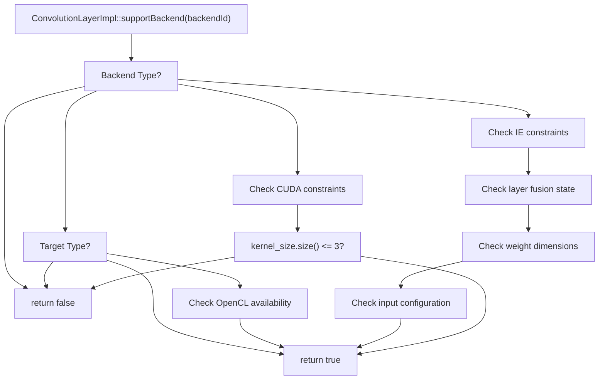
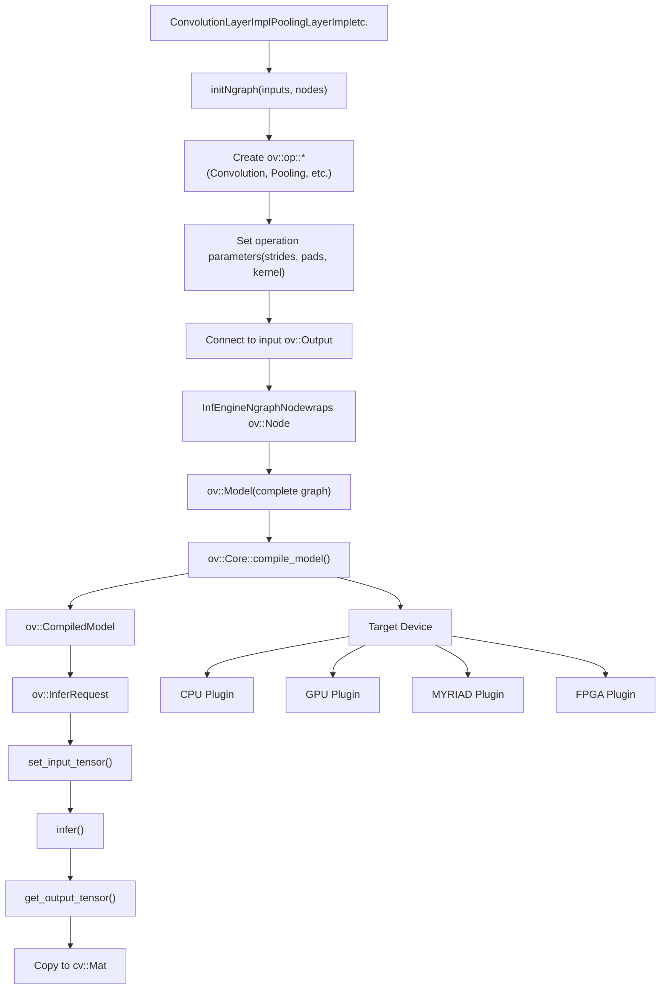
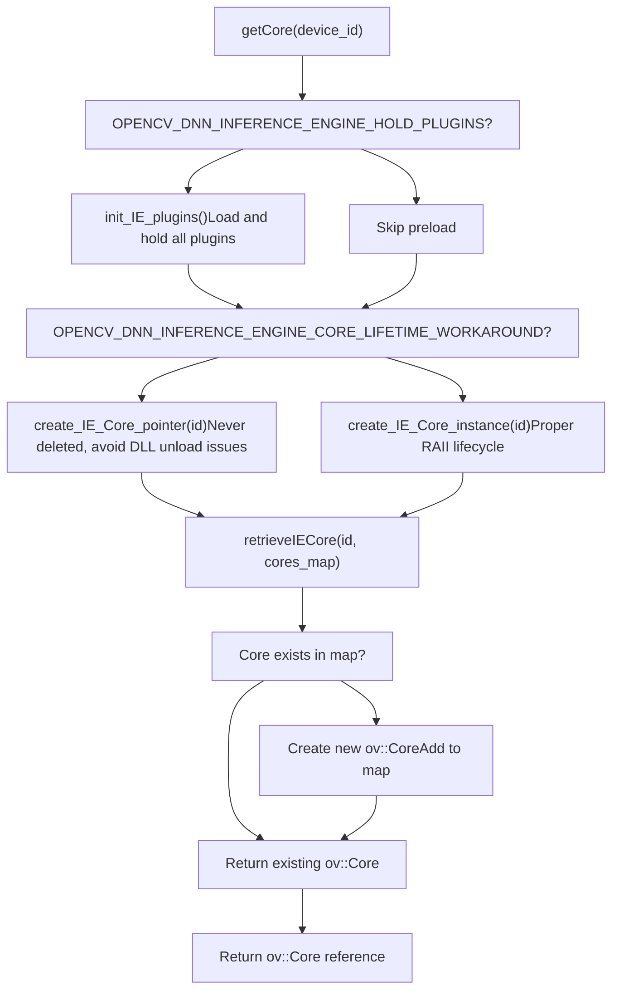
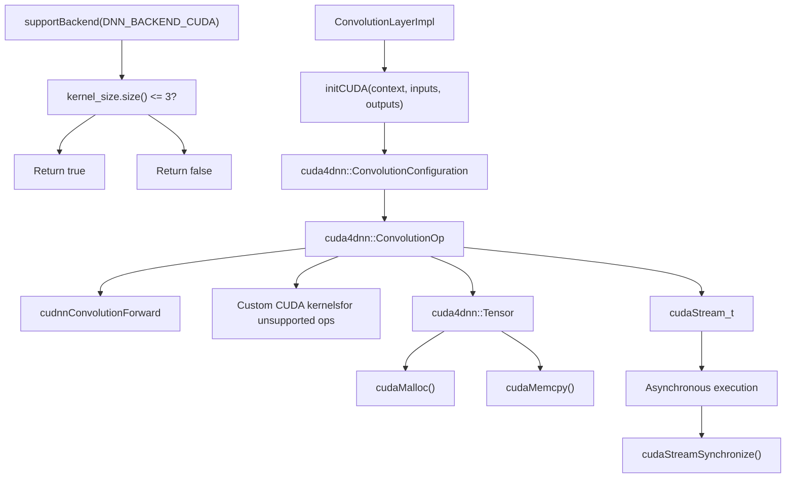
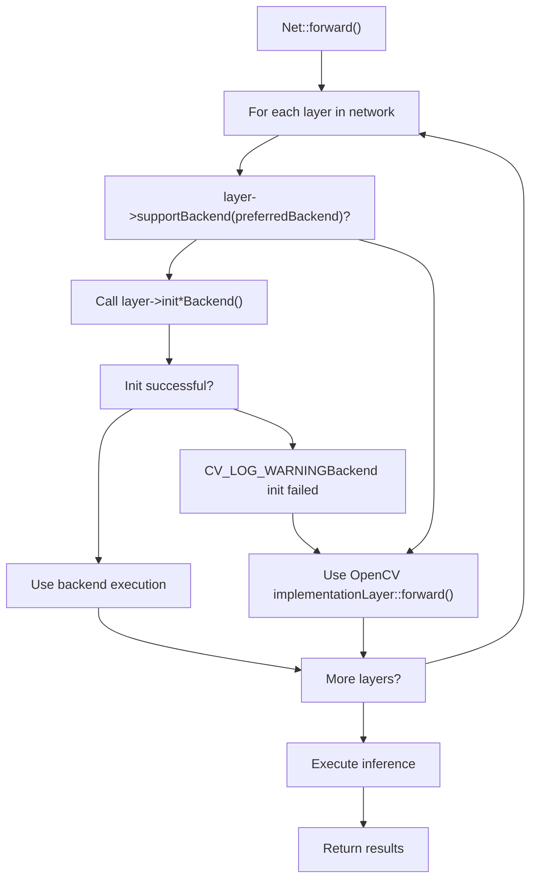
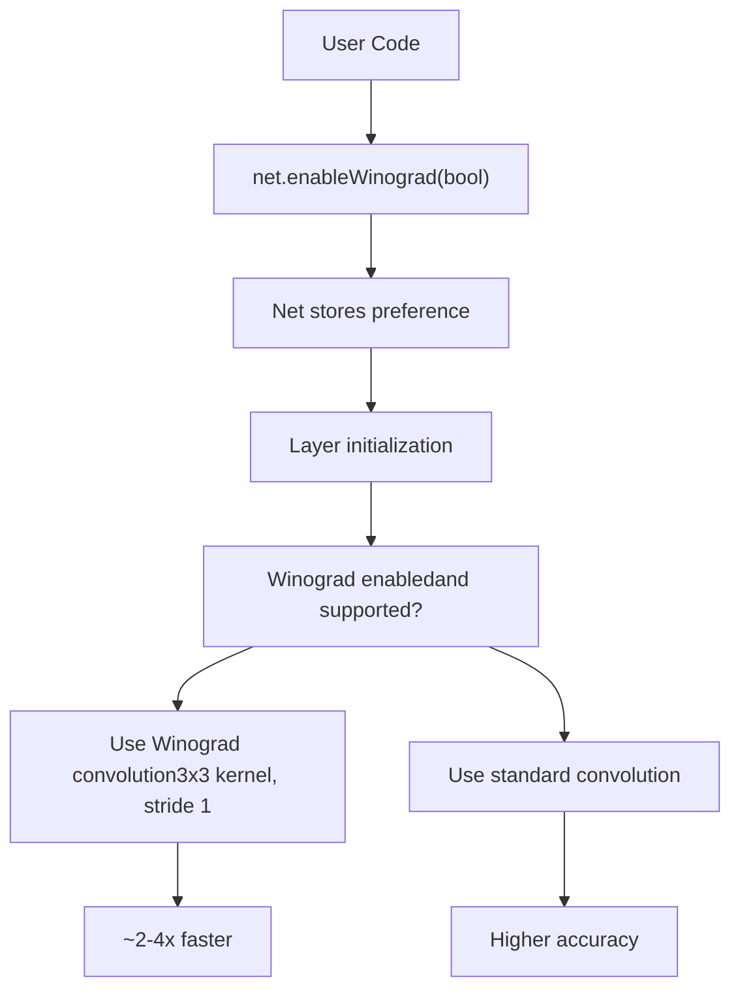
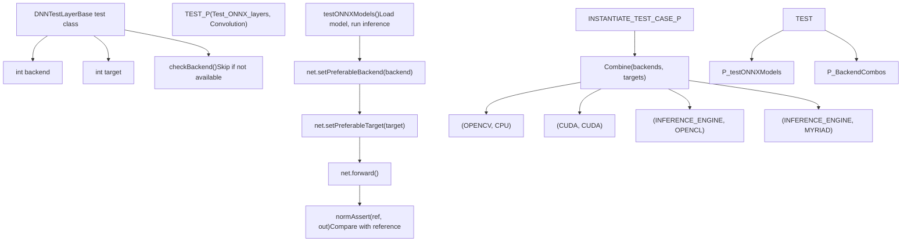

# 网络执行和后端选择

相关源文件

-   [cmake/OpenCVDetectInferenceEngine.cmake](https://github.com/opencv/opencv/blob/91c78f50/cmake/OpenCVDetectInferenceEngine.cmake)
-   [modules/dnn/CMakeLists.txt](https://github.com/opencv/opencv/blob/91c78f50/modules/dnn/CMakeLists.txt)
-   [modules/dnn/include/opencv2/dnn/all\_layers.hpp](https://github.com/opencv/opencv/blob/91c78f50/modules/dnn/include/opencv2/dnn/all_layers.hpp)
-   [modules/dnn/include/opencv2/dnn/dnn.hpp](https://github.com/opencv/opencv/blob/91c78f50/modules/dnn/include/opencv2/dnn/dnn.hpp)
-   [modules/dnn/misc/python/pyopencv\_dnn.hpp](https://github.com/opencv/opencv/blob/91c78f50/modules/dnn/misc/python/pyopencv_dnn.hpp)
-   [modules/dnn/misc/python/test/test\_dnn.py](https://github.com/opencv/opencv/blob/91c78f50/modules/dnn/misc/python/test/test_dnn.py)
-   [modules/dnn/perf/perf\_net.cpp](https://github.com/opencv/opencv/blob/91c78f50/modules/dnn/perf/perf_net.cpp)
-   [modules/dnn/perf/perf\_utils.cpp](https://github.com/opencv/opencv/blob/91c78f50/modules/dnn/perf/perf_utils.cpp)
-   [modules/dnn/src/caffe/caffe\_importer.cpp](https://github.com/opencv/opencv/blob/91c78f50/modules/dnn/src/caffe/caffe_importer.cpp)
-   [modules/dnn/src/cuda/activations.cu](https://github.com/opencv/opencv/blob/91c78f50/modules/dnn/src/cuda/activations.cu)
-   [modules/dnn/src/cuda/functors.hpp](https://github.com/opencv/opencv/blob/91c78f50/modules/dnn/src/cuda/functors.hpp)
-   [modules/dnn/src/cuda/mvn.cu](https://github.com/opencv/opencv/blob/91c78f50/modules/dnn/src/cuda/mvn.cu)
-   [modules/dnn/src/cuda4dnn/kernels/activations.hpp](https://github.com/opencv/opencv/blob/91c78f50/modules/dnn/src/cuda4dnn/kernels/activations.hpp)
-   [modules/dnn/src/cuda4dnn/kernels/mvn.hpp](https://github.com/opencv/opencv/blob/91c78f50/modules/dnn/src/cuda4dnn/kernels/mvn.hpp)
-   [modules/dnn/src/cuda4dnn/primitives/activation.hpp](https://github.com/opencv/opencv/blob/91c78f50/modules/dnn/src/cuda4dnn/primitives/activation.hpp)
-   [modules/dnn/src/cuda4dnn/primitives/group\_norm.hpp](https://github.com/opencv/opencv/blob/91c78f50/modules/dnn/src/cuda4dnn/primitives/group_norm.hpp)
-   [modules/dnn/src/cuda4dnn/primitives/matmul\_broadcast.hpp](https://github.com/opencv/opencv/blob/91c78f50/modules/dnn/src/cuda4dnn/primitives/matmul_broadcast.hpp)
-   [modules/dnn/src/cuda4dnn/primitives/mvn.hpp](https://github.com/opencv/opencv/blob/91c78f50/modules/dnn/src/cuda4dnn/primitives/mvn.hpp)
-   [modules/dnn/src/darknet/darknet\_importer.cpp](https://github.com/opencv/opencv/blob/91c78f50/modules/dnn/src/darknet/darknet_importer.cpp)
-   [modules/dnn/src/darknet/darknet\_io.cpp](https://github.com/opencv/opencv/blob/91c78f50/modules/dnn/src/darknet/darknet_io.cpp)
-   [modules/dnn/src/darknet/darknet\_io.hpp](https://github.com/opencv/opencv/blob/91c78f50/modules/dnn/src/darknet/darknet_io.hpp)
-   [modules/dnn/src/dnn.cpp](https://github.com/opencv/opencv/blob/91c78f50/modules/dnn/src/dnn.cpp)
-   [modules/dnn/src/dnn\_common.hpp](https://github.com/opencv/opencv/blob/91c78f50/modules/dnn/src/dnn_common.hpp)
-   [modules/dnn/src/dnn\_utils.cpp](https://github.com/opencv/opencv/blob/91c78f50/modules/dnn/src/dnn_utils.cpp)
-   [modules/dnn/src/graph\_simplifier.cpp](https://github.com/opencv/opencv/blob/91c78f50/modules/dnn/src/graph_simplifier.cpp)
-   [modules/dnn/src/graph\_simplifier.hpp](https://github.com/opencv/opencv/blob/91c78f50/modules/dnn/src/graph_simplifier.hpp)
-   [modules/dnn/src/ie\_ngraph.cpp](https://github.com/opencv/opencv/blob/91c78f50/modules/dnn/src/ie_ngraph.cpp)
-   [modules/dnn/src/ie\_ngraph.hpp](https://github.com/opencv/opencv/blob/91c78f50/modules/dnn/src/ie_ngraph.hpp)
-   [modules/dnn/src/init.cpp](https://github.com/opencv/opencv/blob/91c78f50/modules/dnn/src/init.cpp)
-   [modules/dnn/src/layers/batch\_norm\_layer.cpp](https://github.com/opencv/opencv/blob/91c78f50/modules/dnn/src/layers/batch_norm_layer.cpp)
-   [modules/dnn/src/layers/blank\_layer.cpp](https://github.com/opencv/opencv/blob/91c78f50/modules/dnn/src/layers/blank_layer.cpp)
-   [modules/dnn/src/layers/concat\_layer.cpp](https://github.com/opencv/opencv/blob/91c78f50/modules/dnn/src/layers/concat_layer.cpp)
-   [modules/dnn/src/layers/convolution\_layer.cpp](https://github.com/opencv/opencv/blob/91c78f50/modules/dnn/src/layers/convolution_layer.cpp)
-   [modules/dnn/src/layers/cpu\_kernels/fast\_norm.cpp](https://github.com/opencv/opencv/blob/91c78f50/modules/dnn/src/layers/cpu_kernels/fast_norm.cpp)
-   [modules/dnn/src/layers/cpu\_kernels/fast\_norm.hpp](https://github.com/opencv/opencv/blob/91c78f50/modules/dnn/src/layers/cpu_kernels/fast_norm.hpp)
-   [modules/dnn/src/layers/detection\_output\_layer.cpp](https://github.com/opencv/opencv/blob/91c78f50/modules/dnn/src/layers/detection_output_layer.cpp)
-   [modules/dnn/src/layers/elementwise\_layers.cpp](https://github.com/opencv/opencv/blob/91c78f50/modules/dnn/src/layers/elementwise_layers.cpp)
-   [modules/dnn/src/layers/fully\_connected\_layer.cpp](https://github.com/opencv/opencv/blob/91c78f50/modules/dnn/src/layers/fully_connected_layer.cpp)
-   [modules/dnn/src/layers/group\_norm\_layer.cpp](https://github.com/opencv/opencv/blob/91c78f50/modules/dnn/src/layers/group_norm_layer.cpp)
-   [modules/dnn/src/layers/layers\_common.simd.hpp](https://github.com/opencv/opencv/blob/91c78f50/modules/dnn/src/layers/layers_common.simd.hpp)
-   [modules/dnn/src/layers/lrn\_layer.cpp](https://github.com/opencv/opencv/blob/91c78f50/modules/dnn/src/layers/lrn_layer.cpp)
-   [modules/dnn/src/layers/mvn\_layer.cpp](https://github.com/opencv/opencv/blob/91c78f50/modules/dnn/src/layers/mvn_layer.cpp)
-   [modules/dnn/src/layers/normalize\_bbox\_layer.cpp](https://github.com/opencv/opencv/blob/91c78f50/modules/dnn/src/layers/normalize_bbox_layer.cpp)
-   [modules/dnn/src/layers/permute\_layer.cpp](https://github.com/opencv/opencv/blob/91c78f50/modules/dnn/src/layers/permute_layer.cpp)
-   [modules/dnn/src/layers/pooling\_layer.cpp](https://github.com/opencv/opencv/blob/91c78f50/modules/dnn/src/layers/pooling_layer.cpp)
-   [modules/dnn/src/layers/prior\_box\_layer.cpp](https://github.com/opencv/opencv/blob/91c78f50/modules/dnn/src/layers/prior_box_layer.cpp)
-   [modules/dnn/src/layers/proposal\_layer.cpp](https://github.com/opencv/opencv/blob/91c78f50/modules/dnn/src/layers/proposal_layer.cpp)
-   [modules/dnn/src/layers/recurrent\_layers.cpp](https://github.com/opencv/opencv/blob/91c78f50/modules/dnn/src/layers/recurrent_layers.cpp)
-   [modules/dnn/src/layers/region\_layer.cpp](https://github.com/opencv/opencv/blob/91c78f50/modules/dnn/src/layers/region_layer.cpp)
-   [modules/dnn/src/layers/reorg\_layer.cpp](https://github.com/opencv/opencv/blob/91c78f50/modules/dnn/src/layers/reorg_layer.cpp)
-   [modules/dnn/src/layers/reshape\_layer.cpp](https://github.com/opencv/opencv/blob/91c78f50/modules/dnn/src/layers/reshape_layer.cpp)
-   [modules/dnn/src/layers/scale\_layer.cpp](https://github.com/opencv/opencv/blob/91c78f50/modules/dnn/src/layers/scale_layer.cpp)
-   [modules/dnn/src/layers/slice\_layer.cpp](https://github.com/opencv/opencv/blob/91c78f50/modules/dnn/src/layers/slice_layer.cpp)
-   [modules/dnn/src/layers/softmax\_layer.cpp](https://github.com/opencv/opencv/blob/91c78f50/modules/dnn/src/layers/softmax_layer.cpp)
-   [modules/dnn/src/model.cpp](https://github.com/opencv/opencv/blob/91c78f50/modules/dnn/src/model.cpp)
-   [modules/dnn/src/net\_openvino.cpp](https://github.com/opencv/opencv/blob/91c78f50/modules/dnn/src/net_openvino.cpp)
-   [modules/dnn/src/onnx/onnx\_graph\_simplifier.cpp](https://github.com/opencv/opencv/blob/91c78f50/modules/dnn/src/onnx/onnx_graph_simplifier.cpp)
-   [modules/dnn/src/onnx/onnx\_graph\_simplifier.hpp](https://github.com/opencv/opencv/blob/91c78f50/modules/dnn/src/onnx/onnx_graph_simplifier.hpp)
-   [modules/dnn/src/onnx/onnx\_importer.cpp](https://github.com/opencv/opencv/blob/91c78f50/modules/dnn/src/onnx/onnx_importer.cpp)
-   [modules/dnn/src/op\_inf\_engine.cpp](https://github.com/opencv/opencv/blob/91c78f50/modules/dnn/src/op_inf_engine.cpp)
-   [modules/dnn/src/op\_inf\_engine.hpp](https://github.com/opencv/opencv/blob/91c78f50/modules/dnn/src/op_inf_engine.hpp)
-   [modules/dnn/src/opencl/activations.cl](https://github.com/opencv/opencv/blob/91c78f50/modules/dnn/src/opencl/activations.cl)
-   [modules/dnn/src/opencl/mvn.cl](https://github.com/opencv/opencv/blob/91c78f50/modules/dnn/src/opencl/mvn.cl)
-   [modules/dnn/src/opencl/prior\_box.cl](https://github.com/opencv/opencv/blob/91c78f50/modules/dnn/src/opencl/prior_box.cl)
-   [modules/dnn/src/opencl/region.cl](https://github.com/opencv/opencv/blob/91c78f50/modules/dnn/src/opencl/region.cl)
-   [modules/dnn/src/tensorflow/tf\_graph\_simplifier.cpp](https://github.com/opencv/opencv/blob/91c78f50/modules/dnn/src/tensorflow/tf_graph_simplifier.cpp)
-   [modules/dnn/src/tensorflow/tf\_graph\_simplifier.hpp](https://github.com/opencv/opencv/blob/91c78f50/modules/dnn/src/tensorflow/tf_graph_simplifier.hpp)
-   [modules/dnn/src/tensorflow/tf\_importer.cpp](https://github.com/opencv/opencv/blob/91c78f50/modules/dnn/src/tensorflow/tf_importer.cpp)
-   [modules/dnn/src/torch/torch\_importer.cpp](https://github.com/opencv/opencv/blob/91c78f50/modules/dnn/src/torch/torch_importer.cpp)
-   [modules/dnn/test/test\_backends.cpp](https://github.com/opencv/opencv/blob/91c78f50/modules/dnn/test/test_backends.cpp)
-   [modules/dnn/test/test\_caffe\_importer.cpp](https://github.com/opencv/opencv/blob/91c78f50/modules/dnn/test/test_caffe_importer.cpp)
-   [modules/dnn/test/test\_common.hpp](https://github.com/opencv/opencv/blob/91c78f50/modules/dnn/test/test_common.hpp)
-   [modules/dnn/test/test\_common.impl.hpp](https://github.com/opencv/opencv/blob/91c78f50/modules/dnn/test/test_common.impl.hpp)
-   [modules/dnn/test/test\_darknet\_importer.cpp](https://github.com/opencv/opencv/blob/91c78f50/modules/dnn/test/test_darknet_importer.cpp)
-   [modules/dnn/test/test\_graph\_simplifier.cpp](https://github.com/opencv/opencv/blob/91c78f50/modules/dnn/test/test_graph_simplifier.cpp)
-   [modules/dnn/test/test\_ie\_models.cpp](https://github.com/opencv/opencv/blob/91c78f50/modules/dnn/test/test_ie_models.cpp)
-   [modules/dnn/test/test\_layers.cpp](https://github.com/opencv/opencv/blob/91c78f50/modules/dnn/test/test_layers.cpp)
-   [modules/dnn/test/test\_misc.cpp](https://github.com/opencv/opencv/blob/91c78f50/modules/dnn/test/test_misc.cpp)
-   [modules/dnn/test/test\_model.cpp](https://github.com/opencv/opencv/blob/91c78f50/modules/dnn/test/test_model.cpp)
-   [modules/dnn/test/test\_onnx\_importer.cpp](https://github.com/opencv/opencv/blob/91c78f50/modules/dnn/test/test_onnx_importer.cpp)
-   [modules/dnn/test/test\_tf\_importer.cpp](https://github.com/opencv/opencv/blob/91c78f50/modules/dnn/test/test_tf_importer.cpp)
-   [modules/dnn/test/test\_torch\_importer.cpp](https://github.com/opencv/opencv/blob/91c78f50/modules/dnn/test/test_torch_importer.cpp)
-   [modules/flann/misc/python/pyopencv\_flann.hpp](https://github.com/opencv/opencv/blob/91c78f50/modules/flann/misc/python/pyopencv_flann.hpp)
-   [modules/ml/misc/python/pyopencv\_ml.hpp](https://github.com/opencv/opencv/blob/91c78f50/modules/ml/misc/python/pyopencv_ml.hpp)

## 目的和范围

本文档描述了 OpenCV DNN 模块如何跨不同的计算后端和硬件目标执行神经网络。它涵盖了后端选择机制、分层后端支持、后端特定初始化以及从网络配置到推理的执行流程。

有关模型导入和图形构建的信息，请参阅[Model Importers](/opencv/opencv/5.1-model-importers-(onnx-tensorflow-caffe-darknet)）。有关特定层实现的详细信息，请参阅其他部分中的层文档。

---

## 后端和目标枚举

OpenCV DNN 提供了一个抽象层，允许同一网络在不同的计算后端和硬件目标上执行。后端决定执行引擎，而目标指定硬件设备。

### 支持的后端和目标

```mermaid
flowchart TD
    BACKEND["cv::dnn::Backend enum"]
    OPENCV["DNN_BACKEND_OPENCVPure OpenCV implementation"]
    IE["DNN_BACKEND_INFERENCE_ENGINEIntel OpenVINO"]
    CUDA["DNN_BACKEND_CUDANVIDIA CUDA + cuDNN"]
    HALIDE["DNN_BACKEND_HALIDEHalide compiler"]
    VKCOM["DNN_BACKEND_VKCOMVulkan Compute"]
    WEBNN["DNN_BACKEND_WEBNNWeb Neural Network API"]
    TIMVX["DNN_BACKEND_TIMVXVeriSilicon TIM-VX"]
    CANN["DNN_BACKEND_CANNHuawei CANN"]
    TARGET["cv::dnn::Target enum"]
    CPU["DNN_TARGET_CPU"]
    OPENCL["DNN_TARGET_OPENCL"]
    OPENCL_FP16["DNN_TARGET_OPENCL_FP16"]
    MYRIAD["DNN_TARGET_MYRIADIntel Movidius"]
    CUDA_T["DNN_TARGET_CUDA"]
    CUDA_FP16["DNN_TARGET_CUDA_FP16"]
    FPGA["DNN_TARGET_FPGA"]
    HDDL["DNN_TARGET_HDDL"]
    NPU["DNN_TARGET_NPU"]
    CPU_FP16["DNN_TARGET_CPU_FP16"]

    BACKEND --> OPENCV
    BACKEND --> IE
    BACKEND --> CUDA
    BACKEND --> HALIDE
    BACKEND --> VKCOM
    BACKEND --> WEBNN
    BACKEND --> TIMVX
    BACKEND --> CANN
    TARGET --> CPU
    TARGET --> OPENCL
    TARGET --> OPENCL_FP16
    TARGET --> MYRIAD
    TARGET --> CUDA_T
    TARGET --> CUDA_FP16
    TARGET --> FPGA
    TARGET --> HDDL
    TARGET --> NPU
    TARGET --> CPU_FP16
    OPENCV --> CPU
    OPENCV --> OPENCL
    OPENCV --> OPENCL_FP16
    IE --> CPU
    IE --> OPENCL
    IE --> MYRIAD
    IE --> FPGA
    CUDA --> CUDA_T
    CUDA --> CUDA_FP16
```


**来源：**

-   [modules/dnn/include/opencv2/dnn/dnn.hpp70-108](https://github.com/opencv/opencv/blob/91c78f50/modules/dnn/include/opencv2/dnn/dnn.hpp#L70-L108)

---

## 网络配置流程

用户通过配置后端和目标选择`cv::dnn::Net`班级。此配置在网络初始化期间传播到所有层。

### 配置 API 和执行设置

> **[美人鱼序列]**
> *(图表结构无法解析)*

**关键API方法：**

| 方法 | 目的 | 地点 |
| --- | --- | --- |
| `Net::setPreferableBackend(int)` | 配置执行后端 | `cv::dnn::Net` |
| `Net::setPreferableTarget(int)` | 配置硬件目标 | `cv::dnn::Net` |
| `Layer::supportBackend(int)` | 检查图层是否支持后端 | `cv::dnn::Layer` |
| `Layer::init*()` | 创建后端特定节点 | `cv::dnn::Layer` |

**来源：**

-   [modules/dnn/include/opencv2/dnn/dnn.hpp315-370](https://github.com/opencv/opencv/blob/91c78f50/modules/dnn/include/opencv2/dnn/dnn.hpp#L315-L370)
-   [modules/dnn/test/test\_backends.cpp14-73](https://github.com/opencv/opencv/blob/91c78f50/modules/dnn/test/test_backends.cpp#L14-L73)

---

## 层后端支持架构

每层实现通过以下方式确定它支持哪些后端`supportBackend()`方法并通过以下方式提供特定于后端的初始化`init*()`方法。

### 后端支持接口

```mermaid
flowchart TD
    Layer["cv::dnn::Layer"]
    supportBackend["virtual boolsupportBackend(backendId)"]
    initHalide["virtual Ptr<BackendNode>initHalide(inputs)"]
    initNgraph["virtual Ptr<BackendNode>initNgraph(inputs, nodes)"]
    initVkCom["virtual Ptr<BackendNode>initVkCom(inputs, outputs)"]
    initWebnn["virtual Ptr<BackendNode>initWebnn(inputs, nodes)"]
    initCUDA["virtual Ptr<BackendNode>initCUDA(context, inputs, outputs)"]
    initTimVX["virtual Ptr<BackendNode>initTimVX(info, inputs, outputs)"]
    initCann["virtual Ptr<BackendNode>initCann(inputs, outputs, nodes)"]
    ConvLayer["ConvolutionLayerImpl"]
    supportBackend_impl["supportBackend()checks CUDA/OpenCL/IE support"]
    initCUDA_impl["initCUDA()creates CUDA convolution primitive"]
    initNgraph_impl["initNgraph()creates OpenVINO IR node"]
    BackendNode["BackendNodeBase class"]
    HalideNode["HalideBackendNodeHalide::Func"]
    NgraphNode["InfEngineNgraphNodeov::Node"]
    CUDANode["CUDABackendNodeCUDA kernel wrapper"]
    VkComNode["VkComBackendNodeVulkan shader"]
    WebnnNode["WebnnBackendNodeWebNN operator"]

    Layer --> supportBackend
    Layer --> initHalide
    Layer --> initNgraph
    Layer --> initVkCom
    Layer --> initWebnn
    Layer --> initCUDA
    Layer --> initTimVX
    Layer --> initCann
    ConvLayer --> supportBackend_impl
    ConvLayer --> initCUDA_impl
    ConvLayer --> initNgraph_impl
    Layer --> ConvLayer
    initHalide --> HalideNode
    initNgraph --> NgraphNode
    initCUDA --> CUDANode
    initVkCom --> VkComNode
    initWebnn --> WebnnNode
```


**后端节点类型：**

| 后端 | 节点类 | 目的 |
| --- | --- | --- |
| 卤化物 | `HalideBackendNode` | 包装 Halide::Func 以进行 JIT 编译 |
| 开放VINO | `InfEngineNgraphNode` | 包装 ov::Node 以供 IE 执行 |
| CUDA | `CUDABackendNode` | 包装 CUDA 内核启动配置 |
| 伏尔甘 | `VkComBackendNode` | 包裹 Vulkan 计算着色器 |
| 网络神经网络 | `WebnnBackendNode` | 包装 WebNN ML 运算符 |

**来源：**

-   [modules/dnn/include/opencv2/dnn/dnn.hpp158-211](https://github.com/opencv/opencv/blob/91c78f50/modules/dnn/include/opencv2/dnn/dnn.hpp#L158-L211)
-   [modules/dnn/include/opencv2/dnn/dnn.hpp315-370](https://github.com/opencv/opencv/blob/91c78f50/modules/dnn/include/opencv2/dnn/dnn.hpp#L315-L370)
-   [modules/dnn/src/layers/convolution\_layer.cpp300-400](https://github.com/opencv/opencv/blob/91c78f50/modules/dnn/src/layers/convolution_layer.cpp#L300-L400)

---

## 具体实现：卷积层

卷积层演示了后端支持在实践中是如何实现的。每个后端都需要特定的配置，并且可能有不同的限制。

### 卷积后端支持逻辑


**示例：CUDA 后端初始化**

**来源：**

-   [modules/dnn/src/layers/convolution\_layer.cpp300-400](https://github.com/opencv/opencv/blob/91c78f50/modules/dnn/src/layers/convolution_layer.cpp#L300-L400)
-   [modules/dnn/src/layers/convolution\_layer.cpp600-900](https://github.com/opencv/opencv/blob/91c78f50/modules/dnn/src/layers/convolution_layer.cpp#L600-L900)

---

## 后端包装系统

这`BackendWrapper`抽象管理主机（CPU）内存和设备（GPU、加速器）内存之间的数据传输。不同的后端有不同的包装器实现。

### 后端包装层次结构


**包装员职责：**

| 手术 | 目的 | 执行 |
| --- | --- | --- |
| `copyToHost()` | 将数据从设备传输到 CPU | 将设备内存同步到 Mat |
| `setHostDirty()` | 将 CPU 数据标记为已修改 | 下次设备访问时触发上传 |
| 建造 | 分配设备内存 | 创建设备缓冲区，从 Mat 复制 |

**来源：**

-   [modules/dnn/include/opencv2/dnn/dnn.hpp171-211](https://github.com/opencv/opencv/blob/91c78f50/modules/dnn/include/opencv2/dnn/dnn.hpp#L171-L211)
-   [modules/dnn/src/op\_inf\_engine.cpp42-66](https://github.com/opencv/opencv/blob/91c78f50/modules/dnn/src/op_inf_engine.cpp#L42-L66)

---

## 推理引擎 (OpenVINO) 后端

OpenVINO 后端是功能最齐全的后端之一，支持 Intel CPU、GPU 和 VPU（Myriad、HDDL）。它使用 OpenVINO 的 nGraph 中间表示。

### OpenVINO 集成架构


**关键 OpenVINO 类：**

| OpenCV 类 | OpenVINO 等效项 | 目的 |
| --- | --- | --- |
| `InfEngineNgraphNode` | `ov::Node` | 包裹单个操作 |
| `InfEngineNgraphNet` | `ov::Model` | 完整的网络图 |
| `InfEngineBackendWrapper` | `ov::Tensor` | 输入/输出数据包装器 |
| `NgraphBackendNode` | 后端执行节点 | 管理编译模型 |

**来源：**

-   [modules/dnn/src/op\_inf\_engine.hpp1-100](https://github.com/opencv/opencv/blob/91c78f50/modules/dnn/src/op_inf_engine.hpp#L1-L100)
-   [modules/dnn/src/op\_inf\_engine.cpp68-234](https://github.com/opencv/opencv/blob/91c78f50/modules/dnn/src/op_inf_engine.cpp#L68-L234)
-   [modules/dnn/src/ie\_ngraph.cpp1-100](https://github.com/opencv/opencv/blob/91c78f50/modules/dnn/src/ie_ngraph.cpp#L1-L100)

---

## OpenVINO 核心管理

OpenVINO 需要一个`ov::Core`对象来管理插件和编译模型。 OpenCV 通过具有插件生命周期管理的单例模式来管理这一点。

### 核心实例管理


**配置参数：**

| 范围 | 默认 | 目的 |
| --- | --- | --- |
| `OPENCV_DNN_INFERENCE_ENGINE_HOLD_PLUGINS` | 真的 | 预加载插件以避免内存泄漏工具报告 |
| `OPENCV_DNN_INFERENCE_ENGINE_CORE_LIFETIME_WORKAROUND` | true (Windows)、false (Linux) | 避免 Windows 上的 DLL 卸载问题 |
| `OPENCV_DNN_IE_VPU_TYPE` | 自动检测 | 强制 Myriad2 与 MyriadX 检测 |

**来源：**

-   [modules/dnn/src/op\_inf\_engine.cpp68-138](https://github.com/opencv/opencv/blob/91c78f50/modules/dnn/src/op_inf_engine.cpp#L68-L138)
-   [cmake/OpenCVDetectInferenceEngine.cmake1-16](https://github.com/opencv/opencv/blob/91c78f50/cmake/OpenCVDetectInferenceEngine.cmake#L1-L16)

---

## CUDA后端执行

CUDA 后端使用 cuDNN 在 NVIDIA GPU 上提供高性能推理，以优化基元，并使用自定义 CUDA 内核来执行 cuDNN 未涵盖的操作。

### CUDA 后端组件


**CUDA 后端限制：**

| 图层类型 | 约束 | 原因 |
| --- | --- | --- |
| 卷积 | 仅 1D、2D、3D | cuDNN API 限制 |
| 广播 | 图案有限 | 自定义内核复杂性 |
| 动态形状 | 并不总是支持 | 需要重新编译 |

**来源：**

-   [modules/dnn/src/layers/convolution\_layer.cpp303-311](https://github.com/opencv/opencv/blob/91c78f50/modules/dnn/src/layers/convolution_layer.cpp#L303-L311)
-   [modules/dnn/CMakeLists.txt38-56](https://github.com/opencv/opencv/blob/91c78f50/modules/dnn/CMakeLists.txt#L38-L56)

---

## 后端回退机制

当某个层不支持所请求的后端时，OpenCV 会自动回退到 CPU 上的默认 OpenCV 实现。

### 后备决策流程


**后备日志记录：**

当后端初始化失败或某个层不支持后端时，OpenCV 会记录诊断信息：

```
[DNN] Layer 'conv1' does not support CUDA backend, using OpenCV implementation
[DNN] Failed to initialize OpenVINO backend for 'fc8', falling back to CPU
```
**来源：**

-   [modules/dnn/test/test\_backends.cpp20-73](https://github.com/opencv/opencv/blob/91c78f50/modules/dnn/test/test_backends.cpp#L20-L73)
-   [modules/dnn/test/test\_layers.cpp96-163](https://github.com/opencv/opencv/blob/91c78f50/modules/dnn/test/test_layers.cpp#L96-L163)

---

## Winograd 优化控制

Winograd 卷积算法对于某些内核大小可以提供更快的执行速度，但可能会牺牲准确性。 OpenCV 允许按网络控制此优化。

### Winograd 配置


**API使用：**

```
cv::dnn::Net net = cv::dnn::readNet("model.onnx");net.setPreferableBackend(cv::dnn::DNN_BACKEND_OPENCV);net.enableWinograd(false);  // Disable for accuracy-critical applications
```
**当威诺格拉德适用时：**

| 健康）状况 | 要求 |
| --- | --- |
| 内核大小 | 3x3 或 5x5 |
| 跨步 | 1x1 |
| 扩张 | 1x1 |
| 输入通道 | \> 2 |
| 后端 | OpenCV CPU 或 OpenCL |

**来源：**

-   [modules/dnn/test/test\_onnx\_importer.cpp68-95](https://github.com/opencv/opencv/blob/91c78f50/modules/dnn/test/test_onnx_importer.cpp#L68-L95)
-   [modules/dnn/test/test\_darknet\_importer.cpp76-99](https://github.com/opencv/opencv/blob/91c78f50/modules/dnn/test/test_darknet_importer.cpp#L76-L99)

---

## 测试和验证

OpenCV 包括广泛的测试来验证后端行为并确保跨实现的一致性。

### 后端测试结构


**测试示例模式：**

```
TEST_P(Test_ONNX_layers, Convolution) {    testONNXModels("convolution");  // Model name} // Runs the same test with all backend/target combinations
```
**来源：**

-   [modules/dnn/test/test\_onnx\_importer.cpp31-128](https://github.com/opencv/opencv/blob/91c78f50/modules/dnn/test/test_onnx_importer.cpp#L31-L128)
-   [modules/dnn/test/test\_backends.cpp13-136](https://github.com/opencv/opencv/blob/91c78f50/modules/dnn/test/test_backends.cpp#L13-L136)
-   [modules/dnn/test/test\_common.hpp1-100](https://github.com/opencv/opencv/blob/91c78f50/modules/dnn/test/test_common.hpp#L1-L100)

---

## 关键类和函数总结

| 成分 | 地点 | 目的 |
| --- | --- | --- |
| `cv::dnn::Net` | `modules/dnn/include/opencv2/dnn/dnn.hpp` | 主网络接口，管理后端选择 |
| `cv::dnn::Layer` | `modules/dnn/include/opencv2/dnn/dnn.hpp` | 具有后端支持接口的基础层类 |
| `cv::dnn::BackendNode` | `modules/dnn/include/opencv2/dnn/dnn.hpp:158-166` | 后端特定执行节点包装器 |
| `cv::dnn::BackendWrapper` | `modules/dnn/include/opencv2/dnn/dnn.hpp:171-211` | 设备内存管理抽象 |
| `getCore()` | `modules/dnn/src/op_inf_engine.cpp:100-121` | OpenVINO Core 单例管理 |
| `Layer::supportBackend()` | `modules/dnn/include/opencv2/dnn/dnn.hpp:315` | 检查后端对图层的支持 |
| `Layer::init*()`方法 | `modules/dnn/include/opencv2/dnn/dnn.hpp:327-370` | 创建后端特定节点 |
| `Net::setPreferableBackend()` | `cv::dnn::Net`应用程序编程接口 | 配置执行后端 |
| `Net::setPreferableTarget()` | `cv::dnn::Net`应用程序编程接口 | 配置硬件目标 |
| `Net::enableWinograd()` | `cv::dnn::Net`应用程序编程接口 | 控制 Winograd 优化 |
