# 特征检测和匹配（features2d）

相关源文件

-   [modules/features2d/include/opencv2/features2d.hpp](https://github.com/opencv/opencv/blob/91c78f50/modules/features2d/include/opencv2/features2d.hpp)
-   [modules/features2d/include/opencv2/features2d/features2d.hpp](https://github.com/opencv/opencv/blob/91c78f50/modules/features2d/include/opencv2/features2d/features2d.hpp)
-   [modules/features2d/src/agast.cpp](https://github.com/opencv/opencv/blob/91c78f50/modules/features2d/src/agast.cpp)
-   [modules/features2d/src/agast\_score.cpp](https://github.com/opencv/opencv/blob/91c78f50/modules/features2d/src/agast_score.cpp)
-   [modules/features2d/src/agast\_score.hpp](https://github.com/opencv/opencv/blob/91c78f50/modules/features2d/src/agast_score.hpp)
-   [modules/features2d/src/bagofwords.cpp](https://github.com/opencv/opencv/blob/91c78f50/modules/features2d/src/bagofwords.cpp)
-   [modules/features2d/src/blobdetector.cpp](https://github.com/opencv/opencv/blob/91c78f50/modules/features2d/src/blobdetector.cpp)
-   [modules/features2d/src/brisk.cpp](https://github.com/opencv/opencv/blob/91c78f50/modules/features2d/src/brisk.cpp)
-   [modules/features2d/src/draw.cpp](https://github.com/opencv/opencv/blob/91c78f50/modules/features2d/src/draw.cpp)
-   [modules/features2d/src/dynamic.cpp](https://github.com/opencv/opencv/blob/91c78f50/modules/features2d/src/dynamic.cpp)
-   [modules/features2d/src/evaluation.cpp](https://github.com/opencv/opencv/blob/91c78f50/modules/features2d/src/evaluation.cpp)
-   [modules/features2d/src/fast.cpp](https://github.com/opencv/opencv/blob/91c78f50/modules/features2d/src/fast.cpp)
-   [modules/features2d/src/feature2d.cpp](https://github.com/opencv/opencv/blob/91c78f50/modules/features2d/src/feature2d.cpp)
-   [modules/features2d/src/gftt.cpp](https://github.com/opencv/opencv/blob/91c78f50/modules/features2d/src/gftt.cpp)
-   [modules/features2d/src/keypoint.cpp](https://github.com/opencv/opencv/blob/91c78f50/modules/features2d/src/keypoint.cpp)
-   [modules/features2d/src/matchers.cpp](https://github.com/opencv/opencv/blob/91c78f50/modules/features2d/src/matchers.cpp)
-   [modules/features2d/src/mser.cpp](https://github.com/opencv/opencv/blob/91c78f50/modules/features2d/src/mser.cpp)
-   [modules/features2d/src/orb.cpp](https://github.com/opencv/opencv/blob/91c78f50/modules/features2d/src/orb.cpp)
-   [modules/features2d/test/test\_agast.cpp](https://github.com/opencv/opencv/blob/91c78f50/modules/features2d/test/test_agast.cpp)
-   [modules/features2d/test/test\_blobdetector.cpp](https://github.com/opencv/opencv/blob/91c78f50/modules/features2d/test/test_blobdetector.cpp)
-   [modules/features2d/test/test\_brisk.cpp](https://github.com/opencv/opencv/blob/91c78f50/modules/features2d/test/test_brisk.cpp)
-   [modules/features2d/test/test\_descriptors\_regression.cpp](https://github.com/opencv/opencv/blob/91c78f50/modules/features2d/test/test_descriptors_regression.cpp)
-   [modules/features2d/test/test\_detectors\_regression.cpp](https://github.com/opencv/opencv/blob/91c78f50/modules/features2d/test/test_detectors_regression.cpp)
-   [modules/features2d/test/test\_drawing.cpp](https://github.com/opencv/opencv/blob/91c78f50/modules/features2d/test/test_drawing.cpp)
-   [modules/features2d/test/test\_keypoints.cpp](https://github.com/opencv/opencv/blob/91c78f50/modules/features2d/test/test_keypoints.cpp)
-   [modules/features2d/test/test\_matchers\_algorithmic.cpp](https://github.com/opencv/opencv/blob/91c78f50/modules/features2d/test/test_matchers_algorithmic.cpp)
-   [modules/features2d/test/test\_orb.cpp](https://github.com/opencv/opencv/blob/91c78f50/modules/features2d/test/test_orb.cpp)
-   [modules/features2d/test/test\_utils.cpp](https://github.com/opencv/opencv/blob/91c78f50/modules/features2d/test/test_utils.cpp)
-   [modules/java/generator/src/cpp/jni\_part.cpp](https://github.com/opencv/opencv/blob/91c78f50/modules/java/generator/src/cpp/jni_part.cpp)
-   [samples/cpp/em.cpp](https://github.com/opencv/opencv/blob/91c78f50/samples/cpp/em.cpp)
-   [samples/cpp/letter\_recog.cpp](https://github.com/opencv/opencv/blob/91c78f50/samples/cpp/letter_recog.cpp)
-   [samples/cpp/points\_classifier.cpp](https://github.com/opencv/opencv/blob/91c78f50/samples/cpp/points_classifier.cpp)
-   [samples/cpp/watershed.cpp](https://github.com/opencv/opencv/blob/91c78f50/samples/cpp/watershed.cpp)

## 目的和范围

这`features2d`模块提供用于检测、描述和匹配局部图像特征的基本计算机视觉功能。该模块构成了物体识别、图像拼接、运动结构和视觉 SLAM 等任务的基础。它实现了经典特征检测器（SIFT、ORB、AKAZE）和描述符匹配算法，以及用于特征评估和可视化的支持基础设施。

有关特定特征检测算法（SIFT、ORB、AKAZE 等）的详细信息，请参阅第 6.1 页。有关匹配策略和词袋框架的深入介绍，请参见第 6.2 页。

**来源：**[modules/features2d/include/opencv2/features2d.hpp76-224](https://github.com/opencv/opencv/blob/91c78f50/modules/features2d/include/opencv2/features2d.hpp#L76-L224) [modules/features2d/src/matchers.cpp1-50](https://github.com/opencv/opencv/blob/91c78f50/modules/features2d/src/matchers.cpp#L1-L50) [modules/features2d/src/keypoint.cpp1-50](https://github.com/opencv/opencv/blob/91c78f50/modules/features2d/src/keypoint.cpp#L1-L50) [modules/features2d/src/bagofwords.cpp1-50](https://github.com/opencv/opencv/blob/91c78f50/modules/features2d/src/bagofwords.cpp#L1-L50)

---

## 模块架构

features2d 模块被组织成几个互连的子系统，将图像转换为基于特征的表示并建立图像之间的对应关系。

### 组件层次结构

中心抽象是`Feature2D`，这两者都是`FeatureDetector`和`DescriptorExtractor`（两者都是 typedef`Feature2D`）。所有具体的检测器/描述符类都继承自它。

**类/typedef 映射（来自`features2d.hpp`):**

```mermaid
flowchart TD
    KPF["KeyPointsFilter"]
    DRAW["drawKeypointsdrawMatchesdrawMatchesKnn"]
    EVAL["evaluateFeatureDetectorcomputeRecallPrecisionCurve"]
    BOW_T["BOWTrainer"]
    BOW_KM["BOWKMeansTrainer"]
    BOW_EX["BOWImgDescriptorExtractor"]
    DM["DescriptorMatcher"]
    BF["BFMatcher"]
    FLANN["FlannBasedMatcher"]
    F2D["Feature2D(also typedef'd as FeatureDetectorand DescriptorExtractor)"]
    SIFT["SIFT"]
    ORB["ORB"]
    BRISK["BRISK"]
    KAZE["KAZE"]
    AKAZE["AKAZE"]
    FAST["FastFeatureDetector"]
    AGAST["AgastFeatureDetector"]
    GFTT["GFTTDetector"]
    MSER["MSER"]
    BLOB["SimpleBlobDetector"]
    AFF["AffineFeature"]

    F2D --> SIFT
    F2D --> ORB
    F2D --> BRISK
    F2D --> KAZE
    F2D --> AKAZE
    F2D --> FAST
    F2D --> AGAST
    F2D --> GFTT
    F2D --> MSER
    F2D --> BLOB
    F2D --> AFF
    BOW --> T_BOW_KM
    DM --> BF
    DM --> FLANN
```
资料来源：[modules/features2d/include/opencv2/features2d.hpp130-260](https://github.com/opencv/opencv/blob/91c78f50/modules/features2d/include/opencv2/features2d.hpp#L130-L260) [modules/features2d/src/feature2d.cpp1-100](https://github.com/opencv/opencv/blob/91c78f50/modules/features2d/src/feature2d.cpp#L1-L100) [modules/features2d/src/matchers.cpp409-684](https://github.com/opencv/opencv/blob/91c78f50/modules/features2d/src/matchers.cpp#L409-L684) [modules/features2d/src/bagofwords.cpp47-216](https://github.com/opencv/opencv/blob/91c78f50/modules/features2d/src/bagofwords.cpp#L47-L216) [modules/features2d/src/keypoint.cpp47-293](https://github.com/opencv/opencv/blob/91c78f50/modules/features2d/src/keypoint.cpp#L47-L293)

---

## 核心数据结构

### 关键点

这`KeyPoint`结构（定义于`opencv2/core/types.hpp`，在 features2d) 中使用，表示检测到的特征位置。

| 场地 | 类型 | 描述 |
| --- | --- | --- |
| `pt` | `Point2f` | 图像坐标中的特征位置 (x, y) |
| `size` | `float` | 特征直径（尺度信息） |
| `angle` | `float` | 以度为单位的特征方向\[如果未计算则为-1\] |
| `response` | `float` | 检测器响应强度（用于过滤） |
| `octave` | `int` | 检测到特征的金字塔八度音阶 |
| `class_id` | `int` | 用户定义的对象/类标识符 |

资料来源：[modules/features2d/src/keypoint.cpp47-294](https://github.com/opencv/opencv/blob/91c78f50/modules/features2d/src/keypoint.cpp#L47-L294) [modules/features2d/src/draw.cpp53-89](https://github.com/opencv/opencv/blob/91c78f50/modules/features2d/src/draw.cpp#L53-L89)

### DM匹配

`DMatch`表示来自不同集合的两个描述符之间的匹配。

| 场地 | 类型 | 描述 |
| --- | --- | --- |
| `queryIdx` | `int` | 查询集中描述符的索引 |
| `trainIdx` | `int` | 列车集中描述符的索引 |
| `imgIdx` | `int` | 列车图像索引（用于多图像匹配） |
| `distance` | `float` | 描述符之间的距离（越低越好） |

资料来源：[modules/features2d/src/matchers.cpp515-525](https://github.com/opencv/opencv/blob/91c78f50/modules/features2d/src/matchers.cpp#L515-L525) [modules/features2d/src/draw.cpp206-248](https://github.com/opencv/opencv/blob/91c78f50/modules/features2d/src/draw.cpp#L206-L248)

### 描述符集合

`DescriptorMatcher::DescriptorCollection`将每个图像描述符矩阵合并为一个连续的`Mat`用于高效的批量查找。

**`DescriptorMatcher::DescriptorCollection`内部布局：**

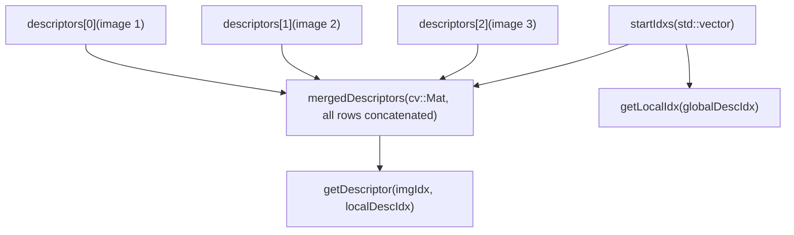
资料来源：[modules/features2d/src/matchers.cpp411-510](https://github.com/opencv/opencv/blob/91c78f50/modules/features2d/src/matchers.cpp#L411-L510)

---

## 特征检测和描述管道

典型的工作流程遵循检测→描述→匹配模式。`Feature2D`公开了三个核心虚拟方法：`detect()`, `compute()`， 和`detectAndCompute()`。大多数具体实现都会覆盖`detectAndCompute()`一次完成这两个步骤（例如 ORB、BRISK、SIFT）。

**具有 API 方法名称的端到端管道：**

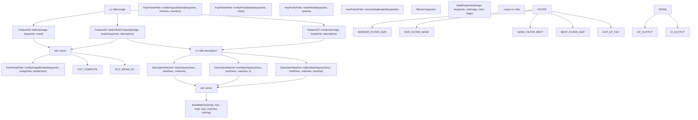
资料来源：[modules/features2d/include/opencv2/features2d.hpp139-223](https://github.com/opencv/opencv/blob/91c78f50/modules/features2d/include/opencv2/features2d.hpp#L139-L223) [modules/features2d/src/feature2d.cpp1-100](https://github.com/opencv/opencv/blob/91c78f50/modules/features2d/src/feature2d.cpp#L1-L100) [modules/features2d/src/matchers.cpp579-618](https://github.com/opencv/opencv/blob/91c78f50/modules/features2d/src/matchers.cpp#L579-L618) [modules/features2d/src/keypoint.cpp69-169](https://github.com/opencv/opencv/blob/91c78f50/modules/features2d/src/keypoint.cpp#L69-L169) [modules/features2d/src/draw.cpp91-248](https://github.com/opencv/opencv/blob/91c78f50/modules/features2d/src/draw.cpp#L91-L248)

---

## 描述符匹配系统

描述符匹配系统提供了一个灵活的框架，用于查找不同图像的特征描述符之间的对应关系。

### DescriptorMatcher 类层次结构

**`DescriptorMatcher`类层次结构和配置：**

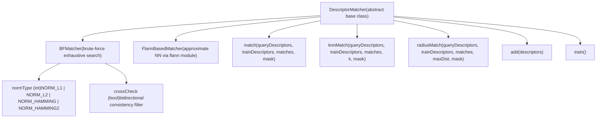
资料来源：[modules/features2d/include/opencv2/features2d.hpp900-1100](https://github.com/opencv/opencv/blob/91c78f50/modules/features2d/include/opencv2/features2d.hpp#L900-L1100) [modules/features2d/src/matchers.cpp527-684](https://github.com/opencv/opencv/blob/91c78f50/modules/features2d/src/matchers.cpp#L527-L684) [modules/features2d/src/matchers.cpp708-731](https://github.com/opencv/opencv/blob/91c78f50/modules/features2d/src/matchers.cpp#L708-L731)

### 匹配模式

`DescriptorMatcher`提供三种匹配模式：

| 方法 | 输出 | 典型用途 |
| --- | --- | --- |
| `match()` | 1 `DMatch`每个查询 | 快速、一对一的对应 |
| `knnMatch(k)` | 最多 k`DMatch`每个查询 | 劳氏比率测试过滤 |
| `radiusMatch(maxDist)` | 全部`DMatch`距离内 | 基于阈值的过滤 |

在内部，`match()`是通过调用实现的`knnMatch(k=1)`并转换结果（[modules/features2d/src/matchers.cpp611-618](https://github.com/opencv/opencv/blob/91c78f50/modules/features2d/src/matchers.cpp#L611-L618)).

资料来源：[modules/features2d/src/matchers.cpp579-618](https://github.com/opencv/opencv/blob/91c78f50/modules/features2d/src/matchers.cpp#L579-L618) [modules/features2d/src/matchers.cpp647-678](https://github.com/opencv/opencv/blob/91c78f50/modules/features2d/src/matchers.cpp#L647-L678)

### BFMatcher 实施细节

`BFMatcher`通过可选的 OpenCL 加速实现详尽的最近邻搜索：

| 成分 | 描述 | 执行 |
| --- | --- | --- |
| CPU路径 | 用途`batchDistance()`用于矢量化距离计算 | [modules/features2d/src/matchers.cpp757-893](https://github.com/opencv/opencv/blob/91c78f50/modules/features2d/src/matchers.cpp#L757-L893) |
| OpenCL 路径 | GPU 内核（`BruteForceMatch_*`) 用于并行匹配 | [modules/features2d/src/matchers.cpp76-405](https://github.com/opencv/opencv/blob/91c78f50/modules/features2d/src/matchers.cpp#L76-L405) |
| 交叉检查 | 双向匹配滤波器（`crossCheck`构造函数参数） | [modules/features2d/src/matchers.cpp862](https://github.com/opencv/opencv/blob/91c78f50/modules/features2d/src/matchers.cpp#L862-L862) |
| 多图像 | 与合并匹配`DescriptorCollection`来自多个图像 | [modules/features2d/src/matchers.cpp858-863](https://github.com/opencv/opencv/blob/91c78f50/modules/features2d/src/matchers.cpp#L858-L863) |

**支持的距离指标：**

| 公制 | 使用案例 | 描述符类型 |
| --- | --- | --- |
| `NORM_L2` | 浮点描述符的默认值 | 筛选、冲浪 |
| `NORM_L1` | 曼哈顿距离 | 一般的 |
| `NORM_HAMMING` | 二进制描述符 | ORB，简短，轻快 |
| `NORM_HAMMING2` | 具有 2 位组的二进制描述符 | ORB 与 WTA\_K=3,4 |

资料来源：[modules/features2d/src/matchers.cpp710-1015](https://github.com/opencv/opencv/blob/91c78f50/modules/features2d/src/matchers.cpp#L710-L1015) [modules/features2d/src/matchers.cpp853-856](https://github.com/opencv/opencv/blob/91c78f50/modules/features2d/src/matchers.cpp#L853-L856)

### OpenCL 加速

`BFMatcher`在 OpenCL 路径和 CPU 路径之间透明地进行选择。 OpenCL 路径使用内核`brute_force_match_oclsrc`.

**`BFMatcher`执行路径选择：**

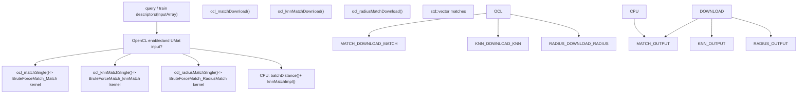
资料来源：[modules/features2d/src/matchers.cpp67-406](https://github.com/opencv/opencv/blob/91c78f50/modules/features2d/src/matchers.cpp#L67-L406) [modules/features2d/src/matchers.cpp786-834](https://github.com/opencv/opencv/blob/91c78f50/modules/features2d/src/matchers.cpp#L786-L834)

---

## 词袋框架

词袋（BOW）框架通过将描述符量化为视觉词汇，将局部特征描述符转换为全局图像描述符。

### 弓架构

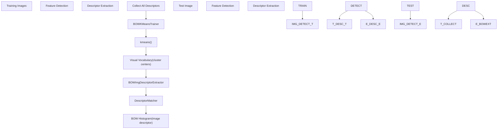
资料来源：[modules/features2d/src/bagofwords.cpp47-216](https://github.com/opencv/opencv/blob/91c78f50/modules/features2d/src/bagofwords.cpp#L47-L216)

### 弓训练师

这`BOWTrainer`基类及其`BOWKMeansTrainer`实施管理词汇构建：

`BOWTrainer`是抽象基；`BOWKMeansTrainer`聚类描述符使用`kmeans()`.

| 方法 | 目的 | 来源 |
| --- | --- | --- |
| `BOWTrainer::add(descriptors)` | 积累训练描述符 | [modules/features2d/src/bagofwords.cpp53-68](https://github.com/opencv/opencv/blob/91c78f50/modules/features2d/src/bagofwords.cpp#L53-L68) |
| `BOWTrainer::cluster()` | 建立词汇（纯虚拟） | [modules/features2d/src/bagofwords.cpp75-78](https://github.com/opencv/opencv/blob/91c78f50/modules/features2d/src/bagofwords.cpp#L75-L78) |
| `BOWKMeansTrainer::cluster()` | 通话`kmeans()`关于合并描述符 | [modules/features2d/src/bagofwords.cpp90-116](https://github.com/opencv/opencv/blob/91c78f50/modules/features2d/src/bagofwords.cpp#L90-L116) |

`BOWKMeansTrainer`构造函数参数：`clusterCount`（词汇​​量），`termcrit`（收敛），`attempts`（k-means 重新启动），`flags`（初始化方法，例如`KMEANS_PP_CENTERS`).

资料来源：[modules/features2d/src/bagofwords.cpp85-116](https://github.com/opencv/opencv/blob/91c78f50/modules/features2d/src/bagofwords.cpp#L85-L116)

### BOWImg描述符提取器

这`BOWImgDescriptorExtractor`将图像的特征描述符转换为单个直方图描述符：

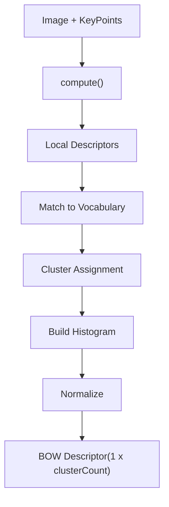
| 方法 | 目的 | 来源 |
| --- | --- | --- |
| `setVocabulary(vocab)` | 设置词汇；清除并重新添加到内部`dmatcher` | [modules/features2d/src/bagofwords.cpp131-136](https://github.com/opencv/opencv/blob/91c78f50/modules/features2d/src/bagofwords.cpp#L131-L136) |
| `compute(image, keypoints, imgDescriptor)` | 提取图像的 BOW 直方图 | [modules/features2d/src/bagofwords.cpp143-163](https://github.com/opencv/opencv/blob/91c78f50/modules/features2d/src/bagofwords.cpp#L143-L163) |
| `compute(keypointDescriptors, imgDescriptor)` | 根据预先计算的描述符进行计算 | [modules/features2d/src/bagofwords.cpp175-214](https://github.com/opencv/opencv/blob/91c78f50/modules/features2d/src/bagofwords.cpp#L175-L214) |
| `descriptorSize()` | 退货`vocabulary.rows`（视觉词的数量） | [modules/features2d/src/bagofwords.cpp165-168](https://github.com/opencv/opencv/blob/91c78f50/modules/features2d/src/bagofwords.cpp#L165-L168) |
| `descriptorType()` | 退货`CV_32FC1` | [modules/features2d/src/bagofwords.cpp170-173](https://github.com/opencv/opencv/blob/91c78f50/modules/features2d/src/bagofwords.cpp#L170-L173) |

资料来源：[modules/features2d/src/bagofwords.cpp119-216](https://github.com/opencv/opencv/blob/91c78f50/modules/features2d/src/bagofwords.cpp#L119-L216)

---

## 关键点过滤和处理

这`KeyPointsFilter`类提供了用于后处理检测到的关键点的静态实用方法：

### 过滤操作

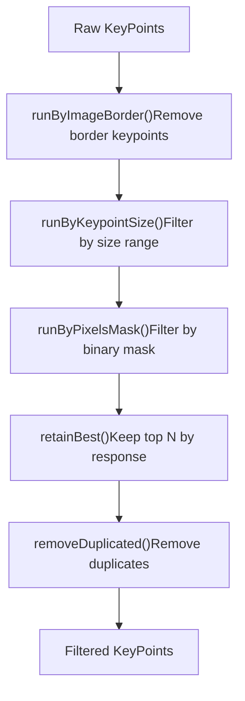
**`KeyPointsFilter`静态方法：**

| 方法 | 目的 | 关键参数 |
| --- | --- | --- |
| `retainBest(keypoints, npoints)` | 保留 N 个最高响应的关键点 | `npoints` |
| `runByImageBorder(keypoints, imageSize, borderSize)` | 删除图像边缘的边框像素内的关键点 | `borderSize` |
| `runByKeypointSize(keypoints, minSize, maxSize)` | 过滤依据`KeyPoint::size`范围 | `minSize`, `maxSize` |
| `runByPixelsMask(keypoints, mask)` | 保留 8 位掩码非零的关键点 | `mask`（简历::垫） |
| `removeDuplicated(keypoints)` | 删除具有相同点/大小/角度的关键点 | — |
| `removeDuplicatedSorted(keypoints)` | 与上面相同但保留排序顺序 | — |
| `runByPixelsMask2VectorPoint(keypoints, removeFrom, mask)` | 同时过滤关键点和平行向量 | `removeFrom` |

资料来源：[modules/features2d/src/keypoint.cpp69-293](https://github.com/opencv/opencv/blob/91c78f50/modules/features2d/src/keypoint.cpp#L69-L293) [modules/features2d/include/opencv2/features2d.hpp92-127](https://github.com/opencv/opencv/blob/91c78f50/modules/features2d/include/opencv2/features2d.hpp#L92-L127)

---

## 可视化功能

该模块提供了可视化特征和匹配的功能：

### 绘制关键点()

使用可选的方向和比例可视化渲染图像上的关键点：

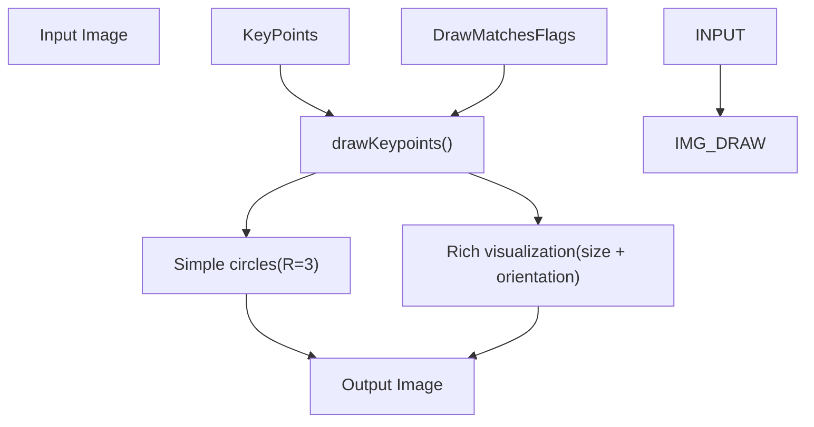
**`DrawMatchesFlags`枚举值：**

| 旗帜 | 影响 |
| --- | --- |
| `DrawMatchesFlags::DEFAULT` | 从头开始创建输出图像 |
| `DrawMatchesFlags::DRAW_OVER_OUTIMG` | 绘制到现有的输出图像上 |
| `DrawMatchesFlags::NOT_DRAW_SINGLE_POINTS` | 禁止绘制不匹配的关键点 |
| `DrawMatchesFlags::DRAW_RICH_KEYPOINTS` | 绘制按关键点大小缩放的圆，并带有方向线 |

资料来源：[modules/features2d/src/draw.cpp91-123](https://github.com/opencv/opencv/blob/91c78f50/modules/features2d/src/draw.cpp#L91-L123) [modules/features2d/src/draw.cpp53-89](https://github.com/opencv/opencv/blob/91c78f50/modules/features2d/src/draw.cpp#L53-L89)

### drawMatches() 和 drawMatchesKnn()

`drawMatches()`并排连接两个图像并在匹配的关键点之间绘制线条。`drawMatchesKnn()`接受`vector<vector<DMatch>>`用于多场比赛可视化。

资料来源：[modules/features2d/src/draw.cpp125-248](https://github.com/opencv/opencv/blob/91c78f50/modules/features2d/src/draw.cpp#L125-L248)

---

## 特征检测器评估

该模块提供了用于评估特征检测器质量的工具：

### 重复性评估

这`evaluateFeatureDetector()`函数通过计算几何变换下检测到的特征的重叠来测量检测器的重复性：

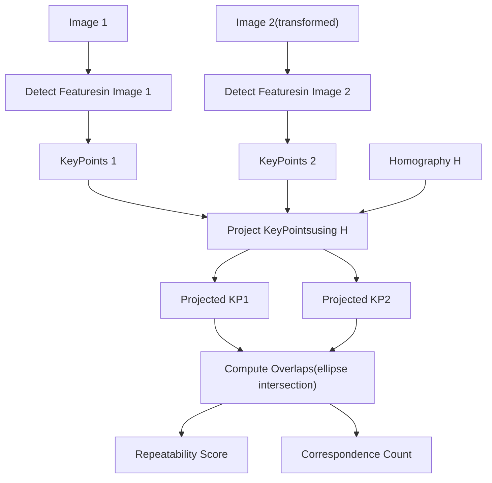
**评估指标：**

| 公制 | 公式 | 解释 |
| --- | --- | --- |
| 重复性 | `correspondences / min(count1, count2)` | 两张图像中检测到的特征的比例 |
| 通讯数 | 重叠特征区域的数量 | 重复检测的绝对计数 |

资料来源：[modules/features2d/src/evaluation.cpp397-481](https://github.com/opencv/opencv/blob/91c78f50/modules/features2d/src/evaluation.cpp#L397-L481) [modules/features2d/src/evaluation.cpp323-395](https://github.com/opencv/opencv/blob/91c78f50/modules/features2d/src/evaluation.cpp#L323-L395)

### 描述符匹配器评估

`computeRecallPrecisionCurve()`从一组匹配和真实正确性掩模生成召回率-精度曲线。

| 功能 | 目的 |
| --- | --- |
| `computeRecallPrecisionCurve(matches1to2, correctMatches1to2Mask, recallPrecisionCurve)` | 通过迭代按距离排序的匹配来构建召回精度向量 |
| `getRecall(recallPrecisionCurve, l_precision)` | 查找给定精度级别的召回率 |

资料来源：[modules/features2d/src/evaluation.cpp499-558](https://github.com/opencv/opencv/blob/91c78f50/modules/features2d/src/evaluation.cpp#L499-L558)

---

## OpenCL 硬件加速

`BFMatcher`包含由以下保护的 OpenCL 路径`#ifdef HAVE_OPENCL`。内核编译自`brute_force_match_oclsrc`（通过引用`ocl::features2d::brute_force_match_oclsrc`).

**OpenCL 内核编译时选项：**

| 构建选项 | 描述 | 价值观 |
| --- | --- | --- |
| `-D T=<type>` | 描述符元素类型 | 例如。，`float`, `uchar` |
| `-D kercn=<N>` | 矢量化宽度 | 1（默认）或 4（具有对齐步幅的 Intel GPU） |
| `-D DIST_TYPE=<N>` | 距离度量枚举 | `NORM_L2`, `NORM_L1`, `NORM_HAMMING` |
| `-D BLOCK_SIZE=16` | 工作组图块大小 | 固定为16 |
| `-D MAX_DESC_LEN=<N>` | 共享内存缓存大小 | 64 或 128（0 = 禁用 CPU） |

4宽矢量化的条件是设备是Intel并且描述符stride/offset/width都是4的倍数([modules/features2d/src/matchers.cpp92-95](https://github.com/opencv/opencv/blob/91c78f50/modules/features2d/src/matchers.cpp#L92-L95)).

资料来源：[modules/features2d/src/matchers.cpp76-228](https://github.com/opencv/opencv/blob/91c78f50/modules/features2d/src/matchers.cpp#L76-L228) [modules/features2d/src/matchers.cpp286-341](https://github.com/opencv/opencv/blob/91c78f50/modules/features2d/src/matchers.cpp#L286-L341)

---

## 与其他模块集成

features2d 模块与其他几个 OpenCV 模块集成：

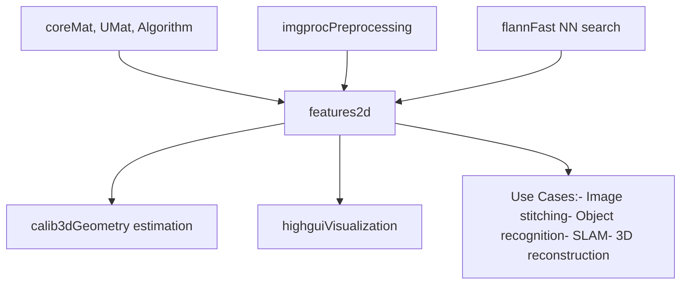
**模块依赖关系：**

-   **核心**：提供`Mat`, `UMat`， 和`Algorithm`基类
-   **imgproc**：特征检测前的图像预处理（灰度转换、滤波）
-   **calib3d**：使用特征匹配进行几何估计（单应性、基本矩阵、姿态估计） - 请参阅[Camera Calibration and 3D Vision](/opencv/opencv/8-camera-calibration-and-3d-vision-(calib3d))
-   **highgui**：可视化的显示功能
-   **flann**：可选的基于 FLANN 的匹配器，用于快速近似最近邻搜索

**来源：**[modules/features2d/src/matchers.cpp43-45](https://github.com/opencv/opencv/blob/91c78f50/modules/features2d/src/matchers.cpp#L43-L45) [modules/features2d/src/draw.cpp104](https://github.com/opencv/opencv/blob/91c78f50/modules/features2d/src/draw.cpp#L104-L104)
