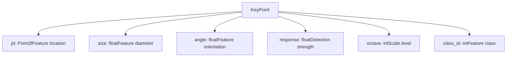
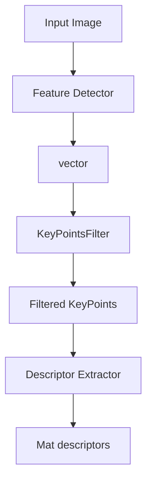
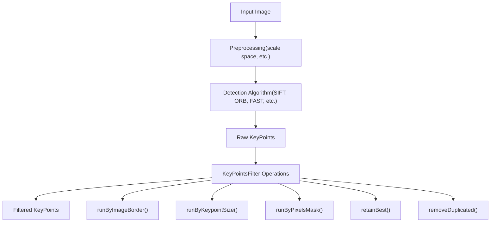
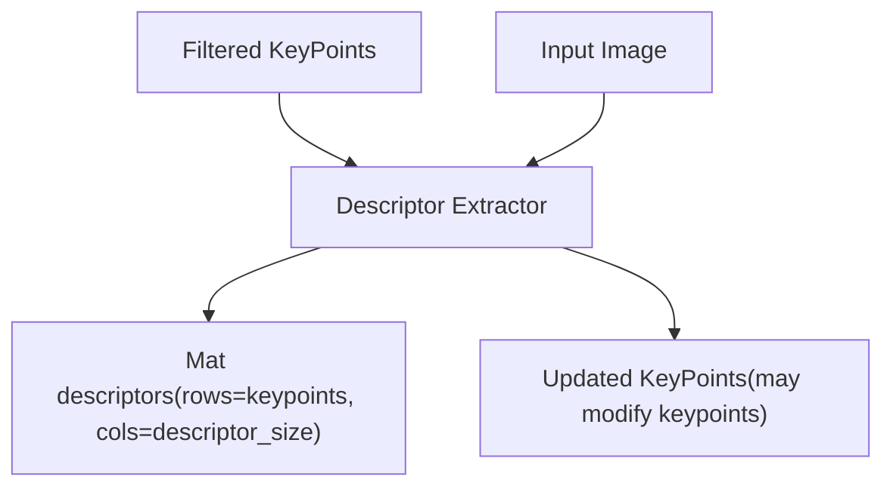
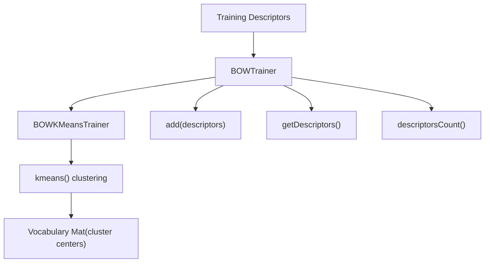
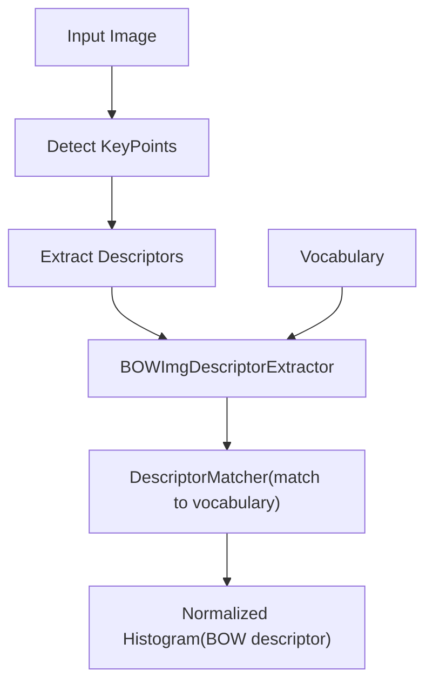
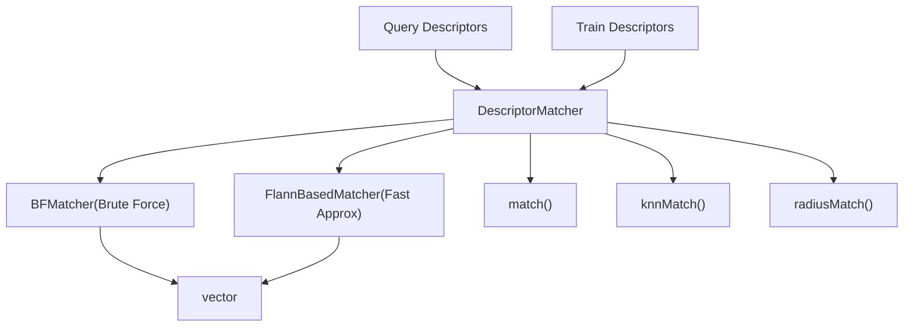
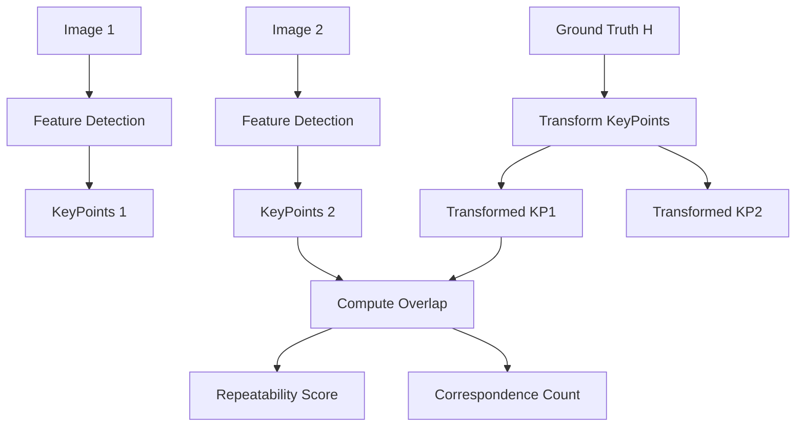
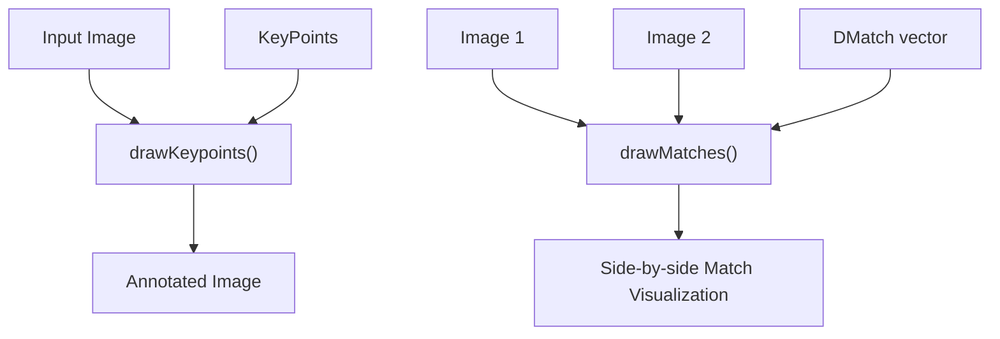
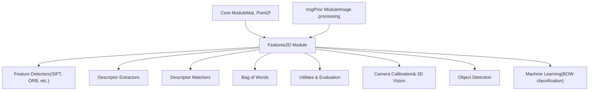

# 特征检测和描述

相关源文件

-   [doc/tutorials/features2d/akaze\_matching/images/graf.png](https://github.com/opencv/opencv/blob/91c78f50/doc/tutorials/features2d/akaze_matching/images/graf.png)
-   [doc/tutorials/features2d/akaze\_matching/images/res.png](https://github.com/opencv/opencv/blob/91c78f50/doc/tutorials/features2d/akaze_matching/images/res.png)
-   [modules/features2d/include/opencv2/features2d.hpp](https://github.com/opencv/opencv/blob/91c78f50/modules/features2d/include/opencv2/features2d.hpp)
-   [modules/features2d/perf/perf\_feature2d.hpp](https://github.com/opencv/opencv/blob/91c78f50/modules/features2d/perf/perf_feature2d.hpp)
-   [modules/features2d/src/agast.cpp](https://github.com/opencv/opencv/blob/91c78f50/modules/features2d/src/agast.cpp)
-   [modules/features2d/src/agast\_score.cpp](https://github.com/opencv/opencv/blob/91c78f50/modules/features2d/src/agast_score.cpp)
-   [modules/features2d/src/agast\_score.hpp](https://github.com/opencv/opencv/blob/91c78f50/modules/features2d/src/agast_score.hpp)
-   [modules/features2d/src/akaze.cpp](https://github.com/opencv/opencv/blob/91c78f50/modules/features2d/src/akaze.cpp)
-   [modules/features2d/src/blobdetector.cpp](https://github.com/opencv/opencv/blob/91c78f50/modules/features2d/src/blobdetector.cpp)
-   [modules/features2d/src/brisk.cpp](https://github.com/opencv/opencv/blob/91c78f50/modules/features2d/src/brisk.cpp)
-   [modules/features2d/src/fast.cpp](https://github.com/opencv/opencv/blob/91c78f50/modules/features2d/src/fast.cpp)
-   [modules/features2d/src/feature2d.cpp](https://github.com/opencv/opencv/blob/91c78f50/modules/features2d/src/feature2d.cpp)
-   [modules/features2d/src/gftt.cpp](https://github.com/opencv/opencv/blob/91c78f50/modules/features2d/src/gftt.cpp)
-   [modules/features2d/src/kaze.cpp](https://github.com/opencv/opencv/blob/91c78f50/modules/features2d/src/kaze.cpp)
-   [modules/features2d/src/kaze/AKAZEConfig.h](https://github.com/opencv/opencv/blob/91c78f50/modules/features2d/src/kaze/AKAZEConfig.h)
-   [modules/features2d/src/kaze/AKAZEFeatures.cpp](https://github.com/opencv/opencv/blob/91c78f50/modules/features2d/src/kaze/AKAZEFeatures.cpp)
-   [modules/features2d/src/kaze/AKAZEFeatures.h](https://github.com/opencv/opencv/blob/91c78f50/modules/features2d/src/kaze/AKAZEFeatures.h)
-   [modules/features2d/src/kaze/KAZEConfig.h](https://github.com/opencv/opencv/blob/91c78f50/modules/features2d/src/kaze/KAZEConfig.h)
-   [modules/features2d/src/kaze/KAZEFeatures.cpp](https://github.com/opencv/opencv/blob/91c78f50/modules/features2d/src/kaze/KAZEFeatures.cpp)
-   [modules/features2d/src/kaze/KAZEFeatures.h](https://github.com/opencv/opencv/blob/91c78f50/modules/features2d/src/kaze/KAZEFeatures.h)
-   [modules/features2d/src/kaze/TEvolution.h](https://github.com/opencv/opencv/blob/91c78f50/modules/features2d/src/kaze/TEvolution.h)
-   [modules/features2d/src/kaze/fed.cpp](https://github.com/opencv/opencv/blob/91c78f50/modules/features2d/src/kaze/fed.cpp)
-   [modules/features2d/src/kaze/fed.h](https://github.com/opencv/opencv/blob/91c78f50/modules/features2d/src/kaze/fed.h)
-   [modules/features2d/src/kaze/nldiffusion\_functions.cpp](https://github.com/opencv/opencv/blob/91c78f50/modules/features2d/src/kaze/nldiffusion_functions.cpp)
-   [modules/features2d/src/kaze/nldiffusion\_functions.h](https://github.com/opencv/opencv/blob/91c78f50/modules/features2d/src/kaze/nldiffusion_functions.h)
-   [modules/features2d/src/kaze/utils.h](https://github.com/opencv/opencv/blob/91c78f50/modules/features2d/src/kaze/utils.h)
-   [modules/features2d/src/mser.cpp](https://github.com/opencv/opencv/blob/91c78f50/modules/features2d/src/mser.cpp)
-   [modules/features2d/src/opencl/akaze.cl](https://github.com/opencv/opencv/blob/91c78f50/modules/features2d/src/opencl/akaze.cl)
-   [modules/features2d/src/orb.cpp](https://github.com/opencv/opencv/blob/91c78f50/modules/features2d/src/orb.cpp)
-   [modules/features2d/test/ocl/test\_feature2d.cpp](https://github.com/opencv/opencv/blob/91c78f50/modules/features2d/test/ocl/test_feature2d.cpp)
-   [modules/features2d/test/test\_agast.cpp](https://github.com/opencv/opencv/blob/91c78f50/modules/features2d/test/test_agast.cpp)
-   [modules/features2d/test/test\_akaze.cpp](https://github.com/opencv/opencv/blob/91c78f50/modules/features2d/test/test_akaze.cpp)
-   [modules/features2d/test/test\_blobdetector.cpp](https://github.com/opencv/opencv/blob/91c78f50/modules/features2d/test/test_blobdetector.cpp)
-   [modules/features2d/test/test\_brisk.cpp](https://github.com/opencv/opencv/blob/91c78f50/modules/features2d/test/test_brisk.cpp)
-   [modules/features2d/test/test\_descriptors\_invariance.cpp](https://github.com/opencv/opencv/blob/91c78f50/modules/features2d/test/test_descriptors_invariance.cpp)
-   [modules/features2d/test/test\_descriptors\_invariance.impl.hpp](https://github.com/opencv/opencv/blob/91c78f50/modules/features2d/test/test_descriptors_invariance.impl.hpp)
-   [modules/features2d/test/test\_descriptors\_regression.cpp](https://github.com/opencv/opencv/blob/91c78f50/modules/features2d/test/test_descriptors_regression.cpp)
-   [modules/features2d/test/test\_descriptors\_regression.impl.hpp](https://github.com/opencv/opencv/blob/91c78f50/modules/features2d/test/test_descriptors_regression.impl.hpp)
-   [modules/features2d/test/test\_detectors\_invariance.cpp](https://github.com/opencv/opencv/blob/91c78f50/modules/features2d/test/test_detectors_invariance.cpp)
-   [modules/features2d/test/test\_detectors\_invariance.impl.hpp](https://github.com/opencv/opencv/blob/91c78f50/modules/features2d/test/test_detectors_invariance.impl.hpp)
-   [modules/features2d/test/test\_detectors\_regression.cpp](https://github.com/opencv/opencv/blob/91c78f50/modules/features2d/test/test_detectors_regression.cpp)
-   [modules/features2d/test/test\_detectors\_regression.impl.hpp](https://github.com/opencv/opencv/blob/91c78f50/modules/features2d/test/test_detectors_regression.impl.hpp)
-   [modules/features2d/test/test\_invariance\_utils.hpp](https://github.com/opencv/opencv/blob/91c78f50/modules/features2d/test/test_invariance_utils.hpp)
-   [modules/features2d/test/test\_keypoints.cpp](https://github.com/opencv/opencv/blob/91c78f50/modules/features2d/test/test_keypoints.cpp)
-   [modules/features2d/test/test\_matchers\_algorithmic.cpp](https://github.com/opencv/opencv/blob/91c78f50/modules/features2d/test/test_matchers_algorithmic.cpp)
-   [modules/features2d/test/test\_orb.cpp](https://github.com/opencv/opencv/blob/91c78f50/modules/features2d/test/test_orb.cpp)
-   [modules/java/generator/src/cpp/jni\_part.cpp](https://github.com/opencv/opencv/blob/91c78f50/modules/java/generator/src/cpp/jni_part.cpp)

本文档涵盖了 OpenCV features2d 模块的特征检测和描述组件，重点关注关键点检测算法、特征描述符计算和相关实用程序。这包括核心数据结构、过滤操作、词袋模型和评估指标。有关特征匹配算法和描述符匹配策略的信息，请参阅[Feature Matching and Analysis](/opencv/opencv/6.2-descriptor-matching-and-bag-of-words).

## 核心数据结构

features2d 模块围绕`KeyPoint`表示检测到的图像特征及其计算描述的结构和描述符矩阵。

### 关键点结构

这`KeyPoint`类表示检测到的要素位置及其关联属性：

**关键点数据流**

资料来源：[modules/features2d/src/keypoint.cpp42-293](https://github.com/opencv/opencv/blob/91c78f50/modules/features2d/src/keypoint.cpp#L42-L293) [modules/features2d/src/draw.cpp53-89](https://github.com/opencv/opencv/blob/91c78f50/modules/features2d/src/draw.cpp#L53-L89)

### 描述符格式

特征描述符存储为`Mat`其中每一行代表一个关键点的描述符向量的对象。描述符类型和维度取决于所使用的具体算法（SIFT、ORB 等）。

## 特征检测管道

检测过程通过标准化管道将原始图像转换为一组独特的关键点：

这`KeyPointsFilter`类提供了几个用于后处理检测到的关键点的实用函数：

| 功能 | 目的 |
| --- | --- |
| `retainBest()` | 通过响应仅保留前 N 个关键点 |
| `runByImageBorder()` | 删除图像边缘附近的关键点 |
| `runByKeypointSize()` | 按关键点大小范围过滤 |
| `runByPixelsMask()` | 删除遮罩区域中的关键点 |
| `removeDuplicated()` | 消除重复的关键点 |

资料来源：[modules/features2d/src/keypoint.cpp69-293](https://github.com/opencv/opencv/blob/91c78f50/modules/features2d/src/keypoint.cpp#L69-L293)

## 功能描述流程

检测后，关键点由描述符提取器处理以计算独特的特征向量：

描述符计算可能会在提取过程中修改关键点属性（例如方向）。不同的算法产生不同维度和数据类型（浮点、二进制等）的描述符。

资料来源：[modules/features2d/src/bagofwords.cpp143-164](https://github.com/opencv/opencv/blob/91c78f50/modules/features2d/src/bagofwords.cpp#L143-L164)

## 词袋模型

features2d 模块包括用于图像分类和检索的完整词袋实现：

### BOW 培训管道

### BOW图像描述符提取

这`BOWImgDescriptorExtractor`类将图像转换为词袋直方图：

-   获取关键点描述符并将其与词汇集群相匹配
-   构建归一化直方图计数描述符分配
-   输出代表整个图像的单行描述符

资料来源：[modules/features2d/src/bagofwords.cpp47-216](https://github.com/opencv/opencv/blob/91c78f50/modules/features2d/src/bagofwords.cpp#L47-L216)

## 描述符匹配基础设施

虽然详细的匹配算法包含在[Feature Matching and Analysis](/opencv/opencv/6.2-descriptor-matching-and-bag-of-words)，基本匹配基础设施是描述系统的一部分：

这`DescriptorMatcher`基类定义了接口，其中`BFMatcher`使用各种距离度量（L2、汉明等）提供精确的强力匹配。

资料来源：[modules/features2d/src/matchers.cpp411-1015](https://github.com/opencv/opencv/blob/91c78f50/modules/features2d/src/matchers.cpp#L411-L1015)

## 评估和质量指标

该模块包括用于评估检测器和描述符性能的综合评估工具：

### 重复性评估

该评估系统使用椭圆关键点表示来计算不同视点的相应特征之间的准确重叠。

### 绩效指标

| 功能 | 目的 |
| --- | --- |
| `evaluateFeatureDetector()` | 计算检测器的重复性 |
| `computeRecallPrecisionCurve()` | 生成匹配的性能曲线 |
| `getRecall()` | 以特定精度提取召回率 |

资料来源：[modules/features2d/src/evaluation.cpp397-581](https://github.com/opencv/opencv/blob/91c78f50/modules/features2d/src/evaluation.cpp#L397-L581)

## 可视化支持

features2d 模块提供了用于可视化检测到的特征和匹配的实用程序：

可视化功能支持多种绘图模式：

-   用圆圈标记基本点
-   显示大小和方向的丰富关键点绘图
-   对应特征之间的匹配线绘制
-   可定制的颜色和绘图标志

资料来源：[modules/features2d/src/draw.cpp91-278](https://github.com/opencv/opencv/blob/91c78f50/modules/features2d/src/draw.cpp#L91-L278)

## 系统集成

特征检测和描述系统通过标准化接口与其他OpenCV模块集成：

该模块是高级计算机视觉应用的基础，包括对象识别、图像匹配、相机校准和 3D 重建。

资料来源：[modules/features2d/include/opencv2/features2d/features2d.hpp44-48](https://github.com/opencv/opencv/blob/91c78f50/modules/features2d/include/opencv2/features2d/features2d.hpp#L44-L48) [modules/features2d/src/dynamic.cpp43-47](https://github.com/opencv/opencv/blob/91c78f50/modules/features2d/src/dynamic.cpp#L43-L47)
