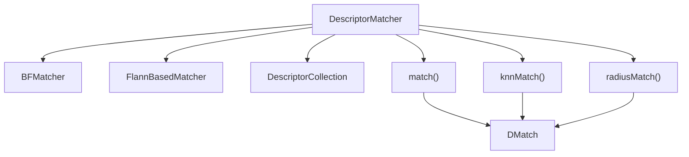
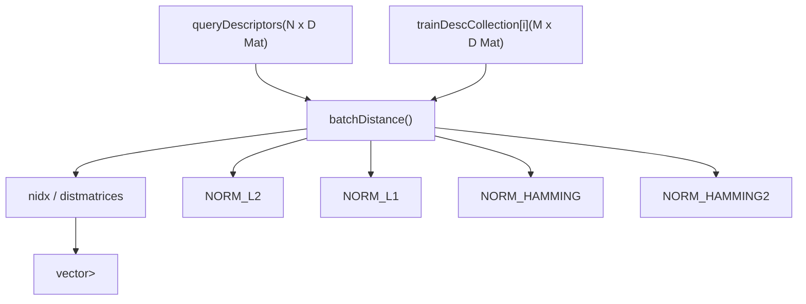
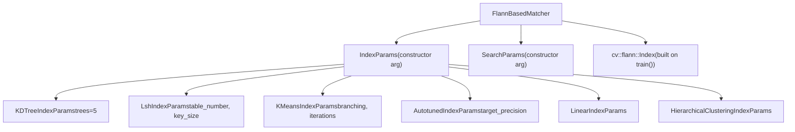
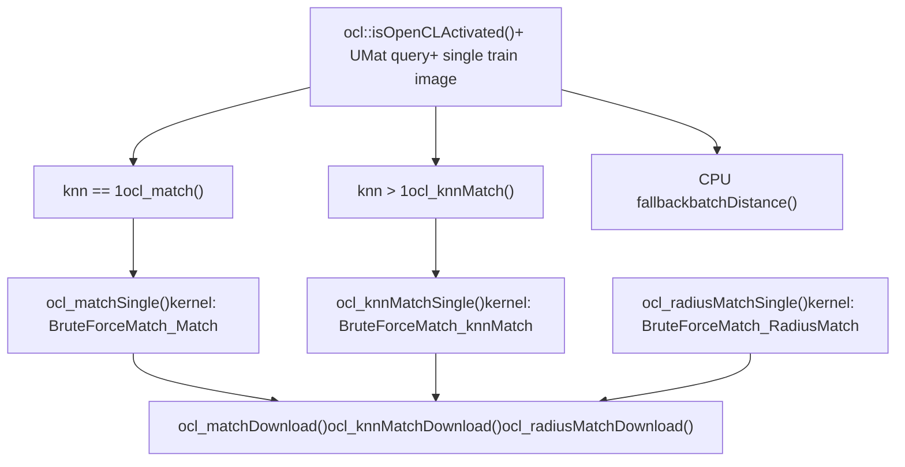
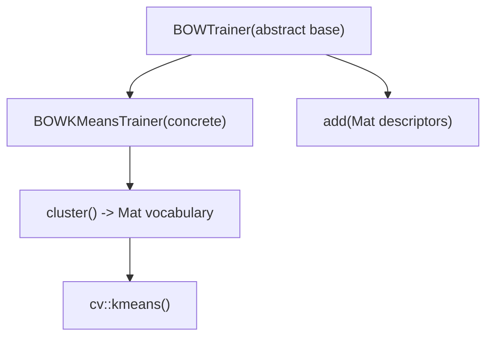
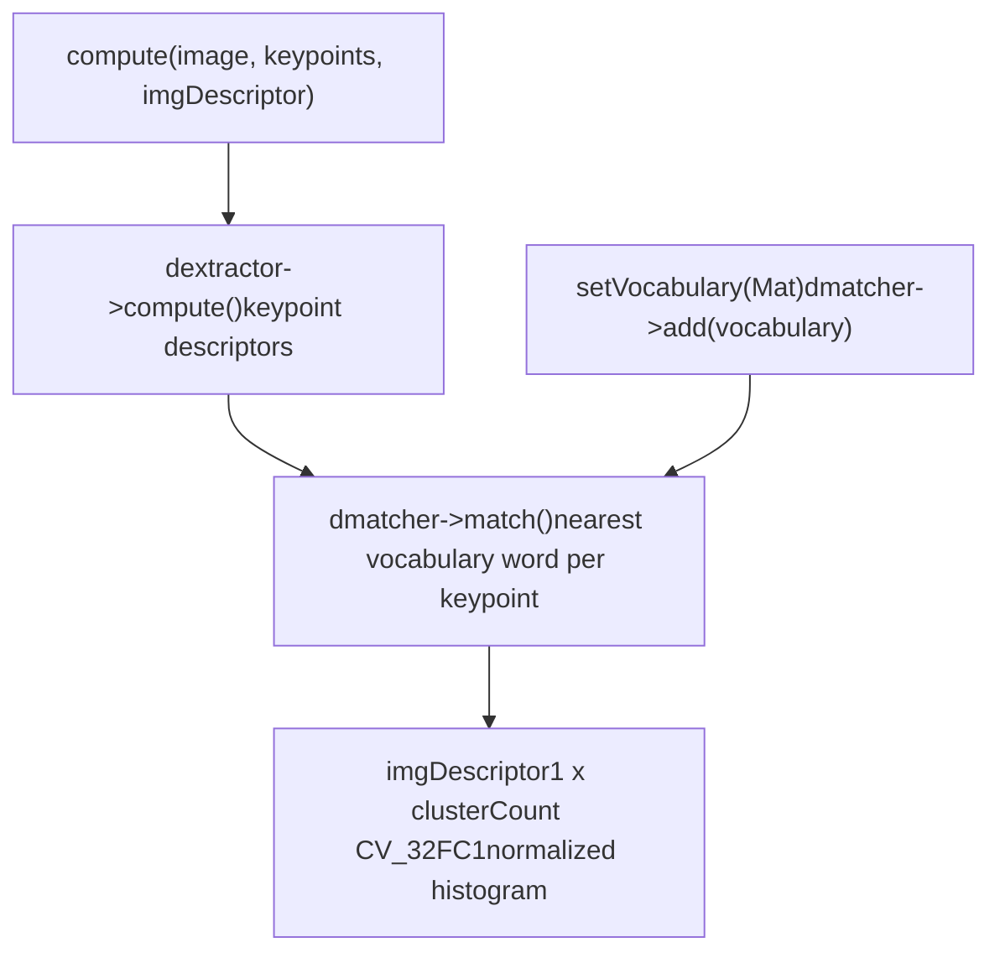
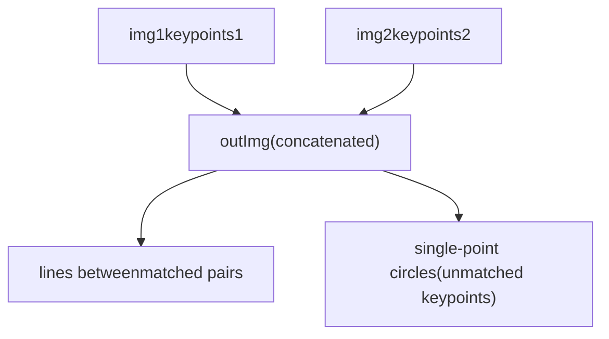
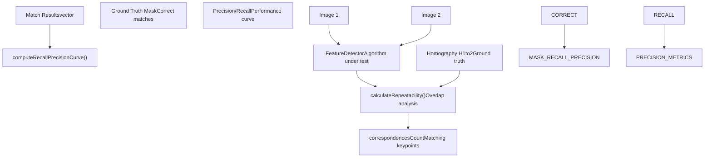
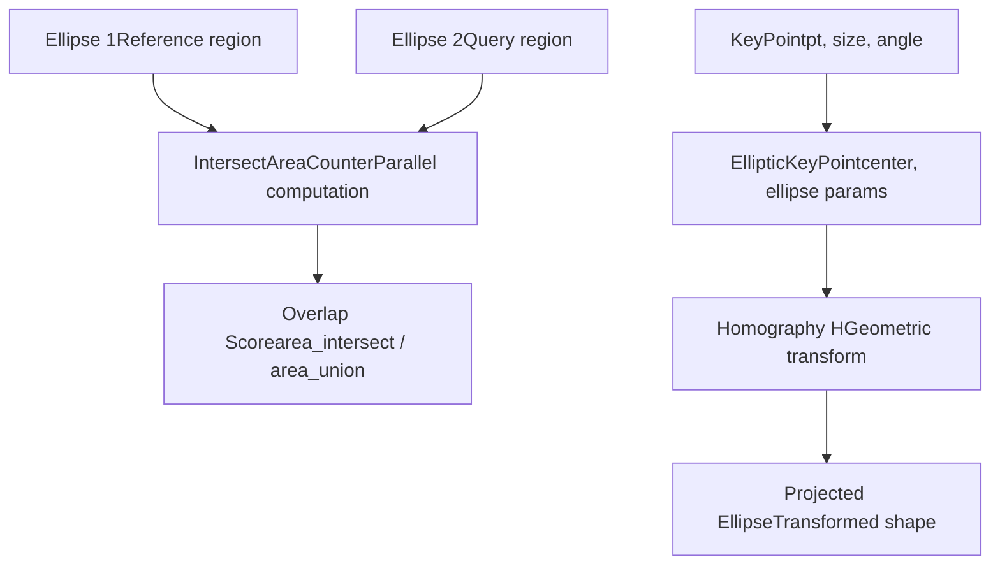

# 描述符匹配和词袋

相关源文件

-   [cmake/checks/cpu\_neon.cpp](https://github.com/opencv/opencv/blob/91c78f50/cmake/checks/cpu_neon.cpp)
-   [doc/DoxygenLayout.xml](https://github.com/opencv/opencv/blob/91c78f50/doc/DoxygenLayout.xml)
-   [doc/opencv-logo-small.png](https://github.com/opencv/opencv/blob/91c78f50/doc/opencv-logo-small.png)
-   [modules/core/include/opencv2/core/affine.hpp](https://github.com/opencv/opencv/blob/91c78f50/modules/core/include/opencv2/core/affine.hpp)
-   [modules/core/include/opencv2/core/fast\_math.hpp](https://github.com/opencv/opencv/blob/91c78f50/modules/core/include/opencv2/core/fast_math.hpp)
-   [modules/core/src/matmul.simd.hpp](https://github.com/opencv/opencv/blob/91c78f50/modules/core/src/matmul.simd.hpp)
-   [modules/features2d/include/opencv2/features2d/features2d.hpp](https://github.com/opencv/opencv/blob/91c78f50/modules/features2d/include/opencv2/features2d/features2d.hpp)
-   [modules/features2d/src/bagofwords.cpp](https://github.com/opencv/opencv/blob/91c78f50/modules/features2d/src/bagofwords.cpp)
-   [modules/features2d/src/draw.cpp](https://github.com/opencv/opencv/blob/91c78f50/modules/features2d/src/draw.cpp)
-   [modules/features2d/src/dynamic.cpp](https://github.com/opencv/opencv/blob/91c78f50/modules/features2d/src/dynamic.cpp)
-   [modules/features2d/src/evaluation.cpp](https://github.com/opencv/opencv/blob/91c78f50/modules/features2d/src/evaluation.cpp)
-   [modules/features2d/src/keypoint.cpp](https://github.com/opencv/opencv/blob/91c78f50/modules/features2d/src/keypoint.cpp)
-   [modules/features2d/src/matchers.cpp](https://github.com/opencv/opencv/blob/91c78f50/modules/features2d/src/matchers.cpp)
-   [modules/features2d/test/test\_drawing.cpp](https://github.com/opencv/opencv/blob/91c78f50/modules/features2d/test/test_drawing.cpp)
-   [modules/features2d/test/test\_nearestneighbors.cpp](https://github.com/opencv/opencv/blob/91c78f50/modules/features2d/test/test_nearestneighbors.cpp)
-   [modules/features2d/test/test\_precomp.hpp](https://github.com/opencv/opencv/blob/91c78f50/modules/features2d/test/test_precomp.hpp)
-   [modules/features2d/test/test\_utils.cpp](https://github.com/opencv/opencv/blob/91c78f50/modules/features2d/test/test_utils.cpp)
-   [modules/flann/include/opencv2/flann.hpp](https://github.com/opencv/opencv/blob/91c78f50/modules/flann/include/opencv2/flann.hpp)
-   [modules/flann/include/opencv2/flann/all\_indices.h](https://github.com/opencv/opencv/blob/91c78f50/modules/flann/include/opencv2/flann/all_indices.h)
-   [modules/flann/include/opencv2/flann/allocator.h](https://github.com/opencv/opencv/blob/91c78f50/modules/flann/include/opencv2/flann/allocator.h)
-   [modules/flann/include/opencv2/flann/any.h](https://github.com/opencv/opencv/blob/91c78f50/modules/flann/include/opencv2/flann/any.h)
-   [modules/flann/include/opencv2/flann/autotuned\_index.h](https://github.com/opencv/opencv/blob/91c78f50/modules/flann/include/opencv2/flann/autotuned_index.h)
-   [modules/flann/include/opencv2/flann/composite\_index.h](https://github.com/opencv/opencv/blob/91c78f50/modules/flann/include/opencv2/flann/composite_index.h)
-   [modules/flann/include/opencv2/flann/config.h](https://github.com/opencv/opencv/blob/91c78f50/modules/flann/include/opencv2/flann/config.h)
-   [modules/flann/include/opencv2/flann/defines.h](https://github.com/opencv/opencv/blob/91c78f50/modules/flann/include/opencv2/flann/defines.h)
-   [modules/flann/include/opencv2/flann/dist.h](https://github.com/opencv/opencv/blob/91c78f50/modules/flann/include/opencv2/flann/dist.h)
-   [modules/flann/include/opencv2/flann/dynamic\_bitset.h](https://github.com/opencv/opencv/blob/91c78f50/modules/flann/include/opencv2/flann/dynamic_bitset.h)
-   [modules/flann/include/opencv2/flann/flann\_base.hpp](https://github.com/opencv/opencv/blob/91c78f50/modules/flann/include/opencv2/flann/flann_base.hpp)
-   [modules/flann/include/opencv2/flann/general.h](https://github.com/opencv/opencv/blob/91c78f50/modules/flann/include/opencv2/flann/general.h)
-   [modules/flann/include/opencv2/flann/hierarchical\_clustering\_index.h](https://github.com/opencv/opencv/blob/91c78f50/modules/flann/include/opencv2/flann/hierarchical_clustering_index.h)
-   [modules/flann/include/opencv2/flann/index\_testing.h](https://github.com/opencv/opencv/blob/91c78f50/modules/flann/include/opencv2/flann/index_testing.h)
-   [modules/flann/include/opencv2/flann/kdtree\_index.h](https://github.com/opencv/opencv/blob/91c78f50/modules/flann/include/opencv2/flann/kdtree_index.h)
-   [modules/flann/include/opencv2/flann/kdtree\_single\_index.h](https://github.com/opencv/opencv/blob/91c78f50/modules/flann/include/opencv2/flann/kdtree_single_index.h)
-   [modules/flann/include/opencv2/flann/kmeans\_index.h](https://github.com/opencv/opencv/blob/91c78f50/modules/flann/include/opencv2/flann/kmeans_index.h)
-   [modules/flann/include/opencv2/flann/linear\_index.h](https://github.com/opencv/opencv/blob/91c78f50/modules/flann/include/opencv2/flann/linear_index.h)
-   [modules/flann/include/opencv2/flann/logger.h](https://github.com/opencv/opencv/blob/91c78f50/modules/flann/include/opencv2/flann/logger.h)
-   [modules/flann/include/opencv2/flann/lsh\_index.h](https://github.com/opencv/opencv/blob/91c78f50/modules/flann/include/opencv2/flann/lsh_index.h)
-   [modules/flann/include/opencv2/flann/lsh\_table.h](https://github.com/opencv/opencv/blob/91c78f50/modules/flann/include/opencv2/flann/lsh_table.h)
-   [modules/flann/include/opencv2/flann/matrix.h](https://github.com/opencv/opencv/blob/91c78f50/modules/flann/include/opencv2/flann/matrix.h)
-   [modules/flann/include/opencv2/flann/miniflann.hpp](https://github.com/opencv/opencv/blob/91c78f50/modules/flann/include/opencv2/flann/miniflann.hpp)
-   [modules/flann/include/opencv2/flann/nn\_index.h](https://github.com/opencv/opencv/blob/91c78f50/modules/flann/include/opencv2/flann/nn_index.h)
-   [modules/flann/include/opencv2/flann/object\_factory.h](https://github.com/opencv/opencv/blob/91c78f50/modules/flann/include/opencv2/flann/object_factory.h)
-   [modules/flann/include/opencv2/flann/params.h](https://github.com/opencv/opencv/blob/91c78f50/modules/flann/include/opencv2/flann/params.h)
-   [modules/flann/include/opencv2/flann/random.h](https://github.com/opencv/opencv/blob/91c78f50/modules/flann/include/opencv2/flann/random.h)
-   [modules/flann/include/opencv2/flann/result\_set.h](https://github.com/opencv/opencv/blob/91c78f50/modules/flann/include/opencv2/flann/result_set.h)
-   [modules/flann/include/opencv2/flann/saving.h](https://github.com/opencv/opencv/blob/91c78f50/modules/flann/include/opencv2/flann/saving.h)
-   [modules/flann/include/opencv2/flann/timer.h](https://github.com/opencv/opencv/blob/91c78f50/modules/flann/include/opencv2/flann/timer.h)
-   [modules/flann/src/flann.cpp](https://github.com/opencv/opencv/blob/91c78f50/modules/flann/src/flann.cpp)
-   [modules/flann/src/miniflann.cpp](https://github.com/opencv/opencv/blob/91c78f50/modules/flann/src/miniflann.cpp)
-   [modules/flann/src/precomp.hpp](https://github.com/opencv/opencv/blob/91c78f50/modules/flann/src/precomp.hpp)
-   [samples/cpp/em.cpp](https://github.com/opencv/opencv/blob/91c78f50/samples/cpp/em.cpp)
-   [samples/cpp/letter\_recog.cpp](https://github.com/opencv/opencv/blob/91c78f50/samples/cpp/letter_recog.cpp)
-   [samples/cpp/points\_classifier.cpp](https://github.com/opencv/opencv/blob/91c78f50/samples/cpp/points_classifier.cpp)
-   [samples/cpp/watershed.cpp](https://github.com/opencv/opencv/blob/91c78f50/samples/cpp/watershed.cpp)

本页记录了描述符匹配和词袋子系统`opencv_features2d`。它涵盖了`DescriptorMatcher`基本接口，`BFMatcher`（暴力）和`FlannBasedMatcher`实现中，三种匹配模式（`match`, `knnMatch`, `radiusMatch`）， 这`BOWTrainer` / `BOWImgDescriptorExtractor`图像分类的管道，以及`drawKeypoints` / `drawMatches`可视化实用程序。

有关特征检测和描述符计算，请参见第 6.1 页。有关匹配的几何用途（单应性、姿态估计），请参见第 8.2 页。</old\_str> <new\_str>

# 描述符匹配和词袋

本页记录了描述符匹配和词袋子系统`opencv_features2d`。它涵盖了`DescriptorMatcher`基本接口，`BFMatcher`（暴力）和`FlannBasedMatcher`实现中，三种匹配模式（`match`, `knnMatch`, `radiusMatch`）， 这`BOWTrainer` / `BOWImgDescriptorExtractor`图像分类的管道，以及`drawKeypoints` / `drawMatches`可视化实用程序。

有关特征检测和描述符计算，请参见第 6.1 页。有关匹配的几何用途（单应性、姿态估计），请参见第 8.2 页。

## 核心匹配架构

匹配系统是围绕`DescriptorMatcher`作为抽象基类。提供了两种具体实现：`BFMatcher`（详尽搜索）和`FlannBasedMatcher`（通过近似最近邻搜索`opencv_flann`模块）。

**类层次结构和匹配的API图：**


资料来源：[modules/features2d/src/matchers.cpp411-678](https://github.com/opencv/opencv/blob/91c78f50/modules/features2d/src/matchers.cpp#L411-L678)

### DescriptorMatcher 基类

`DescriptorMatcher`在[modules/features2d/src/matchers.cpp](https://github.com/opencv/opencv/blob/91c78f50/modules/features2d/src/matchers.cpp)管理训练描述符集合并将三种匹配模式分派给子类实现（`knnMatchImpl`, `radiusMatchImpl`).

训练描述符存储在两个并行集合中：

-   `trainDescCollection` — `vector<Mat>`对于CPU描述符
-   `utrainDescCollection` — `vector<UMat>`对于 OpenCL 支持的描述符

内部`DescriptorCollection`帮手[modules/features2d/src/matchers.cpp411-510](https://github.com/opencv/opencv/blob/91c78f50/modules/features2d/src/matchers.cpp#L411-L510)将所有训练图像的描述符合并为一个`mergedDescriptors`矩阵和记录`startIdxs`每个图像将全局索引转换回`(imgIdx, localDescIdx)`对。

| 方法 | 描述 | 输出类型 |
| --- | --- | --- |
| `add()` | 附加列车描述符 | — |
| `train()` | 构建索引（子类覆盖） | — |
| `match()` | 每个查询描述符的最佳匹配 | `vector<DMatch>` |
| `knnMatch()` | 每个查询 k 个最近的匹配项 | `vector<vector<DMatch>>` |
| `radiusMatch()` | 距离阈值内的所有匹配 | `vector<vector<DMatch>>` |
| `create()` | 工厂：通过字符串名称创建 | `Ptr<DescriptorMatcher>` |

`match()`内部调用`knnMatch()`和`k=1`并将结果展平`convertMatches()` [modules/features2d/src/matchers.cpp515-526](https://github.com/opencv/opencv/blob/91c78f50/modules/features2d/src/matchers.cpp#L515-L526)

资料来源：[modules/features2d/src/matchers.cpp411-678](https://github.com/opencv/opencv/blob/91c78f50/modules/features2d/src/matchers.cpp#L411-L678)

### BF匹配器

`BFMatcher`使用以下命令对每个查询描述符与每个训练描述符进行详尽的比较`batchDistance()`。它以 O(N·M) 次比较为代价保证精确的最近邻结果。

**BFMatcher内部流程：**


构造函数参数：

-   `normType`——距离度量；必须匹配描述符类型（例如`NORM_HAMMING`对于 ORB/BRISK，`NORM_L2`对于 SIFT）
-   `crossCheck`- 什么时候`true`, 一场比赛`(i,j)`仅当描述符`j`还发现`i`作为最佳匹配，减少误报

这`create()`工厂方法[modules/features2d/src/matchers.cpp1022-1048](https://github.com/opencv/opencv/blob/91c78f50/modules/features2d/src/matchers.cpp#L1022-L1048)接受字符串别名：`"BruteForce"`Error 504 (Server Error)!!1504.That’s an error.There was an error. Please try again later.That’s all we know.`"BruteForce-L1"`, `"BruteForce-Hamming"`, `"BruteForce-Hamming(2)"`, `"BruteForce-SL2"`.

资料来源：[modules/features2d/src/matchers.cpp708-1015](https://github.com/opencv/opencv/blob/91c78f50/modules/features2d/src/matchers.cpp#L708-L1015)

### 基于弗兰的匹配器

`FlannBasedMatcher`包裹`cv::flann::Index`从`opencv_flann`模块提供近似最近邻搜索。它比`BFMatcher`对于大型描述符集，但是近似值并且不支持`crossCheck`.

**FlannBasedMatcher 构造和索引类型：**


指数类型选择指导：

| 索引参数 | 最适合 | 笔记 |
| --- | --- | --- |
| `KDTreeIndexParams` | 浮点描述符（SIFT、SURF） | 快速、近似；多棵树可以提高记忆力 |
| `LshIndexParams` | 二进制描述符（ORB、BRISK、BRIEF） | 基于哈希；放`table_number`, `key_size`, `multi_probe_level` |
| `KMeansIndexParams` | 大型浮点描述符集 | 分层 k 均值树 |
| `AutotunedIndexParams` | 未知描述符类型 | 基准测试并选择最佳索引 |
| `LinearIndexParams` | 小组或精确结果 | 相当于暴力破解 |

`train()`来电`flann::Index::build()`on the merged training descriptors.后`train()`, `knnMatchImpl`来电`flann::Index::knnSearch()`和`radiusMatchImpl`来电`flann::Index::radiusSearch()`.

工厂字符串名称是`"FlannBased"` [modules/features2d/src/matchers.cpp1025-1028](https://github.com/opencv/opencv/blob/91c78f50/modules/features2d/src/matchers.cpp#L1025-L1028)

资料来源：[modules/features2d/src/matchers.cpp1022-1048](https://github.com/opencv/opencv/blob/91c78f50/modules/features2d/src/matchers.cpp#L1022-L1048) [modules/flann/src/miniflann.cpp199-310](https://github.com/opencv/opencv/blob/91c78f50/modules/flann/src/miniflann.cpp#L199-L310) [modules/flann/include/opencv2/flann/miniflann.hpp](https://github.com/opencv/opencv/blob/91c78f50/modules/flann/include/opencv2/flann/miniflann.hpp)

### BFMatcher 中的 OpenCL 加速

`BFMatcher`有一个 OpenCL 快速路径`knnMatch`和`radiusMatch`在以下情况下激活：

-   `ocl::isOpenCLActivated()`返回真
-   查询描述符是`UMat`与类型`CV_32FC1`
-   只有一张训练图像
-   没有敷面膜

**BFMacher 的 OpenCL 内核调度：**


内核是用编译时常量编译的`BLOCK_SIZE=16`, `MAX_DESC_LEN`（64 或 128 取决于描述符宽度），以及`kercn=4`在具有对齐内存的 Intel 设备上。

资料来源：[modules/features2d/src/matchers.cpp76-405](https://github.com/opencv/opencv/blob/91c78f50/modules/features2d/src/matchers.cpp#L76-L405) [modules/features2d/src/matchers.cpp786-960](https://github.com/opencv/opencv/blob/91c78f50/modules/features2d/src/matchers.cpp#L786-L960)

## 关键点过滤实用程序

`KeyPointsFilter`在[modules/features2d/src/keypoint.cpp](https://github.com/opencv/opencv/blob/91c78f50/modules/features2d/src/keypoint.cpp)提供用于后处理原始关键点列表的静态辅助方法。这些通常在检测器实现内部调用，或者在之后由用户代码调用`detect()`.

| 方法 | 行为 | 关键内部机制 |
| --- | --- | --- |
| `retainBest(keypoints, n)` | 保持前 N 名`response` | `std::nth_element`+ 领带隔断 |
| `runByImageBorder(keypoints, imageSize, borderSize)` | 删除其中的关键点`borderSize`边缘像素 | `RoiPredicate` + `std::remove_if` |
| `runByKeypointSize(keypoints, minSize, maxSize)` | 删除外部关键点`[minSize, maxSize]`规模 | `SizePredicate` + `std::remove_if` |
| `runByPixelsMask(keypoints, mask)` | 删除屏蔽像素处的关键点 | `MaskPredicate` + `std::remove_if` |
| `removeDuplicated(keypoints)` | 删除完全相同的重复项（相同`pt`, `size`, `angle`) | `KeyPoint_LessThan`排序+扫描 |
| `removeDuplicatedSorted(keypoints)` | 相同，但也对输出进行排序 | `KeyPoint12_LessThan`+ 排序 |

资料来源：[modules/features2d/src/keypoint.cpp47-291](https://github.com/opencv/opencv/blob/91c78f50/modules/features2d/src/keypoint.cpp#L47-L291)

## 词袋模型

词袋（BoW）系统[modules/features2d/src/bagofwords.cpp](https://github.com/opencv/opencv/blob/91c78f50/modules/features2d/src/bagofwords.cpp)提供了用于图像分类的两阶段管道：词汇训练和每图像直方图提取。

### 词汇训练

**BoW 培训课程层次结构：**


`BOWTrainer::add()`将描述符矩阵（每个图像一个）累积到`descriptors`并跟踪总数`size` [modules/features2d/src/bagofwords.cpp53-68](https://github.com/opencv/opencv/blob/91c78f50/modules/features2d/src/bagofwords.cpp#L53-L68)

`BOWKMeansTrainer::cluster()`将所有累积的描述符合并到一个矩阵中并调用`cv::kmeans()`与配置的`clusterCount`, `termcrit`, `attempts`， 和`flags`参数[modules/features2d/src/bagofwords.cpp90-116](https://github.com/opencv/opencv/blob/91c78f50/modules/features2d/src/bagofwords.cpp#L90-L116)返回的`vocabulary`矩阵是`clusterCount × D`（每个视觉单词一个簇中心行）。

### 图像描述符提取

`BOWImgDescriptorExtractor`使用预先构建的词汇表将关键点描述符从单个图像转换为固定长度的标准化直方图。

**BOWImgDescriptorExtractor数据流：**


`setVocabulary()`将词汇加载到内部`DescriptorMatcher`以便后续`match()`调用将关键点描述符与词汇聚类中心进行比较[modules/features2d/src/bagofwords.cpp131-136](https://github.com/opencv/opencv/blob/91c78f50/modules/features2d/src/bagofwords.cpp#L131-L136)

`compute()` [modules/features2d/src/bagofwords.cpp175-212](https://github.com/opencv/opencv/blob/91c78f50/modules/features2d/src/bagofwords.cpp#L175-L212)迭代每个`DMatch`, 增量`imgDescriptor[0][match.trainIdx]`，然后将所有箱除以关键点总数以生成频率直方图。可选的`pointIdxsOfClusters`输出记录哪些关键点索引分配给每个簇。

| 成员 | 角色 |
| --- | --- |
| `dextractor` (`Ptr<Feature2D>`) | 计算关键点描述符 |
| `dmatcher` (`Ptr<DescriptorMatcher>`) | 将描述符与词汇进行匹配 |
| `vocabulary` (`Mat`) | `clusterCount × D`聚类中心矩阵 |
| `descriptorSize()` | 退货`vocabulary.rows`（直方图长度） |
| `descriptorType()` | 总是`CV_32FC1` |

资料来源：[modules/features2d/src/bagofwords.cpp47-214](https://github.com/opencv/opencv/blob/91c78f50/modules/features2d/src/bagofwords.cpp#L47-L214)

## 关键点和匹配绘图实用程序

[modules/features2d/src/draw.cpp](https://github.com/opencv/opencv/blob/91c78f50/modules/features2d/src/draw.cpp)提供两个免费的可视化函数。

### 绘制关键点

```
drawKeypoints(image, keypoints, outImage, color, flags)
```
在副本（或直接在其上）上将关键点绘制为圆圈`outImage`. `flags`是一个位掩码`DrawMatchesFlags`:

| 旗帜 | 影响 |
| --- | --- |
| `DEFAULT` | 关键点中心的小实心圆圈 |
| `DRAW_RICH_KEYPOINTS` | 圆圈缩放比例`keypoint.size`, 线表示`keypoint.angle` |
| `DRAW_OVER_OUTIMG` | 根据提供的内容进行绘制`outImage`而不是复制`image`第一的 |
| `NOT_DRAW_SINGLE_POINTS` | 跳过不匹配的关键点（与`drawMatches`) |

### 抽签

```
drawMatches(img1, keypoints1, img2, keypoints2, matches1to2, outImg,
            matchColor, singlePointColor, matchesMask, flags)
```
连接`img1`和`img2`并排，在匹配的关键点之间绘制线条，并可选择标记不匹配的关键点。

**drawMatches 输出布局：**


一个`matchesMask`长度相同的向量`matches1to2`当相应的掩码值为零时，可以抑制单个匹配线。

资料来源：[modules/features2d/src/draw.cpp53-248](https://github.com/opencv/opencv/blob/91c78f50/modules/features2d/src/draw.cpp#L53-L248)

## 绩效评估

该评估系统提供了评估特征检测和匹配性能的指标：

### 评估指标


评估框架使用椭圆关键点表示来计算不同视图中相应区域之间的重叠率，通过单应性投影考虑几何变换。

**来源：**[modules/features2d/src/evaluation.cpp397-481](https://github.com/opencv/opencv/blob/91c78f50/modules/features2d/src/evaluation.cpp#L397-L481) [modules/features2d/src/evaluation.cpp499-535](https://github.com/opencv/opencv/blob/91c78f50/modules/features2d/src/evaluation.cpp#L499-L535)

### 椭圆关键点分析

该系统将圆形关键点转换为椭圆表示以进行精确的几何分析：


**来源：**[modules/features2d/src/evaluation.cpp113-224](https://github.com/opencv/opencv/blob/91c78f50/modules/features2d/src/evaluation.cpp#L113-L224) [modules/features2d/src/evaluation.cpp323-395](https://github.com/opencv/opencv/blob/91c78f50/modules/features2d/src/evaluation.cpp#L323-L395)
