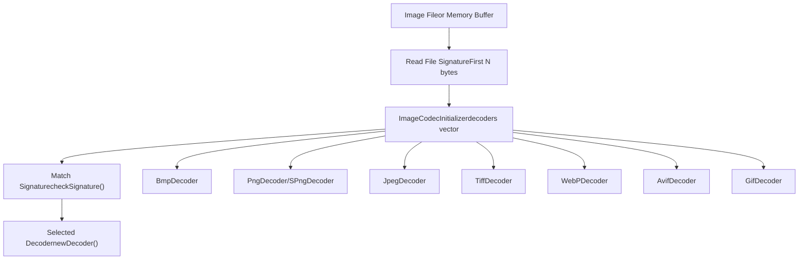
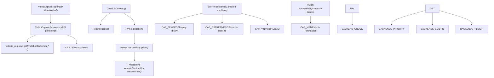

# 媒体 I/O

相关源文件

-   [cmake/OpenCVFindLibsGrfmt.cmake](https://github.com/opencv/opencv/blob/91c78f50/cmake/OpenCVFindLibsGrfmt.cmake)
-   [modules/imgcodecs/CMakeLists.txt](https://github.com/opencv/opencv/blob/91c78f50/modules/imgcodecs/CMakeLists.txt)
-   [modules/imgcodecs/include/opencv2/imgcodecs.hpp](https://github.com/opencv/opencv/blob/91c78f50/modules/imgcodecs/include/opencv2/imgcodecs.hpp)
-   [modules/imgcodecs/include/opencv2/imgcodecs/imgcodecs\_c.h](https://github.com/opencv/opencv/blob/91c78f50/modules/imgcodecs/include/opencv2/imgcodecs/imgcodecs_c.h)
-   [modules/imgcodecs/misc/java/test/ImgcodecsTest.java](https://github.com/opencv/opencv/blob/91c78f50/modules/imgcodecs/misc/java/test/ImgcodecsTest.java)
-   [modules/imgcodecs/src/exif.cpp](https://github.com/opencv/opencv/blob/91c78f50/modules/imgcodecs/src/exif.cpp)
-   [modules/imgcodecs/src/exif.hpp](https://github.com/opencv/opencv/blob/91c78f50/modules/imgcodecs/src/exif.hpp)
-   [modules/imgcodecs/src/grfmt\_avif.cpp](https://github.com/opencv/opencv/blob/91c78f50/modules/imgcodecs/src/grfmt_avif.cpp)
-   [modules/imgcodecs/src/grfmt\_avif.hpp](https://github.com/opencv/opencv/blob/91c78f50/modules/imgcodecs/src/grfmt_avif.hpp)
-   [modules/imgcodecs/src/grfmt\_base.cpp](https://github.com/opencv/opencv/blob/91c78f50/modules/imgcodecs/src/grfmt_base.cpp)
-   [modules/imgcodecs/src/grfmt\_base.hpp](https://github.com/opencv/opencv/blob/91c78f50/modules/imgcodecs/src/grfmt_base.hpp)
-   [modules/imgcodecs/src/grfmt\_gif.cpp](https://github.com/opencv/opencv/blob/91c78f50/modules/imgcodecs/src/grfmt_gif.cpp)
-   [modules/imgcodecs/src/grfmt\_gif.hpp](https://github.com/opencv/opencv/blob/91c78f50/modules/imgcodecs/src/grfmt_gif.hpp)
-   [modules/imgcodecs/src/grfmt\_hdr.cpp](https://github.com/opencv/opencv/blob/91c78f50/modules/imgcodecs/src/grfmt_hdr.cpp)
-   [modules/imgcodecs/src/grfmt\_hdr.hpp](https://github.com/opencv/opencv/blob/91c78f50/modules/imgcodecs/src/grfmt_hdr.hpp)
-   [modules/imgcodecs/src/grfmt\_jpeg.cpp](https://github.com/opencv/opencv/blob/91c78f50/modules/imgcodecs/src/grfmt_jpeg.cpp)
-   [modules/imgcodecs/src/grfmt\_jpeg.hpp](https://github.com/opencv/opencv/blob/91c78f50/modules/imgcodecs/src/grfmt_jpeg.hpp)
-   [modules/imgcodecs/src/grfmt\_jpeg2000.cpp](https://github.com/opencv/opencv/blob/91c78f50/modules/imgcodecs/src/grfmt_jpeg2000.cpp)
-   [modules/imgcodecs/src/grfmt\_png.cpp](https://github.com/opencv/opencv/blob/91c78f50/modules/imgcodecs/src/grfmt_png.cpp)
-   [modules/imgcodecs/src/grfmt\_png.hpp](https://github.com/opencv/opencv/blob/91c78f50/modules/imgcodecs/src/grfmt_png.hpp)
-   [modules/imgcodecs/src/grfmt\_spng.cpp](https://github.com/opencv/opencv/blob/91c78f50/modules/imgcodecs/src/grfmt_spng.cpp)
-   [modules/imgcodecs/src/grfmt\_tiff.cpp](https://github.com/opencv/opencv/blob/91c78f50/modules/imgcodecs/src/grfmt_tiff.cpp)
-   [modules/imgcodecs/src/grfmt\_tiff.hpp](https://github.com/opencv/opencv/blob/91c78f50/modules/imgcodecs/src/grfmt_tiff.hpp)
-   [modules/imgcodecs/src/grfmt\_webp.cpp](https://github.com/opencv/opencv/blob/91c78f50/modules/imgcodecs/src/grfmt_webp.cpp)
-   [modules/imgcodecs/src/grfmt\_webp.hpp](https://github.com/opencv/opencv/blob/91c78f50/modules/imgcodecs/src/grfmt_webp.hpp)
-   [modules/imgcodecs/src/grfmts.hpp](https://github.com/opencv/opencv/blob/91c78f50/modules/imgcodecs/src/grfmts.hpp)
-   [modules/imgcodecs/src/loadsave.cpp](https://github.com/opencv/opencv/blob/91c78f50/modules/imgcodecs/src/loadsave.cpp)
-   [modules/imgcodecs/test/test\_animation.cpp](https://github.com/opencv/opencv/blob/91c78f50/modules/imgcodecs/test/test_animation.cpp)
-   [modules/imgcodecs/test/test\_avif.cpp](https://github.com/opencv/opencv/blob/91c78f50/modules/imgcodecs/test/test_avif.cpp)
-   [modules/imgcodecs/test/test\_gif.cpp](https://github.com/opencv/opencv/blob/91c78f50/modules/imgcodecs/test/test_gif.cpp)
-   [modules/imgcodecs/test/test\_grfmt.cpp](https://github.com/opencv/opencv/blob/91c78f50/modules/imgcodecs/test/test_grfmt.cpp)
-   [modules/imgcodecs/test/test\_jpeg.cpp](https://github.com/opencv/opencv/blob/91c78f50/modules/imgcodecs/test/test_jpeg.cpp)
-   [modules/imgcodecs/test/test\_png.cpp](https://github.com/opencv/opencv/blob/91c78f50/modules/imgcodecs/test/test_png.cpp)
-   [modules/imgcodecs/test/test\_read\_write.cpp](https://github.com/opencv/opencv/blob/91c78f50/modules/imgcodecs/test/test_read_write.cpp)
-   [modules/imgcodecs/test/test\_tiff.cpp](https://github.com/opencv/opencv/blob/91c78f50/modules/imgcodecs/test/test_tiff.cpp)
-   [modules/imgcodecs/test/test\_webp.cpp](https://github.com/opencv/opencv/blob/91c78f50/modules/imgcodecs/test/test_webp.cpp)
-   [modules/videoio/cmake/detect\_ffmpeg.cmake](https://github.com/opencv/opencv/blob/91c78f50/modules/videoio/cmake/detect_ffmpeg.cmake)
-   [modules/videoio/cmake/init.cmake](https://github.com/opencv/opencv/blob/91c78f50/modules/videoio/cmake/init.cmake)
-   [modules/videoio/cmake/plugin.cmake](https://github.com/opencv/opencv/blob/91c78f50/modules/videoio/cmake/plugin.cmake)
-   [modules/videoio/include/opencv2/videoio.hpp](https://github.com/opencv/opencv/blob/91c78f50/modules/videoio/include/opencv2/videoio.hpp)
-   [modules/videoio/include/opencv2/videoio/registry.hpp](https://github.com/opencv/opencv/blob/91c78f50/modules/videoio/include/opencv2/videoio/registry.hpp)
-   [modules/videoio/include/opencv2/videoio/videoio\_c.h](https://github.com/opencv/opencv/blob/91c78f50/modules/videoio/include/opencv2/videoio/videoio_c.h)
-   [modules/videoio/misc/java/filelist\_common](https://github.com/opencv/opencv/blob/91c78f50/modules/videoio/misc/java/filelist_common)
-   [modules/videoio/misc/java/gen\_dict.json](https://github.com/opencv/opencv/blob/91c78f50/modules/videoio/misc/java/gen_dict.json)
-   [modules/videoio/misc/java/src/cpp/videoio\_converters.cpp](https://github.com/opencv/opencv/blob/91c78f50/modules/videoio/misc/java/src/cpp/videoio_converters.cpp)
-   [modules/videoio/misc/java/src/cpp/videoio\_converters.hpp](https://github.com/opencv/opencv/blob/91c78f50/modules/videoio/misc/java/src/cpp/videoio_converters.hpp)
-   [modules/videoio/misc/java/test/VideoCaptureTest.java](https://github.com/opencv/opencv/blob/91c78f50/modules/videoio/misc/java/test/VideoCaptureTest.java)
-   [modules/videoio/misc/plugin\_ffmpeg/CMakeLists.txt](https://github.com/opencv/opencv/blob/91c78f50/modules/videoio/misc/plugin_ffmpeg/CMakeLists.txt)
-   [modules/videoio/misc/plugin\_gstreamer/CMakeLists.txt](https://github.com/opencv/opencv/blob/91c78f50/modules/videoio/misc/plugin_gstreamer/CMakeLists.txt)
-   [modules/videoio/src/backend.hpp](https://github.com/opencv/opencv/blob/91c78f50/modules/videoio/src/backend.hpp)
-   [modules/videoio/src/backend\_plugin.cpp](https://github.com/opencv/opencv/blob/91c78f50/modules/videoio/src/backend_plugin.cpp)
-   [modules/videoio/src/backend\_static.cpp](https://github.com/opencv/opencv/blob/91c78f50/modules/videoio/src/backend_static.cpp)
-   [modules/videoio/src/cap.cpp](https://github.com/opencv/opencv/blob/91c78f50/modules/videoio/src/cap.cpp)
-   [modules/videoio/src/cap\_dc1394\_v2.cpp](https://github.com/opencv/opencv/blob/91c78f50/modules/videoio/src/cap_dc1394_v2.cpp)
-   [modules/videoio/src/cap\_dshow.cpp](https://github.com/opencv/opencv/blob/91c78f50/modules/videoio/src/cap_dshow.cpp)
-   [modules/videoio/src/cap\_dshow.hpp](https://github.com/opencv/opencv/blob/91c78f50/modules/videoio/src/cap_dshow.hpp)
-   [modules/videoio/src/cap\_ffmpeg.cpp](https://github.com/opencv/opencv/blob/91c78f50/modules/videoio/src/cap_ffmpeg.cpp)
-   [modules/videoio/src/cap\_ffmpeg\_impl.hpp](https://github.com/opencv/opencv/blob/91c78f50/modules/videoio/src/cap_ffmpeg_impl.hpp)
-   [modules/videoio/src/cap\_gphoto2.cpp](https://github.com/opencv/opencv/blob/91c78f50/modules/videoio/src/cap_gphoto2.cpp)
-   [modules/videoio/src/cap\_gstreamer.cpp](https://github.com/opencv/opencv/blob/91c78f50/modules/videoio/src/cap_gstreamer.cpp)
-   [modules/videoio/src/cap\_interface.hpp](https://github.com/opencv/opencv/blob/91c78f50/modules/videoio/src/cap_interface.hpp)
-   [modules/videoio/src/cap\_mjpeg\_decoder.cpp](https://github.com/opencv/opencv/blob/91c78f50/modules/videoio/src/cap_mjpeg_decoder.cpp)
-   [modules/videoio/src/cap\_mjpeg\_encoder.cpp](https://github.com/opencv/opencv/blob/91c78f50/modules/videoio/src/cap_mjpeg_encoder.cpp)
-   [modules/videoio/src/cap\_msmf.cpp](https://github.com/opencv/opencv/blob/91c78f50/modules/videoio/src/cap_msmf.cpp)
-   [modules/videoio/src/cap\_msmf.hpp](https://github.com/opencv/opencv/blob/91c78f50/modules/videoio/src/cap_msmf.hpp)
-   [modules/videoio/src/cap\_v4l.cpp](https://github.com/opencv/opencv/blob/91c78f50/modules/videoio/src/cap_v4l.cpp)
-   [modules/videoio/src/cap\_ximea.cpp](https://github.com/opencv/opencv/blob/91c78f50/modules/videoio/src/cap_ximea.cpp)
-   [modules/videoio/src/precomp.hpp](https://github.com/opencv/opencv/blob/91c78f50/modules/videoio/src/precomp.hpp)
-   [modules/videoio/src/videoio\_registry.cpp](https://github.com/opencv/opencv/blob/91c78f50/modules/videoio/src/videoio_registry.cpp)
-   [modules/videoio/test/test\_audio.cpp](https://github.com/opencv/opencv/blob/91c78f50/modules/videoio/test/test_audio.cpp)
-   [modules/videoio/test/test\_camera.cpp](https://github.com/opencv/opencv/blob/91c78f50/modules/videoio/test/test_camera.cpp)
-   [modules/videoio/test/test\_ffmpeg.cpp](https://github.com/opencv/opencv/blob/91c78f50/modules/videoio/test/test_ffmpeg.cpp)
-   [modules/videoio/test/test\_gstreamer.cpp](https://github.com/opencv/opencv/blob/91c78f50/modules/videoio/test/test_gstreamer.cpp)
-   [modules/videoio/test/test\_microphone.cpp](https://github.com/opencv/opencv/blob/91c78f50/modules/videoio/test/test_microphone.cpp)
-   [modules/videoio/test/test\_orientation.cpp](https://github.com/opencv/opencv/blob/91c78f50/modules/videoio/test/test_orientation.cpp)
-   [modules/videoio/test/test\_precomp.hpp](https://github.com/opencv/opencv/blob/91c78f50/modules/videoio/test/test_precomp.hpp)
-   [modules/videoio/test/test\_v4l2.cpp](https://github.com/opencv/opencv/blob/91c78f50/modules/videoio/test/test_v4l2.cpp)
-   [modules/videoio/test/test\_video\_io.cpp](https://github.com/opencv/opencv/blob/91c78f50/modules/videoio/test/test_video_io.cpp)
-   [samples/cpp/imgcodecs\_jpeg.cpp](https://github.com/opencv/opencv/blob/91c78f50/samples/cpp/imgcodecs_jpeg.cpp)
-   [samples/cpp/videocapture\_audio.cpp](https://github.com/opencv/opencv/blob/91c78f50/samples/cpp/videocapture_audio.cpp)
-   [samples/cpp/videocapture\_audio\_combination.cpp](https://github.com/opencv/opencv/blob/91c78f50/samples/cpp/videocapture_audio_combination.cpp)
-   [samples/cpp/videocapture\_microphone.cpp](https://github.com/opencv/opencv/blob/91c78f50/samples/cpp/videocapture_microphone.cpp)

## 目的与范围

媒体 I/O 系统提供统一 API，用于在多平台与多格式之间读取和写入图像及视频流。本文档覆盖两个子系统的高层架构及其交互模式。关于具体组件的详细信息：

-   图像文件读写、编解码器系统与格式支持：见 [图像文件 I/O 与编解码器系统](/opencv/opencv/7.1-image-file-io-and-codec-system)
-   视频采集/写入、后端架构与相机/流访问：见 [视频采集与后端架构](/opencv/opencv/7.2-video-capture-and-backend-architecture)

媒体 I/O 系统通过基于注册表的插件架构抽象平台特定实现，使 OpenCV 能在保持一致 API 表面的同时支持多样化硬件与软件后端。

---

## 系统架构概览

媒体 I/O 系统由两个彼此独立但共享通用设计模式的主模块组成：

```mermaid
flowchart TD
    APP["Application Code"]
    IMREAD["imread()imwrite()imdecode()imencode()"]
    VIDEOCAPTURE["cv::VideoCapture"]
    VIDEOWRITER["cv::VideoWriter"]
    IMG_REGISTRY["ImageCodecInitializerDecoder/Encoder Registry"]
    IMG_DECODERS["Image DecodersPngDecoder, JpegDecoderTiffDecoder, etc."]
    IMG_ENCODERS["Image EncodersPngEncoder, JpegEncoderTiffEncoder, etc."]
    VIO_REGISTRY["videoio_registryBackend Registry"]
    VIO_BACKENDS["Video BackendsFFmpeg, GStreamerMSMF, V4L2, etc."]
    ICAPTURE["IVideoCaptureInterface"]
    IWRITER["IVideoWriterInterface"]
    LIBPNG["libpng/libspng"]
    LIBJPEG["libjpeg-turbo"]
    LIBTIFF["libtiff"]
    LIBWEBP["libwebp"]
    FFMPEG["FFmpeglibavformat/libavcodec"]
    GSTREAMER["GStreamer"]
    V4L2["Video4Linux2"]
    MSMF["Media Foundation"]

    APP --> IMREAD
    APP --> VIDEOCAPTURE
    APP --> VIDEOWRITER
    IMREAD --> IMG_REGISTRY
    IMG --> REGISTRY_IMG_DECODERS
    IMG --> REGISTRY_IMG_ENCODERS
    VIDEOCAPTURE --> VIO_REGISTRY
    VIDEOWRITER --> VIO_REGISTRY
    VIO --> REGISTRY_VIO_BACKENDS
    VIO --> BACKENDS_ICAPTURE
    VIO --> BACKENDS_IWRITER
    IMG --> DECODERS_LIBPNG
    IMG --> DECODERS_LIBJPEG
    IMG --> DECODERS_LIBTIFF
    IMG --> DECODERS_LIBWEBP
    VIO --> BACKENDS_FFMPEG
    VIO --> BACKENDS_GSTREAMER
    VIO --> BACKENDS_V4L2
    VIO --> BACKENDS_MSMF
```

**来源：**

-   [modules/imgcodecs/src/loadsave.cpp156-245](https://github.com/opencv/opencv/blob/91c78f50/modules/imgcodecs/src/loadsave.cpp#L156-L245)
-   [modules/videoio/src/videoio\_registry.cpp1-23](https://github.com/opencv/opencv/blob/91c78f50/modules/videoio/src/videoio_registry.cpp#L1-L23)
-   [modules/videoio/src/cap.cpp47-64](https://github.com/opencv/opencv/blob/91c78f50/modules/videoio/src/cap.cpp#L47-L64)

---

## 模块组织与职责

| 模块 | 主要目的 | 关键类/函数 | 配置 |
| --- | --- | --- | --- |
| **imgcodecs** | 静态图像文件 I/O | `imread()`, `imwrite()`, `imdecode()`, `imencode()`, `ImageDecoder`, `ImageEncoder` | 通过 `ImageCodecInitializer` 注册表提供格式支持 |
| **videoio** | 视频流 I/O | `VideoCapture`, `VideoWriter`, `IVideoCapture`, `IVideoWriter` | 通过 `videoio_registry` 进行后端选择 |

两个模块都实现了**注册表模式**：格式/后端支持在初始化阶段根据构建配置和可用库确定。

**来源：**

-   [modules/imgcodecs/include/opencv2/imgcodecs.hpp48-65](https://github.com/opencv/opencv/blob/91c78f50/modules/imgcodecs/include/opencv2/imgcodecs.hpp#L48-L65)
-   [modules/videoio/include/opencv2/videoio.hpp48-65](https://github.com/opencv/opencv/blob/91c78f50/modules/videoio/include/opencv2/videoio.hpp#L48-L65)

---

## 后端抽象模式

### 图像编解码器注册表

imgcodecs 模块使用基于签名的格式检测，以及解码器/编码器静态注册表：

`ImageCodecInitializer` 结构体维护可用解码器和编码器向量，并在静态初始化阶段依据编译期特性开关填充：

-   解码器通过 `checkSignature()` 比较文件签名进行选择
-   编码器通过 `findEncoder()` 的文件扩展名匹配进行选择
-   每个编解码器都提供 `signatureLength()` 及格式特定签名

**来源：**

-   [modules/imgcodecs/src/loadsave.cpp152-252](https://github.com/opencv/opencv/blob/91c78f50/modules/imgcodecs/src/loadsave.cpp#L152-L252)
-   [modules/imgcodecs/src/loadsave.cpp261-297](https://github.com/opencv/opencv/blob/91c78f50/modules/imgcodecs/src/loadsave.cpp#L261-L297)
-   [modules/imgcodecs/src/loadsave.cpp327-365](https://github.com/opencv/opencv/blob/91c78f50/modules/imgcodecs/src/loadsave.cpp#L327-L365)

### 视频后端注册表

videoio 模块实现了更复杂的注册表，支持运行时后端选择：

后端通过 `VideoBackendInfo` 结构注册，其中指定：

-   后端 ID（`VideoCaptureAPIs` 枚举值）
-   自动选择时的优先级
-   用于创建采集/写入实例的工厂函数
-   标识其对文件、相机、流支持能力的标志

**来源：**

-   [modules/videoio/src/cap.cpp115-177](https://github.com/opencv/opencv/blob/91c78f50/modules/videoio/src/cap.cpp#L115-L177)
-   [modules/videoio/src/videoio\_registry.cpp1-300](https://github.com/opencv/opencv/blob/91c78f50/modules/videoio/src/videoio_registry.cpp#L1-L300)
-   [modules/videoio/include/opencv2/videoio.hpp82-132](https://github.com/opencv/opencv/blob/91c78f50/modules/videoio/include/opencv2/videoio.hpp#L82-L132)

---

## 插件架构

OpenCV 的视频 I/O 同时支持**静态**（编译内置）与**动态**（插件）后端：

### 插件配置

插件通过 CMake 变量配置：

-   `VIDEOIO_PLUGIN_LIST`：以逗号分隔的后端列表，用于构建为插件（例如 `