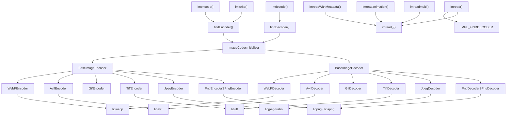
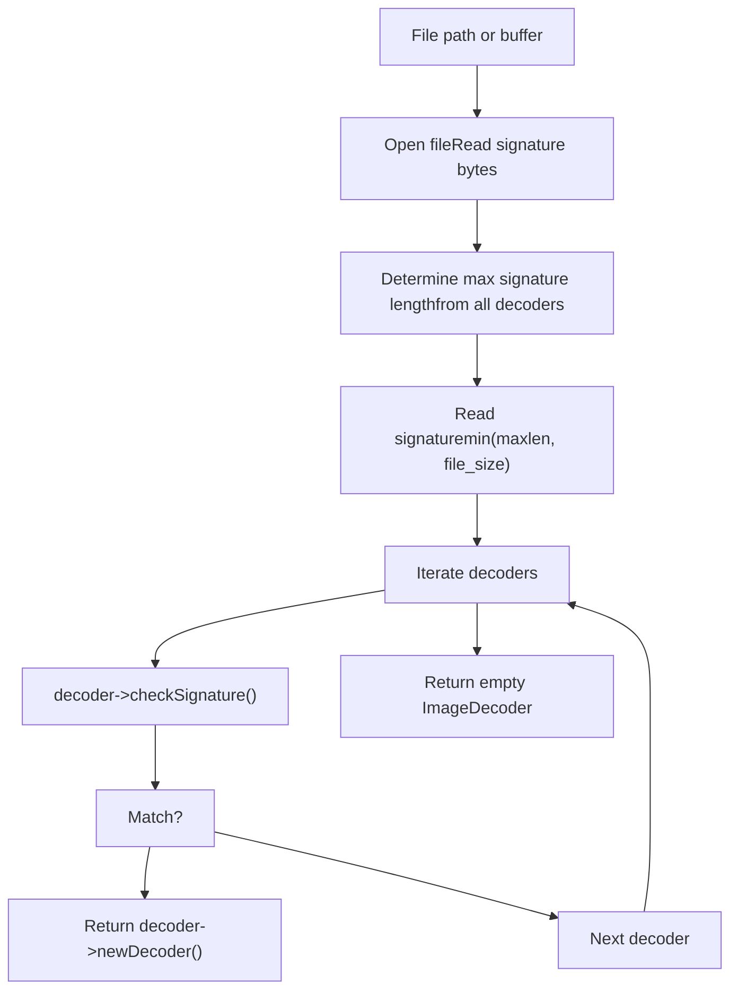
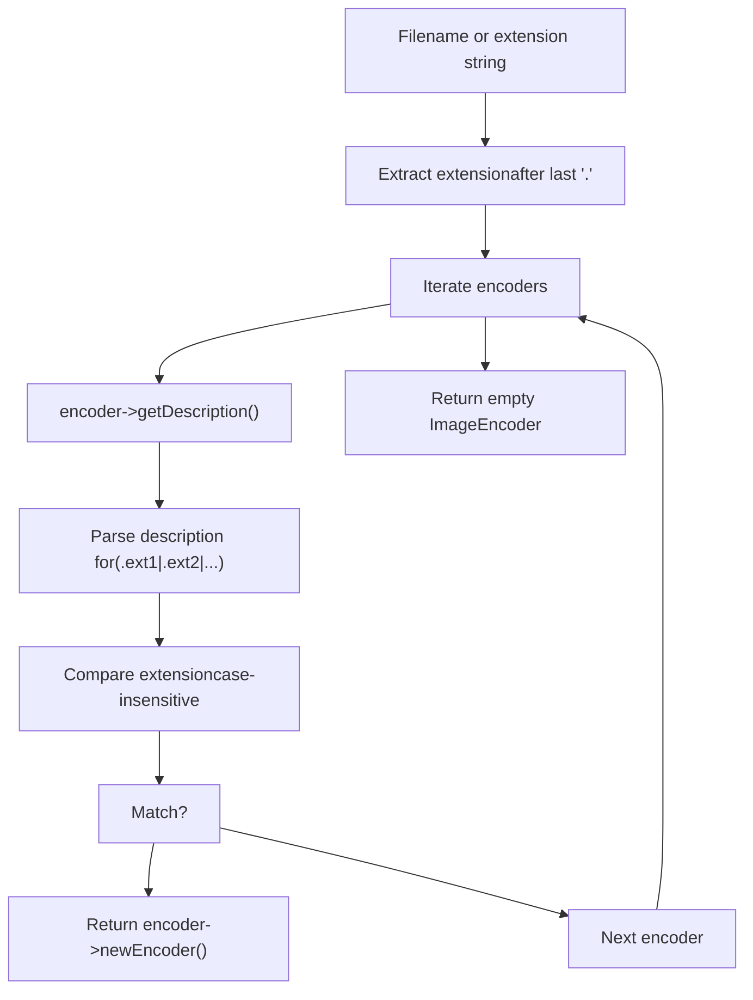
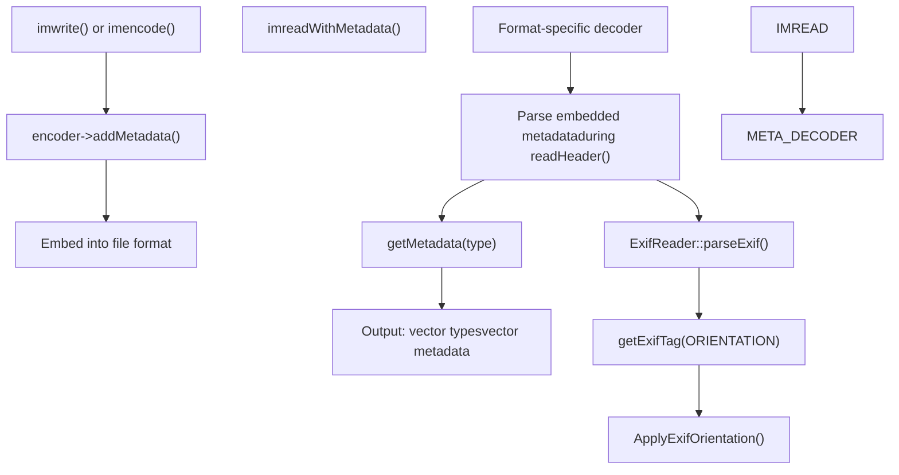
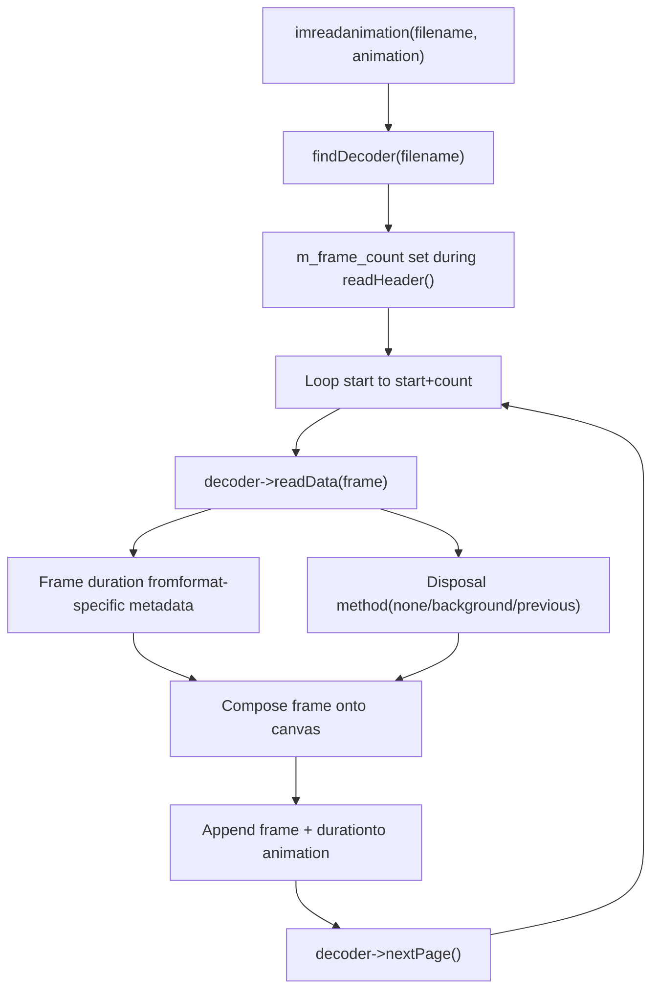
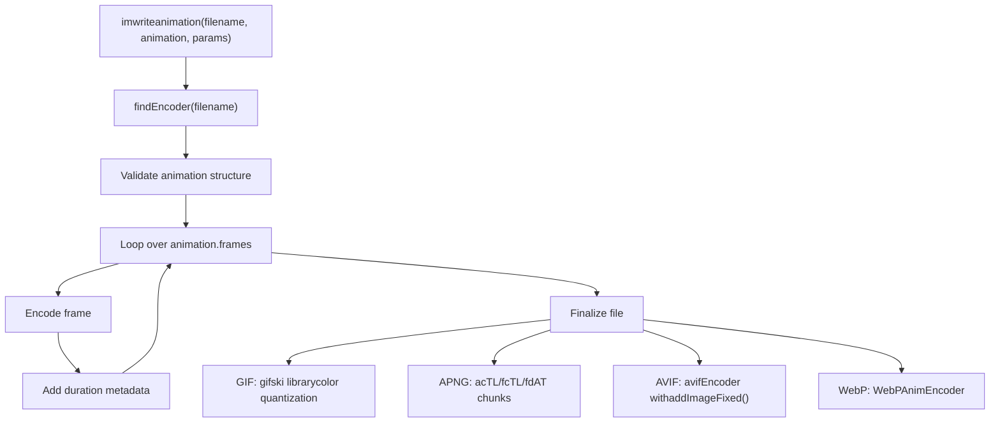

# 图像文件I/O和编解码系统

相关源文件

-   [cmake/OpenCVFindLibsGrfmt.cmake](https://github.com/opencv/opencv/blob/91c78f50/cmake/OpenCVFindLibsGrfmt.cmake)
-   [modules/imgcodecs/CMakeLists.txt](https://github.com/opencv/opencv/blob/91c78f50/modules/imgcodecs/CMakeLists.txt)
-   [modules/imgcodecs/include/opencv2/imgcodecs.hpp](https://github.com/opencv/opencv/blob/91c78f50/modules/imgcodecs/include/opencv2/imgcodecs.hpp)
-   [modules/imgcodecs/include/opencv2/imgcodecs/imgcodecs\_c.h](https://github.com/opencv/opencv/blob/91c78f50/modules/imgcodecs/include/opencv2/imgcodecs/imgcodecs_c.h)
-   [modules/imgcodecs/misc/java/test/ImgcodecsTest.java](https://github.com/opencv/opencv/blob/91c78f50/modules/imgcodecs/misc/java/test/ImgcodecsTest.java)
-   [modules/imgcodecs/src/exif.cpp](https://github.com/opencv/opencv/blob/91c78f50/modules/imgcodecs/src/exif.cpp)
-   [modules/imgcodecs/src/exif.hpp](https://github.com/opencv/opencv/blob/91c78f50/modules/imgcodecs/src/exif.hpp)
-   [modules/imgcodecs/src/grfmt\_avif.cpp](https://github.com/opencv/opencv/blob/91c78f50/modules/imgcodecs/src/grfmt_avif.cpp)
-   [modules/imgcodecs/src/grfmt\_avif.hpp](https://github.com/opencv/opencv/blob/91c78f50/modules/imgcodecs/src/grfmt_avif.hpp)
-   [modules/imgcodecs/src/grfmt\_base.cpp](https://github.com/opencv/opencv/blob/91c78f50/modules/imgcodecs/src/grfmt_base.cpp)
-   [modules/imgcodecs/src/grfmt\_base.hpp](https://github.com/opencv/opencv/blob/91c78f50/modules/imgcodecs/src/grfmt_base.hpp)
-   [modules/imgcodecs/src/grfmt\_gif.cpp](https://github.com/opencv/opencv/blob/91c78f50/modules/imgcodecs/src/grfmt_gif.cpp)
-   [modules/imgcodecs/src/grfmt\_gif.hpp](https://github.com/opencv/opencv/blob/91c78f50/modules/imgcodecs/src/grfmt_gif.hpp)
-   [modules/imgcodecs/src/grfmt\_hdr.cpp](https://github.com/opencv/opencv/blob/91c78f50/modules/imgcodecs/src/grfmt_hdr.cpp)
-   [modules/imgcodecs/src/grfmt\_hdr.hpp](https://github.com/opencv/opencv/blob/91c78f50/modules/imgcodecs/src/grfmt_hdr.hpp)
-   [modules/imgcodecs/src/grfmt\_jpeg.cpp](https://github.com/opencv/opencv/blob/91c78f50/modules/imgcodecs/src/grfmt_jpeg.cpp)
-   [modules/imgcodecs/src/grfmt\_jpeg.hpp](https://github.com/opencv/opencv/blob/91c78f50/modules/imgcodecs/src/grfmt_jpeg.hpp)
-   [modules/imgcodecs/src/grfmt\_jpeg2000.cpp](https://github.com/opencv/opencv/blob/91c78f50/modules/imgcodecs/src/grfmt_jpeg2000.cpp)
-   [modules/imgcodecs/src/grfmt\_png.cpp](https://github.com/opencv/opencv/blob/91c78f50/modules/imgcodecs/src/grfmt_png.cpp)
-   [modules/imgcodecs/src/grfmt\_png.hpp](https://github.com/opencv/opencv/blob/91c78f50/modules/imgcodecs/src/grfmt_png.hpp)
-   [modules/imgcodecs/src/grfmt\_spng.cpp](https://github.com/opencv/opencv/blob/91c78f50/modules/imgcodecs/src/grfmt_spng.cpp)
-   [modules/imgcodecs/src/grfmt\_tiff.cpp](https://github.com/opencv/opencv/blob/91c78f50/modules/imgcodecs/src/grfmt_tiff.cpp)
-   [modules/imgcodecs/src/grfmt\_tiff.hpp](https://github.com/opencv/opencv/blob/91c78f50/modules/imgcodecs/src/grfmt_tiff.hpp)
-   [modules/imgcodecs/src/grfmt\_webp.cpp](https://github.com/opencv/opencv/blob/91c78f50/modules/imgcodecs/src/grfmt_webp.cpp)
-   [modules/imgcodecs/src/grfmt\_webp.hpp](https://github.com/opencv/opencv/blob/91c78f50/modules/imgcodecs/src/grfmt_webp.hpp)
-   [modules/imgcodecs/src/grfmts.hpp](https://github.com/opencv/opencv/blob/91c78f50/modules/imgcodecs/src/grfmts.hpp)
-   [modules/imgcodecs/src/loadsave.cpp](https://github.com/opencv/opencv/blob/91c78f50/modules/imgcodecs/src/loadsave.cpp)
-   [modules/imgcodecs/test/test\_animation.cpp](https://github.com/opencv/opencv/blob/91c78f50/modules/imgcodecs/test/test_animation.cpp)
-   [modules/imgcodecs/test/test\_avif.cpp](https://github.com/opencv/opencv/blob/91c78f50/modules/imgcodecs/test/test_avif.cpp)
-   [modules/imgcodecs/test/test\_gif.cpp](https://github.com/opencv/opencv/blob/91c78f50/modules/imgcodecs/test/test_gif.cpp)
-   [modules/imgcodecs/test/test\_grfmt.cpp](https://github.com/opencv/opencv/blob/91c78f50/modules/imgcodecs/test/test_grfmt.cpp)
-   [modules/imgcodecs/test/test\_jpeg.cpp](https://github.com/opencv/opencv/blob/91c78f50/modules/imgcodecs/test/test_jpeg.cpp)
-   [modules/imgcodecs/test/test\_png.cpp](https://github.com/opencv/opencv/blob/91c78f50/modules/imgcodecs/test/test_png.cpp)
-   [modules/imgcodecs/test/test\_read\_write.cpp](https://github.com/opencv/opencv/blob/91c78f50/modules/imgcodecs/test/test_read_write.cpp)
-   [modules/imgcodecs/test/test\_tiff.cpp](https://github.com/opencv/opencv/blob/91c78f50/modules/imgcodecs/test/test_tiff.cpp)
-   [modules/imgcodecs/test/test\_webp.cpp](https://github.com/opencv/opencv/blob/91c78f50/modules/imgcodecs/test/test_webp.cpp)
-   [modules/videoio/misc/java/filelist\_common](https://github.com/opencv/opencv/blob/91c78f50/modules/videoio/misc/java/filelist_common)
-   [modules/videoio/misc/java/gen\_dict.json](https://github.com/opencv/opencv/blob/91c78f50/modules/videoio/misc/java/gen_dict.json)
-   [modules/videoio/misc/java/src/cpp/videoio\_converters.cpp](https://github.com/opencv/opencv/blob/91c78f50/modules/videoio/misc/java/src/cpp/videoio_converters.cpp)
-   [modules/videoio/misc/java/src/cpp/videoio\_converters.hpp](https://github.com/opencv/opencv/blob/91c78f50/modules/videoio/misc/java/src/cpp/videoio_converters.hpp)
-   [modules/videoio/misc/java/test/VideoCaptureTest.java](https://github.com/opencv/opencv/blob/91c78f50/modules/videoio/misc/java/test/VideoCaptureTest.java)
-   [samples/cpp/imgcodecs\_jpeg.cpp](https://github.com/opencv/opencv/blob/91c78f50/samples/cpp/imgcodecs_jpeg.cpp)

本文档描述了用于读取和写入各种格式的图像文件的`imgcodecs`模块的架构。它涵盖了编解码器系统设计、格式支持、元数据处理、animation/multi-page功能以及用于图像文件I/O操作的公共API。

对于视频文件I/O，请参阅[Video Capture and Backend Architecture](/opencv/opencv/7.2-video-capture-and-backend-architecture)。

---

## 系统概述

`imgcodecs` 模块通过基于插件的编解码器架构提供与格式无关的图像文件读写。系统通过签名匹配自动检测文件格式，并将I/O操作路由到适当的编解码器实现。

### 高级架构


**来源：** [modules/imgcodecs/include/opencv2/imgcodecs.hpp1-600](https://github.com/opencv/opencv/blob/91c78f50/modules/imgcodecs/include/opencv2/imgcodecs.hpp#L1-L600) [modules/imgcodecs/src/loadsave.cpp156-252](https://github.com/opencv/opencv/blob/91c78f50/modules/imgcodecs/src/loadsave.cpp#L156-L252) [modules/imgcodecs/src/grfmt\_base.hpp1-300](https://github.com/opencv/opencv/blob/91c78f50/modules/imgcodecs/src/grfmt_base.hpp#L1-L300)

---

## 核心API函数

主要接口由基于文件和基于内存的I/O函数组成，它们接受特定于格式的标志和参数。

### 图像读取功能

|功能|目的|主要特点|
| --- | --- | --- |
|`imread()`|从文件加载单个图像|格式自动检测、EXIF定位、颜色转换|
|`imdecode()`|从内存缓冲区解码图像|与`imread()`相同的功能|
|`imreadmulti()`|加载multi-page/multi-frame图像|TIFF 页面、动画格式|
|`imreadanimation()`|加载带有定时的动画|返回带有帧和持续时间的`Animation`|
|`imreadWithMetadata()`|使用 EXIF/XMP/ICC 数据加载图像|元数据单独返回|
|`imcount()`|计数文件中的pages/frames|返回帧计数而不解码|

### 图像写入函数

|功能|目的|主要特点|
| --- | --- | --- |
|`imwrite()`|将单个图像保存到文件|基于扩展的格式选择|
|`imencode()`|将图像编码到内存缓冲区|由扩展字符串指定的格式|
|`imwriteanimation()`|将动画保存到文件|GIF、AVIF、APNG、WebP 支持|
|`imencodeanimation()`|将动画编码到缓冲区|基于记忆的动画写作|

### ImreadModes 标志

`ImreadModes` 枚举控制图像的加载和处理方式：

```
IMREAD_UNCHANGED            = -1  // Preserve format, alpha, orientationIMREAD_GRAYSCALE            = 0   // Convert to single-channel grayscaleIMREAD_COLOR_BGR            = 1   // Convert to 3-channel BGR (default)IMREAD_COLOR_RGB            = 256 // Convert to 3-channel RGBIMREAD_ANYDEPTH             = 2   // Preserve 16/32-bit depthIMREAD_ANYCOLOR             = 4   // Preserve channel countIMREAD_LOAD_GDAL            = 8   // Use GDAL driverIMREAD_REDUCED_GRAYSCALE_2  = 16  // Load at 1/2 resolution (grayscale)IMREAD_REDUCED_COLOR_2      = 17  // Load at 1/2 resolution (color)IMREAD_IGNORE_ORIENTATION   = 128 // Don't apply EXIF rotation
```
**来源：** [modules/imgcodecs/include/opencv2/imgcodecs.hpp67-85](https://github.com/opencv/opencv/blob/91c78f50/modules/imgcodecs/include/opencv2/imgcodecs.hpp#L67-L85) [modules/imgcodecs/include/opencv2/imgcodecs.hpp323-375](https://github.com/opencv/opencv/blob/91c78f50/modules/imgcodecs/include/opencv2/imgcodecs.hpp#L323-L375) [modules/imgcodecs/src/loadsave.cpp754-791](https://github.com/opencv/opencv/blob/91c78f50/modules/imgcodecs/src/loadsave.cpp#L754-L791)

---

## 编解码器架构

编解码器系统使用具有特定于格式的实现的抽象基类。编解码器在模块初始化时注册，并根据文件签名（解码器）或扩展名（编码器）进行选择。

### 基本解码器接口


**关键方法：**

- **`checkSignature(const String&)`**：通过检查标头字节验证文件格式
- **`readHeader()`**：解析元数据以填充`m_width`、`m_height`、`m_type`、`m_frame_count`
- **`readData(Mat&)`**：将像素数据解码为提供的`Mat`
- **`nextPage()`**：以多页格式前进到下一个frame/page
- **`getMetadata(ImageMetadataType)`**：返回 EXIF、XMP 或 ICC 配置文件数据
- **`setSource()`**：设置来自文件名或内存缓冲区的输入（`m_buf`）

**来源：** [modules/imgcodecs/src/grfmt\_base.hpp20-140](https://github.com/opencv/opencv/blob/91c78f50/modules/imgcodecs/src/grfmt_base.hpp#L20-L140) [modules/imgcodecs/src/grfmt\_base.cpp1-200](https://github.com/opencv/opencv/blob/91c78f50/modules/imgcodecs/src/grfmt_base.cpp#L1-L200)

### 基本编码器接口


**关键方法：**

- **`write(const Mat&, const std::vector<int>& params)`**：编码单个图像
- **`writemulti(const std::vector<Mat>&, const std::vector<int>& params)`**：编码多页
- **`addMetadata(ImageMetadataType, InputArray)`**：嵌入EXIF/XMP/ICC数据
- **`isValidEncodeKey(int)`**：验证格式特定的参数键
- **`setDestination()`**：将输出设置为文件名或内存缓冲区

**来源：** [modules/imgcodecs/src/grfmt\_base.hpp142-250](https://github.com/opencv/opencv/blob/91c78f50/modules/imgcodecs/src/grfmt_base.hpp#L142-L250) [modules/imgcodecs/src/grfmt\_base.cpp1-200](https://github.com/opencv/opencv/blob/91c78f50/modules/imgcodecs/src/grfmt_base.cpp#L1-L200)

---

## 格式支持和注册

###编解码器注册系统

`ImageCodecInitializer` 结构维护已注册解码器和编码器的向量，在静态初始化时填充。


**来源：** [modules/imgcodecs/src/loadsave.cpp157-245](https://github.com/opencv/opencv/blob/91c78f50/modules/imgcodecs/src/loadsave.cpp#L157-L245)

### 通过签名匹配选择解码器


**实现：** `findDecoder()` 函数读取文件签名（通常为 8-32 字节）并将其与每个已注册解码器的签名模式进行比较。 BMP 检查“BM”，PNG 检查“\\x89PNG\\r\\n\\x1a\\n”，JPEG 检查“\\xFF\\xD8\\xFF”等。

**来源：** [modules/imgcodecs/src/loadsave.cpp261-297](https://github.com/opencv/opencv/blob/91c78f50/modules/imgcodecs/src/loadsave.cpp#L261-L297) [modules/imgcodecs/src/loadsave.cpp299-325](https://github.com/opencv/opencv/blob/91c78f50/modules/imgcodecs/src/loadsave.cpp#L299-L325)

### 通过扩展选择编码器


**来源：** [modules/imgcodecs/src/loadsave.cpp327-365](https://github.com/opencv/opencv/blob/91c78f50/modules/imgcodecs/src/loadsave.cpp#L327-L365)

### 格式支持矩阵

|格式|扩展|解码器签名|随时可用|第三方库|动画片|多页|元数据|
| --- | --- | --- | --- | --- | --- | --- | --- |
|骨形态发生蛋白|.bmp、.dib|“BM”| ✓ |内置| ✗ | ✗ | ✗ |
|巴布亚新几内亚|.png|“\\x89PNG\\r\\n\\x1a\\n”| ✗ |libpng / libspng|✓ (APNG)| ✗ | ✓ |
|JPEG|.jpg、.jpeg、.jpe|“\\xFF\\xD8\\xFF”| ✗ |libjpeg-turbo| ✗ | ✗ | ✓ |
|TIFF|.tiff、.tif|“II\\x2a\\x00”/“MM\\x00\\x2a”| ✗ |库| ✗ | ✓ | ✓ |
|网络P|.webp|“RIFF？？？WEBP”| ✗ |libwebp| ✓ | ✗ | ✓ |
|AVIF|.avif|各不相同| ✗ |利巴维夫| ✓ | ✗ | ✓ |
|动图|.gif|“GIF87a”/“GIF89a”| ✗ |内置| ✓ | ✗ | ✗ |
|JPEG2000|.jp2, .j2c|各不相同| ✗ |贾斯珀 / openjpeg| ✗ | ✗ | ✗ |
|开放EXR|.exr|“\\x76\\x2f\\x31\\x01”| ✗ |开放EXR| ✗ | ✗ | ✗ |
|PBM/PGM/PPM|.pbm、.pgm、.ppm、.pnm|“P1”-“P6”| ✓ |内置| ✗ | ✗ | ✗ |
|PFM|.pfm|“PF”/“Pf”| ✓ |内置| ✗ | ✗ | ✗ |
|太阳光栅|.sr、.ras|“\\x59\\xa6\\x6a\\x95”| ✓ |内置| ✗ | ✗ | ✗ |
|高动态范围|.hdr、.pic|“＃？辐射”| ✓ |内置| ✗ | ✗ | ✗ |

**来源：** [modules/imgcodecs/include/opencv2/imgcodecs.hpp331-346](https://github.com/opencv/opencv/blob/91c78f50/modules/imgcodecs/include/opencv2/imgcodecs.hpp#L331-L346) [modules/imgcodecs/src/loadsave.cpp164-240](https://github.com/opencv/opencv/blob/91c78f50/modules/imgcodecs/src/loadsave.cpp#L164-L240)

---

## 元数据处理

该系统支持提取和嵌入图像元数据，包括 EXIF、XMP、ICC 颜色配置文件和 cICP 视频信号信息。

### 元数据类型

```
enum ImageMetadataType{    IMAGE_METADATA_UNKNOWN = -1,    IMAGE_METADATA_EXIF = 0,     // EXIF (camera info, GPS, orientation)    IMAGE_METADATA_XMP = 1,      // XMP (Adobe Extensible Metadata Platform)    IMAGE_METADATA_ICCP = 2,     // ICC Profile (color management)    IMAGE_METADATA_CICP = 3,     // cICP Profile (video signal type)    IMAGE_METADATA_MAX = 3};
```
**来源：** [modules/imgcodecs/include/opencv2/imgcodecs.hpp267-277](https://github.com/opencv/opencv/blob/91c78f50/modules/imgcodecs/include/opencv2/imgcodecs.hpp#L267-L277)

### 元数据流程图


### EXIF 方向转换

`ApplyExifOrientation()` 函数应用基于 EXIF 方向标签的图像转换：

|方向值|转型|
| --- | --- |
|1（图像方向\_TL）|没有变化|
|2（图像方向\_TR）|水平翻转|
|3（图像方向\_BR）|水平和垂直翻转|
|4（图像方向\_BL）|垂直翻转|
|5（图像方向LT）|转置|
|6（图像方向RT）|转置+水平翻转|
|7（图像方向\_RB）|转置+翻转两者|
|8（图像方向LB）|转置+垂直翻转|

**实现：**除非指定了`IMREAD_IGNORE_ORIENTATION`或`IMREAD_UNCHANGED`，否则解码后会自动应用方向。

**来源：** [modules/imgcodecs/src/loadsave.cpp382-417](https://github.com/opencv/opencv/blob/91c78f50/modules/imgcodecs/src/loadsave.cpp#L382-L417) [modules/imgcodecs/src/loadsave.cpp419-428](https://github.com/opencv/opencv/blob/91c78f50/modules/imgcodecs/src/loadsave.cpp#L419-L428) [modules/imgcodecs/src/loadsave.cpp629-633](https://github.com/opencv/opencv/blob/91c78f50/modules/imgcodecs/src/loadsave.cpp#L629-L633) [modules/imgcodecs/src/exif.hpp1-200](https://github.com/opencv/opencv/blob/91c78f50/modules/imgcodecs/src/exif.hpp#L1-L200) [modules/imgcodecs/src/exif.cpp1-500](https://github.com/opencv/opencv/blob/91c78f50/modules/imgcodecs/src/exif.cpp#L1-L500)

### 格式特定的元数据支持

**JPEG：**

- 来自 APP1 标记段的 EXIF 数据
- 来自 APP1 的 XMP，带有“[http://ns.adobe.com/xap/1.0/](http://ns.adobe.com/xap/1.0/)”前缀
- APP2 标记段的 ICC 配置文件

**PNG：**

- 来自 eXIf 块或文本“原始配置文件类型 exif”的 EXIF
- 来自文本“XML:com.adobe.xmp”的 XMP
- 来自 iCCP 块的 ICC 配置文件

**TIFF：**

- TIFF 标签的 EXIF
- 来自 TIFF 标签 700 的 XMP
- 来自 TIFF 标签 34675 的 ICC 配置文件

**视频：**

- EXIF、XMP、ICC 通过 `avifImageSetMetadata*()` / `avifImageSetProfileICC()`

**网络P：**

- EXIF、XMP、ICC 通过 `WebPMuxSetChunk()` 和 EXIF/XMP/ICCP 块类型

**来源：** [modules/imgcodecs/src/grfmt\_jpeg.cpp249-285](https://github.com/opencv/opencv/blob/91c78f50/modules/imgcodecs/src/grfmt_jpeg.cpp#L249-L285) [modules/imgcodecs/src/grfmt\_png.cpp636-674](https://github.com/opencv/opencv/blob/91c78f50/modules/imgcodecs/src/grfmt_png.cpp#L636-L674) [modules/imgcodecs/src/grfmt\_avif.cpp112-137](https://github.com/opencv/opencv/blob/91c78f50/modules/imgcodecs/src/grfmt_avif.cpp#L112-L137) [modules/imgcodecs/src/grfmt\_webp.cpp250-290](https://github.com/opencv/opencv/blob/91c78f50/modules/imgcodecs/src/grfmt_webp.cpp#L250-L290)

---

## 动画和多页面支持

### 动画结构

`Animation` 结构封装了带有时序信息的帧序列：

```
struct Animation{    int loop_count;                // 0 = infinite loop    Scalar bgcolor;                // Background color (BGRA)    std::vector<int> durations;    // Frame durations in milliseconds    std::vector<Mat> frames;       // Frame images    Mat still_image;               // Fallback still image};
```
**笔记：**

- **GIF**：持续时间四舍五入为 10 毫秒增量（格式限制）
- **循环计数行为**：某些格式将 N 解释为“显示 N 次”与“N+1 次”

**来源：** [modules/imgcodecs/include/opencv2/imgcodecs.hpp285-321](https://github.com/opencv/opencv/blob/91c78f50/modules/imgcodecs/include/opencv2/imgcodecs.hpp#L285-L321)

### 动画解码流程


**处置方法：**

- **GIF\_DISPOSE\_NONE**：保留框架，然后在顶部合成
- **GIF\_DISPOSE\_RESTORE\_BACKGROUND**：在下一帧之前清除背景
- **GIF\_DISPOSE\_RESTORE\_PREVIOUS**：恢复到当前帧之前的状态

**来源：** [modules/imgcodecs/src/loadsave.cpp818-921](https://github.com/opencv/opencv/blob/91c78f50/modules/imgcodecs/src/loadsave.cpp#L818-L921) [modules/imgcodecs/src/grfmt\_gif.cpp84-200](https://github.com/opencv/opencv/blob/91c78f50/modules/imgcodecs/src/grfmt_gif.cpp#L84-L200) [modules/imgcodecs/src/grfmt\_png.cpp401-578](https://github.com/opencv/opencv/blob/91c78f50/modules/imgcodecs/src/grfmt_png.cpp#L401-L578)

### 动画编码流程


**来源：** [modules/imgcodecs/include/opencv2/imgcodecs.hpp458-470](https://github.com/opencv/opencv/blob/91c78f50/modules/imgcodecs/include/opencv2/imgcodecs.hpp#L458-L470) [modules/imgcodecs/src/grfmt\_gif.cpp400-650](https://github.com/opencv/opencv/blob/91c78f50/modules/imgcodecs/src/grfmt_gif.cpp#L400-L650) [modules/imgcodecs/src/grfmt\_png.cpp1200-1500](https://github.com/opencv/opencv/blob/91c78f50/modules/imgcodecs/src/grfmt_png.cpp#L1200-L1500) [modules/imgcodecs/src/grfmt\_avif.cpp400-600](https://github.com/opencv/opencv/blob/91c78f50/modules/imgcodecs/src/grfmt_avif.cpp#L400-L600) [modules/imgcodecs/src/grfmt\_webp.cpp500-800](https://github.com/opencv/opencv/blob/91c78f50/modules/imgcodecs/src/grfmt_webp.cpp#L500-L800)

### 多页 TIFF 支持

TIFF 文件可以包含多个独立的图像（页面）。 `imreadmulti()`函数加载指定范围：

```
bool imreadmulti(const String& filename,                  std::vector<Mat>& mats,                 int start = 0,                  int count = -1,                 int flags = IMREAD_ANYCOLOR);
```
**实现：** 解码器调用`TIFFReadDirectory()`在页面之间前进，并调用`readHeader()`为每个页面更新dimensions/type。

**来源：** [modules/imgcodecs/include/opencv2/imgcodecs.hpp415-425](https://github.com/opencv/opencv/blob/91c78f50/modules/imgcodecs/include/opencv2/imgcodecs.hpp#L415-L425) [modules/imgcodecs/src/loadsave.cpp640-744](https://github.com/opencv/opencv/blob/91c78f50/modules/imgcodecs/src/loadsave.cpp#L640-L744) [modules/imgcodecs/src/grfmt\_tiff.cpp463-469](https://github.com/opencv/opencv/blob/91c78f50/modules/imgcodecs/src/grfmt_tiff.cpp#L463-L469)

---

## 内存缓冲区I/O

`imdecode()` 和 `imencode()` 函数无需文件系统访问即可进行格式处理，这对于网络流或内存中处理非常有用。

### 从内存中解码

```
Mat imdecode(InputArray buf, int flags);
```
**过程：**

1. 缓冲区传递给`findDecoder(const Mat& buf)`
2. 从缓冲区开始提取签名
3. 解码器的`setSource(buf)`配置内部缓冲区指针
4. `readHeader()`和`readData()`从`m_buf`读取而不是从文件中读取

**特定于格式的实现：**

**PNG (libpng):** 自定义读取回调 `readDataFromBuf()` 通过 `png_set_read_fn()` 配置

```
void PngDecoder::readDataFromBuf(void* png_ptr, uchar* dst, size_t size){    PngDecoder* decoder = (PngDecoder*)png_get_io_ptr(png_ptr);    memcpy(dst, decoder->m_buf.ptr() + decoder->m_buf_pos, size);    decoder->m_buf_pos += size;}
```
**JPEG:** 通过 `jpeg_mem_src(&cinfo, buf.ptr(), buf.size())` 传递给 libjpeg 的缓冲区

**TIFF：** 通过 `TIFFClientOpen()` 和 `TiffDecoderBufHelper` 回调自定义 TIFF I/O 处理程序

**来源：** [modules/imgcodecs/src/loadsave.cpp1006-1055](https://github.com/opencv/opencv/blob/91c78f50/modules/imgcodecs/src/loadsave.cpp#L1006-L1055) [modules/imgcodecs/src/grfmt\_png.cpp237-250](https://github.com/opencv/opencv/blob/91c78f50/modules/imgcodecs/src/grfmt_png.cpp#L237-L250) [modules/imgcodecs/src/grfmt\_jpeg.cpp234-238](https://github.com/opencv/opencv/blob/91c78f50/modules/imgcodecs/src/grfmt_jpeg.cpp#L234-L238) [modules/imgcodecs/src/grfmt\_tiff.cpp250-323](https://github.com/opencv/opencv/blob/91c78f50/modules/imgcodecs/src/grfmt_tiff.cpp#L250-L323)

### 编码到内存

```
bool imencode(const String& ext,               InputArray img,              std::vector<uchar>& buf,              const std::vector<int>& params = std::vector<int>());
```
**过程：**

1. 通过扩展字符串找到编码器（例如“.png”、“.jpg”）
2.编码器的`setDestination(buf)`配置输出缓冲区
3. `write()`编码为内部`m_strm`流
4. 将流内容复制到输出`buf`

**来源：** [modules/imgcodecs/include/opencv2/imgcodecs.hpp635-650](https://github.com/opencv/opencv/blob/91c78f50/modules/imgcodecs/include/opencv2/imgcodecs.hpp#L635-L650) [modules/imgcodecs/src/loadsave.cpp1057-1100](https://github.com/opencv/opencv/blob/91c78f50/modules/imgcodecs/src/loadsave.cpp#L1057-L1100)

---

## 配置和验证

### 图像大小限制

为了防止内存耗尽攻击，强制执行最大图像尺寸：

```
static const size_t CV_IO_MAX_IMAGE_PARAMS = 50;static const size_t CV_IO_MAX_IMAGE_WIDTH = 1 << 20;   // 1,048,576 pixelsstatic const size_t CV_IO_MAX_IMAGE_HEIGHT = 1 << 20;  // 1,048,576 pixelsstatic const size_t CV_IO_MAX_IMAGE_PIXELS = 1 << 30;  // 1,073,741,824 pixels
```
**环境变量：**

- `OPENCV_IO_MAX_IMAGE_PARAMS`
- `OPENCV_IO_MAX_IMAGE_WIDTH`
- `OPENCV_IO_MAX_IMAGE_HEIGHT`
- `OPENCV_IO_MAX_IMAGE_PIXELS`

**验证功能：**

```
static Size validateInputImageSize(const Size& size){    CV_Assert(size.width > 0 && size.width <= CV_IO_MAX_IMAGE_WIDTH);    CV_Assert(size.height > 0 && size.height <= CV_IO_MAX_IMAGE_HEIGHT);    uint64 pixels = (uint64)size.width * (uint64)size.height;    CV_Assert(pixels <= CV_IO_MAX_IMAGE_PIXELS);    return size;}
```
**来源：** [modules/imgcodecs/src/loadsave.cpp67-81](https://github.com/opencv/opencv/blob/91c78f50/modules/imgcodecs/src/loadsave.cpp#L67-L81)

### 写入参数验证

每个编码器通过`isValidEncodeKey()`验证特定于格式的写入参数：

```
bool isValidEncodeKey(int key){    // Example from PngEncoder    return key == IMWRITE_PNG_COMPRESSION ||           key == IMWRITE_PNG_STRATEGY ||           key == IMWRITE_PNG_BILEVEL ||           // ... other PNG-specific flags}
```
系统会检查所有提供的参数键是否对于至少一个已注册的编码器有效，以防止出现静默参数忽略警告。

**来源：** [modules/imgcodecs/src/loadsave.cpp367-380](https://github.com/opencv/opencv/blob/91c78f50/modules/imgcodecs/src/loadsave.cpp#L367-L380)

### 类型和通道转换

`calcType()` 函数根据格式功能和读取标志确定输出 `Mat` 类型：

```
static inline int calcType(int type, int flags){    // If IMREAD_UNCHANGED, preserve original type    if (flags == IMREAD_UNCHANGED) return type;        // Force 8-bit depth unless IMREAD_ANYDEPTH    if ((flags & IMREAD_ANYDEPTH) == 0)        type = CV_MAKETYPE(CV_8U, CV_MAT_CN(type));        // Convert channels based on IMREAD_COLOR / IMREAD_GRAYSCALE    if (flags & (IMREAD_COLOR | IMREAD_COLOR_RGB))        type = CV_MAKETYPE(CV_MAT_DEPTH(type), 3);    else if ((flags & IMREAD_ANYCOLOR) == 0)        type = CV_MAKETYPE(CV_MAT_DEPTH(type), 1);        return type;}
```
**来源：** [modules/imgcodecs/src/loadsave.cpp84-111](https://github.com/opencv/opencv/blob/91c78f50/modules/imgcodecs/src/loadsave.cpp#L84-L111)

---

## ImwriteFlags 参考

特定于格式的编码参数作为键值对传递：

```
std::vector<int> params;params.push_back(IMWRITE_JPEG_QUALITY);params.push_back(95);imwrite("output.jpg", img, params);
```
### 常用写入参数

|旗帜|值范围|默认|格式|描述|
| --- | --- | --- | --- | --- |
|`IMWRITE_JPEG_QUALITY`| 0-100 | 95 |JPEG|质量（更高=更好）|
|`IMWRITE_JPEG_PROGRESSIVE`| 0-1 | 0 |JPEG|启用渐进式编码|
|`IMWRITE_JPEG_OPTIMIZE`| 0-1 | 0 |JPEG|优化霍夫曼表|
|`IMWRITE_PNG_COMPRESSION`| 0-9 | 1 |巴布亚新几内亚|压缩级别（较高 = slower/smaller)|
|`IMWRITE_PNG_STRATEGY`|请参阅枚举|RLE|巴布亚新几内亚|压缩策略|
|`IMWRITE_TIFF_COMPRESSION`|请参阅枚举|陆ZW|TIFF|压缩方式|
|`IMWRITE_WEBP_QUALITY`| 1-100 | 100 |网络P|质量（≥100 = 无损）|
|`IMWRITE_AVIF_QUALITY`| 0-100 | 95 |AVIF|质量（更高=更好）|
|`IMWRITE_AVIF_SPEED`| 0-10 | 9 |AVIF|编码速度（0=slow/best，10=快）|
|`IMWRITE_AVIF_DEPTH`| 8/10/12 | 8 |AVIF|位深度|
|`IMWRITE_GIF_QUALITY`| 1-8 | 2 |动图|量化质量|
|`IMWRITE_GIF_DITHER`|\-1 到 3| 0 |动图|抖动级别|

**来源：** [modules/imgcodecs/include/opencv2/imgcodecs.hpp88-129](https://github.com/opencv/opencv/blob/91c78f50/modules/imgcodecs/include/opencv2/imgcodecs.hpp#L88-L129)

### TIFF 压缩方法

```
enum ImwriteTiffCompressionFlags {    IMWRITE_TIFF_COMPRESSION_NONE = 1,    IMWRITE_TIFF_COMPRESSION_LZW = 5,           // Default    IMWRITE_TIFF_COMPRESSION_JPEG = 7,    IMWRITE_TIFF_COMPRESSION_ADOBE_DEFLATE = 8,    IMWRITE_TIFF_COMPRESSION_DEFLATE = 32946,    IMWRITE_TIFF_COMPRESSION_PACKBITS = 32773,    // ... 20+ additional compression schemes};
```
**来源：** [modules/imgcodecs/include/opencv2/imgcodecs.hpp139-173](https://github.com/opencv/opencv/blob/91c78f50/modules/imgcodecs/include/opencv2/imgcodecs.hpp#L139-L173)

---

## 错误处理和日志记录

### 解码器错误处理

特定于格式的库使用不同的错误机制：

**libpng:** 使用 `setjmp/longjmp` 进行错误恢复

```
if (setjmp(png_jmpbuf(m_png_ptr)) == 0) {    // Normal decoding} else {    // Error occurred, cleanup and return false}
```
**libjpeg:** 自定义错误处理程序阻止 `exit()` 调用

```
state->jerr.pub.error_exit = error_exit;if (setjmp(state->jerr.setjmp_buffer) == 0) {    // Normal decoding}
```
**libtiff:** 通过 `TIFFSetErrorHandler()` 或 `TIFFOpenOptionsSetErrorHandlerExtR()` 自定义 error/warning 处理程序

**来源：** [modules/imgcodecs/src/grfmt\_png.cpp265-266](https://github.com/opencv/opencv/blob/91c78f50/modules/imgcodecs/src/grfmt_png.cpp#L265-L266) [modules/imgcodecs/src/grfmt\_jpeg.cpp228-230](https://github.com/opencv/opencv/blob/91c78f50/modules/imgcodecs/src/grfmt_jpeg.cpp#L228-L230) [modules/imgcodecs/src/grfmt\_tiff.cpp114-198](https://github.com/opencv/opencv/blob/91c78f50/modules/imgcodecs/src/grfmt_tiff.cpp#L114-L198)

### 日志记录

OpenCV 的 `CV_LOG_WARNING()` 和 `CV_LOG_ERROR()` 宏提供一致的错误报告：

```
if (!decoder) {    CV_LOG_WARNING(NULL, "imread_('" << filename << "'): can't open/read file");    return 0;}
```
**来源：** [modules/imgcodecs/src/loadsave.cpp278-279](https://github.com/opencv/opencv/blob/91c78f50/modules/imgcodecs/src/loadsave.cpp#L278-L279) [modules/imgcodecs/src/loadsave.cpp568-574](https://github.com/opencv/opencv/blob/91c78f50/modules/imgcodecs/src/loadsave.cpp#L568-L574)
