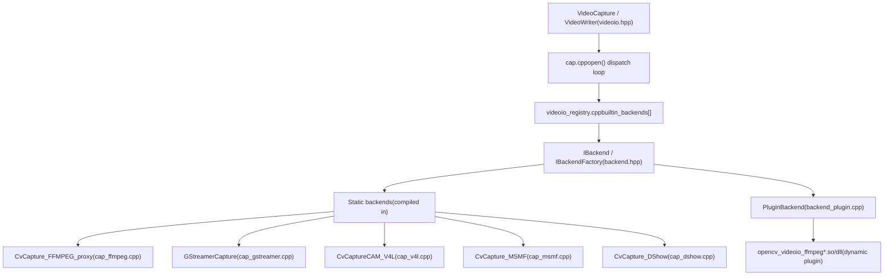

# 视频采集和后端架构

相关源文件

-   [doc/tutorials/app/highgui\_wayland\_ubuntu.markdown](https://github.com/opencv/opencv/blob/91c78f50/doc/tutorials/app/highgui_wayland_ubuntu.markdown?plain=1)
-   [modules/highgui/cmake/detect\_wayland.cmake](https://github.com/opencv/opencv/blob/91c78f50/modules/highgui/cmake/detect_wayland.cmake)
-   [modules/highgui/src/window\_wayland.cpp](https://github.com/opencv/opencv/blob/91c78f50/modules/highgui/src/window_wayland.cpp)
-   [modules/highgui/test/test\_gui.cpp](https://github.com/opencv/opencv/blob/91c78f50/modules/highgui/test/test_gui.cpp)
-   [modules/highgui/test/test\_precomp.hpp](https://github.com/opencv/opencv/blob/91c78f50/modules/highgui/test/test_precomp.hpp)
-   [modules/videoio/cmake/detect\_ffmpeg.cmake](https://github.com/opencv/opencv/blob/91c78f50/modules/videoio/cmake/detect_ffmpeg.cmake)
-   [modules/videoio/cmake/init.cmake](https://github.com/opencv/opencv/blob/91c78f50/modules/videoio/cmake/init.cmake)
-   [modules/videoio/cmake/plugin.cmake](https://github.com/opencv/opencv/blob/91c78f50/modules/videoio/cmake/plugin.cmake)
-   [modules/videoio/include/opencv2/videoio.hpp](https://github.com/opencv/opencv/blob/91c78f50/modules/videoio/include/opencv2/videoio.hpp)
-   [modules/videoio/include/opencv2/videoio/registry.hpp](https://github.com/opencv/opencv/blob/91c78f50/modules/videoio/include/opencv2/videoio/registry.hpp)
-   [modules/videoio/include/opencv2/videoio/videoio\_c.h](https://github.com/opencv/opencv/blob/91c78f50/modules/videoio/include/opencv2/videoio/videoio_c.h)
-   [modules/videoio/misc/plugin\_ffmpeg/CMakeLists.txt](https://github.com/opencv/opencv/blob/91c78f50/modules/videoio/misc/plugin_ffmpeg/CMakeLists.txt)
-   [modules/videoio/misc/plugin\_gstreamer/CMakeLists.txt](https://github.com/opencv/opencv/blob/91c78f50/modules/videoio/misc/plugin_gstreamer/CMakeLists.txt)
-   [modules/videoio/src/backend.hpp](https://github.com/opencv/opencv/blob/91c78f50/modules/videoio/src/backend.hpp)
-   [modules/videoio/src/backend\_plugin.cpp](https://github.com/opencv/opencv/blob/91c78f50/modules/videoio/src/backend_plugin.cpp)
-   [modules/videoio/src/backend\_static.cpp](https://github.com/opencv/opencv/blob/91c78f50/modules/videoio/src/backend_static.cpp)
-   [modules/videoio/src/cap.cpp](https://github.com/opencv/opencv/blob/91c78f50/modules/videoio/src/cap.cpp)
-   [modules/videoio/src/cap\_dc1394\_v2.cpp](https://github.com/opencv/opencv/blob/91c78f50/modules/videoio/src/cap_dc1394_v2.cpp)
-   [modules/videoio/src/cap\_dshow.cpp](https://github.com/opencv/opencv/blob/91c78f50/modules/videoio/src/cap_dshow.cpp)
-   [modules/videoio/src/cap\_dshow.hpp](https://github.com/opencv/opencv/blob/91c78f50/modules/videoio/src/cap_dshow.hpp)
-   [modules/videoio/src/cap\_ffmpeg.cpp](https://github.com/opencv/opencv/blob/91c78f50/modules/videoio/src/cap_ffmpeg.cpp)
-   [modules/videoio/src/cap\_ffmpeg\_impl.hpp](https://github.com/opencv/opencv/blob/91c78f50/modules/videoio/src/cap_ffmpeg_impl.hpp)
-   [modules/videoio/src/cap\_gphoto2.cpp](https://github.com/opencv/opencv/blob/91c78f50/modules/videoio/src/cap_gphoto2.cpp)
-   [modules/videoio/src/cap\_gstreamer.cpp](https://github.com/opencv/opencv/blob/91c78f50/modules/videoio/src/cap_gstreamer.cpp)
-   [modules/videoio/src/cap\_interface.hpp](https://github.com/opencv/opencv/blob/91c78f50/modules/videoio/src/cap_interface.hpp)
-   [modules/videoio/src/cap\_mjpeg\_decoder.cpp](https://github.com/opencv/opencv/blob/91c78f50/modules/videoio/src/cap_mjpeg_decoder.cpp)
-   [modules/videoio/src/cap\_mjpeg\_encoder.cpp](https://github.com/opencv/opencv/blob/91c78f50/modules/videoio/src/cap_mjpeg_encoder.cpp)
-   [modules/videoio/src/cap\_msmf.cpp](https://github.com/opencv/opencv/blob/91c78f50/modules/videoio/src/cap_msmf.cpp)
-   [modules/videoio/src/cap\_msmf.hpp](https://github.com/opencv/opencv/blob/91c78f50/modules/videoio/src/cap_msmf.hpp)
-   [modules/videoio/src/cap\_v4l.cpp](https://github.com/opencv/opencv/blob/91c78f50/modules/videoio/src/cap_v4l.cpp)
-   [modules/videoio/src/cap\_ximea.cpp](https://github.com/opencv/opencv/blob/91c78f50/modules/videoio/src/cap_ximea.cpp)
-   [modules/videoio/src/precomp.hpp](https://github.com/opencv/opencv/blob/91c78f50/modules/videoio/src/precomp.hpp)
-   [modules/videoio/src/videoio\_registry.cpp](https://github.com/opencv/opencv/blob/91c78f50/modules/videoio/src/videoio_registry.cpp)
-   [modules/videoio/test/test\_audio.cpp](https://github.com/opencv/opencv/blob/91c78f50/modules/videoio/test/test_audio.cpp)
-   [modules/videoio/test/test\_camera.cpp](https://github.com/opencv/opencv/blob/91c78f50/modules/videoio/test/test_camera.cpp)
-   [modules/videoio/test/test\_ffmpeg.cpp](https://github.com/opencv/opencv/blob/91c78f50/modules/videoio/test/test_ffmpeg.cpp)
-   [modules/videoio/test/test\_gstreamer.cpp](https://github.com/opencv/opencv/blob/91c78f50/modules/videoio/test/test_gstreamer.cpp)
-   [modules/videoio/test/test\_microphone.cpp](https://github.com/opencv/opencv/blob/91c78f50/modules/videoio/test/test_microphone.cpp)
-   [modules/videoio/test/test\_orientation.cpp](https://github.com/opencv/opencv/blob/91c78f50/modules/videoio/test/test_orientation.cpp)
-   [modules/videoio/test/test\_precomp.hpp](https://github.com/opencv/opencv/blob/91c78f50/modules/videoio/test/test_precomp.hpp)
-   [modules/videoio/test/test\_v4l2.cpp](https://github.com/opencv/opencv/blob/91c78f50/modules/videoio/test/test_v4l2.cpp)
-   [modules/videoio/test/test\_video\_io.cpp](https://github.com/opencv/opencv/blob/91c78f50/modules/videoio/test/test_video_io.cpp)
-   [samples/cpp/videocapture\_audio.cpp](https://github.com/opencv/opencv/blob/91c78f50/samples/cpp/videocapture_audio.cpp)
-   [samples/cpp/videocapture\_audio\_combination.cpp](https://github.com/opencv/opencv/blob/91c78f50/samples/cpp/videocapture_audio_combination.cpp)
-   [samples/cpp/videocapture\_microphone.cpp](https://github.com/opencv/opencv/blob/91c78f50/samples/cpp/videocapture_microphone.cpp)

本页介绍了`opencv_videoio`模块：`VideoCapture`和`VideoWriter`公共类、内部后端抽象和注册表、插件加载系统以及主要的特定于平台的捕获后端。关于图像文件的读写（JPEG、PNG等），请参见[Image File I/O and Codec System](/opencv/opencv/7.1-image-file-io-and-codec-system)。对于视频帧的 GUI 显示，请参阅[Window Management and Multi-Backend GUI](/opencv/opencv/10.1-window-management-and-multi-backend-gui)。

---

＃＃ 概述

`videoio`模块提供了一个统一的API，用于读取视频文件、网络流和摄像头，以及写入编码视频。在内部，它被构造为后端注册表 - 在开放时，公共 `VideoCapture` 或 `VideoWriter` 对象从编译或动态加载的后端的优先级列表中进行选择，每个后端都实现一个通用的 C++ 接口。

**架构图：公共API→注册中心→后端**


来源：[modules/videoio/src/cap.cpp127-236](https://github.com/opencv/opencv/blob/91c78f50/modules/videoio/src/cap.cpp#L127-L236)[modules/videoio/src/videoio\_registry.cpp66-130](https://github.com/opencv/opencv/blob/91c78f50/modules/videoio/src/videoio_registry.cpp#L66-L130)[modules/videoio/src/backend\_plugin.cpp40-75](https://github.com/opencv/opencv/blob/91c78f50/modules/videoio/src/backend_plugin.cpp#L40-L75)

---

## 公共API

### 视频捕捉

[modules/videoio/include/opencv2/videoio.hpp](https://github.com/opencv/opencv/blob/91c78f50/modules/videoio/include/opencv2/videoio.hpp) `VideoCapture` 中定义的是阅读框架的主要类。它拥有一个由所选后端创建和拥有的`Ptr<IVideoCapture> icap`。

关键构造函数：

- `VideoCapture(const String& filename, int apiPreference = CAP_ANY)`
- `VideoCapture(int index, int apiPreference = CAP_ANY)`
- `VideoCapture(const Ptr<IStreamReader>& source, int apiPreference, const std::vector<int>& params)` — 用于从内存流中读取

关键方法：

|方法|描述|
| --- | --- |
|`open()`|打开文件、URL 或相机索引|
|`isOpened()`|如果后端创建成功，则返回 true|
|`grab()`|提高捕获时钟；速度快，不解码|
|`retrieve(Mat&, int channel=0)`|解码并返回抓取的帧|
|`read(Mat&)`|组合`grab()`和`retrieve()`|
|`get(int propId)`|读取 `CAP_PROP_*` 属性|
|`set(int propId, double value)`|写入 `CAP_PROP_*` 属性|
|`release()`|销毁后端并释放资源|

### 视频作家

同样在 [modules/videoio/include/opencv2/videoio.hpp](https://github.com/opencv/opencv/blob/91c78f50/modules/videoio/include/opencv2/videoio.hpp) `VideoWriter` 中包含一个 `Ptr<IVideoWriter> iwriter`。 `open()`的关键参数是文件名、`fourcc`、`fps`和`frameSize`。 `std::vector<int>` params 参数在构造时传递 `VIDEOWRITER_PROP_*` 键值对。

来源：[modules/videoio/include/opencv2/videoio.hpp70-240](https://github.com/opencv/opencv/blob/91c78f50/modules/videoio/include/opencv2/videoio.hpp#L70-L240)[modules/videoio/src/cap.cpp70-110](https://github.com/opencv/opencv/blob/91c78f50/modules/videoio/src/cap.cpp#L70-L110)

---

## 后端注册表

### `VideoCaptureAPIs` 枚举

每个后端都有一个在 `VideoCaptureAPIs` 枚举中声明的唯一整数标识符。将 `CAP_ANY = 0` 传递到 `open()` 会导致调度程序按优先级顺序尝试所有适用的后端。

|持续的|价值|后端|
| --- | --- | --- |
|`CAP_ANY`| 0 |自动检测|
|`CAP_V4L` / `CAP_V4L2`| 200 |Video4Linux2 (Linux)|
|`CAP_DSHOW`| 700 |DirectShow（Windows）|
|`CAP_AVFOUNDATION`| 1200 |AVFoundation (macOS/iOS)|
|`CAP_MSMF`| 1400 |微软媒体基金会|
|`CAP_GSTREAMER`| 1800 |GStreamer|
|`CAP_FFMPEG`| 1900 |FFmpeg|
|`CAP_IMAGES`| 2000 |OpenCV 图像序列|
|`CAP_OPENCV_MJPEG`| 2200 |内置MJPEG|
|`CAP_INTEL_MFX`| 2300 |英特尔MediaSDK/oneVPL|

来源：[modules/videoio/include/opencv2/videoio.hpp92-129](https://github.com/opencv/opencv/blob/91c78f50/modules/videoio/include/opencv2/videoio.hpp#L92-L129)

### `builtin_backends[]`

[modules/videoio/src/videoio\_registry.cpp66](https://github.com/opencv/opencv/blob/91c78f50/modules/videoio/src/videoio_registry.cpp#L66-L66)中的静态数组`builtin_backends[]`列出了每个后端及其`BackendMode`标志（`MODE_CAPTURE_BY_FILENAME`，`MODE_CAPTURE_BY_INDEX`，`MODE_CAPTURE_BY_STREAM`，`MODE_WRITER`中的一个或多个）。没有所需编译时 `HAVE_*` 符号的后端有条件地被 `DECLARE_DYNAMIC_BACKEND` 替换，这会延迟加载到插件系统。

数组中的优先级（源代码中记录的注释）：

1. 多平台库：FFmpeg、GStreamer、Intel MFX
2. 特定于平台的 SDK：AVFOUNDATION、MSMF/DSHOW、V4L/V4L2
3. RGB-D传感器：OpenNI、RealSense、OBSensor
4. 基于文件的后备：图像序列、MJPEG
5. 专业SDK：XIMEA、Aravis、uEye、gPhoto2

来源：[modules/videoio/src/videoio\_registry.cpp58-130](https://github.com/opencv/opencv/blob/91c78f50/modules/videoio/src/videoio_registry.cpp#L58-L130)

### `cap.cpp` 发货

**后端选择流程**

> **[美人鱼序列]**
> *(图表结构无法解析)*

来源：[modules/videoio/src/cap.cpp117-237](https://github.com/opencv/opencv/blob/91c78f50/modules/videoio/src/cap.cpp#L117-L237)

---

## 内部接口

所有后端都实现两个内部抽象类之一，在[modules/videoio/src/cap\_interface.hpp](https://github.com/opencv/opencv/blob/91c78f50/modules/videoio/src/cap_interface.hpp)中定义

### `IVideoCapture`

```
virtual bool grabFrame()
virtual bool retrieveFrame(int channel, OutputArray)
virtual double getProperty(int propId) const
virtual bool setProperty(int propId, double value)
virtual bool isOpened() const
virtual int getCaptureDomain()
```
### `IVideoWriter`

```
virtual bool open(filename, fourcc, fps, frameSize, params)
virtual bool isOpened() const
virtual void write(InputArray)
virtual bool set(int propId, double value)
virtual double get(int propId) const
```
### `VideoCaptureParameters`

`VideoParameters` / `VideoCaptureParameters`（也在 [modules/videoio/src/cap\_interface.hpp](https://github.com/opencv/opencv/blob/91c78f50/modules/videoio/src/cap_interface.hpp) 中）将平面 `std::vector<int>` 键值参数向量包装到一个类型化访问器中，该访问器跟踪消耗了哪些参数。后端调用`params.get<T>(CAP_PROP_*)`和`params.warnUnusedParameters()`来检测不支持的选项。

**接口层次图**


来源： [modules/videoio/src/cap\_interface.hpp40-120](https://github.com/opencv/opencv/blob/91c78f50/modules/videoio/src/cap_interface.hpp#L40-L120) [modules/videoio/src/cap\_ffmpeg.cpp68-88](https://github.com/opencv/opencv/blob/91c78f50/modules/videoio/src/cap_ffmpeg.cpp#L68-L88) [modules/videoio/src/cap\_gstreamer.cpp323-406](https://github.com/opencv/opencv/blob/91c78f50/modules/videoio/src/cap_gstreamer.cpp#L323-L406) [modules/videoio/src/cap\_v4l.cpp364-444](https://github.com/opencv/opencv/blob/91c78f50/modules/videoio/src/cap_v4l.cpp#L364-L444)

---

## 插件系统

当后端注册到`DECLARE_DYNAMIC_BACKEND`时，`createPluginBackendFactory()`返回一个`PluginBackend`工厂（[modules/videoio/src/backend\_plugin.cpp40](https://github.com/opencv/opencv/blob/91c78f50/modules/videoio/src/backend_plugin.cpp#L40-L40)）。第一次使用时，它：

1. 搜索与后端名称模式匹配的共享库的库路径（例如 `libopencv_videoio_ffmpeg*.so`）。
2. 通过`plugin_loader.private.hpp`呼叫`dlopen` / `LoadLibrary`。
3. 解析 `opencv_videoio_capture_plugin_init_v1` 以获取版本化的 ABI 结构。
4. 验证ABI/API版本兼容性。
5. 缓存加载的捕获和写入器 API 表。

入口点符号 `opencv_videoio_capture_plugin_init_v1` 返回一个结构体，其 `v0.id` 字段标识插件服务的 `VideoCaptureAPIs` 值。作为单独的共享库构建的插件（例如 Windows 上预构建的 FFmpeg 包装器）遵循相同的合同。

来源：[modules/videoio/src/backend\_plugin.cpp44-75](https://github.com/opencv/opencv/blob/91c78f50/modules/videoio/src/backend_plugin.cpp#L44-L75)[modules/videoio/cmake/plugin.cmake1-10](https://github.com/opencv/opencv/blob/91c78f50/modules/videoio/cmake/plugin.cmake#L1-L10)

---

## 主要后端

### FFmpeg (`CAP_FFMPEG`)

**文件：** [modules/videoio/src/cap\_ffmpeg.cpp](https://github.com/opencv/opencv/blob/91c78f50/modules/videoio/src/cap_ffmpeg.cpp) [modules/videoio/src/cap\_ffmpeg\_impl.hpp](https://github.com/opencv/opencv/blob/91c78f50/modules/videoio/src/cap_ffmpeg_impl.hpp)

FFmpeg 后端是所有平台上文件和网络流访问的主要后端。面向公众的代理是`CvCapture_FFMPEG_proxy`，它包装了内部的`CvCapture_FFMPEG`结构。在 Windows 上，FFmpeg 库作为预构建的插件 DLL 提供；在Linux/macOS上，当设置`HAVE_FFMPEG`时，它们直接链接。

**`CvCapture_FFMPEG`的关键内部结构：**

|场地|类型|角色|
| --- | --- | --- |
|`ic`|`AVFormatContext*`|容器级解复用器上下文|
|`context`|`AVCodecContext*`|每个流解码器上下文|
|`picture`|`AVFrame*`|解码后的原始帧|
|`img_convert_ctx`|`SwsContext*`|libswscale color/pixel 格式转换器|
|`video_stream`|`int`|所选视频流的索引|
|`rawMode`|`bool`|如果为 true，则跳过解码（仅限解复用器）|
|`va_type`|`VideoAccelerationType`|请求的硬件加速类型|
|`interrupt_metadata`|`AVInterruptCallbackMetadata`|open/read 的超时跟踪|

**Open/Read流量：**

> **[美人鱼序列]**
> *(图表结构无法解析)*

**显着的功能：**

- 原始解复用模式：设置`CAP_PROP_FORMAT = -1`以抑制解码并接收压缩数据包作为`CV_8UC1`行。
- 硬件加速：将`CAP_PROP_HW_ACCELERATION`设置为`VideoAccelerationType`值。需要 `LIBAVUTIL_VERSION_MAJOR >= 56` (FFmpeg 4.0+) 和 `cap_ffmpeg_hw.hpp` 助手。
- Open/read超时：由`CAP_PROP_OPEN_TIMEOUT_MSEC`和`CAP_PROP_READ_TIMEOUT_MSEC`控制，通过`_opencv_ffmpeg_interrupt_callback`实现。
- 线程数：`CAP_PROP_N_THREADS`或`OPENCV_FFMPEG_THREADS`环境变量。
- RTSP：默认为 TCP 传输 (`rtsp_flags=prefer_tcp`)。通过`OPENCV_FFMPEG_CAPTURE_OPTIONS`覆盖。

来源：[modules/videoio/src/cap\_ffmpeg\_impl.hpp538-680](https://github.com/opencv/opencv/blob/91c78f50/modules/videoio/src/cap_ffmpeg_impl.hpp#L538-L680)[modules/videoio/src/cap\_ffmpeg.cpp68-120](https://github.com/opencv/opencv/blob/91c78f50/modules/videoio/src/cap_ffmpeg.cpp#L68-L120)

---

### GStreamer (`CAP_GSTREAMER`)

**文件：** [modules/videoio/src/cap\_gstreamer.cpp](https://github.com/opencv/opencv/blob/91c78f50/modules/videoio/src/cap_gstreamer.cpp)

`GStreamerCapture` 构建和控制 GStreamer 管道。 `gst_initializer`单例（在`gst_initializer::init()`中使用`static`本地）每个进程调用一次`gst_init_check()`。

对于file/URL捕获，该类构造了一个`uridecodebin ! videoconvert ! appsink`管道。对于相机索引，它构造 `v4l2src` 或等效的。自定义管道字符串可以直接作为文件名参数传递。

音频与视频同时支持：单独的 `audiopipeline` 与 `appsink` 并行运行。 `CAP_PROP_AUDIO_STREAM` 和相关属性配置要附加的流。

关键领域：

|场地|类型|角色|
| --- | --- | --- |
|`pipeline`|`GSafePtr<GstElement>`|主要 GStreamer 管道元素|
|`sink`|`GSafePtr<GstElement>`|`appsink` 用于视频帧|
|`audiosink`|`GSafePtr<GstElement>`|`appsink` 用于音频样本|
|`caps`|`GSafePtr<GstCaps>`|协商视频上限|
|`openTimeout`|`GstClockTime`|管道打开超时前的纳秒数|

来源：[modules/videoio/src/cap\_gstreamer.cpp323-442](https://github.com/opencv/opencv/blob/91c78f50/modules/videoio/src/cap_gstreamer.cpp#L323-L442)[modules/videoio/src/cap\_gstreamer.cpp218-283](https://github.com/opencv/opencv/blob/91c78f50/modules/videoio/src/cap_gstreamer.cpp#L218-L283)

---

### V4L2（`CAP_V4L2`，Linux）

**文件：** [modules/videoio/src/cap\_v4l.cpp](https://github.com/opencv/opencv/blob/91c78f50/modules/videoio/src/cap_v4l.cpp)

`CvCaptureCAM_V4L`通过V4L2内核API打开`/dev/video<N>`。它使用内存映射的I/O（`mmap`）进行零复制缓冲区管理。

**捕获缓冲区生命周期：**

> **[美人鱼序列]**
> *(图表结构无法解析)*

**像素格式探测顺序** (`autosetup_capture_mode_v4l2`): `BGR24 → RGB24 → YVU420 → YUV420 → YUV411P → YUYV → UYVY → NV12 → NV21 → SBGGR8 → SGBRG8 → SGRBG8 → XBGR32 → ABGR32 → SN9C10X → MJPEG (if HAVE_JPEG) → Y16 → Y12 → Y10 → GREY`

`CAP_PROP_BRIGHTNESS`、`CAP_PROP_CONTRAST`、`CAP_PROP_SATURATION`、`CAP_PROP_GAIN`和`CAP_PROP_EXPOSURE`等属性通过`controlInfo()`映射到V4L2控制ID。默认情况下，范围归一化（映射到 PH7）处于启用状态，与 OpenCV 3.x 行为相匹配；设置 `CAP_PROP_MODE = 0` 使用原始 V4L2 值。\\n\\nSources#LNaN-LNaN" NaN file-path="0, 1)`) is on by default, matching OpenCV 3.x behavior; set` CAP\_PROP\_MODE = 0\` 使用原始 V4L2 值。\\n\\nSources">Hii [modules/videoio/src/cap\_v4l.cpp585-640](https://github.com/opencv/opencv/blob/91c78f50/modules/videoio/src/cap_v4l.cpp#L585-L640)

---

### 微软媒体基金会（`CAP_MSMF`，Windows）

**文件：** [modules/videoio/src/cap\_msmf.cpp](https://github.com/opencv/opencv/blob/91c78f50/modules/videoio/src/cap_msmf.cpp)

MSMF 后端使用带有异步回调的 `IMFSourceReader` API。 `SourceReaderCB`实现`IMFSourceReaderCallback`并对传入的`IMFSample`对象进行排队（最多`MSMF_READER_MAX_QUEUE_SIZE = 3`）。主线程通过 `SourceReaderCB::Wait()` 阻塞 Win32 事件。

`FormatStorage` 枚举所有流中来自源读取器的所有 `IMFMediaType` 对象。 `MediaType::VideoIsBetterThan()` / `AudioIsBetterThan()` 选择与请求的分辨率和帧速率最接近的匹配。

使用`HAVE_MSMF_DXVA`编译时可以使用硬件加速：`MFCreateDXGIDeviceManager`动态加载（通过`mfplat.dll`）以避免Windows 7上的加载失败。环境变量`OPENCV_VIDEOIO_MSMF_ENABLE_HW_TRANSFORMS`（在`videoio.hpp`中记录）控制是否启用硬件变换加速。

来源：[modules/videoio/src/cap\_msmf.cpp408-590](https://github.com/opencv/opencv/blob/91c78f50/modules/videoio/src/cap_msmf.cpp#L408-L590)[modules/videoio/src/cap\_msmf.cpp55-73](https://github.com/opencv/opencv/blob/91c78f50/modules/videoio/src/cap_msmf.cpp#L55-L73)

---

### DirectShow（`CAP_DSHOW`，Windows）

**文件：** [modules/videoio/src/cap\_dshow.cpp](https://github.com/opencv/opencv/blob/91c78f50/modules/videoio/src/cap_dshow.cpp)

DirectShow 后端封装了 Theodore Watson 的 `videoInput` 库。它是传统的 Windows 相机捕获路径，现已基本被 MSMF 取代。它出现在MSMF之后的`builtin_backends[]`中，优先级较低。

---

## `CAP_PROP_*` 和 `VIDEOWRITER_PROP_*` 参考

### 常见`VideoCaptureProperties`

|持续的|整数|R/W|描述|
| --- | --- | --- | --- |
|`CAP_PROP_POS_MSEC`| 0 |R/W|视频中的位置（毫秒）|
|`CAP_PROP_POS_FRAMES`| 1 |R/W|从0开始的帧索引；寻找目标|
|`CAP_PROP_FRAME_WIDTH`| 3 |R/W|帧宽度（以像素为单位）|
|`CAP_PROP_FRAME_HEIGHT`| 4 |R/W|框架高度（以像素为单位）|
|`CAP_PROP_FPS`| 5 |右|帧率|
|`CAP_PROP_FOURCC`| 6 |右|编解码器四字符代码|
|`CAP_PROP_FRAME_COUNT`| 7 |右|文件中的总帧数|
|`CAP_PROP_FORMAT`| 8 |R/W|垫子类型；设置 `-1` 为原始解复用模式|
|`CAP_PROP_CONVERT_RGB`| 16 |打开|如果为真则解码为 BGR (FFmpeg/GStreamer)|
|`CAP_PROP_BACKEND`| 42 |右|活性`VideoCaptureAPIs`值|
|`CAP_PROP_BITRATE`| 47 |右|视频比特率 (kbits/s) — FFmpeg|
|`CAP_PROP_ORIENTATION_AUTO`| 49 |R/W|自动旋转每个流元数据|
|`CAP_PROP_HW_ACCELERATION`| 50 |打开|`VideoAccelerationType`|
|`CAP_PROP_HW_DEVICE`| 51 |打开|GPU设备索引|
|`CAP_PROP_OPEN_TIMEOUT_MSEC`| 53 |打开|连接超时 — FFmpeg/GStreamer|
|`CAP_PROP_READ_TIMEOUT_MSEC`| 54 |打开|读取超时 — FFmpeg/GStreamer|
|`CAP_PROP_AUDIO_STREAM`| 58 |打开|音频流索引； `-1` 禁用|
|`CAP_PROP_AUDIO_SAMPLES_PER_SECOND`| 62 |open/R|音频采样率|
|`CAP_PROP_N_THREADS`| 70 |打开|解码器线程数 — FFmpeg|

### `VideoWriterProperties`

|持续的|整数|描述|
| --- | --- | --- |
|`VIDEOWRITER_PROP_QUALITY`| 1 |编码质量 0–100|
|`VIDEOWRITER_PROP_IS_COLOR`| 4 |颜色编码非零|
|`VIDEOWRITER_PROP_DEPTH`| 5 |位深度（默认`CV_8U`）|
|`VIDEOWRITER_PROP_HW_ACCELERATION`| 6 |`VideoAccelerationType`|
|`VIDEOWRITER_PROP_RAW_VIDEO`| 9 |传递预编码数据包 — FFmpeg|
|`VIDEOWRITER_PROP_KEY_INTERVAL`| 10 |原始模式下的关键帧间隔|

来源：[modules/videoio/include/opencv2/videoio.hpp138-240](https://github.com/opencv/opencv/blob/91c78f50/modules/videoio/include/opencv2/videoio.hpp#L138-L240)

---

## 硬件加速

`VideoAccelerationType`（在`videoio.hpp`中定义）是`CAP_PROP_HW_ACCELERATION`和`VIDEOWRITER_PROP_HW_ACCELERATION`使用的共享枚举。

|价值|持续的|描述|
| --- | --- | --- |
| 0 |`VIDEO_ACCELERATION_NONE`|仅软件|
| 1 |`VIDEO_ACCELERATION_ANY`|让后端选择最佳可用的|
| 2 |`VIDEO_ACCELERATION_D3D11`|Direct3D 11 (DXVA2)|
| 3 |`VIDEO_ACCELERATION_VAAPI`|VA-API (Linux)|
| 4 |`VIDEO_ACCELERATION_MFX`|英特尔 MediaSDK / oneVPL|
| 5 |`VIDEO_ACCELERATION_DRM`|DRM/KMS（树莓派V4）|

在 FFmpeg 后端，`VIDEO_ACCELERATION_ANY` 导致`cap_ffmpeg_hw.hpp` 通过`av_hwdevice_iterate_types()` 探测硬件解码器。当设置`CAP_PROP_HW_ACCELERATION_USE_OPENCL`时，后端会创建一个附加到硬件设备上下文的OpenCL上下文，以允许零拷贝传输到`UMat`（请参阅[OpenCL Acceleration](/opencv/opencv/3.2-opencl-acceleration-and-transparent-gpu-execution)）。

来源：[modules/videoio/include/opencv2/videoio.hpp256-269](https://github.com/opencv/opencv/blob/91c78f50/modules/videoio/include/opencv2/videoio.hpp#L256-L269)[modules/videoio/src/cap\_ffmpeg\_impl.hpp106-178](https://github.com/opencv/opencv/blob/91c78f50/modules/videoio/src/cap_ffmpeg_impl.hpp#L106-L178)

---

## 音频支持

音频捕获主要在 GStreamer 和 MSMF 后端实现。相关的`CAP_PROP_*`常数：

- `CAP_PROP_AUDIO_STREAM = 58` — 选择要捕获的音频流索引；通过 `-1` 禁用。
- `CAP_PROP_AUDIO_POS = 59` — 最后抓取的音频片段的样本位置。
- `CAP_PROP_AUDIO_SHIFT_NSEC = 60` — 音频和视频流开始时间之间的偏移。
- `CAP_PROP_AUDIO_DATA_DEPTH = 61` — 示例格式（`CV_16S`、`CV_32F` 等）。
- `CAP_PROP_AUDIO_SAMPLES_PER_SECOND = 62` — 采样率（默认 44100）。
- `CAP_PROP_AUDIO_BASE_INDEX = 63` — `retrieve()` 调用的通道索引偏移。
- `CAP_PROP_AUDIO_TOTAL_CHANNELS = 64` — 所选流中的音频通道数。

音频数据通过`VideoCapture::retrieve(Mat&, channelIdx)`（其中`channelIdx >= CAP_PROP_AUDIO_BASE_INDEX`）检索。返回的 `Mat` 的每一行都保存一个音频帧作为单通道 `CV_16S` 或 `CV_32F` 数组。

来源：[modules/videoio/include/opencv2/videoio.hpp198-206](https://github.com/opencv/opencv/blob/91c78f50/modules/videoio/include/opencv2/videoio.hpp#L198-L206)[modules/videoio/src/cap\_gstreamer.cpp383-398](https://github.com/opencv/opencv/blob/91c78f50/modules/videoio/src/cap_gstreamer.cpp#L383-L398)[modules/videoio/test/test\_audio.cpp1-50](https://github.com/opencv/opencv/blob/91c78f50/modules/videoio/test/test_audio.cpp#L1-L50)

---

## 环境变量

无需重新编译即可调整多种行为：

|多变的|影响|描述|
| --- | --- | --- |
|`OPENCV_VIDEOIO_DEBUG`|`cap.cpp`|记录后端选择尝试|
|`OPENCV_VIDEOCAPTURE_DEBUG`|`cap.cpp`|相同，缩小范围以捕获|
|`OPENCV_FFMPEG_DEBUG`|`cap_ffmpeg_impl.hpp`|启用详细 FFmpeg 日志输出|
|`OPENCV_FFMPEG_LOGLEVEL`|`cap_ffmpeg_impl.hpp`|设置`av_log_set_level()`|
|`OPENCV_FFMPEG_IS_THREAD_SAFE`|`cap_ffmpeg_impl.hpp`|删除 OpenCV 互斥体；依赖 FFmpeg 锁定|
|`OPENCV_FFMPEG_THREADS`|`cap_ffmpeg_impl.hpp`|默认解码器线程数|
|`OPENCV_FFMPEG_CAPTURE_OPTIONS`|`cap_ffmpeg_impl.hpp`|以分号分隔的 `avdict` 选项（例如 \`rtsp\_transport|
|`OPENCV_VIDEOIO_GSTREAMER_CALL_DEINIT`|`cap_gstreamer.cpp`|退出时拨打`gst_deinit()`|
|`OPENCV_VIDEOIO_GSTREAMER_START_MAINLOOP`|`cap_gstreamer.cpp`|在线程中运行`GMainLoop`|
|`OPENCV_VIDEOIO_MSMF_ENABLE_HW_TRANSFORMS`|MSMF后端|0 禁用硬件 MF 变换|
|`OPENCV_VIDEOIO_V4L_RANGE_NORMALIZED`|`cap_v4l.cpp`|控制属性范围标准化|

来源：[modules/videoio/src/cap\_ffmpeg\_impl.hpp955-1062](https://github.com/opencv/opencv/blob/91c78f50/modules/videoio/src/cap_ffmpeg_impl.hpp#L955-L1062)[modules/videoio/src/cap\_gstreamer.cpp237-268](https://github.com/opencv/opencv/blob/91c78f50/modules/videoio/src/cap_gstreamer.cpp#L237-L268)[modules/videoio/src/cap.cpp49-51](https://github.com/opencv/opencv/blob/91c78f50/modules/videoio/src/cap.cpp#L49-L51)
