# 相机校准和 3D 视觉 (calib3d)

相关源文件

-   [modules/calib3d/include/opencv2/calib3d/calib3d.hpp](https://github.com/opencv/opencv/blob/91c78f50/modules/calib3d/include/opencv2/calib3d/calib3d.hpp)
-   [modules/calib3d/include/opencv2/calib3d/calib3d\_c.h](https://github.com/opencv/opencv/blob/91c78f50/modules/calib3d/include/opencv2/calib3d/calib3d_c.h)
-   [modules/calib3d/perf/perf\_translation2d.cpp](https://github.com/opencv/opencv/blob/91c78f50/modules/calib3d/perf/perf_translation2d.cpp)
-   [modules/calib3d/src/calibinit.cpp](https://github.com/opencv/opencv/blob/91c78f50/modules/calib3d/src/calibinit.cpp)
-   [modules/calib3d/src/calibration.cpp](https://github.com/opencv/opencv/blob/91c78f50/modules/calib3d/src/calibration.cpp)
-   [modules/calib3d/src/calibration\_base.cpp](https://github.com/opencv/opencv/blob/91c78f50/modules/calib3d/src/calibration_base.cpp)
-   [modules/calib3d/src/checkchessboard.cpp](https://github.com/opencv/opencv/blob/91c78f50/modules/calib3d/src/checkchessboard.cpp)
-   [modules/calib3d/src/chessboard.cpp](https://github.com/opencv/opencv/blob/91c78f50/modules/calib3d/src/chessboard.cpp)
-   [modules/calib3d/src/circlesgrid.cpp](https://github.com/opencv/opencv/blob/91c78f50/modules/calib3d/src/circlesgrid.cpp)
-   [modules/calib3d/src/circlesgrid.hpp](https://github.com/opencv/opencv/blob/91c78f50/modules/calib3d/src/circlesgrid.hpp)
-   [modules/calib3d/src/compat\_ptsetreg.cpp](https://github.com/opencv/opencv/blob/91c78f50/modules/calib3d/src/compat_ptsetreg.cpp)
-   [modules/calib3d/src/five-point.cpp](https://github.com/opencv/opencv/blob/91c78f50/modules/calib3d/src/five-point.cpp)
-   [modules/calib3d/src/fundam.cpp](https://github.com/opencv/opencv/blob/91c78f50/modules/calib3d/src/fundam.cpp)
-   [modules/calib3d/src/levmarq.cpp](https://github.com/opencv/opencv/blob/91c78f50/modules/calib3d/src/levmarq.cpp)
-   [modules/calib3d/src/precomp.hpp](https://github.com/opencv/opencv/blob/91c78f50/modules/calib3d/src/precomp.hpp)
-   [modules/calib3d/src/ptsetreg.cpp](https://github.com/opencv/opencv/blob/91c78f50/modules/calib3d/src/ptsetreg.cpp)
-   [modules/calib3d/src/stereo\_geom.cpp](https://github.com/opencv/opencv/blob/91c78f50/modules/calib3d/src/stereo_geom.cpp)
-   [modules/calib3d/src/triangulate.cpp](https://github.com/opencv/opencv/blob/91c78f50/modules/calib3d/src/triangulate.cpp)
-   [modules/calib3d/src/upnp.cpp](https://github.com/opencv/opencv/blob/91c78f50/modules/calib3d/src/upnp.cpp)
-   [modules/calib3d/src/upnp.h](https://github.com/opencv/opencv/blob/91c78f50/modules/calib3d/src/upnp.h)
-   [modules/calib3d/test/test\_cameracalibration.cpp](https://github.com/opencv/opencv/blob/91c78f50/modules/calib3d/test/test_cameracalibration.cpp)
-   [modules/calib3d/test/test\_cameracalibration\_badarg.cpp](https://github.com/opencv/opencv/blob/91c78f50/modules/calib3d/test/test_cameracalibration_badarg.cpp)
-   [modules/calib3d/test/test\_chesscorners.cpp](https://github.com/opencv/opencv/blob/91c78f50/modules/calib3d/test/test_chesscorners.cpp)
-   [modules/calib3d/test/test\_chesscorners\_badarg.cpp](https://github.com/opencv/opencv/blob/91c78f50/modules/calib3d/test/test_chesscorners_badarg.cpp)
-   [modules/calib3d/test/test\_chesscorners\_timing.cpp](https://github.com/opencv/opencv/blob/91c78f50/modules/calib3d/test/test_chesscorners_timing.cpp)
-   [modules/calib3d/test/test\_main.cpp](https://github.com/opencv/opencv/blob/91c78f50/modules/calib3d/test/test_main.cpp)
-   [modules/calib3d/test/test\_modelest.cpp](https://github.com/opencv/opencv/blob/91c78f50/modules/calib3d/test/test_modelest.cpp)
-   [modules/calib3d/test/test\_translation\_2d\_estimator.cpp](https://github.com/opencv/opencv/blob/91c78f50/modules/calib3d/test/test_translation_2d_estimator.cpp)
-   [modules/imgproc/include/opencv2/imgproc/imgproc.hpp](https://github.com/opencv/opencv/blob/91c78f50/modules/imgproc/include/opencv2/imgproc/imgproc.hpp)
-   [modules/imgproc/include/opencv2/imgproc/types\_c.h](https://github.com/opencv/opencv/blob/91c78f50/modules/imgproc/include/opencv2/imgproc/types_c.h)

`opencv_calib3d` 模块提供了用于使用现实世界相机和执行 3D 几何操作的算法和工具。它连接 2D 图像和 3D 世界几何，涵盖相机校准、镜头畸变校正（包括鱼眼）、立体视觉、基本矩阵估计和 3D 重建。

＃＃ 概述

calib3d 模块包含以下算法：

- 相机校准以确定内在和外在参数
- 消除镜头畸变，包括鱼眼畸变
- 立体校准和立体对应
- 图像之间的几何变换（单应性、基本矩阵）
- 姿态估计和 3D 重建

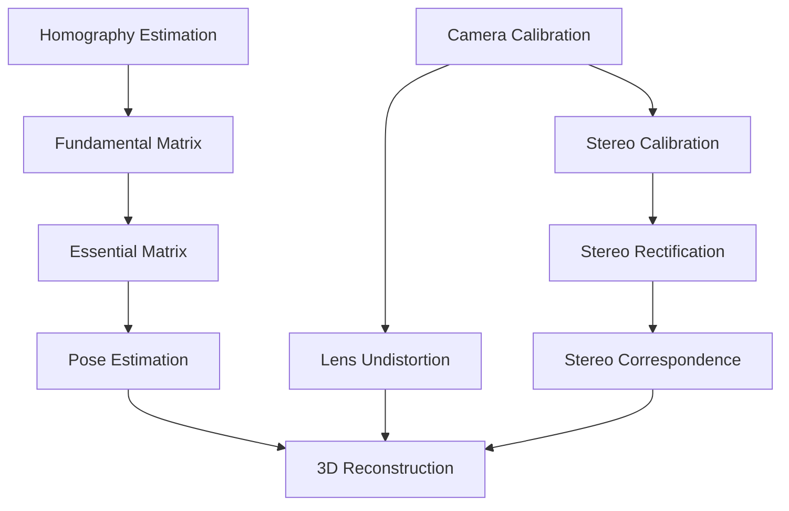
来源：[modules/calib3d/src/calibration.cpp1-622](https://github.com/opencv/opencv/blob/91c78f50/modules/calib3d/src/calibration.cpp#L1-L622)[modules/calib3d/src/fundam.cpp1-463](https://github.com/opencv/opencv/blob/91c78f50/modules/calib3d/src/fundam.cpp#L1-L463)[modules/calib3d/src/fisheye.cpp1-252](https://github.com/opencv/opencv/blob/91c78f50/modules/calib3d/src/fisheye.cpp#L1-L252)

### 模块源映射

下图将模块的主要源文件映射到其关键的导出代码实体，将功能区域链接到可搜索的代码符号。

**calib3d 源文件到关键代码实体**

```mermaid
flowchart TD
    cal["calibration.cppcalibration_base.cpp"]
    init["calibinit.cppchessboard.cppcirclesgrid.cpp"]
    geo["fundam.cppfive-point.cpp"]
    pose["triangulate.cppupnp.cpp"]
    opt["ptsetreg.cpplevmarq.cpp"]
    fish["fisheye.cpp"]
    f1["calibrateCamera()stereoCalibrate()projectPoints()undistortPoints()"]
    f2["findChessboardCorners()findChessboardCornersSB()ChessBoardDetectorfindCirclesGrid()"]
    f3["findHomography()findFundamentalMat()findEssentialMat()HomographyEstimatorCallback"]
    f4["triangulatePoints()correctMatches()upnp class"]
    f5["RANSACPointSetRegistratorLMeDSPointSetRegistratorCvLevMarq"]
    f6["fisheye::calibrate()fisheye::projectPoints()fisheye::undistortPoints()"]

    cal --> f1
    init --> f2
    geo --> f3
    pose --> f4
    opt --> f5
    fish --> f6
```
来源： [modules/calib3d/src/precomp.hpp49-51](https://github.com/opencv/opencv/blob/91c78f50/modules/calib3d/src/precomp.hpp#L49-L51) [modules/calib3d/src/calibration.cpp43-57](https://github.com/opencv/opencv/blob/91c78f50/modules/calib3d/src/calibration.cpp#L43-L57) [modules/calib3d/src/calibinit.cpp72-76](https://github.com/opencv/opencv/blob/91c78f50/modules/calib3d/src/calibinit.cpp#L72-L76) [modules/calib3d/src/fundam.cpp43-50](https://github.com/opencv/opencv/blob/91c78f50/modules/calib3d/src/fundam.cpp#L43-L50) [modules/calib3d/src/ptsetreg.cpp43-55](https://github.com/opencv/opencv/blob/91c78f50/modules/calib3d/src/ptsetreg.cpp#L43-L55)

该模块在三个子页面中详细记录：

- **第 8.1 页** — 相机模型和校准算法：针孔模型、畸变系数、`calibrateCamera`、模式检测（`ChessBoardDetector`、`findCirclesGrid`）、`CvLevMarq` 优化
- **第 8.2 页** — 姿势估计和几何变换：`solvePnP` 变体、`findHomography`、`findFundamentalMat`、`triangulatePoints`
- **第 8.3 页** — 立体视觉和鱼眼相机模型：`StereoBM`、`StereoSGBM`、鱼眼模型、立体校正

## 相机模型和校准基础设施

### 针孔相机模型

OpenCV通过`calibrateCameraInternal`函数实现带畸变系数的针孔相机模型。投影管道将 3D 世界点转换为 2D 图像坐标：

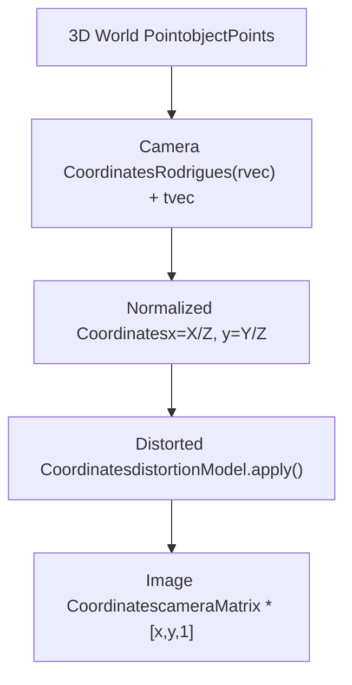
转换涉及到几个关键的数据结构：

- 用于校准数据的`objectPoints`和`imagePoints`数组
- `cameraMatrix` (3x3) 包含内在参数
- 带有畸变系数的`distCoeffs`向量
- `rvecs` 和 `tvecs` 用于每个视图的外部参数

### 校准矩阵结构

内在相机矩阵遵循标准形式：

$$ K = \\开始{bmatrix} f\_x & 0 & c\_x \\ 0 & f\_y & c\_y \\ 0 & 0 & 1 \\end{bmatrix} $$

`initIntrinsicParams2D` 函数使用从单应性检测到的消失点来计算这些参数的初始估计。

来源：[modules/calib3d/src/calibration.cpp61-140](https://github.com/opencv/opencv/blob/91c78f50/modules/calib3d/src/calibration.cpp#L61-L140)[modules/calib3d/src/calibration.cpp166-238](https://github.com/opencv/opencv/blob/91c78f50/modules/calib3d/src/calibration.cpp#L166-L238)

### 失真模型实现

OpenCV 通过校准标志和系数向量实现多种失真模型。 `calibrateCameraInternal`功能支持：

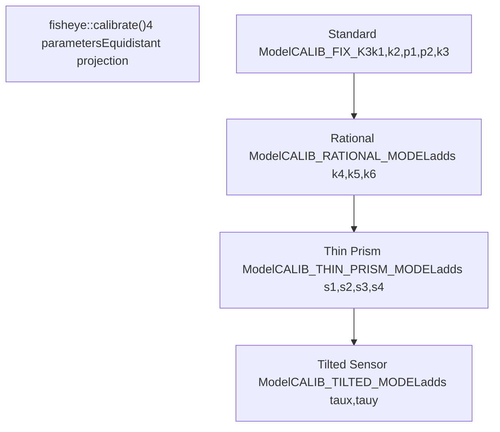
畸变模型选择由校准标志控制：

- 有理模型的`CALIB_FIX_K3`、`CALIB_FIX_K4`、`CALIB_FIX_K5`、`CALIB_FIX_K6`
- `CALIB_FIX_S1_S2_S3_S4` 适用于薄棱镜模型
- `CALIB_FIX_TAUX_TAUY` 适用于倾斜传感器型号

每个模型在校准期间都会通过校准实施的第 185-197 行中的检查进行验证。

来源：[modules/calib3d/src/calibration.cpp185-197](https://github.com/opencv/opencv/blob/91c78f50/modules/calib3d/src/calibration.cpp#L185-L197)[modules/calib3d/src/calibration.cpp275-282](https://github.com/opencv/opencv/blob/91c78f50/modules/calib3d/src/calibration.cpp#L275-L282)[modules/calib3d/src/fisheye.cpp88-106](https://github.com/opencv/opencv/blob/91c78f50/modules/calib3d/src/fisheye.cpp#L88-L106)

### 相机标定实现

校准管道是通过几个互连的组件实现的：

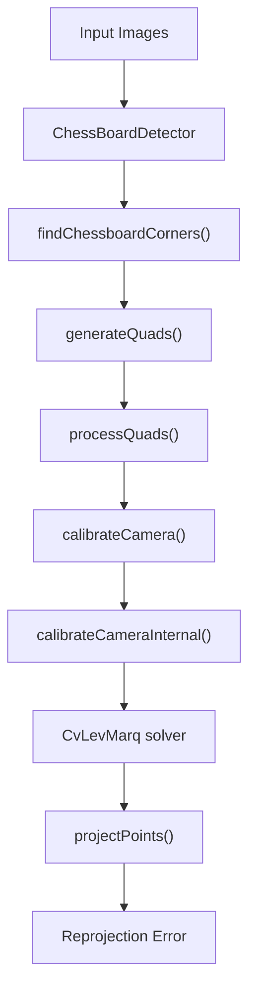
关键实现类及函数：

- **`ChessBoardDetector`**：使用基于四边形的角点检测来检测校准图案
- **`calibrateCameraInternal`**：实现张氏方法的核心校准算法
- **`CvLevMarq`**：用于非线性参数细化的 Levenberg-Marquardt 优化器
- **`findExtrinsicCameraParams2`**：每个校准视图的估计姿势
- **`initIntrinsicParams2D`**：计算初始参数估计

求解器使用 `CALIB_NINTRINSIC` (18) 个参数，并使用在 `projectPoints` 中计算的雅可比矩阵进行迭代细化来进行优化。

来源：[modules/calib3d/src/calibinit.cpp245-284](https://github.com/opencv/opencv/blob/91c78f50/modules/calib3d/src/calibinit.cpp#L245-L284)[modules/calib3d/src/calibration.cpp166-238](https://github.com/opencv/opencv/blob/91c78f50/modules/calib3d/src/calibration.cpp#L166-L238)[modules/calib3d/src/calibration.cpp337-406](https://github.com/opencv/opencv/blob/91c78f50/modules/calib3d/src/calibration.cpp#L337-L406)

## 鱼眼相机模型

`fisheye`命名空间使用等距投影模型为超广角镜头提供专门的算法。

### 鱼眼投影实现

鱼眼投影模型在`fisheye::projectPoints`中实现，具有独特的管道：

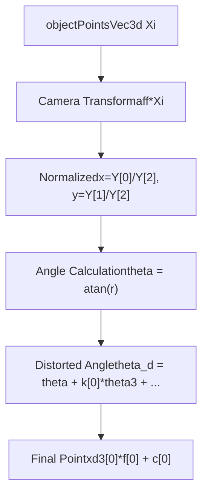
关键实施细节：

- **基于角度的畸变**：`theta_d = theta + k[0]*theta3 + k[1]*theta5 + k[2]*theta7 + k[3]*theta9`
- **等距模型**：`cdist = theta_d * inv_r`其中`inv_r = 1.0/r`
- **Alpha参数**：支持使用`xd3(xd1[0] + alpha*xd1[1], xd1[1])`进行倾斜校正
- **雅可比计算**：可选的雅可比矩阵，用于优化 `JacobianRow` 结构

与标准模型多达 14 个参数相比，鱼眼模型仅使用 4 个畸变参数。

来源：[modules/calib3d/src/fisheye.cpp126-157](https://github.com/opencv/opencv/blob/91c78f50/modules/calib3d/src/fisheye.cpp#L126-L157)[modules/calib3d/src/fisheye.cpp49-55](https://github.com/opencv/opencv/blob/91c78f50/modules/calib3d/src/fisheye.cpp#L49-L55)

### 鱼眼校准和去畸变功能

Fisheye 命名空间提供了专门的实现：

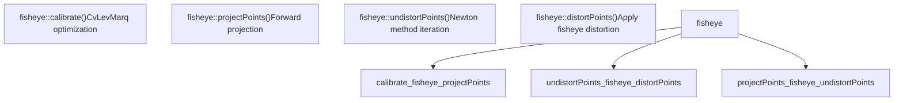
主要实施特点：

- **`fisheye::calibrate`**：使用`CvLevMarq`求解器和专门的鱼眼雅可比矩阵
- **`fisheye::undistortPoints`**：使用`TermCriteria`实现牛顿-拉夫森迭代以实现收敛
- **`fisheye::distortPoints`**：直接应用鱼眼畸变模型
- **视场处理**：将 theta 值剪辑到 `[-CV_PI/2, CV_PI/2]` 范围以实现收敛

去畸变过程使用迭代牛顿法和 theta 细化：

```
theta_fix = (theta * (1 + k0_theta2 + k1_theta4 + k2_theta6 + k3_theta8) - theta_d) /
            (1 + 3*k0_theta2 + 5*k1_theta4 + 7*k2_theta6 + 9*k3_theta8)
```
来源：[modules/calib3d/src/fisheye.cpp363-477](https://github.com/opencv/opencv/blob/91c78f50/modules/calib3d/src/fisheye.cpp#L363-L477)[modules/calib3d/src/fisheye.cpp449-467](https://github.com/opencv/opencv/blob/91c78f50/modules/calib3d/src/fisheye.cpp#L449-L467)

## 立体校准和多视图几何

### 立体声校准实施

`stereoCalibrateImpl` 功能使用同步优化提供立体校准：

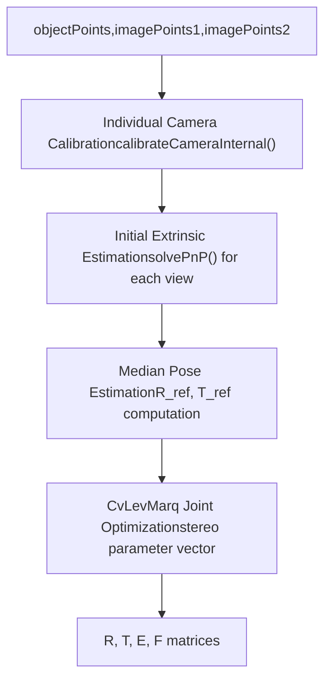
关键立体校准组件：

- **参数映射**：立体 Rt（6 个参数）+ 每个视图 Rt（6×n 个参数）+ 内在函数（2×18 个参数）
- **`composeRT`**：将单个相机姿势与立体变换相结合
- **联合优化**：使用`CvLevMarq`同时优化所有参数
- **约束处理**：支持 `CALIB_SAME_FOCAL_LENGTH`、`CALIB_FIX_INTRINSIC` 标志

立体声参数向量布局：

- 参数 0-5：摄像机间 R、T
- 参数 6+i×6：第 i 个视图的 Rt
- 参数 (nimages+1)×6+：两个相机的固有参数

来源：[modules/calib3d/src/calibration.cpp626-675](https://github.com/opencv/opencv/blob/91c78f50/modules/calib3d/src/calibration.cpp#L626-L675)[modules/calib3d/src/calibration.cpp742-802](https://github.com/opencv/opencv/blob/91c78f50/modules/calib3d/src/calibration.cpp#L742-L802)

### 立体校正和三角测量

校正变换立体图像对以简化对应匹配：

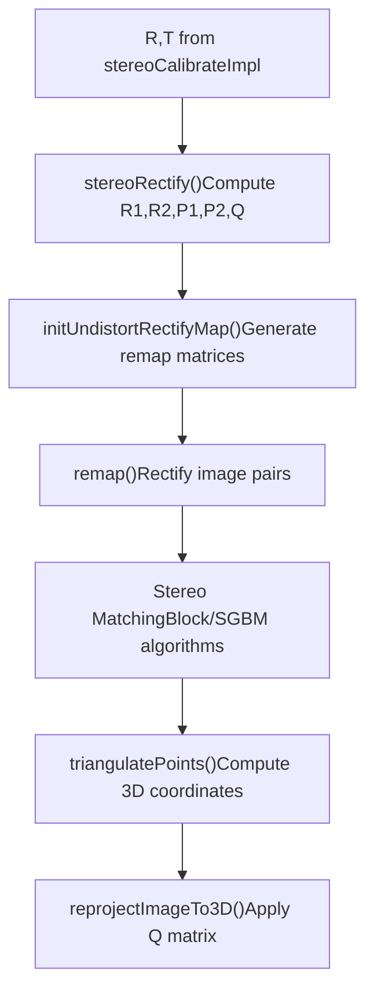
主要整改功能：

- **`stereoRectify`**：计算整流变换 R1、R2 和投影矩阵 P1、P2
- **视差到深度矩阵 Q**：启用视差图的 3D 重建
- **`triangulatePoints`**：从立体对应关系直接进行 3D 点重建

Q 矩阵支持视差到 3D 的转换：

```
[X Y Z W]ᵀ = Q × [x y d 1]ᵀ
```
来源：[modules/calib3d/src/triangulate.cpp43-147](https://github.com/opencv/opencv/blob/91c78f50/modules/calib3d/src/triangulate.cpp#L43-L147)

## 几何变换和多视图几何

### 单应性估计实现

`findHomography` 函数实现稳健的平面变换估计：

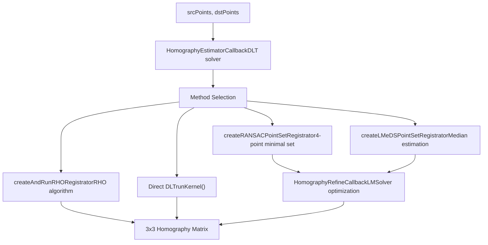
关键实施组件：

- **`HomographyEstimatorCallback`**：通过点标准化实现标准化 DLT
- **`checkSubset`**：验证 4 点配置的简并性
- **`computeError`**：计算 RANSAC 的重投影误差
- **`HomographyRefineCallback`**：使用 `LMSolver` 进行 Levenberg-Marquardt 细化

归一化过程缩放点以实现数值稳定性，然后对计算的单应性应用逆变换。

来源：[modules/calib3d/src/fundam.cpp74-219](https://github.com/opencv/opencv/blob/91c78f50/modules/calib3d/src/fundam.cpp#L74-L219)[modules/calib3d/src/fundam.cpp357-463](https://github.com/opencv/opencv/blob/91c78f50/modules/calib3d/src/fundam.cpp#L357-L463)

### 基本矩阵估计

基本矩阵估计为极线几何提供了多种算法方法：

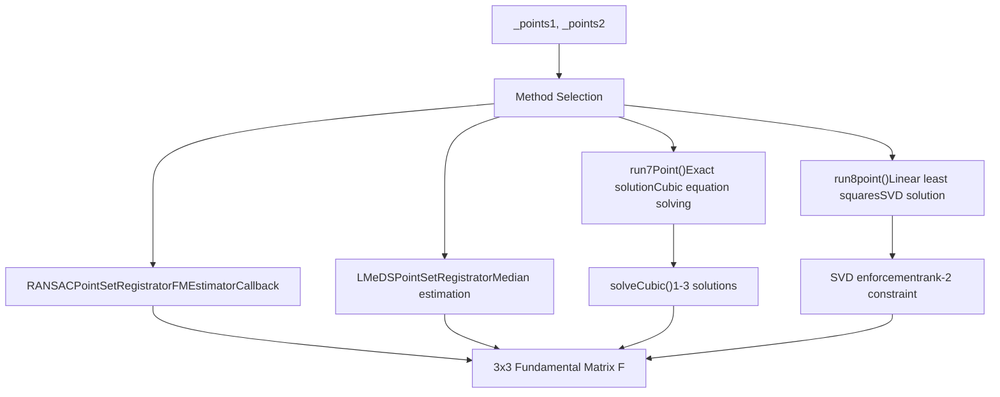
关键算法组件：

- **`run7Point`**：求解三次方程以获得精确的7点解，可以产生1-3个矩阵
- **`run8point`**：实施标准化 8 点算法，并执行 SVD 等级 2
- **`FMEstimatorCallback`**：基于 RANSAC 的稳健估计的回调
- **点归一化**：使用 `normalizePoints` 实现数值稳定性

7 点算法将基本矩阵构造为 `F = λF₁ + (1-λ)F₂`，并将 `det(F) = 0` 求解为 λ 的三次方程。

来源：[modules/calib3d/src/fundam.cpp519-637](https://github.com/opencv/opencv/blob/91c78f50/modules/calib3d/src/fundam.cpp#L519-L637)[modules/calib3d/src/fundam.cpp693-789](https://github.com/opencv/opencv/blob/91c78f50/modules/calib3d/src/fundam.cpp#L693-L789)

### 基本矩阵和姿势恢复

基本矩阵估计通过专门的算法提供校准的相机姿态恢复：

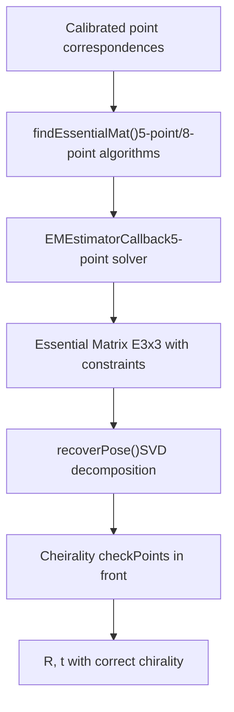
关键实施细节：

- **`EMEstimatorCallback`**：实现 Nistér 的 5 点算法并自动生成约束
- **约束执行**：基本矩阵具有 2 阶和特定的奇异值结构
- **`recoverPose`**：使用 SVD 分解基本矩阵，测试 4 种可能的 R,t 组合
- **Cheirality 检查**：验证三角测量点位于两个摄像头前面

5 点算法生成一个 10 次多项式系统，通过求解该系统可找到最多 10 个实数必要矩阵解。

来源：[modules/calib3d/src/five-point.cpp46-104](https://github.com/opencv/opencv/blob/91c78f50/modules/calib3d/src/five-point.cpp#L46-L104)

## 姿态估计和 3D 重建

### 透视 n 点 (PnP) 实施

OpenCV通过统一的`solvePnP`接口提供多个PnP求解器：

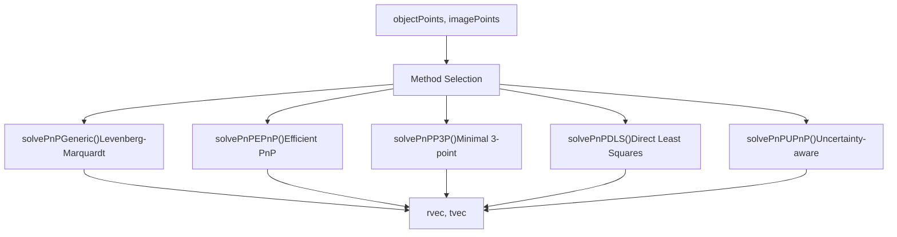
每种 PnP 方法都有特定的特征：

- **`solvePnPEPnP`**：使用控制点和重心坐标，O(n) 复杂度
- **`solvePnPP3P`**：最小求解器，返回多个解，需要RANSAC
- **`solvePnPGeneric`**：使用雅可比计算进行迭代细化
- **`solvePnPRansac`**：使用 RANSAC 异常值拒绝包装任何 PnP 方法

迭代方法使用 `CvLevMarq` 以及通过有限差分或解析导数计算的雅可比矩阵。

来源：[modules/calib3d/src/calibration.cpp428-431](https://github.com/opencv/opencv/blob/91c78f50/modules/calib3d/src/calibration.cpp#L428-L431)

## 三角测量和 3D 重建

### 3D点重建实现

该模块提供了多种从多个视图进行 3D 重建的方法：

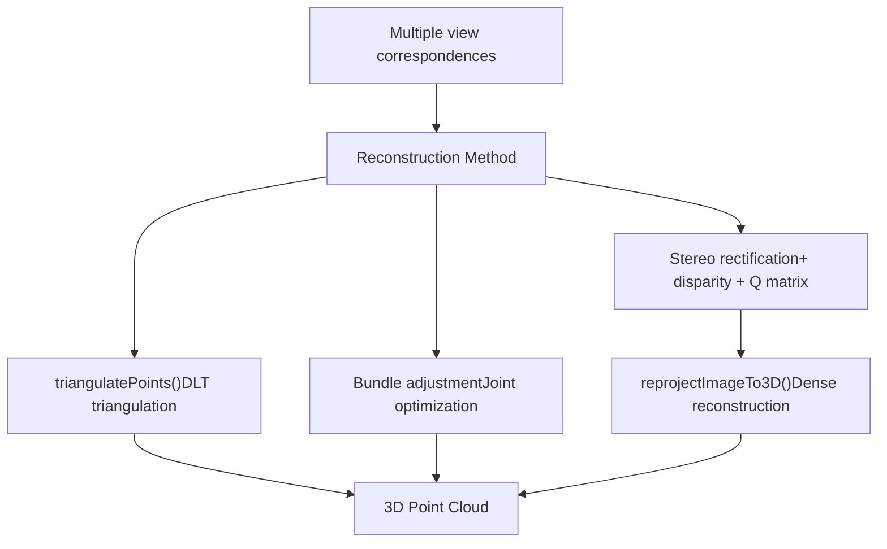
关键三角测量函数：

- **`triangulatePoints`**：使用投影矩阵从 N>=2 视图实现 DLT 三角测量
- **`reprojectImageTo3D`**：使用 Q 矩阵将视差图转换为 3D 坐标
- **基本矩阵约束**：用于验证和改进点对应关系

三角测量求解器构建系统：

```
[P₁] [X]   [0]
[P₂] [Y] = [0]
[..] [Z]   [.]
[Pₙ] [W]   [0]
```
并通过 SVD 求解找到 3D 点 \[X/W, Y/W, Z/W\]。

来源：[modules/calib3d/src/triangulate.cpp43-147](https://github.com/opencv/opencv/blob/91c78f50/modules/calib3d/src/triangulate.cpp#L43-L147)

## 实现架构

### 优化基础设施

calib3d模块采用分层优化架构：

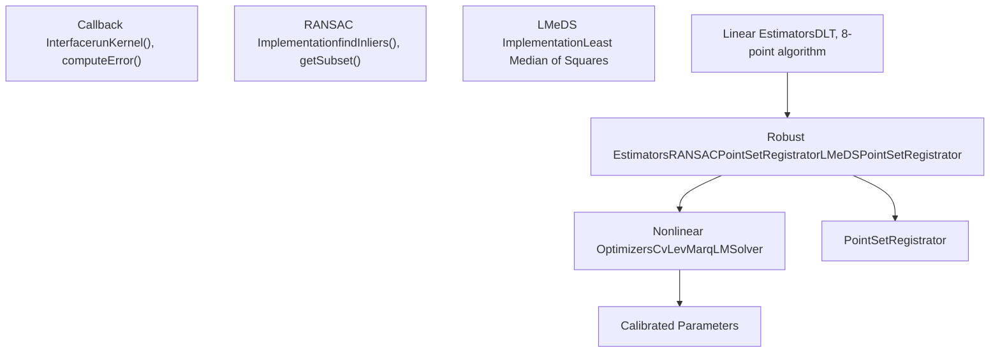
关键基础设施组件：

- **`PointSetRegistrator`**：稳健参数估计的抽象框架
- **`CvLevMarq`**：具有自动雅可比计算功能的 Levenberg-Marquardt 求解器
- **`RANSACUpdateNumIters`**：基于内点比率的自适应迭代计数
- **回调模式**：将估计方法与稳健的框架分开

`PointSetRegistrator::Callback`接口通过`runKernel`和`computeError`方法实现与算法无关的鲁棒估计。

来源：[modules/calib3d/src/ptsetreg.cpp78-236](https://github.com/opencv/opencv/blob/91c78f50/modules/calib3d/src/ptsetreg.cpp#L78-L236)[modules/calib3d/src/calibration.cpp337-345](https://github.com/opencv/opencv/blob/91c78f50/modules/calib3d/src/calibration.cpp#L337-L345)[modules/calib3d/src/levmarq.cpp1-200](https://github.com/opencv/opencv/blob/91c78f50/modules/calib3d/src/levmarq.cpp#L1-L200)

### 性能和效率考虑因素

该模块针对实时性能实施了多种优化策略：

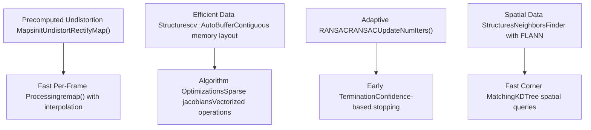
性能关键型实施：

- **`initUndistortRectifyMap`**：预先计算像素映射表以实现 O(1) 每像素不失真
- **`NeighborsFinder`**：使用FLANN KDTree在`ChessBoardDetector`中进行高效的空间查询
- **稀疏雅可比**：仅计算校准优化中必要的导数
- **内存布局**：使用 `cv::AutoBuffer` 进行堆栈分配的临时数组

对于实时应用程序，推荐的模式是地图预计算，然后调用`remap()`。

来源：[modules/calib3d/src/calibinit.cpp508-516](https://github.com/opencv/opencv/blob/91c78f50/modules/calib3d/src/calibinit.cpp#L508-L516)[modules/calib3d/src/ptsetreg.cpp55-75](https://github.com/opencv/opencv/blob/91c78f50/modules/calib3d/src/ptsetreg.cpp#L55-L75)

## 代码示例

### 相机校准

基本相机校准工作流程：

```
std::vector<std::vector<cv::Point3f>> objectPoints; // 3D pointsstd::vector<std::vector<cv::Point2f>> imagePoints;  // 2D pointscv::Size imageSize;                                 // Image size // Fill objectPoints and imagePoints by detecting pattern// in multiple images... cv::Mat cameraMatrix, distCoeffs;std::vector<cv::Mat> rvecs, tvecs; // Perform calibrationdouble reprojError = cv::calibrateCamera(    objectPoints, imagePoints, imageSize,     cameraMatrix, distCoeffs, rvecs, tvecs);
```
### 不扭曲图像

```
// Using the calibration resultscv::Mat undistortedImage;cv::undistort(inputImage, undistortedImage, cameraMatrix, distCoeffs); // For better performance, precompute mapscv::Mat map1, map2;cv::initUndistortRectifyMap(    cameraMatrix, distCoeffs, cv::Mat(),     cameraMatrix, imageSize, CV_16SC2, map1, map2); // Then use remap for each framecv::remap(inputImage, undistortedImage, map1, map2, cv::INTER_LINEAR);
```
### 立体声处理

```
// After stereo calibrationcv::Mat R1, R2, P1, P2, Q;cv::stereoRectify(    cameraMatrix1, distCoeffs1, cameraMatrix2, distCoeffs2,    imageSize, R, T, R1, R2, P1, P2, Q); // Create rectification mapscv::Mat map1x, map1y, map2x, map2y;cv::initUndistortRectifyMap(    cameraMatrix1, distCoeffs1, R1, P1, imageSize, CV_32FC1, map1x, map1y);cv::initUndistortRectifyMap(    cameraMatrix2, distCoeffs2, R2, P2, imageSize, CV_32FC1, map2x, map2y); // Rectify imagescv::Mat rectifiedLeft, rectifiedRight;cv::remap(imgLeft, rectifiedLeft, map1x, map1y, cv::INTER_LINEAR);cv::remap(imgRight, rectifiedRight, map2x, map2y, cv::INTER_LINEAR);
```
## 参考资料及相关API

该模块详细记录在三个子页面中：

- **第 8.1 页** — 相机模型和校准算法
- **第 8.2 页** — 姿态估计 (solvePnP) 和几何变换
- **第 8.3 页** — 立体视觉和鱼眼相机模型

### 相关 OpenCV 模块

- **核心**（第 3 页）：`Mat`、`Matx33d`，贯穿始终的算术和分解运算
- **imgproc**（第 4 页）：用于模式检测的图像预处理（阈值、过滤、`equalizeHist`）
- **features2d**（第 6 页）：校准模式搜索中内部使用的`DescriptorMatcher` 和 FLANN 索引

### 函数参考

该模块的主要功能有：

|功能|目的|
| --- | --- |
|`calibrateCamera()`|单相机标定|
|`stereoCalibrate()`|立体相机标定|
|`stereoRectify()`|计算立体声校正参数|
|`findChessboardCorners()`|检测图像中的棋盘图案|
|`solvePnP()`|根据 3D-2D 对应关系进行姿势估计|
|`findHomography()`|估计两个图像之间的单应性|
|`findFundamentalMat()`|估计基本矩阵|
|`findEssentialMat()`|估计基本矩阵|
|`undistort()`|消除图像中的镜头畸变|
|`initUndistortRectifyMap()`|计算地图以实现有效的去失真|
|`fisheye::calibrate()`|校准鱼眼相机|
|`fisheye::undistortImage()`|消除鱼眼畸变|

来源：[modules/calib3d/src/calibration.cpp166-622](https://github.com/opencv/opencv/blob/91c78f50/modules/calib3d/src/calibration.cpp#L166-L622)[modules/calib3d/src/fisheye.cpp62-358](https://github.com/opencv/opencv/blob/91c78f50/modules/calib3d/src/fisheye.cpp#L62-L358)[modules/calib3d/src/fundam.cpp357-469](https://github.com/opencv/opencv/blob/91c78f50/modules/calib3d/src/fundam.cpp#L357-L469)
