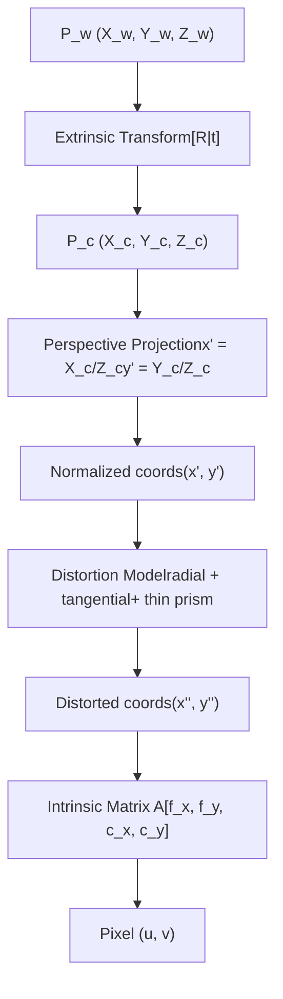
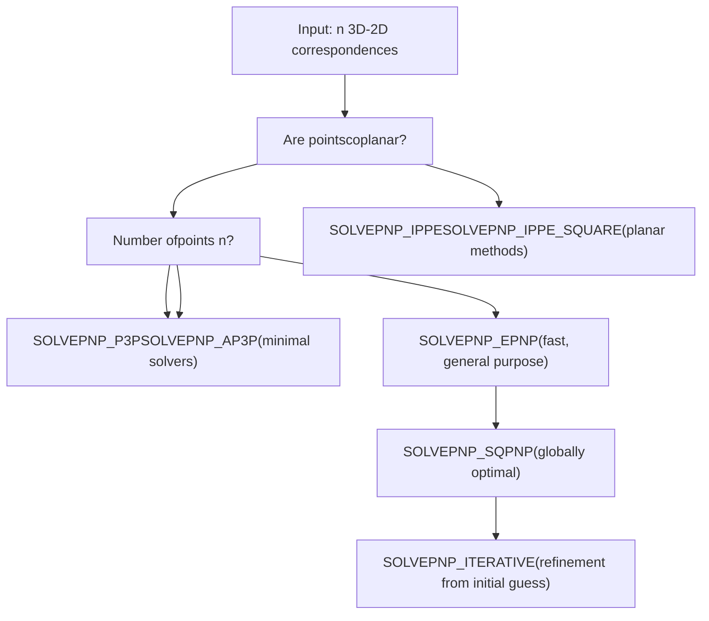
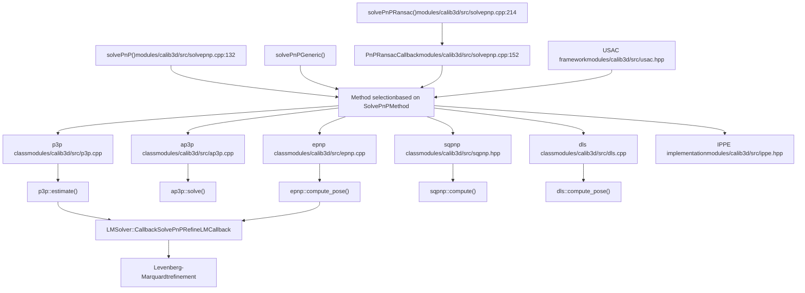
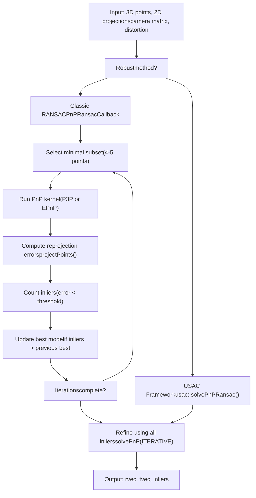
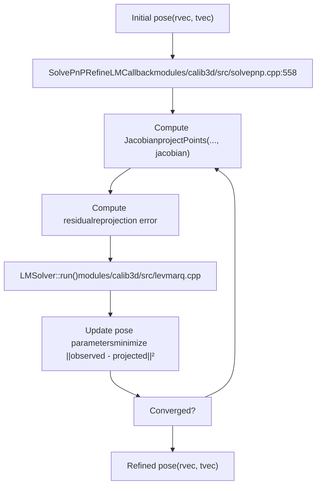

# 相机模型和标定算法

相关源文件

-   [modules/calib3d/include/opencv2/calib3d/calib3d.hpp](https://github.com/opencv/opencv/blob/91c78f50/modules/calib3d/include/opencv2/calib3d/calib3d.hpp)
-   [modules/calib3d/include/opencv2/calib3d/calib3d\_c.h](https://github.com/opencv/opencv/blob/91c78f50/modules/calib3d/include/opencv2/calib3d/calib3d_c.h)
-   [modules/calib3d/perf/perf\_translation2d.cpp](https://github.com/opencv/opencv/blob/91c78f50/modules/calib3d/perf/perf_translation2d.cpp)
-   [modules/calib3d/src/calibinit.cpp](https://github.com/opencv/opencv/blob/91c78f50/modules/calib3d/src/calibinit.cpp)
-   [modules/calib3d/src/calibration.cpp](https://github.com/opencv/opencv/blob/91c78f50/modules/calib3d/src/calibration.cpp)
-   [modules/calib3d/src/calibration\_base.cpp](https://github.com/opencv/opencv/blob/91c78f50/modules/calib3d/src/calibration_base.cpp)
-   [modules/calib3d/src/checkchessboard.cpp](https://github.com/opencv/opencv/blob/91c78f50/modules/calib3d/src/checkchessboard.cpp)
-   [modules/calib3d/src/chessboard.cpp](https://github.com/opencv/opencv/blob/91c78f50/modules/calib3d/src/chessboard.cpp)
-   [modules/calib3d/src/circlesgrid.cpp](https://github.com/opencv/opencv/blob/91c78f50/modules/calib3d/src/circlesgrid.cpp)
-   [modules/calib3d/src/circlesgrid.hpp](https://github.com/opencv/opencv/blob/91c78f50/modules/calib3d/src/circlesgrid.hpp)
-   [modules/calib3d/src/compat\_ptsetreg.cpp](https://github.com/opencv/opencv/blob/91c78f50/modules/calib3d/src/compat_ptsetreg.cpp)
-   [modules/calib3d/src/five-point.cpp](https://github.com/opencv/opencv/blob/91c78f50/modules/calib3d/src/five-point.cpp)
-   [modules/calib3d/src/fundam.cpp](https://github.com/opencv/opencv/blob/91c78f50/modules/calib3d/src/fundam.cpp)
-   [modules/calib3d/src/levmarq.cpp](https://github.com/opencv/opencv/blob/91c78f50/modules/calib3d/src/levmarq.cpp)
-   [modules/calib3d/src/precomp.hpp](https://github.com/opencv/opencv/blob/91c78f50/modules/calib3d/src/precomp.hpp)
-   [modules/calib3d/src/ptsetreg.cpp](https://github.com/opencv/opencv/blob/91c78f50/modules/calib3d/src/ptsetreg.cpp)
-   [modules/calib3d/src/stereo\_geom.cpp](https://github.com/opencv/opencv/blob/91c78f50/modules/calib3d/src/stereo_geom.cpp)
-   [modules/calib3d/src/triangulate.cpp](https://github.com/opencv/opencv/blob/91c78f50/modules/calib3d/src/triangulate.cpp)
-   [modules/calib3d/src/upnp.cpp](https://github.com/opencv/opencv/blob/91c78f50/modules/calib3d/src/upnp.cpp)
-   [modules/calib3d/src/upnp.h](https://github.com/opencv/opencv/blob/91c78f50/modules/calib3d/src/upnp.h)
-   [modules/calib3d/test/test\_cameracalibration.cpp](https://github.com/opencv/opencv/blob/91c78f50/modules/calib3d/test/test_cameracalibration.cpp)
-   [modules/calib3d/test/test\_cameracalibration\_badarg.cpp](https://github.com/opencv/opencv/blob/91c78f50/modules/calib3d/test/test_cameracalibration_badarg.cpp)
-   [modules/calib3d/test/test\_chesscorners.cpp](https://github.com/opencv/opencv/blob/91c78f50/modules/calib3d/test/test_chesscorners.cpp)
-   [modules/calib3d/test/test\_chesscorners\_badarg.cpp](https://github.com/opencv/opencv/blob/91c78f50/modules/calib3d/test/test_chesscorners_badarg.cpp)
-   [modules/calib3d/test/test\_chesscorners\_timing.cpp](https://github.com/opencv/opencv/blob/91c78f50/modules/calib3d/test/test_chesscorners_timing.cpp)
-   [modules/calib3d/test/test\_main.cpp](https://github.com/opencv/opencv/blob/91c78f50/modules/calib3d/test/test_main.cpp)
-   [modules/calib3d/test/test\_modelest.cpp](https://github.com/opencv/opencv/blob/91c78f50/modules/calib3d/test/test_modelest.cpp)
-   [modules/calib3d/test/test\_translation\_2d\_estimator.cpp](https://github.com/opencv/opencv/blob/91c78f50/modules/calib3d/test/test_translation_2d_estimator.cpp)
-   [modules/imgproc/include/opencv2/imgproc/imgproc.hpp](https://github.com/opencv/opencv/blob/91c78f50/modules/imgproc/include/opencv2/imgproc/imgproc.hpp)
-   [modules/imgproc/include/opencv2/imgproc/types\_c.h](https://github.com/opencv/opencv/blob/91c78f50/modules/imgproc/include/opencv2/imgproc/types_c.h)

## 目的和范围

本文档描述了 OpenCV 的`calib3d`模块中实现的相机模型和校准算法。它涵盖了针孔相机模型、镜头畸变参数化、相机校准程序以及用于姿态估计的透视 n 点 (PnP) 问题的数学基础。对于视图之间的几何变换，例如单应性和基本矩阵估计，请参阅[8.2](/opencv/opencv/8.2-pose-estimation-(solvepnp)-和-几何变换）。有关立体声校准和校正，请参阅`calib3d`模块内的立体声特定文档。

**来源：** [modules/calib3d/include/opencv2/calib3d.hpp54-542](https://github.com/opencv/opencv/blob/91c78f50/modules/calib3d/include/opencv2/calib3d.hpp#L54-L542)

---

## 相机模型基础

### 针孔相机模型

OpenCV 实现了标准针孔相机模型，其中世界坐标中的 3D 点 $P\_w$ 通过变换投影到 2D 像素 $p$：

$$s； p = A \\开始{bmatrix} R|t \\结束{bmatrix} P\_w$$

**相机内在矩阵** $A$（也表示为 $K$）具有以下结构：

$$A = \\开始{bmatrix}f\_x & 0 & c\_x \\ 0 & f\_y & c\_y \\ 0 & 0 & 1\\end{bmatrix}$$

在哪里：

- $f\_x$, $f\_y$ 是以像素单位表示的焦距
- $(c\_x, c\_y)$ 是主点（光学中心），通常靠近图像中心

**外部参数**由从世界坐标系转换到相机坐标系的旋转矩阵 $R$ 和平移向量 $t$ 组成。

**来源：** [modules/calib3d/include/opencv2/calib3d.hpp66-92](https://github.com/opencv/opencv/blob/91c78f50/modules/calib3d/include/opencv2/calib3d.hpp#L66-L92)

---

### 畸变模型

真实的镜头会引入畸变，主要是径向和切向分量。 OpenCV 的畸变模型将归一化图像坐标 $(x', y')$ 转换为畸变坐标 $(x'', y'')$：

$$\\begin{bmatrix}x'' \\ y''\\end{bmatrix} = \\begin{bmatrix}x' \\frac{1 + k\_1 r^2 + k\_2 r^4 + k\_3 r^6}{1 + k\_4 r^2 + k\_5 r^4 + k\_6 r^6} + 2 p\_1 x' y' + p\_2(r^2 + 2 x'^2) + s\_1 r^2 + s\_2 r^4 \\ y' \\frac{1 + k\_1 r^2 + k\_2 r^4 + k\_3 r^6}{1 + k\_4 r^2 + k\_5 r^4 + k\_6 r^6} + p\_1 (r^2 + 2 y'^2) + 2 p\_2 x' y' + s\_3 r^2 + s\_4 r^4\\end{bmatrix}$$

其中 $r^2 = x'^2 + y'^2$。

失真系数向量排序为：

$$(k\_1, k\_2, p\_1, p\_2\[, k\_3\[, k\_4, k\_5, k\_6 \[, s\_1, s\_2, s\_3, s\_4\[, \\tau\_x, \\tau\_y\]\]\]\])$$

|系数|描述|
| --- | --- |
|$k\_1、k\_2、k\_3、k\_4、k\_5、k\_6$|径向畸变系数|
|$p\_1, p\_2$|切向畸变系数|
|$s\_1、s\_2、s\_3、s\_4$|薄棱镜畸变系数|
|$\\tau\_x，\\tau\_y$|倾斜传感器模型 (Scheimpflug) 参数|

**来源：** [modules/calib3d/include/opencv2/calib3d.hpp225-323](https://github.com/opencv/opencv/blob/91c78f50/modules/calib3d/include/opencv2/calib3d.hpp#L225-L323)


**图：相机模型管道** - 从 3D 世界点到 2D 像素坐标的转换阶段

**来源：** [modules/calib3d/include/opencv2/calib3d.hpp56-323](https://github.com/opencv/opencv/blob/91c78f50/modules/calib3d/include/opencv2/calib3d.hpp#L56-L323)

---

## 校准标志和配置

OpenCV 通过 `calib3d.hpp` 标头中定义的标志提供对校准过程的广泛控制。这些标志控制优化期间估计、固定或约束哪些参数。

### 校准标志常数

|旗帜|价值|描述|
| --- | --- | --- |
|`CALIB_USE_INTRINSIC_GUESS`|0x00001|使用提供的相机矩阵作为初始估计|
|`CALIB_FIX_ASPECT_RATIO`|0x00002|修复 $f\_x / f\_y$ 比率|
|`CALIB_FIX_PRINCIPAL_POINT`|0x00004|修复 $(c\_x, c\_y)$|
|`CALIB_ZERO_TANGENT_DIST`|0x00008|设置 $p\_1 = p\_2 = 0$|
|`CALIB_FIX_FOCAL_LENGTH`|0x00010|固定焦距|
|`CALIB_FIX_K1` 至 `CALIB_FIX_K6`|0x00020-0x02000|修复各个径向系数|
|`CALIB_RATIONAL_MODEL`|0x04000|启用有理失真模型（6 个径向系数）|
|`CALIB_THIN_PRISM_MODEL`|0x08000|启用薄棱镜畸变 ($s\_1$-$s\_4$)|
|`CALIB_FIX_S1_S2_S3_S4`|0x10000|修复薄棱镜系数|
|`CALIB_TILTED_MODEL`|0x40000|启用倾斜传感器模型（$\\tau\_x$、$\\tau\_y$）|
|`CALIB_FIX_TAUX_TAUY`|0x80000|修复倾斜模型参数|

**来源：** [modules/calib3d/include/opencv2/calib3d.hpp605-631](https://github.com/opencv/opencv/blob/91c78f50/modules/calib3d/include/opencv2/calib3d.hpp#L605-L631)

---

## 透视 n 点 (PnP) 问题

PnP 问题根据 3D 对象点和 2D 图像投影之间的 $n$ 对应关系来估计相机姿态（旋转 $R$ 和平移 $t$）。 OpenCV实现了针对不同场景优化的多种算法。

### PnP 算法选择


**图：PnP 算法选择决策树**

**来源：** [modules/calib3d/include/opencv2/calib3d.hpp563-587](https://github.com/opencv/opencv/blob/91c78f50/modules/calib3d/include/opencv2/calib3d.hpp#L563-L587) [modules/calib3d/src/solvepnp.cpp132-150](https://github.com/opencv/opencv/blob/91c78f50/modules/calib3d/src/solvepnp.cpp#L132-L150)

### SolvePnPMethod 枚举

`SolvePnPMethod` 枚举定义了可用的算法：

|方法|价值|描述|使用案例|
| --- | --- | --- | --- |
|`SOLVEPNP_ITERATIVE`| 0 |Levenberg-Marquardt 精化|细化初始姿态估计|
|`SOLVEPNP_EPNP`| 1 |高效的点透视|通用，$n \\geq 4$|
|`SOLVEPNP_P3P`| 2 |P3P求解器|最小情况，$n = 3,4$|
|`SOLVEPNP_DLS`| 3 |直接最小二乘法（已弃用）|重新映射到 EPNP|
|`SOLVEPNP_UPNP`| 4 |统一 PnP（已弃用）|重新映射到 EPNP|
|`SOLVEPNP_AP3P`| 5 |替代P3P|最小情况替代方案|
|`SOLVEPNP_IPPE`| 6 |基于无穷小平面的姿势|共面点|
|`SOLVEPNP_IPPE_SQUARE`| 7 |IPPE 用于方形标记|4 点方形标记|
|`SOLVEPNP_SQPNP`| 8 |SQPnP 全局最优|精度要求高|

**来源：** [modules/calib3d/include/opencv2/calib3d.hpp563-587](https://github.com/opencv/opencv/blob/91c78f50/modules/calib3d/include/opencv2/calib3d.hpp#L563-L587)

---

## PnP 求解器实现架构

### 核心解算器类


**图：PnP 求解器架构** - 用于姿态估计的类层次结构和方法调度

**来源：** [modules/calib3d/src/solvepnp.cpp132-556](https://github.com/opencv/opencv/blob/91c78f50/modules/calib3d/src/solvepnp.cpp#L132-L556) [modules/calib3d/src/epnp.cpp1-100](https://github.com/opencv/opencv/blob/91c78f50/modules/calib3d/src/epnp.cpp#L1-L100) [modules/calib3d/src/p3p.cpp1-50](https://github.com/opencv/opencv/blob/91c78f50/modules/calib3d/src/p3p.cpp#L1-L50) [modules/calib3d/src/ap3p.cpp1-50](https://github.com/opencv/opencv/blob/91c78f50/modules/calib3d/src/ap3p.cpp#L1-L50)

### 算法实现细节

#### EPnP（高效透视-n-点）

`epnp` 类实现了 Lepetit 等人的算法。 （2009）。它将 3D 点表示为四个控制点的加权组合，并求解它们的相机坐标。

**关键方法：**

- `epnp::compute_pose()` - 主入口点
- `epnp::choose_control_points()` - 选择控制点依据
- `epnp::compute_barycentric_coordinates()` - 以控制点为基础表达点
- `epnp::compute_ccs()` - 估计相机坐标中的控制点
- `epnp::compute_pcs()` - 反投影到 3D

**来源：** [modules/calib3d/src/epnp.cpp1-400](https://github.com/opencv/opencv/blob/91c78f50/modules/calib3d/src/epnp.cpp#L1-L400) [modules/calib3d/src/epnp.h1-100](https://github.com/opencv/opencv/blob/91c78f50/modules/calib3d/src/epnp.h#L1-L100)

#### P3P 和 AP3P

3-4 点的最小求解器。 P3P 求解四次多项式，通常会产生最多 4 个必须消除歧义的解。

**P3P 实施：**

- [modules/calib3d/src/p3p.cpp1-300](https://github.com/opencv/opencv/blob/91c78f50/modules/calib3d/src/p3p.cpp#L1-L300) - 实现 Ding 等人。 (2023) 重新审视 P3P
- `p3p::estimate()` - 返回最多 4 个姿势假设
- [modules/calib3d/src/solvepnp.cpp427-556](https://github.com/opencv/opencv/blob/91c78f50/modules/calib3d/src/solvepnp.cpp#L427-L556) - 包装`solveP3P()`函数

**AP3P 实施：**

- [modules/calib3d/src/ap3p.cpp1-250](https://github.com/opencv/opencv/blob/91c78f50/modules/calib3d/src/ap3p.cpp#L1-L250) - 替代 P3P 配方（Ke et al. 2017）
- `ap3p::solve()` - 代数解

**来源：** [modules/calib3d/src/p3p.cpp1-300](https://github.com/opencv/opencv/blob/91c78f50/modules/calib3d/src/p3p.cpp#L1-L300) [modules/calib3d/src/ap3p.cpp1-250](https://github.com/opencv/opencv/blob/91c78f50/modules/calib3d/src/ap3p.cpp#L1-L250) [modules/calib3d/src/solvepnp.cpp427-556](https://github.com/opencv/opencv/blob/91c78f50/modules/calib3d/src/solvepnp.cpp#L427-L556)

#### DLS（直接最小二乘法）

**注意：** 由于实施问题，DLS 和 UPnP 方法目前已重新映射到 EPnP。

`dls` 类实现了 Hesch & Roumeliotis (2011) 直接最小二乘法。它使用凯莱参数化来避免旋转矩阵奇点。

**关键方法：**

- `dls::run_kernel()` - 核心DLS算法
- `dls::build_coeff_matrix()` - 构造系数矩阵
- `dls::cayley2rotbar()` - 凯莱到旋转矩阵的转换

**来源：** [modules/calib3d/src/dls.cpp1-300](https://github.com/opencv/opencv/blob/91c78f50/modules/calib3d/src/dls.cpp#L1-L300) [modules/calib3d/src/dls.h1-150](https://github.com/opencv/opencv/blob/91c78f50/modules/calib3d/src/dls.h#L1-L150)

#### SQPnP（顺序最优多项式）

`sqpnp` 类通过将 PnP 表述为多项式优化问题来提供全局最优解。

**来源：** [modules/calib3d/src/sqpnp.hpp1-200](https://github.com/opencv/opencv/blob/91c78f50/modules/calib3d/src/sqpnp.hpp#L1-L200)

---

## 使用 RANSAC 进行稳健估计

OpenCV 通过 `solvePnPRansac()` 提供稳健的姿态估计，处理 2D-3D 对应中的异常值。

### RANSAC 管道


**图：基于 RANSAC 的鲁棒 PnP 估计管道**

**来源：** [modules/calib3d/src/solvepnp.cpp214-396](https://github.com/opencv/opencv/blob/91c78f50/modules/calib3d/src/solvepnp.cpp#L214-L396)

### PnPRansacCallback 实现

`PnPRansacCallback`类实现RANSAC的`PointSetRegistrator::Callback`接口：

**关键方法：**

- `runKernel()` [modules/calib3d/src/solvepnp.cpp164-177](https://github.com/opencv/opencv/blob/91c78f50/modules/calib3d/src/solvepnp.cpp#L164-L177) - 从最小集合计算姿势
- `computeError()` [modules/calib3d/src/solvepnp.cpp181-203](https://github.com/opencv/opencv/blob/91c78f50/modules/calib3d/src/solvepnp.cpp#L181-L203) - 计算重投影误差
- 使用`projectPoints()`评估模型质量

**成员变量：**

- `cameraMatrix`、`distCoeffs` - 相机参数
- `flags` - 已选择`SolvePnPMethod`
- `useExtrinsicGuess` - 是否使用初始姿态估计
- `rvec`，`tvec` - 当前姿态估计

**来源：** [modules/calib3d/src/solvepnp.cpp152-212](https://github.com/opencv/opencv/blob/91c78f50/modules/calib3d/src/solvepnp.cpp#L152-L212)

### RANSAC 参数控制

|范围|描述|典型值|
| --- | --- | --- |
|`iterationsCount`|最大 RANSAC 迭代次数| 1000 |
|`reprojectionError`|内部阈值（像素）| 0.5 - 8.0 |
|`confidence`|期望的置信水平| 0.99 |

使用以下方法动态更新所需的迭代次数：

$$N = \\frac{\\log(1-p)}{\\log(1-(1-\\epsilon)^s)}$$

其中 $p$ 是置信度，$\\epsilon$ 是离群值比率，$s$ 是样本大小。

**实施：** [modules/calib3d/src/ptsetreg.cpp55-75](https://github.com/opencv/opencv/blob/91c78f50/modules/calib3d/src/ptsetreg.cpp#L55-L75)

**来源：** [modules/calib3d/src/solvepnp.cpp214-396](https://github.com/opencv/opencv/blob/91c78f50/modules/calib3d/src/solvepnp.cpp#L214-L396) [modules/calib3d/src/ptsetreg.cpp55-75](https://github.com/opencv/opencv/blob/91c78f50/modules/calib3d/src/ptsetreg.cpp#L55-L75)

---

## 姿势细化

### Levenberg-Marquardt 优化

在获得初始姿态估计（从任何 PnP 求解器或 RANSAC）后，可以使用应用 Levenberg-Marquardt 优化的`SOLVEPNP_ITERATIVE` 来细化姿态。


**图表：Levenberg-Marquardt 姿势细化过程**

**来源：** [modules/calib3d/src/solvepnp.cpp558-608](https://github.com/opencv/opencv/blob/91c78f50/modules/calib3d/src/solvepnp.cpp#L558-L608)

### SolvePnPRefineLMCallback

此回调计算 LM 优化的残差和雅可比行列式：

```
class SolvePnPRefineLMCallback : public LMSolver::Callback{    bool compute(InputArray _param, OutputArray _err, OutputArray _Jac) const    {        Mat rvec = param(Rect(0, 0, 1, 3));        Mat tvec = param(Rect(0, 3, 1, 3));                // Project points and compute Jacobian        projectPoints(objectPoints, rvec, tvec, cameraMatrix,                       distCoeffs, projectedPts, _Jac.needed() ? J : noArray());                // Compute error (observed - projected)        err = projectedPts - imagePoints0;                return true;    }};
```
**来源：** [modules/calib3d/src/solvepnp.cpp558-608](https://github.com/opencv/opencv/blob/91c78f50/modules/calib3d/src/solvepnp.cpp#L558-L608)

---

## 视觉伺服优化

OpenCV 还使用虚拟视觉伺服 (VVS) 原理实现基于视觉伺服的姿态细化。

### 相互作用矩阵公式

交互矩阵 $L$ 将相机速度与特征速度联系起来：

$$\\dot{s} = L , v\_c$$

其中 $v\_c = (\\dot{t}, \\omega)$ 是相机速度（平移和角度）。

对于投影到标准化坐标 $(x, y)$ 的 3D 点：

$$L = \\开始{bmatrix} -1/Z & 0 & x/Z & xy & -(1+x^2) & y \\ 0 & -1/Z & y/Z & 1+y^2 & -xy & -x \\end{bmatrix}$$

**实施：** [modules/calib3d/src/solvepnp.cpp618-650](https://github.com/opencv/opencv/blob/91c78f50/modules/calib3d/src/solvepnp.cpp#L618-L650)

**来源：** [modules/calib3d/src/solvepnp.cpp610-730](https://github.com/opencv/opencv/blob/91c78f50/modules/calib3d/src/solvepnp.cpp#L610-L730)

---

## 校准模式检测

相机校准通常使用校准图案（棋盘、圆圈）来建立 2D-3D 对应关系。

### 模式检测标志

|旗帜|描述|
| --- | --- |
|`CALIB_CB_ADAPTIVE_THRESH`|使用自适应阈值|
|`CALIB_CB_NORMALIZE_IMAGE`|处理前对图像进行归一化|
|`CALIB_CB_FILTER_QUADS`|滤除虚假四边形|
|`CALIB_CB_FAST_CHECK`|快速检查棋盘是否存在|

**来源：** [modules/calib3d/include/opencv2/calib3d.hpp589-598](https://github.com/opencv/opencv/blob/91c78f50/modules/calib3d/include/opencv2/calib3d.hpp#L589-L598)

---

## 鱼眼相机模型

OpenCV 为具有明显畸变的广角镜头提供了单独的鱼眼相机模型。

### 鱼眼畸变

鱼眼模型使用角度参数化：

$$\\theta\_d = \\theta (1 + k\_1 \\theta^2 + k\_2 \\theta^4 + k\_3 \\theta^6 + k\_4 \\theta^8)$$

其中 $\\theta = \\arctan(r)$ 和 $r = \\sqrt{x^2 + y^2}$。

**API 命名空间：** `cv::fisheye` `calib3d` 内的子模块

**来源：** [modules/calib3d/include/opencv2/calib3d.hpp509-541](https://github.com/opencv/opencv/blob/91c78f50/modules/calib3d/include/opencv2/calib3d.hpp#L509-L541)

---

## 手眼校准

对于机器人应用，OpenCV 提供了手眼校准方法，可以解决相机和机器人末端执行器之间的转换问题。

### 校准方法

|方法|参考|
| --- | --- |
|`CALIB_HAND_EYE_TSAI`|蔡 (1989)|
|`CALIB_HAND_EYE_PARK`|公园 (1994)|
|`CALIB_HAND_EYE_HORAUD`|奥洛德 (1995)|
|`CALIB_HAND_EYE_ANDREFF`|安德烈夫 (1999)|
|`CALIB_HAND_EYE_DANIILIDIS`|Daniilidis (1998) - 对偶四元数|

**来源：** [modules/calib3d/include/opencv2/calib3d.hpp640-653](https://github.com/opencv/opencv/blob/91c78f50/modules/calib3d/include/opencv2/calib3d.hpp#L640-L653)

---

## 用法示例

### 基本 PnP 求解

```
// Given 3D object points, 2D image points, camera calibrationstd::vector<Point3f> objectPoints = ...; // 3D model pointsstd::vector<Point2f> imagePoints = ...;  // Corresponding 2D detectionsMat cameraMatrix = ...;                  // 3x3 intrinsic matrixMat distCoeffs = ...;                    // Distortion coefficients Mat rvec, tvec;bool success = solvePnP(objectPoints, imagePoints, cameraMatrix,                         distCoeffs, rvec, tvec,                         false, SOLVEPNP_ITERATIVE);
```
### 使用 RANSAC 实现稳健的 PnP

```
Mat rvec, tvec;std::vector<int> inliers; bool success = solvePnPRansac(objectPoints, imagePoints,                               cameraMatrix, distCoeffs,                               rvec, tvec,                               false,              // useExtrinsicGuess                               100,                // iterationsCount                               8.0,                // reprojectionError                               0.99,               // confidence                               inliers,            // output inliers                               SOLVEPNP_ITERATIVE);
```
**来源：** [modules/calib3d/src/solvepnp.cpp132-150](https://github.com/opencv/opencv/blob/91c78f50/modules/calib3d/src/solvepnp.cpp#L132-L150) [modules/calib3d/src/solvepnp.cpp214-396](https://github.com/opencv/opencv/blob/91c78f50/modules/calib3d/src/solvepnp.cpp#L214-L396)

---

## 性能考虑因素

### 算法选择指南

|设想|推荐方法|基本原理|
| --- | --- | --- |
|很少的点 (n=3,4)|`SOLVEPNP_P3P` 或 `SOLVEPNP_AP3P`|最小求解器|
|一般情况（n≥6）|`SOLVEPNP_EPNP`|快速、准确|
|平面物体|`SOLVEPNP_IPPE`|利用平面性|
|方形标记|`SOLVEPNP_IPPE_SQUARE`|针对正方形进行了优化|
|最高准确度|`SOLVEPNP_SQPNP`|全局最优|
|细化|`SOLVEPNP_ITERATIVE`|局部优化|
|异常值处理|`solvePnPRansac()`|稳健估计|

**来源：** [modules/calib3d/perf/perf\_pnp.cpp1-110](https://github.com/opencv/opencv/blob/91c78f50/modules/calib3d/perf/perf_pnp.cpp#L1-L110) [modules/calib3d/test/test\_solvepnp\_ransac.cpp200-233](https://github.com/opencv/opencv/blob/91c78f50/modules/calib3d/test/test_solvepnp_ransac.cpp#L200-L233)

---

## 坐标系约定

OpenCV 使用标准计算机视觉坐标约定：

- **相机坐标**：右手，Z轴指向前方
- **图像坐标**：原点位于左上角，X 向右，Y 向下
- **旋转向量**：Rodrigues 参数化（轴角）
- **齐次变换**：$^cT\_o$ 将对象帧变换为相机帧

符号 $^cT\_o = \\begin{bmatrix} R & t \\ 0 & 1 \\end{bmatrix}$ 表示变换，其中：

- $R$：3×3 旋转矩阵（相机框架中的对象方向）
- $t$：3×1 平移向量（相机帧中的对象位置）

**来源：** [modules/calib3d/include/opencv2/calib3d.hpp386-454](https://github.com/opencv/opencv/blob/91c78f50/modules/calib3d/include/opencv2/calib3d.hpp#L386-L454)
