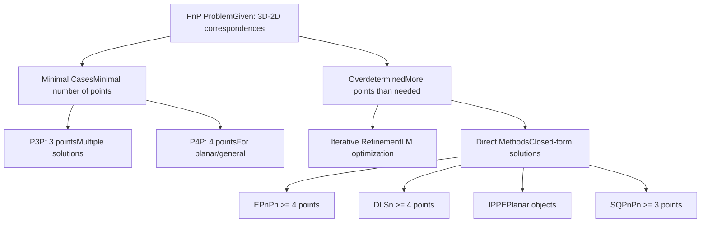
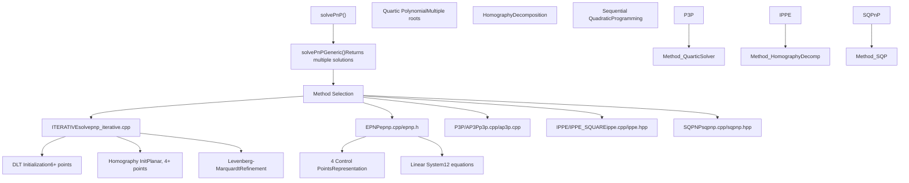
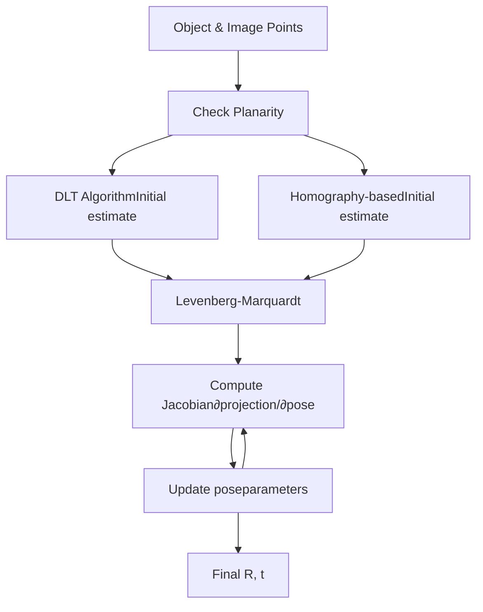
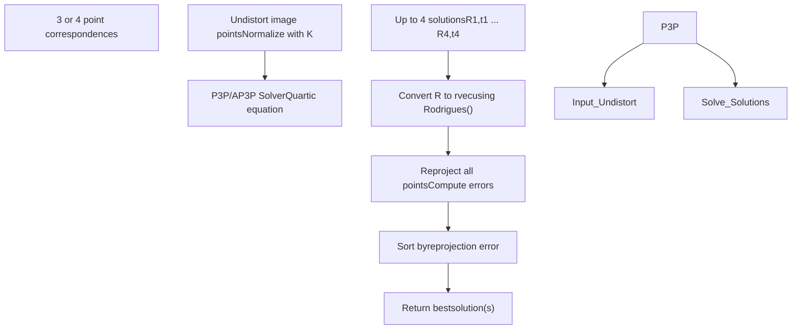
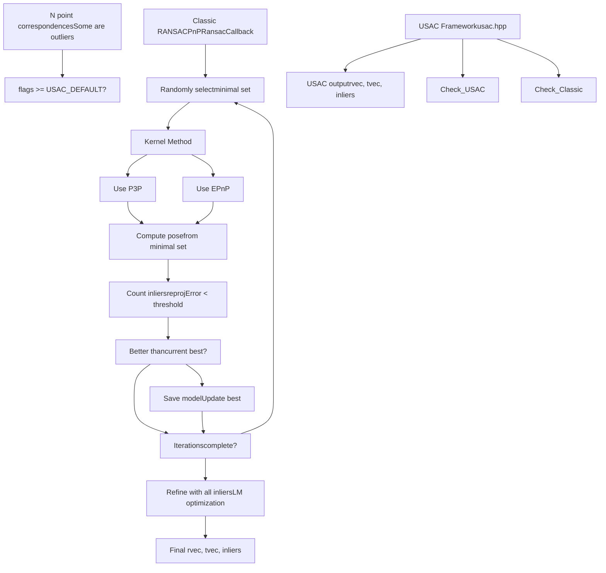
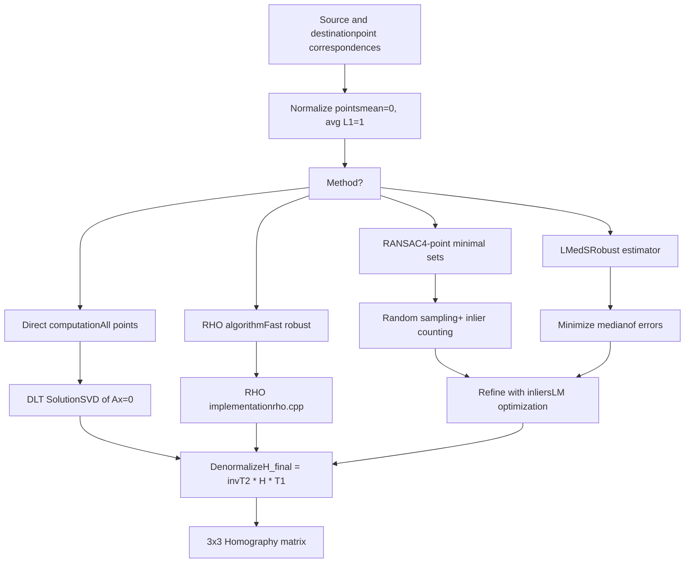
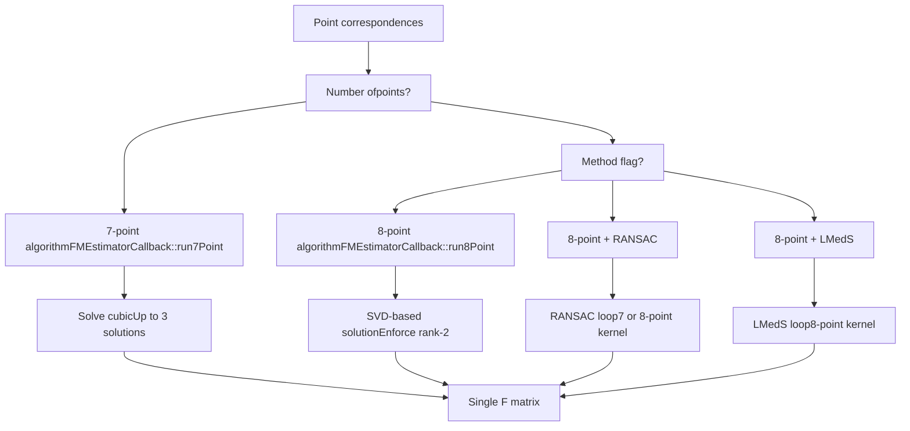
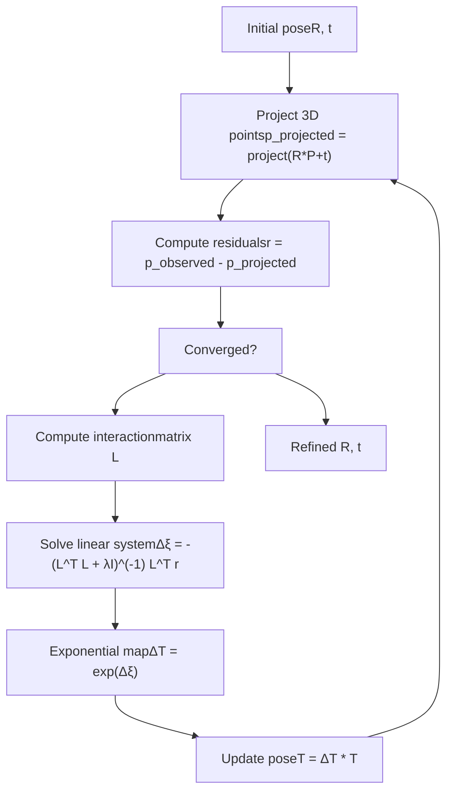
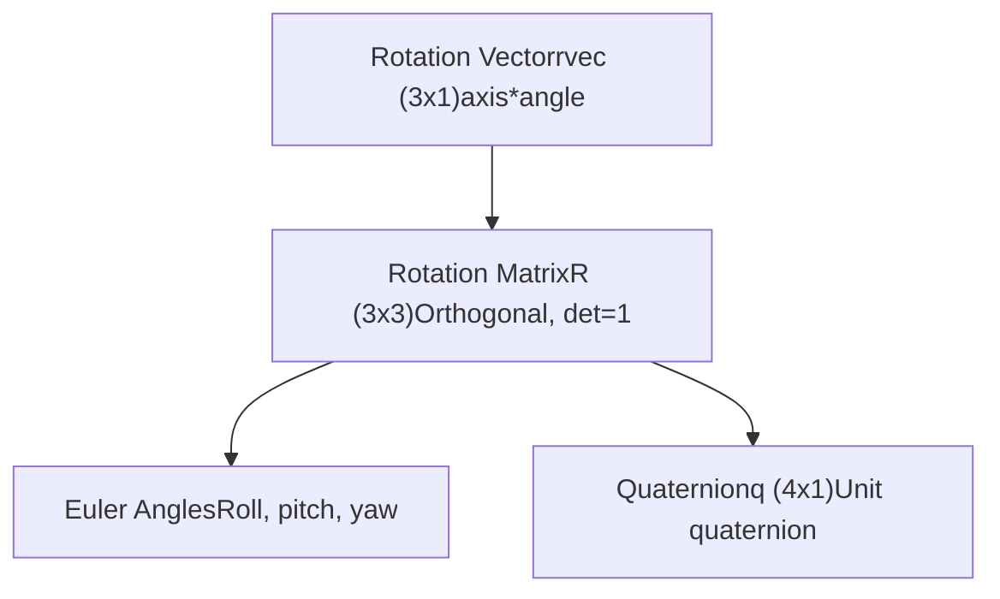

# 姿势估计 (solvePnP) 和几何变换

相关源文件

-   [cmake/vars/EnableModeVars.cmake](https://github.com/opencv/opencv/blob/91c78f50/cmake/vars/EnableModeVars.cmake)
-   [cmake/vars/OPENCV\_SEMIHOSTING.cmake](https://github.com/opencv/opencv/blob/91c78f50/cmake/vars/OPENCV_SEMIHOSTING.cmake)
-   [doc/opencv.bib](https://github.com/opencv/opencv/blob/91c78f50/doc/opencv.bib)
-   [modules/calib3d/doc/calib3d.bib](https://github.com/opencv/opencv/blob/91c78f50/modules/calib3d/doc/calib3d.bib)
-   [modules/calib3d/doc/solvePnP.markdown](https://github.com/opencv/opencv/blob/91c78f50/modules/calib3d/doc/solvePnP.markdown?plain=1)
-   [modules/calib3d/include/opencv2/calib3d.hpp](https://github.com/opencv/opencv/blob/91c78f50/modules/calib3d/include/opencv2/calib3d.hpp)
-   [modules/calib3d/include/opencv2/calib3d/calib3d\_c.h](https://github.com/opencv/opencv/blob/91c78f50/modules/calib3d/include/opencv2/calib3d/calib3d_c.h)
-   [modules/calib3d/perf/perf\_pnp.cpp](https://github.com/opencv/opencv/blob/91c78f50/modules/calib3d/perf/perf_pnp.cpp)
-   [modules/calib3d/perf/perf\_stereosgbm.cpp](https://github.com/opencv/opencv/blob/91c78f50/modules/calib3d/perf/perf_stereosgbm.cpp)
-   [modules/calib3d/perf/perf\_translation2d.cpp](https://github.com/opencv/opencv/blob/91c78f50/modules/calib3d/perf/perf_translation2d.cpp)
-   [modules/calib3d/src/ap3p.cpp](https://github.com/opencv/opencv/blob/91c78f50/modules/calib3d/src/ap3p.cpp)
-   [modules/calib3d/src/ap3p.h](https://github.com/opencv/opencv/blob/91c78f50/modules/calib3d/src/ap3p.h)
-   [modules/calib3d/src/calibinit.cpp](https://github.com/opencv/opencv/blob/91c78f50/modules/calib3d/src/calibinit.cpp)
-   [modules/calib3d/src/calibration.cpp](https://github.com/opencv/opencv/blob/91c78f50/modules/calib3d/src/calibration.cpp)
-   [modules/calib3d/src/calibration\_base.cpp](https://github.com/opencv/opencv/blob/91c78f50/modules/calib3d/src/calibration_base.cpp)
-   [modules/calib3d/src/checkchessboard.cpp](https://github.com/opencv/opencv/blob/91c78f50/modules/calib3d/src/checkchessboard.cpp)
-   [modules/calib3d/src/chessboard.cpp](https://github.com/opencv/opencv/blob/91c78f50/modules/calib3d/src/chessboard.cpp)
-   [modules/calib3d/src/circlesgrid.cpp](https://github.com/opencv/opencv/blob/91c78f50/modules/calib3d/src/circlesgrid.cpp)
-   [modules/calib3d/src/circlesgrid.hpp](https://github.com/opencv/opencv/blob/91c78f50/modules/calib3d/src/circlesgrid.hpp)
-   [modules/calib3d/src/compat\_ptsetreg.cpp](https://github.com/opencv/opencv/blob/91c78f50/modules/calib3d/src/compat_ptsetreg.cpp)
-   [modules/calib3d/src/dls.cpp](https://github.com/opencv/opencv/blob/91c78f50/modules/calib3d/src/dls.cpp)
-   [modules/calib3d/src/dls.h](https://github.com/opencv/opencv/blob/91c78f50/modules/calib3d/src/dls.h)
-   [modules/calib3d/src/epnp.cpp](https://github.com/opencv/opencv/blob/91c78f50/modules/calib3d/src/epnp.cpp)
-   [modules/calib3d/src/epnp.h](https://github.com/opencv/opencv/blob/91c78f50/modules/calib3d/src/epnp.h)
-   [modules/calib3d/src/five-point.cpp](https://github.com/opencv/opencv/blob/91c78f50/modules/calib3d/src/five-point.cpp)
-   [modules/calib3d/src/fundam.cpp](https://github.com/opencv/opencv/blob/91c78f50/modules/calib3d/src/fundam.cpp)
-   [modules/calib3d/src/ippe.cpp](https://github.com/opencv/opencv/blob/91c78f50/modules/calib3d/src/ippe.cpp)
-   [modules/calib3d/src/levmarq.cpp](https://github.com/opencv/opencv/blob/91c78f50/modules/calib3d/src/levmarq.cpp)
-   [modules/calib3d/src/p3p.cpp](https://github.com/opencv/opencv/blob/91c78f50/modules/calib3d/src/p3p.cpp)
-   [modules/calib3d/src/p3p.h](https://github.com/opencv/opencv/blob/91c78f50/modules/calib3d/src/p3p.h)
-   [modules/calib3d/src/precomp.hpp](https://github.com/opencv/opencv/blob/91c78f50/modules/calib3d/src/precomp.hpp)
-   [modules/calib3d/src/ptsetreg.cpp](https://github.com/opencv/opencv/blob/91c78f50/modules/calib3d/src/ptsetreg.cpp)
-   [modules/calib3d/src/solvepnp.cpp](https://github.com/opencv/opencv/blob/91c78f50/modules/calib3d/src/solvepnp.cpp)
-   [modules/calib3d/src/stereo\_geom.cpp](https://github.com/opencv/opencv/blob/91c78f50/modules/calib3d/src/stereo_geom.cpp)
-   [modules/calib3d/src/triangulate.cpp](https://github.com/opencv/opencv/blob/91c78f50/modules/calib3d/src/triangulate.cpp)
-   [modules/calib3d/src/upnp.cpp](https://github.com/opencv/opencv/blob/91c78f50/modules/calib3d/src/upnp.cpp)
-   [modules/calib3d/src/upnp.h](https://github.com/opencv/opencv/blob/91c78f50/modules/calib3d/src/upnp.h)
-   [modules/calib3d/test/test\_cameracalibration.cpp](https://github.com/opencv/opencv/blob/91c78f50/modules/calib3d/test/test_cameracalibration.cpp)
-   [modules/calib3d/test/test\_cameracalibration\_badarg.cpp](https://github.com/opencv/opencv/blob/91c78f50/modules/calib3d/test/test_cameracalibration_badarg.cpp)
-   [modules/calib3d/test/test\_chesscorners.cpp](https://github.com/opencv/opencv/blob/91c78f50/modules/calib3d/test/test_chesscorners.cpp)
-   [modules/calib3d/test/test\_chesscorners\_badarg.cpp](https://github.com/opencv/opencv/blob/91c78f50/modules/calib3d/test/test_chesscorners_badarg.cpp)
-   [modules/calib3d/test/test\_chesscorners\_timing.cpp](https://github.com/opencv/opencv/blob/91c78f50/modules/calib3d/test/test_chesscorners_timing.cpp)
-   [modules/calib3d/test/test\_main.cpp](https://github.com/opencv/opencv/blob/91c78f50/modules/calib3d/test/test_main.cpp)
-   [modules/calib3d/test/test\_modelest.cpp](https://github.com/opencv/opencv/blob/91c78f50/modules/calib3d/test/test_modelest.cpp)
-   [modules/calib3d/test/test\_solvepnp\_ransac.cpp](https://github.com/opencv/opencv/blob/91c78f50/modules/calib3d/test/test_solvepnp_ransac.cpp)
-   [modules/calib3d/test/test\_translation\_2d\_estimator.cpp](https://github.com/opencv/opencv/blob/91c78f50/modules/calib3d/test/test_translation_2d_estimator.cpp)
-   [modules/core/perf/perf\_mat.cpp](https://github.com/opencv/opencv/blob/91c78f50/modules/core/perf/perf_mat.cpp)
-   [modules/features2d/perf/perf\_batchDistance.cpp](https://github.com/opencv/opencv/blob/91c78f50/modules/features2d/perf/perf_batchDistance.cpp)
-   [modules/imgproc/include/opencv2/imgproc.hpp](https://github.com/opencv/opencv/blob/91c78f50/modules/imgproc/include/opencv2/imgproc.hpp)
-   [modules/imgproc/src/ccl\_bolelli\_forest.inc.hpp](https://github.com/opencv/opencv/blob/91c78f50/modules/imgproc/src/ccl_bolelli_forest.inc.hpp)
-   [modules/imgproc/src/ccl\_bolelli\_forest\_firstline.inc.hpp](https://github.com/opencv/opencv/blob/91c78f50/modules/imgproc/src/ccl_bolelli_forest_firstline.inc.hpp)
-   [modules/imgproc/src/ccl\_bolelli\_forest\_lastline.inc.hpp](https://github.com/opencv/opencv/blob/91c78f50/modules/imgproc/src/ccl_bolelli_forest_lastline.inc.hpp)
-   [modules/imgproc/src/ccl\_bolelli\_forest\_singleline.inc.hpp](https://github.com/opencv/opencv/blob/91c78f50/modules/imgproc/src/ccl_bolelli_forest_singleline.inc.hpp)
-   [modules/imgproc/src/connectedcomponents.cpp](https://github.com/opencv/opencv/blob/91c78f50/modules/imgproc/src/connectedcomponents.cpp)
-   [modules/imgproc/src/lsd.cpp](https://github.com/opencv/opencv/blob/91c78f50/modules/imgproc/src/lsd.cpp)
-   [modules/imgproc/src/min\_enclosing\_convex\_polygon.cpp](https://github.com/opencv/opencv/blob/91c78f50/modules/imgproc/src/min_enclosing_convex_polygon.cpp)
-   [modules/imgproc/src/phasecorr\_iterative.cpp](https://github.com/opencv/opencv/blob/91c78f50/modules/imgproc/src/phasecorr_iterative.cpp)
-   [modules/imgproc/test/test\_connectedcomponents.cpp](https://github.com/opencv/opencv/blob/91c78f50/modules/imgproc/test/test_connectedcomponents.cpp)
-   [modules/imgproc/test/test\_ipc.cpp](https://github.com/opencv/opencv/blob/91c78f50/modules/imgproc/test/test_ipc.cpp)
-   [modules/imgproc/test/test\_lsd.cpp](https://github.com/opencv/opencv/blob/91c78f50/modules/imgproc/test/test_lsd.cpp)
-   [platforms/semihosting/aarch64-semihosting.toolchain.cmake](https://github.com/opencv/opencv/blob/91c78f50/platforms/semihosting/aarch64-semihosting.toolchain.cmake)
-   [platforms/semihosting/include/aarch64\_semihosting\_port.hpp](https://github.com/opencv/opencv/blob/91c78f50/platforms/semihosting/include/aarch64_semihosting_port.hpp)
-   [samples/cpp/lsd\_lines.cpp](https://github.com/opencv/opencv/blob/91c78f50/samples/cpp/lsd_lines.cpp)

## 目的和范围

本文档涵盖了`calib3d`模块提供的位姿估计和几何变换估计功能。具体来说，它详细说明了：

- **姿势估计 (PnP)**：使用各种算法从 3D-2D 点对应关系计算相机姿势（旋转和平移）
- **单应性估计**：寻找两个视图之间的平面投影变换
- **基本和必要的矩阵估计**：根据点对应关系估计对极几何
- **稳健估计**：使用RANSAC和相关方法处理异常值

对于相机标定（计算内在参数和畸变系数），请参见[8.1](/opencv/opencv/8.1-camera-models-and-calibration-algorithms)。对于立体视觉和 3D 重建，请参阅 calib3d 模块中的相关部分。

**来源**：[modules/calib3d/include/opencv2/calib3d.hpp1-542](https://github.com/opencv/opencv/blob/91c78f50/modules/calib3d/include/opencv2/calib3d.hpp#L1-L542)

---

## 透视 n 点 (PnP) 问题

PnP 问题旨在确定相机的位姿（旋转 `R` 和平移 `t`），给出：

- 世界坐标中的一组 n 个 3D 对象点：`{P_w_i}`
- 它们在图像中对应的2D投影：`{p_i}`
- 相机固有矩阵`K`和畸变系数

该关系遵循针孔相机模型：

```
s * p = K * [R|t] * P_w
```
其中`s`是任意比例因子。目标是恢复`R`（旋转矩阵或旋转向量）和`t`（平移向量）。

### 问题变体


**图**：PnP 问题变体和解决方法

**来源**：[modules/calib3d/include/opencv2/calib3d.hpp54-542](https://github.com/opencv/opencv/blob/91c78f50/modules/calib3d/include/opencv2/calib3d.hpp#L54-L542)[modules/calib3d/src/solvepnp.cpp132-556](https://github.com/opencv/opencv/blob/91c78f50/modules/calib3d/src/solvepnp.cpp#L132-L556)

---

## 核心 PnP API：solvePnP 和solvePnPGeneric

### 主要功能：`solvePnP`

位姿估计的主要入口点是 `solvePnP` 函数：

```
bool solvePnP(InputArray objectPoints, InputArray imagePoints,              InputArray cameraMatrix, InputArray distCoeffs,              OutputArray rvec, OutputArray tvec,              bool useExtrinsicGuess = false, int flags = SOLVEPNP_ITERATIVE)
```
**参数**：

- `objectPoints`：对象坐标系中的 3D 点（Nx3 或 1xN 3 通道点数组）
- `imagePoints`：2D 图像点（Nx2 或 1xN 2 通道点阵列）
- `cameraMatrix`：3x3 相机内在矩阵
- `distCoeffs`：畸变系数（4、5、8、12或14个元件）
- `rvec`：输出旋转向量（Rodrigues 格式）
- `tvec`：输出翻译向量
- `useExtrinsicGuess`：使用`rvec`/`tvec`作为初始估计（对于迭代方法）
- `flags`：方法选择器（参见`SolvePnPMethod`枚举）

### 可用的 PnP 方法

```mermaid
flowchart TD
    ITER["SOLVEPNP_ITERATIVE = 0LM refinementNeeds 6+ points"]
    EPNP["SOLVEPNP_EPNP = 1EPnP algorithmFast, 4+ points"]
    P3P["SOLVEPNP_P3P = 2P3P solver3-4 points, multiple solutions"]
    DLS["SOLVEPNP_DLS = 3Remapped to EPnPBroken implementation"]
    UPNP["SOLVEPNP_UPNP = 4Remapped to EPnPBroken implementation"]
    AP3P["SOLVEPNP_AP3P = 5Algebraic P3P3-4 points"]
    IPPE["SOLVEPNP_IPPE = 6Infinitesimal planeCoplanar points"]
    IPPE_SQ["SOLVEPNP_IPPE_SQUARE = 7Square marker4 coplanar points"]
    SQPNP["SOLVEPNP_SQPNP = 8SQPnP algorithm3+ points"]
```


**图**：OpenCV 中可用的 PnP 解决方法

**来源**：[modules/calib3d/include/opencv2/calib3d.hpp563-587](https://github.com/opencv/opencv/blob/91c78f50/modules/calib3d/include/opencv2/calib3d.hpp#L563-L587)[modules/calib3d/src/solvepnp.cpp132-150](https://github.com/opencv/opencv/blob/91c78f50/modules/calib3d/src/solvepnp.cpp#L132-L150)

### 实现结构


**图**：solvePnP实现架构和算法调度

**来源**：[modules/calib3d/src/solvepnp.cpp132-556](https://github.com/opencv/opencv/blob/91c78f50/modules/calib3d/src/solvepnp.cpp#L132-L556)[modules/calib3d/src/epnp.cpp1-500](https://github.com/opencv/opencv/blob/91c78f50/modules/calib3d/src/epnp.cpp#L1-L500)[modules/calib3d/src/p3p.cpp1-400](https://github.com/opencv/opencv/blob/91c78f50/modules/calib3d/src/p3p.cpp#L1-L400)[modules/calib3d/src/ap3p.cpp1-300](https://github.com/opencv/opencv/blob/91c78f50/modules/calib3d/src/ap3p.cpp#L1-L300)

---

## 算法细节

### SOLVEPNP\_ITERATIVE：Levenberg-Marquardt 细化

迭代方法使用非线性优化来最小化重投影误差：

**初始化**：

- 非平面情况（6 个以上点）：使用 DLT（直接线性变换）
- 平面情况（4+点）：分解单应性

**优化**：

- 使用 `LMSolver` 进行 Levenberg-Marquardt 最小化
- 最小化：`Σ ||p_i - project(R*P_w_i + t)||²`
- 计算关于位姿参数的投影雅可比行列式


**图**：SOLVEPNP\_ITERATIVE 算法流程

**来源**：[modules/calib3d/src/solvepnp.cpp558-741](https://github.com/opencv/opencv/blob/91c78f50/modules/calib3d/src/solvepnp.cpp#L558-L741)

### SOLVEPNP\_EPNP：高效的n点透视

EPnP 将所有 3D 点表示为 4 个控制点的加权和，从而将问题简化为估计这些控制点的 3D 坐标。

**重点课程**：

- `epnp` [modules/calib3d/src/epnp.h1-100](https://github.com/opencv/opencv/blob/91c78f50/modules/calib3d/src/epnp.h#L1-L100) [modules/calib3d/src/epnp.cpp1-500](https://github.com/opencv/opencv/blob/91c78f50/modules/calib3d/src/epnp.cpp#L1-L500) 班级

**算法步骤**：

1. 选择 4 个控制点（通常为质心和沿主轴线的 3 个点）
2. 将每个 3D 点表示为重心坐标：`P_i = Σ α_ij * C_j`
3.建立控制点投影与图像点相关的线性系统
4. 求解相机坐标中的控制点（按比例）
5. 使用 Procrustes 找到最佳刚性变换

**来源**：[modules/calib3d/src/epnp.cpp8-500](https://github.com/opencv/opencv/blob/91c78f50/modules/calib3d/src/epnp.cpp#L8-L500)[modules/calib3d/src/epnp.h1-100](https://github.com/opencv/opencv/blob/91c78f50/modules/calib3d/src/epnp.h#L1-L100)

### SOLVEPNP\_P3P 和 SOLVEPNP\_AP3P：最小求解器

P3P 和 AP3P 都解决了最小 3 点情况，可能返回多个解决方案。

**P3P**：使用点之间的距离和四次多项式求解

- 实施：[modules/calib3d/src/p3p.cpp1-400](https://github.com/opencv/opencv/blob/91c78f50/modules/calib3d/src/p3p.cpp#L1-L400)
- 返回最多 4 个解决方案
- 按重投影误差排序的解决方案

**AP3P**：具有更好数值稳定性的代数公式

- 实施：[modules/calib3d/src/ap3p.cpp1-300](https://github.com/opencv/opencv/blob/91c78f50/modules/calib3d/src/ap3p.cpp#L1-L300)
- 基于 Ke 等人。 “透视三点问题的有效代数解决方案”


**图**：P3P/AP3P解决方案管道

**来源**：[modules/calib3d/src/solvepnp.cpp427-556](https://github.com/opencv/opencv/blob/91c78f50/modules/calib3d/src/solvepnp.cpp#L427-L556)[modules/calib3d/src/p3p.cpp1-400](https://github.com/opencv/opencv/blob/91c78f50/modules/calib3d/src/p3p.cpp#L1-L400)[modules/calib3d/src/ap3p.cpp1-300](https://github.com/opencv/opencv/blob/91c78f50/modules/calib3d/src/ap3p.cpp#L1-L300)

### SOLVEPNP\_IPPE：基于无穷小平面的姿态估计

IPPE 专为平面物体而设计（所有点都位于一个平面上）。

**关键思想**：

1. 计算物平面和图像之间的单应性
2.将单应性分解为可能的(R,t)对
3. 返回具有有效深度的解

**IPPE\_SQUARE 变体**：

- 专门用于方形标记
- 需要按特定顺序正好 4 点：
    - 点 0: `[-squareLength/2, squareLength/2, 0]`
    - 第 1 点：`[squareLength/2, squareLength/2, 0]`
    - 第2点：`[squareLength/2, -squareLength/2, 0]`
    - 第 3 点：`[-squareLength/2, -squareLength/2, 0]`

**来源**：[modules/calib3d/src/ippe.cpp1-500](https://github.com/opencv/opencv/blob/91c78f50/modules/calib3d/src/ippe.cpp#L1-L500)[modules/calib3d/include/opencv2/calib3d.hpp574-582](https://github.com/opencv/opencv/blob/91c78f50/modules/calib3d/include/opencv2/calib3d.hpp#L574-L582)

### SOLVEPNP\_SQPNP：顺序二次规划

SQPnP 将 PnP 表述为约束优化问题，并使用顺序二次规划来有效地解决它。

**优点**：

- 始终如一的快速
- 全局最优解
- 只需 3 个点即可工作

**来源**：[modules/calib3d/src/sqpnp.cpp1-800](https://github.com/opencv/opencv/blob/91c78f50/modules/calib3d/src/sqpnp.cpp#L1-L800)[modules/calib3d/include/opencv2/calib3d.hpp583](https://github.com/opencv/opencv/blob/91c78f50/modules/calib3d/include/opencv2/calib3d.hpp#L583-L583)

---

## 使用 RANSAC 进行稳健姿势估计

### 解决PnPRansac

对于存在异常值的现实场景，`solvePnPRansac`将 PnP 求解与 RANSAC 异常值拒绝相结合：

```
bool solvePnPRansac(InputArray objectPoints, InputArray imagePoints,                    InputArray cameraMatrix, InputArray distCoeffs,                    OutputArray rvec, OutputArray tvec,                    bool useExtrinsicGuess = false,                    int iterationsCount = 100,                    float reprojectionError = 8.0,                    double confidence = 0.99,                    OutputArray inliers = noArray(),                    int flags = SOLVEPNP_ITERATIVE)
```
### RANSAC实现结构


**图表**：具有经典 RANSAC 和 USAC 变体的solvePnPRansac 算法流程

**来源**：[modules/calib3d/src/solvepnp.cpp214-396](https://github.com/opencv/opencv/blob/91c78f50/modules/calib3d/src/solvepnp.cpp#L214-L396)[modules/calib3d/src/ptsetreg.cpp78-280](https://github.com/opencv/opencv/blob/91c78f50/modules/calib3d/src/ptsetreg.cpp#L78-L280)

### PnPRansacCallback

`PnPRansacCallback`类实现了`PointSetRegistrator::Callback`接口：

- `runKernel()`：在最小样本上解决 PnP，返回模型
- `computeError()`：计算给定模型的所有点的重投影误差


**图**：PnPRansacCallback 类关系

**来源**：[modules/calib3d/src/solvepnp.cpp152-212](https://github.com/opencv/opencv/blob/91c78f50/modules/calib3d/src/solvepnp.cpp#L152-L212)[modules/calib3d/src/ptsetreg.cpp78-280](https://github.com/opencv/opencv/blob/91c78f50/modules/calib3d/src/ptsetreg.cpp#L78-L280)

### USAC 框架

对于`flags >= USAC_DEFAULT`，OpenCV 使用具有高级功能的通用样本共识（USAC）框架：

**USAC 变体**：

- `USAC_DEFAULT`：默认设置
- `USAC_PARALLEL`：并行执行
- `USAC_FM_8PTS`：基本矩阵8点
- `USAC_FAST`：快速设置
- `USAC_ACCURATE`：准确设置
- `USAC_PROSAC`：渐进采样
- `USAC_MAGSAC`：MAGSAC++算法

**来源**：[modules/calib3d/include/opencv2/calib3d.hpp551-561](https://github.com/opencv/opencv/blob/91c78f50/modules/calib3d/include/opencv2/calib3d.hpp#L551-L561)[modules/calib3d/src/usac.hpp1-200](https://github.com/opencv/opencv/blob/91c78f50/modules/calib3d/src/usac.hpp#L1-L200)

---

## 单应性估计

单应性 `H` 是一个 3x3 矩阵，表示平面射影变换：

```
p2 = H * p1  (in homogeneous coordinates)
```
### findHomography 函数

```
Mat findHomography(InputArray srcPoints, InputArray dstPoints,                   int method = 0,                   double ransacReprojThreshold = 3,                   OutputArray mask = noArray(),                   const int maxIters = 2000,                   const double confidence = 0.995)
```
**方法**：

- `0`或`method == npoints`：所有点，无RANSAC
- `RANSAC`：基于RANSAC的稳健估计
- `LMEDS`：最小中值稳健估计
- `RHO`：RHO算法（快速RANSAC变体）
- `USAC_*`：USAC 框架变体

### 单应性计算管道


**图**：findHomography计算管道

**来源**：[modules/calib3d/src/fundam.cpp357-482](https://github.com/opencv/opencv/blob/91c78f50/modules/calib3d/src/fundam.cpp#L357-L482)

### 同应估计器回调

实现基于 DLT 的单应性估计：

**关键方法**：

- `checkSubset()`：验证 4 点样本在几何上一致（无共线性，正确的方向保持）
- `runKernel()`：使用 DLT（直接线性变换）计算归一化单应性
- `computeError()`：计算重投影误差

**标准化过程**：

1. 计算点的平均值：`(c_x, c_y)`
2. 计算与均值的平均 L1 距离
3. 创建变换：`T = [s_x, 0, -c_x*s_x; 0, s_y, -c_y*s_y; 0, 0, 1]`
4. 求解归一化的`H_norm`
5. 反规范化：`H = invT_dst * H_norm * T_src`

**来源**：[modules/calib3d/src/fundam.cpp71-219](https://github.com/opencv/opencv/blob/91c78f50/modules/calib3d/src/fundam.cpp#L71-L219)

### RHO算法

RHO 是一种针对速度进行优化的快速随机单应性估计算法：

**主要特点**：

- 提前终止的非随机性标准
- 可选的 Levenberg-Marquardt 细化
- 高效的inlier/outlier管理

**来源**：[modules/calib3d/src/fundam.cpp280-354](https://github.com/opencv/opencv/blob/91c78f50/modules/calib3d/src/fundam.cpp#L280-L354)[modules/calib3d/src/rho.cpp1-1000](https://github.com/opencv/opencv/blob/91c78f50/modules/calib3d/src/rho.cpp#L1-L1000)[modules/calib3d/src/rho.h1-200](https://github.com/opencv/opencv/blob/91c78f50/modules/calib3d/src/rho.h#L1-L200)

---

## 基本和必要的矩阵估计

### 基本矩阵

基本矩阵 `F` 编码两个视图之间的对极几何：

```
p2^T * F * p1 = 0
```
其中`p1`，`p2`是齐次坐标中的对应点。

### findFundamentalMat 函数

```
Mat findFundamentalMat(InputArray points1, InputArray points2,                       int method = FM_RANSAC,                       double ransacReprojThreshold = 3.0,                       double confidence = 0.99,                       int maxIters = 2000,                       OutputArray mask = noArray())
```
**方法**：

- `FM_7POINT`：7点算法（正好7点，最多3个解）
- `FM_8POINT`：8点算法（8+点，单一解决方案）
- `FM_RANSAC`：RANSAC 8 点
- `FM_LMEDS`：LMedS 8 分
- `USAC_*`：USAC 变体

### 基本矩阵算法选择


**图**：基本矩阵算法选择

**来源**：[modules/calib3d/src/fundam.cpp484-950](https://github.com/opencv/opencv/blob/91c78f50/modules/calib3d/src/fundam.cpp#L484-L950)

### 7 点算法

恰好有 7 个点对应，基本矩阵有 1 个自由度。算法：

1. 建立 9 个未知数的 7 个线性方程
2. 找到二维零空间（2个基矩阵`F1`，`F2`）
3. 求解`det(α*F1 + (1-α)*F2) = 0`中的`α`（三次方程）
4. 最多返回3个解决方案

**来源**：[modules/calib3d/src/fundam.cpp494-600](https://github.com/opencv/opencv/blob/91c78f50/modules/calib3d/src/fundam.cpp#L494-L600)

### 8 点算法

8分以上：

1. 标准化点（类似于单应性）
2. 使用 SVD 求解`A*f = 0`（V 的第 9 列）
3. 强制执行 2 级约束：将最小奇异值设置为 0
4. 对结果进行非规范化

**来源**：[modules/calib3d/src/fundam.cpp602-700](https://github.com/opencv/opencv/blob/91c78f50/modules/calib3d/src/fundam.cpp#L602-L700)

### 基本矩阵

基本矩阵`E`是校准相机基本矩阵的特例：

```
E = K2^T * F * K1
```
其中`K1`，`K2`是相机内禀矩阵。基本矩阵有额外的约束：

- 两个相等的奇异值
- 一个零奇异值
- 可以分解恢复相对位姿（R，t）

**来源**：[modules/calib3d/src/five-point.cpp1-500](https://github.com/opencv/opencv/blob/91c78f50/modules/calib3d/src/five-point.cpp#L1-L500)

---

## 姿势细化和优化

###solvePnPRefineLM 和solvePnPRefineVVS

获得初始姿态估计后，这些函数对其进行细化：

```
void solvePnPRefineLM(InputArray objectPoints, InputArray imagePoints,                      InputArray cameraMatrix, InputArray distCoeffs,                      InputOutputArray rvec, InputOutputArray tvec,                      TermCriteria criteria)
```
**LM (Levenberg-Marquardt) 细化**：

- 将`LMSolver`与`SolvePnPRefineLMCallback`一起使用
- 最小化二次投影误差平方和
- 计算分析雅可比行列式

```
void solvePnPRefineVVS(InputArray objectPoints, InputArray imagePoints,                       InputArray cameraMatrix, InputArray distCoeffs,                       InputOutputArray rvec, InputOutputArray tvec,                       TermCriteria criteria, double VVSlambda)
```
**VVS（虚拟视觉伺服）改进**：

- 受到视觉伺服控制理论的启发
- 使用交互矩阵（将图像特征速度与相机速度联系起来）
- 使用 SE(3) 上的指数图迭代更新姿势

### 交互矩阵和指数图

VVS 方法计算：

1. **交互矩阵** `L`：将图像中的点速度与相机速度相关联
2. **残差** `s`：投影点和观测点之间的差异
3. **姿势更新**：`Δξ = -(L^T L + λI)^(-1) L^T s`
4. **应用更新**：`T_new = exp(Δξ) * T_old`

其中`exp(Δξ)`是从se(3)到SE(3)的指数映射。


**图**：VVS 细化迭代

**来源**：[modules/calib3d/src/solvepnp.cpp610-741](https://github.com/opencv/opencv/blob/91c78f50/modules/calib3d/src/solvepnp.cpp#L610-L741)

---

## 坐标系约定

### 同质变换

OpenCV 使用符号 `^c T_o` 来表示从物体坐标系到相机坐标系的变换：

```
X_c = ^c T_o * X_o
```
在哪里：

- `^c T_o = [^c R_o | ^c t_o; 0 | 1]` 是一个 4x4 变换矩阵
- `^c R_o`：从物体到相机框架的 3x3 旋转
- `^c t_o`：3x1 平移（相机框架中物体原点的位置）

### 旋转表示

OpenCV 支持多种旋转表示：


**图表**：旋转表示转换

`Rodrigues()`函数在旋转向量和旋转矩阵之间进行转换：

- 向量到矩阵：`R = cos(θ)I + (1-cos(θ))rr^T + sin(θ)[r]_×`
- 矩阵转向量：从旋转矩阵中提取轴和角度

其中`θ = ||rvec||`、`r = rvec/θ`和`[r]_×`是斜对称矩阵。

**来源**：[modules/calib3d/include/opencv2/calib3d.hpp681-707](https://github.com/opencv/opencv/blob/91c78f50/modules/calib3d/include/opencv2/calib3d.hpp#L681-L707)[modules/calib3d/src/rodrigues.cpp1-300](https://github.com/opencv/opencv/blob/91c78f50/modules/calib3d/src/rodrigues.cpp#L1-L300)

---

## 实用函数

### 项目点

将 3D 点投影到图像平面：

```
void projectPoints(InputArray objectPoints,                   InputArray rvec, InputArray tvec,                   InputArray cameraMatrix,                   InputArray distCoeffs,                   OutputArray imagePoints,                   OutputArray jacobian = noArray())
```
**管道**：

1. 转换为相机坐标：`P_cam = R * P_obj + t`
2. 透视投影：`x' = X_cam/Z_cam, y' = Y_cam/Z_cam`
3. 应用畸变模型
4. 应用内在函数：`u = f_x * x'' + c_x, v = f_y * y'' + c_y`

可以选择计算雅可比矩阵以进行优化。

**来源**：[modules/calib3d/src/calibration.cpp200-400](https://github.com/opencv/opencv/blob/91c78f50/modules/calib3d/src/calibration.cpp#L200-L400)

### 绘制框架轴

通过绘制彩色轴来可视化坐标系：

```
void drawFrameAxes(InputOutputArray image,                   InputArray cameraMatrix, InputArray distCoeffs,                   InputArray rvec, InputArray tvec,                   float length, int thickness = 3)
```
抽奖：

- 红线：X 轴
- 绿线：Y 轴
- 蓝线：Z轴

**来源**：[modules/calib3d/src/solvepnp.cpp91-130](https://github.com/opencv/opencv/blob/91c78f50/modules/calib3d/src/solvepnp.cpp#L91-L130)

---

## 关键类和函数总结

### 核心 PnP 功能

|功能|目的|关键文件|
| --- | --- | --- |
|`solvePnP`|主 PnP 求解器，单一解|[modules/calib3d/src/solvepnp.cpp132-150](https://github.com/opencv/opencv/blob/91c78f50/modules/calib3d/src/solvepnp.cpp#L132-L150)|
|`solvePnPGeneric`|通用求解器，多种解决方案|[modules/calib3d/src/solvepnp.cpp152-556](https://github.com/opencv/opencv/blob/91c78f50/modules/calib3d/src/solvepnp.cpp#L152-L556)|
|`solvePnPRansac`|具有 RANSAC 的鲁棒 PnP|[modules/calib3d/src/solvepnp.cpp214-396](https://github.com/opencv/opencv/blob/91c78f50/modules/calib3d/src/solvepnp.cpp#L214-L396)|
|`solveP3P`|最小 3 点求解器|[modules/calib3d/src/solvepnp.cpp427-556](https://github.com/opencv/opencv/blob/91c78f50/modules/calib3d/src/solvepnp.cpp#L427-L556)|
|`solvePnPRefineLM`|LM 细化|[modules/calib3d/src/solvepnp.cpp558-608](https://github.com/opencv/opencv/blob/91c78f50/modules/calib3d/src/solvepnp.cpp#L558-L608)|
|`solvePnPRefineVVS`|VVS 细化|[modules/calib3d/src/solvepnp.cpp610-741](https://github.com/opencv/opencv/blob/91c78f50/modules/calib3d/src/solvepnp.cpp#L610-L741)|

### 算法实现类

|班级|算法|关键文件|
| --- | --- | --- |
|`epnp`|EPnP算法|[modules/calib3d/src/epnp.h1-100](https://github.com/opencv/opencv/blob/91c78f50/modules/calib3d/src/epnp.h#L1-L100) [modules/calib3d/src/epnp.cpp1-500](https://github.com/opencv/opencv/blob/91c78f50/modules/calib3d/src/epnp.cpp#L1-L500)|
|`p3p`|P3P求解器|[modules/calib3d/src/p3p.h1-50](https://github.com/opencv/opencv/blob/91c78f50/modules/calib3d/src/p3p.h#L1-L50) [modules/calib3d/src/p3p.cpp1-400](https://github.com/opencv/opencv/blob/91c78f50/modules/calib3d/src/p3p.cpp#L1-L400)|
|`ap3p`|代数P3P|[modules/calib3d/src/ap3p.h1-50](https://github.com/opencv/opencv/blob/91c78f50/modules/calib3d/src/ap3p.h#L1-L50) [modules/calib3d/src/ap3p.cpp1-300](https://github.com/opencv/opencv/blob/91c78f50/modules/calib3d/src/ap3p.cpp#L1-L300)|
|`dls`|DLS算法|[modules/calib3d/src/dls.h1-200](https://github.com/opencv/opencv/blob/91c78f50/modules/calib3d/src/dls.h#L1-L200) [modules/calib3d/src/dls.cpp1-800](https://github.com/opencv/opencv/blob/91c78f50/modules/calib3d/src/dls.cpp#L1-L800)|
|`upnp`|UPnP算法|[modules/calib3d/src/upnp.h1-100](https://github.com/opencv/opencv/blob/91c78f50/modules/calib3d/src/upnp.h#L1-L100) [modules/calib3d/src/upnp.cpp1-600](https://github.com/opencv/opencv/blob/91c78f50/modules/calib3d/src/upnp.cpp#L1-L600)|
|`PoseSolver` (IPPE)|IPPE求解器|[modules/calib3d/src/ippe.cpp1-500](https://github.com/opencv/opencv/blob/91c78f50/modules/calib3d/src/ippe.cpp#L1-L500)|
|`SQPnP`|SQPnP 求解器|[modules/calib3d/src/sqpnp.cpp1-800](https://github.com/opencv/opencv/blob/91c78f50/modules/calib3d/src/sqpnp.cpp#L1-L800)|

### 几何变换函数

|功能|目的|关键文件|
| --- | --- | --- |
|`findHomography`|计算单应矩阵|[modules/calib3d/src/fundam.cpp357-482](https://github.com/opencv/opencv/blob/91c78f50/modules/calib3d/src/fundam.cpp#L357-L482)|
|`findFundamentalMat`|计算基本矩阵|[modules/calib3d/src/fundam.cpp484-950](https://github.com/opencv/opencv/blob/91c78f50/modules/calib3d/src/fundam.cpp#L484-L950)|
|`findEssentialMat`|计算基本矩阵|[modules/calib3d/src/five-point.cpp1-500](https://github.com/opencv/opencv/blob/91c78f50/modules/calib3d/src/five-point.cpp#L1-L500)|
|`decomposeHomographyMat`|将 H 分解为 R, t, n|[modules/calib3d/src/homography\_decomp.cpp1-400](https://github.com/opencv/opencv/blob/91c78f50/modules/calib3d/src/homography_decomp.cpp#L1-L400)|
|`recoverPose`|从 E 恢复姿势|[modules/calib3d/src/five-point.cpp200-400](https://github.com/opencv/opencv/blob/91c78f50/modules/calib3d/src/five-point.cpp#L200-L400)|

### 稳健估计

|成分|目的|关键文件|
| --- | --- | --- |
|`RANSACPointSetRegistrator`|经典RANSAC|[modules/calib3d/src/ptsetreg.cpp78-280](https://github.com/opencv/opencv/blob/91c78f50/modules/calib3d/src/ptsetreg.cpp#L78-L280)|
|`LMeDSPointSetRegistrator`|LMedS估计器|[modules/calib3d/src/ptsetreg.cpp282-400](https://github.com/opencv/opencv/blob/91c78f50/modules/calib3d/src/ptsetreg.cpp#L282-L400)|
|`PnPRansacCallback`|PnP RANSAC 回调|[modules/calib3d/src/solvepnp.cpp152-212](https://github.com/opencv/opencv/blob/91c78f50/modules/calib3d/src/solvepnp.cpp#L152-L212)|
|`HomographyEstimatorCallback`|单应性估计器|[modules/calib3d/src/fundam.cpp71-219](https://github.com/opencv/opencv/blob/91c78f50/modules/calib3d/src/fundam.cpp#L71-L219)|
|美国空军司令部框架|通用RANSAC|[modules/calib3d/src/usac.hpp1-200](https://github.com/opencv/opencv/blob/91c78f50/modules/calib3d/src/usac.hpp#L1-L200) [modules/calib3d/src/usac/](https://github.com/opencv/opencv/blob/91c78f50/modules/calib3d/src/usac/)|

**来源**：[modules/calib3d/include/opencv2/calib3d.hpp1-1500](https://github.com/opencv/opencv/blob/91c78f50/modules/calib3d/include/opencv2/calib3d.hpp#L1-L1500)[modules/calib3d/src/solvepnp.cpp1-741](https://github.com/opencv/opencv/blob/91c78f50/modules/calib3d/src/solvepnp.cpp#L1-L741)[modules/calib3d/src/fundam.cpp1-950](https://github.com/opencv/opencv/blob/91c78f50/modules/calib3d/src/fundam.cpp#L1-L950)
