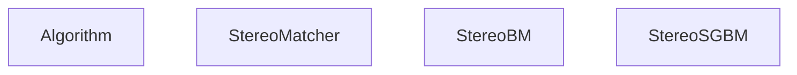
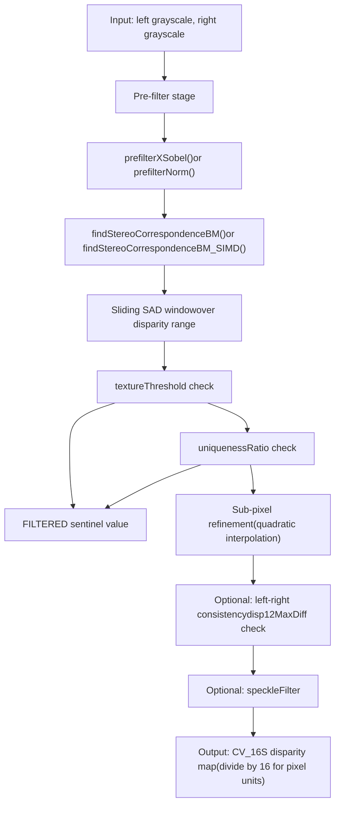
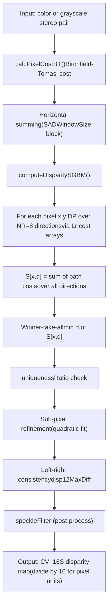
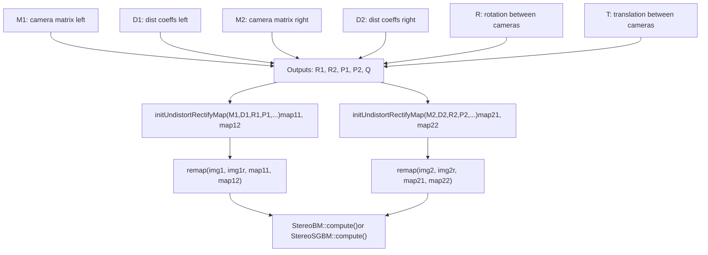
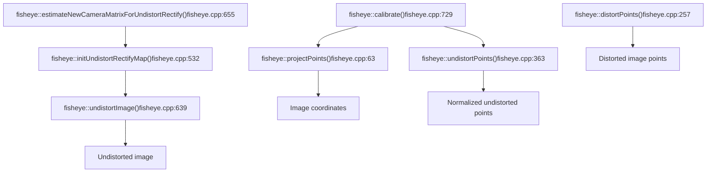
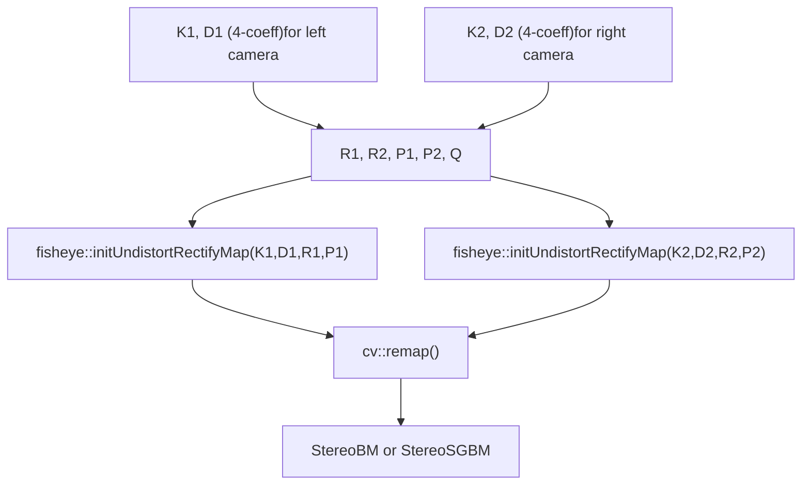

# 立体视觉和鱼眼相机模型

相关源文件

-   [modules/calib3d/misc/objc/gen\_dict.json](https://github.com/opencv/opencv/blob/91c78f50/modules/calib3d/misc/objc/gen_dict.json)
-   [modules/calib3d/perf/opencl/perf\_stereobm.cpp](https://github.com/opencv/opencv/blob/91c78f50/modules/calib3d/perf/opencl/perf_stereobm.cpp)
-   [modules/calib3d/perf/perf\_undistort.cpp](https://github.com/opencv/opencv/blob/91c78f50/modules/calib3d/perf/perf_undistort.cpp)
-   [modules/calib3d/src/fisheye.cpp](https://github.com/opencv/opencv/blob/91c78f50/modules/calib3d/src/fisheye.cpp)
-   [modules/calib3d/src/fisheye.hpp](https://github.com/opencv/opencv/blob/91c78f50/modules/calib3d/src/fisheye.hpp)
-   [modules/calib3d/src/opencl/stereobm.cl](https://github.com/opencv/opencv/blob/91c78f50/modules/calib3d/src/opencl/stereobm.cl)
-   [modules/calib3d/src/stereobm.cpp](https://github.com/opencv/opencv/blob/91c78f50/modules/calib3d/src/stereobm.cpp)
-   [modules/calib3d/src/stereosgbm.cpp](https://github.com/opencv/opencv/blob/91c78f50/modules/calib3d/src/stereosgbm.cpp)
-   [modules/calib3d/src/undistort.dispatch.cpp](https://github.com/opencv/opencv/blob/91c78f50/modules/calib3d/src/undistort.dispatch.cpp)
-   [modules/calib3d/test/opencl/test\_stereobm.cpp](https://github.com/opencv/opencv/blob/91c78f50/modules/calib3d/test/opencl/test_stereobm.cpp)
-   [modules/calib3d/test/test\_fisheye.cpp](https://github.com/opencv/opencv/blob/91c78f50/modules/calib3d/test/test_fisheye.cpp)
-   [modules/calib3d/test/test\_stereomatching.cpp](https://github.com/opencv/opencv/blob/91c78f50/modules/calib3d/test/test_stereomatching.cpp)
-   [modules/calib3d/test/test\_undistort.cpp](https://github.com/opencv/opencv/blob/91c78f50/modules/calib3d/test/test_undistort.cpp)
-   [modules/calib3d/test/test\_undistort\_points.cpp](https://github.com/opencv/opencv/blob/91c78f50/modules/calib3d/test/test_undistort_points.cpp)
-   [modules/core/misc/objc/common/Float6.mm](https://github.com/opencv/opencv/blob/91c78f50/modules/core/misc/objc/common/Float6.mm)
-   [modules/core/misc/objc/common/Point3d.h](https://github.com/opencv/opencv/blob/91c78f50/modules/core/misc/objc/common/Point3d.h)
-   [modules/core/misc/objc/common/Point3d.mm](https://github.com/opencv/opencv/blob/91c78f50/modules/core/misc/objc/common/Point3d.mm)
-   [modules/core/misc/objc/common/Point3f.h](https://github.com/opencv/opencv/blob/91c78f50/modules/core/misc/objc/common/Point3f.h)
-   [modules/core/misc/objc/common/Point3f.mm](https://github.com/opencv/opencv/blob/91c78f50/modules/core/misc/objc/common/Point3f.mm)
-   [modules/core/misc/objc/common/Point3i.h](https://github.com/opencv/opencv/blob/91c78f50/modules/core/misc/objc/common/Point3i.h)
-   [modules/core/misc/objc/common/Point3i.mm](https://github.com/opencv/opencv/blob/91c78f50/modules/core/misc/objc/common/Point3i.mm)
-   [modules/core/test/test\_ptr.cpp](https://github.com/opencv/opencv/blob/91c78f50/modules/core/test/test_ptr.cpp)
-   [modules/features2d/misc/objc/gen\_dict.json](https://github.com/opencv/opencv/blob/91c78f50/modules/features2d/misc/objc/gen_dict.json)
-   [modules/imgproc/src/corner.cpp](https://github.com/opencv/opencv/blob/91c78f50/modules/imgproc/src/corner.cpp)
-   [samples/cpp/stereo\_match.cpp](https://github.com/opencv/opencv/blob/91c78f50/samples/cpp/stereo_match.cpp)

本页记录了 OpenCV 的 `calib3d` 模块中的两个不同的子系统：使用 `StereoBM` 和 `StereoSGBM` 进行立体视差估计**，以及带有专用校准、投影和不失真 API 的 **鱼眼相机模型**。它还涵盖了连接这两个领域的立体声校正工作流程。

有关标准校准中使用的底层针孔相机模型和畸变系数约定，请参阅[Camera Models and Calibration Algorithms](/opencv/opencv/8.1-camera-models-and-calibration-algorithms)。对于`solvePnP`和单应性估计，请参阅[Pose Estimation and Geometric Transforms](/opencv/opencv/8.2-pose-estimation-(solvepnp)-和-几何变换）。

---

## 立体视觉概述

立体视觉通过测量一对校正图像之间的像素位移（视差）来推断深度。 OpenCV 提供了两个具体的立体匹配器：

|班级|算法|成本指标|多次DP|OpenCL|
| --- | --- | --- | --- | --- |
|`StereoBM`|块匹配（SAD）|绝对差值之和|不|是的|
|`StereoSGBM`|半全局块匹配|伯奇菲尔德-托马西|是（4 或 8 个方向）|不|

两者都派生自`StereoMatcher`，而`StereoMatcher`继承自`Algorithm`。 `compute()`虚方法产生视差图。输出视差值以定点格式存储：除以**16.0**以获得像素单位视差（`DISP_SHIFT = 4`，`DISP_SCALE = 16`）。

**立体匹配类层次结构**


来源：[modules/calib3d/src/stereobm.cpp59-103](https://github.com/opencv/opencv/blob/91c78f50/modules/calib3d/src/stereobm.cpp#L59-L103)[modules/calib3d/src/stereosgbm.cpp70-124](https://github.com/opencv/opencv/blob/91c78f50/modules/calib3d/src/stereosgbm.cpp#L70-L124)

---

## 立体声BM

`StereoBM` 是一个基于 SAD 的快速立体匹配器，最初由 Kurt Konolige 贡献。它在[modules/calib3d/src/stereobm.cpp](https://github.com/opencv/opencv/blob/91c78f50/modules/calib3d/src/stereobm.cpp)中实现

### 内部参数结构

`StereoBMParams` 保存所有算法状态：

|场地|默认|描述|
| --- | --- | --- |
|`preFilterType`|`PREFILTER_XSOBEL`|`PREFILTER_XSOBEL` 或 `PREFILTER_NORMALIZED_RESPONSE`|
|`preFilterSize`| 9 |标准化响应滤波器的窗口大小|
|`preFilterCap`| 31 |将预过滤器输出钳位至`[-cap, cap]`|
|`SADWindowSize`| 21 |匹配块大小（必须是奇数）|
|`minDisparity`| 0 |最小预期差异|
|`numDisparities`| 64 |搜索范围（必须能被16整除）|
|`textureThreshold`| 10 |过滤平坦区域中的像素|
|`uniquenessRatio`| 15 |除非比亚军好这个%，否则拒绝比赛|
|`speckleWindowSize`| 0 |散斑后置滤镜窗口|
|`speckleRange`| 0 |散斑滤波器的视差范围|
|`disp12MaxDiff`| \-1 |左右一致性检查最大允许差异|

来源：[modules/calib3d/src/stereobm.cpp59-103](https://github.com/opencv/opencv/blob/91c78f50/modules/calib3d/src/stereobm.cpp#L59-L103)

### 处理管道

**StereoBM 处理流程**


来源：[modules/calib3d/src/stereobm.cpp393-665](https://github.com/opencv/opencv/blob/91c78f50/modules/calib3d/src/stereobm.cpp#L393-L665)[modules/calib3d/src/stereobm.cpp668-1000](https://github.com/opencv/opencv/blob/91c78f50/modules/calib3d/src/stereobm.cpp#L668-L1000)

### 预过滤器

提供了两种 CPU 实现：

- `prefilterNorm()` — 通过滑动窗口总和进行归一化响应；计算强度的局部均值减去、增益归一化版本。
- `prefilterXSobel()` — 水平 Sobel 梯度夹紧到 `[-preFilterCap, preFilterCap]` 移动到 `[0, 2*preFilterCap]`。

条件`preFilterCap <= 31 && SADWindowSize <= 21`（通过`useShorts()`）启用使用16位中间累加器而不是32位（`findStereoCorrespondenceBM_SIMD`）的SIMD快速路径。

OpenCL 内核 `prefilter_norm` 和 `prefilter_xsobel` 是从 [modules/calib3d/src/opencl/stereobm.cl](https://github.com/opencv/opencv/blob/91c78f50/modules/calib3d/src/opencl/stereobm.cl) 编译的，并通过 `ocl_prefilter_norm()` / `ocl_prefilter_xsobel()` 调用。

来源：[modules/calib3d/src/stereobm.cpp106-290](https://github.com/opencv/opencv/blob/91c78f50/modules/calib3d/src/stereobm.cpp#L106-L290)[modules/calib3d/src/opencl/stereobm.cl55-250](https://github.com/opencv/opencv/blob/91c78f50/modules/calib3d/src/opencl/stereobm.cl#L55-L250)

### 缓冲区管理

`BufferBM`通过`utils::BufferArea`预分配所有工作内存，以避免重复的堆分配。它保存`hsad`（水平SAD累加器）、`htext`（纹理总和）和`cbuf0`（按列成本环形缓冲区）的每条带数组。当`useShorts()`为真时，使用`sad_short`和`hsad_short`代替其对应的`int`。

来源：[modules/calib3d/src/stereobm.cpp328-391](https://github.com/opencv/opencv/blob/91c78f50/modules/calib3d/src/stereobm.cpp#L328-L391)

---

## 立体声SGBM

`StereoSGBM` 使用块（而不是像素）成本量实现 Hirschmuller 的半全局匹配算法。它在[modules/calib3d/src/stereosgbm.cpp](https://github.com/opencv/opencv/blob/91c78f50/modules/calib3d/src/stereosgbm.cpp)中实现

### 模式标志

|模式|`isFullDP()`|路线|笔记|
| --- | --- | --- | --- |
|`MODE_SGBM`|错误的|5（大约）|单程|
|`MODE_HH`|真的| 8 |全DP，2次通过|
|`MODE_HH4`|真的| 4 |减少方向|
|`MODE_SGBM_3WAY`|错误的|3路|内部变体|

### StereoSGBM 处理管道

**StereoSGBM 处理流程**


来源：[modules/calib3d/src/stereosgbm.cpp490-550](https://github.com/opencv/opencv/blob/91c78f50/modules/calib3d/src/stereosgbm.cpp#L490-L550)

### 路径成本累积

动态规划在`NR=8`方向上累积路径成本`Lr`。相邻视差转换的惩罚结构为：

- 相同的差异`d`：成本`Lr(p-r, d)`
- 相邻视差`d±1`：成本`Lr(p-r, d±1) + P1`
- 任何其他差异：成本`min_k Lr(p-r, k) + P2`

P1和P2是用户指定的。常见的起点是`P1 = 8 * cn * wsz * wsz`和`P2 = 32 * cn * wsz * wsz`（如[samples/cpp/stereo\_match.cpp233-234](https://github.com/opencv/opencv/blob/91c78f50/samples/cpp/stereo_match.cpp#L233-L234)中所示）。

`BufferSGBM`管理所有暂存存储器，包括`Cbuf`、`Sbuf`、`Lr`、`minLr`和`hsumBuf`。

来源：[modules/calib3d/src/stereosgbm.cpp311-468](https://github.com/opencv/opencv/blob/91c78f50/modules/calib3d/src/stereosgbm.cpp#L311-L468)[modules/calib3d/src/stereosgbm.cpp490-530](https://github.com/opencv/opencv/blob/91c78f50/modules/calib3d/src/stereosgbm.cpp#L490-L530)

---

## 立体声校正

在计算视差之前，必须对来自校准立体装置的图像进行校正，以使对应点位于同一水平扫描线上。

### 整改工作流程

**立体校正工作流程（代码实体）**


来源：[samples/cpp/stereo\_match.cpp199-210](https://github.com/opencv/opencv/blob/91c78f50/samples/cpp/stereo_match.cpp#L199-L210)[modules/calib3d/src/undistort.dispatch.cpp86-200](https://github.com/opencv/opencv/blob/91c78f50/modules/calib3d/src/undistort.dispatch.cpp#L86-L200)

`stereoRectify`输出的矩阵`Q`是重投影矩阵。它允许通过`reprojectImageTo3D(disp, xyz, Q)`将视差图转换为3D点云。

---

## 鱼眼相机模型

`cv::fisheye`命名空间提供了一个单独的相机模型，适用于视野高达 180° 的广角镜头。标准针孔畸变模型（`calibrateCamera`使用）无法准确模拟鱼眼镜头的投影几何形状。

### 数学模型

使用等距（或等角）模型投影 3D 点 `X = (X, Y, Z)`：

1. 投影到归一化平面：`x = X/Z`，`y = Y/Z`
2. 计算半径：`r = sqrt(x² + y²)`
3. 入射角：`θ = atan(r)`
4. 应用多项式失真：

```
θ_d = θ · (1 + k₁θ² + k₂θ⁴ + k₃θ⁶ + k₄θ⁸)
```
5. 量程：`x_d = (θ_d / r) · x`、`y_d = (θ_d / r) · y`
6. 应用相机内部函数：`u = fx · x_d + cx`、`v = fy · y_d + cy`

畸变向量`D`恰好包含**4**系数`[k1, k2, k3, k4]`。相机矩阵`K`是标准的3×3形式，带有可选的倾斜`alpha`。

来源：[modules/calib3d/src/fisheye.cpp126-156](https://github.com/opencv/opencv/blob/91c78f50/modules/calib3d/src/fisheye.cpp#L126-L156)[modules/calib3d/src/fisheye.cpp294-315](https://github.com/opencv/opencv/blob/91c78f50/modules/calib3d/src/fisheye.cpp#L294-L315)

### 比较：针孔畸变与鱼眼畸变

|方面|针孔 (`calibrateCamera`)|鱼眼 (`fisheye::calibrate`)|
| --- | --- | --- |
|投影|看法|等距离|
|畸变系数|最多 14 个（k1–k6、p1、p2、s1–s4、τx、τy）|正好 4 (k1–k4)|
|视场范围|通常 < 120°|高达~180°|
|不失真 API|`undistortPoints`，`initUndistortRectifyMap`|`fisheye::undistortPoints`，`fisheye::initUndistortRectifyMap`|

### API调用图

**Fisheye API 函数及其作用**


来源：[modules/calib3d/src/fisheye.cpp63-723](https://github.com/opencv/opencv/blob/91c78f50/modules/calib3d/src/fisheye.cpp#L63-L723)

### `fisheye::undistortPoints`

畸变的反转是迭代完成的。给定一个观察到的图像点，计算归一化扭曲半径`θ_d`，然后牛顿法求解`θ`：

```
f(θ) = θ(1 + k₁θ² + k₂θ⁴ + k₃θ⁶ + k₄θ⁸) − θ_d = 0
f'(θ) = 1 + 3k₁θ² + 5k₂θ⁴ + 7k₃θ⁶ + 9k₄θ⁸
θ ← θ − f(θ)/f'(θ)
```
该函数接受 `TermCriteria` 来控制迭代计数和 epsilon 收敛。该模型对`θ ∈ (−π/2, π/2)`有效，因此在反演之前将`θ_d`限制在该范围内。非收敛或符号翻转的解决方案产生哨兵`(-1000000, -1000000)`。

来源：[modules/calib3d/src/fisheye.cpp363-527](https://github.com/opencv/opencv/blob/91c78f50/modules/calib3d/src/fisheye.cpp#L363-L527)

### `fisheye::initUndistortRectifyMap`

生成像素级重映射数组（`map1`、`map2`）以供`cv::remap`使用。对于每个目标像素`(j, i)`，它通过以下方式计算扭曲鱼眼图像中相应的源位置：

1. 将 `(P · R)` 的逆应用于目标像素。
2. 计算`r`和`θ = atan(r)`。
3.应用前向失真多项式。
4. 使用`K`进行投影以获得源像素。

支持的 `m1type` 值为 `CV_16SC2`（整数 + 子像素偏移）和 `CV_32F`。

来源：[modules/calib3d/src/fisheye.cpp532-634](https://github.com/opencv/opencv/blob/91c78f50/modules/calib3d/src/fisheye.cpp#L532-L634)

### `fisheye::calibrate`

接受一组相应的 3D 对象点和 2D 图像点（来自棋盘检测）并使用 Levenberg-Marquardt 最小化返回优化的 `K` 和 `D`。内部 `IntrinsicParams` 结构（来自 [modules/calib3d/src/fisheye.hpp](https://github.com/opencv/opencv/blob/91c78f50/modules/calib3d/src/fisheye.hpp)）保存焦距、主点、畸变系数和偏斜：

```
IntrinsicParams {
    Vec2d f;    // focal lengths
    Vec2d c;    // principal point
    Vec4d k;    // distortion [k1,k2,k3,k4]
    double alpha; // skew
}
```
校准标志镜像`calibrateCamera`：`CALIB_FIX_FOCAL_LENGTH`、`CALIB_FIX_PRINCIPAL_POINT`、`CALIB_FIX_SKEW`、`CALIB_FIX_K1`–`CALIB_FIX_K4`、`CALIB_RECOMPUTE_EXTRINSIC`、`CALIB_CHECK_COND`、`CALIB_USE_INTRINSIC_GUESS`。

来源：[modules/calib3d/src/fisheye.cpp729-820](https://github.com/opencv/opencv/blob/91c78f50/modules/calib3d/src/fisheye.cpp#L729-L820)[modules/calib3d/src/fisheye.hpp6-50](https://github.com/opencv/opencv/blob/91c78f50/modules/calib3d/src/fisheye.hpp#L6-L50)

### `fisheye::estimateNewCameraMatrixForUndistortRectify`

计算新的针孔状相机矩阵`P`以获得不失真的输出。它使四个边缘中点不失真，找到结果的边界框，然后在以下各项之间进行平衡：

- `balance = 0`：仅裁剪到有效区域（无黑色边框，较小的 FOV）
- `balance = 1`：包括所有源像素（黑色边框可见，全视场）

`fov_scale` 参数还可以缩放输出焦距。

来源：[modules/calib3d/src/fisheye.cpp655-723](https://github.com/opencv/opencv/blob/91c78f50/modules/calib3d/src/fisheye.cpp#L655-L723)

---

## 鱼眼立体校正

对于带有鱼眼相机的立体设备，校正工作流程将标准 `initUndistortRectifyMap` 替换为 `fisheye::initUndistortRectifyMap`，传递校正旋转 `R1`/`R2` 和从 `stereoRectify` 获得的投影矩阵 `P1`/`P2`。

**鱼眼立体校正工作流程**


来源：[modules/calib3d/src/fisheye.cpp532-648](https://github.com/opencv/opencv/blob/91c78f50/modules/calib3d/src/fisheye.cpp#L532-L648)[samples/cpp/stereo\_match.cpp169-210](https://github.com/opencv/opencv/blob/91c78f50/samples/cpp/stereo_match.cpp#L169-L210)

---

## 视差图输出格式

`StereoBM`和`StereoSGBM`都输出视差图，其值按16缩放（定点，4个小数位）。未找到匹配的像素会收到标记值`(minDisparity - 1) << DISP_SHIFT`。

|手术|代码|
| --- | --- |
|转换为浮动视差|`disp.convertTo(dispF, CV_32F, 1.0/16.0)`|
|转换为8位用于显示|`disp.convertTo(disp8, CV_8U, 255.0/(numDisp*16.0))`|

Filtered/invalid像素设置为值`FILTERED = (minDisparity - 1) << 4`，并且可以在转换后通过检查小于`minDisparity`的值来识别。

来源：[modules/calib3d/src/stereobm.cpp293-325](https://github.com/opencv/opencv/blob/91c78f50/modules/calib3d/src/stereobm.cpp#L293-L325)[modules/calib3d/src/stereosgbm.cpp493-508](https://github.com/opencv/opencv/blob/91c78f50/modules/calib3d/src/stereosgbm.cpp#L493-L508)[samples/cpp/stereo\_match.cpp256-276](https://github.com/opencv/opencv/blob/91c78f50/samples/cpp/stereo_match.cpp#L256-L276)

---

## 测试

|测试文件|覆盖范围|
| --- | --- |
|[modules/calib3d/test/test\_fisheye.cpp](https://github.com/opencv/opencv/blob/91c78f50/modules/calib3d/test/test_fisheye.cpp)|`projectPoints`、`distortPoints`、`undistortPoints`、`undistortImage`、`calibrate`、`solvePnP`、雅可比精度|
|[modules/calib3d/test/test\_stereomatching.cpp](https://github.com/opencv/opencv/blob/91c78f50/modules/calib3d/test/test_stereomatching.cpp)|StereoBM/SGBM 质量指标：RMS 误差、坏像素分数、遮挡掩模、深度不连续性掩模|
|[modules/calib3d/test/opencl/test\_stereobm.cpp](https://github.com/opencv/opencv/blob/91c78f50/modules/calib3d/test/opencl/test_stereobm.cpp)|OCL 与 CPU StereoBM 结果比较|
|[modules/calib3d/perf/opencl/perf\_stereobm.cpp](https://github.com/opencv/opencv/blob/91c78f50/modules/calib3d/perf/opencl/perf_stereobm.cpp)|OCL StereoBM 的性能基准|
